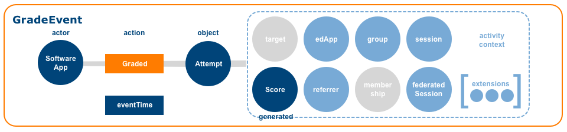

<div style="design: block;margin: 0 auto"></div>

# IMS Global Learning Consortium, Inc.

# Caliper Analytics&reg; Specification, version 1.1

## IPR and Distribution Notices

Recipients of this document are requested to submit, with their comments, notification of any relevant patent claims or other intellectual property rights of which they may be aware that might be infringed by any implementation of the specification set forth in this document, and to provide supporting documentation.

IMS takes no position regarding the validity or scope of any intellectual property or other rights that might be claimed to pertain to the implementation or use of the technology described in this document or the extent to which any license under such rights might or might not be available; neither does it represent that it has made any effort to identify any such rights. Information on IMS’s procedures with respect to rights in IMS specifications can be found at the IMS Intellectual Property Rights web page: [http://www.imsglobal.org/ipr/imsipr_policyFinal.pdf](http://www.imsglobal.org/ipr/imsipr_policyFinal.pdf).

Copyright &copy; 2018 IMS Global Learning Consortium. All Rights Reserved.

Use of this specification to develop products or services is governed by the license with IMS found on the IMS website: http://www.imsglobal.org/speclicense.html.

Permission is granted to all parties to use excerpts from this document as needed in producing requests for proposals.

The limited permissions granted above are perpetual and will not be revoked by IMS or its successors or assigns.

THIS SPECIFICATION IS BEING OFFERED WITHOUT ANY WARRANTY WHATSOEVER, AND IN PARTICULAR, ANY WARRANTY OF NON INFRINGEMENT IS EXPRESSLY DISCLAIMED. ANY USE OF THIS SPECIFICATION SHALL BE MADE ENTIRELY AT THE IMPLEMENTER'S OWN RISK, AND NEITHER THE CONSORTIUM, NOR ANY OF ITS MEMBERS OR SUBMITTERS, SHALL HAVE ANY LIABILITY WHATSOEVER TO ANY IMPLEMENTER OR THIRD PARTY FOR ANY DAMAGES OF ANY NATURE WHATSOEVER, DIRECTLY OR INDIRECTLY, ARISING FROM THE USE OF THIS SPECIFICATION.

## Table of Contents

* 1.0 [Introduction](#introduction)
  * 1.1 [Status of this Document](#docStatus)
  * 1.2 [Summary of Changes](#changes)
  * 1.3 [Conventions](#conventions)
  * 1.4 [Terminology](#terminology)
* 2.0 [The Information Model](#infoModel)
  * 2.1 [Event](#event)
  * 2.2 [Entity](#entity)
* 3.0 [Metric Profiles](#profiles)
  * 3.1 [Annotation Profile](#annotationProfile)
  * 3.2 [Assessment Profile](#assessmentProfile)
  * 3.3 [Assignable Profile](#assignableProfile)
  * 3.4 [Forum Profile](#forumProfile)
  * 3.5 [Grading Profile](#gradingProfile)
  * 3.6 [Media Profile](#mediaProfile)
  * 3.7 [Reading Profile](#readingProfile)
  * 3.8 [Session Profile](#sessionProfile)
  * 3.9 [Tool Use Profile](#toolUseProfile)
  * 3.10 [General Profile](#generalProfile)
* 4.0 [Serialization of the Model](#dataSerialization)
  * 4.1 [JSON-LD Context](#jsonldContext)
  * 4.2 [Identifiers](#jsonldIdentifiers)
  * 4.3 [Types and Type Coercion](#jsonldTypes)
  * 4.4 [Anonymous Entities](#anonymousEntities)
* 5.0 [Sensor API](#sensor)
  * 5.1 [Behavior](#sensorBehavior)
  * 5.2 [Envelope](#envelope)
  * 5.3 [JSON-LD Payload](#jsonldPayload)
  * 5.4 [HTTP Requests](#httpRequest)
* 6.0 [Endpoint](#endpoint)
  * 6.1 [HTTP Responses](#httpResponse)
  * 6.2 [Endpoint Configuration](#endpointConfiguration)
  * 6.3 [String Lengths and Storage](#stringLengths)
* [Appendix A. Actions](#actions)
* [Appendix B. Event Subtypes](#events)
  * B.1 [AnnotationEvent](#annotationEvent)
  * B.2 [AssessmentEvent](#assessmentEvent)
  * B.3 [AssessmentItemEvent](#assessmentItemEvent)
  * B.4 [AssignableEvent](#assignableEvent)
  * B.5 [ForumEvent](#forumEvent)
  * B.6 [GradeEvent](#gradeEvent)
  * B.7 [MediaEvent](#mediaEvent)
  * B.8 [MessageEvent](#messageEvent)
  * B.9 [NavigationEvent](#navigationEvent)
  * B.10 [~~OutcomeEvent~~](#outcomeEvent)
  * B.11 [~~ReadingEvent~~](#readingEvent)
  * B.12 [SessionEvent](#sessionEvent)
  * B.13 [ThreadEvent](#threadEvent)
  * B.14 [ToolUseEvent](#toolUseEvent)
  * B.15 [ViewEvent](#viewEvent)
* [Appendix C. Entity Subtypes](#entities)
  * C.1 [Agent](#agent)
  * C.2 [Annotation](#annotation)
  * C.3 [Assessment](#assessment)
  * C.4 [AssessmentItem](#assessmentItem)
  * C.5 [AssignableDigitalResource](#assignableDigitalResource)
  * C.6 [Attempt](#attempt)
  * C.7 [AudioObject](#audioObject)
  * C.8 [BookmarkAnnotation](#bookmarkAnnotation)
  * C.9 [Chapter](#chapter)
  * C.10 [CourseOffering](#courseOffering)
  * C.11 [CourseSection](#courseSection)
  * C.12 [DigitalResource](#digitalResource)
  * C.13 [DigitalResourceCollection](#digitalResourceCollection)
  * C.14 [Document](#document)
  * C.15 [~~EpubChapter~~](#epubChapter)
  * C.16 [~~EpubPart~~](#epubPart)
  * C.17 [~~EpubSubChapter~~](#epubSubChapter)
  * C.18 [~~EpubVolume~~](#epubVolume)
  * C.19 [FillinBlankResponse](#fillinBlankResponse)
  * C.20 [Forum](#forum)
  * C.21 [Frame](#frame)
  * C.22 [Group](#group)
  * C.23 [HighlightAnnotation](#highlightAnnotation)
  * C.24 [ImageObject](#imageObject)
  * C.25 [LearningObjective](#learningObjective)
  * C.26 [LtiSession](#ltiSession)
  * C.27 [MediaLocation](#mediaLocation)
  * C.28 [MediaObject](#mediaObject)
  * C.29 [Membership](#membership)
  * C.30 [Message](#message)
  * C.31 [MultipleChoiceResponse](#multipleChoiceResponse)
  * C.32 [MultipleResponseResponse](#multipleResponseResponse)
  * C.33 [Organization](#organization)
  * C.34 [Page](#page)
  * C.35 [Person](#person)
  * C.36 [~~Reading~~](#reading)
  * C.37 [Response](#response)
  * C.38 [Result](#result)
  * C.39 [Score](#score)
  * C.40 [SelectTextResponse](#selectTextResponse)
  * C.41 [Session](#session)
  * C.42 [SharedAnnotation](#sharedAnnotation)
  * C.43 [SoftwareApplication](#softwareApplication)
  * C.44 [TagAnnotation](#tagAnnotation)
  * C.45 [Thread](#thread)
  * C.46 [TrueFalseResponse](#trueFalseResponse)
  * C.47 [VideoObject](#videoObject)
  * C.48 [WebPage](#webPage)
* [Appendix D. Selectors](#selectors)
  * D.1 [TextPositionSelector](#textPositionSelector)
* [Appendix E. Roles](#roles)
* [Appendix F. Status](#status)
* [Appendix G. Minimum Supported String Lengths](#minSupportedStringLengths)
* [Appendix H. Change Log](#changeLog)
  * H.1 [In-place Corrections 24 May 2018](#changeLogCorrections20180524)
  * H.2 [Caliper 1.1](#changeLogCaliperv1p1)
    * H.2.1 [Profiles](#changeLogProfiles)
    * H.2.2 [Actions](#changeLogActions)
    * H.2.3 [Events](#changeLogEvents)
    * H.2.4 [Entities](#changeLogEntities)
    * H.2.5 [Properties](#changeLogProperties)
    * H.2.6 [JSON-LD Context](#changeLogJsonldContext)
* [Contributors](#contributors)
* [References](#references)
* [About this Document](#aboutThisDoc)

## <a name="introduction"></a>1.0. Introduction

Delivering teaching and learning at scale is encouraging adoption of “big data” practices.  Cloud computing and machine learning are changing both the learning technology landscape and the business of education.  The definition of what constitutes learning is also evolving beyond the formal classroom experience to include informal, social and experiential modes of acquiring knowledge and skills.  Opportunities exist to leverage new tools, tap new data sources, ask new questions and pursue new insights.

Consider the enterprising instructor seeking to augment if not transform the classroom environment for her students.  She utilizes a video platform to create and post video assignments.  Class discussions and Q&A sessions are conducted online using another service.  She administers her course using a learning management system.  Three services, three vendors, three potential sources of learning data.  

Analyzing the viewing behavior of her students in relation to the questions they pose about her course content is vital to understanding student comprehension and performance.  Yet exploring such relationships is all too often a challenging exercise.  Likely there are significant barriers to overcome.  Is the data required for analysis actually collected?  If it exists, who owns it?  If ownership is not an issue what about privacy concerns?  If privacy protocols are in place is the data easy to retrieve?  If retrievable how difficult is it to combine with data sourced from other platforms?

The Caliper Analytics&reg; specification seeks to address a number of the issues outlined above by providing a structured approach to describing, collecting and exchanging learning activity data.  Establishing a common vocabulary for describing learning interactions is a central objective.  Promoting data interoperability, data sharing and data-informed decision making are also important goals.

Caliper also defines an application programming interface (the Sensor API&trade;) for marshalling and transmitting event data from instrumented applications to target endpoints for storage, analysis and use.  Industry-wide adoption of Caliper offers the tantalizing prospect of a more unified learning data environment in which to build new and innovative services designed to measure, infer, predict, report and visualize.

### <a name="docStatus"></a>1.1 Status of this Document
This document is considered the _Final Release_.  This means that the Caliper Analytics&reg; Specification, version 1.1, is now made available as a public document following acceptance by IMS Global member organizations, a number of whom have successfully achieved conformance certification at the time of the release of this document.
IMS Global strongly encourages its members and the greater public to provide feedback that focuses on improving the Caliper specification. To join the IMS developer and conformance certification community focused on Caliper please visit https://www.imsglobal.org/activity/caliper.
Public comments and questions can be posted at the Caliper Analytics&reg; [public forum](https://www.imsglobal.org/forums/ims-glc-public-forums-and-resources/caliper-analytics-public-forum).

### <a name="changes"></a>1.2 Summary of Changes
Caliper 1.1 extends as well as refines the Caliper information model and further describes the ways in which Events and Entities can be expressed as [Linked Data](#linkedDataDef) when authoring documents using [JSON-LD](#jsonldDef).

Three new profiles are provided: the [General Profile](#generalProfile), [Forum Profile](#forumProfile) and [ToolUse Profile](#toolUseProfile).  The AssessmentItem Profile has been merged into the [Assessment Profile](#assessmentProfile).  The Outcome Profile has been renamed the [Grading Profile](#gradingProfile) and a new [Score](#score) entity has been added.  Both the [Forum Profile](#forumProfile) and the [ToolUse Profile](#toolUseProfile) add new event types to the Caliper event model: [ForumEvent](#forumEvent), [ThreadEvent](#threadEvent), [MessageEvent](#messageEvent), [ToolUseEvent](#toolUseEvent).  New entities and actions are also provided to better describe forum activities and tool use. 

The [ReadingEvent](#readingEvent) has been deprecated while the [OutcomeEvent](#outcomeEvent) has been replaced by the [GradeEvent](#gradeEvent).  Certain action vocabularies have been adjusted as a result of additions and/or removals.  These include actions associated with the [AnnotationEvent](#annotationEvent), [AssessmentEvent](#assessmentEvent), [AssessmentItemEvent](#assessmentItemEvent), [AssignableEvent](#assignableEvent) and [MediaEvent](#mediaEvent).  A number of entities have also been deprecated.  The list includes [EpubChapter](#epubChapter), [EpubPart](#epubPart), [EpubSubChapter](#epubSubChapter), [EpubVolume](#epubVolume) and [Reading](#reading).

Regarding property changes, use of the [JSON-LD](#jsonldDef) `@id` and `@type` keywords have been deprecated in favor of `id` and `type`.  The Caliper [Event](#event) now includes an identifier `id` property  as well as new `referrer`, `session` and `extensions` attributes.  [Entity](#entity) property additions, name changes and deprecations also feature in this new release.

[Sensor](#sensor) and [endpoint](#endpoint) behaviors are more fully described and the new specification also clarifies how to express Caliper events and entities in a [JSON-LD](#jsonldDef) document.   A new Caliper [JSON-LD](#jsonldDef) context document is also provided to map Caliper terms to their respective [IRIs](iriDef).
This version of the specification is versioned 1.1-errata.01.  It includes a number of minor typographical and text duplication errors uncovered when the document was translated into Korean.

All these changes are described in more detail in [Appendix H. Change Log](#changeLog).

### <a name="conventions"></a>1.3 Conventions

The key words "MUST", "MUST NOT", "REQUIRED", "SHALL", "SHALL NOT", "SHOULD", "SHOULD NOT", "RECOMMENDED",  "MAY", and "OPTIONAL" in this document are to be interpreted as described in [RFC 2119](#rfc2119).  A Sensor implementation that fails to implement a MUST/REQUIRED/SHALL requirement or fails to abide by a MUST NOT/SHALL NOT prohibition is considered nonconformant.  SHOULD/SHOULD NOT/RECOMMENDED statements constitute a best practice.  Ignoring a best practice does not violate conformance but a decision to disregard such guidance should be carefully considered by implementers.  MAY/OPTIONAL statements indicate that implementers are entirely free to choose whether or not to implement the option.

### <a name="terminology"></a>1.4 Terminology

<a name="actorDef"></a>__Actor__: An actor is an [Agent](#agent) capable of initiating or performing an [action](#actionDef) on a thing or as part of a process.  A Caliper [Event](#event) includes an `actor` attribute for representing the [Agent](#agent).

<a name="anonymousDef"></a>__Anonymous__, __Anonymization__: Applying a process to transform the properties of an [Entity](#entity) to obscure its identity such that the process cannot be reversed nor can the entity be afterwards distinguished from other such-treated entities renders the entity _anonymous_.

<a name="blankNodeDef"></a>__Blank Node Identifier__: a string that begins with "_:" that is used to identify an [Entity](#entity) for which an [IRI](#iriDef) is not provided.  An [Entity](#entity) provisioned with a blank node identifier is neither dereferenceable nor has meaning outside the scope of the [JSON-LD](#jsonldDef) document within which it resides.

<a name="actionDef"></a>__Action__: something performed or done to accomplish a purpose.  Caliper [Event](#event) subtypes define a controlled vocabulary of one or more [actions](#actions) relevant to the activity domain.  A Caliper [Event](#event) includes an `action` attribute for expressing the associated action.     

<a name="contextDef"></a>__Context__: a special [JSON-LD](http://json-ld.org/spec/latest/json-ld/) keyword that maps the terms employed in a JSON document to [IRIs](https://www.ietf.org/rfc/rfc3987.txt) that link to one or more published vocabularies.  Inclusion of a [JSON-LD](http://json-ld.org/spec/latest/json-ld/) context provides an economical way of communicating document semantics to services interested in consuming Caliper event data.

<a name="depersonalizedDef"></a>__Depersonalized__, __Depersonalize__: Applying a process to transform the properties of an [Entity](#entity) to obscure its identity such that the process might be reversable and preserving the ability to afterwards distinguish from other such-treated entities renders the entity _depersonalized_.

<a name="describeDef"></a>__Describe__: a Caliper message containing an [Entity](#entity) that is not directly associated with an [Event](#event). Entities can be sent asynchronously from events using `Describe` messages in order to reduce verbosity (e.g. sending a [Person](#person) entity as a `Describe` avoids having to repeat the [Person](#person) object in each [Event](#event) that includes it).

<a name="endpointDef"></a>__Endpoint__: a receiver or consumer of Caliper data that is bound to a specific network protocol.  

<a name="entityDef"></a>__Entity__: an object or a thing that participates in learning-related activity.  Caliper [Entity](#entity) types provide coarsed-grained representations of applications, people, groups and resources that constitute the "stuff" of a Caliper [Event](#event).  Each [Entity](#entity) corresponds to a node in a directed graph.

<a name="envelopeDef"></a>__Envelope__: a data structure that serves as a transport container of Caliper [Event](#eventDef) and [Entity](#entityDef) data.  The envelope also includes metadata about the emitting [Sensor](#sensor) and the data payload.

<a name="eventDef"></a>__Event__: describes a relationship established between an [Agent](#agent) (the `actor`) and an [Entity](#entity) (the `object`) formed as a result of a purposeful `action` undertaken by the `actor` in connection to the `object` at a particular moment in time.

<a name="jsonldDef"></a>__JSON-LD__: a specification providing a JSON-based data serialization and messaging format, processing algorithms and API for working with [Linked Data](#linkedData).  The messages described in this specification are intended to be used in programming environments that support [JSON-LD](http://json-ld.org/spec/latest/json-ld/).

<a name="iriDef"></a>__IRI__: The Internationalized Resource Identifier (IRI) extends the Uniform Resource Identifier ([URI](#uriDef)) scheme by using characters drawn from the Universal character set rather than US-ASCII per [RFC 3987](https://www.ietf.org/rfc/rfc3987.txt).  [Linked Data](#linkedData) rely on IRIs to refer to most nodes and properties.

<a name="iso8601Def"></a>__ISO 8601__: Caliper data and time values are formatted per ISO 8601 with the addition of millisecond precision.  The format is yyyy-MM-ddTHH:mm:ss.SSSZ where 'T' separates the date from the time while 'Z' indicates that the time is set to UTC.

<a name="linkedDataDef"></a>__Linked Data__: A set of design principles first articulated by Tim Berners-Lee for discovering, connecting, and sharing structured data over the Web.  The principles can be summarized as follows: use [IRIs](#iriDef)/[URIs](#uriDef) as names for things; use HTTP [IRIs](#iriDef)/[URIs](#uriDef) so that information about things (e.g., people, objects, concepts) can be retrieved using a standard format; link out to other relevant things by way of their [IRIs](#iriDef)/[URIs](#uriDef) in order to promote discovery of new relationships between things.

<a name="lisDef"></a>__LIS__: Learning Information Services&reg; (LIS&reg;) is an IMS standard that defines how systems manage the exchange of information that describes people, groups, memberships, courses and outcomes.

<a name="ltiDef"></a>__LTI__: Learning Tools Interoperability&reg; (LTI&reg;) is an IMS standard for integration of rich learning applications within educational environments.

<a name="metricProfileDef"></a>__Metric Profile__: models a learning activity or a supporting activity that helps facilitate learning.  Each profile provides a domain-specific set of terms and concepts that application designers and developers can draw upon to describe common user interactions in a consistent manner using a shared vocabulary.

<a name="objectDef"></a>__Object__: an [Entity](#entity) that an [Agent](#agent) interacts with that becomes the focus, target or object of an interaction.  A Caliper [Event](#event) includes an `object` attribute for representing the resource.

<a name="sensorDef"></a>__Sensor__: Software assets deployed within a learning application that implement the [Sensor API&trade;](#sensorAPIDef) for marshalling and transmitting Caliper data to a target endpoint.

<a name="sensorAPIDef"></a>__Sensor API&trade;__: The standard set of methods and supported parameters that a [Sensor](#sensorDef) implements according to this specification in order to transmit Caliper data in an interoperable way.

<a name="termDef"></a>__Term__: a word or short expression that expands to an [IRI](#iriDef) when mapped to a JSON-LD [context](#contextDef) document. Terms are employed by Caliper as `type` property string values in order to distinguish between various JSON representations of entities and events defined by the Caliper information model.

<a name="typeCoercionDef"></a>__Type Coercion__: the process of coercing values to a particular data type.

<a name="uriDef"></a>__URI__:  the Uniform Resource Identifier ([URI](#uriDef)) utilizes the US-ASCII character set to identify a resource.  Per [RFC 2396](#rfc2396) a [URI](#uriDef) "can be further classified as a locator, a name or both."  Both the Uniform Resource Locator ([URL](#urlDef)) and the Uniform Resource Name ([URN](#urnDef)) are considered subspaces of the more general [URI](#uriDef) space.

<a name="urlDef"></a>__URL__: A Uniform Resource Locator ([URL](#urlDef)) is a type of [URI](#uriDef) that provides a reference to resource that specifies both its location and a means of retrieving a representation of it.  An HTTP [URI](#uriDef) is a [URL](#urlDef) and using HTTP IRIs/URIs to identify things is fundamental to Linked Data.

<a name="urnDef"></a>__URN__: A Uniform Resource Name ([URN](#urnDef)) is a type of [URI](#uriDef) that provides a persistent identifier for a resource that is bound to a defined namespace.  Unlike a [URL](#urlDef) a [URN](#urnDef) is location-independent and provides no means of accessing a representation of the named resource.  

<a name="uuidDef"></a>__UUID__: a 128-bit identifier that does not require a registration authority to assure uniqueness.  However, absolute uniqueness is not guaranteed although the collision probability is considered extremely low. Caliper recommends use of randomly or pseudo-randomly generated version 4 UUIDs.  Each Caliper [Event](#event) MUST be assigned a UUID that is expressed as a [URN](#urnDef) using the form `urn:uuid:<UUID>` as described in [RFC 4122](#rfc4122).

## <a name="infoModel"></a>2.0 The Information Model

The Caliper information model defines a set of concepts, rules, and relationships for describing learning activities.  Each activity domain modeled is described in a [Metric Profile](#infoModelProfiles) ("profile").  Each profile is composed of one or more [Event](#event) types.  Each [Event](#event) defines a controlled vocabulary of [actions](#actions) undertaken by learners, instructors, and others, that are scoped to the event.  Various [Entity](#entity) types representing people, groups, and resources are provided in order to better describe both the relationships established between participating entities and the contextual elements relevant to the interaction.

### <a name="event"></a>2.1 The Caliper Event

<div style="design: block;margin: 0 auto"></div>

A Caliper [Event](#event) is a generic type that describes the relationship established between an `actor` and an `object`, formed as a result of a purposeful [action](#actions) undertaken by the `actor` at a particular moment in time and within a given learning context.  The [Event](#event) properties `actor`, `action` and `object` form a compact data structure that resembles an [RDF](#rdf) triple linking a subject to an object via a predicate.  A learner starting an assessment, annotating a reading, pausing a video, or posting a message to a forum, are examples of learning activities that Caliper models as events.

Caliper defines a number of [Event](#event) subtypes, each scoped to a particular activity domain and distinguishable by a `type` attribute.  The `type` value is a string that MUST match the [Term](#termDef) specified for the [Event](#event) by the Caliper information model (e.g. "MessageEvent").  Each [Event](#event) instance is assigned a 128-bit long universally unique identifier (UUID) formatted as a [URN](#urnDef) per [RFC 4122](#rfc4122), which describes a [URN](#urnDef) namespace for [UUIDs](#uuidDef).  

The information model also seeks to describe the learning environment or context in which a learning activity is situated.  Group affiliation, membership roles and status, recent navigation history, supporting technology and session information can all be optionally represented.  An [Entity](#entity) generated as a result of the interaction between an `actor` and an `object` can also be described; annotating a piece of digital content and producing an [Annotation](#annotation) is one such example.  An `extensions` property is also provided so that implementers can add custom attributes not described by the model.  

#### Properties
Considered as a data structure an [Event](#event) constitutes an unordered set of key:value pairs that is semi-structured by design.  Optional attributes can be ignored when describing an [Event](#event).  An [Entity](#entity) participating in an [Event](#event) can be represented as an object or as a string that corresponds to the [IRI](#iriDef) defined for the [Entity](#entity).

The base set of [Event](#event) properties or attributes is listed below.  Each property MUST be referenced only once.  The `id`, `type`, `actor`, `action`, `object` and `eventTime` properties are required; all other properties are optional.  Custom attributes not described by the model MAY be included but MUST be added to the `extensions` property as a map of key:value pairs.  Properties with a value of *null* or empty SHOULD be excluded prior to serialization.

| Property | Type | Description | Disposition |
| :------- | :--- | ----------- | :---------: |
| id | [UUID](#uuidDef) | The emitting application MUST provision the [Event](#event) with a [UUID](#uuidDef).  A version 4 [UUID](#uuidDef) SHOULD be generated.  The UUID MUST be expressed as a [URN](#urnDef) using the form `urn:uuid:<UUID>` per [RFC 4122](#rfc4122). | Required |
| type | [Term](#termDef) | A string value corresponding to the [Term](#termDef) defined for the [Event](#event) in the external IMS Caliper JSON-LD [context](http://purl.imsglobal.org/ctx/caliper/v1p1) document.  For a generic [Event](#event) set the `type` to the string value *Event*.  If a subtype of [Entity](#entity) is created, set the `type` to the [Term](#termDef) corresponding to the subtype utilized, e.g., *NavigationEvent*. | Required |
| actor | [Agent](#agent) &#124; [IRI](#iriDef) | The [Agent](#agent) who initiated the [Event](#event), typically though not always a [Person](#person).  The `actor` value MUST be expressed either as an object or as a string corresponding to the actor's [IRI](#iriDef). | Required |
| action | [Term](#termDef) | The action or predicate that binds the actor or subject to the object.  The `action` range is limited to the set of [actions](#actions) described in this specification and may be further constrained by the chosen [Event](#event) type.  Only one `action` [Term](#termDef) may be specified per [Event](#event). | Required |
| object | [Entity](#entity) &#124; [IRI](#iriDef) | The [Entity](#entity) that comprises the object of the interaction.  The `object` value MUST be expressed either as an object or as a string corresponding to the object's [IRI](#iriDef). | Required |
| eventTime | DateTime | An ISO 8601 date and time value expressed with millisecond precision that indicates when the [Event](#event) occurred.  The value MUST be expressed using the format YYYY-MM-DDTHH:mm:ss.SSSZ set to UTC with no offset specified. | Required |
| target | [Entity](#entity) &#124; [IRI](#iriDef) | An [Entity](#entity) that represents a particular segment or location within the `object`.  The `target` value MUST be expressed either as an object or as a string corresponding to the target entity's [IRI](#iriDef). | Optional |
| generated | [Entity](#entity) &#124; [IRI](#iriDef)  | An [Entity](#entity) created or generated as a result of the interaction.  The `generated` value MUST be expressed either as an object or as a string corresponding to the generated entity's [IRI](#iriDef). | Optional |
| edApp | [SoftwareApplication](#softwareApplication) &#124; [IRI](#iriDef) | A [SoftwareApplication](#softwareApplication) that constitutes the application context.  The `edApp` value MUST be expressed either as an object or as a string corresponding to the edApp's [IRI](#iriDef). | Optional |
| referrer | [Entity](#entity) &#124; [IRI](#iriDef) | An [Entity](#entity) that represents the referring context. A [SoftwareApplication](#softwareApplication) or [DigitalResource](#digitalResource) will typically constitute the referring context.  The `referrer` value MUST be expressed either as an object or as a string corresponding to the referrer's [IRI](#iriDef). | Optional |
| group | [Organization](#organization) &#124; [IRI](#iriDef) | An [Organization](#organization) that represents the group context.  The `group` value MUST be expressed either as an object or as a string corresponding to the group's [IRI](#iriDef). | Optional |
| membership | [Membership](#membership) &#124; [IRI](#iriDef) | The relationship between the `actor` and the `group` in terms of roles assigned and current status.  The `membership` value MUST be expressed either as an object or as a string corresponding to the membership entity's [IRI](#iriDef). | Optional |
| session | [Session](#session) &#124; [IRI](#iriDef) | The current user [Session](#session).  The `session` value MUST be expressed either as an object or as a string corresponding to the session's [IRI](#iriDef). | Optional |
| federatedSession | [LtiSession](#ltiSession) &#124; [IRI](#iriDef) | If the [Event](#event) occurs within the context of an [LTI](#ltiDef) tool launch, the actor's tool consumer [LtiSession](#ltiSession) MAY be referenced.  The `federatedSession` value MUST be expressed either as an object or as a string corresponding to the federatedSession's [IRI](#iriDef). | Optional |
| extensions | Object | A map of additional attributes not defined by the model MAY be specified for a more concise representation of the [Event](#event). | Optional |

#### Subtypes
[AnnotationEvent](#annotationEvent), [AssignableEvent](#assignableEvent), [AssessmentEvent](#assessmentEvent), [AssessmentItemEvent](#assessmentItemEvent), [ForumEvent](#forumEvent), [MediaEvent](#mediaEvent), [MessageEvent](#messageEvent), [NavigationEvent](#navigationEvent), [GradeEvent](#gradeEvent), [SessionEvent](#sessionEvent), [ToolUseEvent](#toolUseEvent), [ThreadEvent](#threadEvent), [ViewEvent](#viewEvent)

#### Deprecated subtypes
[OutcomeEvent](#outcomeEvent), [ReadingEvent](#readingEvent)

### <a name="entity"></a>2.2 The Caliper Entity

<div style="design: block;margin: 0 auto"></div>

A Caliper [Entity](#entity) is a generic type that represents objects that participate in learning-related activities.  A variety of [Entity](#entity) subtypes have been defined in order to better describe people, groups, organizations, digital content, courses, software applications, and other objects that constitute the "stuff" of a Caliper [Event](#event).  Each [Entity](#entity) is provisioned with a modest set of properties or attributes that support discovery and description.

Caliper permits [Entity](#entity) values to be expressed either as an object or as a string corresponding to the resource's [IRI](#iriDef).

If the [Entity](#entity) is expressed as an object, both the `id` and `type` properties MUST be specified.  The `type` value is a string that MUST match the term specified for the [Entity](#entity) by the Caliper information model (e.g. "Person").  The `id` value is a string that MUST be expressed as an [IRI](#iriDef).  The [IRI](#iriDef) MUST be valid and unique.  The [IRI](#iriDef) SHOULD also be dereferenceable, i.e., capable of returning a representation of the resource assuming authorization to access the resource is granted.  A [URI](#uriDef) employing the [URN](#urnDef) scheme MAY be provided although care should be taken when employing a location-independent identifier since it precludes the possibility of utilizing it to retrieve machine-readable data over HTTP.

Other [Entity](#entity) properties are descriptive in nature, or link the [Entity](#entity) to other related entities.  Certain [Entity](#entity) subtypes like [Annotation](#annotation), [DigitalResource](#digitalResource), [Message](#message) or [Organization](#organization) are provisioned with additional properties that allow for a more complete representation of the object.  An `extensions` property is also defined so that implementers can add custom attributes not described by the model.  Optional properties can be ignored when describing an [Entity](#entity).    

#### Properties
Like an [Event](#event), an [Entity](#entity) is considered semi-structured data consisting of an unordered set of key:value pairs.  The base set of [Entity](#entity) properties is listed below.  Each property MUST be referenced only once.  When representing an [Entity](#entity) as an object the `id` and `type` properties are required; all other properties are optional and need not be referenced when describing an [Entity](#entity).  Custom attributes not described by the model MAY be included but MUST be added to the `extensions` property as a map of key:value pairs.  Properties with a value of *null* or empty SHOULD be excluded prior to serialization.

| Property | Type | Description | Disposition |
| :------- | :--- | ----------- | :---------: |
| id | [IRI](#iriDef) | A valid [IRI](#iriDef) MUST be specified. The [IRI](#iriDef) MUST be unique and persistent. The [IRI](#iriDef) SHOULD also be dereferenceable, i.e., capable of returning a representation of the resource. A [URI](#uriDef) employing the [URN](#urnDef) scheme MAY be provided in cases where a [Linked Data](#linkedDataDef) friendly HTTP URI is either unavailable or inappropriate. | Required |
| type | [Term](#termDef) | A string value corresponding to the [Term](#termDef) defined for the [Entity](#entity) in the external IMS Caliper JSON-LD [context](http://purl.imsglobal.org/ctx/caliper/v1p1) document.  For a generic [Entity](#entity) set the `type` value to the term *Entity*.  If a subtype of [Entity](#entity) is created, set the type to the [Term](#termDef) corresponding to the subtype utilized, e.g., *Person*. | Required |
| name | string | A string value comprising a word or phrase by which the [Entity](#entity) is known. | Optional |
| description | string |  A string value comprising a brief, written representation of the [Entity](#entity). | Optional |
| dateCreated | DateTime | An ISO 8601 date and time value expressed with millisecond precision that describes when the [Entity](#entity) was created.  The value MUST be expressed using the format YYYY-MM-DDTHH:mm:ss.SSSZ set to UTC with no offset specified. | Optional |
| dateModified | DateTime | An ISO 8601 date and time value expressed with millisecond precision that describes when the [Entity](#entity) was last changed or updated.  The value MUST be expressed using the format YYYY-MM-DDTHH:mm:ss.SSSZ set to UTC with no offset specified. | Optional |
| extensions | Object | A map of additional attributes not defined by the model MAY be specified for a more concise representation of the [Entity](#entity). | Optional |

#### Subtypes
[Agent](#agent), [Annotation](#annotation), [Assessment](#assessment), [AssessmentItem](#assessmentItem), [AssignableDigitalResource](#assignableDigitalResource), [Attempt](#attempt), [AudioObject](#audioObject), [BookmarkAnnotation](#bookmarkAnnotation), [Chapter](#chapter), [CourseOffering](#courseOffering), [CourseSection](#courseSection), [DigitalResource](#digitalResource), [DigitalResourceCollection](#digitalResourceCollection), [Document](#document), [FillinBlankResponse](#fillinBlankResponse), [Frame](#frame), [Forum](#forum), [Group](#group), [HighlightAnnotation](#highlightAnnotation), [ImageObject](#imageObject), [LearningObjective](#learningObjective), [LtiSession](#ltiSession), [MediaLocation](#mediaLocation), [MediaObject](#mediaObject), [Membership](#membership), [Message](#message), [MultipleChoiceResponse](#multipleChoiceResponse), [MultipleResponseResponse](#multipleResponseResponse), [Organization](#organization), [Page](#page), [Person](#person), [Response](#response), [Result](#result), [Score](#score), [SelectTextResponse](#selectTextResponse), [Session](#session), [SharedAnnotation](#sharedAnnotation), [SoftwareApplication](#softwareApplication), [TagAnnotation](#tagAnnotation), [Thread](#thread), [TrueFalseResponse](#trueFalseResponse), [VideoObject](#videoObject), [WebPage](#webPage)

#### Deprecated subtypes
[EpubChapter](#epubChapter), [EpubPart](#epubPart), [EpubSubChapter](#epubSubChapter), [EpubVolume](#epubVolume), [Reading](#reading)

## <a name="profiles"></a>3.0 Metric Profiles

<div style="design: block;margin: 0 auto"></div>

The Caliper information model defines a number of metric profiles, each of which models a learning activity or a supporting activity that helps facilitate learning.  A metric profile's *raison d'etre* is to encourage vocabulary standardization and re-use among application providers delivering complementary, albeit competing capabilities that collect learning activity data.  Each profile provides a domain-specific set of terms and concepts that application designers and developers can draw upon to describe common user interactions in a consistent manner using a shared vocabulary.  Annotating a reading, playing a video, taking a test, or grading an assignment submission represent a few examples of the many activities or events that Caliper's metric profiles attempt to describe.

Think of each metric profile as a stand-alone, logical container, or collection of one or more Caliper events that together help describe a set of inter-related activities.  Each [Event](#event) type included in a metric profile place constraints on the various entities and actions that can be utilized to describe a learning activity.  Vocabulary restrictions are outlined in each profile description under the following headings:

* supported events
* supported actors
* supported actions
* supported objects
* supported generated entities
* supported target entities
* other requirements

As an example, the [Forum Profile](#forumProfile) models a set of activities associated with online discussions involving instructors and learners. The profile currently includes a [ForumEvent](#forumEvent), [MessageEvent](#messageEvent), [NavigationEvent](#navigationEvent), [ThreadEvent](#threadEvent) and [ViewEvent](#viewEvent).  An action sequence mediated by the [Forum Profile](#forumProfile) might involve a learner navigating to a forum, subscribing to it, viewing a thread, posting a message in reply to an earlier post and then marking the message as read.

Extending Caliper's information model involves designing a new metric profile or enhancing an existing one.  Implementers are free to implement only those Caliper metric profiles as are necessary to model a learning domain.  A video platform provider may decide that only the [Assignable Profile](#assignableProfile), [Media Profile](#mediaProfile) and [Session Profile](#sessionProfile) are relevant to its needs, while developers instrumenting an assessment engine would most likely implement the [Assessment Profile](#annotationProfile), [Assignable Profile](#assignableProfile), [Grading Profile](#gradingProfile) and [Session Profile](#sessionProfile).

The following metric profiles are currently available and are summarized individually below:

[Annotation Profile](#annotationProfile), [Assessment Profile](#annotationProfile), [Assignable Profile](#assignableProfile), [Forum Profile](#forumProfile), [Media Profile](#mediaProfile), [Grading Profile](#gradingProfile), [Reading Profile](#readingProfile), [Session Profile](#sessionProfile), [Tool Use Profile](#toolUseProfile), [General Profile](#generalProfile)

### <a name="annotationProfile"></a>3.1 Annotation Profile

<div style="design: block;margin: 0 auto"></div>

The Caliper Annotation Profile models activities related to the annotation of a [DigitalResource](#digitalResource). Creating a bookmark, highlighting selected text, sharing a resource, tagging a document, and viewing an annotation are modeled.  The generated [Annotation](#annotation) is also described and is subtyped for greater type specificity.

As an example, instructors can use the places where students are making notes in the course material to determine whether they have the right idea about which material should be highlighted.  In addition, if there are students who are asking questions or making notes indicating confusion about a particular piece of content, this can also inform the instructor about the suitability or quality of the material which they have chosen to use.  

Questions which can be answered using this profile are as follows:

* Which students are generating annotations?
* What content is most often annotated?
* What types of annotations are being created?
* Which segments of text are being highlighted?
* What tags are being used?
* What notes are being added?

#### Supported Events
[AnnotationEvent](#annotationEvent)

#### Supported Actors
[Person](#person)

#### Supported Actions
[Bookmarked](#bookmarked), [Highlighted](#highlighted), [Shared](#shared), [Tagged](#tagged)

#### Supported Objects
[DigitalResource](#digitalResource)

#### Supported Generated Entities
[BookmarkAnnotation](#bookmarkAnnotation), [HighlightAnnotation](#highlightAnnotation), [SharedAnnotation](#sharedAnnotation), [TaggedAnnotation](#taggedAnnotation)

#### Other Requirements
* For each [AnnotationEvent](#annotationEvent) described, the `generated` [Annotation](#annotation) subtype SHOULD be specified.  Pair the `action` with the appropriate [Annotation](#annotation) subtype (e.g., [Bookmarked](#bookmarked) with [BookmarkAnnotation](#bookmarkAnnotation)).  If the generated [Annotation](#annotation) is expressed as an object both the `annotator` and `annotated` entities SHOULD be referenced.

### <a name="assessmentProfile"></a>3.2 Assessment Profile

<div style="design: block;margin: 0 auto"></div>

The Caliper Assessment Profile models assessment-related activities including interactions with individual assessment items. Caliper provides [Assessment](#assessment) and [AssessmentItem](#assessmentItem) entities for describing the `object` of these activities, as well as a learner's [Attempt](#attempt) for recording a count of the number of times an assigned resource has been attempted.  Five [Response](#response) types are also provided for capturing individual item responses.  _Note that the Caliper 1.0 AssessmentItem Profile has been merged into the Assessment Profile._

Tracking patterns using the assessment profile will allow instructors to understand more about how students are interacting with their assessments.  Typical ways to make use of this profile are to answer the following questions:

* How much time is required to complete and submit an assessment?
* How much time is spent answering individual questions?
* Which questions are completed?
* Which questions are skipped?
* If test-taking times are flexible, when do learners start their assessments?

#### Supported Events
[AssessmentEvent](#assessmentEvent), [AssessmentItemEvent](#assessmentItemEvent), [NavigationEvent](#navigationEvent), [ViewEvent](#viewEvent)

#### Supported Actors
[Person](#person)

#### Supported Actions

##### AssessmentEvent
[Started](#started), [Paused](#paused), [Resumed](#resumed), [Restarted](#restarted), [Reset](#reset), [Submitted](#submitted)

##### AssessmentItemEvent
[Started](#started), [Skipped](#skipped), [Completed](#completed)

##### NavigationEvent
[NavigatedTo](#navigatedTo)

##### ViewEvent
[Viewed](#viewed)

#### Supported Objects

##### AssessmentEvent
[Assessment](#assessment)

##### AssessmentItemEvent
[AssessmentItem](#assessmentItem)

##### NavigationEvent
[Assessment](#assessment), [AssessmentItem](#assessmentItem)

##### ViewEvent
[Assessment](#assessment), [AssessmentItem](#assessmentItem)

#### Supported Generated Entities

##### AssessmentEvent
[Attempt](#attempt)

##### AssessmentItemEvent
[Attempt](#attempt), [Response](#response)

#### Other Requirements
* For each [AssessmentEvent](#assessmentEvent) described, the `generated` [Attempt](#attempt) SHOULD be specified.  If the [Attempt](#attempt) is expressed as an object the [Attempt](#attempt) SHOULD define, at a minimum, the `assignee`, the `assignable`, and the `count`.  Set the [Attempt](#attempt) `count` values as follows (per action):
  * [Started](#started): set the `count` value to 1 for a first attempt and increment by 1 for each subsequent attempt.
  * [Paused](#paused), [Resumed](#resumed), [Reset](#reset): do not change the current `count` value.
  * [Restarted](#restarted): increment the `count` value by 1.
* For each [AssessmentItemEvent](#assessmentItemEvent) described, referencing a `generated` [Attempt](#attempt) or [Response](#response) depends on the `action` value specified.  Set the [Attempt](#attempt) `count` values as follows (per action):
  * [Started](#started): set the `count` value to 1 for a first attempt and increment by 1 for each subsequent attempt.
  * [Skipped](#skipped): do not specify an [Attempt](#attempt).
  * [Completed](#completed): if desired, specify the learner's [Response](#response) and reference the associated [Attempt](#attempt) via the `attempt` property.  The current `count` value MUST remain unchanged.
* Parent-child relationships that exist between [AssessmentItem](#assessmentItem) and [Assessment](#assessment) attempts MAY be represented by use of the [Attempt](#attempt) `isPartOf` property.
* As a learner navigates from one [AssessmentItem](#assessmentItem) to another [AssessmentItem](#assessmentItem), the previous [AssessmentItem](#assessmentItem) MAY be specified as the `referrer`.

### <a name="assignableProfile"></a>3.3 Assignable Profile

<div style="design: block;margin: 0 auto"></div>

The Assignable Profile models activities associated with the assignment of digital content to a learner for completion according to specific criteria.  Caliper provides a generic [AssignableDigitalResource](#assignableDigitalResource) for describing the `object` of these activities as well as a learner's [Attempt](#attempt) for recording a count of the number of times an assigned resource has been attempted.

This profile would be useful for instructors to gather insight about the relationship between students and their assignments.  Answers to the following questions can be enabled using this profile:

* Who is assigned what material?
* How long does it take to complete something that has been assigned?
* What piece of assigned material presents the biggest challenge (i.e. needs most retake attempts)

#### Supported Events
[AssignableEvent](#assignableEvent), [NavigationEvent](#navigationEvent), [ViewEvent](#viewEvent)

#### Supported Actors
[Person](#person)

#### Supported Actions

##### AssignableEvent
[Activated](#activated), [Deactivated](#deactivated), [Started](#started), [Completed](#completed), [Submitted](#submitted), [Reviewed](#reviewed)

##### NavigationEvent
[NavigatedTo](#navigatedTo)

##### ViewEvent
[Viewed](#viewed)

#### Supported Objects
[AssignableDigitalResource](#assignableDigitalResource)

#### Supported Generated Entities

##### AssignableEvent
[Attempt](#attempt)

#### Other Requirements
* A `generated` [Attempt](#attempt) SHOULD be specified for the following [AssignableEvent](#assignableEvent) actions: [Started](#started), [Completed](#completed), [Submitted](#submitted), [Reviewed](#reviewed)
* If the [Attempt](#attempt) is expressed as an object the [Attempt](#attempt) SHOULD define, at a minimum, the `assignee`, the `assignable`, and the `count`.  Set the `count` value to 1 for a first attempt and increment by 1 for each subsequent attempt.
* Parent-child relationships that exist between [AssignableDigitalResource](#assignableDigitalResource) attempts MAY be represented by use of the [Attempt](#attempt) `isPartOf` property.

### <a name="forumProfile"></a>3.4 Forum Profile

<div style="design: block;margin: 0 auto"></div>

The Caliper Forum Profile models learners and others participating in online forum communities.  Forums typically encompass one or more threads or topics to which members can subscribe, post messages and reply to other messages if a threaded discussion is permitted.  Caliper provides [Forum](#forum), [Thread](#thread) and [Message](#message) entities for representing the `object` of these activities.

Tracking patterns using the forum profile will allow instructors to understand more about how students are engaged within discussion forums.  Using this profile, instructors can gain insight in the following areas:

* Who is posting most often
* Which posts create the most replies?
* Compare graded vs. non-graded discussions

#### Supported Events
[ForumEvent](#forumEvent), [MessageEvent](#messageEvent), [NavigationEvent](#navigationEvent), [ThreadEvent](#threadEvent), [ViewEvent](#viewEvent)

#### Supported Actors
[Person](#person)

#### Supported Actions

##### ForumEvent
[Subscribed](#subscribed), [Unsubscribed](#unsubscribed)

##### MessageEvent
[MarkedAsRead](#markedAsRead), [MarkedAsUnRead](#markedAsUnRead), [Posted](#posted)

##### NavigationEvent
[NavigatedTo](#navigatedTo)

##### ThreadEvent
[MarkedAsRead](#markedAsRead), [MarkedAsUnRead](#markedAsUnRead)

##### ViewEvent
[Viewed](#viewed)

#### Supported Objects

##### ForumEvent
[Forum](#forum)

##### MessageEvent
[Message](#message)

##### NavigationEvent
[Forum](#forum), [Message](#message), [Thread](#thread)

##### ThreadEvent
[Thread](#thread)

##### ViewEvent
[Forum](#forum), [Message](#message), [Thread](#thread)

#### Other Requirements
* If a [Message](#message) is expressed as an object and is in the form of a reply, the previous [Message](#message) that prompted the reply SHOULD be referenced via the [Message](#message) `replyTo` property.
* Parent-child relationships that exist between a [Message](#message), [Thread](#thread) and a [Forum](#forum) MAY be represented by use of the `isPartOf` property.

### <a name="gradingProfile"></a>3.5 Grading Profile

<div style="design: block;margin: 0 auto"></div>

The Caliper Grading Profile models grading activities performed by an [Agent](#agent), typically a [Person](#person) or a [SoftwareApplication](#softwareApplication).  Grading a learner's [Attempt](#attempt) of an [AssignableDigitalResource](#assignableDigitalResource) and generating a [Score](#score) is modeled. _Note that the Caliper 1.0 Outcomes Profile has been replaced by the Grading Profile._

The grading profile allows information to be captured about grade changes for a given assessment or submission.  This may be useful to understand the way in which students and teachers may be interacting throughout the course.  For example, the grading profile can be used to answer questions such as:

* How often are grades changed for an assessment?

#### Supported Events
[GradeEvent](#gradeEvent), [ViewEvent](#viewEvent)

#### Supported Actors

##### GradeEvent
[Agent](#agent)

##### ViewEvent
[Person](#person)

#### Supported Actions

##### GradeEvent
[Graded](#graded)

##### ViewEvent
[Viewed](#viewed)

#### Supported Objects

##### GradeEvent
[Attempt](#attempt)

##### ViewEvent
[Result](#result)

#### Supported Generated Entities

##### GradeEvent
[Score](#score)

#### Other Requirements
* When describing a [GradeEvent](#gradeEvent), the `generated` [Score](#score) SHOULD be specified.
* For auto-graded scenarios the [SoftwareApplication](#softwareApplication) MUST be specified as the `actor`.

### <a name="mediaProfile"></a>3.6 Media Profile

<div style="design: block;margin: 0 auto"></div>

The Caliper Media Profile models interactions between learners and rich content such as audio, images and video.  Implementers can leverage a number of media-related entities including [AudioObject](#audioObject), [ImageObject](#audioObject) and [VideoObject](#videoObject), each subtyped from a generic [MediaObject](#mediaObject).  A [MediaLocation](#mediaLocation) entity is also provided in order to represent the current location in an audio or video stream.

As an example of how this profile could be used, consider the following scenario: an instructor has decided to incorporate a video player into their course.  The video content may or may not be launched via [LTI](#ltiDef) from the Learning Management System (LMS).  Since the video player tool is instrumented to emit activity data via Caliper, the instructor will be able to collect useful information about student viewing behavior.  In addition, he will be able to compare this data along with other relevent information in the LMS, such as assignment and quiz results.  Using data collected via Caliper, instructors (and administrators) can answer key questions, such as:

* Who is using the tool?
* Which videos are being played the most?
* How long are they spending on each video?
* Where do they pause the video?
* Are there instances of where students are replaying sections of the video?

#### Supported Events
[MediaEvent](#mediaEvent), [NavigationEvent](#navigationEvent), [ViewEvent](#viewEvent)

#### Supported Actors
[Person](#person)

#### Supported Actions

##### MediaEvent
[Started](#started), [Ended](#ended), [Paused](#paused), [Resumed](#resumed), [Restarted](#restarted), [ForwardedTo](#forwardedTo), [JumpedTo](#jumpedTo), [ChangedResolution](#changedResolution), [ChangedSize](#changedSize), [ChangedSpeed](#changedSpeed), [ChangedVolume](#changedVolume), [EnabledClosedCaptioning](#enabledClosedCaptioning), [DisabledClosedCaptioning](#disabledClosedCaptioning), [EnteredFullScreen](#enteredFullScreen), [ExitedFullScreen](#exitedFullScreen), [Muted](#muted), [Unmuted](#unmuted), [OpenedPopout](#openedPopout), [ClosedPopout](#closedPopout)

##### NavigationEvent
[NavigatedTo](#navigatedTo)

##### ViewEvent
[Viewed](#viewed)

#### Supported Objects
[AudioObject](#audioObject), [ImageObject](#imageObject), [MediaObject](#mediaObject), [VideoObject](#videoObject)

#### Supported Target Entities
[MediaLocation](#mediaLocation)

#### Other Requirements
* A [MediaLocation](#mediaLocation) MAY be specified as the `target` in order to indicate the current location in an audio or video stream.
* If the [MediaLocation](#mediaLocation) is expressed as an object, set the `currentTime` value as follows (per action):
  * [Started](#started), [Restarted](#restarted): set the `currentTime` value to the beginning or initial starting location in the audio or video stream.
  * [Paused](#paused): set the `currentTime` value to the location in the audio or video stream where the pause occurred.
  * [Resumed](#resumed): set the `currentTime` value to the location in the audio or video stream where the previous pause occurred.
  * [Ended](#ended): set the `currentTime` value to the ending or closing location in the audio or video stream.
  * For other [MediaEvent](#mediaEvent) supported actions the [MediaLocation](#mediaLocation) `currentTime` value MUST be set to the location in the audio or video stream where the action occurred.

### <a name="readingProfile"></a>3.7 Reading Profile

<div style="design: block;margin: 0 auto"></div>

The Caliper Reading Profile models activities associated with navigating to and viewing digital textual content.  Caliper provides a number of entities representing digital content including a generic [DigitalResource](#digitalResource) and  [DigitalResourceCollection](#digitalResourceCollection) along with [Document](#document), [Chapter](#chapter), [Page](#page), [WebPage](#webPage), [Message](#message) and [Frame](#frame).  

Instructors and researchers can utilize data collected via the Reading Profile to answer questions such as:

* Who is consuming the content?
* What materials are being accessed?
* When are the resources accessed?
* How often is the content viewed?
* What paths are taken to reach the content?

When used in conjunction with the Assessment Profile viewing patterns can be correlated to performance measures.

#### Supported Events
[NavigationEvent](#navigationEvent), [ViewEvent](#viewEvent)

#### Supported Actors
[Person](#person)

#### Supported Actions

##### NavigationEvent
[NavigatedTo](#navigatedTo)

##### ViewEvent
[Viewed](#viewed)

#### Supported Objects
[AssignableDigitalResource](#assignableDigitalResource), [Chapter](#chapter), [DigitalResource](#digitalResource), [DigitalResourceCollection](#digitalResourceCollection), [Document](#document), [Page](#page), [WebPage](#webPage)

#### Supported Target Entities
The following [Entity](#entity) types are supported:

* [Frame](#frame)

#### Other Requirements
* A [Frame](#frame) MAY be specified as the `target` in order to indicate an indexed segment or location.

### <a name="sessionProfile"></a>3.8 Session Profile

<div style="design: block;margin: 0 auto"></div>

The Caliper Session Profile models the creation and subsequent termination of a user session established by a [Person](#person) interacting with a [SoftwareApplication](#softwareApplication).  A [Session](#session) entity is described for representing the user session.

The session profile can facilitate the capture of data about who is logging into the learning environment, and more importantly, which students are not logging in.   The following are examples of the information best captured using the session profile:

* Session logins
* Which students have not logged in for more than a week
* Who logs in/logs out most/least

#### Supported Events
[SessionEvent](#sessionEvent)

#### Supported Actors
[Person](#person), [SoftwareApplication](#softwareApplication)

#### Supported Actions
[LoggedIn](#loggedIn), [LoggedOut](#loggedOut), [TimedOut](#timedOut)

#### Supported Objects
[SoftwareApplication](#softwareApplication), [Session](#session)

#### Supported Target Entities
[DigitalResource](#digitalResource)

#### Other Requirements
* Although optional, the relevant user `session` SHOULD be specified.
* For a [LoggedIn](#loggedIn) action, if the `actor` is attempting to access a particular [DigitalResource](#digitalResource) the resource MAY be designated as the `target` of the interaction.
* For a [TimedOut](#timedOut) action, the [SoftwareApplication](#softwareApplication) MUST be specified as the `actor` and the [Session](#session) MUST be specified as the `object`.

### <a name="toolUseProfile"></a>3.9 Tool Use Profile

<div style="design: block;margin: 0 auto"></div>

The Caliper Tool Use Profile models an intended interaction between a user and a tool.  In other words, when a [Person](#person) utilizes a [SoftwareApplication](#softwareApplication) in a manner that the application determines to be its "intended use for learning", an application that implements the Tool Use Profile can emit a [ToolUseEvent](#toolUseEvent) indicating such usage.

The Tool Use Profile enables the gathering of basic usage information. It provides an easy way to get started with a base level of instrumentation by allowing the learning tool to make the determination of its own use.   Any learning app can be instrumented using this profile to detect when a student accesses the tool and uses it in the way it was intended.   Common questions that can be answered by using this profile include:

* What tools are being used, and how much?
* Who is the most active/least active user of tools?
* Does tool usage help/hinder student performance?
* Which tools have the greatest impact on student performance?

#### Supported Events
[ToolUseEvent](#toolUseEvent)

#### Supported Actors
[Person](#person)

#### Supported Actions
[Used](#used)

#### Supported Objects
[SoftwareApplication](#softwareApplication)

### <a name="generalProfile"></a>3.10 General Profile

<div style="design: block;margin: 0 auto"></div>

The Caliper General Profile provides a generic [Event](#event) for describing learning or supporting activities that have yet to be modeled by Caliper.  Any of the Caliper [actions](#actions) described in this specification can be used to describe the interaction between the `actor` and the `object`.

#### Supported Events
[Event](#event) (supertype only)

#### Supported Actors
[Agent](#agent)

### Supported Actions
Any Caliper action MAY be used to describe the interaction.

#### Supported Objects
[Entity](#entity)

#### Other Requirements
* Use of the General Profile is strictly limited to describing interactions not modeled in other profiles. Any events described MUST be expressed using only the [Event](#event) supertype.

## <a name="dataSerialization"></a>4.0 Serialization of the Model

Over the last decade the advent of cloud-based, networked applications have led to changes in the way data is structured and represented.  Data once considered strictly hierarchical, like a curriculum, a course roster, or a transcript now frequently link out to other kinds of data.  Modeling bundles of data pointing to other bundles of data now requires thinking in terms of graphs and [Linked Data](#linkedData).  Caliper [Event](#event) data presents us with similar structures.  A Caliper [Event](#event) can link to user data, digital content, courses and rosters, grades and credentials, institutional and organizational data, application and session data, and so on, the sources of which are likely diverse and the opportunities for discovering new relationships between the entities represented therein both numerous as well as enlightening.

Exchanging data linked to other data distributed across a wide network requires both a simple, well-understood data-interchange format as well as means of defining unambiguously the underlying semantics or meaning intended for the data structures transmitted from one machine to another.  For Caliper, [JSON-LD](#jsonldDef) provides the necessary representational horsepower to both describe these kinds of data linkages and specify how data is to be understood when published and shared across a network.

[JSON-LD](#jsonldDef) defines an economical syntax for representing learning activity data as [Linked Data](#linkedData) using [JSON](#jsonDef) as the underlying data-interchange format.  [JSON-LD](#jsonldDef) also provides an API and set of processing algorithms for working with [JSON-LD](#jsonldDef) documents that are based on different contexts.  Algorithms have also been developed to serialize [RDF](#rdf) as [JSON-LD](#jsonldDef) and deserialize a [JSON-LD](#jsonldDef) document to an [RDF](#rdf) data set.

### <a name="jsonldContext"></a>4.1 JSON-LD Context

[JSON-LD](#jsonldDef) documents require inclusion of a *context*, denoted by the `@context` keyword, a property employed to map document [Terms](#termDef) to [IRIs](#iriDef).  [JSON-LD](#jsonldDef) contexts can be embedded inline or referenced externally in a document.  Inclusion of a [JSON-LD](#jsonldDef) context provides an economical way for Caliper to communicate document semantics to services interested in consuming Caliper event data.

IMS Global provides a remote Caliper 1.1 [JSON-LD](#jsonldDef) context document (http://purl.imsglobal.org/ctx/caliper/v1p1) for mapping Caliper [Terms](#termDef) to [IRIs](#iriDef).  Implementers are encouraged to familiarize themselves with the term definitions described therein.

#### Requirements
* Each Caliper [Event](#event) and [Entity](#entity) *[describe](#describeDef)* document generated by a [Sensor](#sensor) MUST be provisioned with a [JSON-LD](#jsonldDef) `@context` defined as a property of the top-level object.
* The top-level `@context` property type MUST be defined as a string or an array.
* If the top-level `@context` value is defined as a string it MUST be set to the Caliper remote context URL "http://purl.imsglobal.org/ctx/caliper/v1p1".
* If the top-level `@context` value is defined as an array of multiple contexts, the remote Caliper [JSON-LD](#jsonldDef) context MUST be listed last in order to ensure that Caliper terms retain their primacy given that [JSON-LD](#jsonldDef) parsers rely on a "most-recently-defined-wins" approach when evaluating duplicate terms.
* Referencing the remote Caliper [JSON-LD](#jsonldDef) context document in the top-level `@context` is mandatory.  The terms it defines MUST NOT be defined inline as an object.
* Additional remote or inline _local_ contexts may be referenced any time a JSON object is defined in order to ascribe meaning to terms not described by the model.  These contexts are additive in nature and can be defined as a string, object or array.  Duplicate context references SHOULD be omitted when serializing the object.  Nested _local_ contexts that are added to the _active_ context at processing time MUST NOT override Caliper terms defined by the top-level context.

In the following example, `@context` is a top-level [Event](#event) property with a value that references the remote Caliper [JSON-LD](#jsonldDef) context document.  All of the [Event](#event) key:value pairings are mapped to [IRIs] in the referenced context.

#### Example: referencing the Caliper JSON-LD context
```
{
  "@context": "http://purl.imsglobal.org/ctx/caliper/v1p1",
  "id": "urn:uuid:3a648e68-f00d-4c08-aa59-8738e1884f2c",
  "type": "Event",
  "actor": {
    "id": "https://example.edu/users/554433",
    "type": "Person"
  },
  "action": "Created",
  "object": {
    "id": "https://example.edu/terms/201801/courses/7/sections/1/resources/123",
    "type": "Document"
  },
  "eventTime": "2018-11-15T10:15:00.000Z"
}
```

As noted above, a [JSON-LD](#jsonldDef) document can reference more than one context.  Subject to the requirements listed above additional contexts MAY be defined for a Caliper [Event](#event) or [Entity](#entity) *[describe](#describeDef)* in order to map non-Caliper vocabulary terms to their respective [IRIs](#iriDef).

#### Example: Referencing multiple contexts

##### Correct order (Caliper context listed last)
```
{
  "@context": [
    "https://schema.org/docs/jsonldcontext.json",
    "http://purl.imsglobal.org/ctx/caliper/v1p1"
  ]
  . . .
}
```

Contexts embedded inline can be combined with externally referenced contexts.  Again, order matters.

#### Example: Combining inline and referenced contexts
```
{
  "@context": [
    {
      "query": "http://schema.org/query"
    },
    "http://purl.imsglobal.org/ctx/caliper/v1p1"
  ],
  "id": "urn:uuid:3a648e68-f00d-4c08-aa59-8738e1884f2c",
  "type": "Event",
  "actor": {
    "id": "https://example.edu/users/554433",
    "type": "Person"
  },
  "action": "Searched",
  "object": {
    "id": "https://example.edu/terms/201801/courses/7/sections/1/resources/123",
    "type": "Document"
  },
  "eventTime": "2018-11-15T10:15:00.000Z",
  "extensions": {
    "query": "Event OR Entity"
  }
}
```  

### <a name="jsonldIdentifiers"></a>4.2 Identifiers

[Linked Data](#linkedData) relies on [IRIs](#iriDef)/[URIs](#uriDefs) for the identification and retrieval of resources.  Likewise, [JSON-LD](#jsonldDef) specifies the use of [IRIs](#iriDef)/[URIs](#uriDefs) for identifying most nodes (i.e., JSON objects) and their attributes.  Caliper too specifies the use of [IRIs](#iriDef) for identifying nodes (i.e., the things or entities being described) and their attributes.  

[IRI](#iriDef) values MUST be absolute containing a scheme, path and optional query and fragment segments.  A [URI](#uriDef) employing the [URN](#urnDef) scheme MAY be used as an identifier although care should be taken when employing a location-independent identifier since it precludes the possibility of utilizing it in future to retrieve machine-readable data over HTTP.  If an [IRI](#iriDef) is deemed inappropriate for the resource a [blank node](#blankNodeDef) identifier may be assigned.

[JSON-LD](#jsonldDef) provides a special `@id` keyword for assigning identifiers to nodes.  For Caliper, the [JSON-LD](#jsonldDef) `@id` keyword is aliased as `id` in the external IMS Caliper JSON-LD [context](http://purl.imsglobal.org/ctx/caliper/v1p1).  This is done in order to avoid the temptation of employing [JSON-LD](#jsonldDef) keywords as property names and is aligned with [JSON-LD](#jsonldDef) community practice.  Thus, each Caliper [Event](#event) and [Entity](#entity) described by the model is provisioned with an `id` rather than `@id` property for identifying the resource.

Every [Entity](#entity) MUST be assigned an identifier in the form of a valid [IRI](#iriDef) or a blank node identifier. The [IRI](#iriDef) MUST be unique and persistent.  The [IRI](#iriDef) SHOULD be dereferenceable; i.e., capable of returning a representation of the [Entity](#entity).  A [URI](#uriDef) employing the [URN](#urnDef) scheme MAY also be utilized.

Unlike Entities, each [Event](#event) MUST be assigned a 128-bit long universally unique identifier ([UUID](#uuidDef)) formatted as a [URN](#urnDef) per [RFC 4122](#rfc4122), which describes a [URN](#urnDef) namespace for [UUIDs](#uuidDef).

#### Example: Event and Entity identifiers
```
{
  . . .
  "id": "urn:uuid:ff9ec22a-fc59-4ae1-ae8d-2c9463ee2f8f",
  "type": "NavigationEvent",
  "actor": {
    "id": "https://example.edu/users/554433",
    "type": "Person"
  },
  . . .
  "object": {
    "id": "https://example.edu/terms/201801/courses/7/sections/1/pages/2",
    "type": "WebPage",
    . . .
  },
  . . .
}
```

### <a name="jsonldTypes"></a>4.3 Types and Type Coercion

[JSON-LD](#jsonldDef) employs the `@type` keyword in two ways.  Individual *nodes* (i.e., the thing being described) can be assigned a type.  Values can also be associated with or *coerced* to a particular type.  Both node types and typed values are specified in the Caliper JSON-LD [context](http://purl.imsglobal.org/ctx/caliper/v1p1).  As with the aliasing of `@id` as `id`, the `@type` keyword is aliased as `type` in the external IMS Caliper JSON-LD [context](http://purl.imsglobal.org/ctx/caliper/v1p1) in keeping with [JSON-LD](#jsonldDef) community practice.

Caliper permits [Entity](#entity) values to be expressed either as a JSON object or as a string corresponding to its [IRI](#iriDef).  [JSON-LD](#jsonldDef) also supports the _coercion_ of data values to specified types based on value type mappings defined in a [JSON-LD](#jsonldDef) context.  For a given `@type` the keywords `@id` or `@vocab` may be assigned as a value in order to signal to a [JSON-LD](#jsonldDef) parser that if a term's instance value is set to a string it is to be interpreted as an [IRI](#iriDef).  Type coercion of this sort provides representational flexibility that implementers are encouraged to leverage.

The following [MessageEvent](#messageEvent) example utilizes an inline context to illustrate how [JSON-LD](#jsonldDef) types can be specified in a context.  The [MessageEvent](#messageEvent), [Person](#person) and [Message](#message) terms are all considered node types.  Other terms illustrate the coercion of values to specified data types.  In the example below, the values of the `actor`, `object` and `edApp` terms are coerced to the `@id` keyword. Use of this convention informs [JSON-LD](#jsonldDef) parsers that string values are to be interpreted as [IRIs](#iriDef) (as in the case of `edApp`).  In a like manner, the `action` value is coerced to the `@vocab` keyword indicating that the value is to be interpreted as a [Term](#termDef) defined in the active context or as an [IRI](#iriDef); in this case *Posted*.  Terms such as `name`, `description`, `dateCreated`, `dateModified` and `duration` are coerced to a particular value type such as a string, integer, boolean or date.

#### Example: node and value types
```
{
  "@context": {
    "id": "@id",
    "type": "@type",
    "caliper": "http://purl.imsglobal.org/caliper/",
    "verb": "http://purl.imsglobal.org/caliper/actions/",
    "xsd": "http://www.w3.org/2001/XMLSchema#",
    "MessageEvent": "caliper:MessageEvent",
    "Message": "caliper:Message",
    "Person": "caliper:Person",
    "actor": {"@id": "caliper:actor", "@type": "@id"},
    "action": {"@id": "caliper:action", "@type": "@vocab"},
    "edApp": {"@id": "caliper:edApp", "@type": "@id"},
    "object": {"@id": "caliper:object", "@type": "@id"},
    "body": {"@id": "caliper:body", "@type": "xsd:string"},
    "dateCreated": {"@id": "caliper:dateCreated", "@type": "xsd:dateTime"},
    "eventTime": {"@id": "caliper:eventTime", "@type": "xsd:dateTime"},
    "Posted": "verb:Posted"
  },
  "type": "MessageEvent",
  "id": "urn:uuid:0d015a85-abf5-49ee-abb1-46dbd57fe64e",
  "actor": {
    "id": "https://example.edu/users/554433",
    "type": "Person"
  },
  "action": "Posted",
  "object": {
    "id": "https://example.edu/sections/1/forums/2/topics/1/messages/2",
    "type": "Message",
    "body": "What does Caliper Event JSON-LD look like?",
    "dateCreated": "2018-12-15T10:15:00.000Z"
  },
  "eventTime": "2018-12-15T10:15:00.000Z",
  "edApp": "https://example.edu"
}
```

As the abbreviated [ForumEvent](#forumEvent) example below demonstrates, in cases where an [Event](#event) references the same [Entity](#entity) more than once (e.g., `actor`, `member`, `user`; `group`, `organization`), or a property is associated with a specific type (e.g., `edApp`) or an [Entity](#entity) possesses an [IRI](#iriDef) that is dereferenceable, consider expressing the value as a string corresponding to the entity's [IRI](#iriDef).

#### Example: `membership` and `session` references to `actor` and `group` expressed as IRIs
```
{
  "@context": "http://purl.imsglobal.org/ctx/caliper/v1p1",
  "id": "urn:uuid:a2f41f9c-d57d-4400-b3fe-716b9026334e",
  "type": "ForumEvent",
  "actor": {
    "id": "https://example.edu/users/554433",
    "type": "Person"
  },
  "action": "Subscribed",
  "object": {
    "id": "https://example.edu/terms/201801/courses/7/sections/1/forums/1",
    "type": "Forum",
    "name": "Caliper Forum",
    . . .
  },
  "eventTime": "2018-11-15T10:16:00.000Z",
  "edApp": {
    "id": "https://example.edu/forums",
    "type": "SoftwareApplication",
    . . .
  },
  "group": {
    "id": "https://example.edu/terms/201801/courses/7/sections/1",
    "type": "CourseSection",
    "courseNumber": "CPS 435-01",
    . . .
  },
  "membership": {
    "id": "https://example.edu/terms/201801/courses/7/sections/1/rosters/1",
    "type": "Membership",
    "member": "https://example.edu/users/554433",
    "organization": "https://example.edu/terms/201801/courses/7/sections/1",
    "roles": [ "Learner" ],
    . . .
  },
  "session": {
    "id": "https://example.edu/sessions/1f6442a482de72ea6ad134943812bff564a76259",
    "type": "Session",
    "user": "https://example.edu/users/554433",
    "startedAtTime": "2018-11-15T10:00:00.000Z"
  }
}
```

Indeed, the example [ForumEvent](#forumEvent) could be thinned still further if each referenced [Entity](#entity) is provisioned with a dereferenceable [IRI](#iriDef) that permits consumers to retrieve a more robust representation of the object if required.

#### Example: Thinned ForumEvent comprised of (dereferenceable) IRI values
```
{
  "@context": "http://purl.imsglobal.org/ctx/caliper/v1p1",
  "id": "urn:uuid:a2f41f9c-d57d-4400-b3fe-716b9026334e",
  "type": "ForumEvent",
  "actor": "https://example.edu/users/554433",
  "action": "Subscribed",
  "object": "https://example.edu/terms/201801/courses/7/sections/1/forums/1",
  "eventTime": "2018-11-15T10:16:00.000Z",
  "edApp": "https://example.edu/forums",
  "group": "https://example.edu/terms/201801/courses/7/sections/1",
  "membership": "https://example.edu/terms/201801/courses/7/sections/1/rosters/1"
  "session": "https://example.edu/sessions/1f6442a482de72ea6ad134943812bff564a76259"
}
```

### <a name="anonymousEntities"></a>4.4 Anonymous Entities

Caliper has a formal convention for serializing _anonymous entities_. When a [Sensor](#sensor) application wants to explicitly indicate that an [Entity](#entity) it is sending in an event is [anonymous](#anonymousDef), it should transmit an anonymous form of that entity in its normal place within the event. Caliper indicates an anonymous entity by using the full Caliper vocabulary `type` URL value for that entity as its `id` value.

Note that because some [Caliper Endpoints](#endpointDef) might store received Caliper Entities as individual nodes in a data-graph, it may not be appropriate for a [Sensor](#sensor) to send more properties in an [anonymous](#anonymousDef) [Entity](#entity) than its `id` and `type`, as these properties may not get recorded or may get overwritten by subsequent uses of the same type of [anonymous](#anonymousDef) [Entity](#entity). By best practice, [Sensors](#sensor) should always send [anonymous](#anonymousDef) [Entities](#entity) fully composed in-line within an [Event](#event) and not separately described. By best practice, [Caliper Endpoints](#endpointDef) should treat this [anonymous](#anonymousDef) use in a distinct way to preserve any additional properties that might also be carried with the [anonymous](#anonymousDef) [Entity](#entity) within the [Event](#event).

#### Example: Anonymous Person Entity

Here is how an [anonmyous](#anonymous) [Person](#person) [Entity](#entity) might be transmitted by a [Sensor](#sensor):

```
{
  "@context": "http://purl.imsglobal.org/ctx/caliper/v1p2",
  "id": "http://purl.imsglobal.org/caliper/Person",
  "type": "Person"
}
```

#### Example: Anonymous Tool Use
This example shows a full [Tool Use event](#toolUseEvent) containing a number of [anonymous](#anonymousDef) [Entities](#entity), in the use-case where a software application has been configured to report only the times and context of its use, but not to identify the [Persons](#persons) involved.

```
{
  "@context": "http://purl.imsglobal.org/ctx/caliper/v1p2",
  "id": "urn:uuid:7c0fc54b-cf2a-426f-9203-b2c97fb77bfd",
  "type": "ToolUseEvent",
  "profile": "ToolUseProfile",
  "actor": {
    "id": "http://purl.imsglobal.org/caliper/Person",
    "type": "Person"
  },
  "action": "Used",
  "object": {
    "id": "https://example.edu",
    "type": "SoftwareApplication"
  },
  "eventTime": "2018-11-15T10:15:00.000Z",
  "edApp": "https://example.edu",
  "group": {
    "id": "http://purl.imsglobal.org/caliper/CourseSection",
    "type": "CourseSection"
  },
  "membership": {
    "id": "http://purl.imsglobal.org/caliper/Membership",
    "type": "Membership",
    "member": {
      "id": "http://purl.imsglobal.org/caliper/Person",
      "type": "Person"
    },
    "organization": {
      "id": "http://purl.imsglobal.org/caliper/CourseSection",
      "type": "CourseSection"
    },
    "roles": [ "Learner" ],
    "status": "Active"
  }
}
```

#### <a name="depersonalizedEntities"></a>4.4.1 Depersonalized Entities

[Sensor](#sensor) applications should not use this method to convey [depersonalized](#depersonalizedDef)[Entities](#entity). The methods by which [Sensor](#sensor) applications might [depersonalize](#depersonalizeDef) [Entities](#entity) to obscure or safeguard their personal identity are not within the scope of this document.


## <a name="sensor"></a>5.0 The Sensor API&trade;

<div style="design: block;margin: 0 auto"></div>

Caliper defines an application programming interface (the Sensor API&trade;) for marshalling and transmitting data to a target endpoints.  Adopting one or more [metric profiles](#metricProfiles) ensures adherence to the information model; implementing the [Sensor](#sensor) provides instrumented platforms, applications and services with a transport interface for communicating with data consumers.

### <a name="sensorBehavior"></a>5.1 Behavior

A [Sensor](#sensor) MUST implement the following behaviors:

* create in-memory object representations of Caliper [Event](#event) and [Entity](#entity) types as described in Section [2.0](#infoModel).  The particular [Event](#event) and [Entity](#entity) types that a [Sensor](#sensor) must be capable of expressing are determined by the [Metric Profiles](#metricProfileDef) implemented as described in Section [3.0](#profiles).    
* express [Entity](#entity) values as either an object or a string corresponding to the resource's [IRI](#iriDef) as described in Section [2.2](#entity).
* serialize in-memory [Event](#event) and [Entity](#entity) objects as [JSON-LD](#jsonldDef) as described in Section [4.0](#dataSerialization).  
* create an in-memory object representation of a Caliper [Envelope](#envelope) as described in Section [5.2](#envelope).
* serialize in-memory Caliper [Envelope](#envelope) objects as JSON as described in Section [5.2](#envelope).  [Event](#event) and [Entity](#entity) *[describe](#describeDef)* data serialized as JSON-LD MUST be transmitted inside an [Envelope](#envelope) as described in Sections [5.2](#envelope) and [5.3](#jsonldPayload).
* transmit serialized Caliper [Envelopes](#envelope) containing [Event](#event) and/or [Entity](#entity) *[describe](#describeDef)* data to a target [Endpoint](#endpoint) over HTTP as described in Section [5.4](#httpRequest).

A [Sensor](#sensor) MAY be assigned other responsibilities such as validating Caliper [Event](#event) and [Entity](#entity) data but such capabilities need not be exposed to learning data providers.  

### <a name="envelope"></a>5.2 Envelope

Caliper [Event](#event) and [Entity](#entity) data MUST be transmitted inside a Caliper [Envelope](#envelope), a purpose-built JSON data structure that includes metadata about the emitting [Sensor](#sensor) and the data payload.

#### Properties
Caliper [Envelope](#envelope) properties are listed below.  The `sensor`, `sendTime`, `dataVersion` and `data` properties are required.  Each property MUST be referenced only once.  No custom properties are permitted.

| Property | Type | Description | Disposition |
| :------- | :--- | ----------- | :---------: |
| sensor | string | A unique identifier assigned either to the [Sensor](#sensor) or to the instrumented platform, application or service utilizing the [Sensor](#sensor).  The identifier SHOULD be in the form of an [IRI](#iriDef). | Required |
| sendTime | DateTime | A date and time string value expressed with millisecond precision that indicates the time at which the [Sensor](#sensor) issued the message.  The value MUST be expressed using the format YYYY-MM-DDTHH:mm:ss.SSSZ set to UTC with no offset specified. | Required |
| dataVersion | string | A string value indicating which version of the IMS Caliper Analytics&reg; specification governs the form of the Caliper entities and events contained in the `data` payload. The value MUST be set to the IMS Caliper [Context](http://purl.imsglobal.org/ctx/caliper/v1p1) [IRI](#iriDef) used to resolve the meanings of the `data` payload's terms and values. | Required |
| data | Array | An ordered collection of one or more Caliper [Event](#event) and/or [Entity](#entity) *[describe](#describeDef)* objects.  The Sensor MAY mix [Event](#event) and [Entity](#entity) *[describe](#describeDef)* data in the same [Envelope](#envelope). | Required |

### <a name="jsonldPayload"></a>5.3 JSON-LD Payload

Each [Event](#event) and [Entity](#entity) *[describe](#describeDef)* transmitted inside an [Envelope](#envelope) MUST be serialized as a [JSON-LD](#jsonld) document.

### Example: Single Event Payload
```
{
  "sensor": "https://example.edu/sensors/1",
  "sendTime": "2018-11-15T11:05:01.000Z",
  "dataVersion": "http://purl.imsglobal.org/ctx/caliper/v1p1",
  "data": [{
    "@context": "http://purl.imsglobal.org/ctx/caliper/v1p1",
    "id": "urn:uuid:7e10e4f3-a0d8-4430-95bd-783ffae4d916",
    "type": "ToolUseEvent",
    "actor": {
      "id": "https://example.edu/users/554433",
      "type": "Person"
    },
    "action": "Used",
    "object": {
      "id": "https://example.edu",
      "type": "SoftwareApplication"
    },
    "eventTime": "2018-11-15T10:15:00.000Z",
    "edApp": "https://example.edu",
    "group": {
      "id": "https://example.edu/terms/201801/courses/7/sections/1",
      "type": "CourseSection",
      "courseNumber": "CPS 435-01",
      "academicSession": "Fall 2018"
    },
    "membership": {
      "id": "https://example.edu/terms/201801/courses/7/sections/1/rosters/1",
      "type": "Membership",
      "member": "https://example.edu/users/554433",
      "organization": "https://example.edu/terms/201801/courses/7/sections/1",
      "roles": ["Learner"],
      "status": "Active",
      "dateCreated": "2018-08-01T06:00:00.000Z"
    },
    "session": {
      "id": "https://example.edu/sessions/1f6442a482de72ea6ad134943812bff564a76259",
      "type": "Session",
      "startedAtTime": "2018-11-15T10:00:00.000Z"
    }
  }]
}
```

#### Example: Mixed Payload
```
{
  "sensor": "https://example.edu/sensors/1",
  "sendTime": "2018-11-15T11:05:01.000Z",
  "dataVersion": "http://purl.imsglobal.org/ctx/caliper/v1p1",
  "data": [
    {
      "@context": "http://purl.imsglobal.org/ctx/caliper/v1p1",
      "id": "https://example.edu/users/554433",
      "type": "Person",
      "dateCreated": "2018-08-01T06:00:00.000Z",
      "dateModified": "2018-09-02T11:30:00.000Z"
    },
    {
      "@context": "http://purl.imsglobal.org/ctx/caliper/v1p1",
      "id": "https://example.edu/terms/201801/courses/7/sections/1/assess/1?ver=v1p0",
      "type": "Assessment",
      "name": "Quiz One",
      "items": [
        {
          "id": "https://example.edu/terms/201801/courses/7/sections/1/assess/1/items/1",
          "type": "AssessmentItem"
        },
        {
          "id": "https://example.edu/terms/201801/courses/7/sections/1/assess/1/items/2",
          "type": "AssessmentItem"
        },
        {
          "id": "https://example.edu/terms/201801/courses/7/sections/1/assess/1/items/3",
          "type": "AssessmentItem"
        }
      ],
      "dateCreated": "2018-08-01T06:00:00.000Z",
      "dateModified": "2018-09-02T11:30:00.000Z",
      "datePublished": "2018-08-15T09:30:00.000Z",
      "dateToActivate": "2018-08-16T05:00:00.000Z",
      "dateToShow": "2018-08-16T05:00:00.000Z",
      "dateToStartOn": "2018-08-16T05:00:00.000Z",
      "dateToSubmit": "2018-09-28T11:59:59.000Z",
      "maxAttempts": 2,
      "maxScore": 15.0,
      "maxSubmits": 2,
      "version": "1.0"
    },
    {
      "@context": "http://purl.imsglobal.org/ctx/caliper/v1p1",
      "id": "https://example.edu",
      "type": "SoftwareApplication",
      "version": "v2"
    },
    {
      "@context": "http://purl.imsglobal.org/ctx/caliper/v1p1",
      "id": "https://example.edu/terms/201801/courses/7/sections/1",
      "type": "CourseSection",
      "academicSession": "Fall 2018",
      "courseNumber": "CPS 435-01",
      "name": "CPS 435 Learning Analytics, Section 01",
      "category": "seminar",
      "subOrganizationOf": {
        "id": "https://example.edu/terms/201801/courses/7",
        "type": "CourseOffering",
        "courseNumber": "CPS 435"
      },
      "dateCreated": "2018-08-01T06:00:00.000Z"
    },
    {
      "@context": "http://purl.imsglobal.org/ctx/caliper/v1p1",
      "id": "urn:uuid:c51570e4-f8ed-4c18-bb3a-dfe51b2cc594",
      "type": "AssessmentEvent",
      "actor": "https://example.edu/users/554433",
      "action": "Started",
      "object": "https://example.edu/terms/201801/courses/7/sections/1/assess/1?ver=v1p0",
      "generated": {
        "id": "https://example.edu/terms/201801/courses/7/sections/1/assess/1/users/554433/attempts/1",
        "type": "Attempt",
        "assignee": "https://example.edu/users/554433",
        "assignable": "https://example.edu/terms/201801/courses/7/sections/1/assess/1?ver=v1p0",
        "count": 1,
        "dateCreated": "2018-11-15T10:15:00.000Z",
        "startedAtTime": "2018-11-15T10:15:00.000Z"
      },
      "eventTime": "2018-11-15T10:15:00.000Z",
      "edApp": "https://example.edu",
      "group": "https://example.edu/terms/201801/courses/7/sections/1",
      "membership": {
        "id": "https://example.edu/terms/201801/courses/7/sections/1/rosters/1",
        "type": "Membership",
        "member": "https://example.edu/users/554433",
        "organization": "https://example.edu/terms/201801/courses/7/sections/1",
        "roles": [ "Learner" ],
        "status": "Active",
        "dateCreated": "2018-08-01T06:00:00.000Z"
      },
      "session": {
        "id": "https://example.edu/sessions/1f6442a482de72ea6ad134943812bff564a76259",
        "type": "Session",
        "startedAtTime": "2018-11-15T10:00:00.000Z"
      }
    },
    {
      "@context": "http://purl.imsglobal.org/ctx/caliper/v1p1",
      "id": "urn:uuid:dad88464-0c20-4a19-a1ba-ddf2f9c3ff33",
      "type": "AssessmentEvent",
      "actor": "https://example.edu/users/554433",
      "action": "Submitted",
      "object": "https://example.edu/terms/201801/courses/7/sections/1/assess/1?ver=v1p0",
      "generated": {
        "id": "https://example.edu/terms/201801/courses/7/sections/1/assess/1/users/554433/attempts/1",
        "type": "Attempt",
        "assignee": "https://example.edu/users/554433",
        "assignable": "https://example.edu/terms/201801/courses/7/sections/1/assess/1?ver=v1p0",
        "count": 1,
        "dateCreated": "2018-11-15T10:15:00.000Z",
        "startedAtTime": "2018-11-15T10:15:00.000Z",
        "endedAtTime": "2018-11-15T10:55:12.000Z",
        "duration": "PT40M12S"
      },
      "eventTime": "2018-11-15T10:25:30.000Z",
      "edApp": "https://example.edu",
      "group": "https://example.edu/terms/201801/courses/7/sections/1",
      "membership": {
        "id": "https://example.edu/terms/201801/courses/7/sections/1/rosters/1",
        "type": "Membership",
        "member": "https://example.edu/users/554433",
        "organization": "https://example.edu/terms/201801/courses/7/sections/1",
        "roles": ["Learner"],
        "status": "Active",
        "dateCreated": "2018-08-01T06:00:00.000Z"
      },
      "session": {
        "id": "https://example.edu/sessions/1f6442a482de72ea6ad134943812bff564a76259",
        "type": "Session",
        "startedAtTime": "2018-11-15T10:00:00.000Z"
      }
    },
    {
      "@context": "http://purl.imsglobal.org/ctx/caliper/v1p1",
      "id": "urn:uuid:a50ca17f-5971-47bb-8fca-4e6e6879001d",
      "type": "GradeEvent",
      "actor": {
        "id": "https://example.edu/autograder",
        "type": "SoftwareApplication",
        "version": "v2"
      },
      "action": "Graded",
      "object": {
        "id": "https://example.edu/terms/201801/courses/7/sections/1/assess/1/users/554433/attempts/1",
        "type": "Attempt",
        "assignee": "https://example.edu/users/554433",
        "assignable": "https://example.edu/terms/201801/courses/7/sections/1/assess/1?ver=v1p0",
        "count": 1,
        "dateCreated": "2018-11-15T10:15:00.000Z",
        "startedAtTime": "2018-11-15T10:15:00.000Z",
        "endedAtTime": "2018-11-15T10:55:12.000Z",
        "duration": "PT40M12S"
      },
      "eventTime": "2018-11-15T10:57:06.000Z",
      "edApp": "https://example.edu",
      "generated": {
        "id": "https://example.edu/terms/201801/courses/7/sections/1/assess/1/users/554433/attempts/1/scores/1",
        "type": "Score",
        "attempt": "https://example.edu/terms/201801/courses/7/sections/1/assess/1/users/554433/attempts/1",
        "maxScore": 15.0,
        "scoreGiven": 10.0,
        "scoredBy": "https://example.edu/autograder",
        "comment": "auto-graded exam",
        "dateCreated": "2018-11-15T10:56:00.000Z"
      },
      "group": "https://example.edu/terms/201801/courses/7/sections/1"
    }
  ]
}
```

### <a name="httpRequest"></a>5.4 HTTP Requests

A Caliper [Sensor](#sensor) MUST be capable of transmitting Caliper data successfully to a Caliper [Endpoint](#endpoint).  Communication with an [Endpoint](#endpoint) is limited to message exchanges using the Hypertext Transport Protocol (HTTP) with the connection encrypted with Transport Layer Security (TLS).

Each message request MUST consist of a single JSON representation of a Caliper [Envelope](#envelope).  Messages MUST be sent using the POST request method.  The HTTP `Host` and `Content-Type` request header fields MUST be set.  

A [Sensor](#sensor) SHOULD also set the `Authorization` request header field using the "Bearer" authentication scheme described in [RFC 6750](#rfc6750), [Section 2.1](https://tools.ietf.org/html/rfc6750#section-2).  The `b64token` authorization credential sent by a [Sensor](#sensor) MUST be one the [Endpoint](#endpoint) can validate although the credential MAY be opaque to the emitting [Sensor](#sensor) itself.

| Request Header | Description | Disposition |
| :------------- | :---------- | :---------- |
| Authorization | Set the string value to a bearer token using the "Bearer" authentication scheme described in [RFC 6750](#rfc6750), [Section 2.1](https://tools.ietf.org/html/rfc6750#section-2) (e.g., Authorization: Bearer \<token value\>). | Recommended |
| Content-Type | Set the string value to the IANA media type "application/json". | Required |
| Host | Set the string value to the Internet host and port number of the resource being requested. | Required |

## <a name="endpoint"></a>6.0 Endpoint

A Caliper [Endpoint](#endpoint) MUST be capable of receiving Caliper data sent over HTTP by a Caliper [Sensor](#sensor) using the standard POST request method.  The connection MUST be secured with Transport Layer Security (TLS) and a valid TLS certificate provided. The [Endpoint](#endpoint) MUST be capable of accessing standard HTTP request headers and support message authentication that utilizes the HTTP `Authorization` request header "Bearer" authentication scheme as described in [RFC 6750](#rfc6750), [Section 2.1](https://tools.ietf.org/html/rfc6750#section-2).

### <a name="httpResponse"></a>6.1 HTTP Responses

Following receipt of a [Sensor](#sensor) HTTP request message, the [Endpoint](#endpoint) MUST reply with an HTTP response message.  The response will include a three-digit status code indicating whether or not the [Endpoint](#endpoint) was able to understand and satisfy the request, as defined by [RFC 7231](#rfc7231).

When signalling to a [Sensor](#sensor) that the endpoint has successfully received the request message, the [Endpoint](#endpoint) MUST reply with a `2xx` class status code. By best practice, the [Endpoint](#endpoint) SHOULD use the `200 OK` response but might instead choose to send a `201 Created` (to indicate successful receipt of the message and creation of a new resource) or a `202 Accepted` (to indicate successful receipt of the message and queueing for further processing). By best practice, the [Endpoint](#endpoint) SHOULD send back successful responses with an empty body.

An [Endpoint](#endpoint) MAY send back responses other than those with `2xx` class indicating success; if so, it MUST adhere to these response status codes for these specific cases (for other cases, the [Endpoint](#endpoint) may offer other responses):

* If the request message has no enclosing Caliper [Envelope](#envelope), reply with a `400 Bad Request` status code.

* If the request message's Caliper [Envelope](#envelope) is malformed (for example, missing fields required by the Envelop's version), reply with a `400 Bad Request` status code.

* If the [Sensor](#sensor) sends an unauthorized request, or the [Endpoint](#endpoint) is unable to validate the authorization, or the [Endpoint](#endpoint) cannot determine that the [Sensor](#sensor) has sufficient privilege to send such a message, reply with a `401 Unauthorized`.

* If the request message has a content-type other than `application/json`, reply with a `415 Unsupported Media Type`.

* If the [Endpoint](#endpoint) cannot support the version of Caliper data indicated by the Caliper [Envelope](#envelope)'s `dataVersion` field, reply with a `422 Unprocessable Entity` status code.

The [Endpoint](#endpoint) MAY respond to [Sensor](#sensor) messages with other standard HTTP status codes to indicate result dispositions that vary from the cases described above.  The [Endpoint](#endpoint) MAY also communicate more detailed information about problem states, using the standard method for reporting problem details described in [RFC 7807](#rfc7807).

Caliper [Endpoint](#endpoint) implementers should bear in mind that some Caliper [Sensor](#sensor) implementations may lack sophisticated error handling.

### <a name="endpointConfiguration"></a>6.2 Endpoint Configuration

Before sending Caliper data, a [Sensor][#sensor] MAY choose to check the current status of an [Endpoint](#endpoint) using the standard GET request method, with the same restrictions on transport security and authorization as enforced when sending Caliper data.

* If an [Endpoint](#endpoint) receives this request alongside appropriate authorization, it MUST respond with a `200 OK` status code. The body of a successful response MUST contain its configuration parameters in a JSON data structure.
* If the [Sensor](#sensor) sends a message without an `Authorization` request header of the RECOMMENDED form or sends a token credential that the [Endpoint](#endpoint) is unable to either validate or determine has sufficient privileges to submit Caliper data, the [Endpoint](#endpoint) SHOULD reply with a `401 Unauthorized` response.

A [Sensor](#sensor) sending a configuration request SHOULD interpret any status code besides `200 OK` or `401 Unauthorized` as the [Endpoint](#endpoint) indicating that its service is currently unavailable.

#### Properties

The properties of an [Endpoint Configuration](#endpointConfiguration) are listed below. Each property MUST be included no more than once. No custom properties are permitted.

| Property | Type | Description | Disposition |
| :------- | :--- | ----------- | :---------: |
| caliper_maximum_payload_size | number | Number (in kilobytes) of the maximum payload the Endpoint can accept in a single POST request. | Optional |
| caliper_supported_versions | list | List of IRIs identifying the Caliper version(s) the Endpoint supports. Sensors MUST ensure that the Caliper data they send to the Endpoint is based on one of the Caliper context document versions found in this list. By best practice, Tools should (if able) choose to use the most modern supported version in this list. | Required |
| caliper_supported_extensions | map | Key-value map of additional information that the Endpoint chooses to provide. | Optional |

#### Example: Endpoint configuration

```
{
  "caliper_maximum_payload_size": 512,
  "caliper_supported_versions": [
    "http://purl.imsglobal.org/ctx/caliper/v1p1",
    "http://purl.imsglobal.org/ctx/caliper/v1p1/ToolLaunchProfile-extension",
    "http://purl.imsglobal.org/ctx/caliper/v1p2"
  ],
  "caliper_supported_extensions": {
    "endpoint_name": "Example Endpoint",
    "endpoint_version": "1.3.0"
  },
}
```

### <a name="stringLengths"></a>6.3 String Lengths and Storage

Certain Caliper data properties are expressed as strings of variable length.  [JSON-LD](#jsonldDef) also defines a set of processing algorithms for transforming [JSON-LD](#jsonldDef) documents in ways that can change the length of keys and values that are expressed as [IRIs](#iridDef), compact [IRIs](#iridDef) or [Terms](#termDef).  Many implementers will choose to store each incoming [Event](#event) and [Entity](#entity) *[describe](#describeDef)* received as a [JSON-LD](#jsonldDef) document or as a graph data structure consisting of nodes, edges and properties.  Others may opt to normalize or "flatten" some or all of the nested JSON objects that comprise a Caliper [Event](#event) or [Entity](#entity).  If the chosen persistence strategy involves normalizing Caliper semi-structured data, care should be taken to ensure that strings of character data can be stored without truncation.  See [Appendix G. Minimum Supported String Lengths](#minSupportedStringLengths) for a list of Caliper data properties and recommended *minimum* string lengths.

## <a name="actions"></a>Appendix A. Actions

Caliper includes a vocabulary of actions for describing learning interactions. Each action [Term](#termdef) is based on the past-tense form of an English (en-US) verb.  An action [Term](#termdef) can also indicate a change in a particular characteristic of the `object` (e.g., resolution, size, speed, volume).  Each action [Term](#termdef) is mapped to a persistent [IRI](#iriDef) listed in the external IMS Caliper JSON-LD [context](http://purl.imsglobal.org/ctx/caliper/v1p1).  Each action is also linked to a brief definition ("gloss") derived in whole or in part from Princeton University's WordNet&reg; project in order to eliminate ambiguity and aid natural language processing.

 Each Caliper [Event](#event) type supports one or more of the actions listed below.  The [Event](#event) `action` property string value MUST be set to the appropriate [Term](#termDef). Only one action may be specified per [Event](#event).

| Term (IRI) | WordNet&reg; Gloss |
| :--------- | :------------- |
| <a name="abandoned"></a>Abandoned (http://purl.imsglobal.org/caliper/actions/Abandoned) | [Forsake, leave behind](http://wordnet-rdf.princeton.edu/wn31/202232813-v). |
| <a name="activated"></a>Activated (http://purl.imsglobal.org/caliper/actions/Activated) | [Make active or more active](http://wordnet-rdf.princeton.edu/wn31/200191014-v).  Inverse of [Deactivated](#deactivated). |
| <a name="added"></a>Added (http://purl.imsglobal.org/caliper/actions/Added) | [Make an addition (to); join or combine or unite with others; increase the quality, quantity, size or scope of](http://wordnet-rdf.princeton.edu/wn31/200182551-v).  Inverse of [Removed](#removed). |
| <a name="attached"></a>Attached (http://purl.imsglobal.org/caliper/actions/Attached) | [Cause to be attached](http://wordnet-rdf.princeton.edu/wn31/201299048-v). |
| <a name="bookmarked"></a>Bookmarked (http://purl.imsglobal.org/caliper/actions/Bookmarked) | [A marker](http://wordnet-rdf.princeton.edu/wn31/102874508-n) that specifies a location of interest in a [DigitalResource](#digitalResource) that is recorded for later retrieval. |
| <a name="changedResolution"></a>ChangedResolution (http://purl.imsglobal.org/caliper/actions/ChangedResolution) | [Cause to change; make different; cause a transformation](http://wordnet-rdf.princeton.edu/wn31/200126072-v) of [the number of pixels per square inch on a computer-generated display](http://wordnet-rdf.princeton.edu/wn31/111526370-n). |
| <a name="changedSize"></a>ChangedSize (http://purl.imsglobal.org/caliper/actions/ChangedSize) | [Cause to change; make different; cause a transformation](http://wordnet-rdf.princeton.edu/wn31/200126072-v) of [the physical magnitude of something](http://wordnet-rdf.princeton.edu/wn31/105106204-n). |
| <a name="changedSpeed"></a>ChangedSpeed (http://purl.imsglobal.org/caliper/actions/ChangedSpeed) | [Cause to change; make different; cause a transformation](http://wordnet-rdf.princeton.edu/wn31/200126072-v) of the [rate at which something happens](http://wordnet-rdf.princeton.edu/wn31/105065291-n). |
| <a name="changedVolume"></a>ChangedVolume (http://purl.imsglobal.org/caliper/actions/ChangedVolume) | [Cause to change; make different; cause a transformation](http://wordnet-rdf.princeton.edu/wn31/200126072-v) of [the magnitude of sound &#40;usually in a specified direction&#41;](http://wordnet-rdf.princeton.edu/wn31/104997456-n). |
| <a name="classified"></a>Classified (http://purl.imsglobal.org/caliper/actions/Classified) | [Assign to a class or kind](http://wordnet-rdf.princeton.edu/wn31/200741667-v). |
| <a name="closedPopout"></a>ClosedPopout (http://purl.imsglobal.org/caliper/actions/ClosedPopout) | [Close or shut](http://wordnet-rdf.princeton.edu/wn31/201349660-v) a video popout.  Inverse of [OpenedPopout](#openedPopout). |
| <a name="commented"></a>Commented (http://purl.imsglobal.org/caliper/actions/Commented) | [Make or write a comment on](http://wordnet-rdf.princeton.edu/wn31/201060446-v). |
| <a name="completed"></a>Completed (http://purl.imsglobal.org/caliper/actions/Completed) | [Come or bring to a finish or an end](http://wordnet-rdf.princeton.edu/wn31/200485097-v). |
| <a name="created"></a>Created (http://purl.imsglobal.org/caliper/actions/Created) | [Make or cause to be or to become](http://wordnet-rdf.princeton.edu/wn31/201620211-v).  Inverse of [Deleted](#deleted). |
| <a name="deactivated"></a>Deactivated (http://purl.imsglobal.org/caliper/actions/Deactivated) | [Make inactive](http://wordnet-rdf.princeton.edu/wn31/200191849-v).  Inverse of [Activated](#activated). |
| <a name="deleted"></a>Deleted (http://purl.imsglobal.org/caliper/actions/Deleted) | [Wipe out digitally](http://wordnet-rdf.princeton.edu/wn31/201001860-v).  Inverse of [Created](#created). |
| <a name="described"></a>Described (http://purl.imsglobal.org/caliper/actions/Described) | [Give a description of](http://wordnet-rdf.princeton.edu/wn31/200989103-v). |
| <a name="disabledClosedCaptioning"></a>DisabledClosedCaptioning (http://purl.imsglobal.org/caliper/actions/DisabledClosedCaptioning) | [Render unable to perform](http://wordnet-rdf.princeton.edu/wn31/200513267-v) the visual display of a plain text transcription of audio output.  Inverse of [EnabledClosedCaptioning](#enabledClosedCaptioning). |
| <a name="disliked"></a>Disliked (http://purl.imsglobal.org/caliper/actions/Disliked) | [Have or feel a dislike or distaste for](http://wordnet-rdf.princeton.edu/wn31/201780648-v). Inverse of [Liked](#liked). |
| <a name="enabledClosedCaptioning"></a>EnabledClosedCaptioning (http://purl.imsglobal.org/caliper/actions/EnabledClosedCaptioning) | [Render capable or able](http://wordnet-rdf.princeton.edu/wn31/200513958-v) the visual display of a plain text transcription of audio output.  Inverse of [DisabledClosedCaptioning](#disabledClosedCaptioning). |
| <a name="ended"></a>Ended (http://purl.imsglobal.org/caliper/actions/Ended) | [Bring to an end or halt](http://wordnet-rdf.princeton.edu/wn31/200353480-v).  Inverse of [Started](#started). |
| <a name="enteredFullscreen"></a>EnteredFullScreen (http://purl.imsglobal.org/caliper/actions/EnteredFullscreen) | [To come or go into](http://wordnet-rdf.princeton.edu/wn31/202020375-v) a view mode that utilizes all the available display surface of a screen.  Inverse of [ExitedFullScreen](#exitedFullScreen). |
| <a name="exitedFullscreen"></a>ExitedFullScreen (http://purl.imsglobal.org/caliper/actions/ExitedFullscreen) | [Move out of or depart from](http://wordnet-rdf.princeton.edu/wn31/202019450-v) a view mode that utilizes all the available display surface of a screen.  Inverse of [EnteredFullScreen](#enteredFullScreen). |
| <a name="forwardedTo"></a>ForwardedTo (http://purl.imsglobal.org/caliper/actions/ForwardedTo) | [Send or ship onward](http://wordnet-rdf.princeton.edu/wn31/201959367-v). |
| <a name="graded"></a>Graded (http://purl.imsglobal.org/caliper/actions/Graded) | [Assign a grade or rank to, according to one's evaluation](http://wordnet-rdf.princeton.edu/wn31/200659399-v). |
| <a name="hid"></a>Hid ([http://purl.imsglobal.org/caliper/actions/Hid](http://purl.imsglobal.org/caliper/actions/Hid) |[Prevent from being seen or discovered](http://wordnet-rdf.princeton.edu/wn31/202149298-v).  Inverse of [Showed](#showed). |
| <a name="highlighted"></a>Highlighted (http://purl.imsglobal.org/caliper/actions/Highlighted) | [Move into the foreground to make more visible or prominent](http://wordnet-rdf.princeton.edu/wn31/200515150-v). |
| <a name="identified"></a>Identified (http://purl.imsglobal.org/caliper/actions/Identified) | [Recognize as being; establish the identity of someone or something](http://wordnet-rdf.princeton.edu/wn31/200620568-v). |
| <a name="jumpedTo"></a>JumpedTo (http://purl.imsglobal.org/caliper/actions/JumpedTo) | [Pass abruptly from one state or topic to another](http://wordnet-rdf.princeton.edu/wn31/200561468-v). |
| <a name="liked"></a>Liked (http://purl.imsglobal.org/caliper/actions/Liked) | [Be fond of](http://wordnet-rdf.princeton.edu/wn31/201780873-v).  Inverse of [Disliked](#disliked). |
| <a name="linked"></a>Linked (http://purl.imsglobal.org/caliper/actions/Linked) | [Connect, fasten, or put together two or more pieces](http://wordnet-rdf.princeton.edu/wn31/201357376-v). |
| <a name="loggedIn"></a>LoggedIn (http://purl.imsglobal.org/caliper/actions/LoggedIn) | [Enter a computer or software application](http://wordnet-rdf.princeton.edu/wn31/202253955-v).  Inverse of [LoggedOut](#loggedOut). |
| <a name="loggedOut"></a>LoggedOut (http://purl.imsglobal.org/caliper/actions/LoggedOut) | [Exit a computer or software application](http://wordnet-rdf.princeton.edu/wn31/202254101-v).  Inverse of [LoggedIn](#loggedIn). |
| <a name="markedAsRead"></a>MarkedAsRead (http://purl.imsglobal.org/caliper/actions/MarkedAsRead) | [Mark: designate as if by a mark](http://wordnet-rdf.princeton.edu/wn31/200923709-v), [read: interpret something that is written or printed](http://wordnet-rdf.princeton.edu/wn31/200626756-v).  Inverse of [MarkedAsUnread](#markedAsUnread).  |
| <a name="markedAsUnread"></a>MarkedAsUnread (http://purl.imsglobal.org/caliper/actions/MarkedAsUnread) | Inverse of [MarkedAsRead](#markedAsRead). |
| <a name="modified"></a>Modified (http://purl.imsglobal.org/caliper/actions/Modified) | [Cause to change; make different; cause a transformation](http://wordnet-rdf.princeton.edu/wn31/200126072-v). |
| <a name="muted"></a>Muted (http://purl.imsglobal.org/caliper/actions/Muted) | [Deaden (a sound or noise)](http://wordnet-rdf.princeton.edu/wn31/mute-v).  Inverse of [Unmuted](#unmuted). |
| <a name="navigated to"></a>NavigatedTo (http://purl.imsglobal.org/caliper/actions/NavigatedTo) | [Direct the course; determine the direction of travelling](http://wordnet-rdf.princeton.edu/wn31/201935739-v). |
| <a name="openedPopout"></a>OpenedPopout (http://purl.imsglobal.org/caliper/actions/OpenedPopout) | [Start to operate or function or cause to start operating or functioning](http://wordnet-rdf.princeton.edu/wn31/202431018-v) a video popout.  Inverse of [ClosedPopout](#closedPopout). |
| <a name="paused"></a>Paused (http://purl.imsglobal.org/caliper/actions/Paused) | [Cease an action temporarily](http://wordnet-rdf.princeton.edu/wn31/200781106-v).  Inverse of [Resumed](#resumed). |
| <a name="posted"></a>Posted (http://purl.imsglobal.org/caliper/actions/Posted) | [To cause to be directed or transmitted to another place](http://wordnet-rdf.princeton.edu/wn31/201033289-v). |
| <a name="questioned"></a>Questioned (http://purl.imsglobal.org/caliper/actions/Questioned) | [Pose a question](http://wordnet-rdf.princeton.edu/wn31/200786670-v). |
| <a name="ranked"></a>Ranked (http://purl.imsglobal.org/caliper/actions/Ranked) | [Assign a rank or rating to](http://wordnet-rdf.princeton.edu/wn31/200659723-v). |
| <a name="recommended"></a>Recommended (http://purl.imsglobal.org/caliper/actions/Recommended) | [Express a good opinion of](http://wordnet-rdf.princeton.edu/wn31/200884469-v). |
| <a name="removed"></a>Removed (http://purl.imsglobal.org/caliper/actions/Removed) | [Remove from sight](http://wordnet-rdf.princeton.edu/wn31/200181704-v).  Inverse of [Added](#added). |
| <a name="reset"></a>Reset (http://purl.imsglobal.org/caliper/actions/Reset) | [Set anew](http://wordnet-rdf.princeton.edu/wn31/200949623-v). |
| <a name="restarted"></a>Restarted (http://purl.imsglobal.org/caliper/actions/Restarted) | [Take up or begin anew](http://wordnet-rdf.princeton.edu/wn31/200350758-v), as in to start something, make progress but then stop and return to the beginning in order to start again. |
| <a name="resumed"></a>Resumed (http://purl.imsglobal.org/caliper/actions/Resumed) | [Take up or begin anew](http://wordnet-rdf.princeton.edu/wn31/200350758-v), as in to start something, pause and then begin again at the location where the pause in action occurred.  Inverse of [Paused](#paused). |
| <a name="retrieved"></a>Retrieved (http://purl.imsglobal.org/caliper/actions/Retrieved) | [Obtain or retrieve from a storage device; as of information on a computer](http://wordnet-rdf.princeton.edu/wn31/202253616-v). |
| <a name="reviewed"></a>Reviewed (http://purl.imsglobal.org/caliper/actions/Reviewed) | [Appraise critically](http://wordnet-rdf.princeton.edu/wn31/200857194-v). |
| <a name="rewound"></a>Rewound (http://purl.imsglobal.org/caliper/actions/Rewound) | [Wind up again](http://wordnet-rdf.princeton.edu/wn31/201524927-v). |
| <a name="searched"></a>Searched (http://purl.imsglobal.org/caliper/actions/Searched) | [Try to locate or discover, or try to establish the existence of](http://wordnet-rdf.princeton.edu/wn31/201318273-v). |
| <a name="shared"></a>Shared (http://purl.imsglobal.org/caliper/actions/Shared) | [Communicate](http://wordnet-rdf.princeton.edu/wn31/201065952-v). |
| <a name="showed"></a>Showed (http://purl.imsglobal.org/caliper/actions/Showed) | [Make visible or noticeable](http://wordnet-rdf.princeton.edu/wn31/202141597-v).  Inverse of [Hid](#hid). |
| <a name="skipped"></a>Skipped (http://purl.imsglobal.org/caliper/actions/Skipped) | [Bypass](http://wordnet-rdf.princeton.edu/wn31/200618188-v). |
| <a name="started"></a>Started (http://purl.imsglobal.org/caliper/actions/Started) | [Set in motion, cause to start](http://wordnet-rdf.princeton.edu/wn31/200349400-v).  Inverse of [Ended](#ended). |
| <a name="submitted"></a>Submitted (http://purl.imsglobal.org/caliper/actions/Submitted) | [Hand over formally](http://wordnet-rdf.princeton.edu/wn31/202267560-v). |
| <a name="subscribed"></a>Subscribed (http://purl.imsglobal.org/caliper/actions/Subscribed) | [Receive or obtain regularly](http://wordnet-rdf.princeton.edu/wn31/202214527-v).  Inverse of [Unsubscribed](#unsubscribed). |
| <a name="tagged"></a>Tagged (http://purl.imsglobal.org/caliper/actions/Tagged) | [Attach a tag or label to](http://wordnet-rdf.princeton.edu/wn31/201591414-v). |
| <a name="timedOut"></a>TimedOut (http://purl.imsglobal.org/caliper/actions/TimedOut) | Cancellation of a user session after a predetermined time interval has occurred without activity. |
| <a name="unmuted"></a>Unmuted (http://purl.imsglobal.org/caliper/actions/Unmuted) | Inverse of [Muted](#muted). |
| <a name="unsubscribed"></a>Unsubscribed (http://purl.imsglobal.org/caliper/actions/Unsubscribed) | Inverse of [Subscribed](#subscribed). |
| <a name="used"></a>Used (http://purl.imsglobal.org/caliper/actions/Used) | [Put into service; make work or employ for a particular purpose or for its inherent or natural purpose](http://wordnet-rdf.princeton.edu/wn31/201161188-v). |
| <a name="viewed"></a>Viewed (http://purl.imsglobal.org/caliper/actions/Viewed) |[Look at carefully; study mentally](http://wordnet-rdf.princeton.edu/wn31/202134765-v). |

## <a name="events"></a>Appendix B. Event Subtypes

### <a name="annotationEvent"></a>B.1 AnnotationEvent

<div style="design: block;margin: 0 auto"></div>

A Caliper [AnnotationEvent](#annotationEvent) models the annotating of digital content.  The resulting [Annotation](#annotation) is also described and is subtyped for greater type specificity.

#### IRI
http://purl.imsglobal.org/caliper/AnnotationEvent

#### Supertype
[Event](#event)

#### Supported Actors
[Person](#person)

#### Supported Actions
[Bookmarked](#bookmarked), [Highlighted](#highlighted), [Shared](#shared), [Tagged](#tagged)

#### Deprecated Actions
The following actions are deprecated and targeted for removal from the [AnnotationEvent](#annotationEvent) list of supported actions.  The actions will be retained as entries in the Caliper [actions](#actions) vocabulary as many are likely to appear in future Metric Profiles.

[Attached](#attached), [Classified](#classified), [Commented](#commented), [Described](#described), [Disliked](#disliked), [Identified](#identified), [Liked](#liked), [Linked](#linked), [Questioned](#questioned), [Ranked](#ranked), [Recommended](#recommended), [Subscribed](#subscribed)

#### Supported Objects
[DigitalResource](#digitalResource)

#### Supported Generated Entities
[Annotation](#annotation), [BookmarkAnnotation](#bookmarkAnnotation), [HighlightAnnotation](#highlightAnnotation), [SharedAnnotation](#sharedAnnotation), [TagAnnotation](#tagAnnotation)

#### Properties
[AnnotationEvent](#annotationEvent) inherits all properties defined by its supertype [Event](#event). Additional requirements are described below:

| Property | Type | Description | Disposition |
| :------- | :--- | ----------- | :---------: |
| id | [UUID](#uuidDef) | The emitting application MUST provision the [Event](#event) with a [UUID](#uuidDef).  A version 4 [UUID](#uuidDef) SHOULD be generated.  The UUID MUST be expressed as a [URN](#urnDef) using the form `urn:uuid:<UUID>` per [RFC 4122](#rfc4122). | Required |
| type | [Term](#termDef) | The string value MUST be set to the [Term](#termDef) *AnnotationEvent*. | Required |
| actor | [Person](#person) &#124; [IRI](#iriDef) | the [Person](#person) who initiated the `action`.  The `actor` value MUST be expressed either as an object or as a string corresponding to the actor's [IRI](#iriDef). | Required |
| action | string | The action or predicate that binds the `actor` or subject to the `object`.  The value range is limited to the supported action terms listed above.  Only one `action` term may be specified per [Event](#event).  DEPRECATED  actions SHOULD NOT be utilized. | Required |
| object | [DigitalResource](#digitalResource) &#124; [IRI](#iriDef) | The annotated [DigitalResource](#digitalResource) that constitutes the `object` of the interaction.  The `object` value MUST be expressed either as an object or as a string corresponding to the object's [IRI](#iriDef). | Required |
| eventTime | DateTime | An ISO 8601 date and time value expressed with millisecond precision that indicates when the [Event](#event) occurred.  The value MUST be expressed using the format YYYY-MM-DDTHH:mm:ss.SSSZ set to UTC with no offset specified. | Required |
| target | [Frame](#frame) &#124; [IRI](#iriDef) | A [Frame](#frame) that represents a particular segment or location within the `object`.  The `target` value MUST be expressed either as an object or as a string corresponding to the target entity's [IRI](#iriDef). | Optional |
| generated | [Annotation](#annotation) &#124; [IRI](#iriDef) | the `generated` [Annotation](#annotation).  The `generated` value MUST be expressed either as an object or as a string corresponding to the generated entity's [IRI](#iriDef). | Optional |
| edApp | [SoftwareApplication](#softwareApplication) &#124; [IRI](#iriDef) | A [SoftwareApplication](#softwareApplication) that constitutes the application context.  The `edApp` value MUST be expressed either as an object or as a string corresponding to the edApp's [IRI](#iriDef). | Optional |
| referrer | [Entity](#entity) &#124; [IRI](#iriDef) | An [Entity](#entity) that represents the referring context. A [SoftwareApplication](#softwareApplication) or [DigitalResource](#digitalResource) will typically constitute the referring context.  The `referrer` value MUST be expressed either as an object or as a string corresponding to the referrer's [IRI](#iriDef). | Optional |
| group | [Organization](#organization) &#124; [IRI](#iriDef) | An [Organization](#organization) that represents the group context.  The `group` value MUST be expressed either as an object or as a string corresponding to the group's [IRI](#iriDef). | Optional |
| membership | [Membership](#membership) &#124; [IRI](#iriDef) | The relationship between the `actor` and the `group` in terms of roles assigned and current status.  The `membership` value MUST be expressed either as an object or as a string corresponding to the membership entity's [IRI](#iriDef). | Optional |
| session | [Session](#session) &#124; [IRI](#iriDef) | The current user [Session](#session).  The `session` value MUST be expressed either as an object or as a string corresponding to the session's [IRI](#iriDef). | Optional |
| federatedSession | [LtiSession](#ltiSession) &#124; [IRI](#iriDef) | If the [Event](#event) occurs within the context of an [LTI](#ltiDef) tool launch, the actor's tool consumer [LtiSession](#ltiSession) MAY be referenced.  The `federatedSession` value MUST be expressed either as an object or as a string corresponding to the federatedSession's [IRI](#iriDef). | Optional |
| extensions | Object | A map of additional attributes not defined by the model MAY be specified for a more concise representation of the [AnnotationEvent](#annotationEvent). | Optional |

#### Example: AnnotationEvent (bookmarked)
```
{
  "@context": "http://purl.imsglobal.org/ctx/caliper/v1p1",
  "id": "urn:uuid:d4618c23-d612-4709-8d9a-478d87808067",
  "type": "AnnotationEvent",
  "actor": {
    "id": "https://example.edu/users/554433",
    "type": "Person"
  },
  "action": "Bookmarked",
  "object": {
    "id": "https://example.com/#/texts/imscaliperimplguide/cfi/6/10!/4/2/2/2@0:0",
    "type": "Page",
    "name": "IMS Caliper Implementation Guide, pg 5",
    "version": "1.1"
  },
  "generated": {
    "id": "https://example.com/users/554433/texts/imscaliperimplguide/bookmarks/1",
    "type": "BookmarkAnnotation",
    "annotator": "https://example.edu/users/554433",
    "annotated": "https://example.com/#/texts/imscaliperimplguide/cfi/6/10!/4/2/2/2@0:0",
    "bookmarkNotes": "Caliper profiles model discrete learning activities or supporting activities that facilitate learning.",
    "dateCreated": "2018-11-15T10:15:00.000Z"
  },
  "eventTime": "2018-11-15T10:15:00.000Z",
  "edApp": {
    "id": "https://example.com/reader",
    "type": "SoftwareApplication",
    "name": "ePub Reader",
    "version": "1.2.3"
  },
  "group": {
    "id": "https://example.edu/terms/201801/courses/7/sections/1",
    "type": "CourseSection",
    "courseNumber": "CPS 435-01",
    "academicSession": "Fall 2018"
  },
  "membership": {
    "id": "https://example.edu/terms/201801/courses/7/sections/1/rosters/1",
    "type": "Membership",
    "member": "https://example.edu/users/554433",
    "organization": "https://example.edu/terms/201801/courses/7/sections/1",
    "roles": [ "Learner" ],
    "status": "Active",
    "dateCreated": "2018-08-01T06:00:00.000Z"
  },
  "session": {
    "id": "https://example.com/sessions/1f6442a482de72ea6ad134943812bff564a76259",
    "type": "Session",
    "startedAtTime": "2018-11-15T10:00:00.000Z"
  }
}
```

### <a name="assessmentEvent"></a>B.2 AssessmentEvent

<div style="design: block;margin: 0 auto"></div>

A Caliper [AssessmentEvent](#assessmentEvent) models learner interactions with assessments instruments such as online tests or quizzes.

#### IRI
http://purl.imsglobal.org/caliper/AssessmentEvent

#### Supertype
[Event](#event)

#### Supported Actors
[Person](#person)

#### Supported Actions
[Started](#started), [Paused](#paused), [Resumed](#resumed), [Restarted](#restarted), [Reset](#reset), [Submitted](#submitted)

#### Supported Objects
[Assessment](#assessment)

#### Supported Generated Entities
[Attempt](#attempt)

#### Properties
[AssessmentEvent](#assessmentEvent) inherits all properties defined by its supertype [Event](#event). Additional requirements are described below:

| Property | Type | Description | Disposition |
| :------- | :--- | ----------- | :---------: |
| id | [UUID](#uuidDef) | The emitting application MUST provision the [Event](#event) with a [UUID](#uuidDef).  A version 4 [UUID](#uuidDef) SHOULD be generated.  The UUID MUST be expressed as a [URN](#urnDef) using the form `urn:uuid:<UUID>` per [RFC 4122](#rfc4122). | Required |
| type | [Term](#termDef) | The string value MUST be set to the [Term](#termDef) *AssessmentEvent*. | Required |
| actor | [Person](#person) &#124; [IRI](#iriDef) | the [Person](#person) who initiated the `action`.   The `actor` value MUST be expressed either as an object or as a string corresponding to the actor's [IRI](#iriDef). | Required |
| action | [Term](#termDef) | the action or predicate that binds the `actor` or subject to the `object`.  The value range is limited to the supported action terms listed above.  Only one `action` [Term](#termDef) may be specified per [Event](#event). | Required |
| object | [Assessment](#assessment) &#124; [IRI](#iriDef) | The `object` value MUST be expressed either as an object or as a string corresponding to the object's [IRI](#iriDef). | Required |
| eventTime | DateTime | An ISO 8601 date and time value expressed with millisecond precision that indicates when the [Event](#event) occurred.  The value MUST be expressed using the format YYYY-MM-DDTHH:mm:ss.SSSZ set to UTC with no offset specified. | Required |
| target | [Entity](#entity) &#124; [IRI](#iriDef) | An [Entity](#entity) that represents a particular segment or location within the `object`.  The `target` value MUST be expressed either as an object or as a string corresponding to the target entity's [IRI](#iriDef). | Optional |
| generated | [Attempt](#attempt) &#124; [IRI](#iriDef) | The `generated` value MUST be expressed either as an object or as a string corresponding to the generated entity's [IRI](#iriDef). | Optional |
| edApp | [SoftwareApplication](#softwareApplication) &#124; [IRI](#iriDef) | A [SoftwareApplication](#softwareApplication) that constitutes the application context.  The `edApp` value MUST be expressed either as an object or as a string corresponding to the edApp's [IRI](#iriDef). | Optional |
| referrer | [Entity](#entity) &#124; [IRI](#iriDef) | An [Entity](#entity) that represents the referring context. A [SoftwareApplication](#softwareApplication) or [DigitalResource](#digitalResource) will typically constitute the referring context.  The `referrer` value MUST be expressed either as an object or as a string corresponding to the referrer's [IRI](#iriDef). | Optional |
| group | [Organization](#organization) &#124; [IRI](#iriDef) | An [Organization](#organization) that represents the group context.  The `group` value MUST be expressed either as an object or as a string corresponding to the group's [IRI](#iriDef). | Optional |
| membership | [Membership](#membership) &#124; [IRI](#iriDef) | The relationship between the `actor` and the `group` in terms of roles assigned and current status.  The `membership` value MUST be expressed either as an object or as a string corresponding to the membership entity's [IRI](#iriDef). | Optional |
| session | [Session](#session) &#124; [IRI](#iriDef) | The current user [Session](#session).  The `session` value MUST be expressed either as an object or as a string corresponding to the session's [IRI](#iriDef). | Optional |
| federatedSession | [LtiSession](#ltiSession) &#124; [IRI](#iriDef) | If the [Event](#event) occurs within the context of an [LTI](#ltiDef) tool launch, the actor's tool consumer [LtiSession](#ltiSession) MAY be referenced.  The `federatedSession` value MUST be expressed either as an object or as a string corresponding to the federatedSession's [IRI](#iriDef). | Optional |
| extensions | Object | A map of additional attributes not defined by the model MAY be specified for a more concise representation of the [AssessmentEvent](#assessmentEvent). | Optional |

#### Example: AssessmentEvent (started)
```
{
  "@context": "http://purl.imsglobal.org/ctx/caliper/v1p1",
  "id": "urn:uuid:27734504-068d-4596-861c-2315be33a2a2",
  "type": "AssessmentEvent",
  "actor": {
    "id": "https://example.edu/users/554433",
    "type": "Person"
  },
  "action": "Started",
  "object": {
    "id": "https://example.edu/terms/201801/courses/7/sections/1/assess/1",
    "type": "Assessment",
    "name": "Quiz One",
    "dateToStartOn": "2018-11-14T05:00:00.000Z",
    "dateToSubmit": "2018-11-18T11:59:59.000Z",
    "maxAttempts": 2,
    "maxSubmits": 2,
    "maxScore": 25.0,
    "version": "1.0"
  },
  "generated": {
    "id": "https://example.edu/terms/201801/courses/7/sections/1/assess/1/users/554433/attempts/1",
    "type": "Attempt",
    "assignee": "https://example.edu/users/554433",
    "assignable": "https://example.edu/terms/201801/courses/7/sections/1/assess/1",
    "count": 1,
    "dateCreated": "2018-11-15T10:15:00.000Z",
    "startedAtTime": "2018-11-15T10:15:00.000Z"
  },
  "eventTime": "2018-11-15T10:15:00.000Z",
  "edApp": {
    "id": "https://example.edu",
    "type": "SoftwareApplication",
    "version": "v2"
  },
  "group": {
    "id": "https://example.edu/terms/201801/courses/7/sections/1",
    "type": "CourseSection",
    "courseNumber": "CPS 435-01",
    "academicSession": "Fall 2018"
  },
  "membership": {
    "id": "https://example.edu/terms/201801/courses/7/sections/1/rosters/1",
    "type": "Membership",
    "member": "https://example.edu/users/554433",
    "organization": "https://example.edu/terms/201801/courses/7/sections/1",
    "roles": [ "Learner" ],
    "status": "Active",
    "dateCreated": "2018-08-01T06:00:00.000Z"
  },
  "session": {
    "id": "https://example.edu/sessions/1f6442a482de72ea6ad134943812bff564a76259",
    "type": "Session",
    "startedAtTime": "2018-11-15T10:00:00.000Z"
  }
}
```

### <a name="assessmentItemEvent"></a>B.3 AssessmentItemEvent

<div style="design: block;margin: 0 auto"></div>

A Caliper [AssessmentItemEvent](#assessmentItemEvent) models a learner's interaction with an individual [AssessmentItem](#assessmentItem).

#### IRI
http://purl.imsglobal.org/caliper/AssessmentItemEvent

#### Supertype
[Event](#event)

#### Supported Actors
[Person](#person)

#### Supported Actions
[Started](#started), [Skipped](#skipped), [Completed](#completed)

#### Deprecated Actions
[Reviewed](#reviewed), [Viewed](#viewed)

#### Supported Objects
[AssessmentItem](#assessmentItem)

#### Supported Generated Entities
[Response](#response), [FillinBlankResponse](#fillinBlankResponse), [MultipleChoiceResponse](#multipleChoiceResponse), [MultipleResponseResponse](#multipleResponseResponse), [SelectTextResponse](#selectTextResponse), [TrueFalseResponse](#trueFalseResponse)

#### Properties
[AssessmentItemEvent](#assessmentItemEvent) inherits all properties defined by its supertype [Event](#event). Additional requirements are described below:

| Property | Type | Description | Disposition |
| :------- | :--- | ----------- | :---------: |
| id | [UUID](#uuidDef) | The emitting application MUST provision the [Event](#event) with a [UUID](#uuidDef).  A version 4 [UUID](#uuidDef) SHOULD be generated.  The UUID MUST be expressed as a [URN](#urnDef) using the form `urn:uuid:<UUID>` per [RFC 4122](#rfc4122). | Required |
| type | [Term](#termDef) | The string value MUST be set to the [Term](#termDef) *AssessmentItemEvent*. | Required |
| actor | [Person](#person) &#124; [IRI](#iriDef) | The [Person](#person) who initiated the `action`.  The `actor` value MUST be expressed either as an object or as a string corresponding to the actor's [IRI](#iriDef). | Required |
| action | [Term](#termDef) | The action or predicate that binds the `actor` or subject to the `object`.  The value range is limited to the action terms listed above.  Only one `action` [Term](#termDef) may be specified per [Event](#event). | Required |
| object | [AssessmentItem](#assessmentItem) &#124; [IRI](#iriDef) | The `object` value MUST be expressed either as an object or as a string corresponding to the object's [IRI](#iriDef). | Required |
| eventTime | DateTime | An ISO 8601 date and time value expressed with millisecond precision that indicates when the [Event](#event) occurred.  The value MUST be expressed using the format YYYY-MM-DDTHH:mm:ss.SSSZ set to UTC with no offset specified. | Required |
| target | [Entity](#entity) &#124; [IRI](#iriDef) | An [Entity](#entity) that represents a particular segment or location within the `object`.  The `target` value MUST be expressed either as an object or as a string corresponding to the target entity's [IRI](#iriDef). | Optional |
| generated | [Response](#response) &#124; [IRI](#iriDef) | For a [completed](#completed) action a `generated` [Response](#response).  The `generated` value MUST be expressed either as an object or as a string corresponding to the generated entity's [IRI](#iriDef). | Optional |
| edApp | [SoftwareApplication](#softwareApplication) &#124; [IRI](#iriDef) | A [SoftwareApplication](#softwareApplication) that constitutes the application context.  The `edApp` value MUST be expressed either as an object or as a string corresponding to the edApp's [IRI](#iriDef). | Optional |
| referrer | [AssessmentItem](#assessmentItem) &#124; [IRI](#iriDef) | The previous [AssessmentItem](#assessmentItem) attempted MAY be specified as the `referrer`.  The `referrer` value MUST be expressed either as an object or as a string corresponding to the referrer's [IRI](#iriDef). | Optional |
| group | [Organization](#organization) &#124; [IRI](#iriDef) | An [Organization](#organization) that represents the group context.   The `group` value MUST be expressed either as an object or as a string corresponding to the group's [IRI](#iriDef). | Optional |
| membership | [Membership](#membership) &#124; [IRI](#iriDef) | The relationship between the `actor` and the `group` in terms of roles assigned and current status.  The `membership` value MUST be expressed either as an object or as a string corresponding to the membership entity's [IRI](#iriDef). | Optional |
| session | [Session](#session) &#124; [IRI](#iriDef) | The current user [Session](#session).  The `session` value MUST be expressed either as an object or as a string corresponding to the session's [IRI](#iriDef). | Optional |
| federatedSession | [LtiSession](#ltiSession) &#124; [IRI](#iriDef) | If the [Event](#event) occurs within the context of an [LTI](#ltiDef) tool launch, the actor's tool consumer [LtiSession](#ltiSession) MAY be referenced.  The `federatedSession` value MUST be expressed either as an object or as a string corresponding to the federatedSession's [IRI](#iriDef). | Optional |
| extensions | Object | A map of additional attributes not defined by the model MAY be specified for a more concise representation of the [AssessmentItemEvent](#assessmentItemEvent). | Optional |

#### Example: AssessmentItem (completed)
```
{
  "@context": "http://purl.imsglobal.org/ctx/caliper/v1p1",
  "id": "urn:uuid:e5891791-3d27-4df1-a272-091806a43dfb",
  "type": "AssessmentItemEvent",
  "actor": {
    "id": "https://example.edu/users/554433",
    "type": "Person"
  },
  "action": "Completed",
  "object": {
    "id": "https://example.edu/terms/201801/courses/7/sections/1/assess/1/items/3",
    "type": "AssessmentItem",
    "name": "Assessment Item 3",
    "isPartOf": {
      "id": "https://example.edu/terms/201801/courses/7/sections/1/assess/1",
      "type": "Assessment"
    },
    "dateToStartOn": "2018-11-14T05:00:00.000Z",
    "dateToSubmit": "2018-11-18T11:59:59.000Z",
    "maxAttempts": 2,
    "maxSubmits": 2,
    "maxScore": 1.0,
    "isTimeDependent": false,
    "version": "1.0"
  },
  "generated": {
    "id": "https://example.edu/terms/201801/courses/7/sections/1/assess/1/items/3/users/554433/responses/1",
    "type": "FillinBlankResponse",
    "attempt": {
      "id": "https://example.edu/terms/201801/courses/7/sections/1/assess/1/items/3/users/554433/attempts/1",
      "type": "Attempt",
      "assignee": "https://example.edu/users/554433",
      "assignable": {
        "id": "https://example.edu/terms/201801/courses/7/sections/1/assess/1/items/3",
        "type": "AssessmentItem",
        "name": "Assessment Item 3",
        "isPartOf": {
          "id": "https://example.edu/terms/201801/courses/7/sections/1/assess/1",
          "type": "Assessment"
        }
      },
      "isPartOf": "https://example.edu/terms/201801/courses/7/sections/1/assess/1/users/554433/attempts/1",
      "count": 1,
      "dateCreated": "2018-11-15T10:15:02.000Z",
      "startedAtTime": "2018-11-15T10:15:02.000Z",
      "endedAtTime": "2018-11-15T10:15:12.000Z"
    },
    "dateCreated": "2018-11-15T10:15:12.000Z",
    "startedAtTime": "2018-11-15T10:15:02.000Z",
    "endedAtTime": "2018-11-15T10:15:12.000Z",
    "values": ["subject", "object", "predicate"]
  },
  "eventTime": "2018-11-15T10:15:12.000Z",
  "edApp": {
    "id": "https://example.edu",
    "type": "SoftwareApplication",
    "version": "v2"
  },
  "group": {
    "id": "https://example.edu/terms/201801/courses/7/sections/1",
    "type": "CourseSection",
    "courseNumber": "CPS 435-01",
    "academicSession": "Fall 2018"
  },
  "membership": {
    "id": "https://example.edu/terms/201801/courses/7/sections/1/rosters/1",
    "type": "Membership",
    "member": "https://example.edu/users/554433",
    "organization": "https://example.edu/terms/201801/courses/7/sections/1",
    "roles": [
      "Learner"
    ],
    "status": "Active",
    "dateCreated": "2018-08-01T06:00:00.000Z"
  },
  "session": {
    "id": "https://example.edu/sessions/1f6442a482de72ea6ad134943812bff564a76259",
    "type": "Session",
    "startedAtTime": "2018-11-15T10:00:00.000Z"
  }
}
```

### <a name="assignableEvent"></a>B.4 AssignableEvent

<div style="design: block;margin: 0 auto"></div>

A Caliper [AssignableEvent](#assignableEvent) models activities associated with the assignment of digital content assigned to a learner for completion.

#### IRI
http://purl.imsglobal.org/caliper/AssignableEvent

#### Supertype
[Event](#event)

#### Supported Actors
[Person](#person)

#### Supported Actions
[Activated](#activated), [Deactivated](#deactivated), [Started](#started), [Completed](#completed), [Submitted](#submitted), [Reviewed](#reviewed)

#### Deprecated Actions
The following actions are deprecated and targeted for removal from the [AssignableEvent](#assignableEvent) list of supported actions.

[Abandoned](#abandoned), [Hid](#hid), [Showed](#showed)

#### Supported Objects
[AssignableDigitalResource](#assignableDigitalResource)

#### Supported Generated Entities
[Attempt](#attempt)

#### Properties
[AssignableEvent](#assignableEvent) inherits all properties defined by its supertype [Event](#event). Additional requirements are described below:

| Property | Type | Description | Disposition |
| :------- | :--- | ----------- | :---------: |
| id | [UUID](#uuidDef) | The emitting application MUST provision the [Event](#event) with a [UUID](#uuidDef).  A version 4 [UUID](#uuidDef) SHOULD be generated.  The UUID MUST be expressed as a [URN](#urnDef) using the form `urn:uuid:<UUID>` per [RFC 4122](#rfc4122). | Required |
| type | [Term](#termDef) | The string value MUST be set to the [Term](#termDef) *AssignableEvent*. | Required |
| actor | [Person](#person) &#124; [IRI](#iriDef) | The [Person](#person) who initiated the `action`.  The `actor` value MUST be expressed either as an object or as a string corresponding to the actor's [IRI](#iriDef). | Required |
| action | [Term](#termDef) | The action or predicate that binds the `actor` or subject to the `object`.  The value range is limited to the action terms listed above. Only one `action` [Term](#termDef) may be specified per [Event](#event).  DEPRECATED  actions SHOULD NOT be utilized. | Required |
| object | [AssignableDigitalResource](#assignableDigitalResource) &#124; [IRI](#iriDef) | The [AssignableDigitalResource](#assignableDigitalResource) that constitutes the `object` of the interaction.  The `object` value MUST be expressed either as an object or as a string corresponding to the object's [IRI](#iriDef). | Required |
| eventTime | DateTime | An ISO 8601 date and time value expressed with millisecond precision that indicates when the [Event](#event) occurred.  The value MUST be expressed using the format YYYY-MM-DDTHH:mm:ss.SSSZ set to UTC with no offset specified. | Required |
| target | [Frame](#frame) &#124; [IRI](#iriDef) | A [Frame](#frame) that represents a particular segment or location within the `object`.  The `target` value MUST be expressed either as an object or as a string corresponding to the target entity's [IRI](#iriDef). | Optional |
| generated | [Attempt](#attempt) &#124; [IRI](#iriDef) | For [Started](#started), [Completed](#completed) and [Reviewed](reviewed) actions, the actor's [Attempt](#attempt) SHOULD be specified.  The `generated` value MUST be expressed either as an object or as a string corresponding to the generated entity's [IRI](#iriDef). | Optional |
| edApp | [SoftwareApplication](#softwareApplication) &#124; [IRI](#iriDef) | A [SoftwareApplication](#softwareApplication) that constitutes the application context.  The `edApp` value MUST be expressed either as an object or as a string corresponding to the edApp's [IRI](#iriDef). | Optional |
| referrer | [Entity](#entity) &#124; [IRI](#iriDef) | An [Entity](#entity) that represents the referring context. A [SoftwareApplication](#softwareApplication) or [DigitalResource](#digitalResource) will typically constitute the referring context.  The `referrer` value MUST be expressed either as an object or as a string corresponding to the referrer's [IRI](#iriDef). | Optional |
| group | [Organization](#organization) &#124; [IRI](#iriDef) | An [Organization](#organization) that represents the group context.  The `group` value MUST be expressed either as an object or as a string corresponding to the group's [IRI](#iriDef). | Optional |
| membership | [Membership](#membership) &#124; [IRI](#iriDef) | The relationship between the `actor` and the `group` in terms of roles assigned and current status.  The `membership` value MUST be expressed either as an object or as a string corresponding to the membership entity's [IRI](#iriDef). | Optional |
| session | [Session](#session) &#124; [IRI](#iriDef) | The current user [Session](#session).  The `session` value MUST be expressed either as an object or as a string corresponding to the session's [IRI](#iriDef). | Optional |
| federatedSession | [LtiSession](#ltiSession) &#124; [IRI](#iriDef) | If the [Event](#event) occurs within the context of an [LTI](#ltiDef) tool launch, the actor's tool consumer [LtiSession](#ltiSession) MAY be referenced.  The `federatedSession` value MUST be expressed either as an object or as a string corresponding to the federatedSession's [IRI](#iriDef). | Optional |
| extensions | Object | A map of additional attributes not defined by the model MAY be specified for a more concise representation of the [AssignableEvent](#assignableEvent). | Optional |

#### Example: AssignableEvent (activated)
```
{
  "@context": "http://purl.imsglobal.org/ctx/caliper/v1p1",
  "id": "urn:uuid:2635b9dd-0061-4059-ac61-2718ab366f75",
  "type": "AssignableEvent",
  "actor": {
    "id": "https://example.edu/users/112233",
    "type": "Person"
  },
  "action": "Activated",
  "object": {
    "id": "https://example.edu/terms/201801/courses/7/sections/1/assess/1",
    "type": "Assessment",
    "name": "Quiz One",
    "dateCreated": "2018-08-01T06:00:00.000Z",
    "dateModified": "2018-09-02T11:30:00.000Z",
    "datePublished": "2018-11-12T10:10:00.000Z",
    "dateToActivate": "2018-11-12T10:15:00.000Z",
    "dateToStartOn": "2018-11-14T05:00:00.000Z",
    "dateToSubmit": "2018-11-18T11:59:59.000Z",
    "maxAttempts": 2,
    "maxSubmits": 2,
    "maxScore": 25.0,
    "version": "1.0"
  },
  "eventTime": "2018-11-12T10:15:00.000Z",
  "edApp": {
    "id": "https://example.edu",
    "type": "SoftwareApplication",
    "version": "v2"
  },
  "group": {
    "id": "https://example.edu/terms/201801/courses/7/sections/1",
    "type": "CourseSection",
    "courseNumber": "CPS 435-01",
    "academicSession": "Fall 2018"
  },
  "membership": {
    "id": "https://example.edu/terms/201801/courses/7/sections/1/rosters/1",
    "type": "Membership",
    "member": "https://example.edu/users/112233",
    "organization": "https://example.edu/terms/201801/courses/7/sections/1",
    "roles": [ "Instructor" ],
    "status": "Active",
    "dateCreated": "2018-08-01T06:00:00.000Z"
  },
  "session": {
    "id": "https://example.edu/sessions/f095bbd391ea4a5dd639724a40b606e98a631823",
    "type": "Session",
    "startedAtTime": "2018-11-12T10:00:00.000Z"
  }
}
```

### <a name="forumEvent"></a>B.5 ForumEvent

<div style="design: block;margin: 0 auto"></div>

A Caliper [ForumEvent](#forumEvent) models learners and others participating in online forum communities.  Forums typically encompass one or more threads or topics to which members can subscribe, post messages and reply to other messages if a threaded discussion is permitted.

#### IRI
http://purl.imsglobal.org/caliper/ForumEvent

#### Supertype
[Event](#event)

#### Supported Actors
[Person](#person)

#### Supported Actions
[Subscribed](#subscribed), [Unsubscribed](#unsubscribed)

#### Supported Objects
[Forum](#forum)

#### Properties
[ForumEvent](#forumEvent) inherits all properties defined by its supertype [Event](#event). Additional requirements are described below:

| Property | Type | Description | Disposition |
| :------- | :--- | ----------- | :---------: |
| id | [UUID](#uuidDef) | The emitting application MUST provision the [Event](#event) with a [UUID](#uuidDef).  A version 4 [UUID](#uuidDef) SHOULD be generated.  The UUID MUST be expressed as a [URN](#urnDef) using the form `urn:uuid:<UUID>` per [RFC 4122](#rfc4122). | Required |
| type | [Term](#termDef) | The string value MUST be set to the [Term](#termDef) *ForumEvent*. | Required |
| actor | [Person](#person) &#124; [IRI](#iriDef) | The [Person](#person) who initiated the `action`.  The `actor` value MUST be expressed either as an object or as a string corresponding to the actor's [IRI](#iriDef). | Required |
| action | [Term](#termDef) | The action or predicate that binds the `actor` or subject to the `object`.  The value range is limited to the action terms listed above.  Only one `action` [Term](#termDef) may be specified per [Event](#event). | Required |
| object| [Forum](#forum) &#124; [IRI](#iriDef) | The [Forum](#forum) that comprises the `object` of this interaction.  The `object` value MUST be expressed either as an object or as a string corresponding to the object's [IRI](#iriDef). | Required |
| eventTime | DateTime | An ISO 8601 date and time value expressed with millisecond precision that indicates when the [Event](#event) occurred.  The value MUST be expressed using the format YYYY-MM-DDTHH:mm:ss.SSSZ set to UTC with no offset specified. | Required |
| target | [Entity](#entity) &#124; [IRI](#iriDef) | An [Entity](#entity) that represents a particular segment or location within the `object`.  The `target` value MUST be expressed either as an object or as a string corresponding to the target entity's [IRI](#iriDef). | Optional |
| generated | [Entity](#entity) &#124; [IRI](#iriDef) | An [Entity](#entity) created or generated as a result of the interaction.  The `generated` value MUST be expressed either as an object or as a string corresponding to the generated entity's [IRI](#iriDef). | Optional |
| edApp | [SoftwareApplication](#softwareApplication) &#124; [IRI](#iriDef) | A [SoftwareApplication](#softwareApplication) that constitutes the application context.  The `edApp` value MUST be expressed either as an object or as a string corresponding to the edApp's [IRI](#iriDef). | Optional |
| referrer | [Entity](#entity) &#124; [IRI](#iriDef) | An [Entity](#entity) that represents the referring context. A [SoftwareApplication](#softwareApplication) or [DigitalResource](#digitalResource) will typically constitute the referring context.  The `referrer` value MUST be expressed either as an object or as a string corresponding to the referrer's [IRI](#iriDef). | Optional |
| group | [Organization](#organization) &#124; [IRI](#iriDef) | An [Organization](#organization) that represents the group context.  The `group` value MUST be expressed either as an object or as a string corresponding to the group's [IRI](#iriDef). | Optional |
| membership | [Membership](#membership) &#124; [IRI](#iriDef) | The relationship between the `actor` and the `group` in terms of roles assigned and current status.  The `membership` value MUST be expressed either as an object or as a string corresponding to the membership entity's [IRI](#iriDef). | Optional |
| session | [Session](#session) &#124; [IRI](#iriDef) | The current user [Session](#session).  The `session` value MUST be expressed either as an object or as a string corresponding to the session's [IRI](#iriDef). | Optional |
| federatedSession | [LtiSession](#ltiSession) &#124; [IRI](#iriDef) | If the [Event](#event) occurs within the context of an [LTI](#ltiDef) tool launch, the actor's tool consumer [LtiSession](#ltiSession) MAY be referenced.  The `federatedSession` value MUST be expressed either as an object or as a string corresponding to the federatedSession's [IRI](#iriDef). | Optional |
| extensions | Object | A map of additional attributes not defined by the model MAY be specified for a more concise representation of the [ForumEvent](#forumEvent). | Optional |

#### Example: ForumEvent (subscribed)
```
{
  "@context": "http://purl.imsglobal.org/ctx/caliper/v1p1",
  "id": "urn:uuid:a2f41f9c-d57d-4400-b3fe-716b9026334e",
  "type": "ForumEvent",
  "actor": {
    "id": "https://example.edu/users/554433",
    "type": "Person"
  },
  "action": "Subscribed",
  "object": {
    "id": "https://example.edu/terms/201801/courses/7/sections/1/forums/1",
    "type": "Forum",
    "name": "Caliper Forum",
    "isPartOf": {
      "id": "https://example.edu/terms/201801/courses/7/sections/1",
      "type": "CourseSection"
    },
    "dateCreated": "2018-09-14T11:00:00.000Z"
  },
  "eventTime": "2018-11-15T10:16:00.000Z",
  "edApp": {
    "id": "https://example.edu/forums",
    "type": "SoftwareApplication",
    "version": "v2"
  },
  "group": {
    "id": "https://example.edu/terms/201801/courses/7/sections/1",
    "type": "CourseSection",
    "courseNumber": "CPS 435-01",
    "academicSession": "Fall 2018"
  },
  "membership": {
    "id": "https://example.edu/terms/201801/courses/7/sections/1/rosters/1",
    "type": "Membership",
    "member": "https://example.edu/users/554433",
    "organization": "https://example.edu/terms/201801/courses/7/sections/1",
    "roles": [ "Learner" ],
    "status": "Active",
    "dateCreated": "2018-08-01T06:00:00.000Z"
  },
  "session": {
    "id": "https://example.edu/sessions/1f6442a482de72ea6ad134943812bff564a76259",
    "type": "Session",
    "startedAtTime": "2018-11-15T10:00:00.000Z"
  }
}
```

### <a name="gradeEvent"></a>B.6 GradeEvent

<div style="design: block;margin: 0 auto"></div>

A Caliper [GradeEvent](#gradeEvent) models scoring or grading activities performed by an [Agent](#agent), typically a [Person](#person) or a [SoftwareApplication](#softwareApplication).  The Caliper [GradeEvent](#gradeEvent) replaces the deprecated [OutcomeEvent](#outcomeEvent).

#### IRI
http://purl.imsglobal.org/caliper/GradeEvent

#### Supertype
[Event](#event)

#### Supported Actors
[Agent](#agent)

#### Supported Actions
[Graded](#graded)

#### Supported Objects
[Attempt](#attempt)

#### Supported Generated Entities
[Score](#score)

#### Properties
[GradeEvent](#gradeEvent) inherits all properties defined by its supertype [Event](#event). Additional requirements are described below:

| Property | Type | Description | Disposition |
| :------- | :--- | ----------- | :---------: |
| id | [UUID](#uuidDef) | The emitting application MUST provision the [Event](#event) with a [UUID](#uuidDef).  A version 4 [UUID](#uuidDef) SHOULD be generated.  The UUID MUST be expressed as a [URN](#urnDef) using the form `urn:uuid:<UUID>` per [RFC 4122](#rfc4122). | Required |
| type | [Term](#termDef) | The string value MUST be set to the [Term](#termDef) *GradeEvent*. | Required |
| actor | [Agent](#agent) &#124; [IRI](#iriDef) | An [Agent](#agent), typically [Person](#person) or [SoftwareApplication](#softwareApplication), MUST be specified as the `actor`.  The `actor` value MUST be expressed either as an object or as a string corresponding to the actor's [IRI](#iriDef). | Required |
| action | [Term](#termDef) | The action or predicate that binds the `actor` or subject to the `object`.  The value range is limited to the action terms listed above.  Only one `action` [Term](#termDef) may be specified per [Event](#event). | Required |
| object | [Attempt](#attempt) &#124; [IRI](#iriDef) | The completed [Attempt](#attempt).  The `object` value MUST be expressed either as an object or as a string corresponding to the object's [IRI](#iriDef). | Required |
| eventTime | DateTime | An ISO 8601 date and time value expressed with millisecond precision that indicates when the [Event](#event) occurred.  The value MUST be expressed using the format YYYY-MM-DDTHH:mm:ss.SSSZ set to UTC with no offset specified. | Required |
| target | [Entity](#entity) &#124; [IRI](#iriDef) | An [Entity](#entity) that represents a particular segment or location within the `object`.  The `target` value MUST be expressed either as an object or as a string corresponding to the target entity's [IRI](#iriDef). | Not Applicable |
| generated | [Score](#score) &#124; [IRI](#iriDef) | The generated [Score](#score) SHOULD be provided.  The `generated` value MUST be expressed either as an object or as a string corresponding to the generated entity's [IRI](#iriDef). | Optional |
| edApp | [SoftwareApplication](#softwareApplication) &#124; [IRI](#iriDef) | A [SoftwareApplication](#softwareApplication) that constitutes the application context.  The `edApp` value MUST be expressed either as an object or as a string corresponding to the edApp's [IRI](#iriDef). | Optional |
| referrer | [Entity](#entity) &#124; [IRI](#iriDef) | An [Entity](#entity) that represents the referring context. A [SoftwareApplication](#softwareApplication) or [DigitalResource](#digitalResource) will typically constitute the referring context.  The `referrer` value MUST be expressed either as an object or as a string corresponding to the referrer's [IRI](#iriDef). | Optional |
| group | [Organization](#organization) &#124; [IRI](#iriDef) | An [Organization](#organization) that represents the group context.  The `group` value MUST be expressed either as an object or as a string corresponding to the group's [IRI](#iriDef). | Optional |
| membership | [Membership](#membership) &#124; [IRI](#iriDef) | The relationship between the `actor` and the `group` in terms of roles assigned and current status.  The `membership` value MUST be expressed either as an object or as a string corresponding to the membership entity's [IRI](#iriDef). | Optional |
| session | [Session](#session) &#124; [IRI](#iriDef) | The current user [Session](#session).  The `session` value MUST be expressed either as an object or as a string corresponding to the session's [IRI](#iriDef). | Optional |
| federatedSession | [LtiSession](#ltiSession) &#124; [IRI](#iriDef) | If the [Event](#event) occurs within the context of an [LTI](#ltiDef) tool launch, the actor's tool consumer [LtiSession](#ltiSession) MAY be referenced.  The `federatedSession` value MUST be expressed either as an object or as a string corresponding to the federatedSession's [IRI](#iriDef). | Optional |
| extensions | Object | A map of additional attributes not defined by the model MAY be specified for a more concise representation of the [GradeEvent](#gradeEvent). | Optional |

#### Example: GradeEvent (graded)
```
{
  "@context": "http://purl.imsglobal.org/ctx/caliper/v1p1",
  "id": "urn:uuid:a50ca17f-5971-47bb-8fca-4e6e6879001d",
  "type": "GradeEvent",
  "actor": {
    "id": "https://example.edu/autograder",
    "type": "SoftwareApplication",
    "version": "v2"
  },
  "action": "Graded",
  "object": {
    "id": "https://example.edu/terms/201801/courses/7/sections/1/assess/1/users/554433/attempts/1",
    "type": "Attempt",
    "assignee": {
      "id": "https://example.edu/users/554433",
      "type": "Person"
    },
    "assignable": {
      "id": "https://example.edu/terms/201801/courses/7/sections/1/assess/1",
      "type": "Assessment"
    },
    "count": 1,
    "dateCreated": "2018-11-15T10:05:00.000Z",
    "startedAtTime": "2018-11-15T10:05:00.000Z",
    "endedAtTime": "2018-11-15T10:55:12.000Z",
    "duration": "PT50M12S"
  },
  "eventTime": "2018-11-15T10:57:06.000Z",
  "edApp": "https://example.edu",
  "generated": {
    "id": "https://example.edu/terms/201801/courses/7/sections/1/assess/1/users/554433/attempts/1/scores/1",
    "type": "Score",
    "attempt": "https://example.edu/terms/201801/courses/7/sections/1/assess/1/users/554433/attempts/1",
    "maxScore": 15.0,
    "scoreGiven": 10.0,
    "scoredBy": "https://example.edu/autograder",
    "comment": "auto-graded exam",
    "dateCreated": "2018-11-15T10:56:00.000Z"
  },
  "group": {
    "id": "https://example.edu/terms/201801/courses/7/sections/1",
    "type": "CourseSection",
    "courseNumber": "CPS 435-01",
    "academicSession": "Fall 2018"
  }
}
```

### <a name="mediaEvent"></a>B.7 MediaEvent

<div style="design: block;margin: 0 auto"></div>

A Caliper [MediaEvent](#mediaEvent) models interactions between learners and rich content such as audio, images and video.

#### IRI
http://purl.imsglobal.org/caliper/MediaEvent

#### Supertype
[Event](#event)

#### Supported Actors
[Person](#person)

#### Supported Actions
[Started](#started), [Ended](#ended), [Paused](#paused), [Resumed](#resumed), [Restarted](#restarted), [ForwardedTo](#forwardedTo), [JumpedTo](#jumpedTo), [ChangedResolution](#changedResolution), [ChangedSize](#changedSize), [ChangedSpeed](#changedSpeed), [ChangedVolume](#changedVolume), [EnabledClosedCaptioning](#enabledClosedCaptioning), [DisabledClosedCaptioning](#disabledClosedCaptioning), [EnteredFullScreen](#enteredFullScreen), [ExitedFullScreen](#exitedFullScreen), [Muted](#muted), [Unmuted](#unmuted), [OpenedPopout](#openedPopout), [ClosedPopout](#closedPopout)

#### Deprecated Actions
The following actions are deprecated and targeted for removal from the [MediaEvent](#mediaEvent) list of supported actions.

[Rewound](#rewound)

#### Supported Objects
[AudioObject](#audioObject), [ImageObject](#imageObject), [MediaObject](#mediaObject), [VideoObject](#videoObject)

#### Supported Target Entities
[MediaLocation](#mediaLocation)

#### Properties
[MediaEvent](#mediaEvent) inherits all properties defined by its supertype [Event](#event). Additional requirements are described below:

| Property | Type | Description | Disposition |
| :------- | :--- | ----------- | :---------: |
| id | [UUID](#uuidDef) | The emitting application MUST provision the [Event](#event) with a [UUID](#uuidDef).  A version 4 [UUID](#uuidDef) SHOULD be generated.  The UUID MUST be expressed as a [URN](#urnDef) using the form `urn:uuid:<UUID>` per [RFC 4122](#rfc4122). | Required |
| type | [Term](#termDef) | The string value MUST be set to the [Term](#termDef) *MediaEvent*. | Required |
| actor | [Person](#person) &#124; [IRI](#iriDef) | The [Person](#person) who initiated the `action`.  The `actor` value MUST be expressed either as an object or as a string corresponding to the actor's [IRI](#iriDef). | Required |
| action | [Term](#termDef) | The action or predicate that binds the `actor` or subject to the `object`.  The value range is limited to the action terms listed above.  Only one `action` term may be specified per [Event](#event). | Required |
| object | [MediaObject](#mediaObject) &#124; [IRI](#iriDef) | The [MediaObject](#mediaObject) that constitutes the `object` of the interaction.  The `object` value MUST be expressed either as an object or as a string corresponding to the object's [IRI](#iriDef). | Required |
| eventTime | DateTime | An ISO 8601 date and time value expressed with millisecond precision that indicates when the [Event](#event) occurred.  The value MUST be expressed using the format YYYY-MM-DDTHH:mm:ss.SSSZ set to UTC with no offset specified. | Required |
| target | [MediaLocation](#mediaLocation) &#124; [IRI](#iriDef) | If the [MediaEvent](#mediaEvent) `object` is an [AudioObject](#audioObject) or [VideoObject](#videoObject), a [MediaLocation](#mediaLocation) SHOULD be specified in order to provide the `currentTime` in the audio or video stream that marks the action.  If the `currentTime` is specified, the value MUST be an ISO 8601 formatted duration, e.g., "PT30M54S".  The `target` value MUST be expressed either as an object or as a string corresponding to the target entity's [IRI](#iriDef). | Optional |
| generated | [Entity](#entity) &#124; [IRI](#iriDef) | An [Entity](#entity) created or generated as a result of the interaction.  The `generated` value MUST be expressed either as an object or as a string corresponding to the generated entity's [IRI](#iriDef). | Optional |
| edApp | [SoftwareApplication](#softwareApplication) &#124; [IRI](#iriDef) | A [SoftwareApplication](#softwareApplication) that constitutes the application context.  The `edApp` value MUST be expressed either as an object or as a string corresponding to the edApp's [IRI](#iriDef). | Optional |
| referrer | [Entity](#entity) &#124; [IRI](#iriDef) | An [Entity](#entity) that represents the referring context. A [SoftwareApplication](#softwareApplication) or [DigitalResource](#digitalResource) will typically constitute the referring context.  The `referrer` value MUST be expressed either as an object or as a string corresponding to the referrer's [IRI](#iriDef). | Optional |
| group | [Organization](#organization) &#124; [IRI](#iriDef) | An [Organization](#organization) that represents the group context.  The `group` value MUST be expressed either as an object or as a string corresponding to the group's [IRI](#iriDef). | Optional |
| membership | [Membership](#membership) &#124; [IRI](#iriDef) | The relationship between the `actor` and the `group` in terms of roles assigned and current status.  The `membership` value MUST be expressed either as an object or as a string corresponding to the membership entity's [IRI](#iriDef). | Optional |
| session | [Session](#session) &#124; [IRI](#iriDef) | The current user [Session](#session).  The `session` value MUST be expressed either as an object or as a string corresponding to the session's [IRI](#iriDef). | Optional |
| federatedSession | [LtiSession](#ltiSession) &#124; [IRI](#iriDef) | If the [Event](#event) occurs within the context of an [LTI](#ltiDef) tool launch, the actor's tool consumer [LtiSession](#ltiSession) MAY be referenced.  The `federatedSession` value MUST be expressed either as an object or as a string corresponding to the federatedSession's [IRI](#iriDef). | Optional |
| extensions | Object | A map of additional attributes not defined by the model MAY be specified for a more concise representation of the [MediaEvent](#mediaEvent). | Optional |

#### Example: MediaEvent (paused)
```
{
  "@context": "http://purl.imsglobal.org/ctx/caliper/v1p1",
  "id": "urn:uuid:956b4a02-8de0-4991-b8c5-b6eebb6b4cab",
  "type": "MediaEvent",
  "actor": {
    "id": "https://example.edu/users/554433",
    "type": "Person"
  },
  "action": "Paused",
  "object": {
    "id": "https://example.edu/UQVK-dsU7-Y",
    "type": "VideoObject",
    "name": "Information and Welcome",
    "mediaType": "video/ogg",
    "duration": "PT20M20S"
  },
  "target": {
    "id": "https://example.edu/UQVK-dsU7-Y?t=321",
    "type": "MediaLocation",
    "currentTime": "PT05M21S"
  },
  "eventTime": "2018-11-15T10:15:00.000Z",
  "edApp": "https://example.edu/player",
  "group": {
    "id": "https://example.edu/terms/201801/courses/7/sections/1",
    "type": "CourseSection",
    "courseNumber": "CPS 435-01",
    "academicSession": "Fall 2018"
  },
  "membership": {
    "id": "https://example.edu/terms/201801/courses/7/sections/1/rosters/1",
    "type": "Membership",
    "member": "https://example.edu/users/554433",
    "organization": "https://example.edu/terms/201801/courses/7/sections/1",
    "roles": [ "Learner" ],
    "status": "Active",
    "dateCreated": "2018-08-01T06:00:00.000Z"
  },
  "session": {
    "id": "https://example.edu/sessions/1f6442a482de72ea6ad134943812bff564a76259",
    "type": "Session",
    "startedAtTime": "2018-11-15T10:00:00.000Z"
  }
}
```

### <a name="messageEvent"></a>B.8 MessageEvent

<div style="design: block;margin: 0 auto"></div>

A Caliper [MessageEvent](#messageEvent) describes a [Person](#person) posting a [Message](#message) or marking a post as either read or unread.

#### IRI
http://purl.imsglobal.org/caliper/MessageEvent

#### Supertype
[Event](#event)

#### Supported Actors
[Person](#person)

#### Supported Actions
[MarkedAsRead](#markedAsRead), [MarkedAsUnRead](#markedAsUnRead), [Posted](#posted)

#### Supported Objects
[Message](#message)

#### Properties
[MessageEvent](#messageEvent) inherits all properties defined by its supertype [Event](#event). Additional requirements are described below:

| Property | Type | Description | Disposition |
| :------- | :--- | ----------- | :---------: |
| id | [UUID](#uuidDef) | The emitting application MUST provision the [Event](#event) with a [UUID](#uuidDef).  A version 4 [UUID](#uuidDef) SHOULD be generated.  The UUID MUST be expressed as a [URN](#urnDef) using the form `urn:uuid:<UUID>` per [RFC 4122](#rfc4122). | Required |
| type | [Term](#termDef) | The string value MUST be set to the [Term](#termDef) *MessageEvent*. | Required |
| actor | [Person](#person) &#124; [IRI](#iriDef) | The [Person](#person) who initiated the `action`.  The `actor` value MUST be expressed either as an object or as a string corresponding to the actor's [IRI](#iriDef). | Required |
| action | [Term](#termDef) | the action or predicate that binds the `actor` or subject to the `object`.  The value range is limited to the action terms listed above.  Only one `action` [Term](#termDef) may be specified per [Event](#event). | Required |
| object | [Message](#message) &#124; [IRI](#iriDef) | The [Message](#message) that constitutes the `object` of the interaction.  If the `object` represents a [Message](#message) posted in reply to a previous post, the prior post prompting the [Message](#message) SHOULD be referenced using the [Message](#message) `replyTo` property.  The `object` value MUST be expressed either as an object or as a string corresponding to the object's [IRI](#iriDef). | Required |
| eventTime | DateTime | An ISO 8601 date and time value expressed with millisecond precision that indicates when the [Event](#event) occurred.  The value MUST be expressed using the format YYYY-MM-DDTHH:mm:ss.SSSZ set to UTC with no offset specified. | Required |
| target | [Entity](#entity) &#124; [IRI](#iriDef) | An [Entity](#entity) that represents a particular segment or location within the `object`.  The `target` value MUST be expressed either as an object or as a string corresponding to the target entity's [IRI](#iriDef). | Optional |
| generated | [Entity](#entity) &#124; [IRI](#iriDef) | An [Entity](#entity) created or generated as a result of the interaction.  The `generated` value MUST be expressed either as an object or as a string corresponding to the generated entity's [IRI](#iriDef). | Optional |
| edApp | [SoftwareApplication](#softwareApplication) &#124; [IRI](#iriDef) | A [SoftwareApplication](#softwareApplication) that constitutes the application context.  The `edApp` value MUST be expressed either as an object or as a string corresponding to the edApp's [IRI](#iriDef). | Optional |
| referrer | [Entity](#entity) &#124; [IRI](#iriDef) | An [Entity](#entity) that represents the referring context. A [SoftwareApplication](#softwareApplication) or [DigitalResource](#digitalResource) will typically constitute the referring context.  The `referrer` value MUST be expressed either as an object or as a string corresponding to the referrer's [IRI](#iriDef). | Optional |
| group | [Organization](#organization) &#124; [IRI](#iriDef) | An [Organization](#organization) that represents the group context.  The `group` value MUST be expressed either as an object or as a string corresponding to the group's [IRI](#iriDef). | Optional |
| membership | [Membership](#membership) &#124; [IRI](#iriDef) | The relationship between the `actor` and the `group` in terms of roles assigned and current status.  The `membership` value MUST be expressed either as an object or as a string corresponding to the membership entity's [IRI](#iriDef). | Optional |
| session | [Session](#session) &#124; [IRI](#iriDef) | The current user [Session](#session). | Optional |
| federatedSession | [LtiSession](#ltiSession) &#124; [IRI](#iriDef) | If the [Event](#event) occurs within the context of an [LTI](#ltiDef) tool launch, the actor's tool consumer [LtiSession](#ltiSession) MAY be referenced.  The `federatedSession` value MUST be expressed either as an object or as a string corresponding to the federatedSession's [IRI](#iriDef). | Optional |
| extensions | Object | A map of additional attributes not defined by the model MAY be specified for a more concise representation of the [MessageEvent](#messageEvent). | Optional |

#### Example: MessageEvent (posted)
```
{
  "@context": "http://purl.imsglobal.org/ctx/caliper/v1p1",
  "id": "urn:uuid:0d015a85-abf5-49ee-abb1-46dbd57fe64e",
  "type": "MessageEvent",
  "actor": {
    "id": "https://example.edu/users/554433",
    "type": "Person"
  },
  "action": "Posted",
  "object": {
    "id": "https://example.edu/terms/201801/courses/7/sections/1/forums/2/topics/1/messages/2",
    "type": "Message",
    "creators": [
      {
        "id": "https://example.edu/users/554433",
        "type": "Person"
      }
    ],
    "body": "Are the Caliper Sensor reference implementations production-ready?",
    "isPartOf": {
      "id": "https://example.edu/terms/201801/courses/7/sections/1/forums/2/topics/1",
      "type": "Thread",
      "name": "Caliper Adoption",
      "isPartOf": {
        "id": "https://example.edu/terms/201801/courses/7/sections/1/forums/2",
        "type": "Forum",
        "name": "Caliper Forum"
      }
    },
    "dateCreated": "2018-11-15T10:15:00.000Z"
  },
  "eventTime": "2018-11-15T10:15:00.000Z",
  "edApp": {
    "id": "https://example.edu/forums",
    "type": "SoftwareApplication",
    "version": "v2"
  },
  "group": {
    "id": "https://example.edu/terms/201801/courses/7/sections/1",
    "type": "CourseSection",
    "courseNumber": "CPS 435-01",
    "academicSession": "Fall 2018"
  },
  "membership": {
    "id": "https://example.edu/terms/201801/courses/7/sections/1/rosters/1",
    "type": "Membership",
    "member": "https://example.edu/users/554433",
    "organization": "https://example.edu/terms/201801/courses/7/sections/1",
    "roles": [ "Learner" ],
    "status": "Active",
    "dateCreated": "2018-08-01T06:00:00.000Z"
  },
  "session": {
    "id": "https://example.edu/sessions/1f6442a482de72ea6ad134943812bff564a76259",
    "type": "Session",
    "startedAtTime": "2018-11-15T10:00:00.000Z"
  }
}
```

#### Example: MessageEvent (posted reply)
```
{
  "@context": "http://purl.imsglobal.org/ctx/caliper/v1p1",
  "id": "urn:uuid:aed54386-a3fb-45ff-90f9-a35d3daaf031",
  "type": "MessageEvent",
  "actor": {
    "id": "https://example.edu/users/778899",
    "type": "Person"
  },
  "action": "Posted",
  "object": {
    "id": "https://example.edu/terms/201801/courses/7/sections/1/forums/2/topics/1/messages/3",
    "type": "Message",
    "creators": [
      {
        "id": "https://example.edu/users/778899",
        "type": "Person"
      }
    ],
    "replyTo": {
      "id": "https://example.edu/terms/201801/courses/7/sections/1/forums/2/topics/1/messages/2",
      "type": "Message"
    },
    "isPartOf": {
      "id": "https://example.edu/terms/201801/courses/7/sections/1/forums/2/topics/1",
      "type": "Thread",
      "isPartOf": {
        "id": "https://example.edu/terms/201801/courses/7/sections/1/forums/2",
        "type": "Forum"
      }
    },
    "dateCreated": "2018-11-15T10:15:30.000Z"
  },
  "eventTime": "2018-11-15T10:15:30.000Z",
  "edApp": {
    "id": "https://example.edu/forums",
    "type": "SoftwareApplication",
    "version": "v2"
  },
  "group": {
    "id": "https://example.edu/terms/201801/courses/7/sections/1",
    "type": "CourseSection",
    "courseNumber": "CPS 435-01",
    "academicSession": "Fall 2018"
  },
  "membership": {
    "id": "https://example.edu/terms/201801/courses/7/sections/1/rosters/1",
    "type": "Membership",
    "member": "https://example.edu/users/778899",
    "organization": "https://example.edu/terms/201801/courses/7/sections/1",
    "roles": [ "Learner" ],
    "status": "Active",
    "dateCreated": "2018-08-01T06:00:00.000Z"
  },
  "session": {
    "id": "https://example.edu/sessions/1d6fa9adf16f4892650e4305f6cf16610905cd50",
    "type": "Session",
    "startedAtTime": "2018-11-15T10:12:00.000Z"
  }
}
```

### <a name="navigationEvent"></a>B.9 NavigationEvent

<div style="design: block;margin: 0 auto"></div>

A Caliper [NavigationEvent](#navigationEvent) models an actor traversing a network of digital resources.

#### IRI
http://purl.imsglobal.org/caliper/NavigationEvent

#### Supertype
[Event](#event)

#### Supported Actors
[Person](#person)

#### Supported Actions
[NavigatedTo](#navigatedTo)

#### Supported Objects
[DigitalResource](#digitalResource), [SoftwareApplication](#softwareApplication)

#### Supported Target Entities
[Frame](#frame)

#### Properties
[NavigationEvent](#navigationEvent) inherits all properties defined by its supertype [Event](#event). Additional requirements are described below:

| Property | Type | Description | Disposition |
| :------- | :--- | ----------- | :---------: |
| id | [UUID](#uuidDef) | The emitting application MUST provision the [Event](#event) with a [UUID](#uuidDef).  A version 4 [UUID](#uuidDef) SHOULD be generated.  The UUID MUST be expressed as a [URN](#urnDef) using the form `urn:uuid:<UUID>` per [RFC 4122](#rfc4122). | Required |
| type | [Term](#termDef) | The string value MUST be set to the [Term](#termDef) *NavigationEvent*. |Required |
| actor | [Person](#person) &#124; [IRI](#iriDef) | The [Person](#person) who initiated the `action`.  The `actor` value MUST be expressed either as an object or as a string corresponding to the actor's [IRI](#iriDef). | Required |
| action | [Term](#termDef) | The action or predicate that binds the `actor` or subject to the `object`.  The value range is limited to the action terms listed above.  Only one `action` [Term](#termDef) may be specified per [Event](#event). | Required |
| object | [DigitalResource](#digitalResource) &#124; [SoftwareApplication](#softwareApplication) &#124; [IRI](#iriDef)| The [DigitalResource](#digitalResource) or [SoftwareApplication](#softwareApplication) that constitutes the `object` of the interaction.  The `object` value MUST be expressed either as an object or as a string corresponding to the object's [IRI](#iriDef). | Required |
| eventTime | DateTime | An ISO 8601 date and time value expressed with millisecond precision that indicates when the [Event](#event) occurred.  The value MUST be expressed using the format YYYY-MM-DDTHH:mm:ss.SSSZ set to UTC with no offset specified. | Required |
| target | [Frame](#frame) &#124; [IRI](#iriDef) | A [Frame](#frame) that represents a particular segment or location within the `object`.  The `target` value MUST be expressed either as an object or as a string corresponding to the target entity's [IRI](#iriDef). | Optional |
| generated | [Entity](#entity) &#124; [IRI](#iriDef) | An [Entity](#entity) created or generated as a result of the interaction.  The `generated` value MUST be expressed either as an object or as a string corresponding to the generated entity's [IRI](#iriDef). | Optional |
| edApp | [SoftwareApplication](#softwareApplication) &#124; [IRI](#iriDef) | A [SoftwareApplication](#softwareApplication) that constitutes the application context.  The `edApp` value MUST be expressed either as an object or as a string corresponding to the edApp's [IRI](#iriDef). | Optional |
| referrer | [DigitalResource](#digitalResource) &#124; [SoftwareApplication](#softwareApplication) &#124; [IRI](#iriDef) | The [DigitalResource](#digitalResource) or [SoftwareApplication](#softwareApplication) that constitutes the referring context.  The `referrer` value MUST be expressed either as an object or as a string corresponding to the referrer's [IRI](#iriDef). | Optional |
| group | [Organization](#organization) &#124; [IRI](#iriDef) | An [Organization](#organization) that represents the group context.  The `group` value MUST be expressed either as an object or as a string corresponding to the group's [IRI](#iriDef). | Optional |
| membership | [Membership](#membership) &#124; [IRI](#iriDef) | The relationship between the `actor` and the `group` in terms of roles assigned and current status.  The `membership` value MUST be expressed either as an object or as a string corresponding to the membership entity's [IRI](#iriDef). | Optional |
| session | [Session](#session) &#124; [IRI](#iriDef) | The current user [Session](#session).  The `session` value MUST be expressed either as an object or as a string corresponding to the session's [IRI](#iriDef). | Optional |
| federatedSession | [LtiSession](#ltiSession) &#124; [IRI](#iriDef) | If the [Event](#event) occurs within the context of an [LTI](#ltiDef) tool launch, the actor's tool consumer [LtiSession](#ltiSession) MAY be referenced.  The `federatedSession` value MUST be expressed either as an object or as a string corresponding to the federatedSession's [IRI](#iriDef). | Optional |
| extensions | Object | A map of additional attributes not defined by the model MAY be specified for a more concise representation of the [NavigationEvent](#navigationEvent). | Optional |

#### Deprecated Properties
The following [NavigationEvent](#navigationEvent) properties have been DEPRECATED and MUST NOT be utilized.  The properties will be removed in a future version of Caliper.  

| Property | Type | Description | Disposition |
| :------- | :--- | ----------- | :---------: |
| ~~navigatedFrom~~ | [DigitalResource](#digitalResource), [SoftwareApplication](#softwareApplication) | The [DigitalResource](#digitalResource) or [SoftwareApplication](#softwareApplication) that constitutes the referring context. `navigatedFrom` has been DEPRECATED and replaced by `referrer`. | Optional |

#### Example: NavigationEvent (navigated to)
```
{
  "@context": "http://purl.imsglobal.org/ctx/caliper/v1p1",
  "id": "urn:uuid:ff9ec22a-fc59-4ae1-ae8d-2c9463ee2f8f",
  "type": "NavigationEvent",
  "actor": {
    "id": "https://example.edu/users/554433",
    "type": "Person"
  },
  "action": "NavigatedTo",
  "object": {
    "id": "https://example.edu/terms/201801/courses/7/sections/1/pages/2",
    "type": "WebPage",
    "name": "Learning Analytics Specifications",
    "description": "Overview of Learning Analytics Specifications with particular emphasis on IMS Caliper.",
    "dateCreated": "2018-08-01T09:00:00.000Z"
  },
  "eventTime": "2018-11-15T10:15:00.000Z",
  "referrer": {
    "id": "https://example.edu/terms/201801/courses/7/sections/1/pages/1",
    "type": "WebPage"
  },
  "edApp": "https://example.edu",
  "group": {
    "id": "https://example.edu/terms/201801/courses/7/sections/1",
    "type": "CourseSection",
    "courseNumber": "CPS 435-01",
    "academicSession": "Fall 2018"
  },
  "membership": {
    "id": "https://example.edu/terms/201801/courses/7/sections/1/rosters/1",
    "type": "Membership",
    "member": "https://example.edu/users/554433",
    "organization": "https://example.edu/terms/201801/courses/7/sections/1",
    "roles": [ "Learner" ],
    "status": "Active",
    "dateCreated": "2018-08-01T06:00:00.000Z"
  },
  "session": {
    "id": "https://example.edu/sessions/1f6442a482de72ea6ad134943812bff564a76259",
    "type": "Session",
    "startedAtTime": "2018-11-15T10:00:00.000Z"
  }
}
```

### <a name="outcomeEvent"></a>B.10 OutcomeEvent DEPRECATED

A Caliper [OutcomeEvent](#outcomeEvent) models scoring or grading activities performed by an [Agent](#agent), typically a [Person](#person) or a [SoftwareApplication](#softwareApplication).  [OutcomeEvent](#outcomeEvent) is DEPRECATED and will be removed in a future version of the specification.  Use [GradeEvent](#gradeEvent) instead.

#### IRI
http://purl.imsglobal.org/caliper/OutcomeEvent

#### Supertype
[Event](#event)

#### Supported Actors
[Agent](#agent)

#### Supported Actions
[Graded](#graded)

#### Supported Objects
[Attempt](#attempt)

#### Supported Generated Entities
[Result](#result)

#### Properties
[OutcomeEvent](#outcomeEvent) inherits all properties defined by its supertype [Event](#event). Additional requirements are described below:

| Property | Type | Description | Disposition |
| :------- | :--- | ----------- | :---------: |
| id | [UUID](#uuidDef) | The emitting application MUST provision the [Event](#event) with a [UUID](#uuidDef).  A version 4 [UUID](#uuidDef) SHOULD be generated.  The UUID MUST be expressed as a [URN](#urnDef) using the form `urn:uuid:<UUID>` per [RFC 4122](#rfc4122). | Required |
| type | [Term](#termDef) | The string value MUST be set to the [Term](#termDef) *OutcomeEvent*. | Required |
| actor | [Agent](#agent) &#124; [IRI](#iriDef) | An [Agent](#agent), typically [Person](#person) or [SoftwareApplication](#softwareApplication), MUST be specified as the `actor`.  The `actor` value MUST be expressed either as an object or as a string corresponding to the actor's [IRI](#iriDef). | Required |
| action | [Term](#termDef) | The action or predicate that binds the `actor` or subject to the `object`.  The value range is limited to the action terms listed above.  Only one `action` [Term](#termDef) may be specified per [Event](#event). | Required |
| object | [Attempt](#attempt) &#124; [IRI](#iriDef) | The completed [Attempt](#attempt).  The `object` value MUST be expressed either as an object or as a string corresponding to the object's [IRI](#iriDef). | Required |
| eventTime | DateTime | An ISO 8601 date and time value expressed with millisecond precision that indicates when the [Event](#event) occurred.  The value MUST be expressed using the format YYYY-MM-DDTHH:mm:ss.SSSZ set to UTC with no offset specified. | Required |
| target | [Entity](#entity) &#124; [IRI](#iriDef) | An [Entity](#entity) that represents a particular segment or location within the `object`.  The `target` value MUST be expressed either as an object or as a string corresponding to the target entity's [IRI](#iriDef). | Not Applicable |
| generated | [Result](#result) &#124; [IRI](#iriDef) | The generated [Result](#result) SHOULD be provided.  The `generated` value MUST be expressed either as an object or as a string corresponding to the generated entity's [IRI](#iriDef). | Optional |
| edApp | [SoftwareApplication](#softwareApplication) &#124; [IRI](#iriDef) | A [SoftwareApplication](#softwareApplication) that constitutes the application context.  The `edApp` value MUST be expressed either as an object or as a string corresponding to the edApp's [IRI](#iriDef). | Optional |
| referrer | [Entity](#entity) &#124; [IRI](#iriDef) | An [Entity](#entity) that represents the referring context. A [SoftwareApplication](#softwareApplication) or [DigitalResource](#digitalResource) will typically constitute the referring context.  The `referrer` value MUST be expressed either as an object or as a string corresponding to the referrer's [IRI](#iriDef). | Optional |
| group | [Organization](#organization) &#124; [IRI](#iriDef) | An [Organization](#organization) that represents the group context.  The `group` value MUST be expressed either as an object or as a string corresponding to the group's [IRI](#iriDef). | Optional |
| membership | [Membership](#membership) &#124; [IRI](#iriDef) | The relationship between the `actor` and the `group` in terms of roles assigned and current status.  The `membership` value MUST be expressed either as an object or as a string corresponding to the membership entity's [IRI](#iriDef). | Optional |
| session | [Session](#session) &#124; [IRI](#iriDef) | The current user [Session](#session).  The `session` value MUST be expressed either as an object or as a string corresponding to the session's [IRI](#iriDef). | Optional |
| federatedSession | [LtiSession](#ltiSession) &#124; [IRI](#iriDef) | If the [Event](#event) occurs within the context of an [LTI](#ltiDef) tool launch, the actor's tool consumer [LtiSession](#ltiSession) MAY be referenced.  The `federatedSession` value MUST be expressed either as an object or as a string corresponding to the federatedSession's [IRI](#iriDef). | Optional |
| extensions | Object | A map of additional attributes not defined by the model MAY be specified for a more concise representation of the [OutcomeEvent](#outcomeEvent). | Optional |


### <a name="readingEvent"></a>B.11 ReadingEvent DEPRECATED

A Caliper [ReadingEvent](#readingEvent) models an actor reading textural content.  [ReadingEvent](#readingEvent) is DEPRECATED and will be removed in a future version of the specification.  It SHOULD NOT be referenced.

#### IRI
http://purl.imsglobal.org/caliper/ReadingEvent

#### Supertype
[Event](#event)

#### Supported Actors
[Person](#person)

#### Supported Actions
[NavigatedTo](#navigatedTo), [Searched](#searched), [Viewed](#viewed)

#### Supported Objects
[DigitalResource](#digitalResource)

#### Supported Target Entities
[Frame](#frame)

#### Properties
[ReadingEvent](#readingEvent) inherits all properties defined by its supertype [Event](#event). Additional requirements are described below:

| Property | Type | Description | Disposition |
| :------- | :--- | ----------- | :---------: |
| id | [UUID](#uuidDef) | The emitting application MUST provision the [Event](#event) with a [UUID](#uuidDef).  A version 4 [UUID](#uuidDef) SHOULD be generated.  The UUID MUST be expressed as a [URN](#urnDef) using the form `urn:uuid:<UUID>` per [RFC 4122](#rfc4122). | Required |
| type | [Term](#termDef) | The string value MUST be set to the [Term](#termDef) *ReadingEvent*. | Required |
| actor | [Person](#person) &#124; [IRI](#iriDef) | The [Person](#person) who initiated the `action`.  The `actor` value MUST be expressed either as an object or as a string corresponding to the actor's [IRI](#iriDef). | Required |
| action | [Term](#termDef) | the action or predicate that binds the `actor` or subject to the `object`.  The value range is limited to the action terms listed above.  Only one `action` [Term](#termDef) may be specified per [Event](#event). | Required |
| object | [DigitalResource](#digitalResource) &#124; [IRI](#iriDef) | The [DigitalResource](#digitalResource) that constitutes the `object` of the interaction.  The `object` value MUST be expressed either as an object or as a string corresponding to the object's [IRI](#iriDef). | Required |
| eventTime | DateTime | An ISO 8601 date and time value expressed with millisecond precision that indicates when the [Event](#event) occurred.  The value MUST be expressed using the format YYYY-MM-DDTHH:mm:ss.SSSZ set to UTC with no offset specified. | Required |
| target | [Frame](#frame) &#124; [IRI](#iriDef) | A [Frame](#frame) that represents a particular segment or location within the `object`.  The `target` value MUST be expressed either as an object or as a string corresponding to the target entity's [IRI](#iriDef). | Optional |
| generated | [Entity](#entity) &#124; [IRI](#iriDef) | An [Entity](#entity) created or generated as a result of the interaction.  The `generated` value MUST be expressed either as an object or as a string corresponding to the generated entity's [IRI](#iriDef). | Optional |
| edApp | [SoftwareApplication](#softwareApplication) &#124; [IRI](#iriDef) | A [SoftwareApplication](#softwareApplication) that constitutes the application context.  The `edApp` value MUST be expressed either as an object or as a string corresponding to the edApp's [IRI](#iriDef). | Optional |
| referrer | [Entity](#entity) &#124; [IRI](#iriDef) | An [Entity](#entity) that represents the referring context. A [SoftwareApplication](#softwareApplication) or [DigitalResource](#digitalResource) will typically constitute the referring context.  The `referrer` value MUST be expressed either as an object or as a string corresponding to the referrer's [IRI](#iriDef). | Optional |
| group | [Organization](#organization) &#124; [IRI](#iriDef) | An [Organization](#organization) that represents the group context.  The `group` value MUST be expressed either as an object or as a string corresponding to the group's [IRI](#iriDef). | Optional |
| membership | [Membership](#membership) &#124; [IRI](#iriDef) | The relationship between the `actor` and the `group` in terms of roles assigned and current status.  The `membership` value MUST be expressed either as an object or as a string corresponding to the membership entity's [IRI](#iriDef). | Optional |
| session | [Session](#session) &#124; [IRI](#iriDef) | The current user [Session](#session).  The `session` value MUST be expressed either as an object or as a string corresponding to the session's [IRI](#iriDef). | Optional |
| federatedSession | [LtiSession](#ltiSession) &#124; [IRI](#iriDef) | If the [Event](#event) occurs within the context of an [LTI](#ltiDef) tool launch, the actor's tool consumer [LtiSession](#ltiSession) MAY be referenced.  The `federatedSession` value MUST be expressed either as an object or as a string corresponding to the federatedSession's [IRI](#iriDef). | Optional |
| extensions | Object | A map of additional attributes not defined by the model MAY be specified for a more concise representation of the [ReadingEvent](#readingEvent). | Optional |

### <a name="sessionEvent"></a>B.12 SessionEvent

<div style="design: block;margin: 0 auto"></div>

<div style="design: block;margin: 0 auto"></div>

<div style="design: block;margin: 0 auto"></div>

A Caliper [SessionEvent](#sessionEvent) models the creation and subsequent termination of a user session established by a [Person](#person) interacting with a [SoftwareApplication](#softwareApplication).

#### IRI
http://purl.imsglobal.org/caliper/SessionEvent

#### Supertype
[Event](#event)

#### Supported Actors
[Person](#person), [SoftwareApplication](#softwareApplication)

#### Supported Actions
[LoggedIn](#loggedIn), [LoggedOut](#loggedOut), [TimedOut](#timedOut)

#### Supported Objects
[Session](#session), [SoftwareApplication](#softwareApplication)

#### Properties
[SessionEvent](#sessionEvent) inherits all properties defined by its supertype [Event](#event). Additional requirements are described below:

| Property | Type | Description | Disposition |
| :------- | :--- | ----------- | :---------: |
| id | [UUID](#uuidDef) | The emitting application MUST provision the [Event](#event) with a [UUID](#uuidDef).  A version 4 [UUID](#uuidDef) SHOULD be generated.  The UUID MUST be expressed as a [URN](#urnDef) using the form `urn:uuid:<UUID>` per [RFC 4122](#rfc4122). | Required |
| type | [Term](#termDef) | The string value MUST be set to the [Term](#termDef) *SessionEvent*. | Required |
| actor | [Person](#person) &#124; [SoftwareApplication](#softwareApplication) &#124; [IRI](#iriDef) | The [Agent](#agent) who initiated the `action`.  For [LoggedIn](#loggedIn) and [LoggedOut](#loggedOut) actions a [Person](#person) MUST be specified as the `actor`.  For a [TimedOut](#timedOut) action a [SoftwareApplication](#softwareApplication) MUST be specified as the `actor`.  The `actor` value MUST be expressed either as an object or as a string corresponding to the actor's [IRI](#iriDef). | Required |
| action | [Term](#termDef) | The action or predicate that binds the `actor` or subject to the `object`.  The value range is limited to the action terms listed above.  Only one `action` [Term](#termDef) may be specified per [Event](#event). | Required |
| object | [Session](#session) &#124; [SoftwareApplication](#softwareApplication) &#124; [IRI](#iriDef) | For [LoggedIn](#loggedIn) and [LoggedOut](#loggedOut) actions a [SoftwareApplication](#softwareApplication) MUST be specified as the `object`.  For a [TimedOut](#timedOut) action the [Session](#session) MUST be specified as the object.  The `object` value MUST be expressed either as an object or as a string corresponding to the object's [IRI](#iriDef). | Required |
| eventTime | DateTime | An ISO 8601 date and time value expressed with millisecond precision that indicates when the [Event](#event) occurred.  The value MUST be expressed using the format YYYY-MM-DDTHH:mm:ss.SSSZ set to UTC with no offset specified. | Required |
| target | [DigitalResource](#digitalResource) &#124; [IRI](#iriDef) | When logging in to a [SoftwareApplication](#softwareApplication), if the actor is attempting to access a particular [DigitalResource](#digitalResource) it MAY be designated as the `target` of the interaction.  The `target` value MUST be expressed either as an object or as a string corresponding to the target entity's [IRI](#iriDef). | Optional |
| generated | [Entity](#entity) &#124; [IRI](#iriDef) | An [Entity](#entity) created or generated as a result of the interaction.  The `generated` value MUST be expressed either as an object or as a string corresponding to the generated entity's [IRI](#iriDef). | Optional |
| edApp | [SoftwareApplication](#softwareApplication) &#124; [IRI](#iriDef) | A [SoftwareApplication](#softwareApplication) that constitutes the application context.  The `edApp` value MUST be expressed either as an object or as a string corresponding to the edApp's [IRI](#iriDef). | Optional |
| referrer | [DigitalResource](#digitalResource) &#124; [SoftwareApplication](#softwareApplication) &#124; [IRI](#iriDef) | The [DigitalResource](#digitalResource) or [SoftwareApplication](#softwareApplication) that constitutes the referring context MAY be specified as the `referrer`.  The `referrer` value MUST be expressed either as an object or as a string corresponding to the referrer's [IRI](#iriDef). | Optional |
| group | [Organization](#organization) &#124; [IRI](#iriDef) | An [Organization](#organization) that represents the group context.  The `group` value MUST be expressed either as an object or as a string corresponding to the group's [IRI](#iriDef). | Optional |
| membership | [Membership](#membership) &#124; [IRI](#iriDef) | The relationship between the `actor` and the `group` in terms of roles assigned and current status.  The `membership` value MUST be expressed either as an object or as a string corresponding to the membership entity's [IRI](#iriDef). | Optional |
| session | [Session](#session) &#124; [IRI](#iriDef) | the relevant user [Session](#session).  The `session` value MUST be expressed either as an object or as a string corresponding to the session's [IRI](#iriDef). | Optional |
| federatedSession | [LtiSession](#ltiSession) &#124; [IRI](#iriDef) | If the [Event](#event) occurs within the context of an [LTI](#ltiDef) tool launch, the actor's tool consumer [LtiSession](#ltiSession) MAY be referenced.  The `federatedSession` value MUST be expressed either as an object or as a string corresponding to the federatedSession's [IRI](#iriDef). | Optional |
| extensions | Object | A map of additional attributes not defined by the model MAY be specified for a more concise representation of the [SessionEvent](#sessionEvent). | Optional |

#### Example: SessionEvent (logged in)
```
{
  "@context": "http://purl.imsglobal.org/ctx/caliper/v1p1",
  "id": "urn:uuid:fcd495d0-3740-4298-9bec-1154571dc211",
  "type": "SessionEvent",
  "actor": {
    "id": "https://example.edu/users/554433",
    "type": "Person"
  },
  "action": "LoggedIn",
  "object": {
    "id": "https://example.edu",
    "type": "SoftwareApplication",
    "version": "v2"
  },
  "eventTime": "2018-11-15T10:15:00.000Z",
  "edApp": "https://example.edu",
  "session": {
    "id": "https://example.edu/sessions/1f6442a482de72ea6ad134943812bff564a76259",
    "type": "Session",
    "user": "https://example.edu/users/554433",
    "dateCreated": "2018-11-15T10:00:00.000Z",
    "startedAtTime": "2018-11-15T10:00:00.000Z"
  }
}
```

#### Example: SessionEvent (logged out)
```
{
  "@context": "http://purl.imsglobal.org/ctx/caliper/v1p1",
  "id": "urn:uuid:a438f8ac-1da3-4d48-8c86-94a1b387e0f6",
  "type": "SessionEvent",
  "actor": {
    "id": "https://example.edu/users/554433",
    "type": "Person"
  },
  "action": "LoggedOut",
  "object": {
    "id": "https://example.edu",
    "type": "SoftwareApplication",
    "version": "v2"
  },
  "eventTime": "2018-11-15T11:05:00.000Z",
  "edApp": "https://example.edu",
  "session": {
    "id": "https://example.edu/sessions/1f6442a482de72ea6ad134943812bff564a76259",
    "type": "Session",
    "user": "https://example.edu/users/554433",
    "dateCreated": "2018-11-15T10:00:00.000Z",
    "startedAtTime": "2018-11-15T10:00:00.000Z",
    "endedAtTime": "2018-11-15T11:05:00.000Z",
    "duration": "PT3000S"
  }
}
```

#### Example: SessionEvent (timed out)
```
{
  "@context": "http://purl.imsglobal.org/ctx/caliper/v1p1",
  "id": "urn:uuid:4e61cf6c-ffbe-45bc-893f-afe7ad4079dc",
  "type": "SessionEvent",
  "actor": {
    "id": "https://example.edu",
    "type": "SoftwareApplication"
  },
  "action": "TimedOut",
  "object": {
    "id": "https://example.edu/sessions/7d6b88adf746f0692e2e873308b78c60fb13a864",
    "type": "Session",
    "user": {
      "id": "https://example.edu/users/112233",
      "type": "Person"
    },
    "dateCreated": "2018-11-15T10:15:00.000Z",
    "startedAtTime": "2018-11-15T10:15:00.000Z",
    "endedAtTime": "2018-11-15T11:15:00.000Z",
    "duration": "PT3600S"
  },
  "eventTime": "2018-11-15T11:15:00.000Z",
  "edApp": "https://example.edu"
}
```

### <a name="threadEvent"></a>B.13 ThreadEvent

<div style="design: block;margin: 0 auto"></div>

A Caliper [ThreadEvent](#threadEvent) models an actor interacting with a [Forum](#forum) thread or topic.

#### IRI
http://purl.imsglobal.org/caliper/ThreadEvent

#### Supertype
[Event](#event)

#### Supported Actors
[Person](#person)

#### Supported Actions
[MarkedAsRead](#markedAsRead), [MarkedAsUnRead](#markedAsUnRead)

#### Supported Objects
[Thread](#thread)

#### Properties
[ThreadEvent](#threadEvent) inherits all properties defined by its supertype [Event](#event). Additional requirements are described below:

| Property | Type | Description | Disposition |
| :------- | :--- | ----------- | :---------: |
| id | [UUID](#uuidDef) | The emitting application MUST provision the [Event](#event) with a [UUID](#uuidDef).  A version 4 [UUID](#uuidDef) SHOULD be generated.  The UUID MUST be expressed as a [URN](#urnDef) using the form `urn:uuid:<UUID>` per [RFC 4122](#rfc4122). | Required |
| type | [Term](#termDef) | The string value MUST be set to the term *ThreadEvent*. | Required |
| actor | [Person](#person) &#124; [IRI](#iriDef) | The [Person](#person) who initiated the `action`.  The `actor` value MUST be expressed either as an object or as a string corresponding to the actor's [IRI](#iriDef). | Required |
| action | [Term](#termDef) | The action or predicate that binds the `actor` or subject to the `object`.  The value range is limited to the action terms listed above.  Only one `action` [Term](#termDef) may be specified per [Event](#event).  | Required |
| object | [Thread](#thread) &#124; [IRI](#iriDef) | The [Thread](#thread) that constitutes the `object` of the interaction.  The `object` value MUST be expressed either as an object or as a string corresponding to the object's [IRI](#iriDef). | Required |
| eventTime | DateTime | An ISO 8601 date and time value expressed with millisecond precision that indicates when the [Event](#event) occurred.  The value MUST be expressed using the format YYYY-MM-DDTHH:mm:ss.SSSZ set to UTC with no offset specified. | Required |
| target | [Entity](#entity) &#124; [IRI](#iriDef) | An [Entity](#entity) that represents a particular segment or location within the `object`.  The `target` value MUST be expressed either as an object or as a string corresponding to the target entity's [IRI](#iriDef). | Optional |
| generated | [Entity](#entity) &#124; [IRI](#iriDef) | An [Entity](#entity) created or generated as a result of the interaction.  The `generated` value MUST be expressed either as an object or as a string corresponding to the generated entity's [IRI](#iriDef). | Optional |
| edApp | [SoftwareApplication](#softwareApplication) &#124; [IRI](#iriDef) | A [SoftwareApplication](#softwareApplication) that constitutes the application context.  The `edApp` value MUST be expressed either as an object or as a string corresponding to the edApp's [IRI](#iriDef). | Optional |
| referrer | [Entity](#entity) &#124; [IRI](#iriDef) | An [Entity](#entity) that represents the referring context. A [SoftwareApplication](#softwareApplication) or [DigitalResource](#digitalResource) will typically constitute the referring context.  The `referrer` value MUST be expressed either as an object or as a string corresponding to the referrer's [IRI](#iriDef). | Optional |
| group | [Organization](#organization) &#124; [IRI](#iriDef) | An [Organization](#organization) that represents the group context.  The `group` value MUST be expressed either as an object or as a string corresponding to the group's [IRI](#iriDef). | Optional |
| membership | [Membership](#membership) &#124; [IRI](#iriDef) | The relationship between the `actor` and the `group` in terms of roles assigned and current status.  The `membership` value MUST be expressed either as an object or as a string corresponding to the membership entity's [IRI](#iriDef). | Optional |
| session | [Session](#session) &#124; [IRI](#iriDef) | The current user [Session](#session).  The `session` value MUST be expressed either as an object or as a string corresponding to the session's [IRI](#iriDef). | Optional |
| federatedSession | [LtiSession](#ltiSession) &#124; [IRI](#iriDef) | If the [Event](#event) occurs within the context of an [LTI](#ltiDef) tool launch, the actor's tool consumer [LtiSession](#ltiSession) MAY be referenced.  The `federatedSession` value MUST be expressed either as an object or as a string corresponding to the federatedSession's [IRI](#iriDef). | Optional |
| extensions | Object | A map of additional attributes not defined by the model MAY be specified for a more concise representation of the [ThreadEvent](#threadEvent). | Optional |

#### Example: ThreadEvent (marked as read)
```
{
  "@context": "http://purl.imsglobal.org/ctx/caliper/v1p1",
  "id": "urn:uuid:6b20c5ba-301c-4e56-85a0-2f3d9a94c249",
  "type": "ThreadEvent",
  "actor": {
    "id": "https://example.edu/users/554433",
    "type": "Person"
  },
  "action": "MarkedAsRead",
  "object": {
    "id": "https://example.edu/terms/201801/courses/7/sections/1/forums/1/topics/1",
    "type": "Thread",
    "name": "Caliper Information Model",
    "isPartOf": {
      "id": "https://example.edu/terms/201801/courses/7/sections/1/forums/1",
      "type": "Forum",
      "name": "Caliper Forum",
      "dateCreated": "2018-11-15T10:15:00.000Z"
    },
    "dateCreated": "2018-11-15T10:16:00.000Z"
  },
  "eventTime": "2018-11-15T10:16:00.000Z",
  "edApp": {
    "id": "https://example.edu/forums",
    "type": "SoftwareApplication",
    "version": "v2"
  },
  "group": {
    "id": "https://example.edu/terms/201801/courses/7/sections/1",
    "type": "CourseSection",
    "courseNumber": "CPS 435-01",
    "academicSession": "Fall 2018"
  },
  "membership": {
    "id": "https://example.edu/terms/201801/courses/7/sections/1/rosters/1",
    "type": "Membership",
    "member": "https://example.edu/users/554433",
    "organization": "https://example.edu/terms/201801/courses/7/sections/1",
    "roles": [ "Learner" ],
    "status": "Active",
    "dateCreated": "2018-08-01T06:00:00.000Z"
  },
  "session": {
    "id": "https://example.edu/sessions/1f6442a482de72ea6ad134943812bff564a76259",
    "type": "Session",
    "startedAtTime": "2018-11-15T10:00:00.000Z"
  }
}
```

### <a name="toolUseEvent"></a>B.14 ToolUseEvent

<div style="design: block;margin: 0 auto"></div>

A Caliper [ToolUseEvent](#toolUseEvent) models a [Person](#person) using a learning tool in a way that the tool's creators have determined is an indication of a learning interaction.

#### IRI
http://purl.imsglobal.org/caliper/ToolUseEvent

#### Supertype
[Event](#event)

#### Supported Actors
[Person](#person)

#### Supported Actions
[Used](#used)

#### Supported Objects
[SoftwareApplication](#softwareApplication)

#### Properties
[ToolUseEvent](#toolUseEvent) inherits all properties defined by its supertype [Event](#event). Additional requirements are described below:

| Property | Type | Description | Disposition |
| :------- | :--- | ----------- | :---------: |
| id | [UUID](#uuidDef) | The emitting application MUST provision the [Event](#event) with a [UUID](#uuidDef).  A version 4 [UUID](#uuidDef) SHOULD be generated.  The UUID MUST be expressed as a [URN](#urnDef) using the form `urn:uuid:<UUID>` per [RFC 4122](#rfc4122). | Required |
| type | [Term](#termDef) | The string value MUST be set to the [Term](#termDef) *ToolUseEvent*. | Required |
| actor | [Person](#person) &#124; [IRI](#iriDef) | The [Person](#person) who initiated the `action`.  The `actor` value MUST be expressed either as an object or as a string corresponding to the actor's [IRI](#iriDef). | Required |
| action | [Term](#termDef) | The action or predicate that binds the `actor` or subject to the `object`.  The value range is limited to the action terms listed above.  Only one `action` [Term](#termDef)  may be specified per [Event](#event). | Required |
| object | [SoftwareApplication](#softwareApplication) &#124; [IRI](#iriDef) | The [SoftwareApplication](#softwareApplication) that constitutes  the `object` of the interaction.  The `object` value MUST be expressed either as an object or as a string corresponding to the object's [IRI](#iriDef). | Required |
| eventTime | DateTime | An ISO 8601 date and time value expressed with millisecond precision that indicates when the [Event](#event) occurred.  The value MUST be expressed using the format YYYY-MM-DDTHH:mm:ss.SSSZ set to UTC with no offset specified. | Required |
| target | [SoftwareApplication](#softwareApplication) &#124; [IRI](#iriDef) | A [SoftwareApplication](#softwareApplication) that represents a particular capability or feature provided by the `object`.  The `target` value MUST be expressed either as an object or as a string corresponding to the target entity's [IRI](#iriDef). | Optional |
| generated | [Entity](#entity) &#124; [IRI](#iriDef) | An [Entity](#entity) created or generated as a result of the interaction.  The `generated` value MUST be expressed either as an object or as a string corresponding to the generated entity's [IRI](#iriDef). | Optional |
| edApp | [SoftwareApplication](#softwareApplication) &#124; [IRI](#iriDef) | A [SoftwareApplication](#softwareApplication) that constitutes the application context.  The `edApp` value MUST be expressed either as an object or as a string corresponding to the edApp's [IRI](#iriDef). | Optional |
| referrer | [Entity](#entity) &#124; [IRI](#iriDef) | An [Entity](#entity) that represents the referring context. A [SoftwareApplication](#softwareApplication) or [DigitalResource](#digitalResource) will typically constitute the referring context.  The `referrer` value MUST be expressed either as an object or as a string corresponding to the referrer's [IRI](#iriDef). | Optional |
| group | [Organization](#organization) &#124; [IRI](#iriDef) | An [Organization](#organization) that represents the group context.  The `group` value MUST be expressed either as an object or as a string corresponding to the group's [IRI](#iriDef). | Optional |
| membership | [Membership](#membership) &#124; [IRI](#iriDef) | The relationship between the `actor` and the `group` in terms of roles assigned and current status.  The `membership` value MUST be expressed either as an object or as a string corresponding to the membership entity's [IRI](#iriDef). | Optional |
| session | [Session](#session) &#124; [IRI](#iriDef) | The current user [Session](#session).  The `session` value MUST be expressed either as an object or as a string corresponding to the session's [IRI](#iriDef). | Optional |
| federatedSession | [LtiSession](#ltiSession) &#124; [IRI](#iriDef) | If the [Event](#event) occurs within the context of an [LTI](#ltiDef) tool launch, the actor's tool consumer [LtiSession](#ltiSession) MAY be referenced.  The `federatedSession` value MUST be expressed either as an object or as a string corresponding to the federatedSession's [IRI](#iriDef). | Optional |
| extensions | Object | A map of additional attributes not defined by the model MAY be specified for a more concise representation of the [ToolUseEvent](#toolUseEvent). | Optional |

#### Example: ToolUseEvent (used)
```
{
  "@context": "http://purl.imsglobal.org/ctx/caliper/v1p1",
  "id": "urn:uuid:7e10e4f3-a0d8-4430-95bd-783ffae4d916",
  "type": "ToolUseEvent",
  "actor": {
    "id": "https://example.edu/users/554433",
    "type": "Person"
  },
  "action": "Used",
  "object": {
    "id": "https://example.edu",
    "type": "SoftwareApplication"
  },
  "eventTime": "2018-11-15T10:15:00.000Z",
  "edApp": "https://example.edu",
  "group": {
    "id": "https://example.edu/terms/201801/courses/7/sections/1",
    "type": "CourseSection",
    "courseNumber": "CPS 435-01",
    "academicSession": "Fall 2018"
  },
  "membership": {
    "id": "https://example.edu/terms/201801/courses/7/sections/1/rosters/1",
    "type": "Membership",
    "member": "https://example.edu/users/554433",
    "organization": "https://example.edu/terms/201801/courses/7/sections/1",
    "roles": [ "Learner" ],
    "status": "Active",
    "dateCreated": "2018-08-01T06:00:00.000Z"
  },
  "session": {
    "id": "https://example.edu/sessions/1f6442a482de72ea6ad134943812bff564a76259",
    "type": "Session",
    "startedAtTime": "2018-11-15T10:00:00.000Z"
  }
}
```

### <a name="viewEvent"></a>B.15 ViewEvent

<div style="design: block;margin: 0 auto"></div>

A Caliper [ViewEvent](#viewEvent) describes an actor's examination of digital content whenever the activity emphasizes thoughtful observation or study as opposed to the mere retrieval of a resource.

#### IRI
http://purl.imsglobal.org/caliper/ViewEvent

#### Supertype
[Event](#event)

#### Supported Actors
[Person](#person)

#### Supported Actions
[Viewed](#viewed)

#### Supported Objects
[DigitalResource](#digitalResource)

#### Supported Target Entities
[Frame](#frame)

#### Properties
[ViewEvent](#viewEvent) inherits all properties defined by its supertype [Event](#event). Additional requirements are described below:

| Property | Type | Description | Disposition |
| :------- | :--- | ----------- | :---------: |
| id | [UUID](#uuidDef) | The emitting application MUST provision the [Event](#event) with a [UUID](#uuidDef).  A version 4 [UUID](#uuidDef) SHOULD be generated.  The UUID MUST be expressed as a [URN](#urnDef) using the form `urn:uuid:<UUID>` per [RFC 4122](#rfc4122). | Required |
| type | [Term](#termDef) | The string value MUST be set to the [Term](#termDef) *ViewEvent*.
| actor | [Person](#person) &#124; [IRI](#iriDef) | The [Person](#person) who initiated the `action`.  The `actor` value MUST be expressed either as an object or as a string corresponding to the actor's [IRI](#iriDef). | Required |
| action | [Term](#termDef) | The action or predicate that binds the `actor` or subject to the `object`.  The value range is limited to the action terms listed above.  Only one `action` [Term](#termDef)  may be specified per [Event](#event). | Required |
| object | [DigitalResource](#digitalResource) &#124; [IRI](#iriDef) | The [DigitalResource](#digitalResource) that constitutes the `object` of the interaction.  The `object` value MUST be expressed either as an object or as a string corresponding to the object's [IRI](#iriDef). | Required |
| eventTime | DateTime | An ISO 8601 date and time value expressed with millisecond precision that indicates when the [Event](#event) occurred.  The value MUST be expressed using the format YYYY-MM-DDTHH:mm:ss.SSSZ set to UTC with no offset specified. | Required |
| target | [Frame](#frame) &#124; [IRI](#iriDef) | A [Frame](#frame) that represents a particular segment or location within the `object`.  The `target` value MUST be expressed either as an object or as a string corresponding to the target entity's [IRI](#iriDef). | Optional |
| generated | [Entity](#entity) &#124; [IRI](#iriDef) | An [Entity](#entity) created or generated as a result of the interaction.  The `generated` value MUST be expressed either as an object or as a string corresponding to the generated entity's [IRI](#iriDef). | Optional |
| edApp | [SoftwareApplication](#softwareApplication) &#124; [IRI](#iriDef) | A [SoftwareApplication](#softwareApplication) that constitutes the application context.  The `edApp` value MUST be expressed either as an object or as a string corresponding to the edApp's [IRI](#iriDef). | Optional |
| referrer | [Entity](#entity) &#124; [IRI](#iriDef) | An [Entity](#entity) that represents the referring context. A [SoftwareApplication](#softwareApplication) or [DigitalResource](#digitalResource) will typically constitute the referring context.  The `referrer` value MUST be expressed either as an object or as a string corresponding to the referrer's [IRI](#iriDef). | Optional |
| group | [Organization](#organization) &#124; [IRI](#iriDef) | An [Organization](#organization) that represents the group context.  The `group` value MUST be expressed either as an object or as a string corresponding to the group's [IRI](#iriDef). | Optional |
| membership | [Membership](#membership) &#124; [IRI](#iriDef) | The relationship between the `actor` and the `group` in terms of roles assigned and current status.  The `membership` value MUST be expressed either as an object or as a string corresponding to the membership entity's [IRI](#iriDef). | Optional |
| session | [Session](#session) &#124; [IRI](#iriDef) | The current user [Session](#session).  The `session` value MUST be expressed either as an object or as a string corresponding to the session's [IRI](#iriDef). | Optional |
| federatedSession | [LtiSession](#ltiSession) &#124; [IRI](#iriDef) | If the [Event](#event) occurs within the context of an [LTI](#ltiDef) tool launch, the actor's tool consumer [LtiSession](#ltiSession) MAY be referenced.  The `federatedSession` value MUST be expressed either as an object or as a string corresponding to the federatedSession's [IRI](#iriDef). | Optional |
| extensions | Object | A map of additional attributes not defined by the model MAY be specified for a more concise representation of the [ViewEvent](#viewEvent). | Optional |

#### Example ViewEvent (viewed)
```
{
  "@context": "http://purl.imsglobal.org/ctx/caliper/v1p1",
  "id": "urn:uuid:cd088ca7-c044-405c-bb41-0b2a8506f907",
  "type": "ViewEvent",
  "actor": {
    "id": "https://example.edu/users/554433",
    "type": "Person"
  },
  "action": "Viewed",
  "object": {
    "id": "https://example.edu/etexts/201.epub",
    "type": "Document",
    "name": "IMS Caliper Implementation Guide",
    "dateCreated": "2018-08-01T06:00:00.000Z",
    "datePublished": "2018-10-01T06:00:00.000Z",
    "version": "1.1"
  },
  "eventTime": "2018-11-15T10:15:00.000Z",
  "edApp": "https://example.edu",
  "group": {
    "id": "https://example.edu/terms/201801/courses/7/sections/1",
    "type": "CourseSection",
    "courseNumber": "CPS 435-01",
    "academicSession": "Fall 2018"
  },
  "membership": {
    "id": "https://example.edu/terms/201801/courses/7/sections/1/rosters/1",
    "type": "Membership",
    "member": "https://example.edu/users/554433",
    "organization": "https://example.edu/terms/201801/courses/7/sections/1",
    "roles": [ "Learner" ],
    "status": "Active",
    "dateCreated": "2018-08-01T06:00:00.000Z"
  },
  "session": {
    "id": "https://example.edu/sessions/1f6442a482de72ea6ad134943812bff564a76259",
    "type": "Session",
    "startedAtTime": "2018-11-15T10:00:00.000Z"
  }
}
```

## <a name="entities"></a>Appendix C. Entity Subtypes

### <a name="agent"></a>C.1 Agent

A Caliper [Agent](#agent) is a generic type that represents an [Entity](#entity) that can initiate or perform an action.  

Utilize [Agent](#agent) only if no suitable subtype exists to represent the actor being described.

#### IRI
http://purl.imsglobal.org/caliper/Agent

#### Supertype
[Entity](#entity)

#### Properties
[Agent](#agent) inherits all properties defined by its supertype [Entity](#entity).  Additional requirements are described below:

| Property | Type | Description | Disposition |
| :------- | :--- | ----------- | :---------: |
| id | [IRI](#iriDef) | A valid [IRI](#iriDef) MUST be specified. The [IRI](#iriDef) MUST be unique and persistent. The [IRI](#iriDef) SHOULD also be dereferenceable, i.e., capable of returning a representation of the resource. A [URI](#uriDef) employing the [URN](#urnDef) scheme MAY be provided in cases where a [Linked Data](#linkedDataDef) friendly HTTP URI is either unavailable or inappropriate. | Required |
| type | [Term](#termDef) | The string value MUST be set to the [Term](#termDef) *Agent*. | Required |
| name | string | A string value comprising a word or phrase by which the [Agent](#agent) is known. | Optional |
| description | string |  A string value comprising a brief, written representation of the [Agent](#agent). | Optional |
| dateCreated | DateTime | An ISO 8601 date and time value expressed with millisecond precision that describes when the [Agent](#agent) was created.  The value MUST be expressed using the format YYYY-MM-DDTHH:mm:ss.SSSZ set to UTC with no offset specified. | Optional |
| dateModified | DateTime | An ISO 8601 date and time value expressed with millisecond precision that describes when the [Agent](#agent) was last changed or modified.  The value MUST be expressed using the format YYYY-MM-DDTHH:mm:ss.SSSZ set to UTC with no offset specified. | Optional |
| extensions | Object | A map of additional attributes not defined by the model MAY be specified for a more concise representation of the [Agent](#agent). | Optional |

#### Subtypes
[Organization](#organization), [Person](#person), [SoftwareApplication](#softwareapplication)

#### Example
```
{
  "@context": "http://purl.imsglobal.org/ctx/caliper/v1p1",
  "id": "https://example.edu/agents/99999",
  "type": "Agent",
  "dateCreated": "2018-08-01T06:00:00.000Z",
  "dateModified": "2018-09-02T11:30:00.000Z"
}
```

### <a name="annotation"></a>C.2 Annotation

A Caliper [Annotation](#annotation) is a generic type that represents a comment, explanation, highlight, mark, note, question or tag linked to a [DigitalResource](#digitalResource).  The act of sharing a [DigitalResource](#digitalResource) with others is also considered a form of annotation.

Utilize [Annotation](#annotation) only if no suitable subtype exists to represent the annotation being described.

#### IRI
http://purl.imsglobal.org/caliper/Annotation

#### Supertype
[Entity](#entity)

#### Properties
[Annotation](#annotation) inherits all properties defined by its supertype [Entity](#entity).  Additional properties and requirements are described below:

| Property | Type | Description | Disposition |
| :------- | :--- | ----------- | :---------: |
| id | [IRI](#iriDef) | A valid [IRI](#iriDef) MUST be specified. The [IRI](#iriDef) MUST be unique and persistent. The [IRI](#iriDef) SHOULD also be dereferenceable, i.e., capable of returning a representation of the resource. A [URI](#uriDef) employing the [URN](#urnDef) scheme MAY be provided in cases where a [Linked Data](#linkedDataDef) friendly HTTP URI is either unavailable or inappropriate. | Required |
| type | [Term](#termDef) | The string value MUST be set to the [Term](#termDef) *Annotation*. | Required |
| name | string | A string value comprising a word or phrase by which the [Annotation](#annotation) is known. | Optional |
| description | string | A string value comprising a brief, written representation of the [Annotation](#annotation). | Optional |
| annotator | [Person](#person) &#124; [IRI](#iriDef) | The [Person](#person) who created the [Annotation](#annotation).  The `annotator` value MUST be expressed either as an object or as a string corresponding to the annotator's [IRI](#iriDef). | Optional |
| annotated | [DigitalResource](#digitalResource) &#124; [IRI](#iriDef) | The [DigitalResource](#digitalResource) that was annotated by the `annotator`.  The `annotated` value MUST be expressed either as an object or as a string corresponding to the annotated resource's [IRI](#iriDef). | Optional |
| dateCreated | DateTime | An ISO 8601 date and time value expressed with millisecond precision that describes when the [Annotation](#annotation) was created.  The value MUST be expressed using the format YYYY-MM-DDTHH:mm:ss.SSSZ set to UTC with no offset specified. | Optional |
| dateModified | DateTime | An ISO 8601 date and time value expressed with millisecond precision that describes when the [Annotation](#annotation) was last changed or modified.  The value MUST be expressed using the format YYYY-MM-DDTHH:mm:ss.SSSZ set to UTC with no offset specified. | Optional |
| extensions | Object | A map of additional attributes not defined by the model MAY be specified for a more concise representation of the [Annotation](#annotation). | Optional |

#### Subtypes
[BookmarkAnnotation](#bookmarkAnnotation), [HighlightAnnotation](#highlightAnnotation), [SharedAnnotation](#sharedAnnotation), [TagAnnotation](#tagAnnotation)

#### Example
```
{
  "@context": "http://purl.imsglobal.org/ctx/caliper/v1p1",
  "id": "https://example.com/users/554433/texts/imscaliperimplguide/annotations/1",
  "type": "Annotation",
  "annotator": {
    "id": "https://example.edu/users/554433",
    "type": "Person"
  },
  "annotated": {
    "id": "https://example.com/#/texts/imscaliperimplguide/cfi/6/10!/4/2/2/2@0:0",
    "type": "Page"
  },
  "dateCreated": "2018-08-01T06:00:00.000Z"
}
```

### <a name="assessment"></a>C.3 Assessment

A Caliper [Assessment](#assessment) represents an assessment instrument such as a test or quiz.

#### IRI
http://purl.imsglobal.org/caliper/Assessment

#### Supertype
[DigitalResourceCollection](#digitalResourceCollection), [AssignableDigitalResource](#assignableDigitalResource)

#### Properties
[Assessment](#assessment) inherits all the properties and requirements defined by its supertypes [DigitalResourceCollection](#digitalResourceCollection) and [AssignableDigitalResource](#assignableDigitalResource).  Additional requirements are described below:

| Property | Type | Description | Disposition |
| :------- | :--- | ----------- | :---------: |
| id | [IRI](#iriDef) | A valid [IRI](#iriDef) MUST be specified. The [IRI](#iriDef) MUST be unique and persistent. The [IRI](#iriDef) SHOULD also be dereferenceable, i.e., capable of returning a representation of the resource. A [URI](#uriDef) employing the [URN](#urnDef) scheme MAY be provided in cases where a [Linked Data](#linkedDataDef) friendly HTTP URI is either unavailable or inappropriate. | Required |
| type | [Term](#termDef) | The string value MUST be set to the [Term](#termDef) *Assessment*. | Required |
| name | string | A string value comprising a word or phrase by which the [Assessment](#assessment) is known. | Optional |
| description | string |  A string value comprising a brief, written representation of the [Assessment](#assessment). | Optional |
| creators | Array | An ordered collection of [Agent](#agent) entities, typically of type [Person](#person), that are responsible for bringing this [Assessment](#assessment) into being.  Each array item MUST be expressed either as an object or as a string corresponding to the item's [IRI](#iriDef). | Optional |
| mediaType | string | A string value drawn from the list of [IANA](https://www.iana.org/assignments/media-types/media-types.xhtml) approved media types and subtypes that identifies the file format of this [Assessment](#assessment). | Optional |
| keywords | Array | An ordered collection of one or more string values that represent tags or labels used to identify the [Assessment](#assessment). | Optional |
| learningObjectives | Array | An ordered collection of one or more [LearningObjective](#learningobjective) entities that describe what a learner is expected to comprehend or accomplish after engaging with this [Assessment](#assessment).  Each array item MUST be expressed either as an object or as a string corresponding to the item's [IRI](#iriDef). | Optional |
| isPartOf | [Entity](#entity) &#124; [IRI](#iriDef) | A related [Entity](#entity) that includes or incorporates this [Assessment](#assessment) as a part of its whole.  The `isPartOf` value MUST be expressed either as an object or as a string corresponding to the associated entity's [IRI](#iriDef). | Optional |
| items | Array | An ordered collection of [AssessmentItem](#assessmentItem) entities.  Each array item MUST be expressed either as an object or as a string corresponding to the item's [IRI](#iriDef). | Optional |
| dateCreated | DateTime | An ISO 8601 date and time value expressed with millisecond precision that describes when the [Assessment](#assessment) was created.  The value MUST be expressed using the format YYYY-MM-DDTHH:mm:ss.SSSZ set to UTC with no offset specified. | Optional |
| dateModified | DateTime | An ISO 8601 date and time value expressed with millisecond precision that describes when the [Assessment](#assessment) was last changed or modified.  The value MUST be expressed using the format YYYY-MM-DDTHH:mm:ss.SSSZ set to UTC with no offset specified. | Optional |
| datePublished | DateTime | An ISO 8601 date and time value expressed with millisecond precision that provides the publication date of the [Assessment](#assessment).  The value MUST be expressed using the format YYYY-MM-DDTHH:mm:ss.SSSZ set to UTC with no offset specified. | Optional |
| dateToActivate | DateTime | An ISO 8601 date and time value expressed with millisecond precision that describes when the [Assessment](#assessment) was activated.  The value MUST be expressed using the format YYYY-MM-DDTHH:mm:ss.SSSZ set to UTC with no offset specified. | Optional |
| dateToShow | DateTime | An ISO 8601 date and time value expressed with millisecond precision that describes when the [Assessment](#assessment) should be shown or made available to learners.  The value MUST be expressed using the format YYYY-MM-DDTHH:mm:ss.SSSZ set to UTC with no offset specified. | Optional |
| dateToStartOn | DateTime | An ISO 8601 date and time value expressed with millisecond precision that describes when the [Assessment](#assessment) can be started.  The value MUST be expressed using the format YYYY-MM-DDTHH:mm:ss.SSSZ set to UTC with no offset specified. | Optional |
| dateToSubmit | DateTime | An ISO 8601 date and time value expressed with millisecond precision that describes when the [Assessment](#assessment) is to be submitted for evaluation.  The value MUST be expressed using the format YYYY-MM-DDTHH:mm:ss.SSSZ set to UTC with no offset specified. | Optional |
| maxAttempts | integer | A non-negative integer that designates the number of permitted attempts. | Optional |
| maxSubmits | integer | A non-negative integer that designates the number of permitted submissions. | Optional |
| maxScore | decimal | A number with a fractional part denoted by a decimal separator that designates the maximum score permitted. | Optional |
| version | string | A string value that designates the current form or version of the [Assessment](#assessment). | Optional |
| extensions | Object | A map of additional attributes not defined by the model MAY be specified for a more concise representation of the [Assessment](#assessment). | Optional |

#### Deprecated Properties
The following [Assessment](#assessment) properties have been DEPRECATED and MUST NOT be utilized.  The properties will be removed in a future version of Caliper.  

| Property | Type | Description | Disposition |
| :------- | :--- | ----------- | :---------: |
| ~~objectType~~ | string | A string value that designates the [DigitalResource](#digitalResource) type. | Optional |
| ~~alignedLearningObjective~~ | Array | An ordered collection of one or more [LearningObjective](#learningobjective) entities that describe what a learner is expected to comprehend or accomplish after engaging with a [DigitalResource](#digitalResource).  `alignedLearningObjective` has been DEPRECATED and replaced by `learningObjectives`. | Optional |

#### Example
```
{
  "@context": "http://purl.imsglobal.org/ctx/caliper/v1p1",
  "id": "https://example.edu/terms/201801/courses/7/sections/1/assess/1",
  "type": "Assessment",
  "name": "Quiz One",
  "items": [
    {
      "id": "https://example.edu/terms/201801/courses/7/sections/1/assess/1/items/1",
      "type": "AssessmentItem"
    },
    {
      "id": "https://example.edu/terms/201801/courses/7/sections/1/assess/1/items/2",
      "type": "AssessmentItem"
    },
    {
      "id": "https://example.edu/terms/201801/courses/7/sections/1/assess/1/items/3",
      "type": "AssessmentItem"
    }
  ],
  "dateCreated": "2018-08-01T06:00:00.000Z",
  "dateModified": "2018-09-02T11:30:00.000Z",
  "datePublished": "2018-08-15T09:30:00.000Z",
  "dateToActivate": "2018-08-16T05:00:00.000Z",
  "dateToShow": "2018-08-16T05:00:00.000Z",
  "dateToStartOn": "2018-08-16T05:00:00.000Z",
  "dateToSubmit": "2018-09-28T11:59:59.000Z",
  "maxAttempts": 2,
  "maxScore": 15.0,
  "maxSubmits": 2,
  "version": "1.0"
}
```

*### <a name="assessmentItem"></a>C.4 AssessmentItem

A Caliper [AssessmentItem](#assessmentItem) represents a single test question.

#### IRI
http://purl.imsglobal.org/caliper/AssessmentItem

#### Supertype
[AssignableDigitalResource](#assignableDigitalResource)

#### Properties
[AssessmentItem](#assessmentItem) inherits all the properties and requirements defined by its supertype [AssignableDigitalResource](#assignableDigitalResource).  Additional requirements are described below:

| Property | Type | Description | Disposition |
| :------- | :--- | ----------- | :---------: |
| id | [IRI](#iriDef) | A valid [IRI](#iriDef) MUST be specified. The [IRI](#iriDef) MUST be unique and persistent. The [IRI](#iriDef) SHOULD also be dereferenceable, i.e., capable of returning a representation of the resource. A [URI](#uriDef) employing the [URN](#urnDef) scheme MAY be provided in cases where a [Linked Data](#linkedDataDef) friendly HTTP URI is either unavailable or inappropriate. | Required |
| type | [Term](#termDef) | The string value MUST be set to the [Term](#termDef) *AssessmentItem*. | Required |
| name | string | A string value comprising a word or phrase by which the [AssessmentItem](#assessmentItem) is known. | Optional |
| description | string |  A string value comprising a brief, written representation of the [AssessmentItem](#assessmentItem). | Optional |
| creators | Array | An ordered collection of [Agent](#agent) entities, typically of type [Person](#person), that are responsible for bringing this [AssessmentItem](#assessmentItem) into being.  Each array item MUST be expressed either as an object or as a string corresponding to the item's [IRI](#iriDef). | Optional |
| mediaType | string | A string value drawn from the list of [IANA](https://www.iana.org/assignments/media-types/media-types.xhtml) approved media types and subtypes that identifies the file format of this [AssessmentItem](#assessmentItem). | Optional |
| keywords | Array | An ordered collection of one or more string values that represent tags or labels used to identify the [AssessmentItem](#assessmentItem). | Optional |
| learningObjectives | Array | An ordered collection of one or more [LearningObjective](#learningobjective) entities that describe what a learner is expected to comprehend or accomplish after engaging with this [AssessmentItem](#assessmentItem).  Each array item MUST be expressed either as an object or as a string corresponding to the item's [IRI](#iriDef). | Optional |
| isTimeDependent | Boolean | A boolean value indicating whether or not interacting with the item is time dependent. | Optional |
| isPartOf | [Entity](#entity) &#124; [IRI](#iriDef) | A related [Entity](#entity), typically an [Assessment](#assessment), that includes or incorporates the [AssessmentItem](#assessmentItem) as a part of its whole.  The `isPartOf` value MUST be expressed either as an object or as a string corresponding to the associated entity's [IRI](#iriDef). | Optional |
| dateCreated | DateTime | An ISO 8601 date and time value expressed with millisecond precision that describes when the [AssessmentItem](#assessmentItem) was created.  The value MUST be expressed using the format YYYY-MM-DDTHH:mm:ss.SSSZ set to UTC with no offset specified. | Optional |
| dateModified | DateTime | An ISO 8601 date and time value expressed with millisecond precision that describes when the [AssessmentItem](#assessmentItem) was last changed or modified.  The value MUST be expressed using the format YYYY-MM-DDTHH:mm:ss.SSSZ set to UTC with no offset specified. | Optional |
| datePublished | DateTime | An ISO 8601 date and time value expressed with millisecond precision that provides the publication date of the [AssessmentItem](#assessmentItem).  The value MUST be expressed using the format YYYY-MM-DDTHH:mm:ss.SSSZ set to UTC with no offset specified. | Optional |
| dateToActivate | DateTime | An ISO 8601 date and time value expressed with millisecond precision that describes when the [AssessmentItem](#assessmentItem) was activated.  The value MUST be expressed using the format YYYY-MM-DDTHH:mm:ss.SSSZ set to UTC with no offset specified. | Optional |
| dateToShow | DateTime | An ISO 8601 date and time value expressed with millisecond precision that describes when the [AssessmentItem](#assessmentItem) should be shown or made available to learners.  The value MUST be expressed using the format YYYY-MM-DDTHH:mm:ss.SSSZ set to UTC with no offset specified. | Optional |
| dateToStartOn | DateTime | An ISO 8601 date and time value expressed with millisecond precision that describes when the [AssessmentItem](#assessmentItem) can be started.  The value MUST be expressed using the format YYYY-MM-DDTHH:mm:ss.SSSZ set to UTC with no offset specified. | Optional |
| dateToSubmit | DateTime | An ISO 8601 date and time value expressed with millisecond precision that describes when the [AssessmentItem](#assessmentItem) is to be submitted for evaluation.  The value MUST be expressed using the format YYYY-MM-DDTHH:mm:ss.SSSZ set to UTC with no offset specified. | Optional |
| maxAttempts | integer | A non-negative integer that designates the number of permitted attempts. | Optional |
| maxSubmits | integer | A non-negative integer that designates the number of permitted submissions. | Optional |
| maxScore | decimal | A number with a fractional part denoted by a decimal separator that designates the maximum score permitted. | Optional |
| version | string | A string value that designates the current form or version of the [AssessmentItem](#assessmentItem). | Optional |
| extensions | Object | A map of additional attributes not defined by the model MAY be specified for a more concise representation of the [AssessmentItem](#assessmentItem). | Optional |

#### Deprecated Properties
The following [AssessmentItem](#assessmentItem) properties have been DEPRECATED and MUST NOT be utilized.  The properties will be removed in a future version of Caliper.  

| Property | Type | Description | Disposition |
| :------- | :--- | ----------- | :---------: |
| ~~objectType~~ | string | A string value that designates the [DigitalResource](#digitalResource) type. | Optional |
| ~~alignedLearningObjective~~ | Array | An ordered collection of one or more [LearningObjective](#learningobjective) entities that describe what a learner is expected to comprehend or accomplish after engaging with a [DigitalResource](#digitalResource).  `alignedLearningObjective` has been DEPRECATED and replaced by `learningObjectives`. | Optional |

#### Example
```
{
*  "@context": "http://purl.imsglobal.org/ctx/caliper/v1p1",
  "id": "https://example.edu/terms/201801/courses/7/sections/1/assess/1/items/3",
  "type": "AssessmentItem",
  "isPartOf": {
    "id": "https://example.edu/terms/201801/courses/7/sections/1/assess/1",
    "type": "Assessment"
  },
  "dateCreated": "2018-08-01T06:00:00.000Z",
  "datePublished": "2018-08-15T09:30:00.000Z",
  "isTimeDependent": false,
  "maxScore": 1.0,
  "maxSubmits": 2,
  "extensions": {
    "questionType": "Dichotomous",
    "questionText": "Is a Caliper SoftwareApplication a subtype of Caliper Agent?",
    "correctResponse": "yes"
  }
}
```

### <a name="assignableDigitalResource"></a>C.5 AssignableDigitalResource

A Caliper [AssignableDigitalResource](#assignableDigitalResource) is a generic type that represents digital content associated with a graded or ungraded assignment.

Utilize [AssignableDigitalResource](#assignableDigitalResource) only if no suitable subtype exists to represent the resource being described.

#### IRI
http://purl.imsglobal.org/caliper/AssignableDigitalResource

#### Supertype
[DigitalResource](#digitalResource)

#### Properties
[AssignableDigitalResource](#assignableDigitalResource) inherits all the properties and requirements defined for its supertype [DigitalResource](#digitalResource).  Additional properties and requirements are described below:

| Property | Type | Description | Disposition |
| :------- | :--- | ----------- | :---------: |
| id | [IRI](#iriDef) | A valid [IRI](#iriDef) MUST be specified. The [IRI](#iriDef) MUST be unique and persistent. The [IRI](#iriDef) SHOULD also be dereferenceable, i.e., capable of returning a representation of the resource. A [URI](#uriDef) employing the [URN](#urnDef) scheme MAY be provided in cases where a [Linked Data](#linkedDataDef) friendly HTTP URI is either unavailable or inappropriate. | Required |
| type | [Term](#termDef) | The string value MUST be set to the [Term](#termDef) *AssignableDigitalResource*. | Required |
| name | string | A string value comprising a word or phrase by which the [AssignableDigitalResource](#assignableDigitalResource) is known. | Optional |
| description | string |  A string value comprising a brief, written representation of the [AssignableDigitalResource](#assignableDigitalResource). | Optional |
| creators | Array | An ordered collection of [Agent](#agent) entities, typically of type [Person](#person), that are responsible for bringing this [AssignableDigitalResource](#assignableDigitalResource) into being.  Each array item MUST be expressed either as an object or as a string corresponding to the item's [IRI](#iriDef). | Optional |
| mediaType | string | A string value drawn from the list of [IANA](https://www.iana.org/assignments/media-types/media-types.xhtml) approved media types and subtypes that identifies the file format of this [AssignableDigitalResource](#assignableDigitalResource). | Optional |
| keywords | Array | An ordered collection of one or more string values that represent tags or labels used to identify the [AssignableDigitalResource](#assignableDigitalResource). | Optional |
| learningObjectives | Array | An ordered collection of one or more [LearningObjective](#learningobjective) entities that describe what a learner is expected to comprehend or accomplish after engaging with this [AssignableDigitalResource](#assignableDigitalResource).  Each array item MUST be expressed either as an object or as a string corresponding to the item's [IRI](#iriDef). | Optional |
| isPartOf | [Entity](#entity) &#124; [IRI](#iriDef) | A related [Entity](#entity) that includes or incorporates this [AssignableDigitalResource](#assignableDigitalResource) as a part of its whole.  The `isPartOf` value MUST be expressed either as an object or as a string corresponding to the associated entity's [IRI](#iriDef). | Optional |
| dateCreated | DateTime | An ISO 8601 date and time value expressed with millisecond precision that describes when the [AssignableDigitalResource](#assignableDigitalResource) was created.  The value MUST be expressed using the format YYYY-MM-DDTHH:mm:ss.SSSZ set to UTC with no offset specified. | Optional |
| dateModified | DateTime | An ISO 8601 date and time value expressed with millisecond precision that describes when the resource was last changed or modified.  The value MUST be expressed using the format YYYY-MM-DDTHH:mm:ss.SSSZ set to UTC with no offset specified. | Optional |
| datePublished | DateTime | An ISO 8601 date and time value expressed with millisecond precision that provides the publication date of the resource.  The value MUST be expressed using the format YYYY-MM-DDTHH:mm:ss.SSSZ set to UTC with no offset specified. | Optional |
| dateToActivate | DateTime | An ISO 8601 date and time value expressed with millisecond precision that describes when the resource was activated.  The value MUST be expressed using the format YYYY-MM-DDTHH:mm:ss.SSSZ set to UTC with no offset specified. | Optional |
| dateToShow | DateTime | An ISO 8601 date and time value expressed with millisecond precision that describes when the resource should be shown or made available to learners.  The value MUST be expressed using the format YYYY-MM-DDTHH:mm:ss.SSSZ set to UTC with no offset specified. | Optional |
| dateToStartOn | DateTime | An ISO 8601 date and time value expressed with millisecond precision that describes when the resource can be started.  The value MUST be expressed using the format YYYY-MM-DDTHH:mm:ss.SSSZ set to UTC with no offset specified. | Optional |
| dateToSubmit | DateTime | An ISO 8601 date and time value expressed with millisecond precision that describes when the resource is to be submitted for evaluation.  The value MUST be expressed using the format YYYY-MM-DDTHH:mm:ss.SSSZ set to UTC with no offset specified. | Optional |
| maxAttempts | integer | A non-negative integer that designates the number of permitted attempts. | Optional |
| maxSubmits | integer | A non-negative integer that designates the number of permitted submissions. | Optional |
| maxScore | decimal | A number with a fractional part denoted by a decimal separator that designates the maximum score permitted. | Optional |
| version | string | A string value that designates the current form or version of the [AssignableDigitalResource](#assignableDigitalResource). | Optional |
| extensions | Object | A map of additional attributes not defined by the model MAY be specified for a more concise representation of the [AssignableDigitalResource](#assignableDigitalResource). | Optional |

#### Deprecated Properties
The following [AssignableDigitalResource](#assignableDigitalResource) properties have been DEPRECATED and MUST NOT be utilized.  The properties will be removed in a future version of Caliper.  

| Property | Type | Description | Disposition |
| :------- | :--- | ----------- | :---------: |
| ~~objectType~~ | string | A string value that designates the [DigitalResource](#digitalResource) type. | Optional |
| ~~alignedLearningObjective~~ | Array | An ordered collection of one or more [LearningObjective](#learningobjective) entities that describe what a learner is expected to comprehend or accomplish after engaging with a [DigitalResource](#digitalResource).  `alignedLearningObjective` has been DEPRECATED and replaced by `learningObjectives`. | Optional |

#### Subtypes
[Assessment](#assessment), [AssessmentItem](#assessmentItem)

#### Example
```
{
  "@context": "http://purl.imsglobal.org/ctx/caliper/v1p1",
  "id": "https://example.edu/terms/201801/courses/7/sections/1/assign/2",
  "type": "AssignableDigitalResource",
  "name": "Week 9 Reflection",
  "description": "3-5 page reflection on this week's assigned readings.",
  "dateCreated": "2018-11-01T06:00:00.000Z",
  "dateToActivate": "2018-11-10T11:59:59.000Z",
  "dateToShow": "2018-11-10T11:59:59.000Z",
  "dateToStartOn": "2018-11-10T11:59:59.000Z",
  "dateToSubmit": "2018-11-14T11:59:59.000Z",
  "maxAttempts": 2,
  "maxSubmits": 2,
  "maxScore": 50.0
}
```

### <a name="attempt"></a>C.6 Attempt

A Caliper [Attempt](#attempt) provides a count of the number of times an actor has interacted with an DigitalResource](#digitalResource) along with start time, end time and duration information.  An [Attempt](#attempt) is generated as the result of an action such as starting an [Assessment](#assessment).

#### IRI
http://purl.imsglobal.org/caliper/Attempt

#### Supertype
[Entity](#entity)

#### Properties
[Attempt](#attempt) inherits all the properties and requirements defined for its supertype [Entity](#entity).  Additional properties and requirements are described below:

| Property | Type | Description | Disposition |
| :------- | :--- | ----------- | :---------: |
| id | [IRI](#iriDef) | A valid [IRI](#iriDef) MUST be specified. The [IRI](#iriDef) MUST be unique and persistent. The [IRI](#iriDef) SHOULD also be dereferenceable, i.e., capable of returning a representation of the resource. A [URI](#uriDef) employing the [URN](#urnDef) scheme MAY be provided in cases where a [Linked Data](#linkedDataDef) friendly HTTP URI is either unavailable or inappropriate. | Required |
| type | [Term](#termDef) | The string value MUST be set to the [Term](#termDef) *Attempt*. | Required |
| name | string | A string value comprising a word or phrase by which the [Attempt](#attempt) is known. | Optional |
| description | string |  A string value comprising a brief, written representation of the [Attempt](#attempt). | Optional |
| assignee | [Person](#person) &#124; [IRI](#iriDef) | The [Person](#person) who initiated the [Attempt](#attempt).  The `assignee` value MUST be expressed either as an object or as a string corresponding to the assignee's [IRI](#iriDef). | Optional |
| assignable | [DigitalResource](#digitalResource) &#124; [IRI](#iriDef) | The [DigitalResource](#digitalResource) that constitutes the object of the attempt.  The `assignable` value MUST be expressed either as an object or as a string corresponding to the resource's [IRI](#iriDef). | Optional |
| isPartOf | [Attempt](#attempt) &#124; [IRI](#iriDef) | The parent [Attempt](#attempt), if one exists.  The `isPartOf` value MUST be expressed either as an object or as a string corresponding to the associated attempt's [IRI](#iriDef). | Optional |
| count | integer | The total number of attempts inclusive of the current attempt that have been registered against the assigned [DigitalResource](#digitalResource). | Optional |
| dateCreated | DateTime | An ISO 8601 date and time value expressed with millisecond precision that describes when the [Attempt](#attempt) was created.  The value MUST be expressed using the format YYYY-MM-DDTHH:mm:ss.SSSZ set to UTC with no offset specified. | Optional |
| dateModified | DateTime | An ISO 8601 date and time value expressed with millisecond precision that describes when the [Attempt](#attempt) was last changed or modified.  The value MUST be expressed using the format YYYY-MM-DDTHH:mm:ss.SSSZ set to UTC with no offset specified. | Optional |
| startedAtTime | DateTime | An ISO 8601 date and time value expressed with millisecond precision that describes when the [Attempt](#attempt) was commenced.  The value MUST be expressed using the format YYYY-MM-DDTHH:mm:ss.SSSZ set to UTC with no offset specified. | Optional |
| endedAtTime | DateTime | An ISO 8601 date and time value expressed with millisecond precision that describes when the [Attempt](#attempt) was completed or terminated.  The value MUST be expressed using the format YYYY-MM-DDTHH:mm:ss.SSSZ set to UTC with no offset specified. | Optional |
| duration | Duration | A time interval that represents the time taken to complete the [Attempt](#attempt).  If a duration is specified the value MUST conform to the ISO 8601 duration format. | Optional |
| extensions | Object | A map of additional attributes not defined by the model MAY be specified for a more concise representation of the [Attempt](#attempt). | Optional |

#### Deprecated Properties
The following [Attempt](#attempt) properties have been DEPRECATED and MUST NOT be utilized.  The properties will be removed in a future version of Caliper.  

| Property | Type | Description | Disposition |
| :------- | :--- | ----------- | :---------: |
| ~~actor~~ | [Person](#person) | The [Person](#person) who initiated the [Attempt](#attempt). `actor` has been DEPRECATED and replaced by  `assignee`. | Optional |

#### Example
```
{
  "@context": "http://purl.imsglobal.org/ctx/caliper/v1p1",
  "id": "https://example.edu/terms/201801/courses/7/sections/1/assess/1/users/554433/attempts/1",
  "type": "Attempt",
  "assignable": {
    "id": "https://example.edu/terms/201801/courses/7/sections/1/assess/1",
    "type": "Assessment"
  },
  "assignee": {
    "id": "https://example.edu/users/554433",
    "type": "Person"
  },
  "count": 1,
  "dateCreated": "2018-11-15T10:05:00.000Z",
  "startedAtTime": "2018-11-15T10:05:00.000Z",
  "endedAtTime": "2018-11-15T10:55:30.000Z",
  "duration": "PT50M30S"
}
```

### <a name="audioObject"></a>C.7 AudioObject

A Caliper [AudioObject](#audioObject) represents an audio or sound file.

#### IRI
http://purl.imsglobal.org/caliper/AudioObject

#### Supertype
[MediaObject](#mediaObject)

#### Properties
[AudioObject](#audioObject) inherits all the properties and requirements defined for its supertype [MediaObject](#mediaObject).  Additional properties are described below:

| Property | Type | Description | Disposition |
| :------- | :--- | ----------- | :---------: |
| id | [IRI](#iriDef) | A valid [IRI](#iriDef) MUST be specified. The [IRI](#iriDef) MUST be unique and persistent. The [IRI](#iriDef) SHOULD also be dereferenceable, i.e., capable of returning a representation of the resource. A [URI](#uriDef) employing the [URN](#urnDef) scheme MAY be provided in cases where a [Linked Data](#linkedDataDef) friendly HTTP URI is either unavailable or inappropriate. | Required |
| type | [Term](#termDef) | The string value MUST be set to the [Term](#termDef) *AudioObject*. | Required |
| name | string | A string value comprising a word or phrase by which the [AudioObject](#audioObject) is known. | Optional |
| description | string |  A string value comprising a brief, written representation of the [AudioObject](#audioObject). | Optional |
| creators | Array | An ordered collection of [Agent](#agent) entities, typically of type [Person](#person), that are responsible for bringing this [AudioObject](#audioObject) into being.  Each array item MUST be expressed either as an object or as a string corresponding to the item's [IRI](#iriDef). | Optional |
| mediaType | string | A string value drawn from the list of [IANA](https://www.iana.org/assignments/media-types/media-types.xhtml) approved media types and subtypes that identifies the file format of this [AudioObject](#audioObject). | Optional |
| keywords | Array | An ordered collection of one or more string values that represent tags or labels used to identify the [AudioObject](#audioObject). | Optional |
| learningObjectives | Array | An ordered collection of one or more [LearningObjective](#learningobjective) entities that describe what a learner is expected to comprehend or accomplish after engaging with this [AudioObject](#audioObject).  Each array item MUST be expressed either as an object or as a string corresponding to the item's [IRI](#iriDef). | Optional |
| isPartOf | [Entity](#entity) &#124; [IRI](#iriDef) | A related [Entity](#entity) that includes or incorporates this [AudioObject](#audioObject) as a part of its whole.  The `isPartOf` value MUST be expressed either as an object or as a string corresponding to the associated entity's [IRI](#iriDef). | Optional |
| volumeLevel | string | A string value indicating the current volume level. | Optional |
| volumeMin | string | A string value indicating the minimum volume level permitted. | Optional |
| volumeMax | string | A string value indicating the maximum volume level permitted. | Optional |
| muted | Boolean | An optional boolean value indicating whether or not the AudioObject has been muted. | Optional |
| duration | Duration | An optional time interval that represents the total time required to view and/or listen to the [AudioObject](#audioObject) at normal speed.  If a duration is specified the value MUST conform to the ISO 8601 duration format. | Optional |
| dateCreated | DateTime | An ISO 8601 date and time value expressed with millisecond precision that describes when the [AudioObject](#audioObject) was created.  The value MUST be expressed using the format YYYY-MM-DDTHH:mm:ss.SSSZ set to UTC with no offset specified. | Optional |
| dateModified | DateTime | An ISO 8601 date and time value expressed with millisecond precision that describes when the [AudioObject](#audioObject) was last changed or modified.  The value MUST be expressed using the format YYYY-MM-DDTHH:mm:ss.SSSZ set to UTC with no offset specified. | Optional |
| datePublished | DateTime | An ISO 8601 date and time value expressed with millisecond precision that provides the publication date of the [AudioObject](#audioObject).  The value MUST be expressed using the format YYYY-MM-DDTHH:mm:ss.SSSZ set to UTC with no offset specified. | Optional |
| version | string | A string value that designates the current form or version of the [AudioObject](#audioObject). | Optional |
| extensions | Object | A map of additional attributes not defined by the model MAY be specified for a more concise representation of the [AudioObject](#audioObject). | Optional |

#### Deprecated Properties
The following [AudioObject](#audioObject) properties have been DEPRECATED and MUST NOT be utilized.  The properties will be removed in a future version of Caliper.  

| Property | Type | Description | Disposition |
| :------- | :--- | ----------- | :---------: |
| ~~objectType~~ | string | A string value that designates the [DigitalResource](#digitalResource) type. | Optional |
| ~~alignedLearningObjective~~ | Array | An ordered collection of one or more [LearningObjective](#learningobjective) entities that describe what a learner is expected to comprehend or accomplish after engaging with a [DigitalResource](#digitalResource).  `alignedLearningObjective` has been DEPRECATED and replaced by `learningObjectives`. | Optional |

#### Example
```
{
  "@context": "http://purl.imsglobal.org/ctx/caliper/v1p1",
  "id": "https://example.edu/audio/765",
  "type": "AudioObject",
  "name": "Audio Recording: IMS Caliper Sensor API Q&A.",
  "mediaType": "audio/ogg",
  "datePublished": "2018-12-01T06:00:00.000Z",
  "duration": "PT55M13S"
}
```

### <a name="bookmarkAnnotation"></a>C.8 BookmarkAnnotation

A Caliper [BookmarkAnnotation](#bookmarkAnnotation) represents the act of marking a [DigitalResource](#digitalResource) at a particular location.

#### IRI
http://purl.imsglobal.org/caliper/BookmarkAnnotation

#### Supertype
[Annotation](#annotation)

#### Properties
[BookmarkAnnotation](#bookmarkAnnotation) inherits all the properties and requirements defined for its supertype [Annotation](#annotation).  Additional properties and requirements are described below:

| Property | Type | Description | Disposition |
| :------- | :--- | ----------- | :---------: |
| id | [IRI](#iriDef) | A valid [IRI](#iriDef) MUST be specified. The [IRI](#iriDef) MUST be unique and persistent. The [IRI](#iriDef) SHOULD also be dereferenceable, i.e., capable of returning a representation of the resource. A [URI](#uriDef) employing the [URN](#urnDef) scheme MAY be provided in cases where a [Linked Data](#linkedDataDef) friendly HTTP URI is either unavailable or inappropriate. | Required |
| type | [Term](#termDef) | The string value MUST be set to the [Term](#termDef) *BookmarkAnnotation*. | Required |
| name | string | A string value comprising a word or phrase by which the [BookmarkAnnotation](#bookmarkAnnotation) is known. | Optional |
| description | string | A string value comprising a brief, written representation of the [BookmarkAnnotation](#bookmarkAnnotation). | Optional |
| annotator | [Person](#person) &#124; [IRI](#iriDef) | The [Person](#person) who created the [BookmarkAnnotation](#bookmarkAnnotation).  The `annotator` value MUST be expressed either as an object or as a string corresponding to the annotator's [IRI](#iriDef). | Optional |
| annotated | [DigitalResource](#digitalResource) &#124; [IRI](#iriDef) | The [DigitalResource](#digitalResource) that was annotated by the `annotator`.  The `annotated` value MUST be expressed either as an object or as a string corresponding to the annotated resource's [IRI](#iriDef). | Optional |
| bookmarkNotes | string | A string value comprising a plain text rendering of the note that accompanies the bookmark. | Optional |
| dateCreated | DateTime | An ISO 8601 date and time value expressed with millisecond precision that describes when the [BookmarkAnnotation](#bookmarkAnnotation) was created.  The value MUST be expressed using the format YYYY-MM-DDTHH:mm:ss.SSSZ set to UTC with no offset specified. | Optional |
| dateModified | DateTime | An ISO 8601 date and time value expressed with millisecond precision that describes when the [BookmarkAnnotation](#bookmarkAnnotation) was last changed or modified.  The value MUST be expressed using the format YYYY-MM-DDTHH:mm:ss.SSSZ set to UTC with no offset specified. | Optional |
| extensions | Object | A map of additional attributes not defined by the model MAY be specified for a more concise representation of the [BookmarkAnnotation](#bookmarkAnnotation). | Optional |

#### Example
```
{
  "@context": "http://purl.imsglobal.org/ctx/caliper/v1p1",
  "id": "https://example.com/users/554433/texts/imscaliperimplguide/bookmarks/1",
  "type": "BookmarkAnnotation",
  "annotator": {
    "id": "https://example.edu/users/554433",
    "type": "Person"
  },
  "annotated": {
    "id": "https://example.com/#/texts/imscaliperimplguide/cfi/6/10!/4/2/2/2@0:0",
    "type": "Page"
  },
  "bookmarkNotes": "Caliper profiles model discrete learning activities or supporting activities that facilitate learning.",
  "dateCreated": "2018-08-01T06:00:00.000Z"
}
```

### <a name="chapter"></a>C.9 Chapter

A Caliper [Chapter](#chapter) represents a major sub-division of a piece of digital content.

#### IRI
http://purl.imsglobal.org/caliper/Chapter

#### Supertype
[DigitalResource](#digitalResource)

#### Properties
[Chapter](#chapter) inherits all the properties and requirements defined for its supertype [DigitalResource](#digitalResource).  Additional requirements are described below:

| Property | Type | Description | Disposition |
| :------- | :--- | ----------- | :---------: |
| id | [IRI](#iriDef) | A valid [IRI](#iriDef) MUST be specified. The [IRI](#iriDef) MUST be unique and persistent. The [IRI](#iriDef) SHOULD also be dereferenceable, i.e., capable of returning a representation of the resource. A [URI](#uriDef) employing the [URN](#urnDef) scheme MAY be provided in cases where a [Linked Data](#linkedDataDef) friendly HTTP URI is either unavailable or inappropriate. | Required |
| type | [Term](#termDef) | The string value MUST be set to the [Term](#termDef) *Chapter*. | Required |
| name | string | A string value comprising a word or phrase by which the [Chapter](#chapter) is known. | Optional |
| description | string |  A string value comprising a brief, written representation of the [Chapter](#chapter). | Optional |
| creators | Array | An ordered collection of [Agent](#agent) entities, typically of type [Person](#person), that are responsible for bringing this [Chapter](#chapter) into being.  Each array item MUST be expressed either as an object or as a string corresponding to the item's [IRI](#iriDef). | Optional |
| mediaType | string | A string value drawn from the list of [IANA](https://www.iana.org/assignments/media-types/media-types.xhtml) approved media types and subtypes that identifies the file format of this [Chapter](#chapter). | Optional |
| keywords | Array | An ordered collection of one or more string values that represent tags or labels used to identify the [Chapter](#chapter). | Optional |
| learningObjectives | Array | An ordered collection of one or more [LearningObjective](#learningobjective) entities that describe what a learner is expected to comprehend or accomplish after engaging with this [Chapter](#chapter).  Each array item MUST be expressed either as an object or as a string corresponding to the item's [IRI](#iriDef). | Optional |
| isPartOf | [Entity](#entity) &#124; [IRI](#iriDef) | A related [Entity](#entity) that includes or incorporates this [Chapter](#chapter) as a part of its whole.  The `isPartOf` value MUST be expressed either as an object or as a string corresponding to the associated entity's [IRI](#iriDef). | Optional |
| dateCreated | DateTime | An ISO 8601 date and time value expressed with millisecond precision that describes when the [Chapter](#chapter) was created.  The value MUST be expressed using the format YYYY-MM-DDTHH:mm:ss.SSSZ set to UTC with no offset specified. | Optional |
| dateModified | DateTime | An ISO 8601 date and time value expressed with millisecond precision that describes when the [Chapter](#chapter) was last changed or modified.  The value MUST be expressed using the format YYYY-MM-DDTHH:mm:ss.SSSZ set to UTC with no offset specified. | Optional |
| datePublished | DateTime | An ISO 8601 date and time value expressed with millisecond precision that provides the publication date of the [Chapter](#chapter).  The value MUST be expressed using the format YYYY-MM-DDTHH:mm:ss.SSSZ set to UTC with no offset specified. | Optional |
| version | string | A string value that designates the current form or version of the [Chapter](#chapter). | Optional |
| extensions | Object | A map of additional attributes not defined by the model MAY be specified for a more concise representation of the [Chapter](#chapter). | Optional |

#### Deprecated Properties
The following [Chapter](#chapter) properties have been DEPRECATED and MUST NOT be utilized.  The properties will be removed in a future version of Caliper.  

| Property | Type | Description | Disposition |
| :------- | :--- | ----------- | :---------: |
| ~~objectType~~ | string | A string value that designates the [DigitalResource](#digitalResource) type. | Optional |
| ~~alignedLearningObjective~~ | Array | An ordered collection of one or more [LearningObjective](#learningobjective) entities that describe what a learner is expected to comprehend or accomplish after engaging with a [DigitalResource](#digitalResource).  `alignedLearningObjective` has been DEPRECATED and replaced by `learningObjectives`. | Optional |

#### Example
```
{
  "@context": "http://purl.imsglobal.org/ctx/caliper/v1p1",
  "id": "https://example.com/#/texts/imscaliperimplguide/cfi/6/10",
  "type": "Chapter",
  "name": "The Caliper Information Model",
  "isPartOf": {
    "id": "https://example.com/#/texts/imscaliperimplguide",
    "type": "Document",
    "dateCreated": "2018-10-01T06:00:00.000Z",
    "name": "IMS Caliper Implementation Guide",
    "version": "1.1"
  }
}
```

### <a name="courseOffering"></a>C.10 CourseOffering

A Caliper [CourseOffering](#courseOffering) represents the occurrence of a course or a type during a specified time period.  [CourseOffering](#courseOffering) is composed of a subset of properties specified in the IMS [LTI 2.1](#ltiDef) specification, which in turn, draws inspiration from the IMS [LIS 1.0](#lis) specification.

#### IRI
http://purl.imsglobal.org/caliper/CourseOffering

#### Supertype
[Organization](#organization)

#### Properties
[CourseOffering](#courseOffering) inherits all the properties and requirements defined for its supertype [Organization](#organization).  Additional properties and requirements are described below:

| Property | Type | Description | Disposition |
| :------- | :--- | ----------- | :---------: |
| id | [IRI](#iriDef) | A valid [IRI](#iriDef) MUST be specified. The [IRI](#iriDef) MUST be unique and persistent. The [IRI](#iriDef) SHOULD also be dereferenceable, i.e., capable of returning a representation of the resource. A [URI](#uriDef) employing the [URN](#urnDef) scheme MAY be provided in cases where a [Linked Data](#linkedDataDef) friendly HTTP URI is either unavailable or inappropriate. | Required |
| type | [Term](#termDef) | The string value MUST be set to the [Term](#termDef) *CourseOffering*. | Required |
| courseNumber | string | A string value that constitutes a human-readable identifier for the [CourseOffering](#courseOffering). | Optional |
| academicSession | string | A string value that constitutes a human-readable identifier of the designated period in which this [CourseOffering](#courseOffering) occurs. | Optional |
| name | string | A string value comprising a word or phrase by which the [CourseOffering](#courseOffering) is known. | Optional |
| description | string |  A string value comprising a brief, written representation of the [CourseOffering](#courseOffering). | Optional |
| subOrganizationOf | [Organization](#organization) &#124; [IRI](#iriDef) | The parent [Organization](#organization) of this [CourseOffering](#courseOffering).  The `subOrganizationOf` value MUST be expressed either as an object or as a string corresponding to the parent organization's [IRI](#iriDef). | Optional |
| members | Array | An ordered collection of [Agent](#agent) entities, typically of type [CourseSection](#courseOffering), [Group](#group) and/or [Person](#person).  Each array item MUST be expressed either as an object or as a string corresponding to the item's [IRI](#iriDef). | Optional |
| dateCreated | DateTime | An ISO 8601 date and time value expressed with millisecond precision that describes when the [CourseOffering](#courseOffering) was created.  The value MUST be expressed using the format YYYY-MM-DDTHH:mm:ss.SSSZ set to UTC with no offset specified. | Optional |
| dateModified | DateTime | An ISO 8601 date and time value expressed with millisecond precision that describes when the [CourseOffering](#courseOffering) was last changed or modified.  The value MUST be expressed using the format YYYY-MM-DDTHH:mm:ss.SSSZ set to UTC with no offset specified. | Optional |
| extensions | Object | A map of additional attributes not defined by the model MAY be specified for a more concise representation of the [CourseOffering](#courseOffering). | Optional |

#### Subtypes
[CourseSection](#courseSection)

#### Example
```
{
  "@context": "http://purl.imsglobal.org/ctx/caliper/v1p1",
  "id": "https://example.edu/terms/201801/courses/7",
  "type": "CourseOffering",
  "courseNumber": "CPS 435",
  "academicSession": "Fall 2018",
  "name": "CPS 435 Learning Analytics",
  "dateCreated": "2018-08-01T06:00:00.000Z",
  "dateModified": "2018-09-02T11:30:00.000Z"
}
```

### <a name="courseSection"></a>C.11 CourseSection

A Caliper [CourseSection](#courseSection) represents a specific instance of a [CourseOffering](#courseOffering) occurring during a specific semester, term or period.  [CourseSection](#courseSection) is composed of a subset of properties specified in the IMS [LTI 2.1](#ltiDef) specification, which in turn, draws inspiration from the IMS [LIS 1.0](#lis) specification.

#### IRI
http://purl.imsglobal.org/caliper/CourseSection

#### Supertype
[CourseOffering](#courseOffering)

#### Properties
[CourseSection](#courseSection) inherits all the properties and requirements defined for its supertype [CourseOffering](#courseOffering).  Additional properties and requirements are described below:

| Property | Type | Description | Disposition |
| :------- | :--- | ----------- | :---------: |
| id | [IRI](#iriDef) | A valid [IRI](#iriDef) MUST be specified. The [IRI](#iriDef) MUST be unique and persistent. The [IRI](#iriDef) SHOULD also be dereferenceable, i.e., capable of returning a representation of the resource. A [URI](#uriDef) employing the [URN](#urnDef) scheme MAY be provided in cases where a [Linked Data](#linkedDataDef) friendly HTTP URI is either unavailable or inappropriate. | Required |
| type | [Term](#termDef) | The string value MUST be set to the [Term](#termDef) *CourseSection*. | Required |
| courseNumber | string | A string value that constitutes a human-readable identifier for the [CourseSection](#courseSection). | Optional |
| academicSession | string | A string value that constitutes a human-readable identifier of the designated period in which the [CourseSection](#courseSection) occurs. | Optional |
| name | string | A string value comprising a word or phrase by which the [CourseSection](#courseSection) is known. | Optional |
| description | string |  A string value comprising a brief, written representation of the [CourseSection](#courseSection). | Optional |
| category | string | A string value that characterizes the purpose of the section such as "lecture", "lab" or "seminar". | Optional |
| subOrganizationOf | [Organization](#organization) &#124; [IRI](#iriDef) | The parent [Organization](#organization) of this [CourseSection](#courseSection).  The `subOrganizationOf` value MUST be expressed either as an object or as a string corresponding to the parent organization's [IRI](#iriDef). | Optional |
| members | Array | An ordered collection of [Agent](#agent) entities, typically of type [Group](#group) and/or [Person](#person).  Each array item MUST be expressed either as an object or as a string corresponding to the item's [IRI](#iriDef). | Optional |
| dateCreated | DateTime | An ISO 8601 date and time value expressed with millisecond precision that describes when the [CourseSection](#courseSection) was created.  The value MUST be expressed using the format YYYY-MM-DDTHH:mm:ss.SSSZ set to UTC with no offset specified. | Optional |
| dateModified | DateTime | An ISO 8601 date and time value expressed with millisecond precision that describes when the [CourseSection](#courseSection) was last changed or modified.  The value MUST be expressed using the format YYYY-MM-DDTHH:mm:ss.SSSZ set to UTC with no offset specified. | Optional |
| extensions | Object | A map of additional attributes not defined by the model MAY be specified for a more concise representation of the [CourseSection](#courseSection). | Optional |

#### Example
```
{
  "@context": "http://purl.imsglobal.org/ctx/caliper/v1p1",
  "id": "https://example.edu/terms/201801/courses/7/sections/1",
  "type": "CourseSection",
  "academicSession": "Fall 2018",
  "courseNumber": "CPS 435-01",
  "name": "CPS 435 Learning Analytics, Section 01",
  "category": "seminar",
  "subOrganizationOf": {
    "id": "https://example.edu/terms/201801/courses/7",
    "type": "CourseOffering",
    "courseNumber": "CPS 435"
  },
  "dateCreated": "2018-08-01T06:00:00.000Z"
}
```

### <a name="digitalResource"></a>C.12 DigitalResource

A Caliper [DigitalResource](#digitalResource) is a generic type that represents digital content.  

Utilize [DigitalResource](#digitalResource) only if no suitable subtype exists to represent the resource being described.

#### IRI
http://purl.imsglobal.org/caliper/DigitalResource

#### Supertype
[Entity](#entity)

#### Properties
[DigitalResource](#digitalResource) inherits all the properties and requirements defined for its supertype [Entity](#entity).  Additional properties and requirements are described below:

| Property | Type | Description | Disposition |
| :------- | :--- | ----------- | :---------: |
| id | [IRI](#iriDef) | A valid [IRI](#iriDef) MUST be specified. The [IRI](#iriDef) MUST be unique and persistent. The [IRI](#iriDef) SHOULD also be dereferenceable, i.e., capable of returning a representation of the resource. A [URI](#uriDef) employing the [URN](#urnDef) scheme MAY be provided in cases where a [Linked Data](#linkedDataDef) friendly HTTP URI is either unavailable or inappropriate. | Required |
| type | [Term](#termDef) | The string value MUST be set to the [Term](#termDef) *DigitalResource*. | Required |
| name | string | A string value comprising a word or phrase by which the resource is known. | Optional |
| description | string |  A string value comprising a brief, written representation of the resource. | Optional |
| creators | Array | An ordered collection of [Agent](#agent) entities, typically of type [Person](#person), that are responsible for bringing resource into being.  Each array item MUST be expressed either as an object or as a string corresponding to the item's [IRI](#iriDef). | Optional |
| mediaType | string | A string value drawn from the list of [IANA](https://www.iana.org/assignments/media-types/media-types.xhtml) approved media types and subtypes that identifies the file format of the resource. | Optional |
| keywords | Array | An ordered collection of one or more string values that represent tags or labels used to identify the resource. | Optional |
| learningObjectives | Array | An ordered collection of one or more [LearningObjective](#learningobjective) entities that describe what a learner is expected to comprehend or accomplish after engaging with the resource.  Each array item MUST be expressed either as an object or as a string corresponding to the item's [IRI](#iriDef). | Optional |
| isPartOf | [Entity](#entity) &#124; [IRI](#iriDef) | A related [Entity](#entity) that includes or incorporates the resource as a part of its whole.  The `isPartOf` value MUST be expressed either as an object or as a string corresponding to the associated entity's [IRI](#iriDef). | Optional |
| dateCreated | DateTime | An ISO 8601 date and time value expressed with millisecond precision that describes when the resource was created.  The value MUST be expressed using the format YYYY-MM-DDTHH:mm:ss.SSSZ set to UTC with no offset specified. | Optional |
| dateModified | DateTime | An ISO 8601 date and time value expressed with millisecond precision that describes when the resource was last changed or modified.  The value MUST be expressed using the format YYYY-MM-DDTHH:mm:ss.SSSZ set to UTC with no offset specified. | Optional |
| datePublished | DateTime | An ISO 8601 date and time value expressed with millisecond precision that provides the publication date of the resource.  The value MUST be expressed using the format YYYY-MM-DDTHH:mm:ss.SSSZ set to UTC with no offset specified. | Optional |
| version | string | A string value that designates the current form or version of the resource. | Optional |
| extensions | Object | A map of additional attributes not defined by the model MAY be specified for a more concise representation of the [DigitalResource](#digitalResource). | Optional |

#### Deprecated Properties
The following [DigitalResource](#digitalResource) properties have been DEPRECATED and MUST NOT be utilized.  The properties will be removed in a future version of Caliper.  

| Property | Type | Description | Disposition |
| :------- | :--- | ----------- | :---------: |
| ~~objectType~~ | string | A string value that designates the [DigitalResource](#digitalResource) type. | Optional |
| ~~alignedLearningObjective~~ | Array | An ordered collection of one or more [LearningObjective](#learningobjective) entities that describe what a learner is expected to comprehend or accomplish after engaging with a [DigitalResource](#digitalResource).  `alignedLearningObjective` has been DEPRECATED and replaced by `learningObjectives`. | Optional |

#### Subtypes
[AssignableDigitalResource](#assignableDigitalResource), [Chapter](#chapter), [DigitalResourceCollection](#digitalResourceCollection), [Document](#document), [Forum](#forum), [Frame](#frame), [MediaLocation](#mediaLocation), [MediaObject](#mediaobject), [Message](#message), [Page](#page), [Thread](#thread), [WebPage](#webPage)

#### Deprecated subtypes
[EpubChapter](#epubChapter), [EpubPart](#epubPart), [EpubSubChapter](#epubSubChapter), [EpubVolume](#epubVolume), [Reading](#reading)

#### Example
```
{
  "@context": "http://purl.imsglobal.org/ctx/caliper/v1p1",
  "id": "https://example.edu/terms/201801/courses/7/sections/1/resources/1/syllabus.pdf",
  "type": "DigitalResource",
  "name": "Course Syllabus",
  "mediaType": "application/pdf",
  "creators": [
    {
      "id": "https://example.edu/users/223344",
      "type": "Person"
    }
  ],
  "isPartOf": {
    "id": "https://example.edu/terms/201801/courses/7/sections/1/resources/1",
    "type": "DigitalResourceCollection",
    "name": "Course Assets",
    "isPartOf": {
      "id": "https://example.edu/terms/201801/courses/7/sections/1",
      "type": "CourseSection"
    }
  },
  "dateCreated": "2018-08-02T11:32:00.000Z"
}
```

### <a name="digitalResourceCollection"></a>C.13 DigitalResourceCollection

A Caliper [DigitalResourceCollection](#digitalResourceCollection) represents an ordered collection of [DigitalResource](#digitalResource) entities.

#### IRI
http://purl.imsglobal.org/caliper/DigitalResourceCollection

#### Supertype
[DigitalResource](#digitalResource)

#### Properties
[DigitalResourceCollection](#digitalResourceCollection) inherits all the properties and requirements defined for its supertype [DigitalResource](#digitalResource).  Additional properties and requirements are described below:

| Property | Type | Description | Disposition |
| :------- | :--- | ----------- | :---------: |
| id | [IRI](#iriDef) | A valid [IRI](#iriDef) MUST be specified. The [IRI](#iriDef) MUST be unique and persistent. The [IRI](#iriDef) SHOULD also be dereferenceable, i.e., capable of returning a representation of the resource. A [URI](#uriDef) employing the [URN](#urnDef) scheme MAY be provided in cases where a [Linked Data](#linkedDataDef) friendly HTTP URI is either unavailable or inappropriate. | Required |
| type | [Term](#termDef) | The string value MUST be set to the [Term](#termDef) *DigitaResourceCollection*. | Required |
| name | string | A string value comprising a word or phrase by which the [DigitalResourceCollection](#digitalResourceCollection) is known. | Optional |
| description | string |  A string value comprising a brief, written representation of the [DigitalResourceCollection](#digitalResourceCollection). | Optional |
| creators | Array | An ordered collection of [Agent](#agent) entities, typically of type [Person](#person), that are responsible for bringing this [DigitalResourceCollection](#digitalResourceCollection) into being.  Each array item MUST be expressed either as an object or as a string corresponding to the item's [IRI](#iriDef). | Optional |
| mediaType | string | A string value drawn from the list of [IANA](https://www.iana.org/assignments/media-types/media-types.xhtml) approved media types and subtypes that identifies the file format of this [DigitalResourceCollection](#digitalResourceCollection). | Optional |
| keywords | Array | An ordered collection of one or more string values that represent tags or labels used to identify the [DigitalResourceCollection](#digitalResourceCollection). | Optional |
| learningObjectives | Array | An ordered collection of one or more [LearningObjective](#learningobjective) entities that describe what a learner is expected to comprehend or accomplish after engaging with this [DigitalResourceCollection](#digitalResourceCollection).  Each array item MUST be expressed either as an object or as a string corresponding to the item's [IRI](#iriDef). | Optional |
| isPartOf | [Entity](#entity) &#124; [IRI](#iriDef) | A related [Entity](#entity) that includes or incorporates this [DigitalResourceCollection](#digitalResourceCollection) as a part of its whole.  The `isPartOf` value MUST be expressed either as an object or as a string corresponding to the associated entity's [IRI](#iriDef). | Optional |
| items | Array | An ordered collection of [DigitalResource](#digitalResource) entities.  Each array item MUST be expressed either as an object or as a string corresponding to the item's [IRI](#iriDef). | Optional |
| dateCreated | DateTime | An ISO 8601 date and time value expressed with millisecond precision that describes when the collection was created.  The value MUST be expressed using the format YYYY-MM-DDTHH:mm:ss.SSSZ set to UTC with no offset specified. | Optional |
| dateModified | DateTime | An ISO 8601 date and time value expressed with millisecond precision that describes when the collection was last changed or modified.  The value MUST be expressed using the format YYYY-MM-DDTHH:mm:ss.SSSZ set to UTC with no offset specified. | Optional |
| datePublished | DateTime | An ISO 8601 date and time value expressed with millisecond precision that provides the publication date of the collection.  The value MUST be expressed using the format YYYY-MM-DDTHH:mm:ss.SSSZ set to UTC with no offset specified. | Optional |
| version | string | A string value that designates the current form or version of the [DigitalResourceCollection](#digitalResourceCollection). | Optional |
| extensions | Object | A map of additional attributes not defined by the model MAY be specified for a more concise representation of the [DigitalResourceCollection](#digitalResourceCollection). | Optional |

#### Deprecated Properties
The following [DigitalResourceCollection](#digitalResourceCollection) properties have been DEPRECATED and MUST NOT be utilized.  The properties will be removed in a future version of Caliper.  

| Property | Type | Description | Disposition |
| :------- | :--- | ----------- | :---------: |
| ~~objectType~~ | string | A string value that designates the [DigitalResource](#digitalResource) type. | Optional |
| ~~alignedLearningObjective~~ | Array | An ordered collection of one or more [LearningObjective](#learningobjective) entities that describe what a learner is expected to comprehend or accomplish after engaging with a [DigitalResource](#digitalResource).  `alignedLearningObjective` has been DEPRECATED and replaced by `learningObjectives`. | Optional |

#### Subtypes
[Assessment](#assessment), [Forum](#forum), [Thread](#thread)

#### Example
```
{
  "@context": "http://purl.imsglobal.org/ctx/caliper/v1p1",
  "id": "https://example.edu/terms/201801/courses/7/sections/1/resources/2",
  "type": "DigitalResourceCollection",
  "name": "Video Collection",
  "keywords": ["collection", "videos"],
  "items": [
    {
      "id": "https://example.edu/videos/1225",
      "type": "VideoObject",
      "mediaType": "video/ogg",
      "name": "Introduction to IMS Caliper",
      "dateCreated": "2018-08-01T06:00:00.000Z",
      "duration": "PT1H12M27S",
      "version": "1.1"
    },
    {
      "id": "https://example.edu/videos/5629",
      "type": "VideoObject",
      "mediaType": "video/ogg",
      "name": "IMS Caliper Activity Profiles",
      "dateCreated": "2018-08-01T06:00:00.000Z",
      "duration": "PT55M13S",
      "version": "1.1.1"
    }
  ],
  "isPartOf": {
    "id": "https://example.edu/terms/201801/courses/7/sections/1",
    "type": "CourseSection",
    "subOrganizationOf": {
      "id": "https://example.edu/terms/201801/courses/7",
      "type": "CourseOffering"
    }
  },
  "dateCreated": "2018-08-01T06:00:00.000Z",
  "dateModified": "2018-09-02T11:30:00.000Z"
}
```

### <a name="document"></a>C.14 Document

A Caliper [Document](#document) represents textual content.

#### IRI
http://purl.imsglobal.org/caliper/Document

#### Supertype
[DigitalResource](#digitalResource)

#### Properties
[Document](#document) inherits all the properties and requirements defined for its supertype [DigitalResource](#digitalResource).  Additional properties and requirements are described below:

| Property | Type | Description | Disposition |
| :------- | :--- | ----------- | :---------: |
| id | [IRI](#iriDef) | A valid [IRI](#iriDef) MUST be specified. The [IRI](#iriDef) MUST be unique and persistent. The [IRI](#iriDef) SHOULD also be dereferenceable, i.e., capable of returning a representation of the resource. A [URI](#uriDef) employing the [URN](#urnDef) scheme MAY be provided in cases where a [Linked Data](#linkedDataDef) friendly HTTP URI is either unavailable or inappropriate. | Required |
| type | [Term](#termDef) | The string value MUST be set to the [Term](#termDef) *Document*. | Required |
| name | string | A string value comprising a word or phrase by which the [Document](#document) is known. | Optional |
| description | string |  A string value comprising a brief, written representation of the [Document](#document). | Optional |
| creators | Array | An ordered collection of [Agent](#agent) entities, typically of type [Person](#person), that are responsible for bringing this [Document](#document) into being.  Each array item MUST be expressed either as an object or as a string corresponding to the item's [IRI](#iriDef). | Optional |
| mediaType | string | A string value drawn from the list of [IANA](https://www.iana.org/assignments/media-types/media-types.xhtml) approved media types and subtypes that identifies the file format of this [Document](#document). | Optional |
| keywords | Array | An ordered collection of one or more string values that represent tags or labels used to identify the [Document](#document). | Optional |
| learningObjectives | Array | An ordered collection of one or more [LearningObjective](#learningobjective) entities that describe what a learner is expected to comprehend or accomplish after engaging with this [Document](#document).  Each array item MUST be expressed either as an object or as a string corresponding to the item's [IRI](#iriDef). | Optional |
| isPartOf | [Entity](#entity) &#124; [IRI](#iriDef) | A related [Entity](#entity) that includes or incorporates this [Document](#document) as a part of its whole.  The `isPartOf` value MUST be expressed either as an object or as a string corresponding to the associated entity's [IRI](#iriDef). | Optional |
| dateCreated | DateTime | An ISO 8601 date and time value expressed with millisecond precision that describes when the [Document](#document) was created.  The value MUST be expressed using the format YYYY-MM-DDTHH:mm:ss.SSSZ set to UTC with no offset specified. | Optional |
| dateModified | DateTime | An ISO 8601 date and time value expressed with millisecond precision that describes when the [Document](#document) was last changed or modified.  The value MUST be expressed using the format YYYY-MM-DDTHH:mm:ss.SSSZ set to UTC with no offset specified. | Optional |
| datePublished | DateTime | An ISO 8601 date and time value expressed with millisecond precision that provides the publication date of the [Document](#document).  The value MUST be expressed using the format YYYY-MM-DDTHH:mm:ss.SSSZ set to UTC with no offset specified. | Optional |
| version | string | A string value that designates the current form or version of the [Document](#document). | Optional |
| extensions | Object | A map of additional attributes not defined by the model MAY be specified for a more concise representation of the [Document](#document). | Optional |

#### Deprecated Properties
The following [Document](#document) properties have been DEPRECATED and MUST NOT be utilized.  The properties will be removed in a future version of Caliper.  

| Property | Type | Description | Disposition |
| :------- | :--- | ----------- | :---------: |
| ~~objectType~~ | string | A string value that designates the [DigitalResource](#digitalResource) type. | Optional |
| ~~alignedLearningObjective~~ | Array | An ordered collection of one or more [LearningObjective](#learningobjective) entities that describe what a learner is expected to comprehend or accomplish after engaging with a [DigitalResource](#digitalResource).  `alignedLearningObjective` has been DEPRECATED and replaced by `learningObjectives`. | Optional |

#### Example
```
{
  "@context": "http://purl.imsglobal.org/ctx/caliper/v1p1",
  "id": "https://example.edu/etexts/201.epub",
  "type": "Document",
  "name": "IMS Caliper Implementation Guide",
  "mediaType": "application/epub+zip",
  "creators": [
    {
      "id": "https://example.edu/people/12345",
      "type": "Person"
    },
    {
      "id": "https://example.com/staff/56789",
      "type": "Person"
    }
  ],
  "dateCreated": "2018-08-01T06:00:00.000Z",
  "datePublished": "2018-10-01T06:00:00.000Z",
  "version": "1.1"
}
```

### <a name="epubChapter"></a>C.15 EpubChapter (DEPRECATED)

A Caliper [EpubChapter](#epubChapter) represents a major structural division of a piece of writing.  [EpubChapter](#epubChapter) is a DEPRECATED entity that will be removed in a future version of the specification.  It SHOULD NOT be referenced.

#### IRI
http://purl.imsglobal.org/caliper/EpubChapter

#### Supertype
[DigitalResource](#digitalResource)

#### Properties
[EpubChapter](#epubChapter) inherits all the properties and requirements defined for its supertype [DigitalResource](#digitalResource).  Additional requirements are described below:

| Property | Type | Description | Disposition |
| :------- | :--- | ----------- | :---------: |
| id | [IRI](#iriDef) | A valid [IRI](#iriDef) MUST be specified. The [IRI](#iriDef) MUST be unique and persistent. The [IRI](#iriDef) SHOULD also be dereferenceable, i.e., capable of returning a representation of the resource. A [URI](#uriDef) employing the [URN](#urnDef) scheme MAY be provided in cases where a [Linked Data](#linkedDataDef) friendly HTTP URI is either unavailable or inappropriate. | Required |
| type | [Term](#termDef) | The string value MUST be set to the [Term](#termDef) *EpubChapter*. | Required |
| name | string | A string value comprising a word or phrase by which the [EpubChapter](#epubChapter) is known. | Optional |
| description | string |  A string value comprising a brief, written representation of the [EpubChapter](#epubChapter). | Optional |
| creators | Array | An ordered collection of [Agent](#agent) entities, typically of type [Person](#person), that are responsible for bringing this [EpubChapter](#epubChapter) into being.  Each array item MUST be expressed either as an object or as a string corresponding to the item's [IRI](#iriDef). | Optional |
| mediaType | string | A string value drawn from the list of [IANA](https://www.iana.org/assignments/media-types/media-types.xhtml) approved media types and subtypes that identifies the file format of this [EpubChapter](#epubChapter). | Optional |
| keywords | Array | An ordered collection of one or more string values that represent tags or labels used to identify the [EpubChapter](#epubChapter). | Optional |
| learningObjectives | Array | An ordered collection of one or more [LearningObjective](#learningobjective) entities that describe what a learner is expected to comprehend or accomplish after engaging with this [EpubChapter](#epubChapter).  Each array item MUST be expressed either as an object or as a string corresponding to the item's [IRI](#iriDef). | Optional |
| isPartOf | [Entity](#entity) &#124; [IRI](#iriDef) | A related [Entity](#entity) that includes or incorporates this [EpubChapter](#epubChapter) as a part of its whole.  The `isPartOf` value MUST be expressed either as an object or as a string corresponding to the associated entity's [IRI](#iriDef). | Optional |
| dateCreated | DateTime | An ISO 8601 date and time value expressed with millisecond precision that describes when the [EpubChapter](#epubChapter) was created.  The value MUST be expressed using the format YYYY-MM-DDTHH:mm:ss.SSSZ set to UTC with no offset specified. | Optional |
| dateModified | DateTime | An ISO 8601 date and time value expressed with millisecond precision that describes when the [EpubChapter](#epubChapter) was last changed or modified.  The value MUST be expressed using the format YYYY-MM-DDTHH:mm:ss.SSSZ set to UTC with no offset specified. | Optional |
| datePublished | DateTime | An ISO 8601 date and time value expressed with millisecond precision that provides the publication date of the [EpubChapter](#epubChapter).  The value MUST be expressed using the format YYYY-MM-DDTHH:mm:ss.SSSZ set to UTC with no offset specified. | Optional |
| version | string | A string value that designates the current form or version of the [EpubChapter](#epubChapter). | Optional |
| extensions | Object | A map of additional attributes not defined by the model MAY be specified for a more concise representation of the [EpubChapter](#epubChapter). | Optional |

#### Deprecated Properties
The following [EpubChapter](#epubChapter) properties have been DEPRECATED and MUST NOT be utilized.  The properties will be removed in a future version of Caliper.  

| Property | Type | Description | Disposition |
| :------- | :--- | ----------- | :---------: |
| ~~objectType~~ | string | A string value that designates the [DigitalResource](#digitalResource) type. | Optional |
| ~~alignedLearningObjective~~ | Array | An ordered collection of one or more [LearningObjective](#learningobjective) entities that describe what a learner is expected to comprehend or accomplish after engaging with a [DigitalResource](#digitalResource).  `alignedLearningObjective` has been DEPRECATED and replaced by `learningObjectives`. | Optional |

### <a name="epubPart"></a>C.16 EpubPart (DEPRECATED)
A Caliper [EpubPart](#epubPart) represents a major structural division of a piece of writing, typically encapsulating a set of related chapters.  [EpubPart](#epubPart) is a DEPRECATED entity that will be removed in a future version of the specification.  It SHOULD NOT be referenced.

#### IRI
http://purl.imsglobal.org/caliper/EpubPart

#### Supertype
[DigitalResource](#digitalResource)

#### Properties
[EpubPart](#epubPart) inherits all the properties and requirements defined for its supertype [DigitalResource](#digitalResource).  Additional requirements are described below:

| Property | Type | Description | Disposition |
| :------- | :--- | ----------- | :---------: |
| id | [IRI](#iriDef) | A valid [IRI](#iriDef) MUST be specified. The [IRI](#iriDef) MUST be unique and persistent. The [IRI](#iriDef) SHOULD also be dereferenceable, i.e., capable of returning a representation of the resource. A [URI](#uriDef) employing the [URN](#urnDef) scheme MAY be provided in cases where a [Linked Data](#linkedDataDef) friendly HTTP URI is either unavailable or inappropriate. | Required |
| type | [Term](#termDef) | The string value MUST be set to the [Term](#termDef) *EpubPart*. | Required |
| name | string | A string value comprising a word or phrase by which the [EpubPart](#epubPart) is known. | Optional |
| description | string |  A string value comprising a brief, written representation of the [EpubPart](#epubPart). | Optional |
| creators | Array | An ordered collection of [Agent](#agent) entities, typically of type [Person](#person), that are responsible for bringing this [EpubPart](#epubPart) into being.  Each array item MUST be expressed either as an object or as a string corresponding to the item's [IRI](#iriDef). | Optional |
| mediaType | string | A string value drawn from the list of [IANA](https://www.iana.org/assignments/media-types/media-types.xhtml) approved media types and subtypes that identifies the file format of this [EpubPart](#epubPart). | Optional |
| keywords | Array | An ordered collection of one or more string values that represent tags or labels used to identify the [EpubPart](#epubPart). | Optional |
| learningObjectives | Array | An ordered collection of one or more [LearningObjective](#learningobjective) entities that describe what a learner is expected to comprehend or accomplish after engaging with this [EpubPart](#epubPart).  Each array item MUST be expressed either as an object or as a string corresponding to the item's [IRI](#iriDef). | Optional |
| isPartOf | [Entity](#entity) &#124; [IRI](#iriDef) | A related [Entity](#entity) that includes or incorporates this [EpubPart](#epubPart) as a part of its whole.  The `isPartOf` value MUST be expressed either as an object or as a string corresponding to the associated entity's [IRI](#iriDef). | Optional |
| dateCreated | DateTime | An ISO 8601 date and time value expressed with millisecond precision that describes when the [EpubPart](#epubPart) was created.  The value MUST be expressed using the format YYYY-MM-DDTHH:mm:ss.SSSZ set to UTC with no offset specified. | Optional |
| dateModified | DateTime | An ISO 8601 date and time value expressed with millisecond precision that describes when the [EpubPart](#epubPart) was last changed or modified.  The value MUST be expressed using the format YYYY-MM-DDTHH:mm:ss.SSSZ set to UTC with no offset specified. | Optional |
| datePublished | DateTime | An ISO 8601 date and time value expressed with millisecond precision that provides the publication date of the [EpubPart](#epubPart).  The value MUST be expressed using the format YYYY-MM-DDTHH:mm:ss.SSSZ set to UTC with no offset specified. | Optional |
| version | string | A string value that designates the current form or version of the [EpubPart](#epubPart). | Optional |
| extensions | Object | A map of additional attributes not defined by the model MAY be specified for a more concise representation of the [EpubPart](#epubPart). | Optional |

#### Deprecated Properties
The following [EpubPart](#epubPart) properties have been DEPRECATED and MUST NOT be utilized.  The properties will be removed in a future version of Caliper.  

| Property | Type | Description | Disposition |
| :------- | :--- | ----------- | :---------: |
| ~~objectType~~ | string | A string value that designates the [DigitalResource](#digitalResource) type. | Optional |
| ~~alignedLearningObjective~~ | Array | An ordered collection of one or more [LearningObjective](#learningobjective) entities that describe what a learner is expected to comprehend or accomplish after engaging with a [DigitalResource](#digitalResource).  `alignedLearningObjective` has been DEPRECATED and replaced by `learningObjectives`. | Optional |   

### <a name="epubSubChapter"></a>C.17 EpubSubChapter (DEPRECATED)
A Caliper [EpubSubChapter](#epubSubChapter) represents a major sub-division of an [EpubChapter](#epubChapter).  [EpubSubChapter](#epubSubChapter) is a DEPRECATED entity that will be removed in a future version of the specification.  It SHOULD NOT be referenced.

#### IRI
http://purl.imsglobal.org/caliper/EpubSubChapter

#### Supertype
[DigitalResource](#digitalResource)

#### Properties
[EpubSubChapter](#epubSubChapter) inherits all the properties and requirements defined for its supertype [DigitalResource](#digitalResource).  Additional requirements are described below:

| Property | Type | Description | Disposition |
| :------- | :--- | ----------- | :---------: |
| id | [IRI](#iriDef) | A valid [IRI](#iriDef) MUST be specified. The [IRI](#iriDef) MUST be unique and persistent. The [IRI](#iriDef) SHOULD also be dereferenceable, i.e., capable of returning a representation of the resource. A [URI](#uriDef) employing the [URN](#urnDef) scheme MAY be provided in cases where a [Linked Data](#linkedDataDef) friendly HTTP URI is either unavailable or inappropriate. | Required |
| type | [Term](#termDef) | The string value MUST be set to the [Term](#termDef) *EpubSubChapter*. | Required |
| name | string | A string value comprising a word or phrase by which the [EpubSubChapter](#epubSubChapter) is known. | Optional |
| description | string |  A string value comprising a brief, written representation of the [EpubSubChapter](#epubSubChapter). | Optional |
| creators | Array | An ordered collection of [Agent](#agent) entities, typically of type [Person](#person), that are responsible for bringing this [EpubSubChapter](#epubSubChapter) into being.  Each array item MUST be expressed either as an object or as a string corresponding to the item's [IRI](#iriDef). | Optional |
| mediaType | string | A string value drawn from the list of [IANA](https://www.iana.org/assignments/media-types/media-types.xhtml) approved media types and subtypes that identifies the file format of this [EpubSubChapter](#epubSubChapter). | Optional |
| keywords | Array | An ordered collection of one or more string values that represent tags or labels used to identify the [EpubSubChapter](#epubSubChapter). | Optional |
| learningObjectives | Array | An ordered collection of one or more [LearningObjective](#learningobjective) entities that describe what a learner is expected to comprehend or accomplish after engaging with this [EpubSubChapter](#epubSubChapter).  Each array item MUST be expressed either as an object or as a string corresponding to the item's [IRI](#iriDef). | Optional |
| isPartOf | [EpubChapter](#epubChapter) &#124; [IRI](#iriDef) | A related [EpubChapter](#epubChapter) that includes or incorporates this [EpubSubChapter](#epubSubChapter) as a part.  The `isPartOf` value MUST be expressed either as an object or as a string corresponding to the associated entity's [IRI](#iriDef). | Optional |
| dateCreated | DateTime | An ISO 8601 date and time value expressed with millisecond precision that describes when the [EpubSubChapter](#epubSubChapter) was created.  The value MUST be expressed using the format YYYY-MM-DDTHH:mm:ss.SSSZ set to UTC with no offset specified. | Optional |
| dateModified | DateTime | An ISO 8601 date and time value expressed with millisecond precision that describes when the [EpubSubChapter](#epubSubChapter) was last changed or modified.  The value MUST be expressed using the format YYYY-MM-DDTHH:mm:ss.SSSZ set to UTC with no offset specified. | Optional |
| datePublished | DateTime | An ISO 8601 date and time value expressed with millisecond precision that provides the publication date of the [EpubSubChapter](#epubSubChapter).  The value MUST be expressed using the format YYYY-MM-DDTHH:mm:ss.SSSZ set to UTC with no offset specified. | Optional |
| version | string | A string value that designates the current form or version of the [EpubSubChapter](#epubSubChapter). | Optional |
| extensions | Object | A map of additional attributes not defined by the model MAY be specified for a more concise representation of the [EpubSubChapter](#epubSubChapter). | Optional |

#### Deprecated Properties
The following [EpubChapter](#epubChapter) properties have been DEPRECATED and MUST NOT be utilized.  The properties will be removed in a future version of Caliper.  

| Property | Type | Description | Disposition |
| :------- | :--- | ----------- | :---------: |
| ~~objectType~~ | string | A string value that designates the [DigitalResource](#digitalResource) type. | Optional |
| ~~alignedLearningObjective~~ | Array | An ordered collection of one or more [LearningObjective](#learningobjective) entities that describe what a learner is expected to comprehend or accomplish after engaging with a [DigitalResource](#digitalResource).  `alignedLearningObjective` has been DEPRECATED and replaced by `learningObjectives`. | Optional |

### <a name="epubVolume"></a>C.18 EpubVolume (DEPRECATED)

A Caliper [EpubVolume](#epubVolume) represents a component of a collection.  EpubVolume inherits all the properties and requirements defined for [DigitalResource](#digitalResource), its supertype.  [EpubVolume](#epubVolume) is a DEPRECATED entity that will be removed in a future version of the specification.  It SHOULD NOT be referenced.

#### IRI
http://purl.imsglobal.org/caliper/EpubVolume

#### Supertype
[DigitalResource](#digitalResource)

#### Properties
[EpubVolume](#epubVolume) inherits all the properties and requirements defined for its supertype [DigitalResource](#digitalResource).  Additional requirements are described below:

| Property | Type | Description | Disposition |
| :------- | :--- | ----------- | :---------: |
| id | [IRI](#iriDef) | A valid [IRI](#iriDef) MUST be specified. The [IRI](#iriDef) MUST be unique and persistent. The [IRI](#iriDef) SHOULD also be dereferenceable, i.e., capable of returning a representation of the resource. A [URI](#uriDef) employing the [URN](#urnDef) scheme MAY be provided in cases where a [Linked Data](#linkedDataDef) friendly HTTP URI is either unavailable or inappropriate. | Required |
| type | [Term](#termDef) | The string value MUST be set to the [Term](#termDef) *EpubSubChapter*. | Required |
| name | string | A string value comprising a word or phrase by which the [EpubVolume](#epubVolume) is known. | Optional |
| description | string |  A string value comprising a brief, written representation of the [EpubVolume](#epubVolume). | Optional |
| creators | Array | An ordered collection of [Agent](#agent) entities, typically of type [Person](#person), that are responsible for bringing this [EpubVolume](#epubVolume) into being.  Each array item MUST be expressed either as an object or as a string corresponding to the item's [IRI](#iriDef). | Optional |
| mediaType | string | A string value drawn from the list of [IANA](https://www.iana.org/assignments/media-types/media-types.xhtml) approved media types and subtypes that identifies the file format of this [EpubVolume](#epubVolume). | Optional |
| keywords | Array | An ordered collection of one or more string values that represent tags or labels used to identify the [EpubVolume](#epubVolume). | Optional |
| learningObjectives | Array | An ordered collection of one or more [LearningObjective](#learningobjective) entities that describe what a learner is expected to comprehend or accomplish after engaging with this [EpubVolume](#epubVolume).  Each array item MUST be expressed either as an object or as a string corresponding to the item's [IRI](#iriDef). | Optional |
| isPartOf | [Entity](#entity) &#124; [IRI](#iriDef) | A related [Entity](#entity) that includes or incorporates this [EpubVolume](#epubVolume) as a part.  The `isPartOf` value MUST be expressed either as an object or as a string corresponding to the associated entity's [IRI](#iriDef). | Optional |
| dateCreated | DateTime | An ISO 8601 date and time value expressed with millisecond precision that describes when the [EpubVolume](#epubVolume) was created.  The value MUST be expressed using the format YYYY-MM-DDTHH:mm:ss.SSSZ set to UTC with no offset specified. | Optional |
| dateModified | DateTime | An ISO 8601 date and time value expressed with millisecond precision that describes when the [EpubVolume](#epubVolume) was last changed or modified.  The value MUST be expressed using the format YYYY-MM-DDTHH:mm:ss.SSSZ set to UTC with no offset specified. | Optional |
| datePublished | DateTime | An ISO 8601 date and time value expressed with millisecond precision that provides the publication date of the [EpubVolume](#epubVolume).  The value MUST be expressed using the format YYYY-MM-DDTHH:mm:ss.SSSZ set to UTC with no offset specified. | Optional |
| version | string | A string value that designates the current form or version of the [EpubVolume](#epubVolume). | Optional |
| extensions | Object | A map of additional attributes not defined by the model MAY be specified for a more concise representation of the [EpubVolume](#epubVolume). | Optional |

#### Deprecated Properties
The following [EpubVolume](#epubVolume) properties have been DEPRECATED and MUST NOT be utilized.  The properties will be removed in a future version of Caliper.  

| Property | Type | Description | Disposition |
| :------- | :--- | ----------- | :---------: |
| ~~objectType~~ | string | A string value that designates the [DigitalResource](#digitalResource) type. | Optional |
| ~~alignedLearningObjective~~ | Array | An ordered collection of one or more [LearningObjective](#learningobjective) entities that describe what a learner is expected to comprehend or accomplish after engaging with a [DigitalResource](#digitalResource).  `alignedLearningObjective` has been DEPRECATED and replaced by `learningObjectives`. | Optional |  

### <a name="fillinBlankResponse"></a>C.19 FillinBlankResponse

A Caliper [FillinBlankResponse](#fillinBlankResponse) represents a type of [Response](#response) in which a respondent is asked to provide one or more words, expressions or short phrases that correctly completes a statement.

#### IRI
http://purl.imsglobal.org/caliper/FillinBlankResponse

#### Supertype
[Response](#response)

#### Properties
[FillinBlankResponse](#fillinBlankResponse) inherits all the properties and requirements defined for its supertype [Response](#response).  Additional properties and requirements are described below:

| Property | Type | Description | Disposition |
| :------- | :--- | ----------- | :---------: |
| id | [IRI](#iriDef) | A valid [IRI](#iriDef) MUST be specified. The [IRI](#iriDef) MUST be unique and persistent. The [IRI](#iriDef) SHOULD also be dereferenceable, i.e., capable of returning a representation of the resource. A [URI](#uriDef) employing the [URN](#urnDef) scheme MAY be provided in cases where a [Linked Data](#linkedDataDef) friendly HTTP URI is either unavailable or inappropriate. | Required |
| type | [Term](#termDef) | The string value MUST be set to the [Term](#termDef) *FillinBlankResponse*. | Required |
| name | string | A string value comprising a word or phrase by which the [FillinBlankResponse](#fillinBlankResponse) is known. | Optional |
| description | string |  A string value comprising a brief, written representation of the [FillinBlankResponse](#fillinBlankResponse). | Optional |
| attempt | [Attempt](#attempt) &#124; [IRI](#iriDef) | The associated [Attempt](#attempt).  The `attempt` value MUST be expressed either as an object or as a string corresponding to the attempt's [IRI](#iriDef).  If an object representation is provided, the [Attempt](#attempt) SHOULD reference both the [Person](#person) who initiated the [FillinBlankResponse](#fillinBlankResponse) and the relevant [AssessmentItem](#assessmentItem). | Optional |
| values | Array | An ordered collection of one or more string values representing words, expressions or short phrases that constitute the [FillinBlankResponse](#fillinBlankResponse). | Optional |
| dateCreated | DateTime | An ISO 8601 date and time value expressed with millisecond precision that describes when the [FillinBlankResponse](#fillinBlankResponse) was created.  The value MUST be expressed using the format YYYY-MM-DDTHH:mm:ss.SSSZ set to UTC with no offset specified. | Optional |
| dateModified | DateTime | An ISO 8601 date and time value expressed with millisecond precision that describes when the [FillinBlankResponse](#fillinBlankResponse) was last changed or modified.  The value MUST be expressed using the format YYYY-MM-DDTHH:mm:ss.SSSZ set to UTC with no offset specified. | Optional |
| startedAtTime | DateTime | An ISO 8601 date and time value expressed with millisecond precision that describes when the [FillinBlankResponse](#fillinBlankResponse) was commenced.  The value MUST be expressed using the format YYYY-MM-DDTHH:mm:ss.SSSZ set to UTC with no offset specified. | Optional |
| endedAtTime | DateTime | An ISO 8601 date and time value expressed with millisecond precision that describes when the [FillinBlankResponse](#fillinBlankResponse) was completed or terminated.  The value MUST be expressed using the format YYYY-MM-DDTHH:mm:ss.SSSZ set to UTC with no offset specified. | Optional |
| duration | Duration | A time interval that represents the time taken to complete the [FillinBlankResponse](#fillinBlankResponse).  If a duration is specified the value MUST conform to the ISO 8601 duration format. | Optional |
| extensions | Object | A map of additional attributes not defined by the model MAY be specified for a more concise representation of the [FillinBlankResponse](#fillinBlankResponse). | Optional |

#### Deprecated Properties
The following [FillinBlankResponse](#fillinBlankResponse) properties have been DEPRECATED and MUST NOT be utilized.  The properties will be removed in a future version of Caliper.  

| Property | Type | Description | Disposition |
| :------- | :--- | ----------- | :---------: |
| ~~actor~~ | [Agent](#agent) | The [Agent](#agent) who generated the [Response](#response).  `actor` has been DEPRECATED and replaced by `attempt`. | Optional |
| ~~assignable~~ | [AssessmentItem](#assessmentItem) | The [AssessmentItem](#assessmentItem) associated with the [Response](#response). `assignable` has been DEPRECATED and replaced by `attempt`. | Optional |

#### Example
```
{
  "@context": "http://purl.imsglobal.org/ctx/caliper/v1p1",
  "id": "https://example.edu/terms/201801/courses/7/sections/1/assess/1/items/1/users/554433/responses/1",
  "type": "FillinBlankResponse",
  "attempt": {
    "id": "https://example.edu/terms/201801/courses/7/sections/1/assess/1/items/1/users/554433/attempts/1",
    "type": "Attempt",
    "assignee": {
      "id": "https://example.edu/users/554433",
      "type": "Person"
    },
    "assignable": {
      "id": "https://example.edu/terms/201801/courses/7/sections/1/assess/1/items/1",
      "type": "AssessmentItem",
      "isPartOf": {
        "id": "https://example.edu/terms/201801/courses/7/sections/1/assess/1",
        "type": "Assessment"
      }
    },
    "count": 1,
    "startedAtTime": "2018-11-15T10:15:02.000Z",
    "endedAtTime": "2018-11-15T10:15:12.000Z"
  },
  "dateCreated": "2018-11-15T10:15:12.000Z",
  "startedAtTime": "2018-11-15T10:15:02.000Z",
  "endedAtTime": "2018-11-15T10:15:12.000Z",
  "values": [ "data interoperability", "semantic interoperability" ]
}
```

### <a name="forum"></a>C.20 Forum

A Caliper [Forum](#forum) represents a channel or virtual space in which group discussions take place.  A [Forum](#forum) typically comprises one or more threaded conversations to which members can subscribe, post messages and reply to other messages.

#### IRI
http://purl.imsglobal.org/caliper/Forum

#### Supertype
[DigitalResourceCollection](#digitalResourceCollection)

#### Properties
[Forum](#forum) inherits all the properties and requirements defined for its supertype [DigitalResourceCollection](#digitalResourceCollection).  Additional properties and requirements are described below:

| Property | Type | Description | Disposition |
| :------- | :--- | ----------- | :---------: |
| id | [IRI](#iriDef) | A valid [IRI](#iriDef) MUST be specified. The [IRI](#iriDef) MUST be unique and persistent. The [IRI](#iriDef) SHOULD also be dereferenceable, i.e., capable of returning a representation of the resource. A [URI](#uriDef) employing the [URN](#urnDef) scheme MAY be provided in cases where a [Linked Data](#linkedDataDef) friendly HTTP URI is either unavailable or inappropriate. | Required |
| type | [Term](#termDef) | The string value MUST be set to the [Term](#termDef) *Forum*. | Required |
| name | string | A string value comprising a word or phrase by which the [Forum](#forum) is known. | Optional |
| description | string |  A string value comprising a brief, written representation of the [Forum](#forum). | Optional |
| creators | Array | An ordered collection of [Agent](#agent) entities, typically of type [Person](#person), that are responsible for bringing this [Forum](#forum) into being.  Each array item MUST be expressed either as an object or as a string corresponding to the item's [IRI](#iriDef). | Optional |
| mediaType | string | A string value drawn from the list of [IANA](https://www.iana.org/assignments/media-types/media-types.xhtml) approved media types and subtypes that identifies the file format of this [Forum](#forum). | Optional |
| keywords | Array | An ordered collection of one or more string values that represent tags or labels used to identify the [Forum](#forum). | Optional |
| learningObjectives | Array | An ordered collection of one or more [LearningObjective](#learningobjective) entities that describe what a learner is expected to comprehend or accomplish after engaging with this [Forum](#forum).  Each array item MUST be expressed either as an object or as a string corresponding to the item's [IRI](#iriDef). | Optional |
| isPartOf | [Entity](#entity) &#124; [IRI](#iriDef) | A related [Entity](#entity) that includes or incorporates this [Forum](#forum) as a part of its whole.  The `isPartOf` value MUST be expressed either as an object or as a string corresponding to the associated entity's [IRI](#iriDef). | Optional |
| items | Array | An ordered collection of [Thread](#thread) entities.  Each array item MUST be expressed either as an object or as a string corresponding to the item's [IRI](#iriDef). | Optional |
| dateCreated | DateTime | An ISO 8601 date and time value expressed with millisecond precision that describes when the [Forum](#forum) was created.  The value MUST be expressed using the format YYYY-MM-DDTHH:mm:ss.SSSZ set to UTC with no offset specified. | Optional |
| dateModified | DateTime | An ISO 8601 date and time value expressed with millisecond precision that describes when the [Forum](#forum) was last changed or modified.  The value MUST be expressed using the format YYYY-MM-DDTHH:mm:ss.SSSZ set to UTC with no offset specified. | Optional |
| datePublished | DateTime | An ISO 8601 date and time value expressed with millisecond precision that provides the publication date of the [Forum](#forum).  The value MUST be expressed using the format YYYY-MM-DDTHH:mm:ss.SSSZ set to UTC with no offset specified. | Optional |
| version | string | A string value that designates the current form or version of the [Forum](#forum). | Optional |
| extensions | Object | A map of additional attributes not defined by the model MAY be specified for a more concise representation of the [Forum](#forum). | Optional |

#### Deprecated Properties
The following [Forum](#forum) properties have been DEPRECATED and MUST NOT be utilized.  The properties will be removed in a future version of Caliper.  

| Property | Type | Description | Disposition |
| :------- | :--- | ----------- | :---------: |
| ~~objectType~~ | string | A string value that designates the [DigitalResource](#digitalResource) type. | Optional |
| ~~alignedLearningObjective~~ | Array | An ordered collection of one or more [LearningObjective](#learningobjective) entities that describe what a learner is expected to comprehend or accomplish after engaging with a [DigitalResource](#digitalResource).  `alignedLearningObjective` has been DEPRECATED and replaced by `learningObjectives`. | Optional |

#### Example
```
{
  "@context": "http://purl.imsglobal.org/ctx/caliper/v1p1",
  "id": "https://example.edu/terms/201801/courses/7/sections/1/forums/1",
  "type": "Forum",
  "name": "Caliper Forum",
  "items": [
    {
      "id": "https://example.edu/terms/201801/courses/7/sections/1/forums/1/topics/1",
      "type": "Thread",
      "name": "Caliper Information Model",
      "dateCreated": "2018-11-01T09:30:00.000Z"
    },
    {
      "id": "https://example.edu/terms/201801/courses/7/sections/1/forums/1/topics/2",
      "type": "Thread",
      "name": "Caliper Sensor API",
      "dateCreated": "2018-11-01T09:30:00.000Z"
    },
    {
      "id": "https://example.edu/terms/201801/courses/7/sections/1/forums/1/topics/3",
      "type": "Thread",
      "name": "Caliper Certification",
      "dateCreated": "2018-11-01T09:30:00.000Z"
    }
  ],
  "isPartOf": {
    "id": "https://example.edu/terms/201801/courses/7/sections/1",
    "type": "CourseSection",
    "subOrganizationOf": {
      "id": "https://example.edu/terms/201801/courses/7",
      "type": "CourseOffering"
    }
  },
  "dateCreated": "2018-08-01T06:00:00.000Z",
  "dateModified": "2018-09-02T11:30:00.000Z"
}
```

### <a name="frame"></a>C.21 Frame

A Caliper [Frame](#frame) represents a part, portion or segment of a [DigitalResource](#digitalResource).

#### IRI
http://purl.imsglobal.org/caliper/Frame

#### Supertype
[DigitalResource](#digitalResource)

#### Properties
[Frame](#frame) inherits all the properties and requirements defined for its supertype [DigitalResource](#digitalResource).  Additional properties and requirements are described below:

| Property | Type | Description | Disposition |
| :------- | :--- | ----------- | :---------: |
| id | [IRI](#iriDef) | A valid [IRI](#iriDef) MUST be specified. The [IRI](#iriDef) MUST be unique and persistent. The [IRI](#iriDef) SHOULD also be dereferenceable, i.e., capable of returning a representation of the resource. A [URI](#uriDef) employing the [URN](#urnDef) scheme MAY be provided in cases where a [Linked Data](#linkedDataDef) friendly HTTP URI is either unavailable or inappropriate. | Required |
| type | [Term](#termDef) | The string value MUST be set to the [Term](#termDef) *Frame*. | Required |
| name | string | A string value comprising a word or phrase by which the [Frame](#frame) is known. | Optional |
| description | string |  A string value comprising a brief, written representation of the [Frame](#frame). | Optional |
| creators | Array | An ordered collection of [Agent](#agent) entities, typically of type [Person](#person), that are responsible for bringing this [Frame](#frame) into being.  Each array item MUST be expressed either as an object or as a string corresponding to the item's [IRI](#iriDef). | Optional |
| mediaType | string | A string value drawn from the list of [IANA](https://www.iana.org/assignments/media-types/media-types.xhtml) approved media types and subtypes that identifies the file format of this [Frame](#frame). | Optional |
| keywords | Array | An ordered collection of one or more string values that represent tags or labels used to identify the [Frame](#frame). | Optional |
| learningObjectives | Array | An ordered collection of one or more [LearningObjective](#learningobjective) entities that describe what a learner is expected to comprehend or accomplish after engaging with this [Frame](#frame).  Each array item MUST be expressed either as an object or as a string corresponding to the item's [IRI](#iriDef). | Optional |
| isPartOf | [Entity](#entity) &#124; [IRI](#iriDef) | A related [Entity](#entity) that includes or incorporates this [Frame](#frame) as a part of its whole.  The `isPartOf` value MUST be expressed either as an object or as a string corresponding to the associated entity's [IRI](#iriDef). | Optional |
| index | integer | A non-negative integer that represents the position of the [Frame](#frame). | Optional |
| dateCreated | DateTime | An ISO 8601 date and time value expressed with millisecond precision that describes when the [Frame](#frame) was created.  The value MUST be expressed using the format YYYY-MM-DDTHH:mm:ss.SSSZ set to UTC with no offset specified. | Optional |
| dateModified | DateTime | An ISO 8601 date and time value expressed with millisecond precision that describes when the [Frame](#frame) was last changed or modified.  The value MUST be expressed using the format YYYY-MM-DDTHH:mm:ss.SSSZ set to UTC with no offset specified. | Optional |
| datePublished | DateTime | An ISO 8601 date and time value expressed with millisecond precision that provides the publication date of the [Frame](#frame).  The value MUST be expressed using the format YYYY-MM-DDTHH:mm:ss.SSSZ set to UTC with no offset specified. | Optional |
| version | string | A string value that designates the current form or version of the [Frame](#frame). | Optional |
| extensions | Object | A map of additional attributes not defined by the model MAY be specified for a more concise representation of the [Frame](#frame). | Optional |

#### Deprecated Properties
The following [Frame](#frame) properties have been DEPRECATED and MUST NOT be utilized.  The properties will be removed in a future version of Caliper.  

| Property | Type | Description | Disposition |
| :------- | :--- | ----------- | :---------: |
| ~~objectType~~ | string | A string value that designates the [DigitalResource](#digitalResource) type. | Optional |
| ~~alignedLearningObjective~~ | Array | An ordered collection of one or more [LearningObjective](#learningobjective) entities that describe what a learner is expected to comprehend or accomplish after engaging with a [DigitalResource](#digitalResource).  `alignedLearningObjective` has been DEPRECATED and replaced by `learningObjectives`. | Optional |

#### Example
```
{
  "@context": "http://purl.imsglobal.org/ctx/caliper/v1p1",
  "id": "https://example.edu/etexts/201?index=2502",
  "type": "Frame",
  "dateCreated": "2018-08-01T06:00:00.000Z",
  "index": 2502,
  "isPartOf": {
    "id": "https://example.edu/etexts/201",
    "type": "Document",
    "name": "IMS Caliper Implementation Guide",
    "version": "1.1"
  }
}
```

### <a name="group"></a>C.22 Group

A Caliper [Group](#group) represents an ad-hoc, informal or short-lived collection of people organized for some common educational or social purpose.  A [Group](#group) can act as an [Agent](#agent).  It can be linked both to a parent [Organization](#organization) and to its `members`.

#### IRI
http://purl.imsglobal.org/caliper/Group

#### Supertype
[Organization](#organization)

#### Properties
[Group](#group) inherits all the properties and requirements defined for its supertype [Organization](#organization).  Additional requirements are described below:

| Property | Type | Description | Disposition |
| :------- | :--- | ----------- | :---------: |
| id | [IRI](#iriDef) | A valid [IRI](#iriDef) MUST be specified. The [IRI](#iriDef) MUST be unique and persistent. The [IRI](#iriDef) SHOULD also be dereferenceable, i.e., capable of returning a representation of the resource. A [URI](#uriDef) employing the [URN](#urnDef) scheme MAY be provided in cases where a [Linked Data](#linkedDataDef) friendly HTTP URI is either unavailable or inappropriate. | Required |
| type | [Term](#termDef) | The string value MUST be set to the [Term](#termDef) *Group*. | Required |
| name | string | A string value comprising a word or phrase by which the [Group](#group) is known. | Optional |
| description | string |  A string value comprising a brief, written representation of the [Group](#group). | Optional |
| subOrganizationOf | [Organization](#organization) &#124; [IRI](#iriDef) | The parent [Organization](#organization) of this [Group](#group).  The `subOrganizationOf` value MUST be expressed either as an object or as a string corresponding to the parent organization's [IRI](#iriDef). | Optional |
| members | Array | An ordered collection of [Agent](#agent) entities, typically of type [Group](#group) and/or [Person](#person).  Each array item MUST be expressed either as an object or as a string corresponding to the item's [IRI](#iriDef). | Optional |
| dateCreated | DateTime | An ISO 8601 date and time value expressed with millisecond precision that describes when the [Group](#group) was created.  The value MUST be expressed using the format YYYY-MM-DDTHH:mm:ss.SSSZ set to UTC with no offset specified. | Optional |
| dateModified | DateTime | An ISO 8601 date and time value expressed with millisecond precision that describes when the [Group](#group) was last changed or modified.  The value MUST be expressed using the format YYYY-MM-DDTHH:mm:ss.SSSZ set to UTC with no offset specified. | Optional |
| extensions | Object | A map of additional attributes not defined by the model MAY be specified for a more concise representation of the [Group](#group). | Optional |

#### Example
```
{
  "@context": "http://purl.imsglobal.org/ctx/caliper/v1p1",
  "id": "https://example.edu/terms/201801/courses/7/sections/1/groups/2",
  "type": "Group",
  "name": "Discussion Group 2",
  "subOrganizationOf": {
    "id": "https://example.edu/terms/201801/courses/7/sections/1",
    "type": "CourseSection",
    "subOrganizationOf": {
      "id": "https://example.edu/terms/201801/courses/7",
      "type": "CourseOffering"
    }
  },
  "members": [
    {
      "id": "https://example.edu/users/554433",
      "type": "Person"
    },
    {
      "id": "https://example.edu/users/778899",
      "type": "Person"
    },
    {
      "id": "https://example.edu/users/445566",
      "type": "Person"
    },
    {
      "id": "https://example.edu/users/667788",
      "type": "Person"
    },
    {
      "id": "https://example.edu/users/889900",
      "type": "Person"
    }
  ],
  "dateCreated": "2018-11-01T06:00:00.000Z"
}
```

### <a name="highlightAnnotation"></a>C.23 HighlightAnnotation

A Caliper [HighlightAnnotation](#highlightAnnotation) represents the act of marking a particular segment of a [DigitalResource](#digitalResource) between two known coordinates.

#### IRI
http://purl.imsglobal.org/caliper/HighlightAnnotation

#### Supertype
[Annotation](#annotation)

#### Properties
[HighlightAnnotation](#highlightAnnotation) inherits all the properties and requirements defined for its supertype [Annotation](#annotation).  Additional properties and requirements are described below:

| Property | Type | Description | Disposition |
| :------- | :--- | ----------- | :---------: |
| id | [IRI](#iriDef) | A valid [IRI](#iriDef) MUST be specified. The [IRI](#iriDef) MUST be unique and persistent. The [IRI](#iriDef) SHOULD also be dereferenceable, i.e., capable of returning a representation of the resource. A [URI](#uriDef) employing the [URN](#urnDef) scheme MAY be provided in cases where a [Linked Data](#linkedDataDef) friendly HTTP URI is either unavailable or inappropriate. | Required |
| type | [Term](#termDef) | The string value MUST be set to the [Term](#termDef) *BookmarkAnnotation*. | Required |
| name | string | A string value comprising a word or phrase by which the [HighlightAnnotation](#highlightAnnotation) is known. | Optional |
| description | string | A string value comprising a brief, written representation of the [HighlightAnnotation](#highlightAnnotation). | Optional |
| annotator | [Person](#person) &#124; [IRI](#iriDef) | The [Person](#person) who created the [HighlightAnnotation](#highlightAnnotation).  The `annotator` value MUST be expressed either as an object or as a string corresponding to the annotator's [IRI](#iriDef). | Optional |
| annotated | [DigitalResource](#digitalResource) &#124; [IRI](#iriDef) | The [DigitalResource](#digitalResource) that was annotated by the `annotator`.  The `annotated` value MUST be expressed either as an object or as a string corresponding to the annotated resource's [IRI](#iriDef).  | Optional |
| selection | [TextPositionSelector](#textPositionSelector) | The start and end positions of the highlighted text segment.  The first character in the full text is character position 0.  If a [TextPositionSelector](#textPositionSelector) is defined both its [start](#start) and [end](#end) positions MUST be specified. | Optional |
| selectionText | string | A string value representing a plain-text rendering of the highlighted segment of the annotated [DigitalResource](#digitalResource). | Optional |
| dateCreated | DateTime | An ISO 8601 date and time value expressed with millisecond precision that describes when the [HighlightAnnotation](#highlightAnnotation) was created.  The value MUST be expressed using the format YYYY-MM-DDTHH:mm:ss.SSSZ set to UTC with no offset specified. | Optional |
| dateModified | DateTime | An ISO 8601 date and time value expressed with millisecond precision that describes when the [HighlightAnnotation](#highlightAnnotation) was last changed or modified.  The value MUST be expressed using the format YYYY-MM-DDTHH:mm:ss.SSSZ set to UTC with no offset specified. | Optional |
| extensions | Object | A map of additional attributes not defined by the model MAY be specified for a more concise representation of the [HighlightAnnotation](#highlightAnnotation). | Optional |

#### Example
```
{
  "@context": "http://purl.imsglobal.org/ctx/caliper/v1p1",
  "id": "https://example.edu/users/554433/etexts/201/highlights/20",
  "type": "HighlightAnnotation",
  "annotator": {
    "id": "https://example.edu/users/554433",
    "type": "Person"
  },
  "annotated": {
    "id": "https://example.edu/etexts/201",
    "type": "Document"
  },
  "selection": {
    "type": "TextPositionSelector",
    "start": 2300,
    "end": 2370
  },
  "selectionText": "ISO 8601 formatted date and time expressed with millisecond precision.",
  "dateCreated": "2018-08-01T06:00:00.000Z"
}
```

### <a name="imageObject"></a>C.24 ImageObject

A Caliper [ImageObject](#imageObject) represents an image file.

#### IRI
http://purl.imsglobal.org/caliper/ImageObject

#### Supertype
[MediaObject](#mediaObject)

#### Properties
[ImageObject](#imageObject) inherits all the properties and requirements defined for its supertype [MediaObject](#mediaObject).  Additional requirements are described below:

| Property | Type | Description | Disposition |
| :------- | :--- | ----------- | :---------: |
| id | [IRI](#iriDef) | A valid [IRI](#iriDef) MUST be specified. The [IRI](#iriDef) MUST be unique and persistent. The [IRI](#iriDef) SHOULD also be dereferenceable, i.e., capable of returning a representation of the resource. A [URI](#uriDef) employing the [URN](#urnDef) scheme MAY be provided in cases where a [Linked Data](#linkedDataDef) friendly HTTP URI is either unavailable or inappropriate. | Required |
| type | [Term](#termDef) | The string value MUST be set to the [Term](#termDef) *ImageObject*. | Required |
| name | string | A string value comprising a word or phrase by which the [ImageObject](#imageObject) is known. | Optional |
| description | string |  A string value comprising a brief, written representation of the [ImageObject](#imageObject). | Optional |
| creators | Array | An ordered collection of [Agent](#agent) entities, typically of type [Person](#person), that are responsible for bringing this [ImageObject](#imageObject) into being.  Each array item MUST be expressed either as an object or as a string corresponding to the item's [IRI](#iriDef). | Optional |
| mediaType | string | A string value drawn from the list of [IANA](https://www.iana.org/assignments/media-types/media-types.xhtml) approved media types and subtypes that identifies the file format of this [ImageObject](#imageObject). | Optional |
| keywords | Array | An ordered collection of one or more string values that represent tags or labels used to identify the [ImageObject](#imageObject). | Optional |
| learningObjectives | Array | An ordered collection of one or more [LearningObjective](#learningobjective) entities that describe what a learner is expected to comprehend or accomplish after engaging with this [ImageObject](#imageObject).  Each array item MUST be expressed either as an object or as a string corresponding to the item's [IRI](#iriDef). | Optional |
| isPartOf | [Entity](#entity) &#124; [IRI](#iriDef) | A related [Entity](#entity) that includes or incorporates this [ImageObject](#imageObject) as a part of its whole.  The `isPartOf` value MUST be expressed either as an object or as a string corresponding to the associated entity's [IRI](#iriDef). | Optional |
| duration | Duration | An optional time interval that represents the total time required to view and/or listen to the [ImageObject](#imageObject) at normal speed.  If a duration is specified the value MUST conform to the ISO 8601 duration format. | Optional |
| dateCreated | DateTime | An ISO 8601 date and time value expressed with millisecond precision that describes when the [ImageObject](#imageObject) was created.  The value MUST be expressed using the format YYYY-MM-DDTHH:mm:ss.SSSZ set to UTC with no offset specified. | Optional |
| dateModified | DateTime | An ISO 8601 date and time value expressed with millisecond precision that describes when the [ImageObject](#imageObject) was last changed or modified.  The value MUST be expressed using the format YYYY-MM-DDTHH:mm:ss.SSSZ set to UTC with no offset specified. | Optional |
| datePublished | DateTime | An ISO 8601 date and time value expressed with millisecond precision that provides the publication date of the [ImageObject](#imageObject).  The value MUST be expressed using the format YYYY-MM-DDTHH:mm:ss.SSSZ set to UTC with no offset specified. | Optional |
| version | string | A string value that designates the current form or version of the [ImageObject](#imageObject). | Optional |
| extensions | Object | A map of additional attributes not defined by the model MAY be specified for a more concise representation of the [ImageObject](#imageObject). | Optional |

#### Deprecated Properties
The following [ImageObject](#imageObject) properties have been DEPRECATED and MUST NOT be utilized.  The properties will be removed in a future version of Caliper.  

| Property | Type | Description | Disposition |
| :------- | :--- | ----------- | :---------: |
| ~~objectType~~ | string | A string value that designates the [DigitalResource](#digitalResource) type. | Optional |
| ~~alignedLearningObjective~~ | Array | An ordered collection of one or more [LearningObjective](#learningobjective) entities that describe what a learner is expected to comprehend or accomplish after engaging with a [DigitalResource](#digitalResource).  `alignedLearningObjective` has been DEPRECATED and replaced by `learningObjectives`. | Optional |

#### Example
```
{
  "@context": "http://purl.imsglobal.org/ctx/caliper/v1p1",
  "id": "https://example.edu/images/caliper_lti.jpg",
  "type": "ImageObject",
  "name": "IMS Caliper/LTI Integration Work Flow",
  "mediaType": "image/jpeg",
  "dateCreated": "2018-09-01T06:00:00.000Z"
}
```

### <a name="learningObjective"></a>C.25 LearningObjective

A Caliper [LearningObjective](#learningObjective) represents a brief statement of what a learner should know or be able to perform after completing a unit of instruction or a period of learning.

#### IRI
http://purl.imsglobal.org/caliper/LearningObjective

#### Supertype
[Entity](#entity)

#### Properties
[LearningObjective](#learningObjective) inherits all the properties and requirements defined for its supertype [Entity](#entity).  Additional requirements are described below:

| Property | Type | Description | Disposition |
| :------- | :--- | ----------- | :---------: |
| id | [IRI](#iriDef) | A valid [IRI](#iriDef) MUST be specified. The [IRI](#iriDef) MUST be unique and persistent. The [IRI](#iriDef) SHOULD also be dereferenceable, i.e., capable of returning a representation of the resource. A [URI](#uriDef) employing the [URN](#urnDef) scheme MAY be provided in cases where a [Linked Data](#linkedDataDef) friendly HTTP URI is either unavailable or inappropriate. | Required |
| type | [Term](#termDef) | The string value MUST be set to the [Term](#termDef) *LearningObjective*. | Required |
| name | string | A string value comprising a word or phrase by which the [LearningObjective](#learningObjective) is known. | Optional |
| description | string |  A string value comprising a brief, written representation of the [LearningObjective](#learningObjective). | Optional |
| dateCreated | DateTime | An ISO 8601 date and time value expressed with millisecond precision that describes when the [LearningObjective](#learningObjective) was created.  The value MUST be expressed using the format YYYY-MM-DDTHH:mm:ss.SSSZ set to UTC with no offset specified. | Optional |
| dateModified | DateTime | An ISO 8601 date and time value expressed with millisecond precision that describes when the [LearningObjective](#learningObjective) was last changed or modified.  The value MUST be expressed using the format YYYY-MM-DDTHH:mm:ss.SSSZ set to UTC with no offset specified. | Optional |
| extensions | Object | A map of additional attributes not defined by the model MAY be specified for a more concise representation of the [LearningObjective](#learningObjective). | Optional |

#### Example
```
{
  "@context": "http://purl.imsglobal.org/ctx/caliper/v1p1",
  "id": "https://example.edu/terms/201801/courses/7/sections/1/assign/2",
  "type": "AssignableDigitalResource",
  "name": "Caliper Profile Design",
  "description": "Choose a learning activity and describe the actions, entities and events that comprise it.",
  "learningObjectives": [
    {
      "id": "https://example.edu/terms/201801/courses/7/sections/1/objectives/1",
      "type": "LearningObjective",
      "name": "Research techniques",
      "description": "Demonstrate ability to model a learning activity as a Caliper profile.",
      "dateCreated": "2018-08-01T06:00:00.000Z"
    }
  ],
  "dateToActivate": "2018-11-10T11:59:59.000Z",
  "dateToShow": "2018-11-10T11:59:59.000Z",
  "dateCreated": "2018-11-01T06:00:00.000Z",
  "dateToStartOn": "2018-11-15T11:59:59.000Z",
  "dateToSubmit": "2018-11-14T11:59:59.000Z",
  "maxAttempts": 2,
  "maxSubmits": 2,
  "maxScore": 50.0
}
```

### <a name="ltiSession"></a>C.26 LtiSession

A Caliper [LtiSession](#ltiSession) represents an [LTI](#ltiDef) Tool Consumer user session.

#### IRI
http://purl.imsglobal.org/caliper/LtiSession

#### Supertype
[Session](#session)

#### Properties
[LtiSession](#ltiSession) inherits all the properties and requirements defined for its supertype [Session](#session).  Additional properties and requirements are described below:

| Property | Type | Description | Disposition |
| :------- | :--- | ----------- | :---------: |
| id | [IRI](#iriDef) | A valid [IRI](#iriDef) MUST be specified. The [IRI](#iriDef) MUST be unique and persistent. The [IRI](#iriDef) SHOULD also be dereferenceable, i.e., capable of returning a representation of the resource. A [URI](#uriDef) employing the [URN](#urnDef) scheme MAY be provided in cases where a [Linked Data](#linkedDataDef) friendly HTTP URI is either unavailable or inappropriate. | Required |
| type | [Term](#termDef) | The string value MUST be set to the [Term](#termDef) *LtiSession*. | Required |
| name | string | A string value comprising a word or phrase by which the [LtiSession](#ltiSession) is known. | Optional |
| description | string |  A string value comprising a brief, written representation of the [LtiSession](#ltiSession). | Optional |
| user | [Person](#person) | The [Person](#person) who initiated the [LtiSession](#ltiSession). | Optional |
| messageParameters | Object | A map of [LTI](#ltiDef)-specified message parameters that provide Tool Consumer-related contextual information.  [LTI](#ltiDef) message parameters of whatever type (i.e., required, recommended, optional, custom and extension) MAY be referenced. | Optional |
| dateCreated | DateTime | An ISO 8601 date and time value expressed with millisecond precision that describes when the [LtiSession](#ltiSession) was created.  The value MUST be expressed using the format YYYY-MM-DDTHH:mm:ss.SSSZ set to UTC with no offset specified. | Optional |
| dateModified | DateTime | An ISO 8601 date and time value expressed with millisecond precision that describes when the [LtiSession](#ltiSession) was last changed or modified.  The value MUST be expressed using the format YYYY-MM-DDTHH:mm:ss.SSSZ set to UTC with no offset specified. | Optional |
| startedAtTime | DateTime | An ISO 8601 date and time value expressed with millisecond precision that describes when the [LtiSession](#ltiSession) was commenced.  The value MUST be expressed using the format YYYY-MM-DDTHH:mm:ss.SSSZ set to UTC with no offset specified. | Optional |
| endedAtTime | DateTime | An ISO 8601 date and time value expressed with millisecond precision that describes when the [LtiSession](#ltiSession) was completed or terminated.  The value MUST be expressed using the format YYYY-MM-DDTHH:mm:ss.SSSZ set to UTC with no offset specified. | Optional |
| duration | Duration | A time interval that represents the time taken to complete the [LtiSession](#ltiSession).  If a duration is specified the value MUST conform to the ISO 8601 duration format. | Optional |
| extensions | Object | A map of additional attributes not defined by the model MAY be specified for a more concise representation of the [LtiSession](#ltiSession). | Optional |

#### Deprecated Properties
The following [LtiSession](#ltiSession) properties have been DEPRECATED and MUST NOT be utilized.  The properties will be removed in a future version of Caliper.  

| Property | Type | Description | Disposition |
| :------- | :--- | ----------- | :---------: |
| ~~actor~~ | [Person](#person) | The [Person](#person) who initiated the [LtiSession](#ltiSession).  `actor` property has been DEPRECATED in and replaced by `user`. | Optional |

#### Example
```
{
    "id": "urn:uuid:1c519ff7-3dfa-4764-be48-d2fb35a2925a",
    "type": "LtiSession",
    "user": "https://example.edu/users/554433",
    "messageParameters": {
      "lti_message_type": "basic-lti-launch-request",
      "lti_version": "LTI-2p0",
      "context_id": "4f1a161f-59c3-43e5-be37-445ad09e3f76",
      "context_type": "CourseSection",
      "resource_link_id": "6b37a950-42c9-4117-8f4f-03e6e5c88d24",
      "roles": [ "Learner" ],
      "user_id": "0ae836b9-7fc9-4060-006f-27b2066ac545",
      "custom": {
        "caliper_session_id": "1c519ff7-3dfa-4764-be48-d2fb35a2925a",
        "tool_consumer_instance_url": "https://example.edu"
      },
      "ext": {
        "edu_example_course_section": "https://example.edu/terms/201801/courses/7/sections/1",
        "edu_example_course_section_roster": "https://example.edu/terms/201801/courses/7/sections/1/rosters/1",
        "edu_example_course_section_learner": "https://example.edu/users/554433",
        "edu_example_course_section_instructor": "https://example.edu/faculty/1234"
      }
    },
    "dateCreated": "2018-11-15T10:15:00.000Z",
    "startedAtTime": "2018-11-15T10:15:00.000Z"
  }
```

### <a name="mediaLocation"></a>C.27 MediaLocation

A Caliper [MediaLocation](#mediaLocation) provides the current playback position in a [MediaObject](#mediaObject) such as an [AudioObject](#audioObject) or [VideoObject](#videoObject).

#### IRI
http://purl.imsglobal.org/caliper/MediaLocation

#### Supertype
[DigitalResource](#digitalResource)

#### Properties
[MediaLocation](#mediaLocation) inherits all the properties and requirements defined for its supertype [DigitalResource](#digitalResource).  Additional properties and requirements are described below:

| Property | Type | Description | Disposition |
| :------- | :--- | ----------- | :---------: |
| id | [IRI](#iriDef) | A valid [IRI](#iriDef) MUST be specified. The [IRI](#iriDef) MUST be unique and persistent. The [IRI](#iriDef) SHOULD also be dereferenceable, i.e., capable of returning a representation of the resource. A [URI](#uriDef) employing the [URN](#urnDef) scheme MAY be provided in cases where a [Linked Data](#linkedDataDef) friendly HTTP URI is either unavailable or inappropriate. | Required |
| type | [Term](#termDef) | The string value MUST be set to the [Term](#termDef) *MediaLocation*. | Required |
| name | string | A string value comprising a word or phrase by which the [MediaLocation](#mediaLocation) is known. | Optional |
| description | string |  A string value comprising a brief, written representation of the [MediaLocation](#mediaLocation). | Optional |
| creators | Array | An ordered collection of [Agent](#agent) entities, typically of type [Person](#person), that are responsible for bringing this [MediaLocation](#mediaLocation) into being.  Each array item MUST be expressed either as an object or as a string corresponding to the item's [IRI](#iriDef). | Optional |
| mediaType | string | A string value drawn from the list of [IANA](https://www.iana.org/assignments/media-types/media-types.xhtml) approved media types and subtypes that identifies the file format of this [MediaLocation](#mediaLocation). | Optional |
| keywords | Array | An ordered collection of one or more string values that represent tags or labels used to identify the [MediaLocation](#mediaLocation). | Optional |
| learningObjectives | Array | An ordered collection of one or more [LearningObjective](#learningobjective) entities that describe what a learner is expected to comprehend or accomplish after engaging with this [MediaLocation](#mediaLocation).  Each array item MUST be expressed either as an object or as a string corresponding to the item's [IRI](#iriDef). | Optional |
| isPartOf | [Entity](#entity) &#124; [IRI](#iriDef) | A related [Entity](#entity) that includes or incorporates this [MediaLocation](#mediaLocation) as a part of its whole.  The `isPartOf` value MUST be expressed either as an object or as a string corresponding to the associated entity's [IRI](#iriDef). | Optional |
| currentTime | Duration | A time interval or duration that represents the current playback position measured from the beginning of an [AudioObject](#audioObject) or [VideoObject](#videoObject).  If a currentTime is specified the value MUST conform to the ISO 8601 duration format. | Optional |
| dateCreated | DateTime | An ISO 8601 date and time value expressed with millisecond precision that describes when the [MediaLocation](#mediaLocation) was created.  The value MUST be expressed using the format YYYY-MM-DDTHH:mm:ss.SSSZ set to UTC with no offset specified. | Optional |
| dateModified | DateTime | An ISO 8601 date and time value expressed with millisecond precision that describes when the [MediaLocation](#mediaLocation) was last changed or modified.  The value MUST be expressed using the format YYYY-MM-DDTHH:mm:ss.SSSZ set to UTC with no offset specified. | Optional |
| datePublished | DateTime | An ISO 8601 date and time value expressed with millisecond precision that provides the publication date of the [MediaLocation](#mediaLocation).  The value MUST be expressed using the format YYYY-MM-DDTHH:mm:ss.SSSZ set to UTC with no offset specified. | Optional |
| version | string | A string value that designates the current form or version of the [MediaLocation](#mediaLocation). | Optional |
| extensions | Object | A map of additional attributes not defined by the model MAY be specified for a more concise representation of the [MediaLocation](#mediaLocation). | Optional |

#### Deprecated Properties
The following [MediaLocation](#mediaLocation) properties have been DEPRECATED and MUST NOT be utilized.  The properties will be removed in a future version of Caliper.  

| Property | Type | Description | Disposition |
| :------- | :--- | ----------- | :---------: |
| ~~objectType~~ | string | A string value that designates the [DigitalResource](#digitalResource) type. | Optional |
| ~~alignedLearningObjective~~ | Array | An ordered collection of one or more [LearningObjective](#learningobjective) entities that describe what a learner is expected to comprehend or accomplish after engaging with a [DigitalResource](#digitalResource).  `alignedLearningObjective` has been DEPRECATED and replaced by `learningObjectives`. | Optional |

#### Example
```
{
  "@context": "http://purl.imsglobal.org/ctx/caliper/v1p1",
  "id": "https://example.edu/videos/1225",
  "type": "MediaLocation",
  "currentTime": "PT30M54S",
  "dateCreated": "2018-08-01T06:00:00.000Z"
}
```

### <a name="mediaObject"></a>C.28 MediaObject

A Caliper [MediaObject](#mediaObject) represents a generic piece of media content.

Utilize [MediaObject](#mediaObject) only if no suitable subtype exists to represent the resource being described.

#### IRI
http://purl.imsglobal.org/caliper/MediaObject

#### Supertype
[DigitalResource](#digitalResource)

#### Properties
[MediaObject](#mediaObject) inherits all the properties and requirements defined for its supertype [DigitalResource](#digitalResource).  Additional properties and requirements are described below:

| Property | Type | Description | Disposition |
| :------- | :--- | ----------- | :---------: |
| id | [IRI](#iriDef) | A valid [IRI](#iriDef) MUST be specified. The [IRI](#iriDef) MUST be unique and persistent. The [IRI](#iriDef) SHOULD also be dereferenceable, i.e., capable of returning a representation of the resource. A [URI](#uriDef) employing the [URN](#urnDef) scheme MAY be provided in cases where a [Linked Data](#linkedDataDef) friendly HTTP URI is either unavailable or inappropriate. | Required |
| type | [Term](#termDef) | The string value MUST be set to the [Term](#termDef) *MediaObject*. | Required |
| name | string | A string value comprising a word or phrase by which the [MediaObject](#mediaObject) is known. | Optional |
| description | string |  A string value comprising a brief, written representation of the [MediaObject](#mediaObject). | Optional |
| creators | Array | An ordered collection of [Agent](#agent) entities, typically of type [Person](#person), that are responsible for bringing this [MediaObject](#mediaObject) into being.  Each array item MUST be expressed either as an object or as a string corresponding to the item's [IRI](#iriDef). | Optional |
| mediaType | string | A string value drawn from the list of [IANA](https://www.iana.org/assignments/media-types/media-types.xhtml) approved media types and subtypes that identifies the file format of this [MediaObject](#mediaObject). | Optional |
| keywords | Array | An ordered collection of one or more string values that represent tags or labels used to identify the [MediaObject](#mediaObject). | Optional |
| learningObjectives | Array | An ordered collection of one or more [LearningObjective](#learningobjective) entities that describe what a learner is expected to comprehend or accomplish after engaging with this [MediaObject](#mediaObject).  Each array item MUST be expressed either as an object or as a string corresponding to the item's [IRI](#iriDef). | Optional |
| isPartOf | [Entity](#entity) &#124; [IRI](#iriDef) | A related [Entity](#entity) that includes or incorporates this [MediaObject](#mediaObject) as a part of its whole.  The `isPartOf` value MUST be expressed either as an object or as a string corresponding to the associated entity's [IRI](#iriDef). | Optional |
| duration | Duration | An optional time interval that represents the total time required to view and/or listen to the [MediaObject](#mediaObject) at normal speed.  If a duration is specified the value MUST conform to the ISO 8601 duration format. | Optional |
| dateCreated | DateTime | An ISO 8601 date and time value expressed with millisecond precision that describes when the [MediaObject](#mediaObject) was created.  The value MUST be expressed using the format YYYY-MM-DDTHH:mm:ss.SSSZ set to UTC with no offset specified. | Optional |
| dateModified | DateTime | An ISO 8601 date and time value expressed with millisecond precision that describes when the [MediaObject](#mediaObject) was last changed or modified.  The value MUST be expressed using the format YYYY-MM-DDTHH:mm:ss.SSSZ set to UTC with no offset specified. | Optional |
| datePublished | DateTime | An ISO 8601 date and time value expressed with millisecond precision that provides the publication date of the [MediaObject](#mediaObject).  The value MUST be expressed using the format YYYY-MM-DDTHH:mm:ss.SSSZ set to UTC with no offset specified. | Optional |
| version | string | A string value that designates the current form or version of the [MediaObject](#mediaObject). | Optional |
| extensions | Object | A map of additional attributes not defined by the model MAY be specified for a more concise representation of the [MediaObject](#mediaObject). | Optional |

#### Deprecated Properties
The following [MediaObject](#mediaObject) properties have been DEPRECATED and MUST NOT be utilized.  The properties will be removed in a future version of Caliper.  

| Property | Type | Description | Disposition |
| :------- | :--- | ----------- | :---------: |
| ~~objectType~~ | string | A string value that designates the [DigitalResource](#digitalResource) type. | Optional |
| ~~alignedLearningObjective~~ | Array | An ordered collection of one or more [LearningObjective](#learningobjective) entities that describe what a learner is expected to comprehend or accomplish after engaging with a [DigitalResource](#digitalResource).  `alignedLearningObjective` has been DEPRECATED and replaced by `learningObjectives`. | Optional |

#### Subtypes
[AudioObject](#audioObject), [ImageObject](#imageObject), [VideoObject](#videoObject)

#### Example
```
{
  "@context": "http://purl.imsglobal.org/ctx/caliper/v1p1",
  "id": "https://example.edu/media/54321",
  "type": "MediaObject",
  "dateCreated": "2018-08-01T06:00:00.000Z",
  "dateModified": "2018-09-02T11:30:00.000Z",
  "duration": "PT1H17M50S"
}
```

### <a name="membership"></a>C.29 Membership

A Caliper [Membership](#membership) describes the relationship between an [Organization](#organization) and an [Agent](#agent), typically a [Person](#person) (i.e., a [member](#member)) in terms of the roles assigned and current status.

#### IRI
http://purl.imsglobal.org/caliper/Membership  

#### Supertype
[Entity](#entity)

#### Properties
[Membership](#membership) inherits all the properties and requirements defined for its supertype [Entity](#entity).  Additional properties and requirements are described below:

| Property | Type | Description | Disposition |
| :------- | :--- | ----------- | :---------: |
| id | [IRI](#iriDef) | A valid [IRI](#iriDef) MUST be specified. The [IRI](#iriDef) MUST be unique and persistent. The [IRI](#iriDef) SHOULD also be dereferenceable, i.e., capable of returning a representation of the resource. A [URI](#uriDef) employing the [URN](#urnDef) scheme MAY be provided in cases where a [Linked Data](#linkedDataDef) friendly HTTP URI is either unavailable or inappropriate. | Required |
| type | [Term](#termDef) | The string value MUST be set to the [Term](#termDef) *Membership*. | Required |
| name | string | A string value comprising a word or phrase by which the [Membership](#membership) is known. | Optional |
| description | string |  A string value comprising a brief, written representation of the [Membership](#membership). | Optional |
| organization | [Organization](#organization) &#124; [IRI](#iriDef) | The [Organization](#organization) associated with the [Membership](#membership).  The `organization` value MUST be expressed either as an object or as a string corresponding to the organization's [IRI](#iriDef). | Optional |
| member | [Person](#person) &#124; [IRI](#iriDef) | The [Person](#person) associated with this [Membership](#membership).  The `member` value MUST be expressed either as an object or as a string corresponding to the member's [IRI](#iriDef). | Optional |
| roles | Array | An ordered collection of organizational roles assigned to the `member`.  Role values are limited to the list of Caliper defined [roles](#roles) terms.  Whenever a subrole is specified, the core context role SHOULD also be included; for example, a role of `Instructor#TeachingAssistant` should always be accompanied by the `Instructor` role. | Optional |
| status | [Term](#term) | A string value that indicates the current standing of the `member`.  If a status is specified, the value be chosen from the list of Caliper defined [statuses](#status). | Optional |
| dateCreated | DateTime | An ISO 8601 date and time value expressed with millisecond precision that describes when the [Membership](#membership) was created.  The value MUST be expressed using the format YYYY-MM-DDTHH:mm:ss.SSSZ set to UTC with no offset specified. | Optional |
| dateModified | DateTime | An ISO 8601 date and time value expressed with millisecond precision that describes when the [Membership](#membership) was last changed or modified.  The value MUST be expressed using the format YYYY-MM-DDTHH:mm:ss.SSSZ set to UTC with no offset specified. | Optional |
| extensions | Object | A map of additional attributes not defined by the model MAY be specified for a more concise representation of the [Membership](#membership). | Optional |

#### Example
```
{
  "@context": "http://purl.imsglobal.org/ctx/caliper/v1p1",
  "id": "https://example.edu/terms/201801/courses/7/sections/1/rosters/1/members/554433",
  "type": "Membership",
  "member": {
    "id": "https://example.edu/users/554433",
    "type": "Person"
  },
  "organization": {
    "id": "https://example.edu/terms/201801/courses/7/sections/1",
    "type": "CourseSection",
    "subOrganizationOf": {
      "id": "https://example.edu/terms/201801/courses/7",
      "type": "CourseOffering"
    }
  },
  "roles": [ "Learner" ],
  "status": "Active",
  "dateCreated": "2018-11-01T06:00:00.000Z"
}
```

### <a name="message"><a/>C.30 Message

A Caliper [Message](#message) is a digital form of written communication sent to a recipient. A series of messages may constitute a [Thread](#thread) if they share a common subject and are connected by a reply or by date relationships.

#### IRI
http://purl.imsglobal.org/caliper/Message

#### Supertype
[DigitalResource](#digitalResource)

#### Properties
[Message](#message) inherits all the properties and requirements defined for its supertype [DigitalResource](#digitalResource).  Additional properties and requirements are described below:

| Property | Type | Description | Disposition |
| :------- | :--- | ----------- | :---------: |
| id | [IRI](#iriDef) | A valid [IRI](#iriDef) MUST be specified. The [IRI](#iriDef) MUST be unique and persistent. The [IRI](#iriDef) SHOULD also be dereferenceable, i.e., capable of returning a representation of the resource. A [URI](#uriDef) employing the [URN](#urnDef) scheme MAY be provided in cases where a [Linked Data](#linkedDataDef) friendly HTTP URI is either unavailable or inappropriate. | Required |
| type | [Term](#termDef) | The string value MUST be set to the [Term](#termDef) *Message*. | Required |
| name | string | A string value comprising a word or phrase by which the [Message](#message) is known. | Optional |
| description | string |  A string value comprising a brief, written representation of the [Message](#message). | Optional |
| creators | Array | An ordered collection of [Agent](#agent) entities, typically of type [Person](#person), that are responsible for bringing this [Message](#message) into being.  Each array item MUST be expressed either as an object or as a string corresponding to the item's [IRI](#iriDef). | Optional |
| mediaType | string | A string value drawn from the list of [IANA](https://www.iana.org/assignments/media-types/media-types.xhtml) approved media types and subtypes that identifies the file format of this [Message](#message). | Optional |
| keywords | Array | An ordered collection of one or more string values that represent tags or labels used to identify the [Message](#message). | Optional |
| learningObjectives | Array | An ordered collection of one or more [LearningObjective](#learningobjective) entities that describe what a learner is expected to comprehend or accomplish after engaging with this [Message](#message).  Each array item MUST be expressed either as an object or as a string corresponding to the item's [IRI](#iriDef). | Optional |
| isPartOf | [Thread](#thread) &#124; [IRI](#iriDef) | A related [Thread](#thread) that includes or incorporates this [Message](#message) as a part of its whole.  The `isPartOf` value MUST be expressed either as an object or as a string corresponding to the associated thread's [IRI](#iriDef). | Optional |
| replyTo | [Message](#message) &#124; [IRI](#iriDef) | A [Message](#message) that represents the post to which this [Message](#message) is directed in reply.  The `replyTo` value MUST be expressed either as an object or as a string corresponding to the associated message's [IRI](#iriDef). | Optional |
| body | string | A string value comprising a plain-text rendering of the `body` content of the [Message](#message). | Optional |
| attachments | Array | An ordered collection of one or more [DigitalResource](#digitalResource) entities attached to this [Message](#message).  Each array item MUST be expressed either as an object or as a string corresponding to the item's [IRI](#iriDef). | Optional |
| dateCreated | DateTime | An ISO 8601 date and time value expressed with millisecond precision that describes when the [Message](#message) was created.  The value MUST be expressed using the format YYYY-MM-DDTHH:mm:ss.SSSZ set to UTC with no offset specified. | Optional |
| dateModified | DateTime | An ISO 8601 date and time value expressed with millisecond precision that describes when the [Message](#message) was last changed or modified.  The value MUST be expressed using the format YYYY-MM-DDTHH:mm:ss.SSSZ set to UTC with no offset specified. | Optional |
| datePublished | DateTime | An ISO 8601 date and time value expressed with millisecond precision that provides the publication date of the [Message](#message).  The value MUST be expressed using the format YYYY-MM-DDTHH:mm:ss.SSSZ set to UTC with no offset specified. | Optional |
| version | string | A string value that designates the current form or version of the [Message](#message). | Optional |
| extensions | Object | A map of additional attributes not defined by the model MAY be specified for a more concise representation of the [Message](#message). | Optional |

#### Deprecated Properties
The following [Message](#message) properties have been DEPRECATED and MUST NOT be utilized.  The properties will be removed in a future version of Caliper.  

| Property | Type | Description | Disposition |
| :------- | :--- | ----------- | :---------: |
| ~~objectType~~ | string | A string value that designates the [DigitalResource](#digitalResource) type. | Optional |
| ~~alignedLearningObjective~~ | Array | An ordered collection of one or more [LearningObjective](#learningobjective) entities that describe what a learner is expected to comprehend or accomplish after engaging with a [DigitalResource](#digitalResource).  `alignedLearningObjective` has been DEPRECATED and replaced by `learningObjectives`. | Optional |

#### Example
```
{
  "@context": "http://purl.imsglobal.org/ctx/caliper/v1p1",
  "id": "https://example.edu/terms/201801/courses/7/sections/1/forums/2/topics/1/messages/3",
  "type": "Message",
  "creators": [
    {
      "id": "https://example.edu/users/778899",
      "type": "Person"
    }
  ],
  "body": "The Caliper working group provides a set of Caliper Sensor reference implementations for the purposes of education and experimentation.  They have not been tested for use in a production environment.  See the Caliper Implementation Guide for more details.",
  "replyTo": {
    "id": "https://example.edu/terms/201801/courses/7/sections/1/forums/2/topics/1/messages/2",
    "type": "Message"
  },
  "isPartOf": {
    "id": "https://example.edu/terms/201801/courses/7/sections/1/forums/2/topics/1",
    "type": "Thread",
    "isPartOf": {
      "id": "https://example.edu/terms/201801/courses/7/sections/1/forums/2",
      "type": "Forum"
    }
  },
  "attachments": [
    {
      "id": "https://example.edu/etexts/201.epub",
      "type": "Document",
      "name": "IMS Caliper Implementation Guide",
      "dateCreated": "2018-10-01T06:00:00.000Z",
      "version": "1.1"
    }
  ],
  "dateCreated": "2018-11-15T10:15:30.000Z"
}
 ```

### <a name="multipleChoiceResponse"></a>C.31 MultipleChoiceResponse

A Caliper [MultipleChoiceResponse](#multipleChoiceResponse) represents a type of [Response](#response) in which a respondent is asked to provide the best possible answer from a list of choices.

#### IRI
http://purl.imsglobal.org/caliper/MultipleChoiceResponse

#### Supertype
[Response](#response)

#### Properties
[MultipleChoiceResponse](#multipleChoiceResponse) inherits all the properties and requirements defined for its supertype [Response](#response).  Additional properties and requirements are described below:

| Property | Type | Description | Disposition |
| :------- | :--- | ----------- | :---------: |
| id | [IRI](#iriDef) | A valid [IRI](#iriDef) MUST be specified. The [IRI](#iriDef) MUST be unique and persistent. The [IRI](#iriDef) SHOULD also be dereferenceable, i.e., capable of returning a representation of the resource. A [URI](#uriDef) employing the [URN](#urnDef) scheme MAY be provided in cases where a [Linked Data](#linkedDataDef) friendly HTTP URI is either unavailable or inappropriate. | Required |
| type | [Term](#termDef) | The string value MUST be set to the [Term](#termDef) *MultipleChoiceResponse*. | Required |
| name | string | A string value comprising a word or phrase by which the [MultipleChoiceResponse](#multipleChoiceResponse) is known. | Optional |
| description | string |  A string value comprising a brief, written representation of the [MultipleChoiceResponse](#multipleChoiceResponse). | Optional |
| attempt | [Attempt](#attempt) &#124; [IRI](#iriDef) | The associated [Attempt](#attempt).  The `attempt` value MUST be expressed either as an object or as a string corresponding to the attempt's [IRI](#iriDef).  If an object representation is provided, the [Attempt](#attempt) SHOULD reference both the [Person](#person) who initiated the [MultipleChoiceResponse](#multipleChoiceResponse) and the relevant [AssessmentItem](#assessmentItem). | Optional |
| value | string | A string value that represents the selected option. | Optional |
| dateCreated | DateTime | An ISO 8601 date and time value expressed with millisecond precision that describes when the [MultipleChoiceResponse](#multipleChoiceResponse) was created.  The value MUST be expressed using the format YYYY-MM-DDTHH:mm:ss.SSSZ set to UTC with no offset specified. | Optional |
| dateModified | DateTime | An ISO 8601 date and time value expressed with millisecond precision that describes when the [MultipleChoiceResponse](#multipleChoiceResponse) was last changed or modified.  The value MUST be expressed using the format YYYY-MM-DDTHH:mm:ss.SSSZ set to UTC with no offset specified. | Optional |
| startedAtTime | DateTime | An ISO 8601 date and time value expressed with millisecond precision that describes when the [MultipleChoiceResponse](#multipleChoiceResponse) was commenced.  The value MUST be expressed using the format YYYY-MM-DDTHH:mm:ss.SSSZ set to UTC with no offset specified. | Optional |
| endedAtTime | DateTime | An ISO 8601 date and time value expressed with millisecond precision that describes when the [MultipleChoiceResponse](#multipleChoiceResponse) was completed or terminated.  The value MUST be expressed using the format YYYY-MM-DDTHH:mm:ss.SSSZ set to UTC with no offset specified. | Optional |
| duration | Duration | A time interval that represents the time taken to complete the [MultipleChoiceResponse](#multipleChoiceResponse).  If a duration is specified the value MUST conform to the ISO 8601 duration format. | Optional |
| extensions | Object | A map of additional attributes not defined by the model MAY be specified for a more concise representation of the [MultipleChoiceResponse](#multipleChoiceResponse). | Optional |

#### Deprecated Properties
The following [MultipleChoiceResponse](#multipleChoiceResponse) properties have been DEPRECATED and MUST NOT be utilized.  The properties will be removed in a future version of Caliper.  

| Property | Type | Description | Disposition |
| :------- | :--- | ----------- | :---------: |
| ~~actor~~ | [Person](#person) | The [Person](#person) who generated the [Response](#response).  `actor` has been DEPRECATED and replaced by `attempt`. | Optional |
| ~~assignable~~ | [AssessmentItem](#assessmentItem) | The [AssessmentItem](#assessmentItem) associated with the [Response](#response). `assignable` has been DEPRECATED and replaced by `attempt`. | Optional |

#### Example
```
{
  "@context": "http://purl.imsglobal.org/ctx/caliper/v1p1",
  "id": "https://example.edu/terms/201801/courses/7/sections/1/assess/1/items/2/users/554433/responses/1",
  "type": "MultipleChoiceResponse",
  "attempt": {
    "id": "https://example.edu/terms/201801/courses/7/sections/1/assess/1/items/2/users/554433/attempts/1",
    "type": "Attempt",
    "assignee": {
      "id": "https://example.edu/users/554433",
      "type": "Person"
    },
    "assignable": {
      "id": "https://example.edu/terms/201801/courses/7/sections/1/assess/1/items/2",
      "type": "AssessmentItem",
      "isPartOf": {
        "id": "https://example.edu/terms/201801/courses/7/sections/1/assess/1",
        "type": "Assessment"
      }
    },
    "count": 1,
    "startedAtTime": "2018-11-15T10:15:14.000Z",
    "endedAtTime": "2018-11-15T10:15:20.000Z"
  },
  "dateCreated": "2018-11-15T10:15:20.000Z",
  "startedAtTime": "2018-11-15T10:15:14.000Z",
  "endedAtTime": "2018-11-15T10:15:20.000Z",
  "value": "C"
}
```

### <a name="multipleResponseResponse"></a>C.32 MultipleResponseResponse

A Caliper [MultipleResponseResponse](#multipleResponseResponse) represents a form of response in which a respondent is asked to select more than one correct answer from a list of choices.

#### IRI
http://purl.imsglobal.org/caliper/MultipleResponseResponse

#### Supertype
[Response](#response)

#### Properties
[MultipleResponseResponse](#multipleResponseResponse) inherits all the properties and requirements defined for its supertype [Response](#response).  Additional properties and requirements are described below:

| Property | Type | Description | Disposition |
| :------- | :--- | ----------- | :---------: |
| id | [IRI](#iriDef) | A valid [IRI](#iriDef) MUST be specified. The [IRI](#iriDef) MUST be unique and persistent. The [IRI](#iriDef) SHOULD also be dereferenceable, i.e., capable of returning a representation of the resource. A [URI](#uriDef) employing the [URN](#urnDef) scheme MAY be provided in cases where a [Linked Data](#linkedDataDef) friendly HTTP URI is either unavailable or inappropriate. | Required |
| type | [Term](#termDef) | The string value MUST be set to the [Term](#termDef) *MultipleResponseResponse*. | Required |
| name | string | A string value comprising a word or phrase by which the [MultipleResponseResponse](#multipleResponseResponse) is known. | Optional |
| description | string |  A string value comprising a brief, written representation of the [MultipleResponseResponse](#multipleResponseResponse). | Optional |
| attempt | [Attempt](#attempt) &#124; [IRI](#iriDef) | The associated [Attempt](#attempt).  The `attempt` value MUST be expressed either as an object or as a string corresponding to the attempt's [IRI](#iriDef).  If an object representation is provided, the [Attempt](#attempt) SHOULD reference both the [Person](#person) who initiated the [MultipleResponseResponse](#multipleResponseResponse) and the relevant [AssessmentItem](#assessmentItem). | Optional |
| values | Array | An ordered collection of one or more selected options MAY be specified | Optional |
| dateCreated | DateTime | An ISO 8601 date and time value expressed with millisecond precision that describes when the [MultipleResponseResponse](#multipleResponseResponse) was created.  The value MUST be expressed using the format YYYY-MM-DDTHH:mm:ss.SSSZ set to UTC with no offset specified. | Optional |
| dateModified | DateTime | An ISO 8601 date and time value expressed with millisecond precision that describes when the [MultipleResponseResponse](#multipleResponseResponse) was last changed or modified.  The value MUST be expressed using the format YYYY-MM-DDTHH:mm:ss.SSSZ set to UTC with no offset specified. | Optional |
| startedAtTime | DateTime | An ISO 8601 date and time value expressed with millisecond precision that describes when the [MultipleResponseResponse](#multipleResponseResponse) was commenced.  The value MUST be expressed using the format YYYY-MM-DDTHH:mm:ss.SSSZ set to UTC with no offset specified. | Optional |
| endedAtTime | DateTime | An ISO 8601 date and time value expressed with millisecond precision that describes when the [MultipleResponseResponse](#multipleResponseResponse) was completed or terminated.  The value MUST be expressed using the format YYYY-MM-DDTHH:mm:ss.SSSZ set to UTC with no offset specified. | Optional |
| duration | Duration | A time interval that represents the time taken to complete the [MultipleResponseResponse](#multipleResponseResponse).  If a duration is specified the value MUST conform to the ISO 8601 duration format. | Optional |
| extensions | Object | A map of additional attributes not defined by the model MAY be specified for a more concise representation of the [MultipleResponseResponse](#multipleResponseResponse). | Optional |

#### Deprecated Properties
The following [MultipleResponseResponse](#multipleResponseResponse) properties have been DEPRECATED and MUST NOT be utilized.  The properties will be removed in a future version of Caliper.  

| Property | Type | Description | Disposition |
| :------- | :--- | ----------- | :---------: |
| ~~actor~~ | [Person](#person) | The [Person](#person) who generated the [Response](#response).  `actor` has been DEPRECATED and replaced by `attempt`. | Optional |
| ~~assignable~~ | [AssessmentItem](#assessmentItem) | The [AssessmentItem](#assessmentItem) associated with the [Response](#response). `assignable` has been DEPRECATED and replaced by `attempt`. | Optional |

#### Example
```
{
  "@context": "http://purl.imsglobal.org/ctx/caliper/v1p1",
  "id": "https://example.edu/terms/201801/courses/7/sections/1/assess/1/items/3/users/554433/responses/1",
  "type": "MultipleResponseResponse",
  "attempt": {
    "id": "https://example.edu/terms/201801/courses/7/sections/1/assess/1/items/3/users/554433/attempts/1",
    "type": "Attempt",
    "assignee": {
      "id": "https://example.edu/users/554433",
      "type": "Person"
    },
    "assignable": {
      "id": "https://example.edu/terms/201801/courses/7/sections/1/assess/1/items/3",
      "type": "AssessmentItem",
      "isPartOf": {
        "id": "https://example.edu/terms/201801/courses/7/sections/1/assess/1",
        "type": "Assessment"
      }
    },
    "count": 1,
    "startedAtTime": "2018-11-15T10:15:22.000Z",
    "endedAtTime": "2018-11-15T10:15:30.000Z"
  },
  "dateCreated": "2018-11-15T10:15:22.000Z",
  "startedAtTime": "2018-11-15T10:15:22.000Z",
  "endedAtTime": "2018-11-15T10:15:30.000Z",
  "values": [ "A", "D", "E" ]
}
```

### <a name="organization"></a>C.33 Organization

A Caliper [Organization](#organization) represents a formal collection of people organized for some common educational, social or administrative purpose.  An [Organization](#organization) can act as an [Agent](#agent).  It can be linked both to a parent [Organization](#organization) and to its `members`.

#### IRI
http://purl.imsglobal.org/caliper/Organization

#### Supertype
[Agent](#agent)

### Required properties
Organization inherits all the properties and requirements defined for [Agent](#agent), its supertype.  Additional properties and requirements are described below:

| Property | Type | Description | Disposition |
| :------- | :--- | ----------- | :---------: |
| id | [IRI](#iriDef) | A valid [IRI](#iriDef) MUST be specified. The [IRI](#iriDef) MUST be unique and persistent. The [IRI](#iriDef) SHOULD also be dereferenceable, i.e., capable of returning a representation of the resource. A [URI](#uriDef) employing the [URN](#urnDef) scheme MAY be provided in cases where a [Linked Data](#linkedDataDef) friendly HTTP URI is either unavailable or inappropriate. | Required |
| type | [Term](#termDef) | The string value MUST be set to the [Term](#termDef) *Organization*. | Required |
| name | string | A string value comprising a word or phrase by which the [Organization](#organization) is known. | Optional |
| description | string |  A string value comprising a brief, written representation of the [Organization](#organization). | Optional |
| subOrganizationOf | [Organization](#organization) &#124; [IRI](#iriDef) | The parent [Organization](#organization) of this [Organization](#organization).  The `subOrganizationOf` value MUST be expressed either as an object or as a string corresponding to the parent organization's [IRI](#iriDef). | Optional |
| members | Array | An ordered collection of [Agent](#agent) entities.  Each array item MUST be expressed either as an object or as a string corresponding to the item's [IRI](#iriDef). | Optional |
| dateCreated | DateTime | An ISO 8601 date and time value expressed with millisecond precision that describes when the [Organization](#organization) was created.  The value MUST be expressed using the format YYYY-MM-DDTHH:mm:ss.SSSZ set to UTC with no offset specified. | Optional |
| dateModified | DateTime | An ISO 8601 date and time value expressed with millisecond precision that describes when the [Organization](#organization) was last changed or modified.  The value MUST be expressed using the format YYYY-MM-DDTHH:mm:ss.SSSZ set to UTC with no offset specified. | Optional |
| extensions | Object | A map of additional attributes not defined by the model MAY be specified for a more concise representation of the [Organization](#organization). | Optional |

#### Subtypes
[CourseOffering](#courseOffering), [CourseSection](#courseSection), [Group](#group)

#### Example
```
{
  "@context": "http://purl.imsglobal.org/ctx/caliper/v1p1",
  "id": "https://example.edu/colleges/1/depts/1",
  "type": "Organization",
  "name": "Computer Science Department",
  "subOrganizationOf": {
    "id": "https://example.edu/colleges/1",
    "type": "Organization",
    "name": "College of Engineering"
  }
}
```

### <a name="page"></a>C.34 Page

A Caliper [Page](#page) represents an item of paginated content.

#### IRI
http://purl.imsglobal.org/caliper/Page

#### Supertype
[DigitalResource](#digitalResource)

#### Properties
[Page](#page) inherits all the properties and requirements defined for its supertype [DigitalResource](#digitalResource).  Additional requirements are described below:

| Property | Type | Description | Disposition |
| :------- | :--- | ----------- | :---------: |
| id | [IRI](#iriDef) | A valid [IRI](#iriDef) MUST be specified. The [IRI](#iriDef) MUST be unique and persistent. The [IRI](#iriDef) SHOULD also be dereferenceable, i.e., capable of returning a representation of the resource. A [URI](#uriDef) employing the [URN](#urnDef) scheme MAY be provided in cases where a [Linked Data](#linkedDataDef) friendly HTTP URI is either unavailable or inappropriate. | Required |
| type | [Term](#termDef) | The string value MUST be set to the [Term](#termDef) *Page*. | Required |
| name | string | A string value comprising a word or phrase by which the [Page](#page) is known. | Optional |
| description | string |  A string value comprising a brief, written representation of the [Page](#page). | Optional |
| creators | Array | An ordered collection of [Agent](#agent) entities, typically of type [Person](#person), that are responsible for bringing this [Page](#page) into being.  Each array item MUST be expressed either as an object or as a string corresponding to the item's [IRI](#iriDef). | Optional |
| mediaType | string | A string value drawn from the list of [IANA](https://www.iana.org/assignments/media-types/media-types.xhtml) approved media types and subtypes that identifies the file format of this [Page](#page). | Optional |
| keywords | Array | An ordered collection of one or more string values that represent tags or labels used to identify the [Page](#page). | Optional |
| learningObjectives | Array | An ordered collection of one or more [LearningObjective](#learningobjective) entities that describe what a learner is expected to comprehend or accomplish after engaging with this [Page](#page).  Each array item MUST be expressed either as an object or as a string corresponding to the item's [IRI](#iriDef). | Optional |
| isPartOf | [Entity](#entity) &#124; [IRI](#iriDef) | A related [Entity](#entity) that includes or incorporates this [Page](#page) as a part of its whole.  The `isPartOf` value MUST be expressed either as an object or as a string corresponding to the associated entity's [IRI](#iriDef). | Optional |
| dateCreated | DateTime | An ISO 8601 date and time value expressed with millisecond precision that describes when the [Page](#page) was created.  The value MUST be expressed using the format YYYY-MM-DDTHH:mm:ss.SSSZ set to UTC with no offset specified. | Optional |
| dateModified | DateTime | An ISO 8601 date and time value expressed with millisecond precision that describes when the [Page](#page) was last changed or modified.  The value MUST be expressed using the format YYYY-MM-DDTHH:mm:ss.SSSZ set to UTC with no offset specified. | Optional |
| datePublished | DateTime | An ISO 8601 date and time value expressed with millisecond precision that provides the publication date of the [Page](#page).  The value MUST be expressed using the format YYYY-MM-DDTHH:mm:ss.SSSZ set to UTC with no offset specified. | Optional |
| version | string | A string value that designates the current form or version of the [Page](#page). | Optional |
| extensions | Object | A map of additional attributes not defined by the model MAY be specified for a more concise representation of the [Page](#page). | Optional |

#### Deprecated Properties
The following [Page](#page) properties have been DEPRECATED and MUST NOT be utilized.  The properties will be removed in a future version of Caliper.  

| Property | Type | Description | Disposition |
| :------- | :--- | ----------- | :---------: |
| ~~objectType~~ | string | A string value that designates the [DigitalResource](#digitalResource) type. | Optional |
| ~~alignedLearningObjective~~ | Array | An ordered collection of one or more [LearningObjective](#learningobjective) entities that describe what a learner is expected to comprehend or accomplish after engaging with a [DigitalResource](#digitalResource).  `alignedLearningObjective` has been DEPRECATED and replaced by `learningObjectives`. | Optional |

#### Example
```
{
  "@context": "http://purl.imsglobal.org/ctx/caliper/v1p1",
  "id": "https://example.com/#/texts/imscaliperimplguide/cfi/6/10!/4/2/2/2@0:0",
  "type": "Page",
  "name": "Page 5",
  "isPartOf": {
    "id": "https://example.com/#/texts/imscaliperimplguide/cfi/6/10",
    "type": "Chapter",
    "name": "Chapter 1",
    "isPartOf": {
      "id": "https://example.com/#/texts/imscaliperimplguide",
      "type": "Document",
      "name": "IMS Caliper Implementation Guide",
      "dateCreated": "2018-10-01T06:00:00.000Z",
      "version": "1.1"
    }
  }
}
```

### <a name="person"></a>C.35 Person

A Caliper [Person](#person) represents a human being, alive or deceased, real or imaginary.

#### IRI
http://purl.imsglobal.org/caliper/Person

#### Supertype
[Agent](#agent)

#### Properties
[Person](#person) inherits all the properties and requirements defined for its supertype [Agent](#agent).  Additional requirements are described below:

| Property | Type | Description | Disposition |
| :------- | :--- | ----------- | :---------: |
| id | [IRI](#iriDef) | A valid [IRI](#iriDef) MUST be specified. The [IRI](#iriDef) MUST be unique and persistent. The [IRI](#iriDef) SHOULD also be dereferenceable, i.e., capable of returning a representation of the resource. A [URI](#uriDef) employing the [URN](#urnDef) scheme MAY be provided in cases where a [Linked Data](#linkedDataDef) friendly HTTP URI is either unavailable or inappropriate. | Required |
| type | [Term](#termDef) | The string value MUST be set to the [Term](#termDef) *Person*. | Required |
| name | string | A string value comprising a word or phrase by which the [Person](#person) is known. | Optional |
| description | string |  A string value comprising a brief, written representation of the [Person](#person). | Optional |
| dateCreated | DateTime | An ISO 8601 date and time value expressed with millisecond precision that describes when the [Person](#person) was created.  The value MUST be expressed using the format YYYY-MM-DDTHH:mm:ss.SSSZ set to UTC with no offset specified. | Optional |
| dateModified | DateTime | An ISO 8601 date and time value expressed with millisecond precision that describes when the [Person](#person) was last changed or modified.  The value MUST be expressed using the format YYYY-MM-DDTHH:mm:ss.SSSZ set to UTC with no offset specified. | Optional |
| extensions | Object | A map of additional attributes not defined by the model MAY be specified for a more concise representation of the [Person](#person). | Optional |

#### Example
```
{
  "@context": "http://purl.imsglobal.org/ctx/caliper/v1p1",
  "id": "https://example.edu/users/554433",
  "type": "Person",
  "dateCreated": "2018-08-01T06:00:00.000Z",
  "dateModified": "2018-09-02T11:30:00.000Z"
}
```

### <a name="reading"></a>C.36 Reading (DEPRECATED)

A Caliper [Reading](#reading) represents an item of paginated content.  [Reading](#reading) is a DEPRECATED entity superseded by [Document](#document) that will be removed in a future version of the specification.  It SHOULD NOT be referenced.

#### IRI
http://purl.imsglobal.org/caliper/Reading

#### Supertype
[DigitalResource](#digitalResource)

#### Properties
[Reading](#reading) inherits all the properties and requirements defined for its supertype [DigitalResource](#digitalResource).  Additional requirements are described below:

| Property | Type | Description | Disposition |
| :------- | :--- | ----------- | :---------: |
| id | [IRI](#iriDef) | A valid [IRI](#iriDef) MUST be specified. The [IRI](#iriDef) MUST be unique and persistent. The [IRI](#iriDef) SHOULD also be dereferenceable, i.e., capable of returning a representation of the resource. A [URI](#uriDef) employing the [URN](#urnDef) scheme MAY be provided in cases where a [Linked Data](#linkedDataDef) friendly HTTP URI is either unavailable or inappropriate. | Required |
| type | [Term](#termDef) | The string value MUST be set to the [Term](#termDef) *Reading*. | Required |
| name | string | A string value comprising a word or phrase by which the [Reading](#reading) is known. | Optional |
| description | string |  A string value comprising a brief, written representation of the [Reading](#reading). | Optional |
| creators | Array | An ordered collection of [Agent](#agent) entities, typically of type [Person](#person), that are responsible for bringing this [Reading](#reading) into being.  Each array item MUST be expressed either as an object or as a string corresponding to the item's [IRI](#iriDef). | Optional |
| mediaType | string | A string value drawn from the list of [IANA](https://www.iana.org/assignments/media-types/media-types.xhtml) approved media types and subtypes that identifies the file format of this [Reading](#reading). | Optional |
| keywords | Array | An ordered collection of one or more string values that represent tags or labels used to identify the [Reading](#reading). | Optional |
| learningObjectives | Array | An ordered collection of one or more [LearningObjective](#learningobjective) entities that describe what a learner is expected to comprehend or accomplish after engaging with this [Reading](#reading).  Each array item MUST be expressed either as an object or as a string corresponding to the item's [IRI](#iriDef). | Optional |
| isPartOf | [Entity](#entity) &#124; [IRI](#iriDef) | A related [Entity](#entity) that includes or incorporates this [Reading](#reading) as a part of its whole.  The `isPartOf` value MUST be expressed either as an object or as a string corresponding to the associated entity's [IRI](#iriDef). | Optional |
| dateCreated | DateTime | An ISO 8601 date and time value expressed with millisecond precision that describes when the [Reading](#reading) was created.  The value MUST be expressed using the format YYYY-MM-DDTHH:mm:ss.SSSZ set to UTC with no offset specified. | Optional |
| dateModified | DateTime | An ISO 8601 date and time value expressed with millisecond precision that describes when the [Reading](#reading) was last changed or modified.  The value MUST be expressed using the format YYYY-MM-DDTHH:mm:ss.SSSZ set to UTC with no offset specified. | Optional |
| datePublished | DateTime | An ISO 8601 date and time value expressed with millisecond precision that provides the publication date of the [Reading](#reading).  The value MUST be expressed using the format YYYY-MM-DDTHH:mm:ss.SSSZ set to UTC with no offset specified. | Optional |
| version | string | A string value that designates the current form or version of the [Reading](#reading). | Optional |
| extensions | Object | A map of additional attributes not defined by the model MAY be specified for a more concise representation of the [Reading](#reading). | Optional |

#### Deprecated Properties
The following [Reading](#reading) properties have been DEPRECATED and MUST NOT be utilized.  The properties will be removed in a future version of Caliper.  

| Property | Type | Description | Disposition |
| :------- | :--- | ----------- | :---------: |
| ~~objectType~~ | string | A string value that designates the [DigitalResource](#digitalResource) type. | Optional |
| ~~alignedLearningObjective~~ | Array | An ordered collection of one or more [LearningObjective](#learningobjective) entities that describe what a learner is expected to comprehend or accomplish after engaging with a [DigitalResource](#digitalResource).  `alignedLearningObjective` has been DEPRECATED and replaced by `learningObjectives`. | Optional |

### <a name="response"></a>C.37 Response

A Caliper [Response](#response) is a generic type that represents the selected option generated by a [Person](#person) interacting with an [DigitalResource](#digitalResource), typically an [AssessmentItem](#assessmentItem) or other [AssignableDigitalResource](#assignableDigitalResource).

Utilize [Response](#response) only if no suitable subtype exists to represent the response being described.

#### IRI
http://purl.imsglobal.org/caliper/Response

#### Supertype
[Entity](#entity)

#### Properties
[Response](#response) inherits all the properties and requirements defined for its supertype [DigitalResource](#digitalResource).  Additional properties and requirements are described below:

| Property | Type | Description | Disposition |
| :------- | :--- | ----------- | :---------: |
| id | [IRI](#iriDef) | A valid [IRI](#iriDef) MUST be specified. The [IRI](#iriDef) MUST be unique and persistent. The [IRI](#iriDef) SHOULD also be dereferenceable, i.e., capable of returning a representation of the resource. A [URI](#uriDef) employing the [URN](#urnDef) scheme MAY be provided in cases where a [Linked Data](#linkedDataDef) friendly HTTP URI is either unavailable or inappropriate. | Required |
| type | [Term](#termDef) | The string value MUST be set to the [Term](#termDef) *Response*. | Required |
| name | string | A string value comprising a word or phrase by which the [Response](#response)  is known. | Optional |
| description | string |  A string value comprising a brief, written representation of the [Response](#response). | Optional |
| attempt | [Attempt](#attempt) &#124; [IRI](#iriDef) | The associated [Attempt](#attempt).  The `attempt` value MUST be expressed either as an object or as a string corresponding to the attempt's [IRI](#iriDef).  If an object representation is provided, the [Attempt](#attempt) SHOULD reference both the [Person](#person) who initiated the [Response](#response) and the relevant [DigitalResource](#digitalResource). | Optional |
| dateCreated | DateTime | An ISO 8601 date and time value expressed with millisecond precision that describes when the [Response](#response) was created.  The value MUST be expressed using the format YYYY-MM-DDTHH:mm:ss.SSSZ set to UTC with no offset specified. | Optional |
| dateModified | DateTime | An ISO 8601 date and time value expressed with millisecond precision that describes when the [Response](#response)  was last changed or modified.  The value MUST be expressed using the format YYYY-MM-DDTHH:mm:ss.SSSZ set to UTC with no offset specified. | Optional |
| startedAtTime | DateTime | An ISO 8601 date and time value expressed with millisecond precision that describes when the [Response](#response) was commenced.  The value MUST be expressed using the format YYYY-MM-DDTHH:mm:ss.SSSZ set to UTC with no offset specified. | Optional |
| endedAtTime | DateTime | An ISO 8601 date and time value expressed with millisecond precision that describes when the [Response](#response) was completed or terminated.  The value MUST be expressed using the format YYYY-MM-DDTHH:mm:ss.SSSZ set to UTC with no offset specified. | Optional |
| duration | Duration | A time interval that represents the time taken to complete the [Response](#response).  If a duration is specified the value MUST conform to the ISO 8601 duration format. | Optional |
| extensions | Object | A map of additional attributes not defined by the model MAY be specified for a more concise representation of the [Response](#response). | Optional |

#### Deprecated Properties
The following [Response](#response) properties have been DEPRECATED and MUST NOT be utilized.  The properties will be removed in a future version of Caliper.  

| Property | Type | Description | Disposition |
| :------- | :--- | ----------- | :---------: |
| ~~actor~~ | [Person](#person) | The [Person](#person) who generated the [Response](#response).  `actor` has been DEPRECATED and replaced by `attempt`. | Optional |
| ~~assignable~~ | [AssessmentItem](#assessmentItem) | The [AssessmentItem](#assessmentItem) associated with the [Response](#response). `assignable` has been DEPRECATED and replaced by `attempt`. | Optional |

#### Subtypes
[FillinBlankResponse](#fillinBlankResponse), [MultipleChoiceResponse](#multipleChoiceResponse), [MutlipleResponseResponse](#multipleResponseResponse), [SelectTextResponse](#selectTextResponse), [TrueFalseResponse](#trueFalseResponse)

#### Example
```
{
  "@context": "http://purl.imsglobal.org/ctx/caliper/v1p1",
  "id": "https://example.edu/terms/201801/courses/7/sections/1/assess/1/items/6/users/554433/responses/1",
  "type": "Response",
  "attempt": {
    "id": "https://example.edu/terms/201801/courses/7/sections/1/assess/1/items/6/users/554433/attempts/1",
    "type": "Attempt",
    "assignee": "https://example.edu/users/554433",
    "assignable": {
      "id": "https://example.edu/terms/201801/courses/7/sections/1/assess/1/items/6",
      "type": "AssessmentItem",
      "isPartOf": {
        "id": "https://example.edu/terms/201801/courses/7/sections/1/assess/1",
        "type": "Assessment"
      },
      "dateCreated": "2018-08-01T06:00:00.000Z",
      "datePublished": "2018-08-15T09:30:00.000Z",
      "isTimeDependent": false,
      "maxAttempts": 2,
      "maxScore": 5.0,
      "maxSubmits": 2,
      "extensions": {
        "questionType": "Short Answer",
        "questionText": "Define a Caliper Event and provide examples."
      }
    },
    "count": 1,
    "startedAtTime": "2018-11-15T10:15:46.000Z",
    "endedAtTime": "2018-11-15T10:17:20.000Z"
  },
  "dateCreated": "2018-11-15T10:15:46.000Z",
  "startedAtTime": "2018-11-15T10:15:46.000Z",
  "endedAtTime": "2018-11-15T10:17:20.000Z",
  "extensions": {
      "value": "A Caliper Event describes a relationship established between an actor and an object.  The relationship is formed as a result of a purposeful action undertaken by the actor in connection to the object at a particular moment. A learner starting an assessment, annotating a reading, pausing a video, or posting a message to a forum, are examples of learning activities that Caliper models as events."
    }
}
```

### <a name="result"></a>C.38 Result

A Caliper [Result](#result) represents the current score or grade as recorded in a gradebook.  The [Result](#result) score value may represent an adjusted or scaled value and is considered mutable.

#### IRI
http://purl.imsglobal.org/caliper/Result

#### Supertype
[Entity](#entity)

#### Properties
[Result](#result) inherits all the properties and requirements defined for its supertype [Entity](#entity).  Additional properties and requirements are described below:

| Property | Type | Description | Disposition |
| :------- | :--- | ----------- | :---------: |
| id | [IRI](#iriDef) | A valid [IRI](#iriDef) MUST be specified. The [IRI](#iriDef) MUST be unique and persistent. The [IRI](#iriDef) SHOULD also be dereferenceable, i.e., capable of returning a representation of the resource. A [URI](#uriDef) employing the [URN](#urnDef) scheme MAY be provided in cases where a [Linked Data](#linkedDataDef) friendly HTTP URI is either unavailable or inappropriate. | Required |
| type | [Term](#termDef) | The string value MUST be set to the [Term](#termDef) *Result*. | Required |
| name | string | A string value comprising a word or phrase by which the [Result](#result) is known. | Optional |
| description | string |  A string value comprising a brief, written representation of the [Result](#result). | Optional |
| attempt | [Attempt](#attempt) &#124; [IRI](#iriDef) | The associated [Attempt](#attempt).  The `attempt` value MUST be expressed either as an object or as a string corresponding to the attempt's [IRI](#iriDef).  If an object representation is provided, the [Attempt](#attempt) SHOULD reference both the [Person](#person) who generated the [Attempt](#attempt) and the assigned [DigitalResource](#digitalResource). | Optional |
| maxResultScore | decimal | A number with a fractional part denoted by a decimal separator that designates the maximum result score permitted. | Optional |
| resultScore | decimal | A number with a fractional part denoted by a decimal separator that designates the actual result score awarded. | Optional |
| scoredBy | [Agent](#agent) &#124; [IRI](#iriDef) | The [Agent](#agent) who scored or graded the [Attempt](#attempt).  The `scoredBy` value MUST be expressed either as an object or as a string corresponding to the scorer's [IRI](#iriDef). | Optional |
| comment | string | Plain text feedback provided by the scorer. | Optional |
| dateCreated | DateTime | An ISO 8601 date and time value expressed with millisecond precision that describes when the [Result](#result) was created.  The value MUST be expressed using the format YYYY-MM-DDTHH:mm:ss.SSSZ set to UTC with no offset specified. | Optional |
| dateModified | DateTime | An ISO 8601 date and time value expressed with millisecond precision that describes when the [Result](#result) was last changed or modified.  The value MUST be expressed using the format YYYY-MM-DDTHH:mm:ss.SSSZ set to UTC with no offset specified. | Optional |
| extensions | Object | A map of additional attributes not defined by the model MAY be specified for a more concise representation of the [Result](#result). | Optional |

#### Deprecated Properties
The following [Result](#result) properties have been DEPRECATED and MUST NOT be utilized.  The properties will be removed in a future version of Caliper.  

| Property | Type | Description | Disposition |
| :------- | :--- | ----------- | :---------: |
| ~~actor~~ | [Person](#person) | The [Person](#person) who generated the [Attempt](#attempt).  `actor` has been DEPRECATED and replaced by `attempt`. | Optional |
| ~~assignable~~ | [DigitalResource](#digitalResource) | The assigned [DigitalResource](#digitalResource) associated with the [Result](#result). `assignable` has been DEPRECATED and replaced by `attempt`. | Optional |
| ~~normalScore~~ | decimal | The score earned by the learner *before* adding the `extraCreditScore`, subtracting the `penaltyScore` or applying the `curveFactor`, if any. | Optional |
| ~~penaltyScore~~ | decimal | The number of points deducted from the `normalScore` due to an infraction such as submitting an [Attempt](#attempt) after the due date. | Optional |
| ~~extraCreditScore~~ | decimal | The number of extra credit points earned by the learner. | Optional |
| ~~totalScore~~ | decimal | A score earned by the learner equal to the sum of `normalScore` + `extraCreditScore` - `penaltyScore`.  This value does not take into account the effects of curving. | Optional |
| ~~curvedTotalScore~~ | decimal | The total score earned by the learner after applying a `curveFactor` to a method for computing a scaled score; e.g., adjusting the score equal to the sum of 100 - `curvedFactor`(100 - `totalScore`). | Optional |
| ~~curveFactor~~ | decimal | A scale factor to be used in adjusting the `totalScore`. | Optional |

#### Example
```
{
  "@context": "http://purl.imsglobal.org/ctx/caliper/v1p1",
  "id": "https://example.edu/terms/201801/courses/7/sections/1/assess/1/users/554433/attempts/1/results/1",
  "type": "Result",
  "attempt": {
    "id": "https://example.edu/terms/201801/courses/7/sections/1/assess/1/users/554433/attempts/1",
    "type": "Attempt",
    "assignee": {
      "id": "https://example.edu/users/554433",
      "type": "Person"
    },
    "assignable": {
      "id": "https://example.edu/terms/201801/courses/7/sections/1/assess/1",
      "type": "Assessment"
    },
    "count": 1,
    "dateCreated": "2018-11-15T10:05:00.000Z",
    "startedAtTime": "2018-11-15T10:05:00.000Z",
    "endedAtTime": "2018-11-15T10:55:30.000Z",
    "duration": "PT50M30S"
  },
  "maxResultScore": 15.0,
  "resultScore": 10.0,
  "scoredBy": {
    "id": "https://example.edu/autograder",
    "type": "SoftwareApplication",
    "dateCreated": "2018-11-15T10:55:58.000Z"
  },
  "comment": "Consider retaking the assessment.",
  "dateCreated": "2018-11-15T10:56:00.000Z"
}
```

### <a name="score"></a>C.39 Score

A Caliper [Score](#score) represents a "raw" or unadjusted numeric score or grade awarded for a given assignment submission.  A gradebook SHOULD treat the `scoreGiven` value as read-only and preserve it.

#### IRI
http://purl.imsglobal.org/caliper/Score

#### Supertype
[Entity](#entity)

#### Properties
[Score](#score) inherits all the properties and requirements defined for its supertype [Entity](#entity).  Additional properties and requirements are described below:

| Property | Type | Description | Disposition |
| :------- | :--- | ----------- | :---------: |
| id | [IRI](#iriDef) | A valid [IRI](#iriDef) MUST be specified. The [IRI](#iriDef) MUST be unique and persistent. The [IRI](#iriDef) SHOULD also be dereferenceable, i.e., capable of returning a representation of the resource. A [URI](#uriDef) employing the [URN](#urnDef) scheme MAY be provided in cases where a [Linked Data](#linkedDataDef) friendly HTTP URI is either unavailable or inappropriate. | Required |
| type | [Term](#termDef) | The string value MUST be set to the [Term](#termDef) *Score*. | Required |
| name | string | A string value comprising a word or phrase by which the [Score](#score) is known. | Optional |
| description | string |  A string value comprising a brief, written representation of the [Score](#score). | Optional |
| attempt | [Attempt](#attempt) &#124; [IRI](#iriDef) | The associated [Attempt](#attempt).  The `attempt` value MUST be expressed either as an object or as a string corresponding to the attempt's [IRI](#iriDef).  If an object representation is provided, the [Attempt](#attempt) SHOULD reference both the [Person](#person) who generated the [Attempt](#attempt) and the assigned [DigitalResource](#digitalResource). | Optional |
| maxScore | decimal | A number with a fractional part denoted by a decimal separator that designates the maximum score permitted. | Optional |
| scoreGiven | decimal | A number with a fractional part denoted by a decimal separator that designates the actual score awarded. | Optional |
| scoredBy | [Agent](#agent) &#124; [IRI](#iriDef) | The [Agent](#agent) who scored or graded the [Attempt](#attempt).  The `scoredBy` value MUST be expressed either as an object or as a string corresponding to the scorer's [IRI](#iriDef). | Optional |
| comment | string | Plain text feedback provided by the scorer. | Optional |
| dateCreated | DateTime | An ISO 8601 date and time value expressed with millisecond precision that describes when the [Score](#score) was created.  The value MUST be expressed using the format YYYY-MM-DDTHH:mm:ss.SSSZ set to UTC with no offset specified. | Optional |
| dateModified | DateTime | An ISO 8601 date and time value expressed with millisecond precision that describes when the [Score](#score) was last changed or modified.  The value MUST be expressed using the format YYYY-MM-DDTHH:mm:ss.SSSZ set to UTC with no offset specified. | Optional |
| extensions | Object | A map of additional attributes not defined by the model MAY be specified for a more concise representation of the [Score](#score). | Optional |

#### Example
```
{
  "@context": "http://purl.imsglobal.org/ctx/caliper/v1p1",
  "id": "https://example.edu/terms/201801/courses/7/sections/1/assess/1/users/554433/attempts/1/scores/1",
  "type": "Score",
  "attempt": {
    "id": "https://example.edu/terms/201801/courses/7/sections/1/assess/1/users/554433/attempts/1",
    "type": "Attempt",
    "assignee": "https://example.edu/users/554433",
    "assignable": "https://example.edu/terms/201801/courses/7/sections/1/assess/1",
    "count": 1,
    "dateCreated": "2018-11-15T10:05:00.000Z",
    "startedAtTime": "2018-11-15T10:05:00.000Z",
    "endedAtTime": "2018-11-15T10:55:30.000Z",
    "duration": "PT50M30S"
  },
  "maxScore": 15.0,
  "scoreGiven": 10.0,
  "scoredBy": {
    "id": "https://example.edu/autograder",
    "type": "SoftwareApplication",
    "dateCreated": "2018-11-15T10:55:58.000Z"
  },
  "comment": "auto-graded exam",
  "dateCreated": "2018-11-15T10:56:00.000Z"
}
```

### <a name="selectTextResponse"></a>C.40 SelectTextResponse

A Caliper [SelectTextResponse](#selectTextResponse) represents a type of [Response](#response) that identifies text or a mapping from a presented paragraph or list.

#### IRI
http://purl.imsglobal.org/caliper/SelectTextResponse

#### Supertype
[Response](#response)

#### Properties
[SelectTextResponse](#selectTextResponse) inherits all the properties and requirements defined for its supertype [Response](#response).  Additional properties and requirements are described below:

| Property | Type | Description | Disposition |
| :------- | :--- | ----------- | :---------: |
| id | [IRI](#iriDef) | A valid [IRI](#iriDef) MUST be specified. The [IRI](#iriDef) MUST be unique and persistent. The [IRI](#iriDef) SHOULD also be dereferenceable, i.e., capable of returning a representation of the resource. A [URI](#uriDef) employing the [URN](#urnDef) scheme MAY be provided in cases where a [Linked Data](#linkedDataDef) friendly HTTP URI is either unavailable or inappropriate. | Required |
| type | [Term](#termDef) | The string value MUST be set to the [Term](#termDef) *SelectTextResponse*. | Required |
| name | string | A string value comprising a word or phrase by which the [SelectTextResponse](#selectTextResponse) is known. | Optional |
| description | string |  A string value comprising a brief, written representation of the [SelectTextResponse](#selectTextResponse). | Optional |
| attempt | [Attempt](#attempt) &#124; [IRI](#iriDef) | The associated [Attempt](#attempt).  The `attempt` value MUST be expressed either as an object or as a string corresponding to the attempt's [IRI](#iriDef).  If an object representation is provided, the [Attempt](#attempt) SHOULD reference both the [Person](#person) who initiated the [SelectTextResponse](#selectTextResponse) and the relevant [AssessmentItem](#assessmentItem). | Optional |
| values | Array | An ordered collection of one or more selected options. | Optional |
| dateCreated | DateTime | An ISO 8601 date and time value expressed with millisecond precision that describes when the [SelectTextResponse](#selectTextResponse) was created.  The value MUST be expressed using the format YYYY-MM-DDTHH:mm:ss.SSSZ set to UTC with no offset specified. | Optional |
| dateModified | DateTime | An ISO 8601 date and time value expressed with millisecond precision that describes when the [SelectTextResponse](#selectTextResponse) was last changed or modified.  The value MUST be expressed using the format YYYY-MM-DDTHH:mm:ss.SSSZ set to UTC with no offset specified. | Optional |
| startedAtTime | DateTime | An ISO 8601 date and time value expressed with millisecond precision that describes when the [SelectTextResponse](#selectTextResponse) was commenced.  The value MUST be expressed using the format YYYY-MM-DDTHH:mm:ss.SSSZ set to UTC with no offset specified. | Optional |
| endedAtTime | DateTime | An ISO 8601 date and time value expressed with millisecond precision that describes when the [SelectTextResponse](#selectTextResponse) was completed or terminated.  The value MUST be expressed using the format YYYY-MM-DDTHH:mm:ss.SSSZ set to UTC with no offset specified. | Optional |
| duration | Duration | A time interval that represents the time taken to complete the [SelectTextResponse](#selectTextResponse).  If a duration is specified the value MUST conform to the ISO 8601 duration format. | Optional |
| extensions | Object | A map of additional attributes not defined by the model MAY be specified for a more concise representation of the [SelectTextResponse](#selectTextResponse). | Optional |

#### Deprecated Properties
The following [SelectTextResponse](#selectTextResponse) properties have been DEPRECATED and MUST NOT be utilized.  The properties will be removed in a future version of Caliper.  

| Property | Type | Description | Disposition |
| :------- | :--- | ----------- | :---------: |
| ~~actor~~ | [Person](#person) | The [Person](#person) who generated the [Response](#response).  `actor` has been DEPRECATED and replaced by `attempt`. | Optional |
| ~~assignable~~ | [AssessmentItem](#assessmentItem) | The [AssessmentItem](#assessmentItem) associated with the [Response](#response). `assignable` has been DEPRECATED and replaced by `attempt`. | Optional |

#### Example
```
{
  "@context": "http://purl.imsglobal.org/ctx/caliper/v1p1",
  "id": "https://example.edu/terms/201801/courses/7/sections/1/assess/1/items/4/users/554433/responses/1",
  "type": "SelectTextResponse",
  "attempt": {
    "id": "https://example.edu/terms/201801/courses/7/sections/1/assess/1/items/4/users/554433/attempts/1",
    "type": "Attempt",
    "assignee": {
      "id": "https://example.edu/users/554433",
      "type": "Person"
    },
    "assignable": {
      "id": "https://example.edu/terms/201801/courses/7/sections/1/assess/1/items/4",
      "type": "AssessmentItem",
      "isPartOf": {
        "id": "https://example.edu/terms/201801/courses/7/sections/1/assess/1",
        "type": "Assessment"
      }
    },
    "count": 1,
    "startedAtTime": "2018-11-15T10:15:32.000Z",
    "endedAtTime": "2018-11-15T10:15:38.000Z"
  },
  "dateCreated": "2018-11-15T10:15:32.000Z",
  "startedAtTime": "2018-11-15T10:15:32.000Z",
  "endedAtTime": "2018-11-15T10:15:38.000Z",
  "values": [ "Information Model", "Sensor API", "Profiles" ]
}
```

### <a name="session"></a>C.41 Session

A Caliper [Session](#session) represents a web application user session.

#### IRI
http://purl.imsglobal.org/caliper/Session

#### Supertype
[Entity](#entity)

#### Properties
[Session](#session) inherits all the properties and requirements defined for [Entity](#entity), its supertype.  Additional properties and requirements are described below:

| Property | Type | Description | Disposition |
| :------- | :--- | ----------- | :---------: |
| id | [IRI](#iriDef) | A valid [IRI](#iriDef) MUST be specified. The [IRI](#iriDef) MUST be unique and persistent. The [IRI](#iriDef) SHOULD also be dereferenceable, i.e., capable of returning a representation of the resource. A [URI](#uriDef) employing the [URN](#urnDef) scheme MAY be provided in cases where a [Linked Data](#linkedDataDef) friendly HTTP URI is either unavailable or inappropriate. | Required |
| type | [Term](#termDef) | The string value MUST be set to the [Term](#termDef) *Agent*. | Required |
| name | string | A string value comprising a word or phrase by which the [Session](#session) is known. | Optional |
| description | string |  A string value comprising a brief, written representation of the [Session](#session). | Optional |
| user | [Person](#person) | The [Person](#person) who initiated the [Session](#session). | Optional |
| dateCreated | DateTime | An ISO 8601 date and time value expressed with millisecond precision that describes when the [Session](#session) was created.  The value MUST be expressed using the format YYYY-MM-DDTHH:mm:ss.SSSZ set to UTC with no offset specified. | Optional |
| dateModified | DateTime | An ISO 8601 date and time value expressed with millisecond precision that describes when the [Session](#session) was last changed or modified.  The value MUST be expressed using the format YYYY-MM-DDTHH:mm:ss.SSSZ set to UTC with no offset specified. | Optional |
| startedAtTime | DateTime | An ISO 8601 date and time value expressed with millisecond precision that describes when the [Session](#session) was commenced.  The value MUST be expressed using the format YYYY-MM-DDTHH:mm:ss.SSSZ set to UTC with no offset specified. | Optional |
| endedAtTime | DateTime | An ISO 8601 date and time value expressed with millisecond precision that describes when the [Session](#session) was completed or terminated.  The value MUST be expressed using the format YYYY-MM-DDTHH:mm:ss.SSSZ set to UTC with no offset specified. | Optional |
| duration | Duration | A time interval that represents the time taken to complete the [Session](#session).  If a duration is specified the value MUST conform to the ISO 8601 duration format. | Optional |
| extensions | Object | A map of additional attributes not defined by the model MAY be specified for a more concise representation of the [Session](#session). | Optional |

#### Deprecated Properties
The following [Session](#session) properties have been DEPRECATED and MUST NOT be utilized.  The properties will be removed in a future version of Caliper.  

| Property | Type | Description | Disposition |
| :------- | :--- | ----------- | :---------: |
| ~~actor~~ | [Person](#person) | The [Person](#person) who initiated the [Session](#session).  `actor` property has been DEPRECATED and replaced by `user`. | Optional |

#### Subtypes
[LtiSession](#ltiSession)

#### Example
```
{
  "@context": "http://purl.imsglobal.org/ctx/caliper/v1p1",
  "id": "https://example.edu/sessions/1f6442a482de72ea6ad134943812bff564a76259",
  "type": "Session",
  "user": {
    "id": "https://example.edu/users/554433",
    "type": "Person"
  },
  "startedAtTime": "2018-09-15T10:00:00.000Z"
}
```

### <a name="sharedAnnotation"></a>C.42 SharedAnnotation

A Caliper [SharedAnnotation](#sharedAnnotation) represents the act of sharing a reference to a [DigitalResource](#digitalResource) with other agents.

#### IRI
http://purl.imsglobal.org/caliper/SharedAnnotation

#### Supertype
[Annotation](#annotation)

#### Properties
[SharedAnnotation](#sharedAnnotation) inherits all the properties and requirements defined for its supertype [Annotation](#annotation).  Additional properties and requirements are described below:

| Property | Type | Description | Disposition |
| :------- | :--- | ----------- | :---------: |
| id | [IRI](#iriDef) | A valid [IRI](#iriDef) MUST be specified. The [IRI](#iriDef) MUST be unique and persistent. The [IRI](#iriDef) SHOULD also be dereferenceable, i.e., capable of returning a representation of the resource. A [URI](#uriDef) employing the [URN](#urnDef) scheme MAY be provided in cases where a [Linked Data](#linkedDataDef) friendly HTTP URI is either unavailable or inappropriate. | Required |
| type | [Term](#termDef) | The string value MUST be set to the [Term](#termDef) *SharedAnnotation*. | Required |
| name | string | A string value comprising a word or phrase by which the [SharedAnnotation](#sharedAnnotation) is known. | Optional |
| description | string | A string value comprising a brief, written representation of the [SharedAnnotation](#sharedAnnotation). | Optional |
| annotator | [Person](#person) &#124; [IRI](#iriDef) | The [Person](#person) sharing a reference to a resource.  The `annotator` value MUST be expressed either as an object or as a string corresponding to the annotator's [IRI](#iriDef). | Optional |
| annotated | [DigitalResource](#digitalResource) &#124; [IRI](#iriDef) | The [DigitalResource](#digitalResource) that was annotated by the `annotator`.  The `annotated` value MUST be expressed either as an object or as a string corresponding to the annotated resource's [IRI](#iriDef).  | Optional |
| withAgents | Array | An ordered collection of one or more [Agent](#agent) entities, typically of type [Person](#person), with whom the annotated [DigitalResource](#digitalResource) has been shared.  Each array item MUST be expressed either as an object or as a string corresponding to the item's [IRI](#iriDef). | Optional |
| dateCreated | DateTime | An ISO 8601 date and time value expressed with millisecond precision that describes when the [SharedAnnotation](#sharedAnnotation) was created.  The value MUST be expressed using the format YYYY-MM-DDTHH:mm:ss.SSSZ set to UTC with no offset specified. | Optional |
| dateModified | DateTime | An ISO 8601 date and time value expressed with millisecond precision that describes when the [SharedAnnotation](#sharedAnnotation) was last changed or modified.  The value MUST be expressed using the format YYYY-MM-DDTHH:mm:ss.SSSZ set to UTC with no offset specified. | Optional |
| extensions | Object | A map of additional attributes not defined by the model MAY be specified for a more concise representation of the [SharedAnnotation](#sharedAnnotation). | Optional |

#### Example
```
{
  "@context": "http://purl.imsglobal.org/ctx/caliper/v1p1",
  "id": "https://example.edu/users/554433/etexts/201/shares/1",
  "type": "SharedAnnotation",
  "annotator": {
    "id": "https://example.edu/users/554433",
    "type": "Person"
  },
  "annotated": {
    "id": "https://example.edu/etexts/201.epub",
    "type": "Document"
  },
  "withAgents": [
    {
      "id": "https://example.edu/users/657585",
      "type": "Person"
    },
    {
      "id": "https://example.edu/users/667788",
      "type": "Person"
    }
  ],
  "dateCreated": "2018-08-01T09:00:00.000Z"
}
```

#### <a name="softwareApplication"></a>C.43 SoftwareApplication

A Caliper [SoftwareApplication](#softwareApplication) represents a computer program, application, module, platform or system.

#### IRI
http://purl.imsglobal.org/caliper/SoftwareApplication

#### Supertype
[Agent](#agent)

#### Properties
[SoftwareApplication](#softwareApplication) inherits all the properties and requirements defined for its supertype [Agent](#agent).  Additional properties and requirements are described below:

| Property | Type | Description | Disposition |
| :------- | :--- | ----------- | :---------: |
| id | [IRI](#iriDef) | A valid [IRI](#iriDef) MUST be specified. The [IRI](#iriDef) MUST be unique and persistent. The [IRI](#iriDef) SHOULD also be dereferenceable, i.e., capable of returning a representation of the resource. A [URI](#uriDef) employing the [URN](#urnDef) scheme MAY be provided in cases where a [Linked Data](#linkedDataDef) friendly HTTP URI is either unavailable or inappropriate. | Required |
| type | [Term](#termDef) | The string value MUST be set to the [Term](#termDef) *SoftwareApplication*. | Required |
| name | string | A string value comprising a word or phrase by which the [SoftwareApplication](#softwareApplication) is known. | Optional |
| description | string |  A string value comprising a brief, written representation of the [SoftwareApplication](#softwareApplication). | Optional |
| dateCreated | DateTime | An ISO 8601 date and time value expressed with millisecond precision that describes when the [SoftwareApplication](#softwareApplication) was created.  The value MUST be expressed using the format YYYY-MM-DDTHH:mm:ss.SSSZ set to UTC with no offset specified. | Optional |
| dateModified | DateTime | An ISO 8601 date and time value expressed with millisecond precision that describes when the [SoftwareApplication](#softwareApplication) was last changed or modified.  The value MUST be expressed using the format YYYY-MM-DDTHH:mm:ss.SSSZ set to UTC with no offset specified. | Optional |
| version | string | An optional string value that designates the current form or version of this [SoftwareApplication](#softwareApplication). | Optional |
| extensions | Object | A map of additional attributes not defined by the model MAY be specified for a more concise representation of the [SoftwareApplication](#softwareApplication). | Optional |

#### Example
```
{
  "@context": "http://purl.imsglobal.org/ctx/caliper/v1p1",
  "id": "https://example.edu/autograder",
  "type": "SoftwareApplication",
  "name": "Auto Grader",
  "description": "Automates assignment scoring.",
  "version": "2.5.2"
}
```

### <a name="tagAnnotation"></a>C.44 TagAnnotation

A Caliper [TagAnnotation](#tagAnnotation) represents the act of tagging a [DigitalResource](#digitalResource) with tags or labels.

#### IRI
http://purl.imsglobal.org/caliper/TagAnnotation

#### Supertype
[Annotation](#annotation)

#### Properties
[TagAnnotation](#tagAnnotation) inherits all the properties and requirements defined for its supertype [Annotation](#annotation).  Additional properties and requirements are described below:

| Property | Type | Description | Disposition |
| :------- | :--- | ----------- | :---------: |
| id | [IRI](#iriDef) | A valid [IRI](#iriDef) MUST be specified. The [IRI](#iriDef) MUST be unique and persistent. The [IRI](#iriDef) SHOULD also be dereferenceable, i.e., capable of returning a representation of the resource. A [URI](#uriDef) employing the [URN](#urnDef) scheme MAY be provided in cases where a [Linked Data](#linkedDataDef) friendly HTTP URI is either unavailable or inappropriate. | Required |
| type | [Term](#termDef) | The string value MUST be set to the [Term](#termDef) *TagAnnotation*. | Required |
| name | string | A string value comprising a word or phrase by which the [TagAnnotation](#tagAnnotation) is known. | Optional |
| description | string | A string value comprising a brief, written representation of the [TagAnnotation](#tagAnnotation). | Optional |
| annotator | [Person](#person) &#124; [IRI](#iriDef) | The [Person](#person) who created the [TagAnnotation](#tagAnnotation).  The `annotator` value MUST be expressed either as an object or as a string corresponding to the annotator's [IRI](#iriDef). | Optional |
| annotated | [DigitalResource](#digitalResource) &#124; [IRI](#iriDef) | The [DigitalResource](#digitalResource) that was annotated by the `annotator`.  The `annotated` value MUST be expressed either as an object or as a string corresponding to the annotated resource's [IRI](#iriDef).  | Optional |
| tags | Array | An ordered collection of one or more string values that represent the tags associated with the annotated [DigitalResource](#digitalResource). | Optional |
| dateCreated | DateTime | An ISO 8601 date and time value expressed with millisecond precision that describes when the [TagAnnotation](#tagAnnotation) was created.  The value MUST be expressed using the format YYYY-MM-DDTHH:mm:ss.SSSZ set to UTC with no offset specified. | Optional |
| dateModified | DateTime | An ISO 8601 date and time value expressed with millisecond precision that describes when the [TagAnnotation](#tagAnnotation) was last changed or modified.  The value MUST be expressed using the format YYYY-MM-DDTHH:mm:ss.SSSZ set to UTC with no offset specified. | Optional |
| extensions | Object | A map of additional attributes not defined by the model MAY be specified for a more concise representation of the [TagAnnotation](#tagAnnotation). | Optional |

#### Example
```
{
  "@context": "http://purl.imsglobal.org/ctx/caliper/v1p1",
  "id": "https://example.com/users/554433/texts/imscaliperimplguide/tags/3",
  "type": "TagAnnotation",
  "annotator": {
    "id": "https://example.edu/users/554433",
    "type": "Person"
  },
  "annotated": {
    "id": "https://example.com/#/texts/imscaliperimplguide/cfi/6/10!/4/2/2/2@0:0",
    "type": "Page"
  },
  "tags": [ "profile", "event", "entity" ],
  "dateCreated": "2018-08-01T09:00:00.000Z"
}
```

### <a name="thread"></a>C.45 Thread

A Caliper [Thread](#thread) represents a series of one or more messages that share a common subject and are connected by a reply or by date relationships.

#### IRI
http://purl.imsglobal.org/caliper/Thread

#### Supertype
[DigitalResourceCollection](#digitalResourceCollection)

#### Properties
[Thread](#thread) inherits all the properties and requirements defined for its supertype [DigitalResourceCollection](#digitalResourceCollection).  Additional properties and requirements are described below:

| Property | Type | Description | Disposition |
| :------- | :--- | ----------- | :---------: |
| id | [IRI](#iriDef) | A valid [IRI](#iriDef) MUST be specified. The [IRI](#iriDef) MUST be unique and persistent. The [IRI](#iriDef) SHOULD also be dereferenceable, i.e., capable of returning a representation of the resource. A [URI](#uriDef) employing the [URN](#urnDef) scheme MAY be provided in cases where a [Linked Data](#linkedDataDef) friendly HTTP URI is either unavailable or inappropriate. | Required |
| type | [Term](#termDef) | The string value MUST be set to the [Term](#termDef) *Forum*. | Required |
| name | string | A string value comprising a word or phrase by which the [Thread](#thread) is known. | Optional |
| description | string |  A string value comprising a brief, written representation of the [Thread](#thread). | Optional |
| creators | Array | An ordered collection of [Agent](#agent) entities, typically of type [Person](#person), that are responsible for bringing this [Thread](#thread) into being.  Each array item MUST be expressed either as an object or as a string corresponding to the item's [IRI](#iriDef). | Optional |
| mediaType | string | A string value drawn from the list of [IANA](https://www.iana.org/assignments/media-types/media-types.xhtml) approved media types and subtypes that identifies the file format of this [Thread](#thread). | Optional |
| keywords | Array | An ordered collection of one or more string values that represent tags or labels used to identify the [Thread](#thread). | Optional |
| learningObjectives | Array | An ordered collection of one or more [LearningObjective](#learningobjective) entities that describe what a learner is expected to comprehend or accomplish after engaging with this [Thread](#thread).  Each array item MUST be expressed either as an object or as a string corresponding to the item's [IRI](#iriDef). | Optional |
| isPartOf | [Forum](#forum) &#124; [IRI](#iriDef) | A related [Forum](#forum) that includes or incorporates this [Thread](#thread) as a part of its whole.  The `isPartOf` value MUST be expressed either as an object or as a string corresponding to the associated entity's [IRI](#iriDef). | Optional |
| items | Array | An ordered collection of [Message](#message) entities.  Each array item MUST be expressed either as an object or as a string corresponding to the item's [IRI](#iriDef). | Optional |
| dateCreated | DateTime | An ISO 8601 date and time value expressed with millisecond precision that describes when the [Thread](#thread) was created.  The value MUST be expressed using the format YYYY-MM-DDTHH:mm:ss.SSSZ set to UTC with no offset specified. | Optional |
| dateModified | DateTime | An ISO 8601 date and time value expressed with millisecond precision that describes when the [Thread](#thread) was last changed or modified.  The value MUST be expressed using the format YYYY-MM-DDTHH:mm:ss.SSSZ set to UTC with no offset specified. | Optional |
| datePublished | DateTime | An ISO 8601 date and time value expressed with millisecond precision that provides the publication date of the [Thread](#thread).  The value MUST be expressed using the format YYYY-MM-DDTHH:mm:ss.SSSZ set to UTC with no offset specified. | Optional |
| version | string | A string value that designates the current form or version of the [Forum](#forum). | Optional |
| extensions | Object | A map of additional attributes not defined by the model MAY be specified for a more concise representation of the [Thread](#thread). | Optional |

#### Deprecated Properties
The following [Thread](#thread) properties have been DEPRECATED and MUST NOT be utilized.  The properties will be removed in a future version of Caliper.  

| Property | Type | Description | Disposition |
| :------- | :--- | ----------- | :---------: |
| ~~objectType~~ | string | A string value that designates the [DigitalResource](#digitalResource) type. | Optional |
| ~~alignedLearningObjective~~ | Array | An ordered collection of one or more [LearningObjective](#learningobjective) entities that describe what a learner is expected to comprehend or accomplish after engaging with a [DigitalResource](#digitalResource).  `alignedLearningObjective` has been DEPRECATED and replaced by `learningObjectives`. | Optional |

#### Example
```
{
  "@context": "http://purl.imsglobal.org/ctx/caliper/v1p1",
  "id": "https://example.edu/terms/201801/courses/7/sections/1/forums/1/topics/1",
  "type": "Thread",
  "name": "Caliper Information Model",
  "items": [
    {
      "id": "https://example.edu/terms/201801/courses/7/sections/1/forums/1/topics/1/messages/1",
      "type": "Message"
    },
    {
      "id": "https://example.edu/terms/201801/courses/7/sections/1/forums/1/topics/1/messages/2",
      "type": "Message",
      "replyTo": {
        "id": "https://example.edu/terms/201801/courses/7/sections/1/forums/1/topics/1/messages/1",
        "type": "Message"
      }
    },
    {
      "id": "https://example.edu/terms/201801/courses/7/sections/1/forums/1/topics/1/messages/3",
      "type": "Message",
      "replyTo": {
        "id": "https://example.edu/terms/201801/courses/7/sections/1/forums/1/topics/1/messages/2",
        "type": "Message"
      }
    }
  ],
  "isPartOf": {
    "id": "https://example.edu/terms/201801/courses/7/sections/1/forums/1",
    "type": "Forum",
    "name": "Caliper Forum",
    "isPartOf": {
      "id": "https://example.edu/terms/201801/courses/7/sections/1",
      "type": "CourseSection",
      "subOrganizationOf": {
        "id": "https://example.edu/terms/201801/courses/7",
        "type": "CourseOffering"
      }
    }
  },
  "dateCreated": "2018-08-01T06:00:00.000Z",
  "dateModified": "2018-09-02T11:30:00.000Z"
}
```

### <a name="trueFalseResponse"></a>C.46 TrueFalseResponse

A Caliper [TrueFalseResponse](#trueFalseResponse) represents a type of [Response](#response) to an  [AssessmentItem](#assessmentItem) in which only two possible options are provided (e.g., true/false, yes/no).

#### IRI
http://purl.imsglobal.org/caliper/TrueFalseResponse

#### Supertype
[Response](#response)

#### Properties
[TrueFalseResponse](#trueFalseResponse) inherits all the properties and requirements defined for [Response](#response), its supertype.  Additional properties and requirements are described below:

| Property | Type | Description | Disposition |
| :------- | :--- | ----------- | :---------: |
| id | [IRI](#iriDef) | A valid [IRI](#iriDef) MUST be specified. The [IRI](#iriDef) MUST be unique and persistent. The [IRI](#iriDef) SHOULD also be dereferenceable, i.e., capable of returning a representation of the resource. A [URI](#uriDef) employing the [URN](#urnDef) scheme MAY be provided in cases where a [Linked Data](#linkedDataDef) friendly HTTP URI is either unavailable or inappropriate. | Required |
| type | [Term](#termDef) | The string value MUST be set to the [Term](#termDef) *TrueFalseResponse*. | Required |
| name | string | A string value comprising a word or phrase by which the [TrueFalseResponse](#trueFalseResponse) is known. | Optional |
| description | string |  A string value comprising a brief, written representation of the [TrueFalseResponse](#trueFalseResponse). | Optional |
| attempt | [Attempt](#attempt) &#124; [IRI](#iriDef) | The associated [Attempt](#attempt).  The `attempt` value MUST be expressed either as an object or as a string corresponding to the attempt's [IRI](#iriDef).  If an object representation is provided, the [Attempt](#attempt) SHOULD reference both the [Person](#person) who initiated the [TrueFalseResponse](#trueFalseResponse) and the relevant [AssessmentItem](#assessmentItem). | Optional |
| value | string | A string value that provides the true/false, yes/no binary selection SHOULD be provided. | Optional |
| dateCreated | DateTime | An ISO 8601 date and time value expressed with millisecond precision that describes when the [TrueFalseResponse](#trueFalseResponse) was created.  The value MUST be expressed using the format YYYY-MM-DDTHH:mm:ss.SSSZ set to UTC with no offset specified. | Optional |
| dateModified | DateTime | An ISO 8601 date and time value expressed with millisecond precision that describes when the [TrueFalseResponse](#trueFalseResponse) was last changed or modified.  The value MUST be expressed using the format YYYY-MM-DDTHH:mm:ss.SSSZ set to UTC with no offset specified. | Optional |
| startedAtTime | DateTime | An ISO 8601 date and time value expressed with millisecond precision that describes when the [TrueFalseResponse](#trueFalseResponse) was commenced.  The value MUST be expressed using the format YYYY-MM-DDTHH:mm:ss.SSSZ set to UTC with no offset specified. | Optional |
| endedAtTime | DateTime | An ISO 8601 date and time value expressed with millisecond precision that describes when the [TrueFalseResponse](#trueFalseResponse) was completed or terminated.  The value MUST be expressed using the format YYYY-MM-DDTHH:mm:ss.SSSZ set to UTC with no offset specified. | Optional |
| duration | Duration | A time interval that represents the time taken to complete the [TrueFalseResponse](#trueFalseResponse).  If a duration is specified the value MUST conform to the ISO 8601 duration format. | Optional |
| extensions | Object | A map of additional attributes not defined by the model MAY be specified for a more concise representation of the [TrueFalseResponse](#trueFalseResponse). | Optional |

#### Deprecated Properties
The following [TrueFalseResponse](#trueFalseResponse) properties have been DEPRECATED and MUST NOT be utilized.  The properties will be removed in a future version of Caliper.  

| Property | Type | Description | Disposition |
| :------- | :--- | ----------- | :---------: |
| ~~actor~~ | [Person](#person) | The [Person](#person) who generated the [Response](#response).  `actor` has been DEPRECATED and replaced by `attempt`. | Optional |
| ~~assignable~~ | [AssessmentItem](#assessmentItem) | The [AssessmentItem](#assessmentItem) associated with the [Response](#response). `assignable` has been DEPRECATED and replaced by `attempt`. | Optional |

#### Example
```
{
  "@context": "http://purl.imsglobal.org/ctx/caliper/v1p1",
  "id": "https://example.edu/terms/201801/courses/7/sections/1/assess/1/items/5/users/554433/responses/1",
  "type": "TrueFalseResponse",
  "attempt": {
    "id": "https://example.edu/terms/201801/courses/7/sections/1/assess/1/items/5/users/554433/attempts/1",
    "type": "Attempt",
    "assignee": {
      "id": "https://example.edu/users/554433",
      "type": "Person"
    },
    "assignable": {
      "id": "https://example.edu/terms/201801/courses/7/sections/1/assess/1/items/5",
      "type": "AssessmentItem",
      "isPartOf": {
        "id": "https://example.edu/terms/201801/courses/7/sections/1/assess/1",
        "type": "Assessment"
      }
    },
    "count": 1,
    "startedAtTime": "2018-11-15T10:15:40.000Z",
    "endedAtTime": "2018-11-15T10:15:45.000Z"
  },
  "dateCreated": "2018-11-15T10:15:45.000Z",
  "startedAtTime": "2018-11-15T10:15:40.000Z",
  "endedAtTime": "2018-11-15T10:15:45.000Z",
  "value": "true"
}
```

### <a name="videoObject"></a>C.47 VideoObject

A Caliper [VideoObject](#videoObject) represents a visual recording stored in digital form.

#### IRI
http://purl.imsglobal.org/caliper/VideoObject

#### Supertype
[MediaObject](#mediaObject)

#### Properties
[VideoObject](#videoObject) inherits all the properties and requirements defined for its supertype [MediaObject](#mediaObject).  Additional requirements are described below:

| Property | Type | Description | Disposition |
| :------- | :--- | ----------- | :---------: |
| id | [IRI](#iriDef) | A valid [IRI](#iriDef) MUST be specified. The [IRI](#iriDef) MUST be unique and persistent. The [IRI](#iriDef) SHOULD also be dereferenceable, i.e., capable of returning a representation of the resource. A [URI](#uriDef) employing the [URN](#urnDef) scheme MAY be provided in cases where a [Linked Data](#linkedDataDef) friendly HTTP URI is either unavailable or inappropriate. | Required |
| type | [Term](#termDef) | The string value MUST be set to the [Term](#termDef) *VideoObject*. | Required |
| name | string | A string value comprising a word or phrase by which the [VideoObject](#videoObject) is known. | Optional |
| description | string |  A string value comprising a brief, written representation of the [VideoObject](#videoObject). | Optional |
| creators | Array | An ordered collection of [Agent](#agent) entities, typically of type [Person](#person), that are responsible for bringing this [VideoObject](#videoObject) into being.  Each array item MUST be expressed either as an object or as a string corresponding to the item's [IRI](#iriDef). | Optional |
| mediaType | string | A string value drawn from the list of [IANA](https://www.iana.org/assignments/media-types/media-types.xhtml) approved media types and subtypes that identifies the file format of this [VideoObject](#videoObject). | Optional |
| keywords | Array | An ordered collection of one or more string values that represent tags or labels used to identify the [VideoObject](#videoObject). | Optional |
| learningObjectives | Array | An ordered collection of one or more [LearningObjective](#learningobjective) entities that describe what a learner is expected to comprehend or accomplish after engaging with this [VideoObject](#videoObject).  Each array item MUST be expressed either as an object or as a string corresponding to the item's [IRI](#iriDef). | Optional |
| isPartOf | [Entity](#entity) &#124; [IRI](#iriDef) | A related [Entity](#entity) that includes or incorporates this [VideoObject](#videoObject) as a part of its whole.  The `isPartOf` value MUST be expressed either as an object or as a string corresponding to the associated entity's [IRI](#iriDef). | Optional |
| duration | Duration | An optional time interval that represents the total time required to view and/or listen to the [VideoObject](#videoObject) at normal speed.  If a duration is specified the value MUST conform to the ISO 8601 duration format. | Optional |
| dateCreated | DateTime | An ISO 8601 date and time value expressed with millisecond precision that describes when the [VideoObject](#videoObject) was created.  The value MUST be expressed using the format YYYY-MM-DDTHH:mm:ss.SSSZ set to UTC with no offset specified. | Optional |
| dateModified | DateTime | An ISO 8601 date and time value expressed with millisecond precision that describes when the [VideoObject](#videoObject) was last changed or modified.  The value MUST be expressed using the format YYYY-MM-DDTHH:mm:ss.SSSZ set to UTC with no offset specified. | Optional |
| datePublished | DateTime | An ISO 8601 date and time value expressed with millisecond precision that provides the publication date of the [VideoObject](#videoObject).  The value MUST be expressed using the format YYYY-MM-DDTHH:mm:ss.SSSZ set to UTC with no offset specified. | Optional |
| version | string | A string value that designates the current form or version of the [VideoObject](#videoObject). | Optional |
| extensions | Object | A map of additional attributes not defined by the model MAY be specified for a more concise representation of the [VideoObject](#videoObject). | Optional |

#### Deprecated Properties
The following [VideoObject](#videoObject) properties have been DEPRECATED and MUST NOT be utilized.  The properties will be removed in a future version of Caliper.  

| Property | Type | Description | Disposition |
| :------- | :--- | ----------- | :---------: |
| ~~objectType~~ | string | A string value that designates the [DigitalResource](#digitalResource) type. | Optional |
| ~~alignedLearningObjective~~ | Array | An ordered collection of one or more [LearningObjective](#learningobjective) entities that describe what a learner is expected to comprehend or accomplish after engaging with a [DigitalResource](#digitalResource).  `alignedLearningObjective` has been DEPRECATED and replaced by `learningObjectives`. | Optional |

#### Example
```
{
  "@context": "http://purl.imsglobal.org/ctx/caliper/v1p1",
  "id": "https://example.edu/videos/1225",
  "type": "VideoObject",
  "mediaType": "video/ogg",
  "name": "Introduction to IMS Caliper",
  "version": "1.1",
  "dateCreated": "2018-08-01T06:00:00.000Z",
  "dateModified": "2018-09-02T11:30:00.000Z",
  "duration": "PT1H12M27S"
}
```

### <a name="webPage"></a>C.48 WebPage

A Caliper [WebPage](#webPage) represents a document containing markup that is suitable for display in a web browser.

#### IRI
http://purl.imsglobal.org/caliper/WebPage

#### Supertype
[DigitalResource](#digitalResource)

#### Properties
[WebPage](#webPage) inherits all the properties and requirements defined for its supertype [DigitalResource](#digitalResource).  Additional requirements are described below:

| Property | Type | Description | Disposition |
| :------- | :--- | ----------- | :---------: |
| id | [IRI](#iriDef) | A valid [IRI](#iriDef) MUST be specified. The [IRI](#iriDef) MUST be unique and persistent. The [IRI](#iriDef) SHOULD also be dereferenceable, i.e., capable of returning a representation of the resource. A [URI](#uriDef) employing the [URN](#urnDef) scheme MAY be provided in cases where a [Linked Data](#linkedDataDef) friendly HTTP URI is either unavailable or inappropriate. | Required |
| type | [Term](#termDef) | The string value MUST be set to the [Term](#termDef) *WebPage*. | Required |
| name | string | A string value comprising a word or phrase by which the [WebPage](#webPage) is known. | Optional |
| description | string |  A string value comprising a brief, written representation of the [WebPage](#webPage). | Optional |
| creators | Array | An ordered collection of [Agent](#agent) entities, typically of type [Person](#person), that are responsible for bringing this [WebPage](#webPage) into being.  Each array item MUST be expressed either as an object or as a string corresponding to the item's [IRI](#iriDef). | Optional |
| mediaType | string | A string value drawn from the list of [IANA](https://www.iana.org/assignments/media-types/media-types.xhtml) approved media types and subtypes that identifies the file format of this [WebPage](#webPage). | Optional |
| keywords | Array | An ordered collection of one or more string values that represent tags or labels used to identify the [WebPage](#webPage). | Optional |
| learningObjectives | Array | An ordered collection of one or more [LearningObjective](#learningobjective) entities that describe what a learner is expected to comprehend or accomplish after engaging with this [WebPage](#webPage).  Each array item MUST be expressed either as an object or as a string corresponding to the item's [IRI](#iriDef). | Optional |
| isPartOf | [Entity](#entity) &#124; [IRI](#iriDef) | A related [Entity](#entity) that includes or incorporates this [WebPage](#webPage) as a part of its whole.  The `isPartOf` value MUST be expressed either as an object or as a string corresponding to the associated entity's [IRI](#iriDef). | Optional |
| dateCreated | DateTime | An ISO 8601 date and time value expressed with millisecond precision that describes when the [WebPage](#webPage) was created.  The value MUST be expressed using the format YYYY-MM-DDTHH:mm:ss.SSSZ set to UTC with no offset specified. | Optional |
| dateModified | DateTime | An ISO 8601 date and time value expressed with millisecond precision that describes when the [WebPage](#webPage) was last changed or modified.  The value MUST be expressed using the format YYYY-MM-DDTHH:mm:ss.SSSZ set to UTC with no offset specified. | Optional |
| datePublished | DateTime | An ISO 8601 date and time value expressed with millisecond precision that provides the publication date of the [WebPage](#webPage).  The value MUST be expressed using the format YYYY-MM-DDTHH:mm:ss.SSSZ set to UTC with no offset specified. | Optional |
| version | string | A string value that designates the current form or version of the [WebPage](#webPage). | Optional |
| extensions | Object | A map of additional attributes not defined by the model MAY be specified for a more concise representation of the [WebPage](#webPage). | Optional |

#### Deprecated Properties
The following [WebPage](#webPage)  properties have been DEPRECATED and MUST NOT be utilized.  The properties will be removed in a future version of Caliper.  

| Property | Type | Description | Disposition |
| :------- | :--- | ----------- | :---------: |
| ~~objectType~~ | string | A string value that designates the [DigitalResource](#digitalResource) type. | Optional |
| ~~alignedLearningObjective~~ | Array | An ordered collection of one or more [LearningObjective](#learningobjective) entities that describe what a learner is expected to comprehend or accomplish after engaging with a [DigitalResource](#digitalResource).  `alignedLearningObjective` has been DEPRECATED and replaced by `learningObjectives`. | Optional |

#### Example
```
{
  "@context": "http://purl.imsglobal.org/ctx/caliper/v1p1",
  "id": "https://example.edu/terms/201801/courses/7/sections/1/pages/index.html",
  "type": "WebPage",
  "name": "CPS 435-01 Landing Page",
  "mediaType": "text/html",
  "isPartOf": {
    "id": "https://example.edu/terms/201801/courses/7/sections/1",
    "type": "CourseSection",
    "courseNumber": "CPS 435-01",
    "academicSession": "Fall 2018"
  }
}
```

## <a name="selectors"></a>Appendix D. Selectors

A Caliper Selector represents a fragment, selection or part of an [Entity](#entity).

### <a name="textPositionSelector"></a>D.1 TextPositionSelector

A Caliper [TextPositionSelector](#textPositionSelector) represents a fragment or selection of textual content, the starting and ending positions of which are determined by the distance in characters from the initial character (position 0) of the enclosing full text.

#### IRI
http://purl.imsglobal.org/caliper/TextPositionSelector

#### Properties
| Property | Type | Description | Disposition |
| :------- | :--- | ----------- | :---------: |
| type| [Term](#termDef) | The string value MUST be set to the [Term](#termDef) *TextPositionSelector*. | Required |
| start | integer | The starting position of the selected text MUST be specified.  The first character in the full text is character position 0. | Required |
| end | integer | The end position of the selected text MUST be specified. | Required |

```
{
  "@context": "http://purl.imsglobal.org/ctx/caliper/v1p1",
  "id": "https://example.edu/users/554433/etexts/201/highlights/20",
  "type": "HighlightAnnotation",
  "annotator": {
    "id": "https://example.edu/users/554433",
    "type": "Person"
  },
  "annotated": {
    "id": "https://example.edu/etexts/201",
    "type": "Document"
  },
  "selection": {
    "type": "TextPositionSelector",
    "start": 2300,
    "end": 2370
  },
  "selectionText": "ISO 8601 formatted date and time expressed with millisecond precision.",
  "dateCreated": "2018-08-01T06:00:00.000Z"
}
```

## <a name="roles"></a>Appendix E. Roles

### Roles

[Membership](#membership) includes an optional `roles` property for assigning one or more roles to an [Event](#event) `actor` described as a `member` of an `organization`.  Role values are limited to the list of Caliper role terms derived from the IMS [LIS](#lisDef) specification.  Assigning context roles should prove sufficient in most cases.  Whenever a subrole is specified, the related context role SHOULD also be included. For example, a role of `Instructor#TeachingAssistant` SHOULD always be accompanied by the `Instructor` role.

#### Context Roles
| Term | IRI |
| :--- | :-- |
| Administrator | http://purl.imsglobal.org/vocab/lis/v2/membership#Administrator |
| ContentDeveloper | http://purl.imsglobal.org/vocab/lis/v2/membership#ContentDeveloper |
| Instructor | http://purl.imsglobal.org/vocab/lis/v2/membership#Instructor |
| Learner | http://purl.imsglobal.org/vocab/lis/v2/membership#Learner |
| Manager | http://purl.imsglobal.org/vocab/lis/v2/membership#Manager |
| Member | http://purl.imsglobal.org/vocab/lis/v2/membership#Member |
| Mentor | http://purl.imsglobal.org/vocab/lis/v2/membership#Mentor |
| Officer | http://purl.imsglobal.org/vocab/lis/v2/membership#Officer |

#### Sub-roles
| Term | IRI |
| :--- | :-- |
| Administrator#Administrator | http://purl.imsglobal.org/vocab/lis/v2/membership/Administrator#Administrator |
| Administrator#Developer  | http://purl.imsglobal.org/vocab/lis/v2/membership/Administrator#Developer |
| Administrator#ExternalDeveloper | http://purl.imsglobal.org/vocab/lis/v2/membership/Administrator#ExternalDeveloper |
| Administrator#ExternalSupport | http://purl.imsglobal.org/vocab/lis/v2/membership/Administrator#ExternalSupport |
| Administrator#ExternalSystemAdministrator | http://purl.imsglobal.org/vocab/lis/v2/membership/Administrator#ExternalSystemAdministrator |
| Administrator#Support | http://purl.imsglobal.org/vocab/lis/v2/membership/Administrator#Support |
| Administrator#SystemAdministrator | http://purl.imsglobal.org/vocab/lis/v2/membership/Administrator#SystemAdministrator |
| ContentDeveloper#ContentDeveloper | http://purl.imsglobal.org/vocab/lis/v2/membership/ContentDeveloper#ContentDeveloper |
| ContentDeveloper#ContentExpert | http://purl.imsglobal.org/vocab/lis/v2/membership/ContentDeveloper#ContentExpert |
| ContentDeveloper#ExternalContentExpert | http://purl.imsglobal.org/vocab/lis/v2/membership/ContentDeveloper#ExternalContentExpert |
| ContentDeveloper#Librarian | http://purl.imsglobal.org/vocab/lis/v2/membership/ContentDeveloper#Librarian |
| Instructor#ExternalInstructor | http://purl.imsglobal.org/vocab/lis/v2/membership/Instructor#ExternalInstructor |
| Instructor#Grader | http://purl.imsglobal.org/vocab/lis/v2/membership/Instructor#Grader |
| Instructor#GuestInstructor | http://purl.imsglobal.org/vocab/lis/v2/membership/Instructor#GuestInstructor |
| Instructor#Instructor | http://purl.imsglobal.org/vocab/lis/v2/membership/Instructor#Instructor |
| Instructor#Lecturer | http://purl.imsglobal.org/vocab/lis/v2/membership/Instructor#Lecturer |
| Instructor#PrimaryInstructor | http://purl.imsglobal.org/vocab/lis/v2/membership/Instructor#PrimaryInstructor |
| Instructor#SecondaryInstructor | http://purl.imsglobal.org/vocab/lis/v2/membership/Instructor#SecondaryInstructor |
| Instructor#TeachingAssistant | http://purl.imsglobal.org/vocab/lis/v2/membership#Instructor#TeachingAssistant |
| Instructor#TeachingAssistantGroup | http://purl.imsglobal.org/vocab/lis/v2/membership/Instructor#TeachingAssistantGroup |
| Instructor#TeachingAssistantOffering | http://purl.imsglobal.org/vocab/lis/v2/membership/Instructor#TeachingAssistantOffering |
| Instructor#TeachingAssistantSection | http://purl.imsglobal.org/vocab/lis/v2/membership/Instructor#TeachingAssistantSection |
| Instructor#TeachingAssistantTemplate | http://purl.imsglobal.org/vocab/lis/v2/membership/Instructor#TeachingAssistantTemplate |
| Learner#ExternalLearner | http://purl.imsglobal.org/vocab/lis/v2/membership/Learner#ExternalLearner |
| Learner#GuestLearner | http://purl.imsglobal.org/vocab/lis/v2/membership/Learner#GuestLearner |
| Learner#Learner | http://purl.imsglobal.org/vocab/lis/v2/membership/Learner#Learner |
| Learner#NonCreditLearner | http://purl.imsglobal.org/vocab/lis/v2/membership/Learner#NonCreditLearner |
| Manager#AreaManager | http://purl.imsglobal.org/vocab/lis/v2/membership/Manager#AreaManager |
| Manager#CourseCoordinator | http://purl.imsglobal.org/vocab/lis/v2/membership/Manager#CourseCoordinator |
| Manager#ExternalObserver | http://purl.imsglobal.org/vocab/lis/v2/membership/Manager#ExternalObserver |
| Manager#Manager | http://purl.imsglobal.org/vocab/lis/v2/membership/Manager#Manager |
| Manager#Observer | http://purl.imsglobal.org/vocab/lis/v2/membership/Manager#Observer" |
| Member#Member | http://purl.imsglobal.org/vocab/lis/v2/membership/Member#Member |
| Mentor#Advisor |  http://purl.imsglobal.org/vocab/lis/v2/membership/Mentor#Advisor |
| Mentor#Auditor | http://purl.imsglobal.org/vocab/lis/v2/membership/Mentor#Auditor |
| Mentor#ExternalAdvisor | http://purl.imsglobal.org/vocab/lis/v2/membership/Mentor#ExternalAdvisor |
| Mentor#ExternalAuditor | http://purl.imsglobal.org/vocab/lis/v2/membership/Mentor#ExternalAuditor |
| Mentor#ExternalLearningFacilitator | http://purl.imsglobal.org/vocab/lis/v2/membership/Mentor#ExternalLearningFacilitator |
| Mentor#ExternalMentor | http://purl.imsglobal.org/vocab/lis/v2/membership/Mentor#ExternalMentor |
| Mentor#ExternalReviewer | http://purl.imsglobal.org/vocab/lis/v2/membership/Mentor#ExternalReviewer |
| Mentor#ExternalTutor | "http://purl.imsglobal.org/vocab/lis/v2/membership/Mentor#ExternalTutor |
| Mentor#LearningFacilitator | http://purl.imsglobal.org/vocab/lis/v2/membership/Mentor#LearningFacilitator |
| Mentor#Mentor | http://purl.imsglobal.org/vocab/lis/v2/membership/Mentor#Mentor |
| Mentor#Reviewer | http://purl.imsglobal.org/vocab/lis/v2/membership/Mentor#Reviewer |
| Mentor#Tutor | http://purl.imsglobal.org/vocab/lis/v2/membership/Mentor#Tutor |
| Officer#Chair | http://purl.imsglobal.org/vocab/lis/v2/membership/Officer#Chair |
| Officer#Secretary | http://purl.imsglobal.org/vocab/lis/v2/membership/Officer#Secretary |
| Officer#Treasurer | http://purl.imsglobal.org/vocab/lis/v2/membership/Officer#Treasurer |
| Officer#Vice-Chair | http://purl.imsglobal.org/vocab/lis/v2/membership/Officer#Vice-Chair |

## <a name="status"></a>Appendix F. Status

The status of a [member](#member) within an organization can be set to one of the following states: active or inactive.  The value MUST be set to the appropriate [Term](#term) string value:

| Term | IRI |
| :--- | :-- |
| Active | http://purl.imsglobal.org/vocab/lis/v2/status#Active |
| Inactive | http://purl.imsglobal.org/vocab/lis/v2/status#Inactive |

## <a name="minSupportedStringLengths"></a>Appendix G. Minimum Supported String Lengths

When storing normalized or "flattened" Caliper [Event](#event) data, the following *minimum* character lengths SHOULD be assumed in order to accommodate Caliper data expressed as strings of variable length.

| Domain(s) | Property | Description | Minimum Length |
| :------| :------- | :---------- | ---------: |
| [Event](#event), [Entity](#entity) | id | A [UUID](#uuidDef) assigned to the [Event](#event) that is expressed as a [URN](#urnDef) in the form `urn:uuid:<UUID>` or the [IRI](#iriDef) assigned to the [Entity](#entity). | 2048 |
| [Event](#event), [Entity](#entity) | type | The Caliper [Term](termDef) designated for the [Event](#event) or [Entity](#entity). | 256 |
| [Event](#event) | action | The Caliper [Term](termDef) designated for the supported action. | 256 |
| [Entity](#entity) | name | A word or phrase by which the [Entity](#entity) is known. | 256 |
| [Entity](#entity) | description | A human-readable plain text representation of the [Entity](#entity). | 1024 |
| [AudioObject](#audioObject) | volumeLevel | The current volume level. | 32 |
| [AudioObject](#audioObject) | volumeMax | The maximum volume level permitted. | 32 |
| [AudioObject](#audioObject) | volumeMin | The minimum volume level permitted.  | 32 |
| [BookmarkAnnotation](#bookmarkAnnotation) | BookmarkNotes | A plain text rendering of the note that accompanies the bookmark. | 1024 |
| [CourseOffering](#courseOffering), [CourseSection](#courseSection) | academicSession | A human-readable identifier of the designated period in which the course occurs. | 256 |
| [CourseOffering](#courseOffering), [CourseSection](#courseSection) | courseNumber | A human-readable identifier assigned to the course. | 128 |
| [CourseSection](#courseSection) | category | A string value that characterizes the purpose of the section such as "lecture", "lab" or "seminar". | 128 |
| [DigitalResource](#digitalResource) | mediaType | IANA approved media type or subtype that identifies the file format of the resource. | 128 |
| [DigitalResource](#digitalResource), [SoftwareApplication](#softwareApplication) | version | Designates the current form or version of the [Entity](#entity) being described. | 64 |
| [FillinBlankResponse](#fillinBlankResponse), [MultipleResponseResponse](#multipleResponseResponse), [SelectTextResponse](#selectTextResponse) | values\<value\> | Minimum supported length applies to each response included in the `values` array. | 256 |
| [HighlightAnnotation](#highlightAnnotation) | selectionText | A plain text rendering of the highlighted segment of the annotated resource. | 2048 |
| [Membership](#membership) | roles\<role\> | Minimum supported length applies to each Caliper designated role [Term](#termDef) included in the `roles` array. | 256 |
| [Membership](#membership) | status | The Caliper [Term](termDef) designated for the selected status. | 256 |
| [Message](#message) | body | A plain-text rendering of the body content of the [Message](#message). | 4096 |
| [MultipleChoiceResponse](#multipleChoiceResponse), [TrueFalseResponse](#trueFalseResponse) | value | Plain text representation of the selected option | 256 |
| [Result](#result) | comment | Plain text feedback provided by the scorer. | 1024 |

## <a name="changeLog"></a>Appendix H. Change Log

Caliper 1.x additions, deprecations and corrections are summarized below.
### <a name="changeLogCorrections20180524"></a>H.1 In-place Corrections 24 May 2018

| Item | Status | Disposition |
| :--- | :----- | :---------- |
| [ForumEvent](#forumEvent) | Correction | Eliminated duplicate `referrer` property entry. |
| [MessageEvent](#messageEvent) | Correction | `membership` property description incorrectly referenced the `session` property value.  Updated to reference the `membership` value. |
| [Roles](#roles) | Correction | Added missing sub-role http://purl.imsglobal.org/vocab/lis/v2/membership/Manager#Manager. |

### <a name="changeLogCaliperv1p1"></a>H.2 Caliper 1.1

#### <a name="changeLogProfiles"></a>H.2.1 Profiles

| Profile | Status | Disposition |
| :------ | :----- | :---------- |
| AssessmentItem Profile | Removed | Considered redundant. [AssessmentItemEvent](#assessmentItemEvent) has been relocated to the [Assessment Profile](#assessmentProfile). |
| [General Profile](#generalProfile) | New | Utilize the generic [Event](#event) for describing learning or supporting activities that have yet to be modeled by Caliper. |
| [Forum Profile](#forumProfile) | New | Models learners and others participating in online forum communities. |
| [Grading Profile](#gradingProfile) | New | Replaces [Outcome Profile](#outcomeProfile).  Adds [Score](#score). |
| Outcome Profile | Removed | Replaced by [Grading Profile](#gradingProfile). |
| [Reading Profile](#readingProfile) | Revised | [ReadingEvent](#readingEvent) has been deprecated and targeted for removal while [NavigationEvent](#navigationEvent) and [ViewEvent](#viewEvent) have been added to the profile. [EpubChapter](#epubChapter), [EpubPart](#epubPart), [EpubSubChapter](#epubSubChapter), [EpubVolume](#epubVolume) have been deprecated in favor of [Document](#document), [Chapter](#chapter) and [Page](#page). |
| [Tool Use Profile](#toolUseProfile) | New | A light-weight profile that models an intended interaction between a [Person](#person) and a [SoftwareApplication](#softwareApplication). |

#### <a name="changeLogActions"></a>H.2.2 Actions

| Actions | Status | WordNet&reg; Gloss |
| :------ | :----: | :------------- |
| [Added](#added) | New | [Make an addition (to); join or combine or unite with others; increase the quality, quantity, size or scope of](http://wordnet-rdf.princeton.edu/wn31/200182551-v).  Inverse of [Removed](#removed). |
| [Created](#created) | New | [Make or cause to be or to become](http://wordnet-rdf.princeton.edu/wn31/201620211-v).  Inverse of [Deleted](#deleted). |
| [Deleted](#deleted) | New | [Wipe out digitally](http://wordnet-rdf.princeton.edu/wn31/201001860-v).  Inverse of [Created](#created). |
| [MarkedAsRead](#markedAsRead) | New | [Mark: designate as if by a mark](http://wordnet-rdf.princeton.edu/wn31/200923709-v), [Read: interpret something that is written or printed](http://wordnet-rdf.princeton.edu/wn31/200626756-v).  Inverse of [MarkedAsUnread](#markedAsUnread). |
| [MarkedAsUnread](#markedAsUnread) | New | Inverse of [MarkedAsRead](#markedAsRead). |
| [Modified](#modified) | New | [Cause to change; make different; cause a transformation](http://wordnet-rdf.princeton.edu/wn31/200126072-v). |
| [Posted](#posted) | New  | [To cause to be directed or transmitted to another place](http://wordnet-rdf.princeton.edu/wn31/201033289-v).  |
| [Removed](#removed) | New | [Remove from sight](http://wordnet-rdf.princeton.edu/wn31/200181704-v).  Inverse of [Added](#added). |
| [Reset](#reset) | New | [Set anew](http://wordnet-rdf.princeton.edu/wn31/200949623-v) without changing or incrementing the [Attempt] `count` value. |
| [Retrieved](#retrieved) | New | [Obtain or retrieve from a storage device; as of information on a computer](http://wordnet-rdf.princeton.edu/wn31/202253616-v). |
| [Unsubscribed](#unsubscribed) | New | Inverse of [Subscribed](#subscribed). |
| [Used](#used) | New | [Put into service; make work or employ for a particular purpose or for its inherent or natural purpose](http://wordnet-rdf.princeton.edu/wn31/201161188-v). |

#### <a name="changeLogEvents"></a>H.2.3 Events

| Event | Status | Disposition |
| :---- | :----: | :---------- |
| [AnnotationEvent](#annotationEvent) | Revised | The following actions have been deprecated and are targeted for removal from the list of supported [AnnotationEvent](#annotationEvent) actions: [Attached](#attached), [Classified](#classified),  [Commented](#commented), [Described](#described), [Disliked](#disliked), [Identified](#identified), [Liked](#liked), [Linked](#linked), [Questioned](#questioned), [Ranked](#ranked), [Recommended](#recommended) and [Subscribed](#subscribed). |
| [AssessmentEvent](#assessmentEvent) | Revised | [Reset](#reset) and [Restarted](#restarted) added to the list of supported actions. |
| [AssessmentItemEvent](#assessmentItemEvent) | Revised | The following actions have been deprecated and are targeted for removal from the list of supported [AssessmentItemEvent](#assessmentItemEvent) actions: [Reviewed](#reviewed), [Viewed](#viewed). |
| [AssignableEvent](#assignableEvent) | Revised | [Submitted](#submitted) added to the list of supported actions. The following actions have been deprecated and are targeted for removal from the list of supported [AssignableEvent](#assignableEvent) actions: [Abandoned](#abandoned), [Hid](#hid), [Showed](#showed). |
| [ForumEvent](#forumEvent) | New | Introduced in conjunction with the Caliper 1.1 [Forum Profile](#forumProfile). Supported actions: [Subscribed](#subscribed), [Unsubscribed](#unsubscribed). |
| [GradeEvent](#gradeEvent) | New | Replaces [OutcomeEvent](#outcomeEvent).  [Score](#score) replaces [Result](#result) as the `generated` object. |
| [MediaEvent](#mediaEvent) | Revised | [Restarted](#restarted) added to the list of supported actions.  The following actions have been deprecated and are targeted for removal from the list of supported [MediaEvent](#mediaEvent) actions: [Rewound](#rewound). |
| [MessageEvent](#messageEvent) | New | Introduced in conjunction with the Caliper 1.1 [Forum Profile](#forumProfile).  Supported actions: [Posted](#posted), [MarkedAsRead](#markedAsRead), [MarkedAsUnRead](#markedAsUnRead). |
| [OutcomeEvent](#outcomeEvent) | Deprecated | Use [GradeEvent](#gradeEvent). |
| [ReadingEvent](#readingEvent) | Deprecated | Targeted for removal in a future version of the specification. |
| [ThreadEvent](#threadEvent) | New | Introduced in conjunction with the Caliper 1.1 [Forum Profile](#forumProfile).  Supported actions: [Posted](#posted), [MarkedAsRead](#markedAsRead), [MarkedAsUnRead](#markedAsUnRead). |
| [ToolUseEvent](#toolUseEvent) | New | Introduced in conjunction with the Caliper 1.1 [Tool Use Profile](#toolUseProfile).  Supported actions: [Used](#used). |

#### <a name="changeLogEntities"></a>H.2.4 Entities
| Entity | Status | Disposition |
| :----- | :----: | :---------- |
| [Attempt](#attempt) | Correction | The [Attempt](#attempt) entity description incorrectly listed the `assignable` property type as [AssignableDigitalResource](#assignableDigitalResource). The correct type is [DigitalResource](#digitalResource). |
| [Chapter](#chapter) | New | Introduced as part of the revisions to the Caliper 1.1 [Reading Profile](#readingProfile). |
| [DigitalResourceCollection](#digitalResourceCollection) | New | Provides a means of representing a collection of items of type [DigitalResource](#digitalResource). |
| [Document](#document) | New | Introduced as part of the revisions to the Caliper 1.1 [Reading Profile](#readingProfile). |
| [EpubChapter](#epubChapter) | Deprecated | Targeted for removal in a future version of the specification. |
| [EpubPart](#epubPart) | Deprecated | Targeted for removal in a future version of the specification. |
| [EpubSubChapter](#epubSubChapter) | Deprecated | Targeted for removal in a future version of the specification. |
| [EpubVolume](#epubVolume) | Deprecated | Targeted for removal in a future version of the specification. |
| [Forum](#forum) | New | Introduced in conjunction with the Caliper 1.1 [Forum Profile](#forumProfile). |
| [LtiSession](#ltiSession) | New | Extends [Session](#session) with the addition of an [LTI](#litDef)-related `messageParameters` property. |
| [Message](#message) | New | Introduced in conjunction with the Caliper 1.1 [Forum Profile](#forumProfile). |
| [Page](#page) | New | Introduced as part of the revisions to the Caliper 1.1 [Reading Profile](#readingProfile). |
| [Reading](#reading) | Deprecated | Targeted for removal in a future version of the specification. |
| [Response](#response) | Correction | The `attempt` property description incorrectly referenced [AssessmentItem](#assessmentItem). The correct reference is [DigitalResource](#digitalResource). |
| [Score](#score) | New | Introduced as part of the revisions to the Caliper 1.1 [Grading Profile](#gradingProfile). |
| [Thread](#thread) | New | Introduced in conjunction with the Caliper 1.1 [Forum Profile](#forumProfile). |

#### <a name="changeLogProperties"></a>H.2.5 Properties

| Domain | Property | Status | Disposition |
| :------| :------- | :----: | :---------- |
| [Event](#event) | id | New | Each [Event](#event) MUST be provisioned with a [UUID](#uuidDef).  The UUID MUST be expressed as a [URN](#urnDef) using the form `urn:uuid:<UUID>` per [RFC 4122](#rfc4122).  A version 4 [UUID](#uuidDef) is RECOMMENDED. |
| [Event](#event) | type | New | Replaces use of the [JSON-LD](#jsonldDef) `@type` keyword which is now aliased as `type` in the external IMS Caliper JSON-LD [context](http://purl.imsglobal.org/ctx/caliper/v1p1) document.  `type` string value also changed from [IRI](#iriDef) to [Term](#termDef), e.g. *MessageEvent*. |
| [Event](#event) | @type | Deprecated | Use `type`. |
| [Event](#event) | action | Revised | `action` string value changed from [IRI](#iriDef) to [Term](#termDef), e.g. *Started*. |
| [Event](#event) | referrer | New | Adds the ability to specify a referring context.  In the case of [NavigationEvent](#navigationEvent) `referrer` supersedes the deprecated `navigatedFrom` property. |
| [Event](#event) | session | New | Adds the ability to specify the user [Session](#session) context. |
| [Event](#event) | extensions | New | Adds the ability to include custom attributes not defined by the model. |
| [NavigationEvent](#navigationEvent) | navigatedFrom | Deprecated | Targeted for removal in a future version of the specification.  Use `referrer`. |
| [Entity](#entity) | id | New | Replaces use of the [JSON-LD](#jsonldDef) keyword `@id` which is now aliased as `id` in the external IMS Caliper JSON-LD [context](http://purl.imsglobal.org/ctx/caliper/v1p1). |
| [Entity](#entity) | @id | Deprecated | Use `id`. |
| [Entity](#entity) | type | New | Replaces use of the [JSON-LD](#jsonldDef) `@type` keyword which is now aliased as `type` in the external IMS Caliper JSON-LD [context](http://purl.imsglobal.org/ctx/caliper/v1p1).  `type` string value also changed from [IRI](#iriDef) to [Term](#termDef), e.g. *Person*. |
| [Entity](#entity) | @type | Deprecated | Use `type`. |
| [Annotation](#annotation) | annotator | New | Adds the ability to specify the [Agent](#agent) who created the [Annotation](#annotation). |
| [Attempt](#attempt) | actor | Deprecated | Targeted for removal in a future version of the specification. Use `assignee`. |
| [Attempt](#attempt) | assignee | New | Replaces the deprecated `actor` property in order to provide a more concise term. |
| [Attempt](#attempt) | isPartOf | New | Adds the ability to reference the parent [Attempt](#attempt), if any. |
| [DigitalResource](#digitalResource) | alignedLearningObjective | Deprecated | Targeted for removal in a future version of the specification.  Use `learningObjectives`. |
| [DigitalResource](#digitalResource) | creators | New | Adds the ability to specify the authors of the resource. |
| [DigitalResource](#digitalResource) | learningObjectives | New | Replaces the deprecated `alignedLearningObjective` property with a plural term that adheres to the naming format adopted for collections and lists. |
| [DigitalResource](#digitalResource) | mediaType | New | Adds the ability to specify the IANA media type that identifies the file format of the resource. |
| [DigitalResource](#digitalResource) | objectType | Deprecated | Targeted for removal in a future version of the specification.  Use `type`. |
| [DigitalResourceCollection](#digitalResourceCollection) | items | New | Adds the ability to specify the individual resources that comprise the collection. |
| [LtiSession](#ltiSession) | messageParameters | New | Adds the ability to specify [LTI](#ltiDef) message parameters. |
| [MediaLocation](#mediaLocation) | currentTime | Revised | Datatype changed to an ISO 8601 formatted duration string set to UTC. |
| [Membership](#membership) | roles | Revised | Individual role values changed from [IRI](#iriDef) to [Term](#termDef), e.g. *Learner*. |
| [Membership](#membership) | status | Revised | `status` string value changed from [IRI](#iriDef) to [Term](#termDef), e.g. *Active*. |
| [Organization](#organization) | members | New | Adds the ability to specify the collection of members that comprise the [Organization](#organization). |
| [Response](#response)| actor | Deprecated | Targeted for removal in a future version of the specification.  Use `attempt`. |
| [Response](#response) | assignable | Deprecated | Targeted for removal in a future version of the specification.  Use `attempt`. |
| [Response](#response) | attempt | New | Adds the ability to reference the learner's associated [Attempt](#attempt).  Replaces the deprecated `actor` and `assignable`. |
| [Result](#result) | actor | Deprecated | Targeted for removal in a future version of the specification.  Use `attempt`. |
| [Result](#result) | assignable | Deprecated | Targeted for removal in a future version of the specification.  Use `attempt`. |
| [Result](#result) | attempt | New | Adds the ability to reference the learner's associated [Attempt](#attempt).  Replaces the deprecated `actor` and `assignable` properties. |
| [Result](#result) | curveFactor | Deprecated | Targeted for removal in a future version of the specification. |
| [Result](#result) | curvedTotalScore | Deprecated | Targeted for removal in a future version of the specification. |
| [Result](#result) | extraCreditScore | Deprecated | Targeted for removal in a future version of the specification. |
| [Result](#result) | normalScore | Deprecated | Targeted for removal in a future version of the specification. |
| [Result](#result) | maxResultScore | New | Maps to LTI Gradebook-services `Result.resultMaximum`. |
| [Result](#result) | penaltyScore | Deprecated | Targeted for removal in a future version of the specification. |
| [Result](#result) | resultScore | New | Maps to [LTI](#ltiDef) Gradebook-services `Result.resultScore`. |
| [Result](#result) | totalScore | Deprecated | Targeted for removal in a future version of the specification.  Use  `resultScore`. |
| [Session](#session) | actor | Deprecated | Targeted for removal in a future version of the specification.  Use `user`. |
| [Session](#session) | user | New | Replaces the deprecated `actor` property in order to provide a more concise term. |
| [Score](#score) | maxScore | New | The maximum permitted score value.  Maps to [LTI](#ltiDef) Gradebook-services `Score.scoreMaximum`. |
| [Score](#score) | scoreGiven | New | The score or grade awarded for a given assignment.  Maps to [LTI](#ltiDef) Gradebook-services `Score.scoreGiven`. |
| [SoftwareApplication](#softwareApplication) | version | New | Adds the ability to specify the current form or version of the [SoftwareApplication](#softwareApplication). |

#### <a name="changeLogJsonldContext"></a>H.2.6 JSON-LD context

A new IMS Caliper [context](http://purl.imsglobal.org/ctx/caliper/v1p1) document has been created.  See http://purl.imsglobal.org/ctx/caliper/v1p1.

## <a name="contributors"></a>Contributors

The following Caliper Working Group participants contributed to the writing of this specification:

#### Authors

| Name | Organization |
| :--- | :----------- |
| Anthony Whyte | University of Michigan |
| Viktor Haag | D2L |
| Linda Feng | Unicon |
| Markus Gylling | IMS Global |
| Matt Ashbourne | McGraw-Hill Education |
| Wes LaMarche | ACT |
| Etienne Pelaprat | Unizin |
| Kara Armstrong | Unizin |

#### Editors and Reviewers

| Name | Organization |
| :--- | :----------- |
| Steven Erickson | Unicon |
| Daniel Green | VitalSource Technologies |
| Jeff Longland | UBC |
| Yong-Sang Cho | KERIS |
| Ian Turgeon | University of Central Florida |
| Chris Ward | Instructure |
| Lance E Sloan | University of Michigan |

#### Reference Implementation Contributors

| Name | Organization |
| :--- | :----------- |
| Markus Gylling | IMS Global |
| Viktor Haag | D2L |
| Sophiann Hayet | Explorance |
| Paul Kerschen | UC Berkeley |
| Lance E Sloan | University of Michigan |
| Anthony Whyte | University of Michigan |

## <a name="reference"></a>References

<a name="jsonldSyntax"></a>__JSON-LD Syntax__.  W3C.  M. Sporny, D. Longley, G. Kellog, M. Lanthaler and N. Lindström.  JSON-LD 1.1.  A JSON-based Serialization for Linked Data. 15 February 2017.  URL: http://json-ld.org/spec/latest/json-ld/

<a name="jsonldProcessing"></a>__JSON-LD Processing__.  D. Longley, G. Kellog, M. Lanthaler, M. Sporny.  JSON-LD 1.1 Processing Algorithms and API.  15 February 2017.  URL: http://json-ld.org/spec/latest/json-ld-api/

<a name="linkedData"></a>__Linked Data__.  Tim Berners-Lee.  "Linked Data."  W3C internal document.  July 2006, rev. June 2009.  URL: https://www.w3.org/DesignIssues/LinkedData.html

<a name="rdf"></a>__RDF__.  W3C. Resource Description Framework (RDF).  URL: https://www.w3.org/RDF/

<a name="rfc2119"></a>__RFC 2119__.  IETF.  S. Bradner.  "Key words for use in RFCs to Indicate Requirement Levels."  March 1997.  URL: https://tools.ietf.org/html/rfc2119

<a name="rfc2396"></a>__RFC 2396__.  IETF.  T. Berners-Lee, R. Fielding, L. Masinter.  "Uniform Resource Identifiers (URI): Generic Syntax."  August 1998.  URL: https://www.ietf.org/rfc/rfc2396.txt

<a name="rfc3987"></a>__RFC 3987__.  IETF. M. Duerst and M. Suignard.  "Internationalized Resource Identifiers (IRIs).  January 2005.  URL: https://www.ietf.org/rfc/rfc3987.txt

<a name="rfc4122"></a>__RFC 4122__.  IETF. P. Leach, M. Mealling and R. Salz.  "A Universally Unique Identifier (UUID) URN Namespace."  July 2005.  URL: https://tools.ietf.org/html/rfc4122

<a name="rfc6750"></a>__RFC 6750__.  IETF.  M. Jones and D. Hardt.  "The OAuth 2.0 Authorization Framework: Bearer Token Usage."  October 2012.  URL: https://tools.ietf.org/html/rfc6750

<a name="rfc7231"></a>__RFC 7231__.  IETF.  R. Fielding and J. Reschke, eds.  Hypertext Transfer Protocol (HTTP/1.1): Semantics and Content.  June 2014.  URL: https://tools.ietf.org/html/rfc7231.

<a name="rfc7807"></a>__RFC 7807__.  IETF.  M. Nottingham, E. Wilde.  "Problem Details for HTTP APIs."  March 2017.  URL: https://tools.ietf.org/html/rfc7807

<a name="caliperWhitepaper"></a>__Calliper White Paper__.  IMS Global Learning Consortium.  "Learning Measurement for Analytics Whitepaper \[sic\]."  August 2013.  URL: https://www.imsglobal.org/sites/default/files/caliper/IMSLearningAnalyticsWP.pdf

<a name="wordnet"></a>__WordNet__.  Princeton University.  WordNet&reg;.  A lexical database for English. 2010.  URL: https://wordnet.princeton.edu/

## <a name="aboutThisDoc"></a>About this Document

IMS Global Learning Consortium, Inc. ("IMS Global") is publishing the information contained in this document ("Specification") for purposes of scientific, experimental, and scholarly collaboration only.

IMS Global makes no warranty or representation regarding the accuracy or completeness of the Specification.

This material is provided on an "As Is" and "As Available" basis.

The Specification is at all times subject to change and revision without notice.

It is your sole responsibility to evaluate the usefulness, accuracy, and completeness of the Specification as it relates to you.

IMS Global would appreciate receiving your comments and suggestions.

Please contact IMS Global through our website at http://www.imsglobal.org.

Please refer to Document Name: IMS Caliper Analytics&reg; 1.1
Candidate Final Specification v1.1

Date: 24 May 2018

This document contains trademarks of the IMS Global Learning Consortium including the IMS Logos, Learning Tools Interoperability&reg; (LTI&reg;), Accessible Portable Item Protocol&reg; (APIP&reg;), Question and Test Interoperability&reg; (QTI&reg;), Common Cartridge&reg; (CC&reg;), AccessForAll&trade;, OneRoster&reg;, Caliper Analytics&reg; and SensorAPI&trade;. For more information on the IMS trademark usage policy see trademark policy page - https://www.imsglobal.org/trademarks
