# IMS Global Learning Consortium, Inc.

# Caliper Analytics® Specification, version 1.1

## IPR and Distribution Notices
Recipients of this document are requested to submit, with their comments, notification of any relevant patent claims or other intellectual property rights of which they may be aware that might be infringed by any implementation of the specification set forth in this document, and to provide supporting documentation.

IMS takes no position regarding the validity or scope of any intellectual property or other rights that might be claimed to pertain to the implementation or use of the technology described in this document or the extent to which any license under such rights might or might not be available; neither does it represent that it has made any effort to identify any such rights. Information on IMS’s procedures with respect to rights in IMS specifications can be found at the IMS Intellectual Property Rights web page: [http://www.imsglobal.org/ipr/imsipr_policyFinal.pdf](http://www.imsglobal.org/ipr/imsipr_policyFinal.pdf).

Copyright © 2017 IMS Global Learning Consortium. All Rights Reserved.

Use of this specification to develop products or services is governed by the license with IMS found on the IMS website: http://www.imsglobal.org/speclicense.html.

Permission is granted to all parties to use excerpts from this document as needed in producing requests for proposals.

The limited permissions granted above are perpetual and will not be revoked by IMS or its successors or assigns.

THIS SPECIFICATION IS BEING OFFERED WITHOUT ANY WARRANTY WHATSOEVER, AND IN PARTICULAR, ANY WARRANTY OF NON INFRINGEMENT IS EXPRESSLY DISCLAIMED. ANY USE OF THIS SPECIFICATION SHALL BE MADE ENTIRELY AT THE IMPLEMENTER'S OWN RISK, AND NEITHER THE CONSORTIUM, NOR ANY OF ITS MEMBERS OR SUBMITTERS, SHALL HAVE ANY LIABILITY WHATSOEVER TO ANY IMPLEMENTER OR THIRD PARTY FOR ANY DAMAGES OF ANY NATURE WHATSOEVER, DIRECTLY OR INDIRECTLY, ARISING FROM THE USE OF THIS SPECIFICATION.

## Table of Contents
* 1.0 [Introduction](#introduction)
  * 1.1 [Conventions](#conventions)
  * 1.2 [Terminology](#terminology)
* 2.0 [The Information Model](#infoModel)
  * 2.1 [Event](#infoModelEvent)
  * 2.2 [Entity](#infoModelEntity)
  * 2.3 [Metric Profiles](#infoModelProfiles)
      * 2.3.1 [Basic Profile](#basicProfile)
      * 2.3.2 [Annotation Profile](#annotationProfile)
      * 2.3.3 [Assessment Profile](#assessmentProfile)
      * 2.3.4 [Assignable Profile](#assignableProfile)
      * 2.3.5 [Forum Profile](#forumProfile)
      * 2.3.6 [Grading Profile](#gradingProfile)
      * 2.3.7 [Media Profile](#mediaProfile)
      * 2.3.8 [Reading Profile](#readingProfile)
      * 2.3.9 [Session Profile](#sessionProfile)
      * 2.3.10 [Tool Use Profile](#toolUseProfile)
* 3.0 [Serialization of the Model](#dataSerialization)
  * 3.1 [Context](#jsonldContext)
  * 3.2 [Identifiers](#jsonldIdentifiers)
  * 3.3 [Types and Type Coercion](#jsonldTypes)
* 4.0 [Sensor API](#sensor)
  * 4.1 [Behavior](#sensorBehavior)
  * 4.2 [Envelope](#sensorEnvelope)
  * 4.3 [Transport](#sensorTransport)
* 5.0 [Endpoint](#endpoint)
  * 5.1 [Minimum Supported String Lengths](#endpointStringLengths)
  * 5.2.1 [HTTP Endpoint](#httpEndpoint)
  * 5.2.2 [Endpoints supporting non-HTTP protocols](#nonHttpEndpoint)
* [Appendix A. Actions](#actions)
* [Appendix B. Events](#events)
  * B.1 [Event](#event)
  * B.2 [AnnotationEvent](#annotationEvent)
  * B.3 [AssessmentEvent](#assessmentEvent)
  * B.4 [AssessmentItemEvent](#assessmentItemEvent)
  * B.5 [AssignableEvent](#assignableEvent)
  * B.6 [ForumEvent](#forumEvent)
  * B.7 [MediaEvent](#mediaEvent)
  * B.8 [MessageEvent](#messageEvent)
  * B.9 [NavigationEvent](#navigationEvent)
  * B.10 [OutcomeEvent](#outcomeEvent)
  * B.11 [ReadingEvent](#readingEvent) (deprecated)
  * B.12 [SessionEvent](#sessionEvent)
  * B.13 [ThreadEvent](#threadEvent)
  * B.14 [ToolUseEvent](#toolUseEvent)
  * B.15 [ViewEvent](#viewEvent)
* [Appendix C. Entities](#entities)
  * C.1 [Entity](#entity)
  * C.2 [Agent](#agent)
  * C.3 [Annotation](#annotation)
  * C.4 [Assessment](#assessment)
  * C.5 [AssessmentItem](#assessmentItem)
  * C.6 [AssignableDigitalResource](#assignableDigitalResource)
  * C.7 [Attempt](#attempt)
  * C.8 [AudioObject](#audioObject)
  * C.9 [BookmarkAnnotation](#bookmarkAnnotation)
  * C.10 [Chapter](#chapter)
  * C.11 [CourseOffering](#courseOffering)
  * C.12 [CourseSection](#courseSection)
  * C.13 [DigitalResource](#digitalResource)
  * C.14 [DigitalResourceCollection](#digitalResourceCollection)
  * C.15 [Document](#document)
  * C.16 [EpubChapter](#epubChapter) (deprecated)
  * C.17 [EpubPart](#epubPart) (deprecated)
  * C.18 [EpubSubChapter](#epubSubChapter) (deprecated)
  * C.19 [EpubVolume](#epubVolume) (deprecated)
  * C.20 [FillinBlankResponse](#fillinBlankResponse)
  * C.21 [Forum](#forum)
  * C.22 [Frame](#frame)
  * C.23 [Group](#group)
  * C.24 [HighlightAnnotation](#highlightAnnotation)
  * C.25 [ImageObject](#imageObject)
  * C.26 [LearningObjective](#learningObjective)
  * C.27 [LtiSession](#ltiSession) 
  * C.28 [MediaLocation](#mediaLocation)
  * C.29 [MediaObject](#mediaObject)
  * C.30 [Membership](#membership)
  * C.31 [Message](#message)
  * C.32 [MultipleChoiceResponse](#multipleChoiceResponse)
  * C.33 [MultipleResponseResponse](#multipleResponseResponse)
  * C.34 [Organization](#organization)
  * C.35 [Page](#page)
  * C.36 [Person](#person)
  * C.37 [Reading](#reading) (deprecated)
  * C.38 [Response](#response)
  * C.39 [Result](#result)
  * C.40 [Session](#session)
  * C.41 [SharedAnnotation](#sharedAnnotation)
  * C.42 [SelectTextResponse](#selectTextResponse)
  * C.43 [SoftwareApplication](#softwareApplication)
  * C.44 [TagAnnotation](#tagAnnotation)
  * C.45 [TrueFalseResponse](#trueFalseResponse)
  * C.46 [Thread](#thread)
  * C.47 [VideoObject](#videoObject)
  * C.48 [WebPage](#webPage)
* [Appendix D. Selectors](#selectors)
  * D.1 [TextPositionSelector](#textPositionSelector)
* [Appendix E. Roles](#roles)
* [Appendix F. Status](#status)
* [Appendix G. Change Log](#changeLog)
  * G.1 [Profiles](#changeLogProfiles)
  * G.2 [Actions](#changeLogActions)
  * G.3 [Events](#changeLogEvents)
  * G.4 [Entities](#changeLogEntities)
  * G.5 [Properties](#changeLogProperties)
  * G.6 [JSON-LD Context](#changeLogJsonldContext)
* [Contributors](#contributors)
* [References](#references)
* [About this Document](#aboutThisDoc)

<a name="introduction" />
  
## 1.0. Introduction
Delivering teaching and learning at scale is encouraging adoption of “big data” practices.  Cloud computing and machine learning are changing both the learning technology landscape and the business of education.  The definition of what constitutes learning is also evolving beyond the formal classroom experience to include informal, social and experiential modes of acquiring knowledge and skills.  Opportunities exist to leverage new tools, tap new data sources, ask new questions and pursue new insights. 

Consider the enterprising instructor seeking to augment if not transform the classroom environment for her students.  She utilizes a video platform to create and post video assignments.  Class discussions and Q&A sessions are conducted online using another service.  She administers her course using a learning management system.  Three services, three vendors, three potential sources of data.  

Analyzing the viewing behavior of her students in relation to the questions they pose about her course content is vital to understanding student comprehension and performance.  Yet exploring such relationships is all too often a challenging exercise.  Likely there are significant barriers to overcome.  Is the data required for analysis actually collected?  If it exists, who owns it?  If ownership is not an issue what about privacy concerns?  If privacy protocols are in place is the data easy to retrieve?  If retrievable how difficult is it to combine data sourced from multiple platforms?

The Caliper Analytics® specification seeks to address a number of the issues outlined above by providing a structured approach to describing, collecting and exchanging learning activity data.  Establishing a common vocabulary for describing learning interactions is a central objective.  Promoting data interoperability, data sharing and data-informed decision making are also important goals.

Caliper also defines an application programming interface (the Sensor API™) for marshalling and transmitting event data from instrumented applications to target endpoints for storage, analysis and use.  Industry-wide adoption of Caliper offers the tantalizing prospect of a more unified learning data environment in which to build new and innovative services designed to measure, infer, predict, report and visualize.

<a name="conventions" />

### 1.1 Conventions
The key words "MUST", "MUST NOT", "REQUIRED", "SHALL", "SHALL NOT", "SHOULD", "SHOULD NOT", "RECOMMENDED",  "MAY", and "OPTIONAL" in this document are to be interpreted as described in [RFC 2119](#rfc2119).  A Sensor implementation that fails to implement a MUST/REQUIRED/SHALL requirement or fails to abide by a MUST NOT/SHALL NOT prohibition is considered nonconformant.  SHOULD/SHOULD NOT/RECOMMENDED statements constitute a best practice.  Ignoring a best practice does not violate conformance but a decision to disregard such guidance should be carefully considered.  MAY/OPTIONAL statements indicate that implementors are entirely free to choose whether or not to implement the option.

<a name="terminology" />

### 1.2 Terminology

<a name="actorDef" />

__Actor__: An actor is an [Agent](#agent) capable of initiating or performing an [action](#actionDef) on a thing or as part of a process.  A Caliper [Event](#event) includes an `actor` attribute for representing the [Agent](#agent). 

<a name="blankNodeDef" />

__Blank Node Identifier__: a string that begins with "_:" that is used to identify an [Entity](#entity) for which an [IRI](#iriDef) is not provided.  An [Entity](#entity) provisioned with a blank node identifier is neither dereferenceable nor has meaning outside the scope of the [JSON-LD](#jsonldDef) document within which it resides.

<a name="actionDef" />

__Action__: something performed or done to accomplish a purpose.  Caliper [Event](#event) subtypes define a controlled vocabulary of one or more [actions](#actions) relevant to the activity domain.  A Caliper [Event](#event) includes an `action` attribute for expressing the associated action.     

<a name="contextDef" />

__Context__: a special [JSON-LD](http://json-ld.org/spec/latest/json-ld/) keyword that maps the terms employed in a JSON document to [IRIs](https://www.ietf.org/rfc/rfc3987.txt) that link to one or more published vocabularies.  Inclusion of a [JSON-LD](http://json-ld.org/spec/latest/json-ld/) context provides an economical way of communicating document semantics to services interested in consuming Caliper event data.

<a name="endpointDef" />

__Endpoint__: a receiver or consumer of Caliper data that is bound to a specific network protocol.  

<a name="entityDef" />

__Entity__: an object or a thing that participates in learning-related activity.  Caliper [Entity](#entity) types provide course-grained representations of applications, people, groups and resources that constitute the "stuff" of a Caliper [Event](#event).  Each [Entity](#entity) corresponds to a node in a directed graph.

<a name="eventDef" />

__Event__: describes a relationship established between an [Agent](#agent) (the `actor`) and an [Entity](#entity) (the `object`) formed as a result of a purposeful `action` undertaken by the `actor` in connection to the `object` at a particular moment in time.

<a name="jsonldDef" />

__JSON-LD__: a specification providing a JSON-based data serialization and messaging format, processing algorithms and API for working with [Linked Data](#linkedData).  The messages described in this specification are intended to be used in programming environments that support [JSON-LD](http://json-ld.org/spec/latest/json-ld/).

<a name="iriDef" />

__IRI__: The Internationalized Resource Identifier (IRI) extends the Uniform Resource Identifier ([URI](#uriDef)) scheme by using characters drawn from the Universal character set rather than US-ASCII per [RFC 3987](https://www.ietf.org/rfc/rfc3987.txt).  [Linked Data](#linkedData) rely on IRIs to refer to most nodes and properties.

<a name="iso8601Def" /> 

__ISO 8601__: Caliper data and time values are formatted per ISO 8601 with the addition of millisecond precision.  The format is yyyy-MM-ddTHH:mm:ss.SSSZ where 'T' separates the date from the time while 'Z' indicates that the time is set to UTC.

<a name="linkedDataDef" /> 
 
__Linked Data__: A set of design principles first articulated by Tim Berners-Lee for discovering, connecting, and sharing structured data over the Web.  The principles can be summarized as follows: use [IRIs](#iriDef)/[URIs](#uriDef) as names for things; use HTTP [IRIs](#iriDef)/[URIs](#uriDef) so that information about things (e.g., people, objects, concepts) can be retrieved using a standard format; link out to other relevant things by way of their [IRIs](#iriDef)/[URIs](#uriDef) in order to promote discovery of new relationships between things.
 
<a name="ltiDef" />
 
__LTI__: Learning Tools Interoperability&reg; (LTI&reg;) is an IMS standard for integration of rich learning applications within educational environments.

<a name="metricProfileDef" />

__Metric Profile__: models a learning activity or a supporting activity that helps facilitate learning.  Each profile provides a domain-specific set of terms and concepts that application designers and developers can draw upon to describe common user interactions in a consistent manner using a shared vocabulary.

<a name="objectDef" />
 
__Object__: an [Entity](#entity) that an [Agent](#agent) interacts with that becomes the focus, target or object of an interaction.  A Caliper [Event](#event) includes an `object` attribute for representing the resource.

<a name="sensorDef" />

__Sensor__: Software assets deployed within a learning application for marshalling and transmitting Caliper data to a target endpoint.

<a name="termDef" />

__Term__: a word or short expression that expands to an [IRI](#iriDef) when mapped to a JSON-LD [context](#contextDef) document. Terms are employed by Caliper as `type` property string values in order to distinguish between various JSON representations of entities and events defined by the Caliper information model.

<a name="typeCoercionDef" />

__Type Coercion__: the process of coercing values to a particular data type.

<a name="uriDef" />

__URI__:  the Uniform Resource Identifier ([URI](#uriDef)) utilizes the US-ASCII character set to identify a resource.  Per [RFC 2396](#rfc2396) a [URI](#uriDef) "can be further classified as a locator, a name or both."  Both the Uniform Resource Locator ([URL](#urlDef)) and the Uniform Resource Name ([URN](#urnDef)) are considered subspaces of the more general [URI](#uriDef) space. 

<a name="urlDef" />
 
__URL__: A Uniform Resource Locator ([URL](#urlDef)) is a type of [URI](#uriDef) that provides a reference to resource that specifies both its location and a means of retrieving a representation of it.  An HTTP [URI](#uriDef) is a [URL](#urlDef) and using HTTP IRIs/URIs to identify things is fundamental to Linked Data.

<a name="urnDef" />

__URN__: A Uniform Resource Name ([URN](#urnDef)) is a type of [URI](#uriDef) that provides a persistent identifier for a resource that is bound to a defined namespace.  Unlike a [URL](#urlDef) a [URN](#urnDef) is location-independent and provides no means of accessing a representation of the named resource.  

<a name="uuidDef" />

__UUID__: a 128-bit identifier that does not require a registration authority to assure uniqueness.  However, absolute uniqueness is not guaranteed although the collision probability is considered extremely low. Caliper recommends use of randomly or pseudo-randomly generated version 4 UUIDs.  Each Caliper [Event](#event) MUST be assigned a UUID that is expressed as a [URN](#urnDef) using the form `urn:uuid:<UUID>` as described in [RFC 4122](#rfc4122).


<a name="infoModel" />

## 2.0 The Information Model 

The Caliper information model defines a set of concepts, rules, and relationships for describing learning activities.  Each activity domain modeled is described in a [Metric Profile](#infoModelProfiles) ("profile").  Each profile is composed of one or more [Event](#event) types.  Each [Event](#event) defines a controlled vocabulary of [actions](#actions) undertaken by learners, instructors, and others, that are scoped to the event.  Various [Entity](#entity) types representing people, groups, and resources are provided in order to better describe both the relationships established between participating entities and the contextual elements relevant to the interaction.

<a name="infoModelEvent" />

### 2.1 The Caliper Event
<div style="design: block;margin: 0 auto">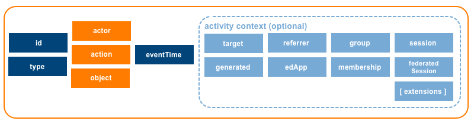</div>

A Caliper [Event](#event) ("event") is a generic type that describes the relationship established between an `actor` and an `object`, formed as a result of a purposeful [action](#actions) undertaken by the `actor` in connection to the `object` at a particular moment in time and (optionally) within a given context.  The [Event](#event) properties `actor`, `action` and `object` form a compact data structure that resembles an [RDF](#rdf) triple linking a subject to an object via a predicate.  A learner starting an assessment, annotating a reading, pausing a video, or posting a message to a forum, are examples of learning activities that Caliper models as events.

Caliper defines a number of [Event](#event) subtypes, each scoped to a particular activity domain and distinguishable via a `type` property.  Each [Event](#event) instance can be referenced by its unique identifier.  The `type` value is a string that MUST match the term specified for the [Event](#event) by the Caliper information model (e.g. "MessageEvent").  The assigned `id` value MUST be a string representation of a [UUID](#uuidDef) as a [URN](#urnDef) per [RFC 4122](#rfc4122) which describes a [URN](#urnDef) namespace for [UUIDs](#uuidDef).  

The information model also seeks to describe the learning environment or context in which a learning activity is situated.  Group affiliation, membership roles, and status, recent navigation history, supporting technology and session information can all be optionally represented.  An [Entity](#entity) generated as a result of the interaction between an `actor` and an `object` can also be described; annotating a piece of digital content and producing an [Annotation](#annotation) is one such example.  An `extensions` property is also provided so that implementors can add custom properties not described by the model.  

Considered as a data structure an [Event](#event) constitutes an unordered set of key:value pairs that is semi-structured by design.  Optional attributes can be ignored when describing an [Event](#event).  An [Entity](#entity) participating in an [Event](#event) can be represented as an object or as a string that corresponds to the [IRI](#iriDef) defined for the [Entity](#entity).

#### Properties
The base set of [Event](#event) properties or attributes is listed below.  Each property MUST be referenced only once.  The `id`, `type`, `actor`, `action`, `object` and `eventTime` properties are required; all other properties are optional.  Custom properties not described by the model MAY be included, but MUST be added to the `extensions` property as an array of object values.  Properties with a value of *null* or empty SHOULD be excluded prior to serialization.

| Property | Type | Description | Conformance |
| :------- | :--- | ----------- | :---------: |
| id | [UUID](#uuidDef) | The emitting application MUST provision the [Event](#event) with a [UUID](#uuidDef).  A version 4 [UUID](#uuidDef) SHOULD be generated.  The UUID MUST be expressed as a [URN](#urnDef) using the form `urn:uuid:<UUID>` per [RFC 4122](#rfc4122). | Required |
| type | [Term](#termDef) | A string value corresponding to the [Term](#termDef) defined for the [Event](#event) in the external IMS Caliper JSON-LD [context](http://purl.imsglobal.org/ctx/caliper/v1p1) document MUST be specified.  For a generic [Event](#event) set the `type` to the string value *Event*.  If a subtype of [Entity](#entity) is created, set the `type` to the [Term](#termDef) corresponding to the subtype utilized, e.g., *NavigationEvent*. | Required |
| actor | [Agent](#agent) | The [Agent](#agent) who initiated the [Event](#event), typically a [Person](#person), [Organization](#organization) or [SoftwareApplication](#softwareApplication), MUST be specified.  The `actor` value MUST be expressed either as an object or coerced to a string corresponding to the actor's [IRI](#iriDef). | Required |
| action | [Term](#termDef) | The action or predicate that binds the actor or subject to the object MUST be specified.  The `action` range is limited to the set of [actions](#actions) described in this specification and may be further constrained by the chosen [Event](#event) type.  Only one `action` [Term](#termDef) may be specified per [Event](#event). | Required |
| object | [Entity](#entity) | The [Entity](#entity) that comprises the object of the interaction MUST be specified.  The `object` value MUST be expressed either as an object or coerced to a string corresponding to the object's [IRI](#iriDef). | Required |
| eventTime | DateTime | A date and time value expressed with millisecond precision that indicates when the [Event](#event) occurred MUST be specified.  The value MUST be expressed as an ISO-8601 formatted date/time string set to UTC. | Required |
| target | [Entity](#entity) | An [Entity](#entity) that represents a particular segment or location within the `object`.  The `target` value MUST be expressed either as an object or coerced to a string corresponding to the target entity's [IRI](#iriDef). | Optional |
| generated | [Entity](#entity) | An [Entity](#entity) created or generated as a result of the interaction.  The `generated` value MUST be expressed either as an object or coerced to a string corresponding to the generated entity's [IRI](#iriDef). | Optional |
| edApp | [SoftwareApplication](#softwareApplication) | A [SoftwareApplication](#softwareApplication) that constitutes the application context MAY be specified.  The `edApp` value MUST be expressed either as an object or coerced to a string corresponding to the edApp's [IRI](#iriDef). | Optional |
| referrer | [Entity](#entity)  | An [Entity](#entity) that represents the referring context MAY be specified. A [SoftwareApplication](#softwareApplication) or [DigitalResource](#digitalResource) will typically constitute the referring context.  The `referrer` value MUST be expressed either as an object or coerced to a string corresponding to the referrer's [IRI](#iriDef). | Optional |
| group | [Organization](#organization) | An [Organization](#organization) that represents the group context MAY be specified.  The `group` value MUST be expressed either as an object or coerced to a string corresponding to the group's [IRI](#iriDef). | Optional |
| membership | [Membership](#membership) | The relationship between the `actor` and the `group` in terms of roles assigned and current status MAY be specified.  The `membership` value MUST be expressed either as an object or coerced to a string corresponding to the membership entity's [IRI](#iriDef). | Optional |
| session | [Session](#session) | The current user [Session](#session) MAY be specified.  The `session` value MUST be expressed either as an object or coerced to a string corresponding to the session's [IRI](#iriDef). | Optional | 
| federatedSession | [LtiSession](#ltiSession) | If the [Event](#event) occurs within the context of an [LTI](#lti) tool launch, the actor's tool consumer [LtiSession](#ltiSession) MAY be referenced.  The `federatedSession` value MUST be expressed either as an object or coerced to a string corresponding to the federatedSession's [IRI](#iriDef). | Optional |
| extensions | Array | An ordered collection of objects not defined by the model MAY be specified for a more concise representation of the [Event](#event). | Optional |

#### Subtypes
[AnnotationEvent](#annotationEvent), [AssignableEvent](#assignableEvent), [AssessmentEvent](#assessmentEvent), [AssessmentItemEvent](#assessmentItemEvent), [ForumEvent](#forumEvent), [MediaEvent](#mediaEvent), [MessageEvent](#messageEvent), [NavigationEvent](#navigationEvent), [OutcomeEvent](#outcomeEvent), [SessionEvent](#sessionEvent), [ToolUseEvent](#toolUseEvent), [ThreadEvent](#threadEvent), [ViewEvent](#viewEvent)

#### Deprecated subtypes
[ReadingEvent](#readingEvent)

<a name="infoModelEntity" />

### 2.2 The Caliper Entity
<div style="design: block;margin: 0 auto">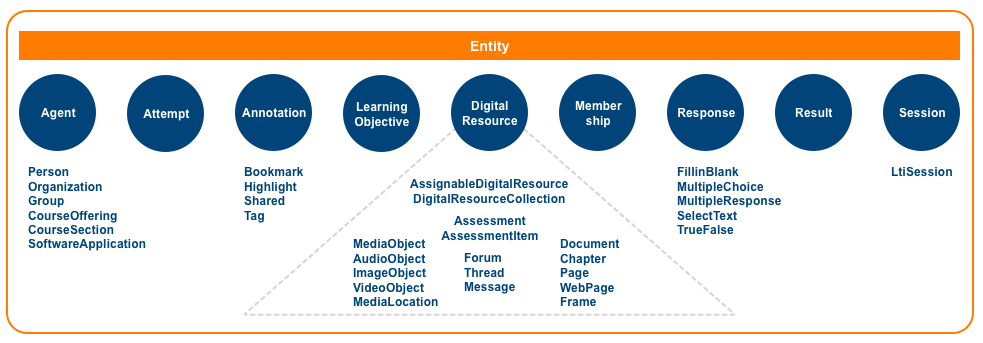</div>

A Caliper [Entity](#entity) is a generic type that represents objects that participate in learning-related activities.  A number of [Entity](#entity) subtypes have been defined in order to better describe people, groups, organizations, digital content, courses, software applications, and other objects that constitute the "stuff" of a Caliper [Event](#event).  Each [Entity](#entity) is provisioned with a modest set of properties or attributes that support discovery and description.

Like an [Event](#event), an [Entity](#entity) is considered semi-structured data consisting of an unordered set of key:value pairs.  Optional attributes need not be referenced when describing an [Entity](#entity).  When referenced in a Caliper [Event](#infoModelEvent) an [Entity](#entity) can be represented as an object or as a string.

If an object representation is provided, both the type and identifier of the [Entity](#entity) MUST be specified.  Each [Entity](#entity) is provisioned with `type` and `id` properties.  The `type` value is a string that MUST match the term specified for the [Entity](#entity) by the Caliper information model (e.g. "Person").  The `id` value is a string that MUST be expressed as an [IRI](#iriDef).  The [IRI](#iriDef) MUST be valid and unique.  The [IRI](#iriDef) SHOULD also be dereferenceable, i.e., capable of returning a representation of the resource assuming authorization to access the resource is granted.  A [URI](#uriDef) employing the [URN](#urnDef) scheme MAY be provided although care should be taken when employing a location-independent identifier since it precludes the possibility of utilizing it to retrieve machine-readable data. 

Other [Entity](#entity) properties are descriptive in nature, or link the [Entity](#entity) to other related entities.  Certain [Entity](#entity) types like [Annotation](#annotation), [DigitalResource](#digitalResource), [Message](#message) or [Organization](#organization) are provisioned with additional properties that allow for a more complete representation of the object.  An `extensions` property is also defined so that implementors can add custom properties not described by the model.  Optional attributes can be ignored when describing an [Entity](#entity).    

If a string representation is provided the value MUST correspond to the [IRI](#iriDef) defined for the [Entity](#entity).

#### Properties
The base set of [Entity](#entity) properties is listed below.  Each property MUST be referenced only once.  When representing an [Entity](#entity) as an object the `id` and `type` properties are required; all other properties are optional.  Custom properties not described by the model MAY be included but MUST be added to the `extensions` property as an array of object values.  Properties with a value of *null* or empty SHOULD be excluded prior to serialization. 

| Property | Type | Description | Conformance |
| :------- | :--- | ----------- | :---------: |
| id | [IRI](#iriDef) | A valid [IRI](#iriDef) MUST be specified. The [IRI](#iriDef) MUST be unique and persistent. The [IRI](#iriDef) SHOULD also be dereferenceable, i.e., capable of returning a representation of the resource. A [URI](#uriDef) employing the [URN](#urnDef) scheme MAY be provided in cases where a [Linked Data](#linkedDataDef) friendly HTTP URI is either unavailable or inappropriate. | Required |
| type | [Term](#termDef) | A string value corresponding to the [Term](#termDef) defined for the [Entity](#entity) in the external IMS Caliper JSON-LD [context](http://purl.imsglobal.org/ctx/caliper/v1p1) document MUST be specified.  For a generic [Entity](#entity) set the `type` value to the term *Entity*.  If a subtype of [Entity](#entity) is created, set the type to the [Term](#termDef) corresponding to the subtype utilized, e.g., *Person*. | Required |
| name | string | A string value comprising a word or phrase by which the [Entity](#entity) is known MAY be specified. | Optional |
| description | string |  A string value comprising a brief, written representation of the [Entity](#entity) MAY be specified. | Optional |
| dateCreated | DateTime | A date and time value expressed with millisecond precision that describes when the [Entity](#entity) was created MAY be specified.  The value MUST be expressed as an ISO-8601 formatted date/time string set to UTC. | Optional |
| dateModified | DateTime | A date and time value expressed with millisecond precision that describes when the [Entity](#entity) was last changed or modified MAY be specified.  The value MUST be expressed as an ISO-8601 formatted date/time string set to UTC. | Optional |
| extensions | Array | An ordered collection of objects not defined by the model MAY be specified for a more concise representation of the [Entity](#entity). | Optional |

#### Subtypes
[Agent](#agent), [Annotation](#annotation), [Assessment](#assessment), [AssessmentItem](#assessmentItem), [AssignableDigitalResource](#assignableDigitalResource), [Attempt](#attempt), [AudioObject](#audioObject), [BookmarkAnnotation](#bookmarkAnnotation), [Chapter](#chapter), [CourseOffering](#courseOffering), [CourseSection](#courseSection), [DigitalResource](#digitalResource), [DigitalResourceCollection](#digitalResourceCollection), [Document](#document), [FillinBlankResponse](#fillinBlankResponse), [Frame](#frame), [Forum](#forum), [Group](#group), [HighlightAnnotation](#highlightAnnotation), [ImageObject](#imageObject), [LearningObjective](#learningObjective), [LtiSession](#ltiSession), [MediaLocation](#mediaLocation), [MediaObject](#mediaObject), [Membership](#membership), [Message](#message), [MultipleChoiceResponse](#multipleChoiceResponse), [MultipleResponseResponse](#multipleResponseResponse), [Organization](#organization), [Page](#page), [Person](#person), [Response](#response), [Result](#result), [SelectTextResponse](#selectTextResponse), [Session](#session), [SharedAnnotation](#sharedAnnotation), [SoftwareApplication](#softwareApplication), [TagAnnotation](#tagAnnotation), [Thread](#thread), [TrueFalseResponse](#trueFalseResponse), [VideoObject](#videoObject), [WebPage](#webPage)

#### Deprecated subtypes
[EpubChapter](#epubChapter), [EpubPart](#epubPart), [EpubSubChapter](#epubSubChapter), [EpubVolume](#epubVolume), [Reading](#reading)

<a name="infoModelProfiles" />

### 2.3 Metric Profiles
<div style="design: block;margin: 0 auto">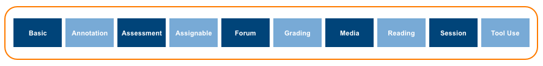</div>

The Caliper information model defines a number of metric profiles, each of which models a learning activity or a supporting activity that helps facilitate learning.  A metric profile's *raison d'etre* is to encourage vocabulary standardization and re-use among application providers delivering complementary, albeit competing capabilities that collect learning activity data.  Each profile provides a domain-specific set of terms and concepts that application designers and developers can draw upon to describe common user interactions in a consistent manner using a shared vocabulary.  Annotating a reading, playing a video, taking a test, or grading an assignment submission represent a few examples of the many activities or events that Caliper's metric profiles attempt to describe.
    
Think of each metric profile as a stand-alone, logical container, or collection of one or more Caliper events that together help describe a set of inter-related activities.  Each [Event](#event) included in a metric profile describes the expected entities or objects in play as well as provides a controlled vocabulary of required and optional [actions](#actions).  

As an example, the [Forum Profile](#forumProfile) models a set of activities associated with online discussions involving instructors and learners. The profile currently includes a [ForumEvent](#forumEvent), [MessageEvent](#messageEvent), [NavigationEvent](#navigationEvent), [ThreadEvent](#threadEvent) and [ViewEvent](#viewEvent).  An action sequence mediated by the [Forum Profile](#forumProfile) might involve a learner navigating to a forum, subscribing to it, viewing a thread, posting a message in reply to an earlier post and then marking the message as read.
     
Extending Caliper's information model involves designing a new metric profile or enhancing an existing one.  Implementors are free to implement only those Caliper metric profiles as are necessary to model a learning domain.  A video platform provider may decide that only the [Assignable Profile](#assignableProfile), [Media Profile](#mediaProfile) and [Session Profile](#sessionProfile) are relevant to its needs, while developers instrumenting an assessment engine would most likely implement the [Assessment Profile](#annotationProfile), [Assignable Profile](#assignableProfile), [Grading Profile](#gradingProfile) and [Session Profile](#sessionProfile).

The following metric profiles are currently available and are summarized individually below:

[Basic Profile](#basicProfile), [Annotation Profile](#annotationProfile), [Assessment Profile](#annotationProfile), [Assignable Profile](#assignableProfile), [Forum Profile](#forumProfile), [Media Profile](#mediaProfile), [Grading Profile](#gradingProfile), [Reading Profile](#readingProfile), [Session Profile](#sessionProfile), [Tool Use Profile](#toolUseProfile)

<a name="basicProfile" />

### 2.3.1 Basic Profile
<div style="design: block;margin: 0 auto"></div>

The Caliper Basic Profile provides a generic [Event](#event) for describing learning or supporting activities that have yet to be modeled by Caliper.  Any of the Caliper [actions](#actions) described in this specification can be used to describe the interaction between the `actor` and the `object`.

#### Minimum Conformance
Create and send a generic Caliper [Event](#event) to a target [Endpoint](#endpoint).  At least one Caliper [action](#actions) MUST be implemented.

#### Supported Events
[Event](#event)

#### Supported Actions
All actions included in the Caliper [actions](#actions) vocabulary are supported.  However, it is RECOMMENDED that implementors look first to an existing Metric Profile that models the activity domain of interest before choosing to craft a generic [Event](#event).

#### Supported Entities
| Event | Actor |	Action | Object |
| :---- | :---- | :----- | :----- |
| [Event](#event) | [Agent](#agent) | [action](#actions) | [Entity](#entity) |

#### Requirements
* Certain [Event](#event) properties are required and MUST be specified.  Required properties include `id`, `type`, `actor`, `action`, `object` and `eventTime`.  All other [Event](#event) properties are considered optional and need not be referenced.  Adherence to the rules associated with each property referenced is mandatory.  
* Each [Entity](#entity) participating in the [Event](#event) MUST be expressed either as an object or coerced to a string corresponding to it's [IRI](#iriDef).
* The `action` vocabulary is limited to the supported actions described in this specification and no other.

<a name="annotationProfile" />

### 2.3.2 Annotation Profile
<div style="design: block;margin: 0 auto">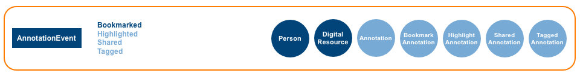</div>

The Caliper Annotation Profile models activities related to the annotation of a [DigitalResource](#digitalResource). Creating a bookmark, highlighting selected text, sharing a resource, tagging a document, and viewing an annotation are modeled.  The generated [Annotation](#annotation) is also described and is subtyped for greater type specificity.

As an example, instructors can use the places where students are making notes in the course material to determine whether they have the right idea about which material should be highlighted.  In addition, if there are students who are asking questions or making notes indicating confusion about a particular piece of content, this can also inform the instructor about the material which they have chosen to use.  

Questions which can be answered using this profile are as follows:

* Who is making the most annotations?
* What content is most often annotated?
* What types of annotations are applied most often?
* Are annotations being read?

#### Minimum Conformance
Create and send an [AnnotationEvent](#annotationEvent) to a target [Endpoint](#endpoint).  The [Bookmarked](#bookmarked) action is required and MUST be implemented.  All other supported actions are considered optional.

#### Supported Events
[AnnotationEvent](#annotationEvent)

#### Supported Actions
| Event | Action | WordNet® Gloss | Conformance |
| :---- | :----- | :------------- | :---------- |
| [AnnotationEvent](#annotationEvent) | [Bookmarked](#bookmarked) | [A marker](http://wordnet-rdf.princeton.edu/wn31/102874508-n) that specifies a location of interest in a [DigitalResource](#digitalResource) that is recorded for later retrieval. | Required |
| [AnnotationEvent](#annotationEvent) | [Highlighted](#highlighted) | [Move into the foreground to make more visible or prominent](http://wordnet-rdf.princeton.edu/wn31/200515150-v). | Optional |
| [AnnotationEvent](#annotationEvent) | [Shared](#shared) | [Communicate](http://wordnet-rdf.princeton.edu/wn31/201065952-v). | Optional |
| [AnnotationEvent](#annotationEvent) | [Tagged](#tagged) | [Attach a tag or label to](http://wordnet-rdf.princeton.edu/wn31/201591414-v). | Optional |

#### Supported Entities
| Event | Actor |	Action | Object |	Generated |
| :---- | :---- | :----- | :----- | :-------- |
| [AnnotationEvent](#annotationEvent) | [Person](#person) | [Bookmarked](#bookmarked) | [DigitalResource](#digitalResource) | [BookmarkAnnotation](#bookmarkAnnotation) |
| [AnnotationEvent](#annotationEvent) | [Person](#person) | [Highlighted](#highlighted) | [DigitalResource](#digitalResource) | [HighlightAnnotation](#highlightAnnotation) |
| [AnnotationEvent](#annotationEvent) | [Person](#person) | [Shared](#shared) | [DigitalResource](#digitalResource) | [SharedAnnotation](#sharedAnnotation) |
| [AnnotationEvent](#annotationEvent) | [Person](#person) | [Tagged](#tagged) | [DigitalResource](#digitalResource) |  [TaggedAnnotation](#taggedAnnotation) |

#### Requirements
* Certain [AnnotationEvent](#annotationEvent) properties are required and MUST be specified.  Required properties include `id`, `type`, `actor`, `action`, `object` and `eventTime`.  All other [AnnotationEvent](#annotationEvent) properties are considered optional and need not be referenced.  Adherence to the rules associated with each property referenced is mandatory.  
* Each [Entity](#entity) participating in the [AnnotationEvent](#annotationEvent) MUST be expressed either as an object or coerced to a string corresponding to it's [IRI](#iriDef).
* A [Person](#person) MUST be specified as the `actor` of the interaction.
* The `action` vocabulary is limited to the supported actions described in the profile.
* The `generated` [Annotation](#annotation) SHOULD be specified.  If expressed as an object both the `annotator` and `annotated` [DigitalResource](#digitalResource) SHOULD be referenced.


<a name="assessmentProfile" />

### 2.3.3 Assessment Profile
<div style="design: block;margin: 0 auto">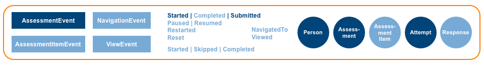</div>

The Caliper Assessment Profile models assessment-related activities including interactions with individual assessment items. Caliper provides [Assessment](#assessment) and [AssessmentItem](#assessmentItem) entities for describing the `object` of these activities, as well as a learner's [Attempt](#attempt) for recording a count of the number of times an assigned resource has been attempted.  Five [Response](#response) types are also provided for capturing individual item responses.  _Note that the Caliper 1.0 AssessmentItem Profile has been merged into the Assessment Profile._

Tracking patterns using the assessment profile will allow instructors to understand more about how students are interacting with their assessments.  Typical ways to make use of this profile are to answer the following questions:

* When are students taking assessments?
* How long do students spend on portions of individual assessments?

#### Minimum Conformance
Create and send an [AssessmentEvent](#assessmentEvent) to a target [Endpoint](#endpoint).  The [Started](#started) and [Submitted](#submitted) actions are required and MUST be implemented.  All other supported events and actions are considered optional.

#### Supported Events
[AssessmentEvent](#assessmentEvent), [AssessmentItemEvent](#assessmentItemEvent), [NavigationEvent](#navigationEvent), [ViewEvent](#viewEvent)

#### Supported Actions
| Event | Action | WordNet® Gloss | Conformance |
| :---- | :----- | :------------- | :---------- |
| [AssessmentEvent](#assessmentEvent) | [Started](#started) | [Set in motion, cause to start](http://wordnet-rdf.princeton.edu/wn31/200349400-v). | Required |
| [AssessmentEvent](#assessmentEvent) | [Paused](#paused) | [Cease an action temporarily](http://wordnet-rdf.princeton.edu/wn31/200781106-v).  Inverse of [Resumed](#resumed).  The [Attempt](#attempt) `count` value MUST NOT be changed. | Optional |
| [AssessmentEvent](#assessmentEvent) | [Resumed](#resumed) | [Take up or begin anew](http://wordnet-rdf.princeton.edu/wn31/200350758-v), as in to start something, pause and then begin again at the location where the pause in action occurred.  Inverse of [Paused](#paused).  The [Attempt](#attempt) `count` value MUST NOT be changed. | Optional |
| [AssessmentEvent](#assessmentEvent) | [Restarted](#restarted) | [Take up or begin anew](http://wordnet-rdf.princeton.edu/wn31/200350758-v), as in to start something, make progress, but then stop and return to the beginning in order to start again.  The [Attempt](#attempt) `count` value MUST be incremented by 1. | Optional |
| [AssessmentEvent](#assessmentEvent) | [Reset](#reset) | [Set anew](http://wordnet-rdf.princeton.edu/wn31/200949623-v) without changing or incrementing the [Attempt](#attempt) `count` value. | Optional |
| [AssessmentEvent](#assessmentEvent) | [Submitted](#submitted) | [Hand over formally](http://wordnet-rdf.princeton.edu/wn31/202267560-v). | Required |
| [AssessmentItemEvent](#assessmentItemEvent) | [Started](#started) | [Set in motion, cause to start](http://wordnet-rdf.princeton.edu/wn31/200349400-v). | Optional |
| [AssessmentItemEvent](#assessmentItemEvent) | [Skipped](#skipped) | [Bypass](http://wordnet-rdf.princeton.edu/wn31/200618188-v). | Optional |
| [AssessmentItemEvent](#assessmentItemEvent) | [Completed](#completed) | [Come or bring to a finish or an end](http://wordnet-rdf.princeton.edu/wn31/200485097-v). | Optional |
| [NavigationEvent](#navigationEvent) | [NavigatedTo](#navigatedTo) | [Direct the course; determine the direction of travelling](http://wordnet-rdf.princeton.edu/wn31/201935739-v). | Optional |
| [ViewEvent](#viewEvent) | [Viewed](#viewed) |[Look at carefully; study mentally](http://wordnet-rdf.princeton.edu/wn31/202134765-v). | Optional |

#### Supported Entities
| Event | Actor |	Action | Object |	Generated | Referrer |
| :---- | :---- | :----- | :----- | :-------- | :------- |
| [AssessmentEvent](#assessmentEvent) | [Person](#person) | [Started](#started) | [Assessment](#assessment) | [Attempt](#attempt) | [DigitalResource](#digitalResource), [SoftwareApplication](#softwareApplication) |
| [AssessmentEvent](#assessmentEvent) | [Person](#person) | [Paused](#paused) |  [Assessment](#assessment) | [Attempt](#attempt) | &nbsp; |
| [AssessmentEvent](#assessmentEvent) | [Person](#person) | [Resumed](#resumed) | [Assessment](#assessment) | [Attempt](#attempt) | &nbsp; |
| [AssessmentEvent](#assessmentEvent) | [Person](#person) | [Restarted](#restarted) |  [Assessment](#assessment) | [Attempt](#attempt) | &nbsp; |
| [AssessmentEvent](#assessmentEvent) | [Person](#person) | [Reset](#reset) |  [Assessment](#assessment) | [Attempt](#attempt) | &nbsp; |
| [AssessmentEvent](#assessmentEvent) | [Person](#person) | [Submitted](#submitted) | [Assessment](#assessment) | [Attempt](#attempt) | &nbsp; |
| [AssessmentItemEvent](#assessmentItemEvent) | [Person](#person) | [Started](#started) | [AssessmentItem](#assessmentItem) | [Attempt](#attempt) | [Assessment](#assessment) |
| [AssessmentItemEvent](#assessmentItemEvent) |[Person](#person) | [Skipped](#skipped) | [AssessmentItem](#assessmentItem) | &nbsp; | [AssessmentItem](#assessmentItem) |
| [AssessmentItemEvent](#assessmentItemEvent) | [Person](#person) | [Completed](#completed) | [AssessmentItem](#assessmentItem) | [Response](#response) | [AssessmentItem](#assessmentItem) |
| [NavigationEvent](#navigationEvent) | [Person](#person) | [NavigatedTo](#navigatedTo) | [DigitalResource](#digitalResource) | &nbsp; | [DigitalResource](#digitalResource), [SoftwareApplication](#softwareApplication) |
| [ViewEvent](#viewEvent) | [Person](#person) | [Viewed](#viewed) | [DigitalResource](#digitalResource) | &nbsp; | &nbsp; |

#### Requirements
* Certain [AssessmentEvent](#assessmentEvent), [AssessmentItemEvent](#assessmentItemEvent), [NavigationEvent](#navigationEvent) and [ViewEvent](#viewEvent) properties are required and MUST be specified.  Required properties include `id`, `type`, `actor`, `action`, `object` and `eventTime`.  All other [AssessmentEvent](#assessmentEvent), [AssessmentItemEvent](#assessmentItemEvent), [NavigationEvent](#navigationEvent) and [ViewEvent](#viewEvent) properties are considered optional and need not be referenced.  Adherence to the rules associated with each property referenced is mandatory.  
* Each [Entity](#entity) participating in the [AssessmentEvent](#assessmentEvent), [AssessmentItemEvent](#assessmentItemEvent), [NavigationEvent](#navigationEvent) or [ViewEvent](#viewEvent) MUST be expressed either as an object or coerced to a string corresponding to it's [IRI](#iriDef).
* A [Person](#person) MUST be specified as the `actor` of the interaction.
* The `action` vocabulary is limited to the supported actions described in the profile.
* The [Attempt](#attempt) SHOULD reference both the `assignee` and the assigned [Assessment](#assessment) or [AssessmentItem](#assessmentItem).
* For a [Started](#started) action, the learner's `generated` [Attempt](#attempt) SHOULD be specified.  If the [Attempt](#attempt) is included, it  MUST be specified with the `count` value set to 1 for a first attempt and incremented by 1 for each subsequent attempt.
* For a [Paused](#paused), [Resumed](#resumed) and [Reset](#reset) actions, if the [Attempt](#attempt) is specified, the current `count` value MUST NOT be changed.
* For a [Restarted](#restarted) action, if the [Attempt](#attempt) is specified, the `count` value MUST be incremented by 1.
* Parent-child relationships that exist between [AssessmentItem](#assessmentItem) and [Assessment](#assessment) attempts MAY be represented via the [Attempt](#attempt) `isPartOf` property.
* For a [Completed](#completed) action, the learner's `generated` [Response](#response) MAY be specified.  The [Response](#response) SHOULD reference the associated `attempt`.
* When navigating to an [Assessment](#assessment) the [DigitalResource](#digitalResource) or [SoftwareApplication](#softwareApplication) that constitutes the referring context MAY be specified as the `referrer`.  For an [AssessmentItemEvent](#assessmentItemEvent) the prior [AssessmentItem](#assessmentItem), if known, MAY be specified as the `referrer`.

<a name="assignableProfile" />

### 2.3.4 Assignable Profile
<div style="design: block;margin: 0 auto">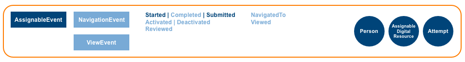</div>

The Assignable Profile models activities associated with the assignment of digital content to a learner for completion according to specific criteria.  Caliper provides a generic [AssignableDigitalResource](#assignableDigitalResource) for describing the `object` of these activities as well as a learner's [Attempt](#attempt) for recording a count of the number of times an assigned resource has been attempted.

This profile would be useful for instructors to gather insight about the relationship between students and their assignments.  Answers to the following questions can be enabled using this profile:

* Who is assigned what material?
* How long does it take to complete something that has been assigned?
* What piece of assigned material presents the biggest challenge (i.e. needs most retake attempts)

#### Minimum Conformance
Create and send an [AssignableEvent](#assignableEvent) to a target [Endpoint](#endpoint). The [Started](#started) and [Submitted](#submitted) actions are required and MUST be implemented.  The [Completed](#completed) action SHOULD be implemented.  All other supported events and actions are considered optional.

#### Supported Events
[AssignableEvent](#assignableEvent), [NavigationEvent](#navigationEvent), [ViewEvent](#viewEvent)

#### Supported Actions
| Event | Action | WordNet® Gloss | Conformance |
| :---- | :----- | :------------- | :---------- |
| [AssignableEvent](#assignableEvent) | [Activated](#activated) | [Make active or more active](http://wordnet-rdf.princeton.edu/wn31/200191014-v).  Inverse of [Deactivated](#deactivated). | Optional |
| [AssignableEvent](#assignableEvent) | [Deactivated](#deactivated) | [Make inactive](http://wordnet-rdf.princeton.edu/wn31/200191849-v).  Inverse of [Activated](#activated). | Optional |
| [AssignableEvent](#assignableEvent) | [Started](#started) | [Set in motion, cause to start](http://wordnet-rdf.princeton.edu/wn31/200349400-v). | Required |
| [AssignableEvent](#assignableEvent) | [Completed](#completed) | [Come or bring to a finish or an end](http://wordnet-rdf.princeton.edu/wn31/200485097-v). | Recommended |
| [AssignableEvent](#assignableEvent) | [Submitted](#submitted) | [Hand over formally](http://wordnet-rdf.princeton.edu/wn31/202267560-v). | Required |
| [AssignableEvent](#assignableEvent) | [Reviewed](#reviewed) | [Appraise critically](http://wordnet-rdf.princeton.edu/wn31/200857194-v). | Optional |
| [NavigationEvent](#navigationEvent) | [NavigatedTo](#navigatedTo) | [Direct the course; determine the direction of travelling](http://wordnet-rdf.princeton.edu/wn31/201935739-v). | Optional |
| [ViewEvent](#viewEvent) | [Viewed](#viewed) |[Look at carefully; study mentally](http://wordnet-rdf.princeton.edu/wn31/202134765-v). | Optional |

#### Supported Entities
| Event | Actor |	Action | Object |	Generated | Referrer |
| :---- | :---- | :----- | :----- | :-------- | :------- |
| [AssignableEvent](#assignableEvent) | [Person](#person) | [Activated](#activated) | [AssignableDigitalResource](#assignableDigitalResource) | &nbsp; | &nbsp; |
| [AssignableEvent](#assignableEvent) | [Person](#person) | [Deactivated](#deactivated) | [AssignableDigitalResource](#assignableDigitalResource) | &nbsp; | &nbsp; |
| [AssignableEvent](#assignableEvent) | [Person](#person) | [Started](#started) | [AssignableDigitalResource](#assignableDigitalResource) | [Attempt](#attempt) | &nbsp; |
| [AssignableEvent](#assignableEvent) | [Person](#person) | [Completed](#completed) | [AssignableDigitalResource](#assignableDigitalResource) | [Attempt](#attempt) | &nbsp; |
| [AssignableEvent](#assignableEvent) | [Person](#person) | [Submitted](#submitted) | [AssignableDigitalResource](#assignableDigitalResource) | [Attempt](#attempt) | &nbsp; |
| [AssignableEvent](#assignableEvent) | [Person](#person) | [Reviewed](#reviewed) | [AssignableDigitalResource](#assignableDigitalResource) | [Attempt](#attempt) | &nbsp; |
| [NavigationEvent](#navigationEvent) | [Person](#person) | [NavigatedTo](#navigatedTo) | [DigitalResource](#digitalResource) | &nbsp; | [DigitalResource](#digitalResource), [SoftwareApplication](#softwareApplication) |
| [ViewEvent](#viewEvent) | [Person](#person) | [Viewed](#viewed) | [DigitalResource](#digitalResource) | &nbsp; | &nbsp; |

#### Requirements
* Certain [AssignableEvent](#assignableEvent), [NavigationEvent](#navigationEvent) and [ViewEvent](#viewEvent) properties are required and MUST be specified.  Required properties include `id`, `type`, `actor`, `action`, `object` and `eventTime`.  All other [AssignableEvent](#assignableEvent), [NavigationEvent](#navigationEvent) and [ViewEvent](#viewEvent) properties are considered optional and need not be referenced.  Adherence to the rules associated with each property referenced is mandatory.  
* Each [Entity](#entity) participating in the [AssignableEvent](#assignableEvent), [NavigationEvent](#navigationEvent) or [ViewEvent](#viewEvent) MUST be expressed either as an object or coerced to a string corresponding to it's [IRI](#iriDef).
* A [Person](#person) MUST be specified as the `actor` of the interaction.
* The `action` vocabulary is limited to the supported actions described in the profile.
* The [Attempt](#attempt) SHOULD reference both the `assignee` and the assigned  [AssignableDigitalResource](#assignableDigitalResource).
* For a [Started](#started) action, the learner's `generated` [Attempt](#attempt) SHOULD be specified.  If the [Attempt](#attempt) is included, it  MUST be specified with the `count` value set to 1 for a first attempt and incremented by 1 for each subsequent attempt.
* For a [Paused](#paused), [Resumed](#resumed) and [Reset](#reset) actions, if the [Attempt](#attempt) is specified, the current `count` value MUST NOT be changed.
* For a [Restarted](#restarted) action, if the [Attempt](#attempt) is specified, the `count` value MUST be incremented by 1.
* Parent-child relationships that exist between [AssignableDigitalResource](#assignableDigitalResource) attempts MAY be represented via the [Attempt](#attempt) `isPartOf` property.
* For [Completed](#completed) actions, the learner's `generated` [Response](#response) MAY be specified.  The [Response](#response) SHOULD reference the associated `attempt`.
* Parent-child relationships that exist between [DigitalResource](#digitalResource) attempts MAY be represented via the [Attempt](#attempt) `isPartOf` property.
* For [Completed](#completed) actions, the learner's `generated` [Response](#response) MAY be specified.  The [Response](#response) SHOULD reference the associated `attempt`.
* When navigating to a [AssignableDigitalResource](#assignableDigitalResource) the [DigitalResource](#digitalResource) or [SoftwareApplication](#softwareApplication) that constitutes the referring context MAY be specified as the `referrer`.

<a name="forumProfile" />

### 2.3.5 Forum Profile
<div style="design: block;margin: 0 auto"></div>

The Caliper Forum Profile models learners and others participating in online forum communities.  Forums typically encompass one or more threads or topics to which members can subscribe, post messages and reply to other messages if a threaded discussion is permitted.  Caliper provides [Forum](#forum), [Thread](#thread) and [Message](#message) entities for representing the `object` of these activities.

Tracking patterns using the forum profile will allow instructors to understand more about how students are engaged within discussion forums.  Using this profile, instructors can gain insight in the following areas:

* Who is posting most often
* Which posts create the most replies?
* Compare graded vs. non-graded discussions


#### Minimum Conformance
Create and send a [MessageEvent](#messageEvent) to a target [Endpoint](#endpoint). The [Posted](#posted) action is required and MUST be implemented.  All other supported events and actions are considered optional.

#### Supported Events
[ForumEvent](#forumEvent), [MessageEvent](#messageEvent), [NavigationEvent](#navigationEvent), [ThreadEvent](#threadEvent), [ViewEvent](#viewEvent)

#### Supported Actions
| Event | Action | WordNet® Gloss | Conformance |
| :---- | :----- | :------------- | :---------- |
| [ForumEvent](#forumEvent) | [Subscribed](#subscribed) | [Receive or obtain regularly](http://wordnet-rdf.princeton.edu/wn31/202214527-v).  Inverse of [Unsubscribed](#unsubscribed). | Optional |
| [ForumEvent](#forumEvent) | [Unsubscribed](#unsubscribed) | Inverse of [Subscribed](#subscribed). | Optional |
| [MessageEvent](#messageEvent) | [Posted](#posted) | [To cause to be directed or transmitted to another place](http://wordnet-rdf.princeton.edu/wn31/201033289-v). | Required |
| [MessageEvent](#messageEvent) | [MarkedAsRead](#markedAsRead) | [Mark: designate as if by a mark](http://wordnet-rdf.princeton.edu/wn31/200923709-v), [read: interpret something that is written or printed](http://wordnet-rdf.princeton.edu/wn31/200626756-v).  Inverse of [MarkedAsUnread](#markedAsUnread).  | Optional |
| [MessageEvent](#messageEvent) | [MarkedAsUnRead](#markedAsUnRead) | Inverse of [MarkedAsRead](#markedAsRead). |  Optional |
| [NavigationEvent](#navigationEvent) | [NavigatedTo](#navigatedTo) | [Direct the course; determine the direction of travelling](http://wordnet-rdf.princeton.edu/wn31/201935739-v). | Optional |
| [ThreadEvent](#threadEvent) | [MarkedAsRead](#markedAsRead) | [Mark: designate as if by a mark](http://wordnet-rdf.princeton.edu/wn31/200923709-v), [read: interpret something that is written or printed](http://wordnet-rdf.princeton.edu/wn31/200626756-v).  Inverse of [MarkedAsUnread](#markedAsUnread).  | Optional |
| [ThreadEvent](#threadEvent) | [MarkedAsUnRead](#markedAsUnRead) | Inverse of [MarkedAsRead](#markedAsRead). |  Optional |
| [ViewEvent](#viewEvent) | [Viewed](#viewed) |[Look at carefully; study mentally](http://wordnet-rdf.princeton.edu/wn31/202134765-v). | Optional |

#### Supported Entities
| Event | Actor |	Action | Object | Referrer |
| :---- | :---- | :----- | :----- | :------- |
| [ForumEvent](#forumEvent) | [Person](#person) | [Subscribed](#subscribed) | [Forum](#forum) | &nbsp; |
| [ForumEvent](#forumEvent) | [Person](#person) | [Unsubscribed](#unsubscribed) | [Forum](#forum) | &nbsp; |
| [MessageEvent](#messageEvent) | [Person](#person) | [Posted](#posted) | [Message](#message) | &nbsp; |
| [MessageEvent](#messageEvent) | [Person](#person) | [MarkedAsRead](#markedAsRead) | [Message](#message) | &nbsp; |
| [MessageEvent](#messageEvent) | [Person](#person) | [MarkedAsUnRead](#markedAsUnRead) | [Message](#message) | &nbsp; |
| [NavigationEvent](#navigationEvent) | [Person](#person) | [NavigatedTo](#navigatedTo) | [DigitalResource](#digitalResource) | [DigitalResource](#digitalResource), [SoftwareApplication](#softwareApplication) |
| [ThreadEvent](#threadEvent) | [Person](#person) | [MarkedAsRead](#markedAsRead) | [Thread](#thread) | &nbsp; |
| [ThreadEvent](#threadEvent) | [Person](#person) | [MarkedAsUnRead](#markedAsUnRead) | [Thread](#thread) | &nbsp; |
| [ViewEvent](#viewEvent) | [Person](#person) | [Viewed](#viewed) | [DigitalResource](#digitalResource) | &nbsp; |

#### Requirements
* Certain [ForumEvent](#forumEvent), [MessageEvent](#messageEvent), [NavigationEvent](#navigationEvent), [ThreadEvent](#threadEvent) and [ViewEvent](#viewEvent) properties are required and MUST be specified.  Required properties include `id`, `type`, `actor`, `action`, `object` and `eventTime`.  All other [ForumEvent](#forumEvent), [MessageEvent](#messageEvent), [NavigationEvent](#navigationEvent), [ThreadEvent](#threadEvent) and [ViewEvent](#viewEvent) properties are considered optional and need not be referenced.  Adherence to the rules associated with each property referenced is mandatory.  
* Each [Entity](#entity) participating in the [ForumEvent](#forumEvent), [MessageEvent](#messageEvent), [NavigationEvent](#navigationEvent), [ThreadEvent](#threadEvent) or [ViewEvent](#viewEvent) MUST be expressed either as an object or coerced to a string corresponding to it's [IRI](#iriDef).
* A [Person](#person) MUST be specified as the `actor` of the interaction.
* The `action` vocabulary is limited to the supported actions described in the profile.
* When the [Message](#message) is in the form of a reply, the prior [Message](#message) that prompted the reply SHOULD be referenced via the [Message](#message) `replyTo` property.
* Parent-child relationships that exist between a [Message](#message), [Thread](#thread) and a [Forum](#forum) MAY be represented by use of the `isPartOf` property.
* When navigating to a [Forum](#forum), [Thread](#thread) or [Message](#message) the [DigitalResource](#digitalResource) or [SoftwareApplication](#softwareApplication) that constitutes the referring context MAY be specified as the `referrer`. 

<a name="gradingProfile" />

### 2.3.6 Grading Profile
<div style="design: block;margin: 0 auto">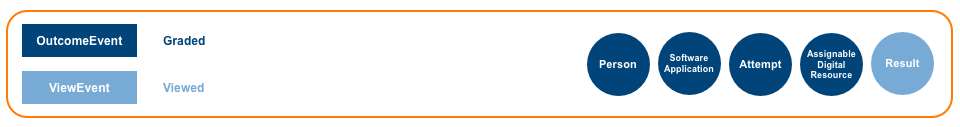</div>

The Caliper Grading Profile models grading activities performed by an [Agent](#agent), typically a [Person](#person) or a [SoftwareApplication](#softwareApplication).  Grading a learner's [Attempt](#attempt) of an [AssignableDigitalResource](#assignableDigitalResource) and generating a [Result](#result) is modeled. _Note that the Caliper 1.0 Outcomes Profile has been replaced by the Grading Profile._

The grading profile allows information to be captured about grade changes for a given assessment or submission.  This may be useful to understand the way in which students and teachers may be interacting throughout the course.  For example, the grading profile can be used to answer questions such as:

* How often are grades changed for an assessment?


#### Minimum Conformance
Create and send a Caliper [OutcomeEvent](#outcomeEvent) to a target [Endpoint](#endpoint).  The [Graded](#graded) action is required and MUST be implemented.

#### Supported Events
[OutcomeEvent](#outcomeEvent)

#### Supported Actions
| Event | Action | WordNet® Gloss | Conformance |
| :---- | :----- | :------------- | :---------- |
| [OutcomeEvent](#outcomeEvent) | [Graded](#graded) | [Assign a grade or rank to, according to one's evaluation](http://wordnet-rdf.princeton.edu/wn31/200659399-v). | Required |
| [ViewEvent](#viewEvent) | [Viewed](#viewed) |[Look at carefully; study mentally](http://wordnet-rdf.princeton.edu/wn31/202134765-v). | Optional |

#### Supported Entities
| Event | Actor |	Action | Object | Generated |
| :---- | :---- | :----- | :----- | :-------- |
| [OutcomeEvent](#outcomeEvent) | [Agent](#agent) | [Graded](#graded) | [Attempt](#attempt) | [Result](#result) |

#### Requirements
* Certain [OutcomeEvent](#outcomeEvent) and [ViewEvent](#viewEvent) properties are required and MUST be specified.  Required properties include `id`, `type`, `actor`, `action`, `object` and `eventTime`.  All other [OutcomeEvent](#outcomeEvent) and [ViewEvent](#viewEvent) properties are considered optional and need not be referenced.  Adherence to the rules associated with each property referenced is mandatory.  
* Each [Entity](#entity) participating in the [OutcomeEvent](#outcomeEvent) or [ViewEvent](#viewEvent) MUST be expressed either as an object or coerced to a string corresponding to it's [IRI](#iriDef).
* For auto-graded scenarios the [SoftwareApplication](#softwareApplication) MUST be specified as the `actor`.
* The `action` vocabulary is limited to the supported actions described in the profile.
* For a [Graded](#graded) action, the `generated` [Result](#result) SHOULD be specified.

<a name="mediaProfile" />

### 2.3.7 Media Profile
<div style="design: block;margin: 0 auto">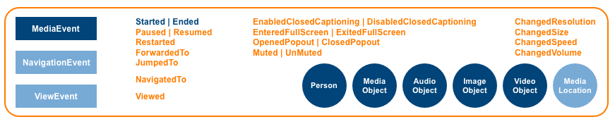</div>

The Caliper Media Profile models interactions between learners and rich content such as audio, images and video.  Implementors can leverage a number of media-related entities including [AudioObject](#audioObject), [ImageObject](#audioObject) and [VideoObject](#videoObject), each subtyped from a generic [MediaObject](#mediaObject).  A [MediaLocation](#mediaLocation) entity is also provided in order to represent the current location in an audio or video stream.

As an example of how this profile could be used, consider the following scenario: an instructor has decided to incorporate a video player into their course.  The video content may or may not be launched via LTI from the Learning Management System (LMS).  Since the video player tool is instrumented to emit activity data via Caliper, the instructor will be able to collect useful information about student viewing behaviour.  In addition, he will be able to compare this data along with other relevent information in the LMS, such as assignment and quiz results.  Using data collected via Caliper, instructors (and administrators) can answer key questions, such as:
 
* Who is using the tool?
* Which videos are being played the most?
* How long are they spending on each video?
* Where do they pause the video?
* Are there instances of where students are replaying sections of the video?

#### Minimum Conformance
Create and send a [MediaEvent](#mediaEvent) to a target endpoint. The [Started](#started) and [Ended](#ended) actions are required and MUST be implemented.  The [Paused](#paused), [Resumed](#resumed) and [Restarted](#restarted) actions SHOULD be implemented.  All other supported events and actions are considered optional.

#### Supported Events
[MediaEvent](#mediaEvent), [NavigationEvent](#navigationEvent), [ViewEvent](#viewEvent)

#### Supported Actions
| Event | Action | WordNet® Gloss | Conformance |
| :---- | :----- | :------------- | :---------- |
| [MediaEvent](#mediaEvent) | [Started](#started) | [Set in motion, cause to start](http://wordnet-rdf.princeton.edu/wn31/200349400-v).  Inverse of [Ended](#ended). | Required |
| [MediaEvent](#mediaEvent) | [Ended](#ended) | [Bring to an end or halt](http://wordnet-rdf.princeton.edu/wn31/200353480-v).  Inverse of [Started](#started). | Required |
| [MediaEvent](#mediaEvent) | [Paused](#paused) | [Cease an action temporarily](http://wordnet-rdf.princeton.edu/wn31/200781106-v).  Inverse of [Resumed](#resumed).  The [MediaLocation](#mediaLocation) `currentTime` value MUST be set to the location in the audio or video stream where the pause occurred. | Recommended |
| [MediaEvent](#mediaEvent) | [Resumed](#resumed) | [Take up or begin anew](http://wordnet-rdf.princeton.edu/wn31/200350758-v), as in to start something, pause and then begin again at the location where the pause in action occurred.  Inverse of [Paused](#paused).  The [MediaLocation](#mediaLocation) `currentTime` value MUST be set to the location in the audio or video stream where the previous pause occurred. | Recommended |
| [MediaEvent](#mediaEvent) | [Restarted](#restarted) | [Take up or begin anew](http://wordnet-rdf.princeton.edu/wn31/200350758-v), as in to start something, make progress but then stop and return to the beginning in order to start again.  The [MediaLocation](#mediaLocation) `currentTime` value MUST be set to the beginning or initial starting location in the audio or video stream. | Recommended |
| [MediaEvent](#mediaEvent) | [ForwardedTo](#forwardedTo)  | [Send or ship onward](http://wordnet-rdf.princeton.edu/wn31/201959367-v). | Optional |
| [MediaEvent](#mediaEvent) | [JumpedTo](#jumpedTo) | [Pass abruptly from one state or topic to another](http://wordnet-rdf.princeton.edu/wn31/200561468-v). | Optional |
| [MediaEvent](#mediaEvent) | [ChangedResolution](#changedResolution) | [Cause to change; make different; cause a transformation](http://wordnet-rdf.princeton.edu/wn31/200126072-v) of [the number of pixels per square inch on a computer-generated display](http://wordnet-rdf.princeton.edu/wn31/111526370-n). | Optional |
| [MediaEvent](#mediaEvent) | [ChangedSize](#changedSize) | [Cause to change; make different; cause a transformation](http://wordnet-rdf.princeton.edu/wn31/200126072-v) of [the physical magnitude of something](http://wordnet-rdf.princeton.edu/wn31/105106204-n). | Optional |
| [MediaEvent](#mediaEvent) | [ChangedSpeed](#changedSpeed) | [Cause to change; make different; cause a transformation](http://wordnet-rdf.princeton.edu/wn31/200126072-v) of the [rate at which something happens](http://wordnet-rdf.princeton.edu/wn31/105065291-n). | Optional |
| [MediaEvent](#mediaEvent) | [ChangedVolume](#changedVolume) | [Cause to change; make different; cause a transformation](http://wordnet-rdf.princeton.edu/wn31/200126072-v) of [the magnitude of sound &#40;usually in a specified direction&#41;](http://wordnet-rdf.princeton.edu/wn31/104997456-n). | Optional |
| [MediaEvent](#mediaEvent) | [EnabledClosedCaptioning](#enabledClosedCaptioning) | [Render capable or able](http://wordnet-rdf.princeton.edu/wn31/200513958-v) the visual display of a plain text transcription of audio output.  Inverse of [DisabledClosedCaptioning](#disabledClosedCaptioning). | Optional |
| [MediaEvent](#mediaEvent) | [DisabledClosedCaptioning](#disabledClosedCaptioning) | [Render unable to perform](http://wordnet-rdf.princeton.edu/wn31/200513267-v) the visual display of a plain text transcription of audio output.  Inverse of [EnabledClosedCaptioning](#enabledClosedCaptioning). | Optional |
| [MediaEvent](#mediaEvent) | [EnteredFullScreen](#enteredFullScreen) | [To come or go into](http://wordnet-rdf.princeton.edu/wn31/202020375-v) a view mode that utilizes all the available display surface of a screen.  Inverse of [ExitedFullScreen](#exitedFullScreen). | Optional |
| [MediaEvent](#mediaEvent) | [ExitedFullScreen](#exitedFullScreen) | [Move out of or depart from](http://wordnet-rdf.princeton.edu/wn31/202019450-v) a view mode that utilizes all the available display surface of a screen.  Inverse of [EnteredFullScreen](#enteredFullScreen). | Optional |
| [MediaEvent](#mediaEvent) | [Muted](#muted) | [Deaden (a sound or noise)](http://wordnet-rdf.princeton.edu/wn31/mute-v).  Inverse of [Unmuted](#unmuted). | Optional |
| [MediaEvent](#mediaEvent) | [Unmuted](#unmuted) | Inverse of [Muted](#muted). | Optional |
| [MediaEvent](#mediaEvent) | [OpenedPopout](#openedPopout) | [Start to operate or function or cause to start operating or functioning](http://wordnet-rdf.princeton.edu/wn31/202431018-v) a video popout.  Inverse of [ClosedPopout](#closedPopout). | Optional |
| [MediaEvent](#mediaEvent) | [ClosedPopout](#closedPopout) | [Close or shut](http://wordnet-rdf.princeton.edu/wn31/201349660-v) a video popout.  Inverse of [OpenedPopout](#openedPopout). | Optional |
| [NavigationEvent](#navigationEvent) | [NavigatedTo](#navigatedTo) | [Direct the course; determine the direction of travelling](http://wordnet-rdf.princeton.edu/wn31/201935739-v). | Optional |
| [ViewEvent](#viewEvent) | [Viewed](#viewed) |[Look at carefully; study mentally](http://wordnet-rdf.princeton.edu/wn31/202134765-v). | Optional |
 
#### Supported Entities
| Event | Actor |	Action | Object |	Target | Referrer |
| :---- | :---- | :----- | :----- | :----- | :------- |
| [MediaEvent](#mediaEvent) | [Person](#person) | [Started](#started) | [MediaObject](#mediaObject) | [MediaLocation](#mediaLocation) | &nbsp; |
| [MediaEvent](#mediaEvent) | [Person](#person) | [Ended](#ended) | [MediaObject](#mediaObject) | [MediaLocation](#mediaLocation) |
| [MediaEvent](#mediaEvent) | [Person](#person) | [Paused](#paused) | [MediaObject](#mediaObject) | [MediaLocation](#mediaLocation) |
| [MediaEvent](#mediaEvent) | [Person](#person) | [Resumed](#resumed) | [MediaObject](#mediaObject) | [MediaLocation](#mediaLocation) | &nbsp; |
| [MediaEvent](#mediaEvent) | [Person](#person) | [Restarted](#restarted) | [MediaObject](#mediaObject) | [MediaLocation](#mediaLocation) | &nbsp; |
| [MediaEvent](#mediaEvent) | [Person](#person) | [ForwardedTo](#forwardedTo) | [MediaObject](#mediaObject) | [MediaLocation](#mediaLocation) | &nbsp; |
| [MediaEvent](#mediaEvent) | [Person](#person) | [JumpedTo](#jumpedTo) | [MediaObject](#mediaObject) | [MediaLocation](#mediaLocation) | &nbsp; |
| [MediaEvent](#mediaEvent) | [Person](#person) | [ChangedResolution](#changedResolution) | [MediaObject](#mediaObject) | [MediaLocation](#mediaLocation) | &nbsp; |
| [MediaEvent](#mediaEvent) | [Person](#person) | [ChangedSize](#changedSize) | [MediaObject](#mediaObject) | [MediaLocation](#mediaLocation) | &nbsp; |
| [MediaEvent](#mediaEvent) | [Person](#person) | [ChangedSpeed](#changedSpeed) | [MediaObject](#mediaObject) | [MediaLocation](#mediaLocation) | &nbsp; |
| [MediaEvent](#mediaEvent) | [Person](#person) | [ChangedVolume](#changedVolume) | [MediaObject](#mediaObject) | [MediaLocation](#mediaLocation) | &nbsp; |
| [MediaEvent](#mediaEvent) | [Person](#person) | [EnabledClosedCaptioning](#enabledClosedCaptioning) | [MediaObject](#mediaObject) | [MediaLocation](#mediaLocation) | &nbsp; |
| [MediaEvent](#mediaEvent) | [Person](#person) | [DisabledClosedCaptioning](#disabledClosedCaptioning) | [MediaObject](#mediaObject) | [MediaLocation](#mediaLocation) | &nbsp; |
| [MediaEvent](#mediaEvent) | [Person](#person) | [EnteredFullScreen](#enteredFullScreen) | [MediaObject](#mediaObject) | [MediaLocation](#mediaLocation) | &nbsp; |
| [MediaEvent](#mediaEvent) | [Person](#person) | [ExitedFullScreen](#exitedFullScreen) | [MediaObject](#mediaObject) | [MediaLocation](#mediaLocation) | &nbsp; |
| [MediaEvent](#mediaEvent) | [Person](#person) | [Muted](#muted) | [MediaObject](#mediaObject) | [MediaLocation](#mediaLocation) | &nbsp; |
| [MediaEvent](#mediaEvent) | [Person](#person) | [Unmuted](#unmuted) | [MediaObject](#mediaObject) | [MediaLocation](#mediaLocation) | &nbsp; |
| [MediaEvent](#mediaEvent) | [Person](#person) | [OpenedPopout](#openedPopout) | [MediaObject](#mediaObject) | [MediaLocation](#mediaLocation) | &nbsp; |
| [MediaEvent](#mediaEvent) | [Person](#person) | [ClosedPopout](#closedPopout) | [MediaObject](#mediaObject) | [MediaLocation](#mediaLocation) | &nbsp; |
| [NavigationEvent](#navigationEvent) | [Person](#person) | [NavigatedTo](#navigatedTo) | [DigitalResource](#digitalResource) | &nbsp; | [DigitalResource](#digitalResource), [SoftwareApplication](#softwareApplication) |
| [ViewEvent](#viewEvent) | [Person](#person) | [Viewed](#viewed)  | [DigitalResource](#digitalResource) | &nbsp; | &nbsp; |

#### Requirements
* Certain [MediaEvent](#mediaEvent), [NavigationEvent](#navigationEvent) and [ViewEvent](#viewEvent) properties are required and MUST be specified.  Required properties include `id`, `type`, `actor`, `action`, `object` and `eventTime`.  All other [MediaEvent](#mediaEvent), [NavigationEvent](#navigationEvent) and [ViewEvent](#viewEvent) properties are considered optional and need not be referenced.  Adherence to the rules associated with each property referenced is mandatory.  
* Each [Entity](#entity) participating in the [MediaEvent](#mediaEvent), [NavigationEvent](#navigationEvent) or [ViewEvent](#viewEvent) MUST be expressed either as an object or coerced to a string corresponding to it's [IRI](#iriDef).
* A [Person](#person) MUST be specified as the `actor` of the interaction.
* The `action` vocabulary is limited to the supported actions described in the profile.
* A [MediaObject](#mediaObject) or one of its subtypes MUST be specified as the `object` of the interaction.
* A [MediaLocation](#mediaLocation) MAY be specified as the `target` in order to indicate the current location in an audio or video stream.
* For a [Started](#started) or [Restarted](#restarted) action, the [MediaLocation](#mediaLocation) `currentTime` value MUST be set to the beginning or initial starting location in the audio or video stream.
* For a [Paused](#paused) action the [MediaLocation](#mediaLocation) `currentTime` value MUST be set to the location in the audio or video stream where the pause occurred.
* For a [Resumed](#resumed) action the [MediaLocation](#mediaLocation) `currentTime` value MUST be set to the location in the audio or video stream where the previous pause occurred.
* For a [Ended](#ended) action the [MediaLocation](#mediaLocation) `currentTime` value MUST be set to the ending or closing location in the audio or video stream.
* For other [MediaEvent](#mediaEvent) supported actions the [MediaLocation](#mediaLocation) `currentTime` value MUST be set to the location in the audio or video stream where the action occurred.
* When navigating to a [MediaObject](#mediaObject) the [DigitalResource](#digitalResource) or [SoftwareApplication](#softwareApplication) that constitutes the referring context MAY be specified as the `referrer`.

<a name="readingProfile" />

### 2.3.8 Reading Profile
<div style="design: block;margin: 0 auto">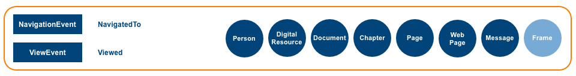</div>

The Caliper Reading Profile models activities associated with navigating to and viewing textual content. Implementors can leverage a number of entities representing digital content such as [Document](#document), [Chapter](#chapter), [Page](#page), [WebPage](#webPage), [Message](#message) and [Frame](#frame), each subtyped from [DigitalResource](#digitalResource).

#### Minimum Conformance
Create and send a [NavigationEvent](#navigationEvent) and a [ViewEvent](#viewEvent) to a target [Endpoint](#endpoint).  The [NavigatedTo](#navigatedTo) and [Viewed](#viewed) actions are required and MUST be implemented.

#### Supported Events
[NavigationEvent](#navigationEvent), [ViewEvent](#viewEvent)

#### Supported Actions
| Event | Action | WordNet® Gloss | Conformance |
| :---- | :----- | :------------- | :---------- |
| [NavigationEvent](#navigationEvent) | [NavigatedTo](#navigatedTo) | [Direct the course; determine the direction of travelling](http://wordnet-rdf.princeton.edu/wn31/201935739-v). | Required |
| [ViewEvent](#viewEvent) | [Viewed](#viewed) |[Look at carefully; study mentally](http://wordnet-rdf.princeton.edu/wn31/202134765-v). | Required |

#### Supported Entities
| Event | Actor |	Action | Object |	Target | Referrer |
| :---- | :---- | :----- | :----- | :----- | :------- |
| [NavigationEvent](#navigationEvent) | [Person](#person) | [NavigatedTo](#navigatedTo) | [DigitalResource](#digitalResource) | [Frame](#frame) | [DigitalResource](#digitalResource), [SoftwareApplication](#softwareApplication) |
| [ViewEvent](#viewEvent) | [Person](#person) | [Viewed](#viewed) | [DigitalResource](#digitalResource) | [Frame](#frame) | &nbsp; |

#### Requirements
* Certain [NavigationEvent](#navigationEvent) and [ViewEvent](#viewEvent) properties are required and MUST be specified.  Required properties include `id`, `type`, `actor`, `action`, `object` and `eventTime`.  All other [NavigationEvent](#navigationEvent) and [ViewEvent](#viewEvent) properties are considered optional and need not be referenced.  Adherence to the rules associated with each property referenced is mandatory.  
* Each [Entity](#entity) participating in the [NavigationEvent](#navigationEvent) or [ViewEvent](#viewEvent) MUST be expressed either as an object or coerced to a string corresponding to it's [IRI](#iriDef).
* A [Person](#person) MUST be specified as the `actor` of the interaction.
* The `action` vocabulary is limited to the supported actions described in the profile.
* A [DigitalResource](#digitalResource) or one of its subtypes MUST be specified as the `object` of the interaction.
* A [Frame](#frame) MAY be specified as the `target` in order to indicate an indexed segment or location.
* When navigating to digital content the [DigitalResource](#digitalResource) or [SoftwareApplication](#softwareApplication) that constitutes the referring context MAY be specified as the `referrer`.

<a name="sessionProfile" />

### 2.3.9 Session Profile
<div style="design: block;margin: 0 auto"></div>

The Caliper Session Profile models the creation and subsequent termination of a user session established by a [Person](#person) interacting with a [SoftwareApplication](#softwareApplication).  A [Session](#session) entity is described for representing the user session.

The session profile can facilitate the capture of data about who is logging into the learning environment, and more importantly, which students are not logging in.   The following are examples of the information best captured using the session profile:

* Session logins
* Which students have not logged in for more than a week
* Who logs in/logs out most/least

#### Minimum Conformance
Create and send a [SessionEvent](#sessionEvent) to a target [Endpoint](#endpoint). The [LoggedIn](#loggedIn) action is required and MUST be implemented.

#### Supported Events
[SessionEvent](#sessionEvent)

#### Supported Actions
| Event | Action | WordNet® Gloss | Conformance |
| :---- | :----- | :------------- | :---------- |
| [SessionEvent](#sessionEvent) | [LoggedIn](#loggedIn) | [Enter a computer or software application](http://wordnet-rdf.princeton.edu/wn31/202253955-v).  Inverse of [LoggedOut](#loggedOut). | Required |
| [SessionEvent](#sessionEvent) | [LoggedOut](#loggedOut) | [Exit a computer or software application](http://wordnet-rdf.princeton.edu/wn31/202254101-v).  Inverse of [LoggedIn](#loggedIn). | Optional |
| [SessionEvent](#sessionEvent) | [TimedOut](#timedOut) | Cancellation of a user session after a predetermined time interval has occurred without activity. | Optional |

#### Supported Entities
| Event | Actor |	Action | Object |	Target | Session |
| :---- | :---- | :----- | :----- | :----- | :------ |
| [SessionEvent](#sessionEvent) | [Person](#person) | [LoggedIn](#loggedIn) | [SoftwareApplication](#softwareApplication) | [DigitalResource](#digitalResource) | [Session](#session) |
| [SessionEvent](#sessionEvent) | [Person](#person) | [LoggedOut](#loggedOut) | [SoftwareApplication](#softwareApplication) | &nbsp; | [Session](#session) |
| [SessionEvent](#sessionEvent) | [SoftwareApplication](#softwareApplication) | [TimedOut](#timedOut) | [Session](#session) | &nbsp; |

#### Requirements
* Certain [SessionEvent](#sessionEvent) properties are required and MUST be specified.  Required properties include `id`, `type`, `actor`, `action`, `object` and `eventTime`.  All other [SessionEvent](#sessionEvent) properties are considered optional and need not be referenced.  Adherence to the rules associated with each property referenced is mandatory.  
* Each [Entity](#entity) participating in the [SessionEvent](#sessionEvent) MUST be expressed either as an object or coerced to a string corresponding to it's [IRI](#iriDef).
* The `action` vocabulary is limited to the supported actions described in the profile.
* Although optional, the relevant user `session` SHOULD be specified.
* For a [LoggedIn](#loggedIn) action, if the `actor` is attempting to access a particular [DigitalResource](#digitalResource) the resource MAY be designated as the `target` of the interaction.

<a name="toolUseProfile" />

### 2.3.10 Tool Use Profile
<div style="design: block;margin: 0 auto"></div>

The Caliper Tool Use Profile models an intended interaction between a user and a tool.  In other words, when a [Person](#person) utilizes a [SoftwareApplication](#softwareApplication) in a manner that the application determines to be its "intended use for learning", an application that implements the Tool Use Profile can emit a [ToolUseEvent](#toolUseEvent) indicating such usage.

The Tool Use Profile enables gathering basic usage information about learning apps. This is an easy way to get started with a base level of instrumentation and letting the learning tool make the determination of its own use.   Any learning app can be instrumented through this profile to detect when a student accesses the tool and uses it in the way it was intended.   Common questions that could be answered through the use of this profile are:

* What tools are being used, and how much?
* Who is the most active/least active user of tools?
* Does tool usage help/hinder student performance?
* Which tools have the greatest impact on student performance?

#### Minimum Conformance
Create and send a Caliper [ToolUseEvent](#toolUseEvent) to a target [Endpoint](#endpoint).  The [Used](#used) action is required and MUST be implemented.

#### Supported Events
[ToolUseEvent](#toolUseEvent)

#### Supported Actions
| Event | Action | WordNet® Gloss | Conformance |
| :---- | :----- | :------------- | :---------- |
| [ToolUseEvent](#toolUseEvent) | Used | [Put into service; make work or employ for a particular purpose or for its inherent or natural purpose](http://wordnet-rdf.princeton.edu/wn31/201161188-v). | Required |

#### Supported Entities
| Event | Actor |	Action | Object |
| :---- | :---- | :----- | :----- |
| ToolUseEvent | [Person](#person) | [Used](#used) | [SoftwareApplication](#softwareApplication) |

#### Requirements
* Certain [ToolUseEvent](#toolUseEvent) properties are required and MUST be specified.  Required properties include `id`, `type`, `actor`, `action`, `object` and `eventTime`.  All other [ToolUseEvent](#toolUseEvent) properties are considered optional and need not be referenced.  Adherence to the rules associated with each property referenced is mandatory.
* Each [Entity](#entity) participating in the [ToolUseEvent](#toolUseEvent) MUST be expressed either as an object or coerced to a string corresponding to it's [IRI](#iriDef).
* A [Person](#person) MUST be specified as the `actor` of the interaction.
* The `action` vocabulary is limited to the supported actions described in the profile.
* A [SoftwareApplication](#softwareApplication) MUST be specified as the `object` of the interaction.

<a name="dataSerialization" />

## 3.0 Serialization of the Model
Over the last decade the advent of cloud-based, networked applications have led to changes in the way data is structured and represented.  Data once considered strictly hierarchical, like a curriculum, a course roster, or a transcript now frequently link out to other kinds of data.  Modeling bundles of data pointing to other bundles of data now requires thinking in terms of graphs and [Linked Data](#linkedData).  Caliper [Event](#event) data presents us with similar structures.  A Caliper [Event](#event) can link to user data, digital content, courses and rosters, grades and credentials, institutional and organizational data, application and session data, and so on, the sources of which are likely diverse and the opportunities for discovering new relationships between the entities represented therein both numerous as well as enlightening.

Exchanging data linked to other data distributed across a wide network requires both a simple, well-understood data-interchange format as well as means of defining unambiguously the underlying semantics or meaning intended for the data structures transmitted from one machine to another.  For Caliper, [JSON-LD](#jsonldDef) provides the necessary representational horsepower to both describe these kinds of data linkages and specify how data is to be understood when published and shared across a network.
  
[JSON-LD](#jsonldDef) defines an economical syntax for representing learning activity data as [Linked Data](#linkedData) using [JSON](#jsonDef) as the underlying data-interchange format.  [JSON-LD](#jsonldDef) also provides an API and set of processing algorithms for working with [JSON-LD](#jsonldDef) documents that are based on different contexts.  Algorithms have also been developed to serialize [RDF](#rdf) as [JSON-LD](#jsonldDef) and deserialize a [JSON-LD](#jsonldDef) document to an [RDF](#rdf) data set.

<a name="jsonldContext" />

### 3.1 Context
Caliper [JSON-LD](#jsonldDef) documents define a *context*, denoted by the `@context` keyword, a property employed to map document [Terms](#termDef) to [IRIs](#iriDef) to one or more published vocabularies.  Inclusion of a [JSON-LD](#jsonldDef) context provides an economical way for Caliper to communicate document semantics to services interested in consuming Caliper event data.

[JSON-LD](#jsonldDef) contexts can be inserted in-line or located in a file external to the document and referenced.  In the case of Caliper an external IMS Caliper JSON-LD [context](http://purl.imsglobal.org/ctx/caliper/v1p1) is available and MUST be referenced in Caliper [JSON-LD](#jsonldDef) documents.  Each Caliper [Event](#event) and [Entity](#entity) *describe* emitted by a [Sensor](#sensor) MUST be provisioned with a `@context` key that provides a context definition and that `@context` field MUST appear at the "top level" of the Event or Entity sent by the Sensor (in the following example, note that `@context` is a field on the Event, and not on the composed `Person` that is the `Event.actor` field's value -- that `Person` object will inherit the context mappings found in the containing event's `@context` document).

#### Example: referencing an external JSON-LD context
```
{
  "@context": "http://purl.imsglobal.org/ctx/caliper/v1p1",
  "id": "urn:uuid:3a648e68-f00d-4c08-aa59-8738e1884f2c",
  "type": "Event",
  "actor": {
    "id": "https://example.edu/users/554433",
    "type": "Person"
  },
  "action": "Created",
  "object": {
    "id": "https://example.edu/terms/201701/courses/7/sections/1/resources/123",
    "type": "Document"
  },
  "eventTime": "2017-11-15T10:15:00.000Z"
}
```

A [JSON-LD](#jsonldDef) document can reference more than one context.  Additional contexts MAY be defined for a Caliper [Event](#event) or [Entity](#entity) *describe* in order to ascribe meaning to terms not defined by the model.  However, Caliper-defined terms MUST NOT be overridden by additional contexts added to the document ([JSON-LD](#jsonldDef) relies on a "most-recently-defined-wins" approach when parsing duplicate terms).  Defining a context for an [Entity](#entity) that duplicates a local [Event](#event) context SHOULD be avoided.  In cases where a duplicate context exists in a Caliper [JSON-LD](#jsonldDef) document it SHOULD be omitted when serializing the object.  

#### Example: using multiple contexts in an Entity describe (external and in-line)
```
{
  "@context": "http://purl.imsglobal.org/ctx/caliper/v1p1",
  "id": "https://example.edu/terms/201701/courses/7/sections/1",
  "type": "CourseSection",
  "academicSession": "Fall 2017",
  "courseNumber": "CPS 435-01",
  "name": "CPS 435 Learning Analytics, Section 01",
  "category": "seminar",
  "dateCreated": "2017-08-01T06:00:00.000Z",
  "extensions": [
     {
       "@context": {
       "schema": "http://schema.org/",
       "xsd": "http://www.w3.org/2001/XMLSchema#",
       "Place": "schema:Place",
       "GeoCoordinates": "schema:GeoCoordinates",
       "geo": "schema:geo",
       "latitude": {"@id": "schema:latitude", "@type": "xsd:decimal"},
       "longitude": {"@id": "schema:longitude", "@type": "xsd:decimal"}
     },
     "id": "https://example.com/maps/@42.280767,-83.740196,17z",
     "type": "Place",
     "name": "North Quad",
     "geo": {
       "type": "GeoCoordinates",
       "latitude": 42.280767,
       "longitude": -83.740196
       }
     }
  ]
}
```

#### 3.1.1 Context versions
Each released version of the Caliper specification describes all the Caliper [Events](#event), [Entities](#entities), and vocabulary terms supported by that version and how they must appear for the purposes of certification and interoperability claims. The rules about the placement of the `@context` field described in the previous section mean that each [Event](#event) or [Entity](#entities) in and of itself can be entirely understood by using the version of the Caliper context referred to in the `@context` property.

Sensors SHOULD avoid sending payloads that mix versions where some [Events](#event) use one version of the Caliper context and others use another version: the receiver of a set of [Events](#event) and [Entities](#entitites) should have an expectation that they can use a single set of rules to interpret the data they have received.

Vendors that wish to support multiple versions of Caliper in production SHOULD provide a way for their customers to select one of the versions for use in their installations.

<a name="jsonldIdentifiers" />

### 3.2 Identifiers
[Linked Data](#linkedData) relies on [IRIs](#iriDef)/[URIs](#uriDefs) for the identification and retrieval of resources.  Likewise, [JSON-LD](#jsonldDef) specifies the use of [IRIs](#iriDef)/[URIs](#uriDefs) for identifying most nodes (i.e., JSON objects) and their attributes.  In [JSON-LD](#jsonldDef), [IRIs](#iriDef) may be represented either as an absolute IRI containing a scheme, path and optional query and fragment segments or as a relative IRI minus the scheme and/or domain that is resolved relative to a base IRI.  If an [IRI](#iriDef) is deemed inappropriate for the resource a [blank node](#blankNodeDef) identifier may be assigned.  [JSON-LD](#jsonldDef) provides a special `@id` keyword for assigning identifiers to nodes.
    
In Caliper, the [JSON-LD](#jsonldDef) `@id` keyword is aliased as `id` in the external IMS Caliper JSON-LD [context](http://purl.imsglobal.org/ctx/caliper/v1p1).  This is done in order to avoid the temptation of employing [JSON-LD](#jsonldDef) keywords as JSON object property names and is aligned with [JSON-LD](#jsonldDef) community practice.  Thus, each Caliper [Entity](#entity) described by the information model is provisioned with an `id` rather than `@id` property for identifying the resource.

Each [Event](#event) MUST be assigned an identifier in the form of a [UUID](#uuidDef) as a [URN](#urnDef) per [RFC 4122](#rfc4122) which describes a [URN](#urnDef) namespace for [UUIDs](#uuidDef).  Every [Entity](#entity) represented in the [Event](#event) MUST be assigned an `id` in the form of a valid [IRI](#iriDef) or a blank node identifier. The [IRI](#iriDef) MUST be unique and persistent.  The [IRI](#iriDef) SHOULD be dereferenceable; i.e., capable of returning a representation of the [Entity](#entity).  A [URI](#uriDef) employing the [URN](#urnDef) scheme MAY be provided although care should be taken when employing a location-independent identifier since it precludes the possibility of utilizing it to retrieve machine-readable data.

#### Example: Event and Entity identifiers

```
{
  . . .
  "id": "urn:uuid:ff9ec22a-fc59-4ae1-ae8d-2c9463ee2f8f",
  "type": "NavigationEvent",
  "actor": {
    "id": "https://example.edu/users/554433",
    "type": "Person"
  },
  . . .
  "object": {
    "id": "https://example.edu/terms/201701/courses/7/sections/1/pages/2",
    "type": "WebPage",
    . . .
  },
  . . .
}
```

<a name="jsonldTypes" />

### 3.3 Types and Type Coercion
[JSON-LD](#jsonldDef) employs the `@type` keyword in two ways.  Individual *nodes* (i.e., the thing being described) can be assigned a type.  Values can also be associated with or *coerced* to a particular type.  As with the aliasing of the `@id` keyword as `id`, `@type` is aliased as `type` in the external IMS Caliper JSON-LD [context](http://purl.imsglobal.org/ctx/caliper/v1p1) in keeping with [JSON-LD](#jsonldDef) community practice.
  
The following [MessageEvent](#messageEvent) example utilizes an in-line context to illustrate how [JSON-LD](#jsonldDef) types can be specified.  The [MessageEvent](#messageEvent), [Person](#person) and [Message](#message) terms are all considered node types.  Other terms illustrate the *coercion* of values to specified data types.  In the example below, the values of the `actor`, `object` and `edApp` terms are *coerced* to the `@id` keyword.  This signals to a [JSON-LD](#jsonldDef) parser that if the value is set to a string (as is the case with `edApp`) it is to be interpreted as an [IRI](#iriDef).  In a like manner, the `action` value is *coerced* to the `@vocab` keyword indicating that the value is to be interpreted as a [Term](#termDef) defined in the active context or as an [IRI](#iriDef); in this case *Posted*.  Terms such as `name`, `description`, `dateCreated`, `dateModified` and `duration` are *coerced* to a particular value type such as a string, integer, boolean or date.

Both node types and typed values are specified in the external IMS Caliper JSON-LD [context](http://purl.imsglobal.org/ctx/caliper/v1p1).  Implementors are encouraged to familiarize themselves with the term definitions described therein.
 
#### Example: node and value types

```
{
  "@context": {
    "id": "@id",
    "type": "@type",
    "caliper": "http://purl.imsglobal.org/caliper/",
    "verb": "http://purl.imsglobal.org/vocab/caliper/action#",
    "xsd": "http://www.w3.org/2001/XMLSchema#",
    "MessageEvent": "caliper:MessageEvent",
    "Message": "caliper:Message",
    "Person": "caliper:Person",
    "actor": {"@id": "caliper:actor", "@type": "@id"},
    "action": {"@id": "caliper:action", "@type": "@vocab"},
    "edApp": {"@id": "caliper:edApp", "@type": "@id"},
    "object": {"@id": "caliper:object", "@type": "@id"},
    "body": {"@id": "caliper:body", "@type": "xsd:string"},
    "dateCreated": {"@id": "caliper:dateCreated", "@type": "xsd:dateTime"},
    "eventTime": {"@id": "caliper:eventTime", "@type": "xsd:dateTime"},
    "Posted": "verb:Posted"
  },
  "type": "MessageEvent",
  "id": "urn:uuid:0d015a85-abf5-49ee-abb1-46dbd57fe64e",
  "actor": {
    "id": "https://example.edu/users/554433",
    "type": "Person"
  },
  "action": "Posted",
  "object": {
    "id": "https://example.edu/sections/1/forums/2/topics/1/messages/2",
    "type": "Message",
    "body": "What does Caliper Event JSON-LD look like?",
    "dateCreated": "2017-12-15T10:15:00.000Z"
  },
  "eventTime": "2017-12-15T10:15:00.000Z",
  "edApp": "https://example.edu"
}
```

As noted above the values of certain Caliper [Terms](#termDef) are *coerced* to the `@id` keyword, which signals that string values are to be interpreted as [IRIs](#iriDef).  In other words, certain [Event](#event) and [Entity](#entity) attributes MAY be expressed either as a JSON object or as a string that corresponds to its identifier.  Type coercion of this sort provides an element of representational flexibility that implementors are encouraged to leverage.  As the abbreviated [ForumEvent](#forumEvent) example below demonstrates, in cases where an [Event](#event) references the same [Entity](#entity) more than once (e.g., `actor`, `member`, `user`; `group`, `organization`), or a property is associated with a specific type (e.g., `edApp`) or an [Entity](#entity) possesses an [IRI](#iriDef) that is dereferenceable, consider expressing the value as a string corresponding to the [Entity's](#entity) identifier.

#### Example: `membership` and `session` references to `actor` and `group` expressed as IRIs
```
{
  "@context": "http://purl.imsglobal.org/ctx/caliper/v1p1",
  "id": "urn:uuid:a2f41f9c-d57d-4400-b3fe-716b9026334e",
  "type": "ForumEvent",
  "actor": {
    "id": "https://example.edu/users/554433",
    "type": "Person"
  },
  "action": "Subscribed",
  "object": {
    "id": "https://example.edu/terms/201701/courses/7/sections/1/forums/1",
    "type": "Forum",
    "name": "Caliper Forum",
    . . .
  },
  "eventTime": "2017-11-15T10:16:00.000Z",
  "edApp": {
    "id": "https://example.edu/forums",
    "type": "SoftwareApplication",
    . . .
  },
  "group": {
    "id": "https://example.edu/terms/201701/courses/7/sections/1",
    "type": "CourseSection",
    "courseNumber": "CPS 435-01",
    . . .
  },
  "membership": {
    "id": "https://example.edu/terms/201701/courses/7/sections/1/rosters/1",
    "type": "Membership",
    "member": "https://example.edu/users/554433",
    "organization": "https://example.edu/terms/201701/courses/7/sections/1",
    "roles": [ "Learner" ],
    . . .
  },
  "session": {
    "id": "https://example.edu/sessions/1f6442a482de72ea6ad134943812bff564a76259",
    "type": "Session",
    "user": "https://example.edu/users/554433",
    "startedAtTime": "2017-11-15T10:00:00.000Z"
  }
}
```

Indeed, the example [ForumEvent](#forumEvent) could be thinned still further if each referenced [Entity](#entity) is provisioned with a dereferenceable [IRI](#iriDef) that permits consumers to retrieve a more robust representation of the object if required.

#### Example: Thinned ForumEvent comprised of (dereferenceable) IRI values
```
{
  "@context": "http://purl.imsglobal.org/ctx/caliper/v1p1",
  "id": "urn:uuid:a2f41f9c-d57d-4400-b3fe-716b9026334e",
  "type": "ForumEvent",
  "actor": "https://example.edu/users/554433",
  "action": "Subscribed",
  "object": "https://example.edu/terms/201701/courses/7/sections/1/forums/1",
  "eventTime": "2017-11-15T10:16:00.000Z",
  "edApp": "https://example.edu/forums",
  "group": "https://example.edu/terms/201701/courses/7/sections/1",
  "membership": "https://example.edu/terms/201701/courses/7/sections/1/rosters/1"
  "session": "https://example.edu/sessions/1f6442a482de72ea6ad134943812bff564a76259"
}
```

Analytical consumers require accurate [JSON-LD](#jsonldDef) context definitions to be capable of interpreting coerced values.  For Caliper defined [Terms](#terms) implementors need only reference the external IMS Caliper JSON-LD [context](http://purl.imsglobal.org/ctx/caliper/v1p1) in their [Event](#event) or [Entity](#entity) *describe* [JSON-LD](#jsonldDef) documents in order to link to the associated term definitions.  A Caliper [Event](#event) or [Entity](#entity) containing coerced values that do not map to an explicit context declaration will be considered nonconformant.

<a name="sensor" />

## 4.0 The Sensor API™
Caliper defines an application programming interface (the Sensor API™) for marshalling and transmitting data to a target endpoints.  Adopting one or more [metric profiles](#metricProfiles) ensures adherence to the information model; implementing the [Sensor](#sensor) provides instrumented platforms, applications and services with a transport interface for communicating with data consumers.

<div style="design: block;margin: 0 auto">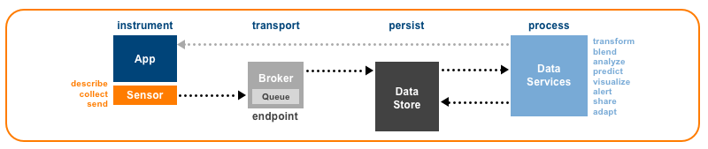</div>

<a name="sensorBehavior" />

### 4.1 Behavior
A Caliper [Sensor](#sensor) MUST be capable of serializing and sending a Caliper [Envelope](#envelope) containing the following payloads to one or more target [Endpoints](#endpoint).

* A JSON array consisting of one or more Caliper [Event](#event) documents, each expressed as JSON-LD.
* A JSON array consisting of one or more Caliper [Entity](#entity) "describe" documents, each expressed as JSON-LD.
* A JSON array consisting of a mix of one or more Caliper [Event](#event) and [Entity](#entity) describe documents, each expressed as JSON-LD.

A [Sensor](#sensor) MAY be assigned other responsibilities such as creating and validating Caliper entities and events but such capabilities need not be exposed to external data consumers.  

<a name="sensorEnvelope" />

### 4.2 Envelope
Caliper [Event](#event) and [Entity](#entity) data are transmitted inside an [Envelope](#envelope), a purpose-built JSON data structure that includes metadata about the emitting [Sensor](#sensor) and the data payload.  Each [Event](#event) and [Entity](#entity) "describe" included in an envelope's `data` array MUST be expressed as a [JSON-LD](#jsonld) document. 

#### Properties
Caliper [Envelope](#envelope) properties are listed below.  The `sensor`, `sendTime`, `dataVersion` and `data` properties are required.  Each property MUST be referenced only once.  No custom properties are permitted.

| Property | Type | Description | Conformance |
| :------- | :--- | ----------- | :---------: |
| sensor | string | A unique identifier assigned either to the [Sensor](#sensor) or to the instrumented platform, application or service utilizing the [Sensor](#sensor) MUST be specified.  The identifier SHOULD be in the form of an [IRI](#iriDef). | Required |
| sendTime | DateTime | A date and time string value expressed with millisecond precision that indicates the time at which the [Sensor](#sensor) issued the message MUST be specified.  The value MUST be expressed as an ISO-8601 formatted date/time string set to UTC. | Required |
| dataVersion | string | A string value indicating which version of the IMS Caliper Analytics® specification governs the form of the Caliper entities and events contained in the `data` payload MUST be specified. The value MUST be set to the IMS Caliper [Context](http://purl.imsglobal.org/ctx/caliper/v1p1) [IRI](#iriDef) used to resolve the meanings of the `data` payload's terms and values. | Required |
| data | Array | An ordered collection of one or more Caliper [Entity](#entity) describes and/or [Event](#event) types.  The Sensor MAY mix describes and events in the same [Envelope](#envelope). | Required |

#### Example: Mixed payload
```
{
  "sensor": "https://example.edu/sensors/1",
  "sendTime": "2017-11-15T11:05:01.000Z",
  "dataVersion":  "http://purl.imsglobal.org/ctx/caliper/v1p1",
  "data": [
    {
      "@context": "http://purl.imsglobal.org/ctx/caliper/v1p1",
      "id": "https://example.edu/users/554433",
      "type": "Person",
      "dateCreated": "2017-08-01T06:00:00.000Z",
      "dateModified": "2017-09-02T11:30:00.000Z"
    },
    {
      "@context": "http://purl.imsglobal.org/ctx/caliper/v1p1",
      "id": "https://example.edu/terms/201701/courses/7/sections/1/assess/1?ver=v1p0",
      "type": "Assessment",
      "name": "Quiz One",
      "items": [
        {
          "id": "https://example.edu/terms/201701/courses/7/sections/1/assess/1/items/1",
          "type": "AssessmentItem"
        },
        {
          "id": "https://example.edu/terms/201701/courses/7/sections/1/assess/1/items/2",
          "type": "AssessmentItem"
        },
        {
          "id": "https://example.edu/terms/201701/courses/7/sections/1/assess/1/items/3",
          "type": "AssessmentItem"
        }
      ],
      "dateCreated": "2017-08-01T06:00:00.000Z",
      "dateModified": "2017-09-02T11:30:00.000Z",
      "datePublished": "2017-08-15T09:30:00.000Z",
      "dateToActivate": "2017-08-16T05:00:00.000Z",
      "dateToShow": "2017-08-16T05:00:00.000Z",
      "dateToStartOn": "2017-08-16T05:00:00.000Z",
      "dateToSubmit": "2017-09-28T11:59:59.000Z",
      "maxAttempts": 2,
      "maxScore": 15.0,
      "maxSubmits": 2,
      "version": "1.0"
    },
    {
      "@context": "http://purl.imsglobal.org/ctx/caliper/v1p1",
      "id": "https://example.edu",
      "type": "SoftwareApplication",
      "version": "v2"
    },
    {
      "@context": "http://purl.imsglobal.org/ctx/caliper/v1p1",
      "id": "https://example.edu/terms/201701/courses/7/sections/1",
      "type": "CourseSection",
      "academicSession": "Fall 2016",
      "courseNumber": "CPS 435-01",
      "name": "CPS 435 Learning Analytics, Section 01",
      "category": "seminar",
      "subOrganizationOf": {
        "id": "https://example.edu/terms/201701/courses/7",
        "type": "CourseOffering",
        "courseNumber": "CPS 435"
      },
      "dateCreated": "2017-08-01T06:00:00.000Z"
    },
    {
      "@context": "http://purl.imsglobal.org/ctx/caliper/v1p1",
      "id": "urn:uuid:c51570e4-f8ed-4c18-bb3a-dfe51b2cc594",
      "type": "AssessmentEvent",
      "actor": "https://example.edu/users/554433",
      "action": "Started",
      "object": "https://example.edu/terms/201701/courses/7/sections/1/assess/1?ver=v1p0",
      "generated": {
        "id": "https://example.edu/terms/201701/courses/7/sections/1/assess/1/users/554433/attempts/1",
        "type": "Attempt",
        "assignee": "https://example.edu/users/554433",
        "assignable": "https://example.edu/terms/201701/courses/7/sections/1/assess/1?ver=v1p0",
        "count": 1,
        "dateCreated": "2017-11-15T10:15:00.000Z",
        "startedAtTime": "2017-11-15T10:15:00.000Z"
      },
      "eventTime": "2017-11-15T10:15:00.000Z",
      "edApp": "https://example.edu",
      "group": "https://example.edu/terms/201701/courses/7/sections/1",
      "membership": {
        "id": "https://example.edu/terms/201701/courses/7/sections/1/rosters/1",
        "type": "Membership",
        "member": "https://example.edu/users/554433",
        "organization": "https://example.edu/terms/201701/courses/7/sections/1",
        "roles": [ "Learner" ],
        "status": "Active",
        "dateCreated": "2017-08-01T06:00:00.000Z"
      },
      "session": {
        "id": "https://example.edu/sessions/1f6442a482de72ea6ad134943812bff564a76259",
        "type": "Session",
        "startedAtTime": "2017-11-15T10:00:00.000Z"
      }
    },
    {
      "@context": "http://purl.imsglobal.org/ctx/caliper/v1p1",
      "id": "urn:uuid:dad88464-0c20-4a19-a1ba-ddf2f9c3ff33",
      "type": "AssessmentEvent",
      "actor": "https://example.edu/users/554433",
      "action": "Submitted",
      "object": "https://example.edu/terms/201701/courses/7/sections/1/assess/1?ver=v1p0",
      "generated": {
        "id": "https://example.edu/terms/201701/courses/7/sections/1/assess/1/users/554433/attempts/1",
        "type": "Attempt",
        "assignee": "https://example.edu/users/554433",
        "assignable": "https://example.edu/terms/201701/courses/7/sections/1/assess/1",
        "count": 1,
        "dateCreated": "2017-11-15T10:15:00.000Z",
        "startedAtTime": "2017-11-15T10:15:00.000Z",
        "endedAtTime": "2017-11-15T10:55:12.000Z",
        "duration": "PT50M12S"
      },
      "eventTime": "2017-11-15T10:25:30.000Z",
      "edApp": "https://example.edu",
      "group": "https://example.edu/terms/201701/courses/7/sections/1",
      "membership": {
        "id": "https://example.edu/terms/201701/courses/7/sections/1/rosters/1",
        "type": "Membership",
        "member": "https://example.edu/users/554433",
        "organization": "https://example.edu/terms/201701/courses/7/sections/1",
        "roles": ["Learner"],
        "status": "Active",
        "dateCreated": "2017-08-01T06:00:00.000Z"
      },
      "session": {
        "id": "https://example.edu/sessions/1f6442a482de72ea6ad134943812bff564a76259",
        "type": "Session",
        "startedAtTime": "2017-11-15T10:00:00.000Z"
      }
    },
    {
      "@context": "http://purl.imsglobal.org/ctx/caliper/v1p1",
      "id": "urn:uuid:a50ca17f-5971-47bb-8fca-4e6e6879001d",
      "type": "OutcomeEvent",
      "actor": {
        "id": "https://example.edu/autograder",
        "type": "SoftwareApplication",
        "version": "v2"
      },
      "action": "Graded",
      "object": {
        "id": "https://example.edu/terms/201701/courses/7/sections/1/assess/1/users/554433/attempts/1",
        "type": "Attempt",
        "assignee": "https://example.edu/users/554433",
        "assignable": "https://example.edu/terms/201701/courses/7/sections/1/assess/1?ver=v1p0",
        "count": 1,
        "dateCreated": "2017-11-15T10:05:00.000Z",
        "startedAtTime": "2017-11-15T10:05:00.000Z",
        "endedAtTime": "2017-11-15T10:55:12.000Z",
        "duration": "PT50M12S"
      },
      "eventTime": "2017-11-15T10:57:06.000Z",
      "edApp": "https://example.edu",
      "generated": {
        "id": "https://example.edu/terms/201701/courses/7/sections/1/assess/1/users/554433/results/1",
        "type": "Result",
        "attempt": "https://example.edu/terms/201701/courses/7/sections/1/assess/1/users/554433/attempts/1",
        "normalScore": 15.0,
        "totalScore": 15.0,
        "scoredBy": "https://example.edu/autograder",
        "dateCreated": "2017-11-15T10:55:05.000Z"
      },
      "group": "https://example.edu/terms/201701/courses/7/sections/1"
    }
  ]
}
```

<a name="sensorTransport" />

### 4.3 Transport

Business requirements informed by industry best practices will determine the choice of transport protocol for Caliper [Sensor](#sensor) and [Endpoint](#endpoint) implementors.  _Note that the IMS Caliper certification suite currently requires implementors seeking certification to send data to the certification test [Endpoint](#endpoint) using HTTPS with a bearer token credential consistent with [RFC 6750](#rfc6750)._  Where an alternate transport protocol is preferred for performance or other considerations, it is recommended to add that support in addition to HTTP transport for maximum interoperability.

Irrespective of the chosen transport protocol, each message sent by a [Sensor](#sensor) to a target [Endpoint](#endpoint) MUST consist of a single JSON representation of a Caliper [Envelope](#envelope). 

#### 4.3.1 HTTP Transport Requirements
 
* A [Sensor](#sensor) SHOULD be capable of communicating with a Caliper [Endpoint](#endpoint) over HTTP with the connection encrypted by TLS or SSL.
* Messages MUST be sent using the POST request method.
* The following standard HTTP request headers MUST be set for use by the [Endpoint](#endpoint):
  * `Accept`
  * `Content-Type`
  * `Host`
* The `Content-Type` value MUST be set to the IANA media type "application/json".
* The following standard HTTP request headers SHOULD be set for use by the [Endpoint](#endpoint):
  * `Authorization`
  * `Content-Length`
* A [Sensor](#sensor) SHOULD support message authentication using the `Authorization` request header as described in [RFC 6750](#rfc6750), [Section 2.1](https://tools.ietf.org/html/rfc6750#section-2).  The `b64token` authorization credential sent by a [Sensor](#sensor) MUST be one the [Endpoint](#endpoint) can validate although the credential MAY be opaque to the emitting [Sensor](#sensor) itself. 
* The `Content-Length` of the request body MUST be measured in octets (8-bit bytes).


<a name="endpoint" />

## 5.0 Endpoint

A Caliper [Endpoint](#endpoint) SHOULD be capable of communicating with a [Sensor](#sensor) via the conventional HTTP protocol using standard POST request method.  Caliper [Endpoints](#endpoint) MAY use other transport protocols to receive data from sensors.  See [Endpoints supporting non-HTTP protocols](#nonHttpEndpoint) for recommendations.

<a name="endpointStringLengths" />

### 5.1 Minimum Supported String Lengths
Certain Caliper data properties are expressed as strings of variable length.  [JSON-LD](#jsonldDef) also defines a set of processing algorithms for transforming [JSON-LD](#jsonldDef) documents in ways that can change the length of keys and values that are expressed as [IRIs](#iridDef), compact [IRIs](#iridDef) or [Terms](#termDef).  Many implementors will choose to store each incoming [Event](#event) and [Entity](#entity) *describe* received as a [JSON-LD](#jsonldDef) document or as a graph data structure consisting of nodes, edges and properties.  Others may opt to normalize or "flatten" some or all of the nested JSON objects that comprise a Caliper [Event](#event) or [Entity](#entity).  If the chosen persistence strategy involves normalizing Caliper semi-structured data, the following *minimum* character lengths SHOULD be adopted for the Caliper string properties listed below.  

| Domain | Property | Description | Minimum Length |
| :------| :------- | :---------- | ---------: |
| [Event](#event) | id | A [UUID](#uuidDef) assigned to the [Event](#event) that is expressed as a [URN](#urnDef) in the form `urn:uuid:<UUID>`. | 2048 |
| [Event](#event) | type | The Caliper [Term](termDef) designated for the [Event](#event). | 256 |
| [Event](#event) | action | The Caliper [Term](termDef) designated for the supported action. | 256 |
| [Event](#event) | eventTime | A date and time value expressed with millisecond precision that indicates when the [Event](#event) occurred. The value MUST be expressed as an ISO-8601 formatted date/time string set to UTC. | 64 |
| [Entity](#entity) | id | The [IRI](#iriDef) assigned to the [Entity](#entity). | 2048 |
| [Entity](#entity) | type | The Caliper designated [Term](termDef) for the [Entity](#entity). | 256 |
| [Entity](#entity) | name | A word or phrase by which the [Entity](#entity) is known. | 256 |
| [Entity](#entity) | description | A human-readable plain text representation of the [Entity](#entity). | 1024 |
| [Entity](#entity) | dateCreated | A date and time value expressed with millisecond precision that describes when the [Entity](#entity) was created. The value MUST be expressed as an ISO-8601 formatted date/time string set to UTC. | 64 |
| [Entity](#entity) | dateModified | A date and time value expressed with millisecond precision that describes when the [Entity](#entity) was last modified. The value MUST be expressed as an ISO-8601 formatted date/time string set to UTC. | 64 |
| [AssignableDigitalResource](#assignableDigitalResource) | dateToActivate | A date and time value expressed with millisecond precision that describes when the resource was activated. The value MUST be expressed as an ISO-8601 formatted date/time string set to UTC. | 64 |
| [AssignableDigitalResource](#assignableDigitalResource) | dateToShow | A date and time value expressed with millisecond precision that describes when the resource should be shown or made available to learners. The value MUST be expressed as an ISO-8601 formatted date/time string set to UTC. | 64 |
| [AssignableDigitalResource](#assignableDigitalResource) | dateToStartOn | A date and time value expressed with millisecond precision that describes when the resource can be started. The value MUST be expressed as an ISO-8601 formatted date/time string set to UTC. | 64 |
| [AssignableDigitalResource](#assignableDigitalResource) | dateToSubmit | A date and time value expressed with millisecond precision that describes when the resource is to be submitted for evaluation. The value MUST be expressed as an ISO-8601 formatted date/time string set to UTC. | 64 |
| [Attempt](#attempt) | staredAtTime | A date and time value expressed with millisecond precision that describes when the [Attempt](#attempt) was commenced. The value MUST be expressed as an ISO-8601 formatted date/time string set to UTC. | 64 |
| [Attempt](#attempt) | endedAtTime | A date and time value expressed with millisecond precision that describes when the [Attempt](#attempt) was completed or terminated. The value MUST be expressed as an ISO-8601 formatted date/time string set to UTC. | 64 |
| [Attempt](#attempt) | duration | A time interval that represents the time taken to complete the [Attempt](#attempt).  The value MUST conform to the ISO-8601 duration format. | 64 |
| [AudioObject](#audioObject) | volumeLevel | The current volume level. | 32 |
| [AudioObject](#audioObject) | volumeMax | The maximum volume level permitted. | 32 |
| [AudioObject](#audioObject) | volumeMin | The minimum volume level permitted.  | 32 |
| [BookmarkAnnotation](#bookmarkAnnotation) | BookmarkNotes | A plain text rendering of the note that accompanies the bookmark. | 1024 |
| [CourseOffering](#courseOffering) | academicSession | A human-readable identifier of the designated period in which the course occurs. | 256 |
| [CourseOffering](#courseOffering) | courseNumber | A human-readable identifier assigned to the course. | 128 |
| [CourseSection](#courseSection) | category | A string value that characterizes the purpose of the section such as "lecture", "lab" or "seminar" MAY be specified. | 128 |
| [DigitalResource](#digitalResource) | mediaType | IANA approved media type or subtype that identifies the file format of the resource. | 128 |
| [DigitalResource](#digitalResource) | datePublished | A date and time value expressed with millisecond precision that provides the publication date of the resource. The value MUST be expressed as an ISO-8601 formatted date/time string set to UTC. | 64 |
| [DigitalResource](#digitalResource) | version | Designates the current form or version of the resource. | 64 |
| [FillinBlankResponse](#fillinBlankResponse) | values\<value\> | Minimum supported length applies to each plain text response included in the `values` array. | 256 |
| [HighlightAnnotation](#highlightAnnotation) | selectionText | A plain text rendering of the highlighted segment of the annotated resource. | 2048 |
| [MediaLocation](#mediaLocation) | currentTime | A time interval or duration that represents the current playback position measured from the beginning of a [MediaObject](#mediaObject).  The value MUST conform to the ISO-8601 duration format. | 64 |
| [MediaObject](#mediaObject) | duration | A time interval that represents the time taken to complete the [MediaObject](#mediaObject).  The value MUST conform to the ISO-8601 duration format. | 64 |
| [Membership](#membership) | roles\<role\> | Minimum supported length applies to each Caliper designated role [Term](#termDef) included in the `roles` array. | 256 |
| [Membership](#membership) | status | The Caliper [Term](termDef) designated for the selected status. | 256 | 
| [Message](#message) | body | A plain-text rendering of the body content of the [Message](#message). | 4096 | 
| [MultipleChoiceResponse](#multipleChoiceResponse) | value | Plain text representation of the selected option | 256 |
| [MultipleResponseResponse](#multipleResponseResponse) | values\<value\> | Minimum supported length applies to each selected option included in the `values` array. | 256 |
| [Response](#response) | staredAtTime | A date and time value expressed with millisecond precision that describes when the [Response](#response) was commenced. The value MUST be expressed as an ISO-8601 formatted date/time string set to UTC. | 64 |
| [Response](#response) | endedAtTime | A date and time value expressed with millisecond precision that describes when the [Response](#response) was completed or terminated. The value MUST be expressed as an ISO-8601 formatted date/time string set to UTC. | 64 |
| [Response](#response) | duration | A time interval that represents the time taken to complete the [Response](#response).  The value MUST conform to the ISO-8601 duration format. | 64 |
| [Result](#result) | comment | Plain text feedback provided by the scorer. | 1024 |
| [SelectTextResponse](#selectTextResponse) | values\<value\> | Minimum supported length applies to each selected response included in the `values` array. | 256 |
| [SoftwareApplication](#softwareApplication) | version | Designates the current form or version of the [SoftwareApplication](#softwareApplication). | 64 |
| [Session](#session) | staredAtTime | A date and time value expressed with millisecond precision that describes when the [Session](#session) was commenced. The value MUST be expressed as an ISO-8601 formatted date/time string set to UTC. | 64 |
| [Session](#session) | endedAtTime | A date and time value expressed with millisecond precision that describes when the [Session](#session) was completed or terminated. The value MUST be expressed as an ISO-8601 formatted date/time string set to UTC. | 64 |
| [Session](#session) | duration | A time interval that represents the time taken to complete the [Session](#session).  The value MUST conform to the ISO-8601 duration format. | 64 |
| [TrueFalseResponse](#trueFalseResponse) | value | True/false, yes/no binary selection that constitutes the selected option. | 32 |

### 5.2 Endpoint Requirements

<a name="httpEndpoint" />

#### 5.2.1 HTTP Endpoint Requirements
* An [Endpoint](#httpEndpoint) SHOULD use HTTPS to secure the connection between the [Sensor](#sensor) and itself; if implemented a valid TLS/SSL Certificate MUST be provided.
* An [Endpoint](#httpEndpoint) MUST be capable of accessing standard HTTP request headers.
* An [Endpoint](#httpEndpoint) SHOULD support message authentication using the `Authorization` request header as described in [RFC 6750](#rfc6750), [Section 2.1](https://tools.ietf.org/html/rfc6750#section-2).

When communicating over HTTP an [Endpoint](#httpEndpoint) MUST exhibit the following response behaviour:

* To signal to a [Sensor](#sensor) that it has successfully received an emitted [Envelope](#envelope) an [Endpoint](#httpEndpoint) MUST reply with a `2xx` class status code. The [Endpoint](#httpEndpoint) SHOULD use the `200 OK` response but MAY instead choose to send a `201 Created` response (to indicate successful receipt of the message and creation of a new resource) or a `202 Accepted` response (to indicate successful acceptance of the message and queueing for further processing). The body of a successful response SHOULD be empty.
* If the [Sensor](#sensor) sends a malformed Caliper [Envelope](#envelope) (it does not contain `sensor`, `sendTime`, `dataVersion` and `data` properties of the required form), the [Endpoint](#endpoint) SHOULD reply with a `400 Bad Request` response.  Note that the [Endpoint](#httpEndpoint) SHOULD NOT send a `400 Bad Request` response if the [Envelope](#envelope) contains a `dataVersion` value that the [Endpoint](#httpEndpoint) cannot support; in this case, the [Endpoint](#httpEndpoint) SHOULD send a `422 Unprocessable Entity` response instead.
* If the [Sensor](#sensor) sends a message with a `Content-Type` other than "application/json", the [Endpoint](#httpEndpoint) SHOULD reply with a `415 Unsupported Media Type` response.
* If the [Sensor](#sensor) sends a message without an `Authorization` request header of the RECOMMENDED form or sends a token credential that the [Endpoint](#httpEndpoint) is unable to either validate or determine has sufficient privileges to submit Caliper data, the [Endpoint](#httpEndpoint) SHOULD reply with a `401 Unauthorized` response.
* The [Endpoint](#httpEndpoint) MAY respond to [Sensor](#sensor) messages with other standard HTTP status codes to indicate result dispositions of varying kinds.  The [Endpoint](#httpEndpoint) MAY also communicate more detailed information about problem states, using the standard method for reporting problem details described in [RFC 7807](#rfc7807).

Caliper [Endpoint](#httpEndpoint) implementers should bear in mind that some Caliper [Sensor](#sensor) implementations may lack sophisticated error handling.

<a name="nonHttpEndpoint" />

#### 5.2.2 Endpoints supporting non-HTTP protocols
Support for non-HTTP transport protocols involves a negotiation between the Caliper [Sensor](#sensor) and [Endpoint](#endpoint) implementations. It is RECOMMENDED that a Caliper [Endpoint](#endpoint) include support for communicating with Caliper [Sensors](#sensor) over HTTP to ensure maximum interoperability.

<a name="actions"/>
   
## Appendix A. Actions
Caliper includes a vocabulary of actions for describing learning interactions. Each action [Term](#termdef) is based on the past-tense form of an English (en-US) verb.  An action [Term](#termdef) can also indicate a change in a particular characteristic of the `object` (e.g., resolution, size, speed, volume).  Each action [Term](#termdef) is mapped to a persistent [IRI](#iriDef) listed in the external IMS Caliper JSON-LD [context](http://purl.imsglobal.org/ctx/caliper/v1p1).  Each action is also linked to a brief definition ("gloss") derived in whole or in part from Princeton University's WordNet® project in order to eliminate ambiguity and aid natural language processing.
 
 Each Caliper [Event](#event) type supports one one or more of the actions listed below.  The [Event](#event) `action` property string value MUST be set to the appropriate [Term](#termDef). Only one action may be specified per [Event](#event).

| Term (IRI) | WordNet® Gloss |
| :--------- | :------------- |
| <a name="abandoned" />Abandoned (http://purl.imsglobal.org/vocab/caliper/action#Abandoned) | [Forsake, leave behind](http://wordnet-rdf.princeton.edu/wn31/202232813-v). |
| <a name="activated" />Activated (http://purl.imsglobal.org/vocab/caliper/action#Activated) | [Make active or more active](http://wordnet-rdf.princeton.edu/wn31/200191014-v).  Inverse of [Deactivated](#deactivated). |
| <a name="added" />Added (http://purl.imsglobal.org/vocab/caliper/action#Added) | [Make an addition (to); join or combine or unite with others; increase the quality, quantity, size or scope of](http://wordnet-rdf.princeton.edu/wn31/200182551-v).  Inverse of [Removed](#removed). |
| <a name="attached" />Attached (http://purl.imsglobal.org/vocab/caliper/action#Attached) | [Cause to be attached](http://wordnet-rdf.princeton.edu/wn31/201299048-v). |
| <a name="bookmarked" />Bookmarked (http://purl.imsglobal.org/vocab/caliper/action#Bookmarked) | [A marker](http://wordnet-rdf.princeton.edu/wn31/102874508-n) that specifies a location of interest in a [DigitalResource](#digitalResource) that is recorded for later retrieval. |
| <a name="changedResolution" />ChangedResolution (http://purl.imsglobal.org/vocab/caliper/action#ChangedResolution) | [Cause to change; make different; cause a transformation](http://wordnet-rdf.princeton.edu/wn31/200126072-v) of [the number of pixels per square inch on a computer-generated display](http://wordnet-rdf.princeton.edu/wn31/111526370-n). |
| <a name="changedSize" />ChangedSize (http://purl.imsglobal.org/vocab/caliper/action#ChangedSize) | [Cause to change; make different; cause a transformation](http://wordnet-rdf.princeton.edu/wn31/200126072-v) of [the physical magnitude of something](http://wordnet-rdf.princeton.edu/wn31/105106204-n). |
| <a name="changedSpeed" />ChangedSpeed (http://purl.imsglobal.org/vocab/caliper/action#ChangedSpeed) | [Cause to change; make different; cause a transformation](http://wordnet-rdf.princeton.edu/wn31/200126072-v) of the [rate at which something happens](http://wordnet-rdf.princeton.edu/wn31/105065291-n). |
| <a name="changedVolume" />ChangedVolume (http://purl.imsglobal.org/vocab/caliper/action#ChangedVolume) | [Cause to change; make different; cause a transformation](http://wordnet-rdf.princeton.edu/wn31/200126072-v) of [the magnitude of sound &#40;usually in a specified direction&#41;](http://wordnet-rdf.princeton.edu/wn31/104997456-n). |
| <a name="classified" />Classified (http://purl.imsglobal.org/vocab/caliper/action#Classified) | [Assign to a class or kind](http://wordnet-rdf.princeton.edu/wn31/200741667-v). |
| <a name="closedPopout" />ClosedPopout (http://purl.imsglobal.org/vocab/caliper/action#ClosedPopout) | [Close or shut](http://wordnet-rdf.princeton.edu/wn31/201349660-v) a video popout.  Inverse of [OpenedPopout](#openedPopout). |
| <a name="commented" />Commented (http://purl.imsglobal.org/vocab/caliper/action#Commented) | [Make or write a comment on](http://wordnet-rdf.princeton.edu/wn31/201060446-v). |
| <a name="completed" />Completed (http://purl.imsglobal.org/vocab/caliper/action#Completed) | [Come or bring to a finish or an end](http://wordnet-rdf.princeton.edu/wn31/200485097-v). |
| <a name="created" />Created (http://purl.imsglobal.org/vocab/caliper/action#Created) | [Make or cause to be or to become](http://wordnet-rdf.princeton.edu/wn31/201620211-v).  Inverse of [Deleted](#deleted). |
| <a name="deactivated" />Deactivated (http://purl.imsglobal.org/vocab/caliper/action#Deactivated) | [Make inactive](http://wordnet-rdf.princeton.edu/wn31/200191849-v).  Inverse of [Activated](#activated). |
| <a name="deleted" />Deleted (http://purl.imsglobal.org/vocab/caliper/action#Deleted) | [Wipe out digitally](http://wordnet-rdf.princeton.edu/wn31/201001860-v).  Inverse of [Created](#created). |
| <a name="described" />Described (http://purl.imsglobal.org/vocab/caliper/action#Described) | [Give a description of](http://wordnet-rdf.princeton.edu/wn31/200989103-v). |
| <a name="disabledClosedCaptioning" />DisabledClosedCaptioning (http://purl.imsglobal.org/vocab/caliper/action#DisabledClosedCaptioning) | [Render unable to perform](http://wordnet-rdf.princeton.edu/wn31/200513267-v) the visual display of a plain text transcription of audio output.  Inverse of [EnabledClosedCaptioning](#enabledClosedCaptioning). |
| <a name="disliked" />Disliked (http://purl.imsglobal.org/vocab/caliper/action#Disliked) | [Have or feel a dislike or distaste for](http://wordnet-rdf.princeton.edu/wn31/201780648-v). Inverse of [Liked](#liked). |
| <a name="enabledClosedCaptioning" />EnabledClosedCaptioning (http://purl.imsglobal.org/vocab/caliper/action#EnabledClosedCaptioning) | [Render capable or able](http://wordnet-rdf.princeton.edu/wn31/200513958-v) the visual display of a plain text transcription of audio output.  Inverse of [DisabledClosedCaptioning](#disabledClosedCaptioning). |
| <a name="ended" />Ended (http://purl.imsglobal.org/vocab/caliper/action#Ended) | [Bring to an end or halt](http://wordnet-rdf.princeton.edu/wn31/200353480-v).  Inverse of [Started](#started). |
| <a name="enteredFullscreen" />EnteredFullScreen (http://purl.imsglobal.org/vocab/caliper/action#EnteredFullscreen) | [To come or go into](http://wordnet-rdf.princeton.edu/wn31/202020375-v) a view mode that utilizes all the available display surface of a screen.  Inverse of [ExitedFullScreen](#exitedFullScreen). |
| <a name="exitedFullscreen" />ExitedFullScreen (http://purl.imsglobal.org/vocab/caliper/action#ExitedFullscreen) | [Move out of or depart from](http://wordnet-rdf.princeton.edu/wn31/202019450-v) a view mode that utilizes all the available display surface of a screen.  Inverse of [EnteredFullScreen](#enteredFullScreen). |
| <a name="forwardedTo" />ForwardedTo (http://purl.imsglobal.org/vocab/caliper/action#ForwardedTo) | [Send or ship onward](http://wordnet-rdf.princeton.edu/wn31/201959367-v). |
| <a name="graded" />Graded (http://purl.imsglobal.org/vocab/caliper/action#Graded) | [Assign a grade or rank to, according to one's evaluation](http://wordnet-rdf.princeton.edu/wn31/200659399-v). |
| <a name="hid" />Hid ([http://purl.imsglobal.org/vocab/caliper/action#Hid](http://purl.imsglobal.org/vocab/caliper/action#Hid) |[Prevent from being seen or discovered](http://wordnet-rdf.princeton.edu/wn31/202149298-v).  Inverse of [Showed](#showed). |
| <a name="highlighted" />Highlighted (http://purl.imsglobal.org/vocab/caliper/action#Highlighted) | [Move into the foreground to make more visible or prominent](http://wordnet-rdf.princeton.edu/wn31/200515150-v). |
| <a name="identified" />Identified (http://purl.imsglobal.org/vocab/caliper/action#Identified) | [Recognize as being; establish the identity of someone or something](http://wordnet-rdf.princeton.edu/wn31/200620568-v). |
| <a name="jumpedTo" />JumpedTo (http://purl.imsglobal.org/vocab/caliper/action#JumpedTo) | [Pass abruptly from one state or topic to another](http://wordnet-rdf.princeton.edu/wn31/200561468-v). |
| <a name="liked" />Liked (http://purl.imsglobal.org/vocab/caliper/action#Liked) | [Be fond of](http://wordnet-rdf.princeton.edu/wn31/201780873-v).  Inverse of [Disliked](#disliked). |
| <a name="linked" />Linked (http://purl.imsglobal.org/vocab/caliper/action#Linked) | [Connect, fasten, or put together two or more pieces](http://wordnet-rdf.princeton.edu/wn31/201357376-v). |
| <a name="loggedIn" />LoggedIn (http://purl.imsglobal.org/vocab/caliper/action#LoggedIn) | [Enter a computer or software application](http://wordnet-rdf.princeton.edu/wn31/202253955-v).  Inverse of [LoggedOut](#loggedOut). |
| <a name="loggedOut" />LoggedOut (http://purl.imsglobal.org/vocab/caliper/action#LoggedOut) | [Exit a computer or software application](http://wordnet-rdf.princeton.edu/wn31/202254101-v).  Inverse of [LoggedIn](#loggedIn). |
| <a name="markedAsRead" />MarkedAsRead (http://purl.imsglobal.org/vocab/caliper/action#MarkedAsRead) | [Mark: designate as if by a mark](http://wordnet-rdf.princeton.edu/wn31/200923709-v), [read: interpret something that is written or printed](http://wordnet-rdf.princeton.edu/wn31/200626756-v).  Inverse of [MarkedAsUnread](#markedAsUnread).  |
| <a name="markedAsUnread" />MarkedAsUnread (http://purl.imsglobal.org/vocab/caliper/action#MarkedAsUnread) | Inverse of [MarkedAsRead](#markedAsRead). |
| <a name="modified" />Modified (http://purl.imsglobal.org/vocab/caliper/action#Modified) | [Cause to change; make different; cause a transformation](http://wordnet-rdf.princeton.edu/wn31/200126072-v). |
| <a name="muted" />Muted (http://purl.imsglobal.org/vocab/caliper/action#Muted) | [Deaden (a sound or noise)](http://wordnet-rdf.princeton.edu/wn31/mute-v).  Inverse of [Unmuted](#unmuted). |
| <a name="navigated to" />NavigatedTo (http://purl.imsglobal.org/vocab/caliper/action#NavigatedTo) | [Direct the course; determine the direction of travelling](http://wordnet-rdf.princeton.edu/wn31/201935739-v). |
| <a name="openedPopout" />OpenedPopout (http://purl.imsglobal.org/vocab/caliper/action#OpenedPopout) | [Start to operate or function or cause to start operating or functioning](http://wordnet-rdf.princeton.edu/wn31/202431018-v) a video popout.  Inverse of [ClosedPopout](#closedPopout). |
| <a name="paused" />Paused (http://purl.imsglobal.org/vocab/caliper/action#Paused) | [Cease an action temporarily](http://wordnet-rdf.princeton.edu/wn31/200781106-v).  Inverse of [Resumed](#resumed). |
| <a name="posted" />Posted (http://purl.imsglobal.org/vocab/caliper/action#Posted) | [To cause to be directed or transmitted to another place](http://wordnet-rdf.princeton.edu/wn31/201033289-v). |
| <a name="questioned" />Questioned (http://purl.imsglobal.org/vocab/caliper/action#Questioned) | [Pose a question](http://wordnet-rdf.princeton.edu/wn31/200786670-v). |
| <a name="ranked" />Ranked (http://purl.imsglobal.org/vocab/caliper/action#Ranked) | [Assign a rank or rating to](http://wordnet-rdf.princeton.edu/wn31/200659723-v). |
| <a name="recommended" />Recommended (http://purl.imsglobal.org/vocab/caliper/action#Recommended) | [Express a good opinion of](http://wordnet-rdf.princeton.edu/wn31/200884469-v). |
| <a name="removed" />Removed (http://purl.imsglobal.org/vocab/caliper/action#Removed) | [Remove from sight](http://wordnet-rdf.princeton.edu/wn31/200181704-v).  Inverse of [Added](#added). |
| <a name="reset" />Reset (http://purl.imsglobal.org/vocab/caliper/action#Reset) | [Set anew](http://wordnet-rdf.princeton.edu/wn31/200949623-v). |
| <a name="restarted" />Restarted (http://purl.imsglobal.org/vocab/caliper/action#Restarted) | [Take up or begin anew](http://wordnet-rdf.princeton.edu/wn31/200350758-v), as in to start something, make progress but then stop and return to the beginning in order to start again. |
| <a name="resumed" />Resumed (http://purl.imsglobal.org/vocab/caliper/action#Resumed) | [Take up or begin anew](http://wordnet-rdf.princeton.edu/wn31/200350758-v), as in to start something, pause and then begin again at the location where the pause in action occurred.  Inverse of [Paused](#paused). |
| <a name="retrieved" />Retrieved (http://purl.imsglobal.org/vocab/caliper/action#Retrieved) | [Obtain or retrieve from a storage device; as of information on a computer](http://wordnet-rdf.princeton.edu/wn31/202253616-v). |
| <a name="reviewed" />Reviewed (http://purl.imsglobal.org/vocab/caliper/action#Reviewed) | [Appraise critically](http://wordnet-rdf.princeton.edu/wn31/200857194-v). |
| <a name="rewound" />Rewound (http://purl.imsglobal.org/vocab/caliper/action#Rewound) | [Wind up again](http://wordnet-rdf.princeton.edu/wn31/201524927-v). |
| <a name="searched" />Searched (http://purl.imsglobal.org/vocab/caliper/action#Searched) | [Try to locate or discover, or try to establish the existence of](http://wordnet-rdf.princeton.edu/wn31/201318273-v). |
| <a name="shared" />Shared (http://purl.imsglobal.org/vocab/caliper/action#Shared) | [Communicate](http://wordnet-rdf.princeton.edu/wn31/201065952-v). |
| <a name="showed" />Showed (http://purl.imsglobal.org/vocab/caliper/action#Showed) | [Make visible or noticeable](http://wordnet-rdf.princeton.edu/wn31/202141597-v).  Inverse of [Hid](#hid). |
| <a name="skipped" />Skipped (http://purl.imsglobal.org/vocab/caliper/action#Skipped) | [Bypass](http://wordnet-rdf.princeton.edu/wn31/200618188-v). |
| <a name="started" />Started (http://purl.imsglobal.org/vocab/caliper/action#Started) | [Set in motion, cause to start](http://wordnet-rdf.princeton.edu/wn31/200349400-v).  Inverse of [Ended](#ended). |
| <a name="submitted" />Submitted (http://purl.imsglobal.org/vocab/caliper/action#Submitted) | [Hand over formally](http://wordnet-rdf.princeton.edu/wn31/202267560-v). |
| <a name="subscribed" />Subscribed (http://purl.imsglobal.org/vocab/caliper/action#Subscribed) | [Receive or obtain regularly](http://wordnet-rdf.princeton.edu/wn31/202214527-v).  Inverse of [Unsubscribed](#unsubscribed). |
| <a name="tagged" />Tagged (http://purl.imsglobal.org/vocab/caliper/action#Tagged) | [Attach a tag or label to](http://wordnet-rdf.princeton.edu/wn31/201591414-v). |
| <a name="timedOut" />TimedOut (http://purl.imsglobal.org/vocab/caliper/action#TimedOut) | Cancellation of a user session after a predetermined time interval has occurred without activity. |
| <a name="unmuted" />Unmuted (http://purl.imsglobal.org/vocab/caliper/action#Unmuted) | Inverse of [Muted](#muted). |
| <a name="unsubscribed" />Unsubscribed (http://purl.imsglobal.org/vocab/caliper/action#Unsubscribed) | Inverse of [Subscribed](#subscribed). |
| <a name="used" />Used (http://purl.imsglobal.org/vocab/caliper/action#Used) | [Put into service; make work or employ for a particular purpose or for its inherent or natural purpose](http://wordnet-rdf.princeton.edu/wn31/201161188-v). |
| <a name="viewed" />Viewed (http://purl.imsglobal.org/vocab/caliper/action#Viewed) |[Look at carefully; study mentally](http://wordnet-rdf.princeton.edu/wn31/202134765-v). |

<a name="events" />

## Appendix B. Events

<a name="event" />

### B.1 Event
A Caliper [Event](#event) is a generic type that describes a relationship established between an `actor` and an `object`, formed as a result of a purposeful [action](#actions) undertaken by the `actor` in connection to the `object` at a particular moment in time. The [Event](#event) properties `actor`, `action` and `object` form a compact data structure that resembles an [RDF](#rdf) triple linking a subject to an object via a predicate.

#### IRI
http://purl.imsglobal.org/caliper/Event

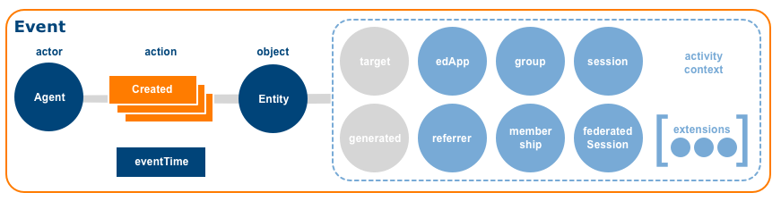

#### Properties
| Property | Type | Description | Conformance |
| :------- | :--- | ----------- | :---------: |
| id | [UUID](#uuidDef) | The emitting application MUST provision the [Event](#event) with a [UUID](#uuidDef).  A version 4 [UUID](#uuidDef) SHOULD be generated.  The UUID MUST be expressed as a [URN](#urnDef) using the form `urn:uuid:<UUID>` per [RFC 4122](#rfc4122). | Required |
| type | [Term](#termDef) | A string value corresponding to the [Term](#termDef) defined for the [Event](#event) in the external IMS Caliper JSON-LD [context](http://purl.imsglobal.org/ctx/caliper/v1p1) document MUST be specified.  For a generic [Event](#event) set the `type` to the string value *Event*.  If a subtype of [Entity](#entity) is created, set the `type` to the [Term](#termDef) corresponding to the subtype utilized, e.g., *NavigationEvent*. | Required |
| actor | [Agent](#agent) | The [Agent](#agent) who initiated the [Event](#event), typically a [Person](#person), [Organization](#organization) or [SoftwareApplication](#softwareApplication), MUST be specified.  The `actor` value MUST be expressed either as an object or coerced to a string corresponding to the actor's [IRI](#iriDef). | Required |
| action | [Term](#termDef) | The action or predicate that binds the actor or subject to the object MUST be specified.  The `action` range is limited to the set of [actions](#actions) described in this specification and may be further constrained by the chosen [Event](#event) type.  Only one `action` [Term](#termDef) may be specified per [Event](#event). | Required |
| object | [Entity](#entity) | The [Entity](#entity) that comprises the object of the interaction MUST be specified.  The `object` value MUST be expressed either as an object or coerced to a string corresponding to the object's [IRI](#iriDef). | Required |
| eventTime | DateTime | A date and time value expressed with millisecond precision that indicates when the [Event](#event) occurred MUST be specified.  The value MUST be expressed as an ISO-8601 formatted date/time string set to UTC. | Required |
| target | [Entity](#entity) | An [Entity](#entity) that represents a particular segment or location within the `object`.  The `target` value MUST be expressed either as an object or coerced to a string corresponding to the target entity's [IRI](#iriDef). | Optional |
| generated | [Entity](#entity) | An [Entity](#entity) created or generated as a result of the interaction.  The `generated` value MUST be expressed either as an object or coerced to a string corresponding to the generated entity's [IRI](#iriDef). | Optional |
| edApp | [SoftwareApplication](#softwareApplication) | A [SoftwareApplication](#softwareApplication) that constitutes the application context MAY be specified.  The `edApp` value MUST be expressed either as an object or coerced to a string corresponding to the edApp's [IRI](#iriDef). | Optional |
| referrer | [Entity](#entity)  | An [Entity](#entity) that represents the referring context MAY be specified. A [SoftwareApplication](#softwareApplication) or [DigitalResource](#digitalResource) will typically constitute the referring context.  The `referrer` value MUST be expressed either as an object or coerced to a string corresponding to the referrer's [IRI](#iriDef). | Optional |
| group | [Organization](#organization) | An [Organization](#organization) that represents the group context MAY be specified.  The `group` value MUST be expressed either as an object or coerced to a string corresponding to the group's [IRI](#iriDef). | Optional |
| membership | [Membership](#membership) | The relationship between the `actor` and the `group` in terms of roles assigned and current status MAY be specified.  The `membership` value MUST be expressed either as an object or coerced to a string corresponding to the membership entity's [IRI](#iriDef). | Optional |
| session | [Session](#session) | The current user [Session](#session) MAY be specified.  The `session` value MUST be expressed either as an object or coerced to a string corresponding to the session's [IRI](#iriDef). | Optional | 
| federatedSession | [LtiSession](#ltiSession) | If the [Event](#event) occurs within the context of an [LTI](#lti) tool launch, the actor's tool consumer [LtiSession](#ltiSession) MAY be referenced.  The `federatedSession` value MUST be expressed either as an object or coerced to a string corresponding to the federatedSession's [IRI](#iriDef). | Optional |
| extensions | Array | An ordered collection of objects not defined by the model MAY be specified for a more concise representation of the [Event](#event). | Optional |

#### Subtypes
[AnnotationEvent](#annotationEvent), [AssignableEvent](#assignableEvent), [AssessmentEvent](#assessmentEvent), [AssessmentItemEvent](#assessmentItemEvent), [ForumEvent](#forumEvent), [MediaEvent](#mediaEvent), [MessageEvent](#messageEvent), [NavigationEvent](#navigationEvent), [OutcomeEvent](#outcomeEvent), [SessionEvent](#sessionEvent), [ToolUseEvent](#toolUseEvent), [ThreadEvent](#threadEvent), [ViewEvent](#viewEvent)

#### Deprecated subtypes
[ReadingEvent](#readingEvent)

#### Example
When representing the [Event](#event) as [JSON-LD](http://json-ld.org/spec/latest/json-ld/), a `@context` key MUST be embedded in the document with a value that references the external IMS Caliper JSON-LD [context](http://purl.imsglobal.org/ctx/caliper/v1p1).

```
{
  "@context": "http://purl.imsglobal.org/ctx/caliper/v1p1",
  "id": "urn:uuid:3a648e68-f00d-4c08-aa59-8738e1884f2c",
  "type": "Event",
  "actor": {
    "id": "https://example.edu/users/554433",
    "type": "Person"
  },
  "action": "Created",
  "object": {
    "id": "https://example.edu/terms/201701/courses/7/sections/1/resources/123",
    "type": "Document",
    "name": "Course Syllabus",
    "dateCreated": "2017-11-12T07:15:00.000Z",
    "version": "1"
  },
  "eventTime": "2017-11-15T10:15:00.000Z"
}
```

<a name="annotationEvent" />

### B.2 AnnotationEvent
A Caliper [AnnotationEvent](#annotationEvent) models the annotating of digital content.  The resulting [Annotation](#annotation) is also described and is subtyped for greater type specificity.

#### IRI
http://purl.imsglobal.org/caliper/AnnotationEvent

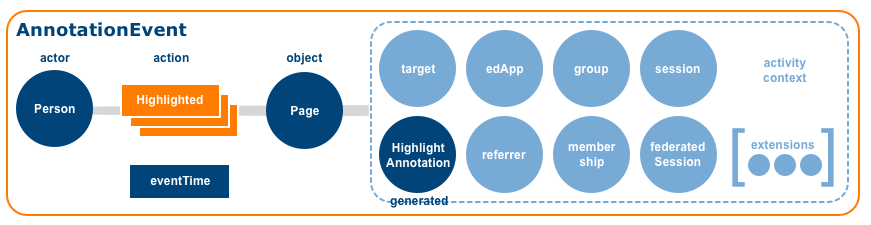

#### Supertype
[Event](#event)

#### Generated annotations
[Annotation](#annotation), [BookmarkAnnotation](#bookmarkAnnotation), [HighlightAnnotation](#highlightAnnotation), [SharedAnnotation](#sharedAnnotation), [TagAnnotation](#tagAnnotation)

#### Supported Actions
| Action | WordNet® Gloss |
| :----- | :------------- |
| [Bookmarked](#bookmarked) | [A marker](http://wordnet-rdf.princeton.edu/wn31/102874508-n) that specifies a location of interest in a [DigitalResource](#digitalResource) that is recorded for later retrieval. |
| [Highlighted](#highlighted) | [Move into the foreground to make more visible or prominent](http://wordnet-rdf.princeton.edu/wn31/200515150-v). |
| [Shared](#shared) | [Communicate](http://wordnet-rdf.princeton.edu/wn31/201065952-v). |
| [Tagged](#tagged) | [Attach a tag or label to](http://wordnet-rdf.princeton.edu/wn31/201591414-v). |

#### Deprecated Actions
The following actions are deprecated and targeted for removal from the [AnnotationEvent](#annotationEvent) list of supported actions.  The actions will be retained as entries in the Caliper [actions](#actions) vocabulary as many are likely to appear in future Metric Profiles.  

| Action | WordNet® Gloss |
| :----- | :------------- |
| [Attached](#attached) | [Cause to be attached](http://wordnet-rdf.princeton.edu/wn31/201299048-v). |
| [Classified](#classified) | [Assign to a class or kind](http://wordnet-rdf.princeton.edu/wn31/200741667-v). | 
| [Commented](#commented) | [Make or write a comment on](http://wordnet-rdf.princeton.edu/wn31/201060446-v). |
| [Described](#described) | [Give a description of](http://wordnet-rdf.princeton.edu/wn31/200989103-v). ||
| [Disliked](#disliked) | [Have or feel a dislike or distaste for](http://wordnet-rdf.princeton.edu/wn31/201780648-v). Inverse of [Liked](#liked). |
| [Identified](#identified) | [Recognize as being; establish the identity of someone or something](http://wordnet-rdf.princeton.edu/wn31/200620568-v). |
| [Liked](#liked) | [Be fond of](http://wordnet-rdf.princeton.edu/wn31/201780873-v).  Inverse of [Disliked](#disliked). |
| [Linked](#linked) | [Connect, fasten, or put together two or more pieces](http://wordnet-rdf.princeton.edu/wn31/201357376-v). |
| [Questioned](#questioned) | [Pose a question](http://wordnet-rdf.princeton.edu/wn31/200786670-v). |
| [Ranked](#ranked) | [Assign a rank or rating to](http://wordnet-rdf.princeton.edu/wn31/200659723-v). |
| [Recommended](#recommended) | [Express a good opinion of](http://wordnet-rdf.princeton.edu/wn31/200884469-v). |
| [Subscribed](#subscribed) | [Receive or obtain regularly](http://wordnet-rdf.princeton.edu/wn31/202214527-v).  Inverse of [Unsubscribed](#unsubscribed). |
 
#### Properties
[AnnotationEvent](#annotationEvent) inherits all properties defined by its supertype [Event](#event). Additional requirements are described below:

| Property | Type | Description | Conformance |
| :------- | :--- | ----------- | :---------: |
| id | [UUID](#uuidDef) | The emitting application MUST provision the [Event](#event) with a [UUID](#uuidDef).  A version 4 [UUID](#uuidDef) SHOULD be generated.  The UUID MUST be expressed as a [URN](#urnDef) using the form `urn:uuid:<UUID>` per [RFC 4122](#rfc4122). | Required |
| type | [Term](#termDef) | The string value MUST be set to the [Term](#termDef) *AnnotationEvent*. | Required |
| actor | [Person](#person) | the [Person](#person) who initiated the `action` MUST be specified.  The `actor` value MUST be expressed either as an object or coerced to a string corresponding to the actor's [IRI](#iriDef). | Required |
| action | string | The action or predicate that binds the `actor` or subject to the `object` MUST be specified.  The value range is limited to the supported action terms listed above.  Only one `action` term may be specified per [Event](#event).  DEPRECATED  actions SHOULD NOT be utilized. | Required |
| object | [DigitalResource](#digitalResource) | The annotated [DigitalResource](#digitalResource) that constitutes the `object` of the interaction MUST be specified.  The `object` value MUST be expressed either as an object or coerced to a string corresponding to the object's [IRI](#iriDef). | Required |
| eventTime | DateTime | A date and time value expressed with millisecond precision that indicates when the [Event](#event) occurred MUST be specified.  The value MUST be expressed as an ISO-8601 formatted date/time string set to UTC. | Required |
| target | [Frame](#frame) | A [Frame](#frame) that represents a particular segment or location within the `object`.  The `target` value MUST be expressed either as an object or coerced to a string corresponding to the target entity's [IRI](#iriDef). | Optional |
| generated | [Annotation](#annotation) | the `generated` [Annotation](#annotation) SHOULD be specified.  The `generated` value MUST be expressed either as an object or coerced to a string corresponding to the generated entity's [IRI](#iriDef). | Recommended |
| edApp | [SoftwareApplication](#softwareApplication) | A [SoftwareApplication](#softwareApplication) that constitutes the application context MAY be specified.  The `edApp` value MUST be expressed either as an object or coerced to a string corresponding to the edApp's [IRI](#iriDef). | Optional |

| referrer | [Entity](#entity) | An [Entity](#entity) that represents the referring context MAY be specified. A [SoftwareApplication](#softwareApplication) or [DigitalResource](#digitalResource) will typically constitute the referring context.  The `referrer` value MUST be expressed either as an object or coerced to a string corresponding to the referrer's [IRI](#iriDef). | Optional |
| group | [Organization](#organization) | An [Organization](#organization) that represents the group context MAY be specified.  The `group` value MUST be expressed either as an object or coerced to a string corresponding to the group's [IRI](#iriDef). | Optional |

| membership | [Membership](#membership) | The relationship between the `actor` and the `group` in terms of roles assigned and current status MAY be specified.  The `membership` value MUST be expressed either as an object or coerced to a string corresponding to the membership entity's [IRI](#iriDef). | Optional |

| session | [Session](#session) | The current user [Session](#session) MAY be specified.  The `session` value MUST be expressed either as an object or coerced to a string corresponding to the session's [IRI](#iriDef). | Optional |
| federatedSession | [LtiSession](#ltiSession) | If the [Event](#event) occurs within the context of an [LTI](#lti) tool launch, the actor's tool consumer [LtiSession](#ltiSession) MAY be referenced.  The `federatedSession` value MUST be expressed either as an object or coerced to a string corresponding to the federatedSession's [IRI](#iriDef). | Optional |

| extensions | Array | An ordered collection of objects not defined by the model MAY be specified for a more concise representation of the [Event](#event). | Optional |

#### Example: AnnotationEvent (bookmarked)
```
{
  "@context": "http://purl.imsglobal.org/ctx/caliper/v1p1",
  "id": "urn:uuid:d4618c23-d612-4709-8d9a-478d87808067",
  "type": "AnnotationEvent",
  "actor": {
    "id": "https://example.edu/users/554433",
    "type": "Person"
  },
  "action": "Bookmarked",
  "object": {
    "id": "https://example.com/#/texts/imscaliperimplguide/cfi/6/10!/4/2/2/2@0:0",
    "type": "Page",
    "name": "IMS Caliper Implementation Guide, pg 5",
    "version": "1.1"
  },
  "generated": {
    "id": "https://example.com/users/554433/texts/imscaliperimplguide/bookmarks/1",
    "type": "BookmarkAnnotation",
    "annotator": "https://example.edu/users/554433",
    "annotated": "https://example.com/#/texts/imscaliperimplguide/cfi/6/10!/4/2/2/2@0:0",
    "bookmarkNotes": "Caliper profiles model discrete learning activities or supporting activities that facilitate learning.",
    "dateCreated": "2017-11-15T10:15:00.000Z"
  },
  "eventTime": "2017-11-15T10:15:00.000Z",
  "edApp": {
    "id": "https://example.com/reader",
    "type": "SoftwareApplication",
    "name": "ePub Reader",
    "version": "1.2.3"
  },
  "group": {
    "id": "https://example.edu/terms/201701/courses/7/sections/1",
    "type": "CourseSection",
    "courseNumber": "CPS 435-01",
    "academicSession": "Fall 2017"
  },
  "membership": {
    "id": "https://example.edu/terms/201701/courses/7/sections/1/rosters/1",
    "type": "Membership",
    "member": "https://example.edu/users/554433",
    "organization": "https://example.edu/terms/201701/courses/7/sections/1",
    "roles": [ "Learner" ],
    "status": "Active",
    "dateCreated": "2017-08-01T06:00:00.000Z"
  },
  "session": {
    "id": "https://example.com/sessions/1f6442a482de72ea6ad134943812bff564a76259",
    "type": "Session",
    "startedAtTime": "2017-11-15T10:00:00.000Z"
  }
}
```
	
<a name="assessmentEvent" />

### B.3 AssessmentEvent
A Caliper [AssessmentEvent](#assessmentEvent) models learner interactions with assessments instruments such as online tests or quizzes.

#### IRI
http://purl.imsglobal.org/caliper/AssessmentEvent

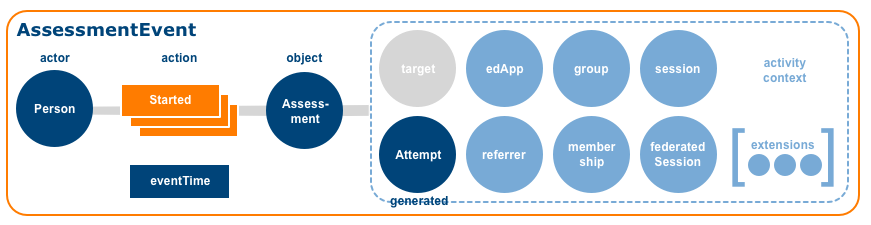

#### Supertype
[Event](#event)

#### Supported Actions
| Action | WordNet® Gloss |
| :----- | :------------- |
| [Started](#started) | [Set in motion, cause to start](http://wordnet-rdf.princeton.edu/wn31/200349400-v). |
| [Paused](#paused) | [Cease an action temporarily](http://wordnet-rdf.princeton.edu/wn31/200781106-v).  Inverse of [Resumed](#resumed).  The [Attempt](#attempt) `count` value MUST NOT be changed. |
| [Resumed](#resumed) | [Take up or begin anew](http://wordnet-rdf.princeton.edu/wn31/200350758-v), as in to start something, pause and then begin again at the location where the pause in action occurred.  Inverse of [Paused](#paused).  The [Attempt](#attempt) `count` value MUST NOT be changed. |
| [Restarted](#restarted) | [Take up or begin anew](http://wordnet-rdf.princeton.edu/wn31/200350758-v), as in to start something, make progress but then stop and return to the beginning in order to start again.  The [Attempt](#attempt) `count` value MUST be incremented by 1. |
| [Reset](#reset) | [Set anew](http://wordnet-rdf.princeton.edu/wn31/200949623-v) without changing or incrementing the [Attempt](#attempt) `count` value. |
| [Submitted](#submitted) | [Hand over formally](http://wordnet-rdf.princeton.edu/wn31/202267560-v). |

#### Properties
[AssessmentEvent](#assessmentEvent) inherits all properties defined by its supertype [Event](#event). Additional requirements are described below:

| Property | Type | Description | Conformance |
| :------- | :--- | ----------- | :---------: |
| id | [UUID](#uuidDef) | The emitting application MUST provision the [Event](#event) with a [UUID](#uuidDef).  A version 4 [UUID](#uuidDef) SHOULD be generated.  The UUID MUST be expressed as a [URN](#urnDef) using the form `urn:uuid:<UUID>` per [RFC 4122](#rfc4122). | Required |
| type | [Term](#termDef) | The string value MUST be set to the [Term](#termDef) *AssessmentEvent*. | Required |
| actor | [Person](#person) | the [Person](#person) who initiated the `action` MUST be specified.   The `actor` value MUST be expressed either as an object or coerced to a string corresponding to the actor's [IRI](#iriDef). | Required |
| action | [Term](#termDef) | the action or predicate that binds the `actor` or subject to the `object` MUST be specified.  The value range is limited to the supported action terms listed above.  Only one `action` [Term](#termDef) may be specified per [Event](#event). | Required |
| object | [Assessment](#assessment) | The `object` value MUST be expressed either as an object or coerced to a string corresponding to the object's [IRI](#iriDef). | Required |
| eventTime | DateTime | A date and time value expressed with millisecond precision that indicates when the [Event](#event) occurred MUST be specified.  The value MUST be expressed as an ISO-8601 formatted date/time string set to UTC. | Required |
| target | [Entity](#entity) | An [Entity](#entity) that represents a particular segment or location within the `object`.  The `target` value MUST be expressed either as an object or coerced to a string corresponding to the target entity's [IRI](#iriDef). | Optional |
| generated | [Attempt](#attempt) | The `generated` value MUST be expressed either as an object or coerced to a string corresponding to the generated entity's [IRI](#iriDef). | Recommended |
| edApp | [SoftwareApplication](#softwareApplication) | A [SoftwareApplication](#softwareApplication) that constitutes the application context MAY be specified.  The `edApp` value MUST be expressed either as an object or coerced to a string corresponding to the edApp's [IRI](#iriDef). | Optional |
| referrer | [Entity](#entity) | An [Entity](#entity) that represents the referring context MAY be specified. A [SoftwareApplication](#softwareApplication) or [DigitalResource](#digitalResource) will typically constitute the referring context.  The `referrer` value MUST be expressed either as an object or coerced to a string corresponding to the referrer's [IRI](#iriDef). | Optional |
| group | [Organization](#organization) | An [Organization](#organization) that represents the group context MAY be specified.  The `group` value MUST be expressed either as an object or coerced to a string corresponding to the group's [IRI](#iriDef). | Optional |
| membership | [Membership](#membership) | The relationship between the `actor` and the `group` in terms of roles assigned and current status MAY be specified.  The `membership` value MUST be expressed either as an object or coerced to a string corresponding to the membership entity's [IRI](#iriDef). | Optional |
| session | [Session](#session) | The current user [Session](#session) MAY be specified.  The `session` value MUST be expressed either as an object or coerced to a string corresponding to the session's [IRI](#iriDef). | Optional |
| federatedSession | [LtiSession](#ltiSession) | If the [Event](#event) occurs within the context of an [LTI](#lti) tool launch, the actor's tool consumer [LtiSession](#ltiSession) MAY be referenced.  The `federatedSession` value MUST be expressed either as an object or coerced to a string corresponding to the federatedSession's [IRI](#iriDef). | Optional |
| extensions | Array | An ordered collection of objects not defined by the model MAY be specified for a more concise representation of the [Event](#event). | Optional |

#### Example: AssessmentEvent (started)
```
{
  "@context": "http://purl.imsglobal.org/ctx/caliper/v1p1",
  "id": "urn:uuid:27734504-068d-4596-861c-2315be33a2a2",
  "type": "AssessmentEvent",
  "actor": {
    "id": "https://example.edu/users/554433",
    "type": "Person"
  },
  "action": "Started",
  "object": {
    "id": "https://example.edu/terms/201701/courses/7/sections/1/assess/1",
    "type": "Assessment",
    "name": "Quiz One",
    "dateToStartOn": "2017-11-14T05:00:00.000Z",
    "dateToSubmit": "2017-11-18T11:59:59.000Z",
    "maxAttempts": 2,
    "maxSubmits": 2,
    "maxScore": 25.0,
    "version": "1.0"
  },
  "generated": {
    "id": "https://example.edu/terms/201701/courses/7/sections/1/assess/1/users/554433/attempts/1",
    "type": "Attempt",
    "assignee": "https://example.edu/users/554433",
    "assignable": "https://example.edu/terms/201701/courses/7/sections/1/assess/1",
    "count": 1,
    "dateCreated": "2017-11-15T10:15:00.000Z",
    "startedAtTime": "2017-11-15T10:15:00.000Z"
  },
  "eventTime": "2017-11-15T10:15:00.000Z",
  "edApp": {
    "id": "https://example.edu",
    "type": "SoftwareApplication",
    "version": "v2"
  },
  "group": {
    "id": "https://example.edu/terms/201701/courses/7/sections/1",
    "type": "CourseSection",
    "courseNumber": "CPS 435-01",
    "academicSession": "Fall 2017"
  },
  "membership": {
    "id": "https://example.edu/terms/201701/courses/7/sections/1/rosters/1",
    "type": "Membership",
    "member": "https://example.edu/users/554433",
    "organization": "https://example.edu/terms/201701/courses/7/sections/1",
    "roles": [ "Learner" ],
    "status": "Active",
    "dateCreated": "2017-08-01T06:00:00.000Z"
  },
  "session": {
    "id": "https://example.edu/sessions/1f6442a482de72ea6ad134943812bff564a76259",
    "type": "Session",
    "startedAtTime": "2017-11-15T10:00:00.000Z"
  }
}
```

<a name="assessmentItemEvent" />

### B.4 AssessmentItemEvent
A Caliper [AssessmentItemEvent](#assessmentItemEvent) models a learner's interaction with an individual [AssessmentItem](#assessmentItem).

#### IRI
http://purl.imsglobal.org/caliper/AssessmentItemEvent


#### Supertype
[Event](#event)

#### Generated responses
[Response](#response), [FillinBlankResponse](#fillinBlankResponse), [MultipleChoiceResponse](#multipleChoiceResponse), [MultipleResponseResponse](#multipleResponseResponse), [SelectTextResponse](#selectTextResponse), [TrueFalseResponse](#trueFalseResponse)
 
#### Supported Actions
| Action | WordNet® Gloss |
| :----- | :------------- |
| [Started](#started) | [Set in motion, cause to start](http://wordnet-rdf.princeton.edu/wn31/200349400-v). |
| [Skipped](#skipped) | [Bypass](http://wordnet-rdf.princeton.edu/wn31/200618188-v). |
| [Completed](#completed) | [Come or bring to a finish or an end](http://wordnet-rdf.princeton.edu/wn31/200485097-v). |

#### Deprecated Actions
| Action | WordNet® Gloss |
| :----- | :------------- |
| [Reviewed](#reviewed) | [Appraise critically](http://wordnet-rdf.princeton.edu/wn31/200857194-v). |
| [Viewed](#viewed) |[Look at carefully; study mentally](http://wordnet-rdf.princeton.edu/wn31/202134765-v). |

#### Properties
[AssessmentItemEvent](#assessmentItemEvent) inherits all properties defined by its supertype [Event](#event). Additional requirements are described below:

| Property | Type | Description | Conformance |
| :------- | :--- | ----------- | :---------: |
| id | [UUID](#uuidDef) | The emitting application MUST provision the [Event](#event) with a [UUID](#uuidDef).  A version 4 [UUID](#uuidDef) SHOULD be generated.  The UUID MUST be expressed as a [URN](#urnDef) using the form `urn:uuid:<UUID>` per [RFC 4122](#rfc4122). | Required |
| type | [Term](#termDef) | The string value MUST be set to the [Term](#termDef) *AssessmentItemEvent*. | Required |
| actor | [Person](#person) | The [Person](#person) who initiated the `action` MUST be specified.  The `actor` value MUST be expressed either as an object or coerced to a string corresponding to the actor's [IRI](#iriDef). | Required |
| action | [Term](#termDef) | The action or predicate that binds the `actor` or subject to the `object` MUST be specified.  The value range is limited to the action terms listed above.  Only one `action` [Term](#termDef) may be specified per [Event](#event). | Required |
| object | [AssessmentItem](#assessmentItem) | The `object` value MUST be expressed either as an object or coerced to a string corresponding to the object's [IRI](#iriDef). | Required |
| eventTime | DateTime | A date and time value expressed with millisecond precision that indicates when the [Event](#event) occurred MUST be specified.  The value MUST be expressed as an ISO-8601 formatted date/time string set to UTC. | Required |
| target | [Entity](#entity) | An [Entity](#entity) that represents a particular segment or location within the `object`.  The `target` value MUST be expressed either as an object or coerced to a string corresponding to the target entity's [IRI](#iriDef). | Optional |
| generated | [Response](#response) | For a [completed](#completed) action a `generated` [Response](#response) MAY be specified.  The `generated` value MUST be expressed either as an object or coerced to a string corresponding to the generated entity's [IRI](#iriDef). | Recommended |
| edApp | [SoftwareApplication](#softwareApplication) | A [SoftwareApplication](#softwareApplication) that constitutes the application context MAY be specified.  The `edApp` value MUST be expressed either as an object or coerced to a string corresponding to the edApp's [IRI](#iriDef). | Optional |
| referrer | [AssessmentItem](#assessmentItem) | The previous [AssessmentItem](#assessmentItem) attempted MAY be specified as the `referrer`.  The `referrer` value MUST be expressed either as an object or coerced to a string corresponding to the referrer's [IRI](#iriDef). | Optional |
| group | [Organization](#organization) | An [Organization](#organization) that represents the group context MAY be specified.   The `group` value MUST be expressed either as an object or coerced to a string corresponding to the group's [IRI](#iriDef). | Optional |
| membership | [Membership](#membership) | The relationship between the `actor` and the `group` in terms of roles assigned and current status MAY be specified.  The `membership` value MUST be expressed either as an object or coerced to a string corresponding to the membership entity's [IRI](#iriDef). | Optional |
| session | [Session](#session) | The current user [Session](#session) MAY be specified.  The `session` value MUST be expressed either as an object or coerced to a string corresponding to the session's [IRI](#iriDef). | Optional |
| federatedSession | [LtiSession](#ltiSession) | If the [Event](#event) occurs within the context of an [LTI](#lti) tool launch, the actor's tool consumer [LtiSession](#ltiSession) MAY be referenced.  The `federatedSession` value MUST be expressed either as an object or coerced to a string corresponding to the federatedSession's [IRI](#iriDef). | Optional |
| extensions | Array | An ordered collection of objects not defined by the model MAY be specified for a more concise representation of the [Event](#event). | Optional |

#### Example: AssessmentItem (started)
```
{
  "@context": "http://purl.imsglobal.org/ctx/caliper/v1p1",
  "id": "urn:uuid:1b557176-ba67-4624-b060-6bee670a3d8e",
  "type": "AssessmentItemEvent",
  "actor": {
    "id": "https://example.edu/users/554433",
    "type": "Person"
  },
  "action": "Started",
  "object": {
    "id": "https://example.edu/terms/201701/courses/7/sections/1/assess/1/items/3",
    "type": "AssessmentItem",
    "name": "Assessment Item 3",
    "isPartOf": {
      "id": "https://example.edu/terms/201701/courses/7/sections/1/assess/1",
      "type": "Assessment"
    },
    "dateToStartOn": "2017-11-14T05:00:00.000Z",
    "dateToSubmit": "2017-11-18T11:59:59.000Z",
    "maxAttempts": 2,
    "maxSubmits": 2,
    "maxScore": 1.0,
    "isTimeDependent": false,
    "version": "1.0"
    },
  "generated": {
    "id": "https://example.edu/terms/201701/courses/7/sections/1/assess/1/items/3/users/554433/attempts/1",
    "type": "Attempt",
    "assignee": "https://example.edu/users/554433",
    "assignable": "https://example.edu/terms/201701/courses/7/sections/1/assess/1/items/3",
    "isPartOf": {
      "id": "https://example.edu/terms/201701/courses/7/sections/1/assess/1/users/554433/attempts/1",
      "type": "Attempt"
    },
    "count": 1,
    "dateCreated": "2017-11-15T10:15:00.000Z",
    "startedAtTime": "2017-11-15T10:15:00.000Z"
  },
  "eventTime": "2017-11-15T10:15:00.000Z",
  "edApp": {
    "id": "https://example.edu",
    "type": "SoftwareApplication",
    "version": "v2"
  },
  "group": {
    "id": "https://example.edu/terms/201701/courses/7/sections/1",
    "type": "CourseSection",
    "courseNumber": "CPS 435-01",
    "academicSession": "Fall 2017"
  },
  "membership": {
    "id": "https://example.edu/terms/201701/courses/7/sections/1/rosters/1",
    "type": "Membership",
    "member": "https://example.edu/users/554433",
    "organization": "https://example.edu/terms/201701/courses/7/sections/1",
    "roles": [ "Learner" ],
    "status": "Active",
    "dateCreated": "2017-08-01T06:00:00.000Z"
  },
  "session": {
    "id": "https://example.edu/sessions/1f6442a482de72ea6ad134943812bff564a76259",
    "type": "Session",
    "startedAtTime": "2017-11-15T10:00:00.000Z"
  }
}
```

<a name="assignableEvent" />

### B.5 AssignableEvent
A Caliper [AssignableEvent](#assignableEvent) models activities associated with the assignment of digital content assigned to a learner for completion.

#### IRI
http://purl.imsglobal.org/caliper/AssignableEvent

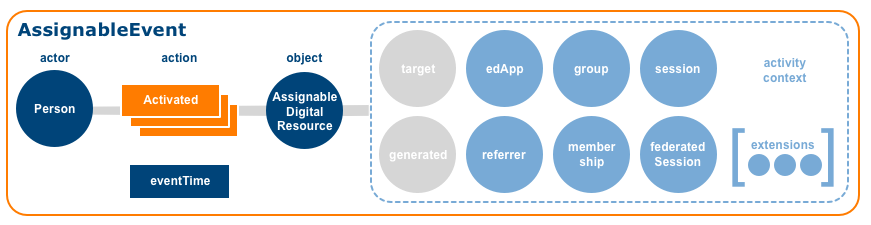

#### Supertype
[Event](#event)

#### Supported Actions
| Action | WordNet® Gloss |
| :----- | :------------- |
| [Activated](#activated) | [Make active or more active](http://wordnet-rdf.princeton.edu/wn31/200191014-v).  Inverse of [Deactivated](#deactivated). |
| [Deactivated](#deactivated) | [Make inactive](http://wordnet-rdf.princeton.edu/wn31/200191849-v).  Inverse of [Activated](#activated). |
| [Started](#started) | [Set in motion, cause to start](http://wordnet-rdf.princeton.edu/wn31/200349400-v). |
| [Completed](#completed) | [Come or bring to a finish or an end](http://wordnet-rdf.princeton.edu/wn31/200485097-v). |
| [Submitted](#submitted) | [Hand over formally](http://wordnet-rdf.princeton.edu/wn31/202267560-v). |
| [Reviewed](#reviewed) | [Appraise critically](http://wordnet-rdf.princeton.edu/wn31/200857194-v). |

#### Deprecated Actions
The following actions are deprecated and targeted for removal from the [AssignableEvent](#assignableEvent) list of supported actions.

| Action | WordNet® Gloss |
| :----- | :------------- |
| [Abandoned](#abandoned) | [Forsake, leave behind](http://wordnet-rdf.princeton.edu/wn31/202232813-v). |
| [Hid](#hid) |[Prevent from being seen or discovered](http://wordnet-rdf.princeton.edu/wn31/202149298-v).  Inverse of [Showed](#showed). |
| [Showed](#showed) | [Make visible or noticeable](http://wordnet-rdf.princeton.edu/wn31/202141597-v).  Inverse of [Hid](#hid). |

#### Properties
[AssignableEvent](#assignableEvent) inherits all properties defined by its supertype [Event](#event). Additional requirements are described below:

| Property | Type | Description | Conformance |
| :------- | :--- | ----------- | :---------: |
| id | [UUID](#uuidDef) | The emitting application MUST provision the [Event](#event) with a [UUID](#uuidDef).  A version 4 [UUID](#uuidDef) SHOULD be generated.  The UUID MUST be expressed as a [URN](#urnDef) using the form `urn:uuid:<UUID>` per [RFC 4122](#rfc4122). | Required |
| type | [Term](#termDef) | The string value MUST be set to the [Term](#termDef) *AssignableEvent*. | Required |
| actor | [Person](#person) | The [Person](#person) who initiated the `action` MUST be specified.  The `actor` value MUST be expressed either as an object or coerced to a string corresponding to the actor's [IRI](#iriDef). | Required |
| action | [Term](#termDef) | The action or predicate that binds the `actor` or subject to the `object` MUST be specified.  The value range is limited to the action terms listed above. Only one `action` [Term](#termDef) may be specified per [Event](#event).  DEPRECATED  actions SHOULD NOT be utilized. | Required | 
| object | [AssignableDigitalResource](#assignableDigitalResource) | The [AssignableDigitalResource](#assignableDigitalResource) that constitutes the `object` of the interaction MUST be specified.  The `object` value MUST be expressed either as an object or coerced to a string corresponding to the object's [IRI](#iriDef). | Required |
| eventTime | DateTime | A date and time value expressed with millisecond precision that indicates when the [Event](#event) occurred MUST be specified.  The value MUST be expressed as an ISO-8601 formatted date/time string set to UTC. | Required |
| target | [Frame](#frame) | A [Frame](#frame) that represents a particular segment or location within the `object`.  The `target` value MUST be expressed either as an object or coerced to a string corresponding to the target entity's [IRI](#iriDef). | Optional |
| generated | [Attempt](#attempt) | For [Started](#started), [Completed](#completed) and [Reviewed](reviewed) actions, the actor's [Attempt](#attempt) SHOULD be specified.  The `generated` value MUST be expressed either as an object or coerced to a string corresponding to the generated entity's [IRI](#iriDef). | Optional |
| edApp | [SoftwareApplication](#softwareApplication) | A [SoftwareApplication](#softwareApplication) that constitutes the application context MAY be specified.  The `edApp` value MUST be expressed either as an object or coerced to a string corresponding to the edApp's [IRI](#iriDef). | Optional |
| referrer | [Entity](#entity) | An [Entity](#entity) that represents the referring context MAY be specified. A [SoftwareApplication](#softwareApplication) or [DigitalResource](#digitalResource) will typically constitute the referring context.  The `referrer` value MUST be expressed either as an object or coerced to a string corresponding to the referrer's [IRI](#iriDef). | Optional |
| group | [Organization](#organization) | An [Organization](#organization) that represents the group context MAY be specified.  The `group` value MUST be expressed either as an object or coerced to a string corresponding to the group's [IRI](#iriDef). | Optional |
| membership | [Membership](#membership) | The relationship between the `actor` and the `group` in terms of roles assigned and current status MAY be specified.  The `membership` value MUST be expressed either as an object or coerced to a string corresponding to the membership entity's [IRI](#iriDef). | Optional |
| session | [Session](#session) | The current user [Session](#session) MAY be specified.  The `session` value MUST be expressed either as an object or coerced to a string corresponding to the session's [IRI](#iriDef). | Optional |
| federatedSession | [LtiSession](#ltiSession) | If the [Event](#event) occurs within the context of an [LTI](#lti) tool launch, the actor's tool consumer [LtiSession](#ltiSession) MAY be referenced.  The `federatedSession` value MUST be expressed either as an object or coerced to a string corresponding to the federatedSession's [IRI](#iriDef). | Optional |
| extensions | Array | An ordered collection of objects not defined by the model MAY be specified for a more concise representation of the [Event](#event). | Optional |

#### Example: AssignableEvent (activated)
```
{
  "@context": "http://purl.imsglobal.org/ctx/caliper/v1p1",
  "id": "urn:uuid:2635b9dd-0061-4059-ac61-2718ab366f75",
  "type": "AssignableEvent",
  "actor": {
    "id": "https://example.edu/users/112233",
    "type": "Person"
  },
  "action": "Activated",
  "object": {
    "id": "https://example.edu/terms/201701/courses/7/sections/1/assess/1",
    "type": "Assessment",
    "name": "Quiz One",
    "dateCreated": "2017-08-01T06:00:00.000Z",
    "dateModified": "2017-09-02T11:30:00.000Z",
    "datePublished": "2017-11-12T10:10:00.000Z",
    "dateToActivate": "2017-11-12T10:15:00.000Z",
    "dateToStartOn": "2017-11-14T05:00:00.000Z",
    "dateToSubmit": "2017-11-18T11:59:59.000Z",
    "maxAttempts": 2,
    "maxSubmits": 2,
    "maxScore": 25.0,
    "version": "1.0"
  },
  "eventTime": "2017-11-12T10:15:00.000Z",
  "edApp": {
    "id": "https://example.edu",
    "type": "SoftwareApplication",
    "version": "v2"
  },
  "group": {
    "id": "https://example.edu/terms/201701/courses/7/sections/1",
    "type": "CourseSection",
    "courseNumber": "CPS 435-01",
    "academicSession": "Fall 2017"
  },
  "membership": {
    "id": "https://example.edu/terms/201701/courses/7/sections/1/rosters/1",
    "type": "Membership",
    "member": "https://example.edu/users/112233",
    "organization": "https://example.edu/terms/201701/courses/7/sections/1",
    "roles": [ "Instructor" ],
    "status": "Active",
    "dateCreated": "2017-08-01T06:00:00.000Z"
  },
  "session": {
    "id": "https://example.edu/sessions/f095bbd391ea4a5dd639724a40b606e98a631823",
    "type": "Session",
    "startedAtTime": "2017-11-12T10:00:00.000Z"
  }
}
```

<a name="forumEvent" />

### B.6 ForumEvent
A Caliper [ForumEvent](#forumEvent) models learners and others participating in online forum communities.  Forums typically encompass one or more threads or topics to which members can subscribe, post messages and reply to other messages if a threaded discussion is permitted.

#### IRI
http://purl.imsglobal.org/caliper/ForumEvent


#### Supertype
[Event](#event)

#### Supported Actions
| Action | WordNet® Gloss |
| :----- | :------------- |
| [Subscribed](#subscribed) | [Receive or obtain regularly](http://wordnet-rdf.princeton.edu/wn31/202214527-v).  Inverse of [Unsubscribed](#unsubscribed). |
| [Unsubscribed](#unsubscribed) | Inverse of [Subscribed](#subscribed). |

#### Properties
[ForumEvent](#forumEvent) inherits all properties defined by its supertype [Event](#event). Additional requirements are described below:

| Property | Type | Description | Conformance |
| :------- | :--- | ----------- | :---------: |
| id | [UUID](#uuidDef) | The emitting application MUST provision the [Event](#event) with a [UUID](#uuidDef).  A version 4 [UUID](#uuidDef) SHOULD be generated.  The UUID MUST be expressed as a [URN](#urnDef) using the form `urn:uuid:<UUID>` per [RFC 4122](#rfc4122). | Required |
| type | [Term](#termDef) | The string value MUST be set to the [Term](#termDef) *ForumEvent*. | Required |
| actor | [Person](#person) | The [Person](#person) who initiated the `action` MUST be specified.  The `actor` value MUST be expressed either as an object or coerced to a string corresponding to the actor's [IRI](#iriDef). | Required |
| action | [Term](#termDef) | The action or predicate that binds the `actor` or subject to the `object` MUST be specified.  The value range is limited to the action terms listed above.  Only one `action` [Term](#termDef) may be specified per [Event](#event). | Required |
| object| [Forum](#forum) | The [Forum](#forum) that comprises the `object` of this interaction MUST be specified.  The `object` value MUST be expressed either as an object or coerced to a string corresponding to the object's [IRI](#iriDef). | Required |
| eventTime | DateTime | A date and time value expressed with millisecond precision that indicates when the [Event](#event) occurred MUST be specified.  The value MUST be expressed as an ISO-8601 formatted date/time string set to UTC. | Required |
| target | [Entity](#entity) | An [Entity](#entity) that represents a particular segment or location within the `object`.  The `target` value MUST be expressed either as an object or coerced to a string corresponding to the target entity's [IRI](#iriDef). | Optional |
| generated | [Entity](#entity) | An [Entity](#entity) created or generated as a result of the interaction.  The `generated` value MUST be expressed either as an object or coerced to a string corresponding to the generated entity's [IRI](#iriDef). | Optional |
| referrer | [Entity](#entity) | An [Entity](#entity) that represents the referring context MAY be specified. A [SoftwareApplication](#softwareApplication) or [DigitalResource](#digitalResource) will typically constitute the referring context. | Optional |
| edApp | [SoftwareApplication](#softwareApplication) | A [SoftwareApplication](#softwareApplication) that constitutes the application context MAY be specified.  The `edApp` value MUST be expressed either as an object or coerced to a string corresponding to the edApp's [IRI](#iriDef). | Optional |

| referrer | [Entity](#entity) | An [Entity](#entity) that represents the referring context MAY be specified. A [SoftwareApplication](#softwareApplication) or [DigitalResource](#digitalResource) will typically constitute the referring context.  The `referrer` value MUST be expressed either as an object or coerced to a string corresponding to the referrer's [IRI](#iriDef). | Optional |
| group | [Organization](#organization) | An [Organization](#organization) that represents the group context MAY be specified.  The `group` value MUST be expressed either as an object or coerced to a string corresponding to the group's [IRI](#iriDef). | Optional |

| membership | [Membership](#membership) | The relationship between the `actor` and the `group` in terms of roles assigned and current status MAY be specified.  The `membership` value MUST be expressed either as an object or coerced to a string corresponding to the membership entity's [IRI](#iriDef). | Optional |

| session | [Session](#session) | The current user [Session](#session) MAY be specified.  The `session` value MUST be expressed either as an object or coerced to a string corresponding to the session's [IRI](#iriDef). | Optional |
| federatedSession | [LtiSession](#ltiSession) | If the [Event](#event) occurs within the context of an [LTI](#lti) tool launch, the actor's tool consumer [LtiSession](#ltiSession) MAY be referenced.  The `federatedSession` value MUST be expressed either as an object or coerced to a string corresponding to the federatedSession's [IRI](#iriDef). | Optional |

| extensions | Array | An ordered collection of objects not defined by the model MAY be specified for a more concise representation of the [Event](#event). | Optional |

#### Example: ForumEvent (subscribed)
```
{
  "@context": "http://purl.imsglobal.org/ctx/caliper/v1p1",
  "id": "urn:uuid:a2f41f9c-d57d-4400-b3fe-716b9026334e",
  "type": "ForumEvent",
  "actor": {
    "id": "https://example.edu/users/554433",
    "type": "Person"
  },
  "action": "Subscribed",
  "object": {
    "id": "https://example.edu/terms/201701/courses/7/sections/1/forums/1",
    "type": "Forum",
    "name": "Caliper Forum",
    "isPartOf": {
      "id": "https://example.edu/terms/201701/courses/7/sections/1",
      "type": "CourseSection"
    },
    "dateCreated": "2017-09-14T11:00:00.000Z"
  },
  "eventTime": "2017-11-15T10:16:00.000Z",
  "edApp": {
    "id": "https://example.edu/forums",
    "type": "SoftwareApplication",
    "version": "v2"
  },
  "group": {
    "id": "https://example.edu/terms/201701/courses/7/sections/1",
    "type": "CourseSection",
    "courseNumber": "CPS 435-01",
    "academicSession": "Fall 2017"
  },
  "membership": {
    "id": "https://example.edu/terms/201701/courses/7/sections/1/rosters/1",
    "type": "Membership",
    "member": "https://example.edu/users/554433",
    "organization": "https://example.edu/terms/201701/courses/7/sections/1",
    "roles": [ "Learner" ],
    "status": "Active",
    "dateCreated": "2017-08-01T06:00:00.000Z"
  },
  "session": {
    "id": "https://example.edu/sessions/1f6442a482de72ea6ad134943812bff564a76259",
    "type": "Session",
    "startedAtTime": "2017-11-15T10:00:00.000Z"
  }
}
```

<a name="mediaEvent" />

### B.7 MediaEvent
A Caliper [MediaEvent](#mediaEvent) models interactions between learners and rich content such as audio, images and video.

#### IRI
http://purl.imsglobal.org/caliper/MediaEvent

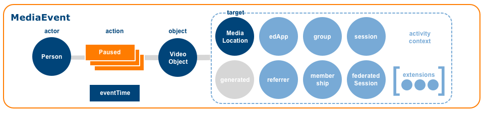

#### Supertype
[Event](#event)

#### Supported Actions
| Action | WordNet® Gloss |
| :----- | :------------- |
| [Started](#started) | [Set in motion, cause to start](http://wordnet-rdf.princeton.edu/wn31/200349400-v).  Inverse of [Ended](#ended). |
| [Ended](#ended) | [Bring to an end or halt](http://wordnet-rdf.princeton.edu/wn31/200353480-v).  Inverse of [Started](#started). |
| [Paused](#paused) | [Cease an action temporarily](http://wordnet-rdf.princeton.edu/wn31/200781106-v).  Inverse of [Resumed](#resumed).  The [MediaLocation](#mediaLocation) `currentTime` value MUST be set to the location in the audio or video stream where the pause occurred. |
| [Resumed](#resumed) | [Take up or begin anew](http://wordnet-rdf.princeton.edu/wn31/200350758-v), as in to start something, pause and then begin again at the location where the pause in action occurred.  Inverse of [Paused](#paused).  The [MediaLocation](#mediaLocation) `currentTime` value MUST be set to the location in the audio or video stream where the previous pause occurred. |
| [Restarted](#restarted) | [Take up or begin anew](http://wordnet-rdf.princeton.edu/wn31/200350758-v), as in to start something, make progress but then stop and return to the beginning in order to start again.  The [MediaLocation](#mediaLocation) `currentTime` value MUST be set to the beginning or initial starting location in the audio or video stream. |
| [ForwardedTo](#forwardedTo)  | [Send or ship onward](http://wordnet-rdf.princeton.edu/wn31/201959367-v). |
| [JumpedTo](#jumpedTo) | [Pass abruptly from one state or topic to another](http://wordnet-rdf.princeton.edu/wn31/200561468-v). |
| [ChangedResolution](#changedResolution) | [Cause to change; make different; cause a transformation](http://wordnet-rdf.princeton.edu/wn31/200126072-v) of [the number of pixels per square inch on a computer-generated display](http://wordnet-rdf.princeton.edu/wn31/111526370-n). |
| [ChangedSize](#changedSize) | [Cause to change; make different; cause a transformation](http://wordnet-rdf.princeton.edu/wn31/200126072-v) of [the physical magnitude of something](http://wordnet-rdf.princeton.edu/wn31/105106204-n). |
| [ChangedSpeed](#changedSpeed) | [Cause to change; make different; cause a transformation](http://wordnet-rdf.princeton.edu/wn31/200126072-v) of the [rate at which something happens](http://wordnet-rdf.princeton.edu/wn31/105065291-n). |
| [ChangedVolume](#changedVolume) | [Cause to change; make different; cause a transformation](http://wordnet-rdf.princeton.edu/wn31/200126072-v) of [the magnitude of sound &#40;usually in a specified direction&#41;](http://wordnet-rdf.princeton.edu/wn31/104997456-n). |
| [EnabledClosedCaptioning](#enabledClosedCaptioning) | [Render capable or able](http://wordnet-rdf.princeton.edu/wn31/200513958-v) the visual display of a plain text transcription of audio output.  Inverse of [DisabledClosedCaptioning](#disabledClosedCaptioning). |
| [DisabledClosedCaptioning](#disabledClosedCaptioning) | [Render unable to perform](http://wordnet-rdf.princeton.edu/wn31/200513267-v) the visual display of a plain text transcription of audio output.  Inverse of [EnabledClosedCaptioning](#enabledClosedCaptioning). |
| [EnteredFullScreen](#enteredFullScreen) | [To come or go into](http://wordnet-rdf.princeton.edu/wn31/202020375-v) a view mode that utilizes all the available display surface of a screen.  Inverse of [ExitedFullScreen](#exitedFullScreen). |
| [ExitedFullScreen](#exitedFullScreen) | [Move out of or depart from](http://wordnet-rdf.princeton.edu/wn31/202019450-v) a view mode that utilizes all the available display surface of a screen.  Inverse of [EnteredFullScreen](#enteredFullScreen). |
| [Muted](#muted) | [Deaden (a sound or noise)](http://wordnet-rdf.princeton.edu/wn31/mute-v).  Inverse of [Unmuted](#unmuted). |
| [Unmuted](#unmuted) | Inverse of [Muted](#muted). |
| [OpenedPopout](#openedPopout) | [Start to operate or function or cause to start operating or functioning](http://wordnet-rdf.princeton.edu/wn31/202431018-v) a video popout.  Inverse of [ClosedPopout](#closedPopout). |
| [ClosedPopout](#closedPopout) | [Close or shut](http://wordnet-rdf.princeton.edu/wn31/201349660-v) a video popout.  Inverse of [OpenedPopout](#openedPopout). |

#### Deprecated Actions
The following actions are deprecated and targeted for removal from the [MediaEvent](#mediaEvent) list of supported actions.

| Action | WordNet® Gloss |
| :----- | :------------- |
| [Rewound](#rewound) | [Wind up again](http://wordnet-rdf.princeton.edu/wn31/201524927-v). |

#### Properties
[MediaEvent](#mediaEvent) inherits all properties defined by its supertype [Event](#event). Additional requirements are described below:

| Property | Type | Description | Conformance |
| :------- | :--- | ----------- | :---------: |
| id | [UUID](#uuidDef) | The emitting application MUST provision the [Event](#event) with a [UUID](#uuidDef).  A version 4 [UUID](#uuidDef) SHOULD be generated.  The UUID MUST be expressed as a [URN](#urnDef) using the form `urn:uuid:<UUID>` per [RFC 4122](#rfc4122). | Required |
| type | [Term](#termDef) | The string value MUST be set to the [Term](#termDef) *MediaEvent*. | Required |
| actor | [Person](#person) | The [Person](#person) who initiated the `action` MUST be specified.  The `actor` value MUST be expressed either as an object or coerced to a string corresponding to the actor's [IRI](#iriDef). | Required |
| action | [Term](#termDef) | The action or predicate that binds the `actor` or subject to the `object` MUST be specified.  The value range is limited to the action terms listed above.  Only one `action` term may be specified per [Event](#event). | Required |
| object | [MediaObject](#mediaObject) | The [MediaObject](#mediaObject) that constitutes the `object` of the interaction MUST be specified.  The `object` value MUST be expressed either as an object or coerced to a string corresponding to the object's [IRI](#iriDef). | Required |
| eventTime | DateTime | A date and time value expressed with millisecond precision that indicates when the [Event](#event) occurred MUST be specified.  The value MUST be expressed as an ISO-8601 formatted date/time string set to UTC. | Required |
| target | [MediaLocation](#mediaLocation) | If the `object` is an [AudioObject](#audioObject) or [VideoObject](#videoObject) a [MediaLocation](#mediaLocation) SHOULD be specified in order to provide the [currentTime](#currentTime) in the audio or video stream that marks the action.  The value MUST be an ISO 8601 formatted duration, e.g., "PT30M54S".  The `target` value MUST be expressed either as an object or coerced to a string corresponding to the target entity's [IRI](#iriDef). | Recommended |
| generated | [Entity](#entity) | An [Entity](#entity) created or generated as a result of the interaction.  The `generated` value MUST be expressed either as an object or coerced to a string corresponding to the generated entity's [IRI](#iriDef). | Optional |
| edApp | [SoftwareApplication](#softwareApplication) | A [SoftwareApplication](#softwareApplication) that constitutes the application context MAY be specified.  The `edApp` value MUST be expressed either as an object or coerced to a string corresponding to the edApp's [IRI](#iriDef). | Optional |

| referrer | [Entity](#entity) | An [Entity](#entity) that represents the referring context MAY be specified. A [SoftwareApplication](#softwareApplication) or [DigitalResource](#digitalResource) will typically constitute the referring context.  The `referrer` value MUST be expressed either as an object or coerced to a string corresponding to the referrer's [IRI](#iriDef). | Optional |
| group | [Organization](#organization) | An [Organization](#organization) that represents the group context MAY be specified.  The `group` value MUST be expressed either as an object or coerced to a string corresponding to the group's [IRI](#iriDef). | Optional |

| membership | [Membership](#membership) | The relationship between the `actor` and the `group` in terms of roles assigned and current status MAY be specified.  The `membership` value MUST be expressed either as an object or coerced to a string corresponding to the membership entity's [IRI](#iriDef). | Optional |

| session | [Session](#session) | The current user [Session](#session) MAY be specified.  The `session` value MUST be expressed either as an object or coerced to a string corresponding to the session's [IRI](#iriDef). | Optional |
| federatedSession | [LtiSession](#ltiSession) | If the [Event](#event) occurs within the context of an [LTI](#lti) tool launch, the actor's tool consumer [LtiSession](#ltiSession) MAY be referenced.  The `federatedSession` value MUST be expressed either as an object or coerced to a string corresponding to the federatedSession's [IRI](#iriDef). | Optional |

| extensions | Array | An ordered collection of objects not defined by the model MAY be specified for a more concise representation of the [Event](#event). | Optional |

#### Example: MediaEvent (paused)
```
{
  "@context": "http://purl.imsglobal.org/ctx/caliper/v1p1",
  "id": "urn:uuid:956b4a02-8de0-4991-b8c5-b6eebb6b4cab",
  "type": "MediaEvent",
  "actor": {
    "id": "https://example.edu/users/554433",
    "type": "Person"
  },
  "action": "Paused",
  "object": {
    "id": "https://example.edu/UQVK-dsU7-Y",
    "type": "VideoObject",
    "name": "Information and Welcome",
    "mediaType": "video/ogg",
    "duration": "PT20M20S"
  },
  "target": {
    "id": "https://example.edu/UQVK-dsU7-Y?t=321",
    "type": "MediaLocation",
    "currentTime": "PT05M21S"
  },
  "eventTime": "2017-11-15T10:15:00.000Z",
  "edApp": "https://example.edu/player",
  "group": {
    "id": "https://example.edu/terms/201701/courses/7/sections/1",
    "type": "CourseSection",
    "courseNumber": "CPS 435-01",
    "academicSession": "Fall 2017"
  },
  "membership": {
    "id": "https://example.edu/terms/201701/courses/7/sections/1/rosters/1",
    "type": "Membership",
    "member": "https://example.edu/users/554433",
    "organization": "https://example.edu/terms/201701/courses/7/sections/1",
    "roles": [ "Learner" ],
    "status": "Active",
    "dateCreated": "2017-08-01T06:00:00.000Z"
  },
  "session": {
    "id": "https://example.edu/sessions/1f6442a482de72ea6ad134943812bff564a76259",
    "type": "Session",
    "startedAtTime": "2017-11-15T10:00:00.000Z"
  }
}
```

<a name="messageEvent" />

### B.8 MessageEvent
A Caliper [MessageEvent](#messageEvent) describes a [Person](#person) posting a [Message](#message) or marking a post as either read or unread.

#### IRI
http://purl.imsglobal.org/caliper/MessageEvent

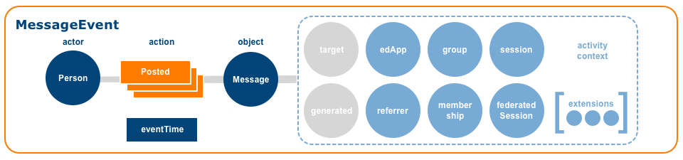

#### Supertype
[Event](#event)

#### Supported Actions
| Action | WordNet® Gloss |
| :----- | :------------- |
| [Posted](#posted) | [To cause to be directed or transmitted to another place](http://wordnet-rdf.princeton.edu/wn31/201033289-v). |
| [MarkedAsRead](#markedAsRead) | [Mark: designate as if by a mark](http://wordnet-rdf.princeton.edu/wn31/200923709-v), [read: interpret something that is written or printed](http://wordnet-rdf.princeton.edu/wn31/200626756-v).  Inverse of [MarkedAsUnread](#markedAsUnread).  |
| [MarkedAsUnRead](#markedAsUnRead) | Inverse of [MarkedAsRead](#markedAsRead). |

#### Properties
[MessageEvent](#messageEvent) inherits all properties defined by its supertype [Event](#event). Additional requirements are described below:

| Property | Type | Description | Conformance |
| :------- | :--- | ----------- | :---------: |
| id | [UUID](#uuidDef) | The emitting application MUST provision the [Event](#event) with a [UUID](#uuidDef).  A version 4 [UUID](#uuidDef) SHOULD be generated.  The UUID MUST be expressed as a [URN](#urnDef) using the form `urn:uuid:<UUID>` per [RFC 4122](#rfc4122). | Required |
| type | [Term](#termDef) | The string value MUST be set to the [Term](#termDef) *MessageEvent*. | Required |
| actor | [Person](#person) | The [Person](#person) who initiated the `action` MUST be specified.  The `actor` value MUST be expressed either as an object or coerced to a string corresponding to the actor's [IRI](#iriDef). | Required |
| action | [Term](#termDef) | the action or predicate that binds the `actor` or subject to the `object` MUST be specified.  The value range is limited to the action terms listed above.  Only one `action` [Term](#termDef) may be specified per [Event](#event). | Required |
| object | [Message](#message) | The [Message](#message) that constitutes the `object` of the interaction MUST be specified.  If the `object` represents a [Message](#message) posted in reply to a previous post, the prior post prompting the [Message](#message) SHOULD be referenced using the [Message](#message) `replyTo` property.  The `object` value MUST be expressed either as an object or coerced to a string corresponding to the object's [IRI](#iriDef). | Required |
| eventTime | DateTime | A date and time value expressed with millisecond precision that indicates when the [Event](#event) occurred MUST be specified.  The value MUST be expressed as an ISO-8601 formatted date/time string set to UTC. | Required |
| target | [Entity](#entity) | An [Entity](#entity) that represents a particular segment or location within the `object`.  The `target` value MUST be expressed either as an object or coerced to a string corresponding to the target entity's [IRI](#iriDef). | Optional |
| generated | [Entity](#entity) | An [Entity](#entity) created or generated as a result of the interaction.  The `generated` value MUST be expressed either as an object or coerced to a string corresponding to the generated entity's [IRI](#iriDef). | Optional |
| edApp | [SoftwareApplication](#softwareApplication) | A [SoftwareApplication](#softwareApplication) that constitutes the application context MAY be specified.  The `edApp` value MUST be expressed either as an object or coerced to a string corresponding to the edApp's [IRI](#iriDef). | Optional |

| referrer | [Entity](#entity) | An [Entity](#entity) that represents the referring context MAY be specified. A [SoftwareApplication](#softwareApplication) or [DigitalResource](#digitalResource) will typically constitute the referring context.  The `referrer` value MUST be expressed either as an object or coerced to a string corresponding to the referrer's [IRI](#iriDef). | Optional |
| group | [Organization](#organization) | An [Organization](#organization) that represents the group context MAY be specified.  The `group` value MUST be expressed either as an object or coerced to a string corresponding to the group's [IRI](#iriDef). | Optional |

| membership | [Membership](#membership) | The relationship between the `actor` and the `group` in terms of roles assigned and current status MAY be specified.  The `membership` value MUST be expressed either as an object or coerced to a string corresponding to the membership entity's [IRI](#iriDef).  The `session` value MUST be expressed either as an object or coerced to a string corresponding to the session's [IRI](#iriDef). | Optional |

| session | [Session](#session) | The current user [Session](#session) MAY be specified. | Optional |
| federatedSession | [LtiSession](#ltiSession) | If the [Event](#event) occurs within the context of an [LTI](#lti) tool launch, the actor's tool consumer [LtiSession](#ltiSession) MAY be referenced.  The `federatedSession` value MUST be expressed either as an object or coerced to a string corresponding to the federatedSession's [IRI](#iriDef). | Optional |

| extensions | Array | An ordered collection of objects not defined by the model MAY be specified for a more concise representation of the [Event](#event). | Optional |

#### Example: MessageEvent (posted)
```
{
  "@context": "http://purl.imsglobal.org/ctx/caliper/v1p1",
  "id": "urn:uuid:0d015a85-abf5-49ee-abb1-46dbd57fe64e",
  "type": "MessageEvent",
  "actor": {
    "id": "https://example.edu/users/554433",
    "type": "Person"
  },
  "action": "Posted",
  "object": {
    "id": "https://example.edu/terms/201701/courses/7/sections/1/forums/2/topics/1/messages/2",
    "type": "Message",
    "creators": [
      {
        "id": "https://example.edu/users/554433",
        "type": "Person"
      }
    ],
    "body": "Are the Caliper Sensor reference implementations production-ready?",
    "isPartOf": {
      "id": "https://example.edu/terms/201701/courses/7/sections/1/forums/2/topics/1",
      "type": "Thread",
      "name": "Caliper Adoption",
      "isPartOf": {
        "id": "https://example.edu/terms/201701/courses/7/sections/1/forums/2",
        "type": "Forum",
        "name": "Caliper Forum"
      }
    },
    "dateCreated": "2017-11-15T10:15:00.000Z"
  },
  "eventTime": "2017-11-15T10:15:00.000Z",
  "edApp": {
    "id": "https://example.edu/forums",
    "type": "SoftwareApplication",
    "version": "v2"
  },
  "group": {
    "id": "https://example.edu/terms/201701/courses/7/sections/1",
    "type": "CourseSection",
    "courseNumber": "CPS 435-01",
    "academicSession": "Fall 2017"
  },
  "membership": {
    "id": "https://example.edu/terms/201701/courses/7/sections/1/rosters/1",
    "type": "Membership",
    "member": "https://example.edu/users/554433",
    "organization": "https://example.edu/terms/201701/courses/7/sections/1",
    "roles": [ "Learner" ],
    "status": "Active",
    "dateCreated": "2017-08-01T06:00:00.000Z"
  },
  "session": {
    "id": "https://example.edu/sessions/1f6442a482de72ea6ad134943812bff564a76259",
    "type": "Session",
    "startedAtTime": "2017-11-15T10:00:00.000Z"
  }
}
```

#### Example: MessageEvent (posted reply)
```
{
  "@context": "http://purl.imsglobal.org/ctx/caliper/v1p1",
  "id": "urn:uuid:aed54386-a3fb-45ff-90f9-a35d3daaf031",
  "type": "MessageEvent",
  "actor": {
    "id": "https://example.edu/users/778899",
    "type": "Person"
  },
  "action": "Posted",
  "object": {
    "id": "https://example.edu/terms/201701/courses/7/sections/1/forums/2/topics/1/messages/3",
    "type": "Message",
    "creators": [
      {
        "id": "https://example.edu/users/778899",
        "type": "Person"
      }
    ],
    "replyTo": {
      "id": "https://example.edu/terms/201701/courses/7/sections/1/forums/2/topics/1/messages/2",
      "type": "Message"
    },
    "isPartOf": {
      "id": "https://example.edu/terms/201701/courses/7/sections/1/forums/2/topics/1",
      "type": "Thread",
      "isPartOf": {
        "id": "https://example.edu/terms/201701/courses/7/sections/1/forums/2",
        "type": "Forum"
      }
    },
    "dateCreated": "2017-11-15T10:15:30.000Z"
  },
  "eventTime": "2017-11-15T10:15:30.000Z",
  "edApp": {
    "id": "https://example.edu/forums",
    "type": "SoftwareApplication",
    "version": "v2"
  },
  "group": {
    "id": "https://example.edu/terms/201701/courses/7/sections/1",
    "type": "CourseSection",
    "courseNumber": "CPS 435-01",
    "academicSession": "Fall 2017"
  },
  "membership": {
    "id": "https://example.edu/terms/201701/courses/7/sections/1/rosters/1",
    "type": "Membership",
    "member": "https://example.edu/users/778899",
    "organization": "https://example.edu/terms/201701/courses/7/sections/1",
    "roles": [ "Learner" ],
    "status": "Active",
    "dateCreated": "2017-08-01T06:00:00.000Z"
  },
  "session": {
    "id": "https://example.edu/sessions/1d6fa9adf16f4892650e4305f6cf16610905cd50",
    "type": "Session",
    "startedAtTime": "2017-11-15T10:12:00.000Z"
  }
}
```

<a name="navigationEvent" />

### B.9 NavigationEvent
A Caliper [NavigationEvent](#navigationEvent) models an actor traversing a network of digital resources.

#### IRI
http://purl.imsglobal.org/caliper/NavigationEvent

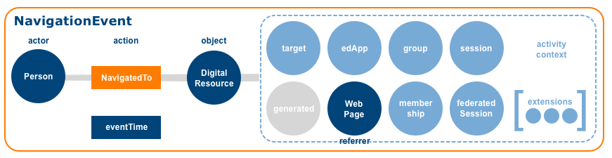

#### Supertype
[Event](#event)

#### Supported Actions
| Action | WordNet® Gloss |
| :----- | :------------- |
| [NavigatedTo](#navigatedTo) | [Direct the course; determine the direction of travelling](http://wordnet-rdf.princeton.edu/wn31/201935739-v). |

#### Properties
[NavigationEvent](#navigationEvent) inherits all properties defined by its supertype [Event](#event). Additional requirements are described below:

| Property | Type | Description | Conformance |
| :------- | :--- | ----------- | :---------: |
| id | [UUID](#uuidDef) | The emitting application MUST provision the [Event](#event) with a [UUID](#uuidDef).  A version 4 [UUID](#uuidDef) SHOULD be generated.  The UUID MUST be expressed as a [URN](#urnDef) using the form `urn:uuid:<UUID>` per [RFC 4122](#rfc4122). | Required |
| type | [Term](#termDef) | The string value MUST be set to the [Term](#termDef) *NavigationEvent*. |Required |
| actor | [Person](#person) | The [Person](#person) who initiated the `action` MUST be specified.  The `actor` value MUST be expressed either as an object or coerced to a string corresponding to the actor's [IRI](#iriDef). | Required |
| action | [Term](#termDef) | The action or predicate that binds the `actor` or subject to the `object` MUST be specified.  The value range is limited to the action terms listed above.  Only one `action` [Term](#termDef) may be specified per [Event](#event). | Required |
| object | [DigitalResource](#digitalResource), [SoftwareApplication](#softwareApplication)| The [DigitalResource](#digitalResource) or [SoftwareApplication](#softwareApplication) that constitutes the `object` of the interaction MUST be specified.  The `object` value MUST be expressed either as an object or coerced to a string corresponding to the object's [IRI](#iriDef). | Required |
| eventTime | DateTime | A date and time value expressed with millisecond precision that indicates when the [Event](#event) occurred MUST be specified.  The value MUST be expressed as an ISO-8601 formatted date/time string set to UTC. | Required |
| target | [Frame](#frame) | A [Frame](#frame) that represents a particular segment or location within the `object`.  The `target` value MUST be expressed either as an object or coerced to a string corresponding to the target entity's [IRI](#iriDef). | Optional |
| generated | [Entity](#entity) | An [Entity](#entity) created or generated as a result of the interaction.  The `generated` value MUST be expressed either as an object or coerced to a string corresponding to the generated entity's [IRI](#iriDef). | Optional |
| edApp | [SoftwareApplication](#softwareApplication) | A [SoftwareApplication](#softwareApplication) that constitutes the application context MAY be specified.  The `edApp` value MUST be expressed either as an object or coerced to a string corresponding to the edApp's [IRI](#iriDef). | Optional |

| referrer | [DigitalResource](#digitalResource), [SoftwareApplication](#softwareApplication) | The [DigitalResource](#digitalResource) or [SoftwareApplication](#softwareApplication) that constitutes the referring context SHOULD be specified.  The `referrer` value MUST be expressed either as an object or coerced to a string corresponding to the referrer's [IRI](#iriDef). | Recommended |
| group | [Organization](#organization) | An [Organization](#organization) that represents the group context MAY be specified.  The `group` value MUST be expressed either as an object or coerced to a string corresponding to the group's [IRI](#iriDef). | Optional |

| membership | [Membership](#membership) | The relationship between the `actor` and the `group` in terms of roles assigned and current status MAY be specified.  The `membership` value MUST be expressed either as an object or coerced to a string corresponding to the membership entity's [IRI](#iriDef). | Optional |

| session | [Session](#session) | The current user [Session](#session) MAY be specified.  The `session` value MUST be expressed either as an object or coerced to a string corresponding to the session's [IRI](#iriDef). | Optional |
| federatedSession | [LtiSession](#ltiSession) | If the [Event](#event) occurs within the context of an [LTI](#lti) tool launch, the actor's tool consumer [LtiSession](#ltiSession) MAY be referenced.  The `federatedSession` value MUST be expressed either as an object or coerced to a string corresponding to the federatedSession's [IRI](#iriDef). | Optional |

| extensions | Array | An ordered collection of objects not defined by the model MAY be specified for a more concise representation of the [Event](#event). | Optional |

#### Deprecated Properties
The following [NavigationEvent](#navigationEvent) properties have been DEPRECATED and MUST NOT be utilized.  The properties will be removed in a future version of Caliper.  

| Property | Type | Description | Conformance |
| :------- | :--- | ----------- | :---------: |
| ~~navigatedFrom~~ | [DigitalResource](#digitalResource), [SoftwareApplication](#softwareApplication) | The [DigitalResource](#digitalResource) or [SoftwareApplication](#softwareApplication) that constitutes the referring context. `navigatedFrom` has been DEPRECATED and replaced by `referrer`. | Deprecated |

#### Example: NavigationEvent (navigated to)
```
{
  "@context": "http://purl.imsglobal.org/ctx/caliper/v1p1",
  "id": "urn:uuid:ff9ec22a-fc59-4ae1-ae8d-2c9463ee2f8f",
  "type": "NavigationEvent",
  "actor": {
    "id": "https://example.edu/users/554433",
    "type": "Person"
  },
  "action": "NavigatedTo",
  "object": {
    "id": "https://example.edu/terms/201701/courses/7/sections/1/pages/2",
    "type": "WebPage",
    "name": "Learning Analytics Specifications",
    "description": "Overview of Learning Analytics Specifications with particular emphasis on IMS Caliper.",
    "dateCreated": "2017-08-01T09:00:00.000Z"
  },
  "eventTime": "2017-11-15T10:15:00.000Z",
  "referrer": {
    "id": "https://example.edu/terms/201701/courses/7/sections/1/pages/1",
    "type": "WebPage"
  },
  "edApp": "https://example.edu",
  "group": {
    "id": "https://example.edu/terms/201701/courses/7/sections/1",
    "type": "CourseSection",
    "courseNumber": "CPS 435-01",
    "academicSession": "Fall 2017"
  },
  "membership": {
    "id": "https://example.edu/terms/201701/courses/7/sections/1/rosters/1",
    "type": "Membership",
    "member": "https://example.edu/users/554433",
    "organization": "https://example.edu/terms/201701/courses/7/sections/1",
    "roles": [ "Learner" ],
    "status": "Active",
    "dateCreated": "2017-08-01T06:00:00.000Z"
  },
  "session": {
    "id": "https://example.edu/sessions/1f6442a482de72ea6ad134943812bff564a76259",
    "type": "Session",
    "startedAtTime": "2017-11-15T10:00:00.000Z"
  }
}
```

<a name="outcomeEvent" />

### B.10 OutcomeEvent
A Caliper [OutcomeEvent](#outcomeEvent) models grading activities performed by an [Agent](#agent), typically a [Person](#person) or a [SoftwareApplication](#softwareApplication).

#### IRI
http://purl.imsglobal.org/caliper/OutcomeEvent

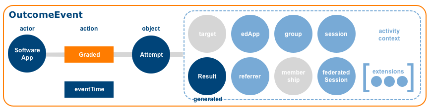

#### Supertype
[Event](#event)

#### Supported Actions
| Action | WordNet® Gloss |
| :----- | :------------- |
| [Graded](#graded) | [Assign a grade or rank to, according to one's evaluation](http://wordnet-rdf.princeton.edu/wn31/200659399-v). |

#### Properties
[OutcomeEvent](#outcomeEvent) inherits all properties defined by its supertype [Event](#event). Additional requirements are described below:

| Property | Type | Description | Conformance |
| :------- | :--- | ----------- | :---------: |
| id | [UUID](#uuidDef) | The emitting application MUST provision the [Event](#event) with a [UUID](#uuidDef).  A version 4 [UUID](#uuidDef) SHOULD be generated.  The UUID MUST be expressed as a [URN](#urnDef) using the form `urn:uuid:<UUID>` per [RFC 4122](#rfc4122). | Required |
| type | [Term](#termDef) | The string value MUST be set to the [Term](#termDef) *OutcomeEvent*. | Required |
| actor | [Agent](#agent) | A generic [Agent](#agent) or one of its subtypes, typically [Person](#person) or [SoftwareApplication](#softwareApplication), MUST be specified as the `actor`.  The `actor` value MUST be expressed either as an object or coerced to a string corresponding to the actor's [IRI](#iriDef). | Required |
| action | [Term](#termDef) | The action or predicate that binds the `actor` or subject to the `object` MUST be specified.  The value range is limited to the action terms listed above.  Only one `action` [Term](#termDef) may be specified per [Event](#event). | Required |
| object | [Attempt](#attempt) | The completed [Attempt](#attempt) MUST be specified.  The `object` value MUST be expressed either as an object or coerced to a string corresponding to the object's [IRI](#iriDef). | Required |
| eventTime | DateTime | A date and time value expressed with millisecond precision that indicates when the [Event](#event) occurred MUST be specified.  The value MUST be expressed as an ISO-8601 formatted date/time string set to UTC. | Required |
| target | [Entity](#entity) | An [Entity](#entity) that represents a particular segment or location within the `object`.  The `target` value MUST be expressed either as an object or coerced to a string corresponding to the target entity's [IRI](#iriDef). | Not Applicable |
| generated | [Result](#result) | The generated [Result](#result) SHOULD be provided.  The `generated` value MUST be expressed either as an object or coerced to a string corresponding to the generated entity's [IRI](#iriDef). | Recommended |
| edApp | [SoftwareApplication](#softwareApplication) | A [SoftwareApplication](#softwareApplication) that constitutes the application context MAY be specified.  The `edApp` value MUST be expressed either as an object or coerced to a string corresponding to the edApp's [IRI](#iriDef). | Optional |

| referrer | [Entity](#entity) | An [Entity](#entity) that represents the referring context MAY be specified. A [SoftwareApplication](#softwareApplication) or [DigitalResource](#digitalResource) will typically constitute the referring context.  The `referrer` value MUST be expressed either as an object or coerced to a string corresponding to the referrer's [IRI](#iriDef). | Optional |
| group | [Organization](#organization) | An [Organization](#organization) that represents the group context MAY be specified.  The `group` value MUST be expressed either as an object or coerced to a string corresponding to the group's [IRI](#iriDef). | Optional |

| membership | [Membership](#membership) | The relationship between the `actor` and the `group` in terms of roles assigned and current status MAY be specified.  The `membership` value MUST be expressed either as an object or coerced to a string corresponding to the membership entity's [IRI](#iriDef). | Optional |

| session | [Session](#session) | The current user [Session](#session) MAY be specified.  The `session` value MUST be expressed either as an object or coerced to a string corresponding to the session's [IRI](#iriDef). | Optional |
| federatedSession | [LtiSession](#ltiSession) | If the [Event](#event) occurs within the context of an [LTI](#lti) tool launch, the actor's tool consumer [LtiSession](#ltiSession) MAY be referenced.  The `federatedSession` value MUST be expressed either as an object or coerced to a string corresponding to the federatedSession's [IRI](#iriDef). | Optional |

| extensions | Array | An ordered collection of objects not defined by the model MAY be specified for a more concise representation of the [Event](#event). | Optional |

#### Example: OutcomeEvent (graded)
```
{
  "@context": "http://purl.imsglobal.org/ctx/caliper/v1p1",
  "id": "urn:uuid:a50ca17f-5971-47bb-8fca-4e6e6879001d",
  "type": "OutcomeEvent",
  "actor": {
    "id": "https://example.edu/autograder",
    "type": "SoftwareApplication",
    "version": "v2"
  },
  "action": "Graded",
  "object": {
    "id": "https://example.edu/terms/201701/courses/7/sections/1/assess/1/users/554433/attempts/1",
    "type": "Attempt",
    "assignee": {
      "id": "https://example.edu/users/554433",
      "type": "Person"
    },
    "assignable": {
      "id": "https://example.edu/terms/201701/courses/7/sections/1/assess/1",
      "type": "Assessment"
    },
    "count": 1,
    "dateCreated": "2017-11-15T10:05:00.000Z",
    "startedAtTime": "2017-11-15T10:05:00.000Z",
    "endedAtTime": "2017-11-15T10:55:12.000Z",
    "duration": "PT50M12S"
  },
  "eventTime": "2017-11-15T10:57:06.000Z",
  "edApp": "https://example.edu",
  "generated": {
    "id": "https://example.edu/terms/201701/courses/7/sections/1/assess/1/users/554433/results/1",
    "type": "Result",
    "attempt": "https://example.edu/terms/201701/courses/7/sections/1/assess/1/users/554433/attempts/1",
    "normalScore": 15.0,
    "totalScore": 15.0,
    "scoredBy": "https://example.edu/autograder",
    "dateCreated": "2017-11-15T10:55:05.000Z"
  },
  "group": {
    "id": "https://example.edu/terms/201701/courses/7/sections/1",
    "type": "CourseSection",
    "courseNumber": "CPS 435-01",
    "academicSession": "Fall 2017"
  }
}
```
<a name="readingEvent" />

### B.11 ReadingEvent DEPRECATED

A Caliper [ReadingEvent](#readingEvent) models an actor reading textural content.  ReadingEvent is DEPRECATED and will be removed in a future version of the specification.  It SHOULD NOT be referenced.

#### IRI
http://purl.imsglobal.org/caliper/ReadingEvent

#### Supertype
[Event](#event)

#### Deprecated actions
| Action | WordNet® Gloss |
| :----- | :------------- |
| [NavigatedTo](#navigatedTo) | [Direct the course; determine the direction of travelling](http://wordnet-rdf.princeton.edu/wn31/201935739-v). |
| [Searched](#searched) | [Try to locate or discover, or try to establish the existence of](http://wordnet-rdf.princeton.edu/wn31/201318273-v). |
| [Viewed](#viewed) |[Look at carefully; study mentally](http://wordnet-rdf.princeton.edu/wn31/202134765-v). |

#### Properties
[ReadingEvent](#readingEvent) inherits all properties defined by its supertype [Event](#event). Additional requirements are described below:

| Property | Type | Description | Conformance |
| :------- | :--- | ----------- | :---------: |
| id | [UUID](#uuidDef) | The emitting application MUST provision the [Event](#event) with a [UUID](#uuidDef).  A version 4 [UUID](#uuidDef) SHOULD be generated.  The UUID MUST be expressed as a [URN](#urnDef) using the form `urn:uuid:<UUID>` per [RFC 4122](#rfc4122). | Required |
| type | [Term](#termDef) | The string value MUST be set to the [Term](#termDef) *ReadingEvent*. | Required |
| actor | [Person](#person) | The [Person](#person) who initiated the `action` MUST be specified.  The `actor` value MUST be expressed either as an object or coerced to a string corresponding to the actor's [IRI](#iriDef). | Required |
| action | [Term](#termDef) | the action or predicate that binds the `actor` or subject to the `object` MUST be specified.  The value range is limited to the action terms listed above.  Only one `action` [Term](#termDef) may be specified per [Event](#event). | Required |
| object | [DigitalResource](#digitalResource) | The [DigitalResource](#digitalResource) that constitutes the `object` of the interaction MUST be specified.  The `object` value MUST be expressed either as an object or coerced to a string corresponding to the object's [IRI](#iriDef). | Required |
| eventTime | DateTime | A date and time value expressed with millisecond precision that indicates when the [Event](#event) occurred MUST be specified.  The value MUST be expressed as an ISO-8601 formatted date/time string set to UTC. | Required |
| target | [Frame](#frame) | A [Frame](#frame) that represents a particular segment or location within the `object`.  The `target` value MUST be expressed either as an object or coerced to a string corresponding to the target entity's [IRI](#iriDef). | Optional |
| generated | [Entity](#entity) | An [Entity](#entity) created or generated as a result of the interaction.  The `generated` value MUST be expressed either as an object or coerced to a string corresponding to the generated entity's [IRI](#iriDef). | Optional |
| edApp | [SoftwareApplication](#softwareApplication) | A [SoftwareApplication](#softwareApplication) that constitutes the application context MAY be specified.  The `edApp` value MUST be expressed either as an object or coerced to a string corresponding to the edApp's [IRI](#iriDef). | Optional |

| referrer | [Entity](#entity) | An [Entity](#entity) that represents the referring context MAY be specified. A [SoftwareApplication](#softwareApplication) or [DigitalResource](#digitalResource) will typically constitute the referring context.  The `referrer` value MUST be expressed either as an object or coerced to a string corresponding to the referrer's [IRI](#iriDef). | Optional |
| group | [Organization](#organization) | An [Organization](#organization) that represents the group context MAY be specified.  The `group` value MUST be expressed either as an object or coerced to a string corresponding to the group's [IRI](#iriDef). | Optional |

| membership | [Membership](#membership) | The relationship between the `actor` and the `group` in terms of roles assigned and current status MAY be specified.  The `membership` value MUST be expressed either as an object or coerced to a string corresponding to the membership entity's [IRI](#iriDef). | Optional |

| session | [Session](#session) | The current user [Session](#session) MAY be specified.  The `session` value MUST be expressed either as an object or coerced to a string corresponding to the session's [IRI](#iriDef). | Optional |
| federatedSession | [LtiSession](#ltiSession) | If the [Event](#event) occurs within the context of an [LTI](#lti) tool launch, the actor's tool consumer [LtiSession](#ltiSession) MAY be referenced.  The `federatedSession` value MUST be expressed either as an object or coerced to a string corresponding to the federatedSession's [IRI](#iriDef). | Optional |

| extensions | Array | An ordered collection of objects not defined by the model MAY be specified for a more concise representation of the [Event](#event).  The `federatedSession` value MUST be expressed either as an object or coerced to a string corresponding to the federatedSession's [IRI](#iriDef). | Optional |

<a name="sessionEvent" />

### B.12 SessionEvent
A Caliper [SessionEvent](#sessionEvent) models the creation and subsequent termination of a user session established by a [Person](#person) interacting with a [SoftwareApplication](#softwareApplication).

#### IRI
http://purl.imsglobal.org/caliper/SessionEvent

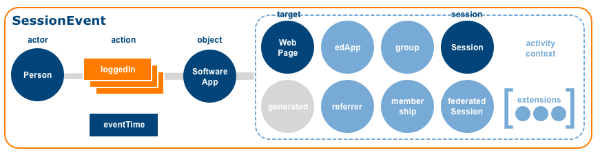
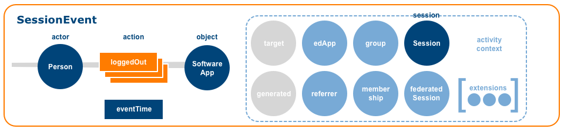


#### Supported actions
| Action | WordNet® Gloss |
| :----- | :------------- |
| [LoggedIn](#loggedIn) | [Enter a computer or software application](http://wordnet-rdf.princeton.edu/wn31/202253955-v).  Inverse of [LoggedOut](#loggedOut). |
| [LoggedOut](#loggedOut) | [Exit a computer or software application](http://wordnet-rdf.princeton.edu/wn31/202254101-v).  Inverse of [LoggedIn](#loggedIn). |
| [TimedOut](#timedOut) | Cancellation of a user session after a predetermined time interval has occurred without activity. |

#### Properties
[SessionEvent](#sessionEvent) inherits all properties defined by its supertype [Event](#event). Additional requirements are described below:

| Property | Type | Description | Conformance |
| :------- | :--- | ----------- | :---------: |
| id | [UUID](#uuidDef) | The emitting application MUST provision the [Event](#event) with a [UUID](#uuidDef).  A version 4 [UUID](#uuidDef) SHOULD be generated.  The UUID MUST be expressed as a [URN](#urnDef) using the form `urn:uuid:<UUID>` per [RFC 4122](#rfc4122). | Required |

| type | [Term](#termDef) | The string value MUST be set to the [Term](#termDef) *SessionEvent*. | Required |
| actor | [Agent](#agent) | The [Agent](#agent) who initiated the `action` MUST be specified.  For [LoggedIn](#loggedIn) and [LoggedOut](#loggedOut) actions a [Person](#person) MUST be specified as the `actor`.  For a [TimedOut](#timedOut) action a [SoftwareApplication](#softwareApplication) MUST be specified as the `actor`.  The `actor` value MUST be expressed either as an object or coerced to a string corresponding to the actor's [IRI](#iriDef). | Required |
| action | [Term](#termDef) | The action or predicate that binds the `actor` or subject to the `object` MUST be specified.  The value range is limited to the action terms listed above.  Only one `action` [Term](#termDef) may be specified per [Event](#event). | Required |
| object | [Session](#session), [SoftwareApplication](#softwareApplication) | For [LoggedIn](#loggedIn) and [LoggedOut](#loggedOut) actions a [SoftwareApplication](#softwareApplication) MUST be specified as the `object`.  For a [TimedOut](#timedOut) action the [Session](#session) MUST be specified as the object.  The `object` value MUST be expressed either as an object or coerced to a string corresponding to the object's [IRI](#iriDef). | Required |
| eventTime | DateTime | A date and time value expressed with millisecond precision that indicates when the [Event](#event) occurred MUST be specified.  The value MUST be expressed as an ISO-8601 formatted date/time string set to UTC. | Required |
| target | [DigitalResource](#digitalResource) | When logging in to a [SoftwareApplication](#softwareApplication), if the actor is attempting to access a particular [DigitalResource](#digitalResource) it MAY be designated as the `target` of the interaction.  The `target` value MUST be expressed either as an object or coerced to a string corresponding to the target entity's [IRI](#iriDef). | Optional |
| generated | [Entity](#entity) | An [Entity](#entity) created or generated as a result of the interaction.  The `generated` value MUST be expressed either as an object or coerced to a string corresponding to the generated entity's [IRI](#iriDef). | Optional |
| edApp | [SoftwareApplication](#softwareApplication) | A [SoftwareApplication](#softwareApplication) that constitutes the application context MAY be specified.  The `edApp` value MUST be expressed either as an object or coerced to a string corresponding to the edApp's [IRI](#iriDef). | Optional |

| referrer | [DigitalResource](#digitalResource), [SoftwareApplication](#softwareApplication) | The [DigitalResource](#digitalResource) or [SoftwareApplication](#softwareApplication) that constitutes the referring context MAY be specified as the `referrer`.  The `referrer` value MUST be expressed either as an object or coerced to a string corresponding to the referrer's [IRI](#iriDef). | Optional |
| group | [Organization](#organization) | An [Organization](#organization) that represents the group context MAY be specified.  The `group` value MUST be expressed either as an object or coerced to a string corresponding to the group's [IRI](#iriDef). | Optional |

| membership | [Membership](#membership) | The relationship between the `actor` and the `group` in terms of roles assigned and current status MAY be specified.  The `membership` value MUST be expressed either as an object or coerced to a string corresponding to the membership entity's [IRI](#iriDef). | Optional |

| session | [Session](#session) | the relevant user [Session](#session) SHOULD be specified.  The `session` value MUST be expressed either as an object or coerced to a string corresponding to the session's [IRI](#iriDef). | Recommended |
| federatedSession | [LtiSession](#ltiSession) | If the [Event](#event) occurs within the context of an [LTI](#lti) tool launch, the actor's tool consumer [LtiSession](#ltiSession) MAY be referenced.  The `federatedSession` value MUST be expressed either as an object or coerced to a string corresponding to the federatedSession's [IRI](#iriDef). | Optional |

| extensions | Array | An ordered collection of objects not defined by the model MAY be specified for a more concise representation of the [Event](#event). | Optional |

#### Example: SessionEvent (logged in)
```
{
  "@context": "http://purl.imsglobal.org/ctx/caliper/v1p1",
  "id": "urn:uuid:fcd495d0-3740-4298-9bec-1154571dc211",
  "type": "SessionEvent",
  "actor": {
    "id": "https://example.edu/users/554433",
    "type": "Person"
  },
  "action": "LoggedIn",
  "object": {
    "id": "https://example.edu",
    "type": "SoftwareApplication",
    "version": "v2"
  },
  "eventTime": "2017-11-15T10:15:00.000Z",
  "edApp": "https://example.edu",
  "session": {
    "id": "https://example.edu/sessions/1f6442a482de72ea6ad134943812bff564a76259",
    "type": "Session",
    "user": "https://example.edu/users/554433",
    "dateCreated": "2017-11-15T10:00:00.000Z",
    "startedAtTime": "2017-11-15T10:00:00.000Z"
  }
}
```

#### Example: SessionEvent (logged out)
```
{
  "@context": "http://purl.imsglobal.org/ctx/caliper/v1p1",
  "id": "urn:uuid:a438f8ac-1da3-4d48-8c86-94a1b387e0f6",
  "type": "SessionEvent",
  "actor": {
    "id": "https://example.edu/users/554433",
    "type": "Person"
  },
  "action": "LoggedOut",
  "object": {
    "id": "https://example.edu",
    "type": "SoftwareApplication",
    "version": "v2"
  },
  "eventTime": "2017-11-15T11:05:00.000Z",
  "edApp": "https://example.edu",
  "session": {
    "id": "https://example.edu/sessions/1f6442a482de72ea6ad134943812bff564a76259",
    "type": "Session",
    "user": "https://example.edu/users/554433",
    "dateCreated": "2017-11-15T10:00:00.000Z",
    "startedAtTime": "2017-11-15T10:00:00.000Z",
    "endedAtTime": "2017-11-15T11:05:00.000Z",
    "duration": "PT3000S"
  }
}
```

#### Example: SessionEvent (timed out)
```
{
  "@context": "http://purl.imsglobal.org/ctx/caliper/v1p1",
  "id": "urn:uuid:4e61cf6c-ffbe-45bc-893f-afe7ad4079dc",
  "type": "SessionEvent",
  "actor": {
    "id": "https://example.edu",
    "type": "SoftwareApplication"
  },
  "action": "TimedOut",
  "object": {
    "id": "https://example.edu/sessions/7d6b88adf746f0692e2e873308b78c60fb13a864",
    "type": "Session",
    "user": {
      "id": "https://example.edu/users/112233",
      "type": "Person"
    },
    "dateCreated": "2017-11-15T10:15:00.000Z",
    "startedAtTime": "2017-11-15T10:15:00.000Z",
    "endedAtTime": "2017-11-15T11:15:00.000Z",
    "duration": "PT3600S"
  },
  "eventTime": "2017-11-15T11:15:00.000Z",
  "edApp": "https://example.edu"
}
```

<a name="threadEvent" />

### B.13 ThreadEvent
A Caliper [ThreadEvent](#threadEvent) models an actor interacting with a [Forum](#forum) thread or topic. 
 
#### IRI
http://purl.imsglobal.org/caliper/ThreadEvent

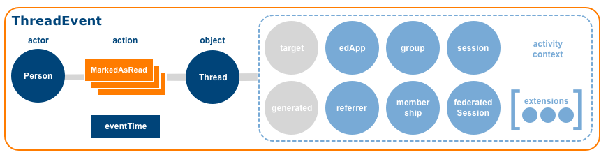

#### Supertype
[Event](#event)

#### Supported Actions
| Action | WordNet® Gloss |
| :----- | :------------- |
| [MarkedAsRead](#markedAsRead) | [Mark: designate as if by a mark](http://wordnet-rdf.princeton.edu/wn31/200923709-v), [read: interpret something that is written or printed](http://wordnet-rdf.princeton.edu/wn31/200626756-v).  Inverse of [MarkedAsUnread](#markedAsUnread).  |
| [MarkedAsUnRead](#markedAsUnRead) | Inverse of [MarkedAsRead](#markedAsRead). | 

#### Properties
[ThreadEvent](#threadEvent) inherits all properties defined by its supertype [Event](#event). Additional requirements are described below:

| Property | Type | Description | Conformance |
| :------- | :--- | ----------- | :---------: |
| id | [UUID](#uuidDef) | The emitting application MUST provision the [Event](#event) with a [UUID](#uuidDef).  A version 4 [UUID](#uuidDef) SHOULD be generated.  The UUID MUST be expressed as a [URN](#urnDef) using the form `urn:uuid:<UUID>` per [RFC 4122](#rfc4122). | Required |
| type | [Term](#termDef) | The string value MUST be set to the term *ThreadEvent*. | Required |
| actor | [Person](#person) | The [Person](#person) who initiated the `action` MUST be specified.  The `actor` value MUST be expressed either as an object or coerced to a string corresponding to the actor's [IRI](#iriDef). | Required |
| action | [Term](#termDef) | The action or predicate that binds the `actor` or subject to the `object` MUST be specified.  The value range is limited to the action terms listed above.  Only one `action` [Term](#termDef) may be specified per [Event](#event).  | Required |
| object | [Thread](#thread) | The [Thread](#thread) that constitutes the `object` of the interaction MUST be specified.  The `object` value MUST be expressed either as an object or coerced to a string corresponding to the object's [IRI](#iriDef). | Required |
| eventTime | DateTime | A date and time value expressed with millisecond precision that indicates when the [Event](#event) occurred MUST be specified.  The value MUST be expressed as an ISO-8601 formatted date/time string set to UTC. | Required |
| target | [Entity](#entity) | An [Entity](#entity) that represents a particular segment or location within the `object`.  The `target` value MUST be expressed either as an object or coerced to a string corresponding to the target entity's [IRI](#iriDef). | Optional |
| generated | [Entity](#entity) | An [Entity](#entity) created or generated as a result of the interaction.  The `generated` value MUST be expressed either as an object or coerced to a string corresponding to the generated entity's [IRI](#iriDef). | Optional |
| edApp | [SoftwareApplication](#softwareApplication) | A [SoftwareApplication](#softwareApplication) that constitutes the application context MAY be specified.  The `edApp` value MUST be expressed either as an object or coerced to a string corresponding to the edApp's [IRI](#iriDef). | Optional |

| referrer | [Entity](#entity) | An [Entity](#entity) that represents the referring context MAY be specified. A [SoftwareApplication](#softwareApplication) or [DigitalResource](#digitalResource) will typically constitute the referring context.  The `referrer` value MUST be expressed either as an object or coerced to a string corresponding to the referrer's [IRI](#iriDef). | Optional |
| group | [Organization](#organization) | An [Organization](#organization) that represents the group context MAY be specified.  The `group` value MUST be expressed either as an object or coerced to a string corresponding to the group's [IRI](#iriDef). | Optional |

| membership | [Membership](#membership) | The relationship between the `actor` and the `group` in terms of roles assigned and current status MAY be specified.  The `membership` value MUST be expressed either as an object or coerced to a string corresponding to the membership entity's [IRI](#iriDef). | Optional |

| session | [Session](#session) | The current user [Session](#session) MAY be specified.  The `session` value MUST be expressed either as an object or coerced to a string corresponding to the session's [IRI](#iriDef). | Optional |
| federatedSession | [LtiSession](#ltiSession) | If the [Event](#event) occurs within the context of an [LTI](#lti) tool launch, the actor's tool consumer [LtiSession](#ltiSession) MAY be referenced.  The `federatedSession` value MUST be expressed either as an object or coerced to a string corresponding to the federatedSession's [IRI](#iriDef). | Optional |

| extensions | Array | An ordered collection of objects not defined by the model MAY be specified for a more concise representation of the [Event](#event). | Optional |

#### Example: ThreadEvent (marked as read)
```
{
  "@context": "http://purl.imsglobal.org/ctx/caliper/v1p1",
  "id": "urn:uuid:6b20c5ba-301c-4e56-85a0-2f3d9a94c249",
  "type": "ThreadEvent",
  "actor": {
    "id": "https://example.edu/users/554433",
    "type": "Person"
  },
  "action": "MarkedAsRead",
  "object": {
    "id": "https://example.edu/terms/201701/courses/7/sections/1/forums/1/topics/1",
    "type": "Thread",
    "name": "Caliper Information Model",
    "isPartOf": {
      "id": "https://example.edu/terms/201701/courses/7/sections/1/forums/1",
      "type": "Forum",
      "name": "Caliper Forum",
      "dateCreated": "2017-11-15T10:15:00.000Z"
    },
    "dateCreated": "2017-11-15T10:16:00.000Z"
  },
  "eventTime": "2017-11-15T10:16:00.000Z",
  "edApp": {
    "id": "https://example.edu/forums",
    "type": "SoftwareApplication",
    "version": "v2"
  },
  "group": {
    "id": "https://example.edu/terms/201701/courses/7/sections/1",
    "type": "CourseSection",
    "courseNumber": "CPS 435-01",
    "academicSession": "Fall 2017"
  },
  "membership": {
    "id": "https://example.edu/terms/201701/courses/7/sections/1/rosters/1",
    "type": "Membership",
    "member": "https://example.edu/users/554433",
    "organization": "https://example.edu/terms/201701/courses/7/sections/1",
    "roles": [ "Learner" ],
    "status": "Active",
    "dateCreated": "2017-08-01T06:00:00.000Z"
  },
  "session": {
    "id": "https://example.edu/sessions/1f6442a482de72ea6ad134943812bff564a76259",
    "type": "Session",
    "startedAtTime": "2017-11-15T10:00:00.000Z"
  }
}
```

<a name="toolUseEvent" />

### B.14 ToolUseEvent
A Caliper [ToolUseEvent](#toolUseEvent) models a [Person](#person) using a learning tool in a way that the tool's creators have determined is an indication of a learning interaction.

#### IRI
http://purl.imsglobal.org/caliper/ToolUseEvent

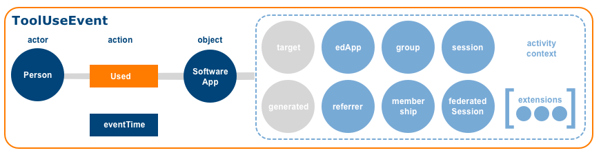

#### Supertype
[Event](#event)

#### Supported actions
| Action | WordNet® Gloss |
| :----- | :------------- |
| Used | [Put into service; make work or employ for a particular purpose or for its inherent or natural purpose](http://wordnet-rdf.princeton.edu/wn31/201161188-v). |

#### Properties
[ToolUseEvent](#toolUseEvent) inherits all properties defined by its supertype [Event](#event). Additional requirements are described below:

| Property | Type | Description | Conformance |
| :------- | :--- | ----------- | :---------: |
| id | [UUID](#uuidDef) | The emitting application MUST provision the [Event](#event) with a [UUID](#uuidDef).  A version 4 [UUID](#uuidDef) SHOULD be generated.  The UUID MUST be expressed as a [URN](#urnDef) using the form `urn:uuid:<UUID>` per [RFC 4122](#rfc4122). | Required |
| type | [Term](#termDef) | The string value MUST be set to the [Term](#termDef) *ToolUseEvent*. | Required |
| actor | [Person](#person) | The [Person](#person) who initiated the `action` MUST be specified.  The `actor` value MUST be expressed either as an object or coerced to a string corresponding to the actor's [IRI](#iriDef). | Required |
| action | [Term](#termDef) | The action or predicate that binds the `actor` or subject to the `object` MUST be specified.  The value range is limited to the action terms listed above.  Only one `action` [Term](#termDef)  may be specified per [Event](#event). | Required |
| object | [SoftwareApplication](#softwareApplication) | The [SoftwareApplication](#softwareApplication) that constitutes  the `object` of the interaction MUST be specified.  The `object` value MUST be expressed either as an object or coerced to a string corresponding to the object's [IRI](#iriDef). | Required |
| eventTime | DateTime | A date and time value expressed with millisecond precision that indicates when the [Event](#event) occurred MUST be specified.  The value MUST be expressed as an ISO-8601 formatted date/time string set to UTC. | Required |
| target | [SoftwareApplication](#softwareApplication) | A [SoftwareApplication](#softwareApplication) that represents a particular capability or feature provided by the `object`.  The `target` value MUST be expressed either as an object or coerced to a string corresponding to the target entity's [IRI](#iriDef). | Optional |
| generated | [Entity](#entity) | An [Entity](#entity) created or generated as a result of the interaction.  The `generated` value MUST be expressed either as an object or coerced to a string corresponding to the generated entity's [IRI](#iriDef). | Optional |
| edApp | [SoftwareApplication](#softwareApplication) | A [SoftwareApplication](#softwareApplication) that constitutes the application context MAY be specified.  The `edApp` value MUST be expressed either as an object or coerced to a string corresponding to the edApp's [IRI](#iriDef). | Optional |

| referrer | [Entity](#entity) | An [Entity](#entity) that represents the referring context MAY be specified. A [SoftwareApplication](#softwareApplication) or [DigitalResource](#digitalResource) will typically constitute the referring context.  The `referrer` value MUST be expressed either as an object or coerced to a string corresponding to the referrer's [IRI](#iriDef). | Optional |
| group | [Organization](#organization) | An [Organization](#organization) that represents the group context MAY be specified.  The `group` value MUST be expressed either as an object or coerced to a string corresponding to the group's [IRI](#iriDef). | Optional |

| membership | [Membership](#membership) | The relationship between the `actor` and the `group` in terms of roles assigned and current status MAY be specified.  The `membership` value MUST be expressed either as an object or coerced to a string corresponding to the membership entity's [IRI](#iriDef). | Optional |

| session | [Session](#session) | The current user [Session](#session) MAY be specified.  The `session` value MUST be expressed either as an object or coerced to a string corresponding to the session's [IRI](#iriDef). | Optional |
| federatedSession | [LtiSession](#ltiSession) | If the [Event](#event) occurs within the context of an [LTI](#lti) tool launch, the actor's tool consumer [LtiSession](#ltiSession) MAY be referenced.  The `federatedSession` value MUST be expressed either as an object or coerced to a string corresponding to the federatedSession's [IRI](#iriDef). | Optional |

| extensions | Array | An ordered collection of objects not defined by the model MAY be specified for a more concise representation of the [Event](#event). | Optional |

#### Example: ToolUseEvent (used)
```
{
  "@context": "http://purl.imsglobal.org/ctx/caliper/v1p1",
  "id": "urn:uuid:7e10e4f3-a0d8-4430-95bd-783ffae4d916",
  "type": "ToolUseEvent",
  "actor": {
    "id": "https://example.edu/users/554433",
    "type": "Person"
  },
  "action": "Used",
  "object": {
    "id": "https://example.edu",
    "type": "SoftwareApplication"
  },
  "eventTime": "2017-11-15T10:15:00.000Z",
  "edApp": "https://example.edu",
  "group": {
    "id": "https://example.edu/terms/201701/courses/7/sections/1",
    "type": "CourseSection",
    "courseNumber": "CPS 435-01",
    "academicSession": "Fall 2017"
  },
  "membership": {
    "id": "https://example.edu/terms/201701/courses/7/sections/1/rosters/1",
    "type": "Membership",
    "member": "https://example.edu/users/554433",
    "organization": "https://example.edu/terms/201701/courses/7/sections/1",
    "roles": [ "Learner" ],
    "status": "Active",
    "dateCreated": "2017-08-01T06:00:00.000Z"
  },
  "session": {
    "id": "https://example.edu/sessions/1f6442a482de72ea6ad134943812bff564a76259",
    "type": "Session",
    "startedAtTime": "2017-11-15T10:00:00.000Z"
  }
}
```

<a name="viewEvent" />

### B.15 ViewEvent
A Caliper [ViewEvent](#viewEvent) describes an actor's examination of digital content whenever the activity emphasizes thoughtful observation or study as opposed to the mere retrieval of a resource.

#### IRI
http://purl.imsglobal.org/caliper/ViewEvent

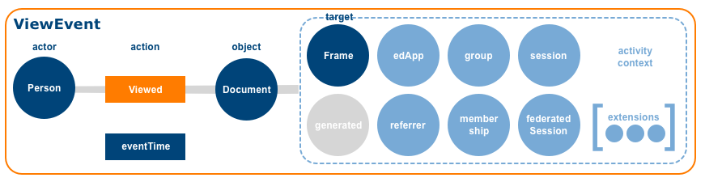

#### Supertype
[Event](#event)

#### Supported Actions
| Action | WordNet® Gloss |
| :----- | :------------- |
| [Viewed](#viewed) |[Look at carefully; study mentally](http://wordnet-rdf.princeton.edu/wn31/202134765-v). |

#### Properties
[ViewEvent](#viewEvent) inherits all properties defined by its supertype [Event](#event). Additional requirements are described below:

| Property | Type | Description | Conformance |
| :------- | :--- | ----------- | :---------: |
| id | [UUID](#uuidDef) | The emitting application MUST provision the [Event](#event) with a [UUID](#uuidDef).  A version 4 [UUID](#uuidDef) SHOULD be generated.  The UUID MUST be expressed as a [URN](#urnDef) using the form `urn:uuid:<UUID>` per [RFC 4122](#rfc4122). | Required |
| type | [Term](#termDef) | The string value MUST be set to the [Term](#termDef) *ViewEvent* MUST be specified.
| actor | [Person](#person) | The [Person](#person) who initiated the `action` MUST be specified.  The `actor` value MUST be expressed either as an object or coerced to a string corresponding to the actor's [IRI](#iriDef). | Required |
| action | [Term](#termDef) | The action or predicate that binds the `actor` or subject to the `object` MUST be specified.  The value range is limited to the action terms listed above.  Only one `action` [Term](#termDef)  may be specified per [Event](#event). | Required |
| object | [DigitalResource](#digitalResource) | The [DigitalResource](#digitalResource) that constitutes the `object` of the interaction MUST be specified.  The `object` value MUST be expressed either as an object or coerced to a string corresponding to the object's [IRI](#iriDef). | Required |
| eventTime | DateTime | A date and time value expressed with millisecond precision that indicates when the [Event](#event) occurred MUST be specified.  The value MUST be expressed as an ISO-8601 formatted date/time string set to UTC. | Required |
| target | [Frame](#frame) | A [Frame](#frame) that represents a particular segment or location within the `object`.  The `target` value MUST be expressed either as an object or coerced to a string corresponding to the target entity's [IRI](#iriDef). | Optional |
| generated | [Entity](#entity) | An [Entity](#entity) created or generated as a result of the interaction.  The `generated` value MUST be expressed either as an object or coerced to a string corresponding to the generated entity's [IRI](#iriDef). | Optional |
| edApp | [SoftwareApplication](#softwareApplication) | A [SoftwareApplication](#softwareApplication) that constitutes the application context MAY be specified.  The `edApp` value MUST be expressed either as an object or coerced to a string corresponding to the edApp's [IRI](#iriDef). | Optional |

| referrer | [Entity](#entity) | An [Entity](#entity) that represents the referring context MAY be specified. A [SoftwareApplication](#softwareApplication) or [DigitalResource](#digitalResource) will typically constitute the referring context.  The `referrer` value MUST be expressed either as an object or coerced to a string corresponding to the referrer's [IRI](#iriDef). | Optional |
| group | [Organization](#organization) | An [Organization](#organization) that represents the group context MAY be specified.  The `group` value MUST be expressed either as an object or coerced to a string corresponding to the group's [IRI](#iriDef). | Optional |

| membership | [Membership](#membership) | The relationship between the `actor` and the `group` in terms of roles assigned and current status MAY be specified.  The `membership` value MUST be expressed either as an object or coerced to a string corresponding to the membership entity's [IRI](#iriDef). | Optional |

| session | [Session](#session) | The current user [Session](#session) MAY be specified.  The `session` value MUST be expressed either as an object or coerced to a string corresponding to the session's [IRI](#iriDef). | Optional |
| federatedSession | [LtiSession](#ltiSession) | If the [Event](#event) occurs within the context of an [LTI](#lti) tool launch, the actor's tool consumer [LtiSession](#ltiSession) MAY be referenced.  The `federatedSession` value MUST be expressed either as an object or coerced to a string corresponding to the federatedSession's [IRI](#iriDef). | Optional |

| extensions | Array | An ordered collection of objects not defined by the model MAY be specified for a more concise representation of the [Event](#event). | Optional |

#### Example ViewEvent (viewed)
```
{
  "@context": "http://purl.imsglobal.org/ctx/caliper/v1p1",
  "id": "urn:uuid:cd088ca7-c044-405c-bb41-0b2a8506f907",
  "type": "ViewEvent",
  "actor": {
    "id": "https://example.edu/users/554433",
    "type": "Person"
  },
  "action": "Viewed",
  "object": {
    "id": "https://example.edu/etexts/201.epub",
    "type": "Document",
    "name": "IMS Caliper Implementation Guide",
    "dateCreated": "2017-08-01T06:00:00.000Z",
    "datePublished": "2017-10-01T06:00:00.000Z",
    "version": "1.1"
  },
  "eventTime": "2017-11-15T10:15:00.000Z",
  "edApp": "https://example.edu",
  "group": {
    "id": "https://example.edu/terms/201701/courses/7/sections/1",
    "type": "CourseSection",
    "courseNumber": "CPS 435-01",
    "academicSession": "Fall 2017"
  },
  "membership": {
    "id": "https://example.edu/terms/201701/courses/7/sections/1/rosters/1",
    "type": "Membership",
    "member": "https://example.edu/users/554433",
    "organization": "https://example.edu/terms/201701/courses/7/sections/1",
    "roles": [ "Learner" ],
    "status": "Active",
    "dateCreated": "2017-08-01T06:00:00.000Z"
  },
  "session": {
    "id": "https://example.edu/sessions/1f6442a482de72ea6ad134943812bff564a76259",
    "type": "Session",
    "startedAtTime": "2017-11-15T10:00:00.000Z"
  }
}
```

<a name="entities" />

## Appendix C. Entities

<a name="entity" />

### C.1 Entity
A Caliper [Entity](#entity) is a generic type that represents objects or things that participate in learning-related activities.  [Entity](#entity) is subtyped for enhanced type specificity in order to better describe people, groups, digital content, courses, assignments, assessments, forums, messages, software applications and other entities that constitute the "stuff" of a Caliper [Event](#event).

Utilize [Entity](#entity) only if no suitable subtype exists to represent the thing being described.

#### IRI
http://purl.imsglobal.org/caliper/Entity

#### Properties
The base set of [Entity](#entity) properties is listed below.  Each property MUST be referenced only once.  The `id` and `type` properties are required; all other properties are optional.  Custom properties not described by the model MAY be included but MUST be added to the `extensions` property object array as values.  Properties with a value of *null* or empty SHOULD be excluded prior to serialization. 

| Property | Type | Description | Conformance |
| :------- | :--- | ----------- | :---------: |
| id | [IRI](#iriDef) | A valid [IRI](#iriDef) MUST be specified. The [IRI](#iriDef) MUST be unique and persistent. The [IRI](#iriDef) SHOULD also be dereferenceable, i.e., capable of returning a representation of the resource. A [URI](#uriDef) employing the [URN](#urnDef) scheme MAY be provided in cases where a [Linked Data](#linkedDataDef) friendly HTTP URI is either unavailable or inappropriate. | Required |
| type | [Term](#termDef) | A string value corresponding to the [Term](#termDef) defined for the [Entity](#entity) in the external IMS Caliper JSON-LD [context](http://purl.imsglobal.org/ctx/caliper/v1p1) document MUST be specified.  For a generic [Entity](#entity) set the `type` value to the term *Entity*.  If a subtype of [Entity](#entity) is created, set the type to the [Term](#termDef) corresponding to the subtype utilized, e.g., *Person*. | Required |
| name | string | A string value comprising a word or phrase by which the [Entity](#entity) is known MAY be specified. | Optional |
| description | string |  A string value comprising a brief, plain text representation of the [Entity](#entity) MAY be specified. | Optional |
| dateCreated | DateTime | A date and time value expressed with millisecond precision that describes when the [Entity](#entity) was created MAY be specified.  The value MUST be expressed as an ISO-8601 formatted date/time string set to UTC. | Optional |
| dateModified | DateTime | A date and time value expressed with millisecond precision that describes when the [Entity](#entity) was last changed or modified MAY be specified.  The value MUST be expressed as an ISO-8601 formatted date/time string set to UTC. | Optional |
| extensions | Array | An ordered collection of objects not defined by the model MAY be specified for a more concise representation of the [Entity](#entity). | Optional |

#### Subtypes
[Agent](#agent), [Annotation](#annotation), [Assessment](#assessment), [AssessmentItem](#assessmentItem), [AssignableDigitalResource](#assignableDigitalResource), [Attempt](#attempt), [AudioObject](#audioObject), [BookmarkAnnotation](#bookmarkAnnotation), [Chapter](#chapter), [CourseOffering](#courseOffering), [CourseSection](#courseSection), [DigitalResource](#digitalResource), [DigitalResourceCollection](#digitalResourceCollection), [Document](#document), [FillinBlankResponse](#fillinBlankResponse), [Frame](#frame), [Forum](#forum), [Group](#group), [HighlightAnnotation](#highlightAnnotation), [ImageObject](#imageobject), [LearningObjective](#learningObjective), [LtiSession](#ltiSession), [MediaLocation](#mediaLocation), [MediaObject](#mediaobject), [Membership](#membership), [Message](#message), [MultipleChoiceResponse](#multipleChoiceResponse), [MultipleResponseResponse](#multipleResponseResponse), [Organization](#organization), [Page](#page), [Person](#person), [Response](#response), [Result](#result), [SelectTextResponse](#selectTextResponse), [Session](#session), [SharedAnnotation](#sharedAnnotation), [SoftwareApplication](#softwareapplication), [TagAnnotation](#tagAnnotation), [Thread](#thread), [TrueFalseResponse](#trueFalseResponse), [VideoObject](#videoobject), [WebPage](#webPage)

#### Deprecated subtypes
[EpubChapter](#epubChapter), [EpubPart](#epubPart), [EpubSubChapter](#epubSubChapter), [EpubVolume](#epubVolume), [Reading](#reading)

#### Example
When representing an [Entity](#entity) as [JSON-LD](http://json-ld.org/spec/latest/json-ld/), a `@context` key MUST be embedded in the document with a value that references the external IMS Caliper JSON-LD [context](http://purl.imsglobal.org/ctx/caliper/v1p1).  In cases where an Entity's local context duplicates the active context of an [Event](#event) of which it is a part, the Entity's `@context` property SHOULD be omitted. 

```
{
    "@context": "http://purl.imsglobal.org/ctx/caliper/v1p1",
    "id": "https://example.edu/etexts/201.epub",
    "type": "Document",
    "name": "Example Guide",
    "mediaType": "application/epub+zip",
    "creators": [
        {
            "id": "https://example.edu/people/12345",
            "type": "Person"
        },
        {
            "id": "https://example.com/staff/56789",
            "type": "Person"
        }
    ],
    "dateCreated": "2017-08-01T06:00:00.000Z",
    "datePublished": "2017-10-01T06:00:00.000Z",
    "version": "1.1"
}
```

<a name="agent" />

### C.2 Agent
A Caliper [Agent](#agent) is a generic type that represents an [Entity](#entity) that can initiate or perform an action.  

Utilize [Agent](#agent) only if no suitable subtype exists to represent the actor being described.

#### IRI
http://purl.imsglobal.org/caliper/Agent

#### Supertype
[Entity](#entity)

#### Properties
[Agent](#agent) inherits all properties defined by its supertype [Entity](#entity).  Additional requirements are described below:

| Property | Type | Description | Conformance |
| :------- | :--- | ----------- | :---------: |
| id | [IRI](#iriDef) | A valid [IRI](#iriDef) MUST be specified. The [IRI](#iriDef) MUST be unique and persistent. The [IRI](#iriDef) SHOULD also be dereferenceable, i.e., capable of returning a representation of the resource. A [URI](#uriDef) employing the [URN](#urnDef) scheme MAY be provided in cases where a [Linked Data](#linkedDataDef) friendly HTTP URI is either unavailable or inappropriate. | Required |
| type | [Term](#termDef) | The string value MUST be set to the [Term](#termDef) *Agent*. | Required |
| name | string | A string value comprising a word or phrase by which the [Agent](#agent) is known MAY be specified. | Optional |
| description | string |  A string value comprising a brief, written representation of the [Agent](#agent) MAY be specified. | Optional |
| dateCreated | DateTime | A date and time value expressed with millisecond precision that describes when the [Agent](#agent) was created MAY be specified.  The value MUST be expressed as an ISO-8601 formatted date/time string set to UTC. | Optional |
| dateModified | DateTime | A date and time value expressed with millisecond precision that describes when the [Agent](#agent) was last changed or modified MAY be specified.  The value MUST be expressed as an ISO-8601 formatted date/time string set to UTC. | Optional |
| extensions | Array | An ordered collection of objects not defined by the model MAY be specified for a more concise representation of the [Agent](#agent). | Optional |

#### Subtypes 
[Organization](#organization), [Person](#person), [SoftwareApplication](#softwareapplication)

#### Example
```
{
  "@context": "http://purl.imsglobal.org/ctx/caliper/v1p1",
  "id": "https://example.edu/agents/99999",
  "type": "Agent",
  "dateCreated": "2017-08-01T06:00:00.000Z",
  "dateModified": "2017-09-02T11:30:00.000Z"
}
```

<a name="annotation" />

### C.3 Annotation
A Caliper [Annotation](#annotation) is a generic type that represents a comment, explanation, highlight, mark, note, question or tag linked to a [DigitalResource](#digitalResource).  The act of sharing a [DigitalResource](#digitalResource) with others is also considered a form of annotation.

Utilize [Annotation](#annotation) only if no suitable subtype exists to represent the annotation being described.

#### IRI
http://purl.imsglobal.org/caliper/Annotation

#### Supertype
[Entity](#entity)

#### Properties
[Annotation](#annotation) inherits all properties defined by its supertype [Entity](#entity).  Additional properties and requirements are described below:

| Property | Type | Description | Conformance |
| :------- | :--- | ----------- | :---------: |
| id | [IRI](#iriDef) | A valid [IRI](#iriDef) MUST be specified. The [IRI](#iriDef) MUST be unique and persistent. The [IRI](#iriDef) SHOULD also be dereferenceable, i.e., capable of returning a representation of the resource. A [URI](#uriDef) employing the [URN](#urnDef) scheme MAY be provided in cases where a [Linked Data](#linkedDataDef) friendly HTTP URI is either unavailable or inappropriate. | Required |
| type | [Term](#termDef) | The string value MUST be set to the [Term](#termDef) *Annotation*. | Required |
| name | string | A string value comprising a word or phrase by which the [Annotation](#annotation) is known MAY be specified. | Optional |
| description | string | A string value comprising a brief, written representation of the [Annotation](#annotation) MAY be specified. | Optional |
| annotator | [Person](#person) | The [Person](#person) who created the [Annotation](#annotation) SHOULD be specified.  The `annotator` value MUST be expressed either as an object or coerced to a string corresponding to the annotator's [IRI](#iriDef). | Recommended |
| annotated | [DigitalResource](#digitalResource) | The [DigitalResource](#digitalResource) that was annotated by the `annotator` SHOULD be specified.  The `annotated` value MUST be expressed either as an object or coerced to a string corresponding to the annotated resource's [IRI](#iriDef). | Recommended |
| dateCreated | DateTime | A date and time value expressed with millisecond precision that describes when the [Annotation](#annotation) was created MAY be specified.  The value MUST be expressed as an ISO-8601 formatted date/time string set to UTC. | Optional |
| dateModified | DateTime | A date and time value expressed with millisecond precision that describes when the [Annotation](#annotation) was last changed or modified MAY be specified.  The value MUST be expressed as an ISO-8601 formatted date/time string set to UTC. | Optional |
| extensions | Array | An ordered collection of objects not defined by the model MAY be specified for a more concise representation of the [Annotation](#annotation). | Optional |

#### Subtypes 
[BookmarkAnnotation](#bookmarkAnnotation), [HighlightAnnotation](#highlightAnnotation), [SharedAnnotation](#sharedAnnotation), [TagAnnotation](#tagAnnotation)

#### Example
```
{
  "@context": "http://purl.imsglobal.org/ctx/caliper/v1p1",
  "id": "https://example.com/users/554433/texts/imscaliperimplguide/annotations/1",
  "type": "Annotation",
  "annotator": {
    "id": "https://example.edu/users/554433",
    "type": "Person"
  },
  "annotated": {
    "id": "https://example.com/#/texts/imscaliperimplguide/cfi/6/10!/4/2/2/2@0:0",
    "type": "Page"
  },
  "dateCreated": "2017-08-01T06:00:00.000Z"
}
```

<a name="assessment" />

### C.4 Assessment
A Caliper [Assessment](#assessment) represents an assessment instrument such as a test or quiz.

#### IRI
http://purl.imsglobal.org/caliper/Assessment

#### Supertype
[DigitalResourceCollection](#digitalResourceCollection), [AssignableDigitalResource](#assignableDigitalResource)

#### Properties
[Assessment](#assessment) inherits all the properties and requirements defined by its supertypes [DigitalResourceCollection](#digitalResourceCollection) and [AssignableDigitalResource](#assignableDigitalResource).  Additional requirements are described below:

| Property | Type | Description | Conformance |
| :------- | :--- | ----------- | :---------: |
| id | [IRI](#iriDef) | A valid [IRI](#iriDef) MUST be specified. The [IRI](#iriDef) MUST be unique and persistent. The [IRI](#iriDef) SHOULD also be dereferenceable, i.e., capable of returning a representation of the resource. A [URI](#uriDef) employing the [URN](#urnDef) scheme MAY be provided in cases where a [Linked Data](#linkedDataDef) friendly HTTP URI is either unavailable or inappropriate. | Required |
| type | [Term](#termDef) | The string value MUST be set to the [Term](#termDef) *Assessment*. | Required |
| name | string | A string value comprising a word or phrase by which the [Assessment](#assessment) is known MAY be specified. | Optional |
| description | string |  A string value comprising a brief, written representation of the [Assessment](#assessment) MAY be specified. | Optional |
| creators | Array | An ordered collection of [Agent](#agent) entities, typically of type [Person](#person), that are responsible for bringing this [Assessment](#assessment) into being MAY be specified. | Optional |
| mediaType | string | A string value drawn from the list of [IANA](https://www.iana.org/assignments/media-types/media-types.xhtml) approved media types and subtypes that identifies the file format of this [Assessment](#assessment) MAY be specified. | Optional |
| keywords | Array | An ordered collection of one or more string values that represent tags or labels used to identify the [Assessment](#assessment) MAY be specified. | Optional |
| learningObjectives | Array | An ordered collection of one or more [LearningObjective](#learningobjective) entities that describe what a learner is expected to comprehend or accomplish after engaging with this [Assessment](#assessment) MAY be specified. | Optional |
| isPartOf | [Entity](#entity) | A related [Entity](#entity) that includes or incorporates this [Assessment](#assessment) as a part of its whole MAY be specified.  The `isPartOf` value MUST be expressed either as an object or coerced to a string corresponding to the associated entity's [IRI](#iriDef). | Optional |
| items | Array | An ordered collection of [AssessmentItem](#assessmentItem) entities that comprise this collection MAY be specified. | Optional |
| dateCreated | DateTime | A date and time value expressed with millisecond precision that describes when the [Assessment](#assessment) was created MAY be specified.  The value MUST be expressed as an ISO-8601 formatted date/time string set to UTC. | Optional |
| dateModified | DateTime | A date and time value expressed with millisecond precision that describes when the [Assessment](#assessment) was last changed or modified MAY be specified.  The value MUST be expressed as an ISO-8601 formatted date/time string set to UTC. | Optional |
| datePublished | DateTime | A date and time value expressed with millisecond precision that provides the publication date of the [Assessment](#assessment) MAY be specified.  The value MUST be expressed as an ISO-8601 formatted date/time string set to UTC. | Optional |
| dateToActivate | DateTime | A date and time value expressed with millisecond precision that describes when the [Assessment](#assessment) was activated MAY be specified.  The value MUST be expressed as an ISO-8601 formatted date/time string set to UTC. | Optional | 
| dateToShow | DateTime | A date and time value expressed with millisecond precision that describes when the [Assessment](#assessment) should be shown or made available to learners MAY be specified.  The value MUST be expressed as an ISO-8601 formatted date/time string set to UTC. | Optional |
| dateToStartOn | DateTime | A date and time value expressed with millisecond precision that describes when the [Assessment](#assessment) can be started MAY be specified.  The value MUST be expressed as an ISO-8601 formatted date/time string set to UTC. | Optional |
| dateToSubmit | DateTime | A date and time value expressed with millisecond precision that describes when the [Assessment](#assessment) is to be submitted for evaluation MAY be specified.  The value MUST be expressed as an ISO-8601 formatted date/time string set to UTC. | Optional |
| maxAttempts | integer | A non-negative integer that designates the number of permitted attempts MAY be specified. | Optional |
| maxSubmits | integer | A non-negative integer that designates the number of permitted submissions MAY be specified. | Optional |
| maxScore | decimal | A number with a fractional part denoted by a decimal separator that designates the maximum score permitted MAY be specified. | Optional |
| version | string | A string value that designates the current form or version of the [Assessment](#assessment) MAY be specified. | Optional |
| extensions | Array | An ordered collection of objects not defined by the model MAY be specified for a more concise representation of the [Assessment](#assessment). | Optional |

#### Deprecated Properties
The following [Assessment](#assessment) properties have been DEPRECATED and MUST NOT be utilized.  The properties will be removed in a future version of Caliper.  

| Property | Type | Description | Conformance |
| :------- | :--- | ----------- | :---------: |
| ~~objectType~~ | string | A string value that designates the [DigitalResource](#digitalResource) type. | Deprecated |
| ~~alignedLearningObjective~~ | Array | An ordered collection of one or more [LearningObjective](#learningobjective) entities that describe what a learner is expected to comprehend or accomplish after engaging with a [DigitalResource](#digitalResource).  `alignedLearningObjective` has been DEPRECATED and replaced by `learningObjectives`. | Deprecated |

#### Example
```
{
  "@context": "http://purl.imsglobal.org/ctx/caliper/v1p1",
  "id": "https://example.edu/terms/201701/courses/7/sections/1/assess/1",
  "type": "Assessment",
  "name": "Quiz One",
  "items": [
    {
      "id": "https://example.edu/terms/201701/courses/7/sections/1/assess/1/items/1",
      "type": "AssessmentItem"
    },
    {
      "id": "https://example.edu/terms/201701/courses/7/sections/1/assess/1/items/2",
      "type": "AssessmentItem"
    },
    {
      "id": "https://example.edu/terms/201701/courses/7/sections/1/assess/1/items/3",
      "type": "AssessmentItem"
    }
  ],
  "dateCreated": "2017-08-01T06:00:00.000Z",
  "dateModified": "2017-09-02T11:30:00.000Z",
  "datePublished": "2017-08-15T09:30:00.000Z",
  "dateToActivate": "2017-08-16T05:00:00.000Z",
  "dateToShow": "2017-08-16T05:00:00.000Z",
  "dateToStartOn": "2017-08-16T05:00:00.000Z",
  "dateToSubmit": "2017-09-28T11:59:59.000Z",
  "maxAttempts": 2,
  "maxScore": 15.0,
  "maxSubmits": 2,
  "version": "1.0"
}
```
<a name="assessmentItem" />

### C.5 AssessmentItem
A Caliper [AssessmentItem](#assessmentItem) represents a single test question.

#### IRI
http://purl.imsglobal.org/caliper/AssessmentItem

#### Supertype
[AssignableDigitalResource](#assignableDigitalResource)

#### Properties
[AssessmentItem](#assessmentItem) inherits all the properties and requirements defined by its supertype [AssignableDigitalResource](#assignableDigitalResource).  Additional requirements are described below:

| Property | Type | Description | Conformance |
| :------- | :--- | ----------- | :---------: |
| id | [IRI](#iriDef) | A valid [IRI](#iriDef) MUST be specified. The [IRI](#iriDef) MUST be unique and persistent. The [IRI](#iriDef) SHOULD also be dereferenceable, i.e., capable of returning a representation of the resource. A [URI](#uriDef) employing the [URN](#urnDef) scheme MAY be provided in cases where a [Linked Data](#linkedDataDef) friendly HTTP URI is either unavailable or inappropriate. | Required |
| type | [Term](#termDef) | The string value MUST be set to the [Term](#termDef) *AssessmentItem*. | Required |
| name | string | A string value comprising a word or phrase by which the [AssessmentItem](#assessmentItem) is known MAY be specified. | Optional |
| description | string |  A string value comprising a brief, written representation of the [AssessmentItem](#assessmentItem) MAY be specified. | Optional |
| creators | Array | An ordered collection of [Agent](#agent) entities, typically of type [Person](#person), that are responsible for bringing this [AssessmentItem](#assessmentItem) into being MAY be specified. | Optional |
| mediaType | string | A string value drawn from the list of [IANA](https://www.iana.org/assignments/media-types/media-types.xhtml) approved media types and subtypes that identifies the file format of this [AssessmentItem](#assessmentItem) MAY be specified. | Optional |
| keywords | Array | An ordered collection of one or more string values that represent tags or labels used to identify the [AssessmentItem](#assessmentItem) MAY be specified. | Optional |
| learningObjectives | Array | An ordered collection of one or more [LearningObjective](#learningobjective) entities that describe what a learner is expected to comprehend or accomplish after engaging with this [AssessmentItem](#assessmentItem) MAY be specified. | Optional |
| isTimeDependent | Boolean | A boolean value indicating whether or not interacting with the item is time dependent MAY be specified. | Optional |
| isPartOf | [Entity](#entity) | A related [Entity](#entity), typically an [Assessment](#assessment), that includes or incorporates the [AssessmentItem](#assessmentItem) as a part of its whole MAY be specified.  The `isPartOf` value MUST be expressed either as an object or coerced to a string corresponding to the associated entity's [IRI](#iriDef). | Optional |
| dateCreated | DateTime | A date and time value expressed with millisecond precision that describes when the [AssessmentItem](#assessmentItem) was created MAY be specified.  The value MUST be expressed as an ISO-8601 formatted date/time string set to UTC. | Optional |
| dateModified | DateTime | A date and time value expressed with millisecond precision that describes when the [AssessmentItem](#assessmentItem) was last changed or modified MAY be specified.  The value MUST be expressed as an ISO-8601 formatted date/time string set to UTC. | Optional |
| datePublished | DateTime | A date and time value expressed with millisecond precision that provides the publication date of the [AssessmentItem](#assessmentItem) MAY be specified.  The value MUST be expressed as an ISO-8601 formatted date/time string set to UTC. | Optional |
| dateToActivate | DateTime | A date and time value expressed with millisecond precision that describes when the [AssessmentItem](#assessmentItem) was activated MAY be specified.  The value MUST be expressed as an ISO-8601 formatted date/time string set to UTC. | Optional | 
| dateToShow | DateTime | A date and time value expressed with millisecond precision that describes when the [AssessmentItem](#assessmentItem) should be shown or made available to learners MAY be specified.  The value MUST be expressed as an ISO-8601 formatted date/time string set to UTC. | Optional |
| dateToStartOn | DateTime | A date and time value expressed with millisecond precision that describes when the [AssessmentItem](#assessmentItem) can be started MAY be specified.  The value MUST be expressed as an ISO-8601 formatted date/time string set to UTC. | Optional |
| dateToSubmit | DateTime | A date and time value expressed with millisecond precision that describes when the [AssessmentItem](#assessmentItem) is to be submitted for evaluation MAY be specified.  The value MUST be expressed as an ISO-8601 formatted date/time string set to UTC. | Optional |
| maxAttempts | integer | A non-negative integer that designates the number of permitted attempts MAY be specified. | Optional |
| maxSubmits | integer | A non-negative integer that designates the number of permitted submissions MAY be specified. | Optional |
| maxScore | decimal | A number with a fractional part denoted by a decimal separator that designates the maximum score permitted MAY be specified. | Optional |
| version | string | A string value that designates the current form or version of the [AssessmentItem](#assessmentItem) MAY be specified. | Optional |
| extensions | Array | An ordered collection of objects not defined by the model MAY be specified for a more concise representation of the [AssessmentItem](#assessmentItem). | Optional |

#### Deprecated Properties
The following [AssessmentItem](#assessmentItem) properties have been DEPRECATED and MUST NOT be utilized.  The properties will be removed in a future version of Caliper.  

| Property | Type | Description | Conformance |
| :------- | :--- | ----------- | :---------: |
| ~~objectType~~ | string | A string value that designates the [DigitalResource](#digitalResource) type. | Deprecated |
| ~~alignedLearningObjective~~ | Array | An ordered collection of one or more [LearningObjective](#learningobjective) entities that describe what a learner is expected to comprehend or accomplish after engaging with a [DigitalResource](#digitalResource).  `alignedLearningObjective` has been DEPRECATED and replaced by `learningObjectives`. | Deprecated |

#### Example
```
{
  "@context": "http://purl.imsglobal.org/ctx/caliper/v1p1",
  "id": "https://example.edu/terms/201701/courses/7/sections/1/assess/1/items/3",
  "type": "AssessmentItem",
  "isPartOf": {
    "id": "https://example.edu/terms/201701/courses/7/sections/1/assess/1",
    "type": "Assessment"
  },
  "dateCreated": "2017-08-01T06:00:00.000Z",
  "datePublished": "2017-08-15T09:30:00.000Z",
  "isTimeDependent": false,
  "maxAttempts": 2,
  "maxScore": 5.0,
  "maxSubmits": 2,
  "extensions": [{
    "@context": {
      "id": "@id",
      "type": "@type",
      "example": "http://example.edu/ctx/edu",
      "xsd": "http://www.w3.org/2001/XMLSchema#",
      "itemType": { "id": "example:itemType", "type": "xsd:string" },
      "itemText": { "id": "example:itemText",  "type": "xsd:string" },
      "itemCorrectResponse": { "id": "example:itemCorrectResponse", "type": "xsd:boolean" }
    },
    "itemType": "true/false",
    "itemText": "In Caliper event actors are limited to people only.",
    "itemCorrectResponse": false
  }]
}
```

<a name="assignableDigitalResource" />

### C.6 AssignableDigitalResource
A Caliper [AssignableDigitalResource](#assignableDigitalResource) is a generic type that represents digital content associated with a graded or ungraded assignment.

Utilize [AssignableDigitalResource](#assignableDigitalResource) only if no suitable subtype exists to represent the resource being described.

#### IRI
http://purl.imsglobal.org/caliper/AssignableDigitalResource

#### Supertype
[DigitalResource](#digitalResource)

#### Properties
[AssignableDigitalResource](#assignableDigitalResource) inherits all the properties and requirements defined for its supertype [DigitalResource](#digitalResource).  Additional properties and requirements are described below:

| Property | Type | Description | Conformance |
| :------- | :--- | ----------- | :---------: |
| id | [IRI](#iriDef) | A valid [IRI](#iriDef) MUST be specified. The [IRI](#iriDef) MUST be unique and persistent. The [IRI](#iriDef) SHOULD also be dereferenceable, i.e., capable of returning a representation of the resource. A [URI](#uriDef) employing the [URN](#urnDef) scheme MAY be provided in cases where a [Linked Data](#linkedDataDef) friendly HTTP URI is either unavailable or inappropriate. | Required |
| type | [Term](#termDef) | The string value MUST be set to the [Term](#termDef) *AssignableDigitalResource*. | Required |
| name | string | A string value comprising a word or phrase by which the [AssignableDigitalResource](#assignableDigitalResource) is known MAY be specified. | Optional |
| description | string |  A string value comprising a brief, written representation of the [AssignableDigitalResource](#assignableDigitalResource) MAY be specified. | Optional |
| creators | Array | An ordered collection of [Agent](#agent) entities, typically of type [Person](#person), that are responsible for bringing this [AssignableDigitalResource](#assignableDigitalResource) into being MAY be specified. | Optional |
| mediaType | string | A string value drawn from the list of [IANA](https://www.iana.org/assignments/media-types/media-types.xhtml) approved media types and subtypes that identifies the file format of this [AssignableDigitalResource](#assignableDigitalResource) MAY be specified. | Optional |
| keywords | Array | An ordered collection of one or more string values that represent tags or labels used to identify the [AssignableDigitalResource](#assignableDigitalResource) MAY be specified. | Optional |
| learningObjectives | Array | An ordered collection of one or more [LearningObjective](#learningobjective) entities that describe what a learner is expected to comprehend or accomplish after engaging with this [AssignableDigitalResource](#assignableDigitalResource) MAY be specified. | Optional |
| isPartOf | [Entity](#entity) | A related [Entity](#entity) that includes or incorporates this [AssignableDigitalResource](#assignableDigitalResource) as a part of its whole MAY be specified.  The `isPartOf` value MUST be expressed either as an object or coerced to a string corresponding to the associated entity's [IRI](#iriDef). | Optional |
| dateCreated | DateTime | A date and time value expressed with millisecond precision that describes when the [AssignableDigitalResource](#assignableDigitalResource) was created MAY be specified.  The value MUST be expressed as an ISO-8601 formatted date/time string set to UTC. | Optional |
| dateModified | DateTime | A date and time value expressed with millisecond precision that describes when the resource was last changed or modified MAY be specified.  The value MUST be expressed as an ISO-8601 formatted date/time string set to UTC. | Optional |
| datePublished | DateTime | A date and time value expressed with millisecond precision that provides the publication date of the resource MAY be specified.  The value MUST be expressed as an ISO-8601 formatted date/time string set to UTC. | Optional |
| dateToActivate | DateTime | A date and time value expressed with millisecond precision that describes when the resource was activated MAY be specified.  The value MUST be expressed as an ISO-8601 formatted date/time string set to UTC. | Optional | 
| dateToShow | DateTime | A date and time value expressed with millisecond precision that describes when the resource should be shown or made available to learners MAY be specified.  The value MUST be expressed as an ISO-8601 formatted date/time string set to UTC. | Optional |
| dateToStartOn | DateTime | A date and time value expressed with millisecond precision that describes when the resource can be started MAY be specified.  The value MUST be expressed as an ISO-8601 formatted date/time string set to UTC. | Optional |
| dateToSubmit | DateTime | A date and time value expressed with millisecond precision that describes when the resource is to be submitted for evaluation MAY be specified.  The value MUST be expressed as an ISO-8601 formatted date/time string set to UTC. | Optional |
| maxAttempts | integer | A non-negative integer that designates the number of permitted attempts MAY be specified. | Optional |
| maxSubmits | integer | A non-negative integer that designates the number of permitted submissions MAY be specified. | Optional |
| maxScore | decimal | A number with a fractional part denoted by a decimal separator that designates the maximum score permitted MAY be specified. | Optional |
| version | string | A string value that designates the current form or version of the [AssignableDigitalResource](#assignableDigitalResource) MAY be specified. | Optional |
| extensions | Array | An ordered collection of objects not defined by the model MAY be specified for a more concise representation of the [AssignableDigitalResource](#assignableDigitalResource). | Optional |

#### Deprecated Properties
The following [AssignableDigitalResource](#assignableDigitalResource) properties have been DEPRECATED and MUST NOT be utilized.  The properties will be removed in a future version of Caliper.  

| Property | Type | Description | Conformance |
| :------- | :--- | ----------- | :---------: |
| ~~objectType~~ | string | A string value that designates the [DigitalResource](#digitalResource) type. | Deprecated |
| ~~alignedLearningObjective~~ | Array | An ordered collection of one or more [LearningObjective](#learningobjective) entities that describe what a learner is expected to comprehend or accomplish after engaging with a [DigitalResource](#digitalResource).  `alignedLearningObjective` has been DEPRECATED and replaced by `learningObjectives`. | Deprecated |

#### Subtypes 
[Assessment](#assessment), [AssessmentItem](#assessmentItem)

#### Example
```
{
  "@context": "http://purl.imsglobal.org/ctx/caliper/v1p1",
  "id": "https://example.edu/terms/201701/courses/7/sections/1/assign/2",
  "type": "AssignableDigitalResource",
  "name": "Week 9 Reflection",
  "description": "3-5 page reflection on this week's assigned readings.",
  "dateCreated": "2017-11-01T06:00:00.000Z",
  "dateToActivate": "2017-11-10T11:59:59.000Z",
  "dateToShow": "2017-11-10T11:59:59.000Z",
  "dateToStartOn": "2017-11-10T11:59:59.000Z",
  "dateToSubmit": "2017-11-14T11:59:59.000Z",
  "maxAttempts": 2,
  "maxSubmits": 2,
  "maxScore": 50.0
}
```

<a name="attempt" />

### C.7 Attempt
A Caliper [Attempt](#attempt) provides a count of the number of times an actor has interacted with an [AssignableDigitalResource](#assignabledigitalresource) along with start time, end time and duration information.  An [Attempt](#attempt) is generated as the result of an action such as starting an [Assessment](#assessment).

#### IRI
http://purl.imsglobal.org/caliper/Attempt

#### Supertype
[Entity](#entity)

#### Properties
[Attempt](#attempt) inherits all the properties and requirements defined for its supertype [Entity](#entity).  Additional properties and requirements are described below:

| Property | Type | Description | Conformance |
| :------- | :--- | ----------- | :---------: |
| id | [IRI](#iriDef) | A valid [IRI](#iriDef) MUST be specified. The [IRI](#iriDef) MUST be unique and persistent. The [IRI](#iriDef) SHOULD also be dereferenceable, i.e., capable of returning a representation of the resource. A [URI](#uriDef) employing the [URN](#urnDef) scheme MAY be provided in cases where a [Linked Data](#linkedDataDef) friendly HTTP URI is either unavailable or inappropriate. | Required |
| type | [Term](#termDef) | The string value MUST be set to the [Term](#termDef) *Attempt*. | Required |
| name | string | A string value comprising a word or phrase by which the [Attempt](#attempt) is known MAY be specified. | Optional |
| description | string |  A string value comprising a brief, written representation of the [Attempt](#attempt) MAY be specified. | Optional |
| assignee | [Person](#person) | The [Person](#person) who initiated the [Attempt](#attempt) of the assigned [DigitalResource](#digitalResource) SHOULD be specified.  The `assignee` value MUST be expressed either as an object or coerced to a string corresponding to the assignee's [IRI](#iriDef). | Recommended |
| assignable | [DigitalResource](#digitalResource) | The [DigitalResource](#digitalResource) that constitutes the object of the assignment SHOULD be specified.  The `assignable` value MUST be expressed either as an object or coerced to a string corresponding to the assigned resource's [IRI](#iriDef). | Recommended |
| isPartOf | [Attempt](#attempt) | The parent [Attempt](#attempt), if any, MAY be specified.  The `isPartOf` value MUST be expressed either as an object or coerced to a string corresponding to the associated attempt's [IRI](#iriDef). | Optional |
| count | integer | The total number of attempts inclusive of the current attempt that have been registered against the assigned [DigitalResource](#digitalResource) SHOULD be specified. | Recommended |
| dateCreated | DateTime | A date and time value expressed with millisecond precision that describes when the [Attempt](#attempt) was created MAY be specified.  The value MUST be expressed as an ISO-8601 formatted date/time string set to UTC. | Optional |
| dateModified | DateTime | A date and time value expressed with millisecond precision that describes when the [Attempt](#attempt) was last changed or modified MAY be specified.  The value MUST be expressed as an ISO-8601 formatted date/time string set to UTC. | Optional |
| startedAtTime | DateTime | A date and time value expressed with millisecond precision that describes when the [Attempt](#attempt) was commenced SHOULD be specified.  The value MUST be expressed as an ISO-8601 formatted date/time string set to UTC. | Recommended |
| endedAtTime | DateTime | A date and time value expressed with millisecond precision that describes when the [Attempt](#attempt) was completed or terminated MAY be specified.  The value MUST be expressed as an ISO-8601 formatted date/time string set to UTC. | Optional |
| duration | Duration | A time interval that represents the time taken to complete the [Attempt](#attempt) MAY be specified.  If a duration is specified the value MUST conform to the ISO-8601 duration format. | Optional |
| extensions | Array | An ordered collection of objects not defined by the model MAY be specified for a more concise representation of the [Attempt](#attempt). | Optional |

#### Deprecated Properties
The following [Attempt](#attempt) properties have been DEPRECATED and MUST NOT be utilized.  The properties will be removed in a future version of Caliper.  

| Property | Type | Description | Conformance |
| :------- | :--- | ----------- | :---------: |
| ~~actor~~ | [Person](#person) | The [Person](#person) who initiated the [Attempt](#attempt). `actor` has been DEPRECATED and replaced by  `assignee`. | Deprecated |

#### Example
```
{
  "@context": "http://purl.imsglobal.org/ctx/caliper/v1p1",
  "id": "https://example.edu/terms/201701/courses/7/sections/1/assess/1/users/554433/attempts/1",
  "type": "Attempt",
  "assignable": {
    "id": "https://example.edu/terms/201701/courses/7/sections/1/assess/1",
    "type": "Assessment"
  },
  "assignee": {
    "id": "https://example.edu/users/554433",
    "type": "Person"
  },
  "count": 1,
  "dateCreated": "2017-11-15T10:05:00.000Z",
  "startedAtTime": "2017-11-15T10:05:00.000Z",
  "endedAtTime": "2017-11-15T10:55:30.000Z",
  "duration": "PT50M30S"
}
```

<a name="audioObject" />

### C.8 AudioObject
A Caliper [AudioObject](#audioObject) represents an audio or sound file.

#### IRI
http://purl.imsglobal.org/caliper/AudioObject

#### Supertype
[MediaObject](#mediaObject)

#### Properties
[AudioObject](#audioObject) inherits all the properties and requirements defined for its supertype [MediaObject](#mediaObject).  Additional properties are described below:

| Property | Type | Description | Conformance |
| :------- | :--- | ----------- | :---------: |
| id | [IRI](#iriDef) | A valid [IRI](#iriDef) MUST be specified. The [IRI](#iriDef) MUST be unique and persistent. The [IRI](#iriDef) SHOULD also be dereferenceable, i.e., capable of returning a representation of the resource. A [URI](#uriDef) employing the [URN](#urnDef) scheme MAY be provided in cases where a [Linked Data](#linkedDataDef) friendly HTTP URI is either unavailable or inappropriate. | Required |
| type | [Term](#termDef) | The string value MUST be set to the [Term](#termDef) *AudioObject*. | Required |
| name | string | A string value comprising a word or phrase by which the [AudioObject](#audioObject) is known MAY be specified. | Optional |
| description | string |  A string value comprising a brief, written representation of the [AudioObject](#audioObject) MAY be specified. | Optional |
| creators | Array | An ordered collection of [Agent](#agent) entities, typically of type [Person](#person), that are responsible for bringing this [AudioObject](#audioObject) into being MAY be specified. | Optional |
| mediaType | string | A string value drawn from the list of [IANA](https://www.iana.org/assignments/media-types/media-types.xhtml) approved media types and subtypes that identifies the file format of this [AudioObject](#audioObject) MAY be specified. | Optional |
| keywords | Array | An ordered collection of one or more string values that represent tags or labels used to identify the [AudioObject](#audioObject) MAY be specified. | Optional |
| learningObjectives | Array | An ordered collection of one or more [LearningObjective](#learningobjective) entities that describe what a learner is expected to comprehend or accomplish after engaging with this [AudioObject](#audioObject) MAY be specified. | Optional |
| isPartOf | [Entity](#entity) | A related [Entity](#entity) that includes or incorporates this [AudioObject](#audioObject) as a part of its whole MAY be specified.  The `isPartOf` value MUST be expressed either as an object or coerced to a string corresponding to the associated entity's [IRI](#iriDef). | Optional |
| volumeLevel | string | A string value indicating the current volume level MAY be specified. | Optional |
| volumeMin | string | A string value indicating the minimum volume level permitted MAY be specified. | Optional |
| volumeMax | string | A string value indicating the maximum volume level permitted MAY be specified. | Optional |
| muted | Boolean | An optional boolean value indicating whether or not the AudioObject has been muted MAY be specified. | Optional |
| duration | Duration | An optional time interval that represents the total time required to view and/or listen to the [AudioObject](#audioObject) at normal speed MAY be specified.  If a duration is specified the value MUST conform to the ISO-8601 duration format. | Optional |
| dateCreated | DateTime | A date and time value expressed with millisecond precision that describes when the [AudioObject](#audioObject) was created MAY be specified.  The value MUST be expressed as an ISO-8601 formatted date/time string set to UTC. | Optional |
| dateModified | DateTime | A date and time value expressed with millisecond precision that describes when the [AudioObject](#audioObject) was last changed or modified MAY be specified.  The value MUST be expressed as an ISO-8601 formatted date/time string set to UTC. | Optional |
| datePublished | DateTime | A date and time value expressed with millisecond precision that provides the publication date of the [AudioObject](#audioObject) MAY be specified.  The value MUST be expressed as an ISO-8601 formatted date/time string set to UTC. | Optional |
| version | string | A string value that designates the current form or version of the [AudioObject](#audioObject) MAY be specified. | Optional |
| extensions | Array | An ordered collection of objects not defined by the model MAY be specified for a more concise representation of the [AudioObject](#audioObject). | Optional |

#### Deprecated Properties
The following [AudioObject](#audioObject) properties have been DEPRECATED and MUST NOT be utilized.  The properties will be removed in a future version of Caliper.  

| Property | Type | Description | Conformance |
| :------- | :--- | ----------- | :---------: |
| ~~objectType~~ | string | A string value that designates the [DigitalResource](#digitalResource) type. | Deprecated |
| ~~alignedLearningObjective~~ | Array | An ordered collection of one or more [LearningObjective](#learningobjective) entities that describe what a learner is expected to comprehend or accomplish after engaging with a [DigitalResource](#digitalResource).  `alignedLearningObjective` has been DEPRECATED and replaced by `learningObjectives`. | Deprecated |

#### Example
```
{
  "@context": "http://purl.imsglobal.org/ctx/caliper/v1p1",
  "id": "https://example.edu/audio/765",
  "type": "AudioObject",
  "name": "Audio Recording: IMS Caliper Sensor API Q&A.",
  "mediaType": "audio/ogg",
  "datePublished": "2017-12-01T06:00:00.000Z",
  "duration": "PT55M13S"
}
```

<a name="bookmarkAnnotation" />

### C.9 BookmarkAnnotation
A Caliper [BookmarkAnnotation](#bookmarkAnnotation) represents the act of marking a [DigitalResource](#digitalResource) at a particular location.

#### IRI
http://purl.imsglobal.org/caliper/BookmarkAnnotation

#### Supertype
[Annotation](#annotation)

#### Properties
[BookmarkAnnotation](#bookmarkAnnotation) inherits all the properties and requirements defined for its supertype [Annotation](#annotation).  Additional properties and requirements are described below:

| Property | Type | Description | Conformance |
| :------- | :--- | ----------- | :---------: |
| id | [IRI](#iriDef) | A valid [IRI](#iriDef) MUST be specified. The [IRI](#iriDef) MUST be unique and persistent. The [IRI](#iriDef) SHOULD also be dereferenceable, i.e., capable of returning a representation of the resource. A [URI](#uriDef) employing the [URN](#urnDef) scheme MAY be provided in cases where a [Linked Data](#linkedDataDef) friendly HTTP URI is either unavailable or inappropriate. | Required |
| type | [Term](#termDef) | The string value MUST be set to the [Term](#termDef) *BookmarkAnnotation*. | Required |
| name | string | A string value comprising a word or phrase by which the [BookmarkAnnotation](#bookmarkAnnotation) is known MAY be specified. | Optional |
| description | string | A string value comprising a brief, written representation of the [BookmarkAnnotation](#bookmarkAnnotation) MAY be specified. | Optional |
| annotator | [Person](#person) | The [Person](#person) who created the [BookmarkAnnotation](#bookmarkAnnotation) SHOULD be specified.  The `annotator` value MUST be expressed either as an object or coerced to a string corresponding to the annotator's [IRI](#iriDef). | Recommended |
| annotated | [DigitalResource](#digitalResource) | The [DigitalResource](#digitalResource) that was annotated by the `annotator` SHOULD be specified.  The `annotated` value MUST be expressed either as an object or coerced to a string corresponding to the annotated resource's [IRI](#iriDef). | Recommended |
| bookmarkNotes | string | A string value comprising a plain text rendering of the note that accompanies the bookmark MAY be specified. | Optional |
| dateCreated | DateTime | A date and time value expressed with millisecond precision that describes when the [BookmarkAnnotation](#bookmarkAnnotation) was created MAY be specified.  The value MUST be expressed as an ISO-8601 formatted date/time string set to UTC. | Optional |
| dateModified | DateTime | A date and time value expressed with millisecond precision that describes when the [BookmarkAnnotation](#bookmarkAnnotation) was last changed or modified MAY be specified.  The value MUST be expressed as an ISO-8601 formatted date/time string set to UTC. | Optional |
| extensions | Array | An ordered collection of objects not defined by the model MAY be specified for a more concise representation of the [BookmarkAnnotation](#bookmarkAnnotation). | Optional |

#### Example
```
{
  "@context": "http://purl.imsglobal.org/ctx/caliper/v1p1",
  "id": "https://example.com/users/554433/texts/imscaliperimplguide/bookmarks/1",
  "type": "BookmarkAnnotation",
  "annotator": {
    "id": "https://example.edu/users/554433",
    "type": "Person"
  },
  "annotated": {
    "id": "https://example.com/#/texts/imscaliperimplguide/cfi/6/10!/4/2/2/2@0:0",
    "type": "Page"
  },
  "bookmarkNotes": "Caliper profiles model discrete learning activities or supporting activities that facilitate learning.",
  "dateCreated": "2017-08-01T06:00:00.000Z"
}
```

<a name="chapter" />

### C.10 Chapter
A Caliper [Chapter](#chapter) represents a major sub-division of a piece of digital content.

#### IRI
http://purl.imsglobal.org/caliper/Chapter

#### Supertype 
[DigitalResource](#digitalResource)

#### Properties
[Chapter](#chapter) inherits all the properties and requirements defined for its supertype [DigitalResource](#digitalResource).  Additional requirements are described below:

| Property | Type | Description | Conformance |
| :------- | :--- | ----------- | :---------: |
| id | [IRI](#iriDef) | A valid [IRI](#iriDef) MUST be specified. The [IRI](#iriDef) MUST be unique and persistent. The [IRI](#iriDef) SHOULD also be dereferenceable, i.e., capable of returning a representation of the resource. A [URI](#uriDef) employing the [URN](#urnDef) scheme MAY be provided in cases where a [Linked Data](#linkedDataDef) friendly HTTP URI is either unavailable or inappropriate. | Required |
| type | [Term](#termDef) | The string value MUST be set to the [Term](#termDef) *Chapter*. | Required |
| name | string | A string value comprising a word or phrase by which the [Chapter](#chapter) is known MAY be specified. | Optional |
| description | string |  A string value comprising a brief, written representation of the [Chapter](#chapter) MAY be specified. | Optional |
| creators | Array | An ordered collection of [Agent](#agent) entities, typically of type [Person](#person), that are responsible for bringing this [Chapter](#chapter) into being MAY be specified. | Optional |
| mediaType | string | A string value drawn from the list of [IANA](https://www.iana.org/assignments/media-types/media-types.xhtml) approved media types and subtypes that identifies the file format of this [Chapter](#chapter) MAY be specified. | Optional |
| keywords | Array | An ordered collection of one or more string values that represent tags or labels used to identify the [Chapter](#chapter) MAY be specified. | Optional |
| learningObjectives | Array | An ordered collection of one or more [LearningObjective](#learningobjective) entities that describe what a learner is expected to comprehend or accomplish after engaging with this [Chapter](#chapter) MAY be specified. | Optional |
| isPartOf | [Entity](#entity) | A related [Entity](#entity) that includes or incorporates this [Chapter](#chapter) as a part of its whole MAY be specified.  The `isPartOf` value MUST be expressed either as an object or coerced to a string corresponding to the associated entity's [IRI](#iriDef). | Optional |
| dateCreated | DateTime | A date and time value expressed with millisecond precision that describes when the [Chapter](#chapter) was created MAY be specified.  The value MUST be expressed as an ISO-8601 formatted date/time string set to UTC. | Optional |
| dateModified | DateTime | A date and time value expressed with millisecond precision that describes when the [Chapter](#chapter) was last changed or modified MAY be specified.  The value MUST be expressed as an ISO-8601 formatted date/time string set to UTC. | Optional |
| datePublished | DateTime | A date and time value expressed with millisecond precision that provides the publication date of the [Chapter](#chapter) MAY be specified.  The value MUST be expressed as an ISO-8601 formatted date/time string set to UTC. | Optional |
| version | string | A string value that designates the current form or version of the [Chapter](#chapter) MAY be specified. | Optional |
| extensions | Array | An ordered collection of objects not defined by the model MAY be specified for a more concise representation of the [Chapter](#chapter). | Optional |

#### Deprecated Properties
The following [Chapter](#chapter) properties have been DEPRECATED and MUST NOT be utilized.  The properties will be removed in a future version of Caliper.  

| Property | Type | Description | Conformance |
| :------- | :--- | ----------- | :---------: |
| ~~objectType~~ | string | A string value that designates the [DigitalResource](#digitalResource) type. | Deprecated |
| ~~alignedLearningObjective~~ | Array | An ordered collection of one or more [LearningObjective](#learningobjective) entities that describe what a learner is expected to comprehend or accomplish after engaging with a [DigitalResource](#digitalResource).  `alignedLearningObjective` has been DEPRECATED and replaced by `learningObjectives`. | Deprecated |

#### Example
```
{
  "@context": "http://purl.imsglobal.org/ctx/caliper/v1p1",
  "id": "https://example.com/#/texts/imscaliperimplguide/cfi/6/10",
  "type": "Chapter",
  "name": "The Caliper Information Model",
  "isPartOf": {
    "id": "https://example.com/#/texts/imscaliperimplguide",
    "type": "Document",
    "dateCreated": "2017-10-01T06:00:00.000Z",
    "name": "IMS Caliper Implementation Guide",
    "version": "1.1"
  }
}
```

<a name="courseOffering" />

### C.11 CourseOffering
A Caliper [CourseOffering](#courseOffering) represents the occurrence of a course or a type during a specified time period.  [CourseOffering](#courseOffering) is composed of a subset of properties specified in the IMS [LTI 2.0](#lti) specification, which in turn, draws inspiration from the IMS [LIS 1.0](#lis) specification.

#### IRI
http://purl.imsglobal.org/caliper/CourseOffering

#### Supertype
[Organization](#organization)

#### Properties
[CourseOffering](#courseOffering) inherits all the properties and requirements defined for its supertype [Organization](#organization).  Additional properties and requirements are described below:

| Property | Type | Description | Conformance |
| :------- | :--- | ----------- | :---------: |
| id | [IRI](#iriDef) | A valid [IRI](#iriDef) MUST be specified. The [IRI](#iriDef) MUST be unique and persistent. The [IRI](#iriDef) SHOULD also be dereferenceable, i.e., capable of returning a representation of the resource. A [URI](#uriDef) employing the [URN](#urnDef) scheme MAY be provided in cases where a [Linked Data](#linkedDataDef) friendly HTTP URI is either unavailable or inappropriate. | Required |
| type | [Term](#termDef) | The string value MUST be set to the [Term](#termDef) *CourseOffering*. | Required |
| courseNumber | string | A string value that constitutes a human-readable identifier for the [CourseOffering](#courseOffering) SHOULD be specified. | Recommended |
| academicSession | string | A string value that constitutes a human-readable identifier of the designated period in which this [CourseOffering](#courseOffering) occurs SHOULD be specified. | Recommended |
| name | string | A string value comprising a word or phrase by which the [CourseOffering](#courseOffering) is known MAY be specified. | Optional |
| description | string |  A string value comprising a brief, written representation of the [CourseOffering](#courseOffering) MAY be specified. | Optional |
| subOrganizationOf | [Organization](#organization) | The parent [Organization](#organization) of this [CourseOffering](#courseOffering) MAY be specified.  The `subOrganizationOf` value MUST be expressed either as an object or coerced to a string corresponding to the parent organization's [IRI](#iriDef). | Optional |
| members | Array | An ordered collection of [CourseSection](#courseOffering), [Group](#group) and/or [Person](#person) members MAY be specified. | Optional |
| dateCreated | DateTime | A date and time value expressed with millisecond precision that describes when the [CourseOffering](#courseOffering) was created MAY be specified.  The value MUST be expressed as an ISO-8601 formatted date/time string set to UTC. | Optional |
| dateModified | DateTime | A date and time value expressed with millisecond precision that describes when the [CourseOffering](#courseOffering) was last changed or modified MAY be specified.  The value MUST be expressed as an ISO-8601 formatted date/time string set to UTC. | Optional |
| extensions | Array | An ordered collection of objects not defined by the model MAY be specified for a more concise representation of the [CourseOffering](#courseOffering). | Optional |

#### Subtypes 
[CourseSection](#courseSection)

#### Example
```
{
  "@context": "http://purl.imsglobal.org/ctx/caliper/v1p1",
  "id": "https://example.edu/terms/201701/courses/7",
  "type": "CourseOffering",
  "courseNumber": "CPS 435",
  "academicSession": "Fall 2017",
  "name": "CPS 435 Learning Analytics",
  "dateCreated": "2017-08-01T06:00:00.000Z",
  "dateModified": "2017-09-02T11:30:00.000Z"
}
```

<a name="courseSection" />

### C.12 CourseSection
A Caliper [CourseSection](#courseSection) represents a specific instance of a [CourseOffering](#courseOffering) occurring during a specific semester, term or period.  [CourseSection](#courseSection) is composed of a subset of properties specified in the IMS [LTI 2.0](#lti) specification, which in turn, draws inspiration from the IMS [LIS 1.0](#lis) specification.

#### IRI
http://purl.imsglobal.org/caliper/CourseSection

#### Supertype
[CourseOffering](#courseOffering)

#### Properties
[CourseSection](#courseSection) inherits all the properties and requirements defined for its supertype [CourseOffering](#courseOffering).  Additional properties and requirements are described below:

| Property | Type | Description | Conformance |
| :------- | :--- | ----------- | :---------: |
| id | [IRI](#iriDef) | A valid [IRI](#iriDef) MUST be specified. The [IRI](#iriDef) MUST be unique and persistent. The [IRI](#iriDef) SHOULD also be dereferenceable, i.e., capable of returning a representation of the resource. A [URI](#uriDef) employing the [URN](#urnDef) scheme MAY be provided in cases where a [Linked Data](#linkedDataDef) friendly HTTP URI is either unavailable or inappropriate. | Required |
| type | [Term](#termDef) | The string value MUST be set to the [Term](#termDef) *CourseSection*. | Required |
| courseNumber | string | A string value that constitutes a human-readable identifier for the [CourseSection](#courseSection) SHOULD be specified. | Recommended |
| academicSession | string | A string value that constitutes a human-readable identifier of the designated period in which the [CourseSection](#courseSection) occurs SHOULD be specified. | Recommended |
| name | string | A string value comprising a word or phrase by which the [CourseSection](#courseSection) is known MAY be specified. | Optional |
| description | string |  A string value comprising a brief, written representation of the [CourseSection](#courseSection) MAY be specified. | Optional |
| category | string | A string value that characterizes the purpose of the section such as "lecture", "lab" or "seminar" MAY be specified. | Optional |
| subOrganizationOf | [Organization](#organization) | The parent [Organization](#organization) of this [CourseSection](#courseSection) MAY be specified.  The `subOrganizationOf` value MUST be expressed either as an object or coerced to a string corresponding to the parent organization's [IRI](#iriDef). | Optional |
| members | Array | An ordered collection of [Group](#group) and/or [Person](#person) members MAY be specified. | Optional |
| dateCreated | DateTime | A date and time value expressed with millisecond precision that describes when the [CourseSection](#courseSection) was created MAY be specified.  The value MUST be expressed as an ISO-8601 formatted date/time string set to UTC. | Optional |
| dateModified | DateTime | A date and time value expressed with millisecond precision that describes when the [CourseSection](#courseSection) was last changed or modified MAY be specified.  The value MUST be expressed as an ISO-8601 formatted date/time string set to UTC. | Optional |
| extensions | Array | An ordered collection of objects not defined by the model MAY be specified for a more concise representation of the [CourseSection](#courseSection). | Optional |

#### Example
```
{
  "@context": "http://purl.imsglobal.org/ctx/caliper/v1p1",
  "id": "https://example.edu/terms/201701/courses/7/sections/1",
  "type": "CourseSection",
  "academicSession": "Fall 2017",
  "courseNumber": "CPS 435-01",
  "name": "CPS 435 Learning Analytics, Section 01",
  "category": "seminar",
  "subOrganizationOf": {
    "id": "https://example.edu/terms/201701/courses/7",
    "type": "CourseOffering",
    "courseNumber": "CPS 435"
  },
  "dateCreated": "2017-08-01T06:00:00.000Z"
}
```

<a name="digitalResource" />

### C.13 DigitalResource
A Caliper [DigitalResource](#digitalResource) is a generic type that represents digital content.

Utilize [DigitalResource](#digitalResource) only if no suitable subtype exists to represent the resource being described.

#### IRI
http://purl.imsglobal.org/caliper/DigitalResource

#### Supertype 
[Entity](#entity)

#### Properties
[DigitalResource](#digitalResource) inherits all the properties and requirements defined for its supertype [Entity](#entity).  Additional properties and requirements are described below:

| Property | Type | Description | Conformance |
| :------- | :--- | ----------- | :---------: |
| id | [IRI](#iriDef) | A valid [IRI](#iriDef) MUST be specified. The [IRI](#iriDef) MUST be unique and persistent. The [IRI](#iriDef) SHOULD also be dereferenceable, i.e., capable of returning a representation of the resource. A [URI](#uriDef) employing the [URN](#urnDef) scheme MAY be provided in cases where a [Linked Data](#linkedDataDef) friendly HTTP URI is either unavailable or inappropriate. | Required |
| type | [Term](#termDef) | The string value MUST be set to the [Term](#termDef) *DigitaResource*. | Required |
| name | string | A string value comprising a word or phrase by which the resource is known MAY be specified. | Optional |
| description | string |  A string value comprising a brief, written representation of the resource MAY be specified. | Optional |
| creators | Array | An ordered collection of [Agent](#agent) entities, typically of type [Person](#person), that are responsible for bringing resource into being MAY be specified. | Optional |
| mediaType | string | A string value drawn from the list of [IANA](https://www.iana.org/assignments/media-types/media-types.xhtml) approved media types and subtypes that identifies the file format of the resource MAY be specified. | Optional |
| keywords | Array | An ordered collection of one or more string values that represent tags or labels used to identify the resource MAY be specified. | Optional |
| learningObjectives | Array | An ordered collection of one or more [LearningObjective](#learningobjective) entities that describe what a learner is expected to comprehend or accomplish after engaging with the resource MAY be specified. | Optional |
| isPartOf | [Entity](#entity) | A related [Entity](#entity) that includes or incorporates the resource as a part of its whole MAY be specified.  The `isPartOf` value MUST be expressed either as an object or coerced to a string corresponding to the associated entity's [IRI](#iriDef). | Optional |
| dateCreated | DateTime | A date and time value expressed with millisecond precision that describes when the resource was created MAY be specified.  The value MUST be expressed as an ISO-8601 formatted date/time string set to UTC. | Optional |
| dateModified | DateTime | A date and time value expressed with millisecond precision that describes when the resource was last changed or modified MAY be specified.  The value MUST be expressed as an ISO-8601 formatted date/time string set to UTC. | Optional |
| datePublished | DateTime | A date and time value expressed with millisecond precision that provides the publication date of the resource MAY be specified.  The value MUST be expressed as an ISO-8601 formatted date/time string set to UTC. | Optional |
| version | string | A string value that designates the current form or version of the resource MAY be specified. | Optional |
| extensions | Array | An ordered collection of objects not defined by the model MAY be specified for a more concise representation of the resource. | Optional |

#### Deprecated Properties
The following [DigitalResource](#digitalResource) properties have been DEPRECATED and MUST NOT be utilized.  The properties will be removed in a future version of Caliper.  

| Property | Type | Description | Conformance |
| :------- | :--- | ----------- | :---------: |
| ~~objectType~~ | string | A string value that designates the [DigitalResource](#digitalResource) type. | Deprecated |
| ~~alignedLearningObjective~~ | Array | An ordered collection of one or more [LearningObjective](#learningobjective) entities that describe what a learner is expected to comprehend or accomplish after engaging with a [DigitalResource](#digitalResource).  `alignedLearningObjective` has been DEPRECATED and replaced by `learningObjectives`. | Deprecated |

#### Subtypes
[AssignableDigitalResource](#assignableDigitalResource), [Chapter](#chapter), [DigitalResourceCollection](#digitalResourceCollection), [Document](#document), [Forum](#forum), [Frame](#frame), [MediaLocation](#mediaLocation), [MediaObject](#mediaobject), [Message](#message), [Page](#page), [Thread](#thread), [WebPage](#webPage)

#### Deprecated subtypes
[EpubChapter](#epubChapter), [EpubPart](#epubPart), [EpubSubChapter](#epubSubChapter), [EpubVolume](#epubVolume), [Reading](#reading)

#### Example
```
{
  "@context": "http://purl.imsglobal.org/ctx/caliper/v1p1",
  "id": "https://example.edu/terms/201701/courses/7/sections/1/resources/1/syllabus.pdf",
  "type": "DigitalResource",
  "name": "Course Syllabus",
  "mediaType": "application/pdf",
  "creators": [
    {
      "id": "https://example.edu/users/223344",
      "type": "Person"
    }
  ],
  "isPartOf": {
    "id": "https://example.edu/terms/201701/courses/7/sections/1/resources/1",
    "type": "DigitalResourceCollection",
    "name": "Course Assets",
    "isPartOf": {
      "id": "https://example.edu/terms/201701/courses/7/sections/1",
      "type": "CourseSection"
    }
  },
  "dateCreated": "2017-08-02T11:32:00.000Z"
}
```

<a name="digitalResourceCollection" />

### C.14 DigitalResourceCollection
A Caliper [DigitalResourceCollection](#digitalResourceCollection) represents an ordered collection of [DigitalResource](#digitalResource) entities.

#### IRI
http://purl.imsglobal.org/caliper/DigitalResourceCollection

#### Supertype
[DigitalResource](#digitalResource)

#### Properties
[DigitalResourceCollection](#digitalResourceCollection) inherits all the properties and requirements defined for its supertype [DigitalResource](#digitalResource).  Additional properties and requirements are described below:

| Property | Type | Description | Conformance |
| :------- | :--- | ----------- | :---------: |
| id | [IRI](#iriDef) | A valid [IRI](#iriDef) MUST be specified. The [IRI](#iriDef) MUST be unique and persistent. The [IRI](#iriDef) SHOULD also be dereferenceable, i.e., capable of returning a representation of the resource. A [URI](#uriDef) employing the [URN](#urnDef) scheme MAY be provided in cases where a [Linked Data](#linkedDataDef) friendly HTTP URI is either unavailable or inappropriate. | Required |
| type | [Term](#termDef) | The string value MUST be set to the [Term](#termDef) *DigitaResourceCollection*. | Required |
| name | string | A string value comprising a word or phrase by which the [DigitalResourceCollection](#digitalResourceCollection) is known MAY be specified. | Optional |
| description | string |  A string value comprising a brief, written representation of the [DigitalResourceCollection](#digitalResourceCollection) MAY be specified. | Optional |
| creators | Array | An ordered collection of [Agent](#agent) entities, typically of type [Person](#person), that are responsible for bringing this [DigitalResourceCollection](#digitalResourceCollection) into being MAY be specified. | Optional |
| mediaType | string | A string value drawn from the list of [IANA](https://www.iana.org/assignments/media-types/media-types.xhtml) approved media types and subtypes that identifies the file format of this [DigitalResourceCollection](#digitalResourceCollection) MAY be specified. | Optional |
| keywords | Array | An ordered collection of one or more string values that represent tags or labels used to identify the [DigitalResourceCollection](#digitalResourceCollection) MAY be specified. | Optional |
| learningObjectives | Array | An ordered collection of one or more [LearningObjective](#learningobjective) entities that describe what a learner is expected to comprehend or accomplish after engaging with this [DigitalResourceCollection](#digitalResourceCollection) MAY be specified. | Optional |
| isPartOf | [Entity](#entity) | A related [Entity](#entity) that includes or incorporates this [DigitalResourceCollection](#digitalResourceCollection) as a part of its whole MAY be specified.  The `isPartOf` value MUST be expressed either as an object or coerced to a string corresponding to the associated entity's [IRI](#iriDef). | Optional |
| items | Array | An ordered collection of [DigitalResource](#digitalResource) entities that comprise this collection MAY be specified. | Optional |
| dateCreated | DateTime | A date and time value expressed with millisecond precision that describes when the collection was created MAY be specified.  The value MUST be expressed as an ISO-8601 formatted date/time string set to UTC. | Optional |
| dateModified | DateTime | A date and time value expressed with millisecond precision that describes when the collection was last changed or modified MAY be specified.  The value MUST be expressed as an ISO-8601 formatted date/time string set to UTC. | Optional |
| datePublished | DateTime | A date and time value expressed with millisecond precision that provides the publication date of the collection MAY be specified.  The value MUST be expressed as an ISO-8601 formatted date/time string set to UTC. | Optional |
| version | string | A string value that designates the current form or version of the [DigitalResourceCollection](#digitalResourceCollection) MAY be specified. | Optional |
| extensions | Array | An ordered collection of objects not defined by the model MAY be specified for a more concise representation of the [DigitalResourceCollection](#digitalResourceCollection). | Optional |

#### Deprecated Properties
The following [DigitalResourceCollection](#digitalResourceCollection) properties have been DEPRECATED and MUST NOT be utilized.  The properties will be removed in a future version of Caliper.  

| Property | Type | Description | Conformance |
| :------- | :--- | ----------- | :---------: |
| ~~objectType~~ | string | A string value that designates the [DigitalResource](#digitalResource) type. | Deprecated |
| ~~alignedLearningObjective~~ | Array | An ordered collection of one or more [LearningObjective](#learningobjective) entities that describe what a learner is expected to comprehend or accomplish after engaging with a [DigitalResource](#digitalResource).  `alignedLearningObjective` has been DEPRECATED and replaced by `learningObjectives`. | Deprecated |

#### Subtypes 
[Assessment](#assessment), [Forum](#forum), [Thread](#thread)

#### Example
```
{
  "@context": "http://purl.imsglobal.org/ctx/caliper/v1p1",
  "id": "https://example.edu/terms/201701/courses/7/sections/1/resources/2",
  "type": "DigitalResourceCollection",
  "name": "Video Collection",
  "keywords": ["collection", "videos"],
  "items": [
    {
      "id": "https://example.edu/videos/1225",
      "type": "VideoObject",
      "mediaType": "video/ogg",
      "name": "Introduction to IMS Caliper",
      "dateCreated": "2017-08-01T06:00:00.000Z",
      "duration": "PT1H12M27S",
      "version": "1.1"
    },
    {
      "id": "https://example.edu/videos/5629",
      "type": "VideoObject",
      "mediaType": "video/ogg",
      "name": "IMS Caliper Activity Profiles",
      "dateCreated": "2017-08-01T06:00:00.000Z",
      "duration": "PT55M13S",
      "version": "1.1.1"
    }
  ],
  "isPartOf": {
    "id": "https://example.edu/terms/201701/courses/7/sections/1",
    "type": "CourseSection",
    "subOrganizationOf": {
      "id": "https://example.edu/terms/201701/courses/7",
      "type": "CourseOffering"
    }
  },
  "dateCreated": "2017-08-01T06:00:00.000Z",
  "dateModified": "2017-09-02T11:30:00.000Z"
}
```

<a name="document" />

### C.15 Document
A Caliper [Document](#document) represents textual content.

#### IRI
http://purl.imsglobal.org/caliper/Document

#### Supertype 
[DigitalResource](#digitalResource)

#### Properties
[Document](#document) inherits all the properties and requirements defined for its supertype [DigitalResource](#digitalResource).  Additional properties and requirements are described below:

| Property | Type | Description | Conformance |
| :------- | :--- | ----------- | :---------: |
| id | [IRI](#iriDef) | A valid [IRI](#iriDef) MUST be specified. The [IRI](#iriDef) MUST be unique and persistent. The [IRI](#iriDef) SHOULD also be dereferenceable, i.e., capable of returning a representation of the resource. A [URI](#uriDef) employing the [URN](#urnDef) scheme MAY be provided in cases where a [Linked Data](#linkedDataDef) friendly HTTP URI is either unavailable or inappropriate. | Required |
| type | [Term](#termDef) | The string value MUST be set to the [Term](#termDef) *Document*. | Required |
| name | string | A string value comprising a word or phrase by which the [Document](#document) is known MAY be specified. | Optional |
| description | string |  A string value comprising a brief, written representation of the [Document](#document) MAY be specified. | Optional |
| creators | Array | An ordered collection of [Agent](#agent) entities, typically of type [Person](#person), that are responsible for bringing this [Document](#document) into being MAY be specified. | Optional |
| mediaType | string | A string value drawn from the list of [IANA](https://www.iana.org/assignments/media-types/media-types.xhtml) approved media types and subtypes that identifies the file format of this [Document](#document) MAY be specified. | Optional |
| keywords | Array | An ordered collection of one or more string values that represent tags or labels used to identify the [Document](#document) MAY be specified. | Optional |
| learningObjectives | Array | An ordered collection of one or more [LearningObjective](#learningobjective) entities that describe what a learner is expected to comprehend or accomplish after engaging with this [Document](#document) MAY be specified. | Optional |
| isPartOf | [Entity](#entity) | A related [Entity](#entity) that includes or incorporates this [Document](#document) as a part of its whole MAY be specified.  The `isPartOf` value MUST be expressed either as an object or coerced to a string corresponding to the associated entity's [IRI](#iriDef). | Optional |
| dateCreated | DateTime | A date and time value expressed with millisecond precision that describes when the [Document](#document) was created MAY be specified.  The value MUST be expressed as an ISO-8601 formatted date/time string set to UTC. | Optional |
| dateModified | DateTime | A date and time value expressed with millisecond precision that describes when the [Document](#document) was last changed or modified MAY be specified.  The value MUST be expressed as an ISO-8601 formatted date/time string set to UTC. | Optional |
| datePublished | DateTime | A date and time value expressed with millisecond precision that provides the publication date of the [Document](#document) MAY be specified.  The value MUST be expressed as an ISO-8601 formatted date/time string set to UTC. | Optional |
| version | string | A string value that designates the current form or version of the [Document](#document) MAY be specified. | Optional |
| extensions | Array | An ordered collection of objects not defined by the model MAY be specified for a more concise representation of the [Document](#document). | Optional | 

#### Deprecated Properties
The following [Document](#document) properties have been DEPRECATED and MUST NOT be utilized.  The properties will be removed in a future version of Caliper.  

| Property | Type | Description | Conformance |
| :------- | :--- | ----------- | :---------: |
| ~~objectType~~ | string | A string value that designates the [DigitalResource](#digitalResource) type. | Deprecated |
| ~~alignedLearningObjective~~ | Array | An ordered collection of one or more [LearningObjective](#learningobjective) entities that describe what a learner is expected to comprehend or accomplish after engaging with a [DigitalResource](#digitalResource).  `alignedLearningObjective` has been DEPRECATED and replaced by `learningObjectives`. | Deprecated |

#### Example
```
{
  "@context": "http://purl.imsglobal.org/ctx/caliper/v1p1",
  "id": "https://example.edu/etexts/201.epub",
  "type": "Document",
  "name": "IMS Caliper Implementation Guide",
  "mediaType": "application/epub+zip",
  "creators": [
    {
      "id": "https://example.edu/people/12345",
      "type": "Person"
    },
    {
      "id": "https://example.com/staff/56789",
      "type": "Person"
    }
  ],
  "dateCreated": "2017-08-01T06:00:00.000Z",
  "datePublished": "2017-10-01T06:00:00.000Z",
  "version": "1.1"
}
```
 
<a name="epubChapter" />

### C.16 EpubChapter (DEPRECATED)
A Caliper [EpubChapter](#epubChapter) represents a major structural division of a piece of writing.  [EpubChapter](#epubChapter) is a DEPRECATED entity that will be removed in a future version of the specification.  It SHOULD NOT be referenced.

#### IRI
http://purl.imsglobal.org/caliper/EpubChapter

#### Supertype 
[DigitalResource](#digitalResource)

#### Properties
[EpubChapter](#epubChapter) inherits all the properties and requirements defined for its supertype [DigitalResource](#digitalResource).  Additional requirements are described below:

| Property | Type | Description | Conformance |
| :------- | :--- | ----------- | :---------: |
| id | [IRI](#iriDef) | A valid [IRI](#iriDef) MUST be specified. The [IRI](#iriDef) MUST be unique and persistent. The [IRI](#iriDef) SHOULD also be dereferenceable, i.e., capable of returning a representation of the resource. A [URI](#uriDef) employing the [URN](#urnDef) scheme MAY be provided in cases where a [Linked Data](#linkedDataDef) friendly HTTP URI is either unavailable or inappropriate. | Required |
| type | [Term](#termDef) | The string value MUST be set to the [Term](#termDef) *EpubChapter*. | Required |
| name | string | A string value comprising a word or phrase by which the [EpubChapter](#epubChapter) is known MAY be specified. | Optional |
| description | string |  A string value comprising a brief, written representation of the [EpubChapter](#epubChapter) MAY be specified. | Optional |
| creators | Array | An ordered collection of [Agent](#agent) entities, typically of type [Person](#person), that are responsible for bringing this [EpubChapter](#epubChapter) into being MAY be specified. | Optional |
| mediaType | string | A string value drawn from the list of [IANA](https://www.iana.org/assignments/media-types/media-types.xhtml) approved media types and subtypes that identifies the file format of this [EpubChapter](#epubChapter) MAY be specified. | Optional |
| keywords | Array | An ordered collection of one or more string values that represent tags or labels used to identify the [EpubChapter](#epubChapter) MAY be specified. | Optional |
| learningObjectives | Array | An ordered collection of one or more [LearningObjective](#learningobjective) entities that describe what a learner is expected to comprehend or accomplish after engaging with this [EpubChapter](#epubChapter) MAY be specified. | Optional |
| isPartOf | [Entity](#entity) | A related [Entity](#entity) that includes or incorporates this [EpubChapter](#epubChapter) as a part of its whole MAY be specified.  The `isPartOf` value MUST be expressed either as an object or coerced to a string corresponding to the associated entity's [IRI](#iriDef). | Optional |
| dateCreated | DateTime | A date and time value expressed with millisecond precision that describes when the [EpubChapter](#epubChapter) was created MAY be specified.  The value MUST be expressed as an ISO-8601 formatted date/time string set to UTC. | Optional |
| dateModified | DateTime | A date and time value expressed with millisecond precision that describes when the [EpubChapter](#epubChapter) was last changed or modified MAY be specified.  The value MUST be expressed as an ISO-8601 formatted date/time string set to UTC. | Optional |
| datePublished | DateTime | A date and time value expressed with millisecond precision that provides the publication date of the [EpubChapter](#epubChapter) MAY be specified.  The value MUST be expressed as an ISO-8601 formatted date/time string set to UTC. | Optional |
| version | string | A string value that designates the current form or version of the [EpubChapter](#epubChapter) MAY be specified. | Optional |
| extensions | Array | An ordered collection of objects not defined by the model MAY be specified for a more concise representation of the [EpubChapter](#epubChapter). | Optional |
 
#### Deprecated Properties
The following [EpubChapter](#epubChapter) properties have been DEPRECATED and MUST NOT be utilized.  The properties will be removed in a future version of Caliper.  

| Property | Type | Description | Conformance |
| :------- | :--- | ----------- | :---------: |
| ~~objectType~~ | string | A string value that designates the [DigitalResource](#digitalResource) type. | Deprecated |
| ~~alignedLearningObjective~~ | Array | An ordered collection of one or more [LearningObjective](#learningobjective) entities that describe what a learner is expected to comprehend or accomplish after engaging with a [DigitalResource](#digitalResource).  `alignedLearningObjective` has been DEPRECATED and replaced by `learningObjectives`. | Deprecated | 

<a name="epubPart" />

### C.17 EpubPart (DEPRECATED)
A Caliper [EpubPart](#epubPart) represents a major structural division of a piece of writing, typically encapsulating a set of related chapters.  [EpubPart](#epubPart) is a DEPRECATED entity that will be removed in a future version of the specification.  It SHOULD NOT be referenced.

#### IRI
http://purl.imsglobal.org/caliper/EpubPart

#### Supertype 
[DigitalResource](#digitalResource)

#### Properties
[EpubPart](#epubPart) inherits all the properties and requirements defined for its supertype [DigitalResource](#digitalResource).  Additional requirements are described below:

| Property | Type | Description | Conformance |
| :------- | :--- | ----------- | :---------: |
| id | [IRI](#iriDef) | A valid [IRI](#iriDef) MUST be specified. The [IRI](#iriDef) MUST be unique and persistent. The [IRI](#iriDef) SHOULD also be dereferenceable, i.e., capable of returning a representation of the resource. A [URI](#uriDef) employing the [URN](#urnDef) scheme MAY be provided in cases where a [Linked Data](#linkedDataDef) friendly HTTP URI is either unavailable or inappropriate. | Required |
| type | [Term](#termDef) | The string value MUST be set to the [Term](#termDef) *EpubPart*. | Required |
| name | string | A string value comprising a word or phrase by which the [EpubPart](#epubPart) is known MAY be specified. | Optional |
| description | string |  A string value comprising a brief, written representation of the [EpubPart](#epubPart) MAY be specified. | Optional |
| creators | Array | An ordered collection of [Agent](#agent) entities, typically of type [Person](#person), that are responsible for bringing this [EpubPart](#epubPart) into being MAY be specified. | Optional |
| mediaType | string | A string value drawn from the list of [IANA](https://www.iana.org/assignments/media-types/media-types.xhtml) approved media types and subtypes that identifies the file format of this [EpubPart](#epubPart) MAY be specified. | Optional |
| keywords | Array | An ordered collection of one or more string values that represent tags or labels used to identify the [EpubPart](#epubPart) MAY be specified. | Optional |
| learningObjectives | Array | An ordered collection of one or more [LearningObjective](#learningobjective) entities that describe what a learner is expected to comprehend or accomplish after engaging with this [EpubPart](#epubPart) MAY be specified. | Optional |
| isPartOf | [Entity](#entity) | A related [Entity](#entity) that includes or incorporates this [EpubPart](#epubPart) as a part of its whole MAY be specified.  The `isPartOf` value MUST be expressed either as an object or coerced to a string corresponding to the associated entity's [IRI](#iriDef). | Optional |
| dateCreated | DateTime | A date and time value expressed with millisecond precision that describes when the [EpubPart](#epubPart) was created MAY be specified.  The value MUST be expressed as an ISO-8601 formatted date/time string set to UTC. | Optional |
| dateModified | DateTime | A date and time value expressed with millisecond precision that describes when the [EpubPart](#epubPart) was last changed or modified MAY be specified.  The value MUST be expressed as an ISO-8601 formatted date/time string set to UTC. | Optional |
| datePublished | DateTime | A date and time value expressed with millisecond precision that provides the publication date of the [EpubPart](#epubPart) MAY be specified.  The value MUST be expressed as an ISO-8601 formatted date/time string set to UTC. | Optional |
| version | string | A string value that designates the current form or version of the [EpubPart](#epubPart) MAY be specified. | Optional |
| extensions | Array | An ordered collection of objects not defined by the model MAY be specified for a more concise representation of the [EpubPart](#epubPart). | Optional |
  
#### Deprecated Properties
The following [EpubPart](#epubPart) properties have been DEPRECATED and MUST NOT be utilized.  The properties will be removed in a future version of Caliper.  

| Property | Type | Description | Conformance |
| :------- | :--- | ----------- | :---------: |
| ~~objectType~~ | string | A string value that designates the [DigitalResource](#digitalResource) type. | Deprecated |
| ~~alignedLearningObjective~~ | Array | An ordered collection of one or more [LearningObjective](#learningobjective) entities that describe what a learner is expected to comprehend or accomplish after engaging with a [DigitalResource](#digitalResource).  `alignedLearningObjective` has been DEPRECATED and replaced by `learningObjectives`. | Deprecated |   

<a name="epubSubChapter" />

### C.18 EpubSubChapter (DEPRECATED)
A Caliper [EpubSubChapter](#epubSubChapter) represents a major sub-division of an [EpubChapter](#epubChapter).  [EpubSubChapter](#epubSubChapter) is a DEPRECATED entity that will be removed in a future version of the specification.  It SHOULD NOT be referenced.

#### IRI
http://purl.imsglobal.org/caliper/EpubSubChapter

#### Supertype 
[DigitalResource](#digitalResource)

#### Properties
[EpubSubChapter](#epubSubChapter) inherits all the properties and requirements defined for its supertype [DigitalResource](#digitalResource).  Additional requirements are described below:

| Property | Type | Description | Conformance |
| :------- | :--- | ----------- | :---------: |
| id | [IRI](#iriDef) | A valid [IRI](#iriDef) MUST be specified. The [IRI](#iriDef) MUST be unique and persistent. The [IRI](#iriDef) SHOULD also be dereferenceable, i.e., capable of returning a representation of the resource. A [URI](#uriDef) employing the [URN](#urnDef) scheme MAY be provided in cases where a [Linked Data](#linkedDataDef) friendly HTTP URI is either unavailable or inappropriate. | Required |
| type | [Term](#termDef) | The string value MUST be set to the [Term](#termDef) *EpubSubChapter*. | Required |
| name | string | A string value comprising a word or phrase by which the [EpubSubChapter](#epubSubChapter) is known MAY be specified. | Optional |
| description | string |  A string value comprising a brief, written representation of the [EpubSubChapter](#epubSubChapter) MAY be specified. | Optional |
| creators | Array | An ordered collection of [Agent](#agent) entities, typically of type [Person](#person), that are responsible for bringing this [EpubSubChapter](#epubSubChapter) into being MAY be specified. | Optional |
| mediaType | string | A string value drawn from the list of [IANA](https://www.iana.org/assignments/media-types/media-types.xhtml) approved media types and subtypes that identifies the file format of this [EpubSubChapter](#epubSubChapter) MAY be specified. | Optional |
| keywords | Array | An ordered collection of one or more string values that represent tags or labels used to identify the [EpubSubChapter](#epubSubChapter) MAY be specified. | Optional |
| learningObjectives | Array | An ordered collection of one or more [LearningObjective](#learningobjective) entities that describe what a learner is expected to comprehend or accomplish after engaging with this [EpubSubChapter](#epubSubChapter) MAY be specified. | Optional |
| isPartOf | [EpubChapter](#epubChapter) | A related [EpubChapter](#epubChapter) that includes or incorporates this [EpubSubChapter](#epubSubChapter) as a part MAY be specified.  The `isPartOf` value MUST be expressed either as an object or coerced to a string corresponding to the associated entity's [IRI](#iriDef). | Optional |
| dateCreated | DateTime | A date and time value expressed with millisecond precision that describes when the [EpubSubChapter](#epubSubChapter) was created MAY be specified.  The value MUST be expressed as an ISO-8601 formatted date/time string set to UTC. | Optional |
| dateModified | DateTime | A date and time value expressed with millisecond precision that describes when the [EpubSubChapter](#epubSubChapter) was last changed or modified MAY be specified.  The value MUST be expressed as an ISO-8601 formatted date/time string set to UTC. | Optional |
| datePublished | DateTime | A date and time value expressed with millisecond precision that provides the publication date of the [EpubSubChapter](#epubSubChapter) MAY be specified.  The value MUST be expressed as an ISO-8601 formatted date/time string set to UTC. | Optional |
| version | string | A string value that designates the current form or version of the [EpubSubChapter](#epubSubChapter) MAY be specified. | Optional |
| extensions | Array | An ordered collection of objects not defined by the model MAY be specified for a more concise representation of the [EpubSubChapter](#epubSubChapter). | Optional |
 
#### Deprecated Properties
The following [EpubChapter](#epubChapter) properties have been DEPRECATED and MUST NOT be utilized.  The properties will be removed in a future version of Caliper.  

| Property | Type | Description | Conformance |
| :------- | :--- | ----------- | :---------: |
| ~~objectType~~ | string | A string value that designates the [DigitalResource](#digitalResource) type. | Deprecated |
| ~~alignedLearningObjective~~ | Array | An ordered collection of one or more [LearningObjective](#learningobjective) entities that describe what a learner is expected to comprehend or accomplish after engaging with a [DigitalResource](#digitalResource).  `alignedLearningObjective` has been DEPRECATED and replaced by `learningObjectives`. | Deprecated | 

<a name="epubVolume" />

### C.19 EpubVolume (DEPRECATED)
A Caliper [EpubVolume](#epubVolume) represents a component of a collection.  EpubVolume inherits all the properties and requirements defined for [DigitalResource](#digitalResource), its supertype.  [EpubVolume](#epubVolume) is a DEPRECATED entity that will be removed in a future version of the specification.  It SHOULD NOT be referenced.

#### IRI
http://purl.imsglobal.org/caliper/EpubVolume

#### Supertype 
[DigitalResource](#digitalResource)

#### Properties
[EpubVolume](#epubVolume) inherits all the properties and requirements defined for its supertype [DigitalResource](#digitalResource).  Additional requirements are described below: 

| Property | Type | Description | Conformance |
| :------- | :--- | ----------- | :---------: |
| id | [IRI](#iriDef) | A valid [IRI](#iriDef) MUST be specified. The [IRI](#iriDef) MUST be unique and persistent. The [IRI](#iriDef) SHOULD also be dereferenceable, i.e., capable of returning a representation of the resource. A [URI](#uriDef) employing the [URN](#urnDef) scheme MAY be provided in cases where a [Linked Data](#linkedDataDef) friendly HTTP URI is either unavailable or inappropriate. | Required |
| type | [Term](#termDef) | The string value MUST be set to the [Term](#termDef) *EpubSubChapter*. | Required |
| name | string | A string value comprising a word or phrase by which the [EpubVolume](#epubVolume) is known MAY be specified. | Optional |
| description | string |  A string value comprising a brief, written representation of the [EpubVolume](#epubVolume) MAY be specified. | Optional |
| creators | Array | An ordered collection of [Agent](#agent) entities, typically of type [Person](#person), that are responsible for bringing this [EpubVolume](#epubVolume) into being MAY be specified. | Optional |
| mediaType | string | A string value drawn from the list of [IANA](https://www.iana.org/assignments/media-types/media-types.xhtml) approved media types and subtypes that identifies the file format of this [EpubVolume](#epubVolume) MAY be specified. | Optional |
| keywords | Array | An ordered collection of one or more string values that represent tags or labels used to identify the [EpubVolume](#epubVolume) MAY be specified. | Optional |
| learningObjectives | Array | An ordered collection of one or more [LearningObjective](#learningobjective) entities that describe what a learner is expected to comprehend or accomplish after engaging with this [EpubVolume](#epubVolume) MAY be specified. | Optional |
| isPartOf | [Entity](#entity) | A related [Entity](#entity) that includes or incorporates this [EpubVolume](#epubVolume) as a part MAY be specified.  The `isPartOf` value MUST be expressed either as an object or coerced to a string corresponding to the associated entity's [IRI](#iriDef). | Optional |
| dateCreated | DateTime | A date and time value expressed with millisecond precision that describes when the [EpubVolume](#epubVolume) was created MAY be specified.  The value MUST be expressed as an ISO-8601 formatted date/time string set to UTC. | Optional |
| dateModified | DateTime | A date and time value expressed with millisecond precision that describes when the [EpubVolume](#epubVolume) was last changed or modified MAY be specified.  The value MUST be expressed as an ISO-8601 formatted date/time string set to UTC. | Optional |
| datePublished | DateTime | A date and time value expressed with millisecond precision that provides the publication date of the [EpubVolume](#epubVolume) MAY be specified.  The value MUST be expressed as an ISO-8601 formatted date/time string set to UTC. | Optional |
| version | string | A string value that designates the current form or version of the [EpubVolume](#epubVolume) MAY be specified. | Optional |
| extensions | Array | An ordered collection of objects not defined by the model MAY be specified for a more concise representation of the [EpubVolume](#epubVolume). | Optional |
 
#### Deprecated Properties
The following [EpubVolume](#epubVolume) properties have been DEPRECATED and MUST NOT be utilized.  The properties will be removed in a future version of Caliper.  

| Property | Type | Description | Conformance |
| :------- | :--- | ----------- | :---------: |
| ~~objectType~~ | string | A string value that designates the [DigitalResource](#digitalResource) type. | Deprecated |
| ~~alignedLearningObjective~~ | Array | An ordered collection of one or more [LearningObjective](#learningobjective) entities that describe what a learner is expected to comprehend or accomplish after engaging with a [DigitalResource](#digitalResource).  `alignedLearningObjective` has been DEPRECATED and replaced by `learningObjectives`. | Deprecated |  

<a name="fillinBlankResponse" />

### C.20 FillinBlankResponse
A Caliper [FillinBlankResponse](#fillinBlankResponse) represents a type of [Response](#response) in which a respondent is asked to provide one or more words, expressions or short phrases that correctly completes a statement.

#### IRI
http://purl.imsglobal.org/caliper/FillinBlankResponse

#### Supertype 
[Response](#response)

#### Properties
[FillinBlankResponse](#fillinBlankResponse) inherits all the properties and requirements defined for its supertype [Response](#response).  Additional properties and requirements are described below:
 
| Property | Type | Description | Conformance |
| :------- | :--- | ----------- | :---------: |
| id | [IRI](#iriDef) | A valid [IRI](#iriDef) MUST be specified. The [IRI](#iriDef) MUST be unique and persistent. The [IRI](#iriDef) SHOULD also be dereferenceable, i.e., capable of returning a representation of the resource. A [URI](#uriDef) employing the [URN](#urnDef) scheme MAY be provided in cases where a [Linked Data](#linkedDataDef) friendly HTTP URI is either unavailable or inappropriate. | Required |
| type | [Term](#termDef) | The string value MUST be set to the [Term](#termDef) *FillinBlankResponse*. | Required |
| name | string | A string value comprising a word or phrase by which the [FillinBlankResponse](#fillinBlankResponse)  is known MAY be specified. | Optional |
| description | string |  A string value comprising a brief, written representation of the [FillinBlankResponse](#fillinBlankResponse) MAY be specified. | Optional |
| attempt | [Attempt](#attempt) | The associated [Attempt](#attempt) SHOULD be specified.  The `attempt` value MUST be expressed either as an object or coerced to a string corresponding to the attempt's [IRI](#iriDef).  If an object representation is provided, the [Attempt](#attempt) SHOULD reference both the [Person](#person) who initiated the [FillinBlankResponse](#fillinBlankResponse) and the relevant [AssessmentItem](#assessmentItem). | Recommended |
| values | Array | An ordered collection of one or more string values representing words, expressions or short phrases that constitute the [FillinBlankResponse](#fillinBlankResponse) SHOULD be specified. | Recommended |
| dateCreated | DateTime | A date and time value expressed with millisecond precision that describes when the [FillinBlankResponse](#fillinBlankResponse) was created MAY be specified.  The value MUST be expressed as an ISO-8601 formatted date/time string set to UTC. | Optional |
| dateModified | DateTime | A date and time value expressed with millisecond precision that describes when the [FillinBlankResponse](#fillinBlankResponse) was last changed or modified MAY be specified.  The value MUST be expressed as an ISO-8601 formatted date/time string set to UTC. | Optional |
| startedAtTime | DateTime | A date and time value expressed with millisecond precision that describes when the [FillinBlankResponse](#fillinBlankResponse) was commenced SHOULD be specified.  The value MUST be expressed as an ISO-8601 formatted date/time string set to UTC. | Recommended |
| endedAtTime | DateTime | A date and time value expressed with millisecond precision that describes when the [FillinBlankResponse](#fillinBlankResponse) was completed or terminated MAY be specified.  The value MUST be expressed as an ISO-8601 formatted date/time string set to UTC. | Optional |
| duration | Duration | A time interval that represents the time taken to complete the [FillinBlankResponse](#fillinBlankResponse) MAY be specified.  If a duration is specified the value MUST conform to the ISO-8601 duration format. | Optional |
| extensions | Array | An ordered collection of objects not defined by the model MAY be specified for a more concise representation of the [FillinBlankResponse](#fillinBlankResponse). | Optional |

#### Deprecated Properties
The following [FillinBlankResponse](#fillinBlankResponse) properties have been DEPRECATED and MUST NOT be utilized.  The properties will be removed in a future version of Caliper.  

| Property | Type | Description | Conformance |
| :------- | :--- | ----------- | :---------: |
| ~~actor~~ | [Person](#person) | The [Person](#person) who generated the [Response](#response).  `actor` has been DEPRECATED and replaced by `attempt`. | Deprecated |
| ~~assignable~~ | [AssessmentItem](#assessmentItem) | The [AssessmentItem](#assessmentItem) associated with the [Response](#response). `assignable` has been DEPRECATED and replaced by `attempt`. | Deprecated |

#### Example
```
{
  "@context": "http://purl.imsglobal.org/ctx/caliper/v1p1",
  "id": "https://example.edu/terms/201701/courses/7/sections/1/assess/1/items/1/users/554433/responses/1",
  "type": "FillinBlankResponse",
  "attempt": {
    "id": "https://example.edu/terms/201701/courses/7/sections/1/assess/1/items/1/users/554433/attempts/1",
    "type": "Attempt",
    "assignee": {
      "id": "https://example.edu/users/554433",
      "type": "Person"
    },
    "assignable": {
      "id": "https://example.edu/terms/201701/courses/7/sections/1/assess/1/items/1",
      "type": "AssessmentItem",
      "isPartOf": {
        "id": "https://example.edu/terms/201701/courses/7/sections/1/assess/1",
        "type": "Assessment"
      }
    },
    "count": 1,
    "startedAtTime": "2017-11-15T10:15:02.000Z",
    "endedAtTime": "2017-11-15T10:15:12.000Z"
  },
  "dateCreated": "2017-11-15T10:15:12.000Z",
  "startedAtTime": "2017-11-15T10:15:02.000Z",
  "endedAtTime": "2017-11-15T10:15:12.000Z",
  "values": [ "data interoperability", "semantic interoperability" ]
}
```

<a name="forum" />

### C.21 Forum
A Caliper [Forum](#forum) represents a channel or virtual space in which group discussions take place.  A [Forum](#forum) typically comprises one or more threaded conversations to which members can subscribe, post messages and reply to other messages.

#### IRI
http://purl.imsglobal.org/caliper/Forum

#### Supertype 
[DigitalResourceCollection](#digitalResourceCollection)

#### Properties
[Forum](#forum) inherits all the properties and requirements defined for its supertype [DigitalResourceCollection](#digitalResourceCollection).  Additional properties and requirements are described below:
 
| Property | Type | Description | Conformance |
| :------- | :--- | ----------- | :---------: |
| id | [IRI](#iriDef) | A valid [IRI](#iriDef) MUST be specified. The [IRI](#iriDef) MUST be unique and persistent. The [IRI](#iriDef) SHOULD also be dereferenceable, i.e., capable of returning a representation of the resource. A [URI](#uriDef) employing the [URN](#urnDef) scheme MAY be provided in cases where a [Linked Data](#linkedDataDef) friendly HTTP URI is either unavailable or inappropriate. | Required |
| type | [Term](#termDef) | The string value MUST be set to the [Term](#termDef) *Forum*. | Required |
| name | string | A string value comprising a word or phrase by which the [Forum](#forum) is known MAY be specified. | Optional |
| description | string |  A string value comprising a brief, written representation of the [Forum](#forum) MAY be specified. | Optional |
| creators | Array | An ordered collection of [Agent](#agent) entities, typically of type [Person](#person), that are responsible for bringing this [Forum](#forum) into being MAY be specified. | Optional |
| mediaType | string | A string value drawn from the list of [IANA](https://www.iana.org/assignments/media-types/media-types.xhtml) approved media types and subtypes that identifies the file format of this [Forum](#forum) MAY be specified. | Optional |
| keywords | Array | An ordered collection of one or more string values that represent tags or labels used to identify the [Forum](#forum) MAY be specified. | Optional |
| learningObjectives | Array | An ordered collection of one or more [LearningObjective](#learningobjective) entities that describe what a learner is expected to comprehend or accomplish after engaging with this [Forum](#forum) MAY be specified. | Optional |
| isPartOf | [Entity](#entity) | A related [Entity](#entity) that includes or incorporates this [Forum](#forum) as a part of its whole MAY be specified.  The `isPartOf` value MUST be expressed either as an object or coerced to a string corresponding to the associated entity's [IRI](#iriDef). | Optional |
| items | Array | An ordered collection of [Thread](#thread) entities that comprise this collection MAY be specified. | Optional |
| dateCreated | DateTime | A date and time value expressed with millisecond precision that describes when the [Forum](#forum) was created MAY be specified.  The value MUST be expressed as an ISO-8601 formatted date/time string set to UTC. | Optional |
| dateModified | DateTime | A date and time value expressed with millisecond precision that describes when the [Forum](#forum) was last changed or modified MAY be specified.  The value MUST be expressed as an ISO-8601 formatted date/time string set to UTC. | Optional |
| datePublished | DateTime | A date and time value expressed with millisecond precision that provides the publication date of the [Forum](#forum) MAY be specified.  The value MUST be expressed as an ISO-8601 formatted date/time string set to UTC. | Optional |
| version | string | A string value that designates the current form or version of the [Forum](#forum) MAY be specified. | Optional |
| extensions | Array | An ordered collection of objects not defined by the model MAY be specified for a more concise representation of the [Forum](#forum). | Optional |
 
#### Deprecated Properties
The following [Forum](#forum) properties have been DEPRECATED and MUST NOT be utilized.  The properties will be removed in a future version of Caliper.  
 
| Property | Type | Description | Conformance |
| :------- | :--- | ----------- | :---------: |
| ~~objectType~~ | string | A string value that designates the [DigitalResource](#digitalResource) type. | Deprecated |
| ~~alignedLearningObjective~~ | Array | An ordered collection of one or more [LearningObjective](#learningobjective) entities that describe what a learner is expected to comprehend or accomplish after engaging with a [DigitalResource](#digitalResource).  `alignedLearningObjective` has been DEPRECATED and replaced by `learningObjectives`. | Deprecated | 
  
#### Example
```
{
  "@context": "http://purl.imsglobal.org/ctx/caliper/v1p1",
  "id": "https://example.edu/terms/201701/courses/7/sections/1/forums/1",
  "type": "Forum",
  "name": "Caliper Forum",
  "items": [
    {
      "id": "https://example.edu/terms/201701/courses/7/sections/1/forums/1/topics/1",
      "type": "Thread",
      "name": "Caliper Information Model",
      "dateCreated": "2017-11-01T09:30:00.000Z"
    },
    {
      "id": "https://example.edu/terms/201701/courses/7/sections/1/forums/1/topics/2",
      "type": "Thread",
      "name": "Caliper Sensor API",
      "dateCreated": "2017-11-01T09:30:00.000Z"
    },
    {
      "id": "https://example.edu/terms/201701/courses/7/sections/1/forums/1/topics/3",
      "type": "Thread",
      "name": "Caliper Certification",
      "dateCreated": "2017-11-01T09:30:00.000Z"
    }
  ],
  "isPartOf": {
    "id": "https://example.edu/terms/201701/courses/7/sections/1",
    "type": "CourseSection",
    "subOrganizationOf": {
      "id": "https://example.edu/terms/201701/courses/7",
      "type": "CourseOffering"
    }
  },
  "dateCreated": "2017-08-01T06:00:00.000Z",
  "dateModified": "2017-09-02T11:30:00.000Z"
}
```

<a name="frame" />

### C.22 Frame
A Caliper [Frame](#frame) represents a part, portion or segment of a [DigitalResource](#digitalResource).

#### IRI
http://purl.imsglobal.org/caliper/Frame
 
#### Supertype 
[DigitalResource](#digitalResource)

#### Properties
[Frame](#frame) inherits all the properties and requirements defined for its supertype [DigitalResource](#digitalResource).  Additional properties and requirements are described below:
 
| Property | Type | Description | Conformance |
| :------- | :--- | ----------- | :---------: |
| id | [IRI](#iriDef) | A valid [IRI](#iriDef) MUST be specified. The [IRI](#iriDef) MUST be unique and persistent. The [IRI](#iriDef) SHOULD also be dereferenceable, i.e., capable of returning a representation of the resource. A [URI](#uriDef) employing the [URN](#urnDef) scheme MAY be provided in cases where a [Linked Data](#linkedDataDef) friendly HTTP URI is either unavailable or inappropriate. | Required |
| type | [Term](#termDef) | The string value MUST be set to the [Term](#termDef) *Frame*. | Required |
| name | string | A string value comprising a word or phrase by which the [Frame](#frame) is known MAY be specified. | Optional |
| description | string |  A string value comprising a brief, written representation of the [Frame](#frame) MAY be specified. | Optional |
| creators | Array | An ordered collection of [Agent](#agent) entities, typically of type [Person](#person), that are responsible for bringing this [Frame](#frame) into being MAY be specified. | Optional |
| mediaType | string | A string value drawn from the list of [IANA](https://www.iana.org/assignments/media-types/media-types.xhtml) approved media types and subtypes that identifies the file format of this [Frame](#frame) MAY be specified. | Optional |
| keywords | Array | An ordered collection of one or more string values that represent tags or labels used to identify the [Frame](#frame) MAY be specified. | Optional |
| learningObjectives | Array | An ordered collection of one or more [LearningObjective](#learningobjective) entities that describe what a learner is expected to comprehend or accomplish after engaging with this [Frame](#frame) MAY be specified. | Optional |
| isPartOf | [Entity](#entity) | A related [Entity](#entity) that includes or incorporates this [Frame](#frame) as a part of its whole MAY be specified.  The `isPartOf` value MUST be expressed either as an object or coerced to a string corresponding to the associated entity's [IRI](#iriDef). | Optional |
| index | integer | A non-negative integer that represents the position of the [Frame](#frame) SHOULD be specified. | Recommended |
| dateCreated | DateTime | A date and time value expressed with millisecond precision that describes when the [Frame](#frame) was created MAY be specified.  The value MUST be expressed as an ISO-8601 formatted date/time string set to UTC. | Optional |
| dateModified | DateTime | A date and time value expressed with millisecond precision that describes when the [Frame](#frame) was last changed or modified MAY be specified.  The value MUST be expressed as an ISO-8601 formatted date/time string set to UTC. | Optional |
| datePublished | DateTime | A date and time value expressed with millisecond precision that provides the publication date of the [Frame](#frame) MAY be specified.  The value MUST be expressed as an ISO-8601 formatted date/time string set to UTC. | Optional |
| version | string | A string value that designates the current form or version of the [Frame](#frame) MAY be specified. | Optional |
| extensions | Array | An ordered collection of objects not defined by the model MAY be specified for a more concise representation of the [Frame](#frame). | Optional | 

#### Deprecated Properties
The following [Frame](#frame) properties have been DEPRECATED and MUST NOT be utilized.  The properties will be removed in a future version of Caliper.  
 
| Property | Type | Description | Conformance |
| :------- | :--- | ----------- | :---------: |
| ~~objectType~~ | string | A string value that designates the [DigitalResource](#digitalResource) type. | Deprecated |
| ~~alignedLearningObjective~~ | Array | An ordered collection of one or more [LearningObjective](#learningobjective) entities that describe what a learner is expected to comprehend or accomplish after engaging with a [DigitalResource](#digitalResource).  `alignedLearningObjective` has been DEPRECATED and replaced by `learningObjectives`. | Deprecated | 

#### Example
```
{
  "@context": "http://purl.imsglobal.org/ctx/caliper/v1p1",
  "id": "https://example.edu/etexts/201?index=2502",
  "type": "Frame",
  "dateCreated": "2017-08-01T06:00:00.000Z",
  "index": 2502,
  "isPartOf": {
    "id": "https://example.edu/etexts/201",
    "type": "Document",
    "name": "IMS Caliper Implementation Guide",
    "version": "1.1"
  }
}
```

<a name="group" />

### C.23 Group
A Caliper [Group](#group) represents an ad-hoc, informal or short-lived collection of people organized for some common educational or social purpose.  A [Group](#group) can act as an [Agent](#agent).  It can be linked both to a parent [Organization](#organization) and to its `members`.

#### IRI
http://purl.imsglobal.org/caliper/Group

#### Supertype
[Organization](#organization)

#### Properties
[Group](#group) inherits all the properties and requirements defined for its supertype [Organization](#organization).  Additional requirements are described below: 

| Property | Type | Description | Conformance |
| :------- | :--- | ----------- | :---------: |
| id | [IRI](#iriDef) | A valid [IRI](#iriDef) MUST be specified. The [IRI](#iriDef) MUST be unique and persistent. The [IRI](#iriDef) SHOULD also be dereferenceable, i.e., capable of returning a representation of the resource. A [URI](#uriDef) employing the [URN](#urnDef) scheme MAY be provided in cases where a [Linked Data](#linkedDataDef) friendly HTTP URI is either unavailable or inappropriate. | Required |
| type | [Term](#termDef) | The string value MUST be set to the [Term](#termDef) *Group*. | Required |
| name | string | A string value comprising a word or phrase by which the [Group](#group) is known MAY be specified. | Optional |
| description | string |  A string value comprising a brief, written representation of the [Group](#group) MAY be specified. | Optional |
| subOrganizationOf | [Organization](#organization) | The parent [Organization](#organization) of this [Group](#group) MAY be specified.  The `subOrganizationOf` value MUST be expressed either as an object or coerced to a string corresponding to the parent organization's [IRI](#iriDef). | Optional |
| members | Array | An ordered collection of [Group](#group) and/or [Person](#person) members MAY be specified. | Optional |
| dateCreated | DateTime | A date and time value expressed with millisecond precision that describes when the [Group](#group) was created MAY be specified.  The value MUST be expressed as an ISO-8601 formatted date/time string set to UTC. | Optional |
| dateModified | DateTime | A date and time value expressed with millisecond precision that describes when the [Group](#group) was last changed or modified MAY be specified.  The value MUST be expressed as an ISO-8601 formatted date/time string set to UTC. | Optional |
| extensions | Array | An ordered collection of objects not defined by the model MAY be specified for a more concise representation of the [Group](#group). | Optional |

#### Example
```
{
  "@context": "http://purl.imsglobal.org/ctx/caliper/v1p1",
  "id": "https://example.edu/terms/201701/courses/7/sections/1/groups/2",
  "type": "Group",
  "name": "Discussion Group 2",
  "subOrganizationOf": {
    "id": "https://example.edu/terms/201701/courses/7/sections/1",
    "type": "CourseSection",
    "subOrganizationOf": {
      "id": "https://example.edu/terms/201701/courses/7",
      "type": "CourseOffering"
    }
  },
  "members": [
    {
      "id": "https://example.edu/users/554433",
      "type": "Person"
    },
    {
      "id": "https://example.edu/users/778899",
      "type": "Person"
    },
    {
      "id": "https://example.edu/users/445566",
      "type": "Person"
    },
    {
      "id": "https://example.edu/users/667788",
      "type": "Person"
    },
    {
      "id": "https://example.edu/users/889900",
      "type": "Person"
    }
  ],
  "dateCreated": "2017-11-01T06:00:00.000Z"
}
```

<a name="highlightAnnotation" />

### C.24 HighlightAnnotation
A Caliper [HighlightAnnotation](#highlightAnnotation) represents the act of marking a particular segment of a [DigitalResource](#digitalResource) between two known coordinates.
  
#### IRI
http://purl.imsglobal.org/caliper/HighlightAnnotation 

#### Supertype
[Annotation](#annotation)

#### Properties
[HighlightAnnotation](#highlightAnnotation) inherits all the properties and requirements defined for its supertype [Annotation](#annotation).  Additional properties and requirements are described below: 

| Property | Type | Description | Conformance |
| :------- | :--- | ----------- | :---------: |
| id | [IRI](#iriDef) | A valid [IRI](#iriDef) MUST be specified. The [IRI](#iriDef) MUST be unique and persistent. The [IRI](#iriDef) SHOULD also be dereferenceable, i.e., capable of returning a representation of the resource. A [URI](#uriDef) employing the [URN](#urnDef) scheme MAY be provided in cases where a [Linked Data](#linkedDataDef) friendly HTTP URI is either unavailable or inappropriate. | Required |
| type | [Term](#termDef) | The string value MUST be set to the [Term](#termDef) *HighlightAnnotation*. | Required |
| name | string | A string value comprising a word or phrase by which the [HighlightAnnotation](#highlightAnnotation) is known MAY be specified. | Optional |
| description | string | A string value comprising a brief, written representation of the [HighlightAnnotation](#highlightAnnotation) MAY be specified. | Optional |
| annotator | [Person](#person) | The [Person](#person) who created the [HighlightAnnotation](#highlightAnnotation) SHOULD be specified.  The `annotator` value MUST be expressed either as an object or coerced to a string corresponding to the annotator's [IRI](#iriDef). | Recommended |
| annotated | [DigitalResource](#digitalResource) | The [DigitalResource](#digitalResource) that was annotated by the `annotator` SHOULD be specified.  The `annotated` value MUST be expressed either as an object or coerced to a string corresponding to the annotated resource's [IRI](#iriDef).  | Recommended |
| selection | [TextPositionSelector](#textPositionSelector) | The start and end positions of the highlighted text segment SHOULD be specified.  The first character in the full text is character position 0.  If a [TextPositionSelector](#textPositionSelector) is defined both its [start](#start) and [end](#end) positions MUST be specified. | Recommended |
| selectionText | string | A string value representing a plain-text rendering of the highlighted segment of the annotated [DigitalResource](#digitalResource) MAY be specified. | Optional |
| dateCreated | DateTime | A date and time value expressed with millisecond precision that describes when the [HighlightAnnotation](#highlightAnnotation) was created MAY be specified.  The value MUST be expressed as an ISO-8601 formatted date/time string set to UTC. | Optional |
| dateModified | DateTime | A date and time value expressed with millisecond precision that describes when the [HighlightAnnotation](#highlightAnnotation) was last changed or modified MAY be specified.  The value MUST be expressed as an ISO-8601 formatted date/time string set to UTC. | Optional |
| extensions | Array | An ordered collection of objects not defined by the model MAY be specified for a more concise representation of the [HighlightAnnotation](#highlightAnnotation). | Optional |

#### Example
```
{
  "@context": "http://purl.imsglobal.org/ctx/caliper/v1p1",
  "id": "https://example.edu/users/554433/etexts/201/highlights/20",
  "type": "HighlightAnnotation",
  "annotator": {
    "id": "https://example.edu/users/554433",
    "type": "Person"
  },
  "annotated": {
    "id": "https://example.edu/etexts/201",
    "type": "Document"
  },
  "selection": {
    "type": "TextPositionSelector",
    "start": 2300,
    "end": 2370
  },
  "selectionText": "ISO 8601 formatted date and time expressed with millisecond precision.",
  "dateCreated": "2017-08-01T06:00:00.000Z"
}
```

<a name="imageObject" />

### C.25 ImageObject
A Caliper [ImageObject](#imageObject) represents an image file.

#### IRI
http://purl.imsglobal.org/caliper/ImageObject

#### Supertype 
[MediaObject](#mediaObject)

#### Properties
[ImageObject](#imageObject) inherits all the properties and requirements defined for its supertype [MediaObject](#mediaObject).  Additional requirements are described below:

| Property | Type | Description | Conformance |
| :------- | :--- | ----------- | :---------: |
| id | [IRI](#iriDef) | A valid [IRI](#iriDef) MUST be specified. The [IRI](#iriDef) MUST be unique and persistent. The [IRI](#iriDef) SHOULD also be dereferenceable, i.e., capable of returning a representation of the resource. A [URI](#uriDef) employing the [URN](#urnDef) scheme MAY be provided in cases where a [Linked Data](#linkedDataDef) friendly HTTP URI is either unavailable or inappropriate. | Required |
| type | [Term](#termDef) | The string value MUST be set to the [Term](#termDef) *ImageObject*. | Required |
| name | string | A string value comprising a word or phrase by which the [ImageObject](#imageObject) is known MAY be specified. | Optional |
| description | string |  A string value comprising a brief, written representation of the [ImageObject](#imageObject) MAY be specified. | Optional |
| creators | Array | An ordered collection of [Agent](#agent) entities, typically of type [Person](#person), that are responsible for bringing this [ImageObject](#imageObject) into being MAY be specified. | Optional |
| mediaType | string | A string value drawn from the list of [IANA](https://www.iana.org/assignments/media-types/media-types.xhtml) approved media types and subtypes that identifies the file format of this [ImageObject](#imageObject) MAY be specified. | Optional |
| keywords | Array | An ordered collection of one or more string values that represent tags or labels used to identify the [ImageObject](#imageObject) MAY be specified. | Optional |
| learningObjectives | Array | An ordered collection of one or more [LearningObjective](#learningobjective) entities that describe what a learner is expected to comprehend or accomplish after engaging with this [ImageObject](#imageObject) MAY be specified. | Optional |
| isPartOf | [Entity](#entity) | A related [Entity](#entity) that includes or incorporates this [ImageObject](#imageObject) as a part of its whole MAY be specified.  The `isPartOf` value MUST be expressed either as an object or coerced to a string corresponding to the associated entity's [IRI](#iriDef). | Optional |
| duration | Duration | An optional time interval that represents the total time required to view and/or listen to the [ImageObject](#imageObject) at normal speed MAY be specified.  If a duration is specified the value MUST conform to the ISO-8601 duration format. | Optional |
| dateCreated | DateTime | A date and time value expressed with millisecond precision that describes when the [ImageObject](#imageObject) was created MAY be specified.  The value MUST be expressed as an ISO-8601 formatted date/time string set to UTC. | Optional |
| dateModified | DateTime | A date and time value expressed with millisecond precision that describes when the [ImageObject](#imageObject) was last changed or modified MAY be specified.  The value MUST be expressed as an ISO-8601 formatted date/time string set to UTC. | Optional |
| datePublished | DateTime | A date and time value expressed with millisecond precision that provides the publication date of the [ImageObject](#imageObject) MAY be specified.  The value MUST be expressed as an ISO-8601 formatted date/time string set to UTC. | Optional |
| version | string | A string value that designates the current form or version of the [ImageObject](#imageObject) MAY be specified. | Optional |
| extensions | Array | An ordered collection of objects not defined by the model MAY be specified for a more concise representation of the [ImageObject](#imageObject). | Optional |

#### Deprecated Properties
The following [ImageObject](#imageObject) properties have been DEPRECATED and MUST NOT be utilized.  The properties will be removed in a future version of Caliper.  
 
| Property | Type | Description | Conformance |
| :------- | :--- | ----------- | :---------: |
| ~~objectType~~ | string | A string value that designates the [DigitalResource](#digitalResource) type. | Deprecated |
| ~~alignedLearningObjective~~ | Array | An ordered collection of one or more [LearningObjective](#learningobjective) entities that describe what a learner is expected to comprehend or accomplish after engaging with a [DigitalResource](#digitalResource).  `alignedLearningObjective` has been DEPRECATED and replaced by `learningObjectives`. | Deprecated |

#### Example
```
{
  "@context": "http://purl.imsglobal.org/ctx/caliper/v1p1",
  "id": "https://example.edu/images/caliper_lti.jpg",
  "type": "ImageObject",
  "name": "IMS Caliper/LTI Integration Work Flow",
  "mediaType": "image/jpeg",
  "dateCreated": "2017-09-01T06:00:00.000Z"
}
```

<a name="learningObjective" />

### C.26 LearningObjective
A Caliper [LearningObjective](#learningObjective) represents a summary statement that outlines the learning-related goals that a learner is expected to attain as a result of engaging in a learning activity.

#### IRI
http://purl.imsglobal.org/caliper/LearningObjective

#### Supertype 
[Entity](#entity)

#### Properties
[LearningObjective](#learningObjective) inherits all the properties and requirements defined for its supertype [Entity](#entity).  Additional requirements are described below:

| Property | Type | Description | Conformance |
| :------- | :--- | ----------- | :---------: |
| id | [IRI](#iriDef) | A valid [IRI](#iriDef) MUST be specified. The [IRI](#iriDef) MUST be unique and persistent. The [IRI](#iriDef) SHOULD also be dereferenceable, i.e., capable of returning a representation of the resource. A [URI](#uriDef) employing the [URN](#urnDef) scheme MAY be provided in cases where a [Linked Data](#linkedDataDef) friendly HTTP URI is either unavailable or inappropriate. | Required |
| type | [Term](#termDef) | The string value MUST be set to the [Term](#termDef) *LearningObjective*. | Required |
| name | string | A string value comprising a word or phrase by which the [LearningObjective](#learningObjective) is known MAY be specified. | Optional |
| description | string |  A string value comprising a brief, written representation of the [LearningObjective](#learningObjective) MAY be specified. | Optional |
| dateCreated | DateTime | A date and time value expressed with millisecond precision that describes when the [LearningObjective](#learningObjective) was created MAY be specified.  The value MUST be expressed as an ISO-8601 formatted date/time string set to UTC. | Optional |
| dateModified | DateTime | A date and time value expressed with millisecond precision that describes when the [LearningObjective](#learningObjective) was last changed or modified MAY be specified.  The value MUST be expressed as an ISO-8601 formatted date/time string set to UTC. | Optional |
| extensions | Array | An ordered collection of objects not defined by the model MAY be specified for a more concise representation of the [LearningObjective](#learningObjective). | Optional |

#### Example
```
{
  "@context": "http://purl.imsglobal.org/ctx/caliper/v1p1",
  "id": "https://example.edu/terms/201701/courses/7/sections/1/assign/2",
  "type": "AssignableDigitalResource",
  "name": "Caliper Profile Design",
  "description": "Choose a learning activity and describe the actions, entities and events that comprise it.",
  "learningObjectives": [
    {
      "id": "https://example.edu/terms/201701/courses/7/sections/1/objectives/1",
      "type": "LearningObjective",
      "name": "Research techniques",
      "description": "Demonstrate ability to model a learning activity as a Caliper profile.",
      "dateCreated": "2017-08-01T06:00:00.000Z"
    }
  ],
  "dateToActivate": "2017-11-10T11:59:59.000Z",
  "dateToShow": "2017-11-10T11:59:59.000Z",
  "dateCreated": "2017-11-01T06:00:00.000Z",
  "dateToStartOn": "2017-11-15T11:59:59.000Z",
  "dateToSubmit": "2017-11-14T11:59:59.000Z",
  "maxAttempts": 2,
  "maxSubmits": 2,
  "maxScore": 50.0
}
```

<a name="ltiSession" />

### C.27 LtiSession
A Caliper [LtiSession](#ltiSession) represents an [LTI](#lti) Tool Consumer user session.

#### IRI
http://purl.imsglobal.org/caliper/LtiSession

#### Supertype
[Session](#session)

#### Properties
[LtiSession](#ltiSession) inherits all the properties and requirements defined for its supertype [Session](#session).  Additional properties and requirements are described below:

| Property | Type | Description | Conformance |
| :------- | :--- | ----------- | :---------: |
| id | [IRI](#iriDef) | A valid [IRI](#iriDef) MUST be specified. The [IRI](#iriDef) MUST be unique and persistent. The [IRI](#iriDef) SHOULD also be dereferenceable, i.e., capable of returning a representation of the resource. A [URI](#uriDef) employing the [URN](#urnDef) scheme MAY be provided in cases where a [Linked Data](#linkedDataDef) friendly HTTP URI is either unavailable or inappropriate. | Required |
| type | [Term](#termDef) | The string value MUST be set to the [Term](#termDef) *LtiSession*. | Required |
| name | string | A string value comprising a word or phrase by which the [LtiSession](#ltiSession) is known MAY be specified. | Optional |
| description | string |  A string value comprising a brief, written representation of the [LtiSession](#ltiSession) MAY be specified. | Optional |
| user | [Person](#person) | The [Person](#person) who initiated the [LtiSession](#ltiSession) SHOULD be specified. | Optional |
| launchParameters | Object | An object comprising LTI-specified launch parameters that provide Tool Consumer-related contextual information MAY be specified.  LTI parameters of whatever type (i.e., required, recommended, optional, custom and extension) included in the launch request message MAY be referenced. | Optional |
| dateCreated | DateTime | A date and time value expressed with millisecond precision that describes when the [LtiSession](#ltiSession) was created MAY be specified.  The value MUST be expressed as an ISO-8601 formatted date/time string set to UTC. | Optional |
| dateModified | DateTime | A date and time value expressed with millisecond precision that describes when the [LtiSession](#ltiSession) was last changed or modified MAY be specified.  The value MUST be expressed as an ISO-8601 formatted date/time string set to UTC. | Optional |
| startedAtTime | DateTime | A date and time value expressed with millisecond precision that describes when the [LtiSession](#ltiSession) was commenced SHOULD be specified.  The value MUST be expressed as an ISO-8601 formatted date/time string set to UTC. | Recommended |
| endedAtTime | DateTime | A date and time value expressed with millisecond precision that describes when the [LtiSession](#ltiSession) was completed or terminated MAY be specified.  The value MUST be expressed as an ISO-8601 formatted date/time string set to UTC. | Optional |
| duration | Duration | A time interval that represents the time taken to complete the [LtiSession](#ltiSession) MAY be specified.  If a duration is specified the value MUST conform to the ISO-8601 duration format. | Optional |
| extensions | Array | An ordered collection of objects not defined by the model MAY be specified for a more concise representation of the [LtiSession](#ltiSession). | Optional |

#### Deprecated Properties
The following [LtiSession](#ltiSession) properties have been DEPRECATED and MUST NOT be utilized.  The properties will be removed in a future version of Caliper.  
 
| Property | Type | Description | Conformance |
| :------- | :--- | ----------- | :---------: |
| ~~actor~~ | [Person](#person) | The [Person](#person) who initiated the [LtiSession](#ltiSession).  `actor` property has been DEPRECATED in and replaced by `user`. | Optional |

#### Example
```
{
  "@context": "http://purl.imsglobal.org/ctx/caliper/v1p1",
  "id": "https://example.com/sessions/b533eb02823f31024e6b7f53436c42fb99b31241",
  "type": "LtiSession",
  "user": {
    "id": "https://example.edu/users/554433",
    "type": "Person"
  },
  "launchParameters": {
    "lti_message_type": "basic-lti-launch-request",
    "lti_version": "LTI-2p0",
    "resource_link_id": "88391-e1919-bb3456",
    "context_id": "8213060-006f-27b2066ac545",
    "launch_presentation_document_target": "iframe",
    "launch_presentation_height": 240,
    "launch_presentation_return_url": "https://example.edu/terms/201701/courses/7/sections/1/pages/5",
    "launch_presentation_width": 320,
    "roles": "Learner,Student",
    "tool_consumer_instance_guid": "example.edu",
    "user_id": "0ae836b9-7fc9-4060-006f-27b2066ac545",
    "context_type": "CourseSection",
    "launch_presentation_locale": "en-US",
    "launch_presentation_css_url": "https://example.edu/css/tool.css",
    "role_scope_mentor": "f5b2cc6c-8c5c-24e8-75cc-fac5,dc19e42c-b0fe-68b8-167e-4b1a",
    "custom_caliper_session_id": "https://example.edu/sessions/1f6442a482de72ea6ad134943812bff564a76259",
    "custom_context_title": "CPS 435 Learning Analytics",
    "custom_context_label": "CPS 435",
    "custom_resource_link_title": "LTI tool",
    "custom_user_image": "https://example.edu/users/554433/profile/avatar.jpg",
    "ext_vnd_instructor": {
      "@context": {
        "sdo": "http://schema.org/",
        "xsd": "http://www.w3.org/2001/XMLSchema#",
        "jobTitle": { "id": "sdo:jobTitle", "type": "xsd:string" },
        "givenName": { "id": "sdo:givenName", "type": "xsd:string" },
        "familyName": { "id": "sdo:familyName", "type": "xsd:string" },
        "email": { "id": "sdo:email", "type": "xsd:string" },
        "url": { "id": "sdo:url", "type": "xsd:string" }
      },
      "id": "https://example.edu/faculty/trighaversine",
      "type": "Person",
      "jobTitle": "Professor",
      "givenName": "Trig",
      "familyName": "Haversine",
      "email": "trighaversine@example.edu",
      "url": "https://example.edu/faculty/trighaversine"
    }
  },
  "dateCreated": "2017-11-15T10:15:00.000Z",
  "startedAtTime": "2017-11-15T10:15:00.000Z"
}
```

<a name="mediaLocation" />

### C.28 MediaLocation

A Caliper [MediaLocation](#mediaLocation) provides the current playback position in a [MediaObject](#mediaObject) such as an [AudioObject](#audioObject) or [VideoObject](#videoObject).

#### IRI
http://purl.imsglobal.org/caliper/MediaLocation
 
#### Supertype 
[DigitalResource](#digitalResource)

#### Properties
[MediaLocation](#mediaLocation) inherits all the properties and requirements defined for its supertype [DigitalResource](#digitalResource).  Additional properties and requirements are described below: 

| Property | Type | Description | Conformance |
| :------- | :--- | ----------- | :---------: |
| id | [IRI](#iriDef) | A valid [IRI](#iriDef) MUST be specified. The [IRI](#iriDef) MUST be unique and persistent. The [IRI](#iriDef) SHOULD also be dereferenceable, i.e., capable of returning a representation of the resource. A [URI](#uriDef) employing the [URN](#urnDef) scheme MAY be provided in cases where a [Linked Data](#linkedDataDef) friendly HTTP URI is either unavailable or inappropriate. | Required |
| type | [Term](#termDef) | The string value MUST be set to the [Term](#termDef) *MediaLocation*. | Required |
| name | string | A string value comprising a word or phrase by which the [MediaLocation](#mediaLocation) is known MAY be specified. | Optional |
| description | string |  A string value comprising a brief, written representation of the [MediaLocation](#mediaLocation) MAY be specified. | Optional |
| creators | Array | An ordered collection of [Agent](#agent) entities, typically of type [Person](#person), that are responsible for bringing this [MediaLocation](#mediaLocation) into being MAY be specified. | Optional |
| mediaType | string | A string value drawn from the list of [IANA](https://www.iana.org/assignments/media-types/media-types.xhtml) approved media types and subtypes that identifies the file format of this [MediaLocation](#mediaLocation) MAY be specified. | Optional |
| keywords | Array | An ordered collection of one or more string values that represent tags or labels used to identify the [MediaLocation](#mediaLocation) MAY be specified. | Optional |
| learningObjectives | Array | An ordered collection of one or more [LearningObjective](#learningobjective) entities that describe what a learner is expected to comprehend or accomplish after engaging with this [MediaLocation](#mediaLocation) MAY be specified. | Optional |
| isPartOf | [Entity](#entity) | A related [Entity](#entity) that includes or incorporates this [MediaLocation](#mediaLocation) as a part of its whole MAY be specified.  The `isPartOf` value MUST be expressed either as an object or coerced to a string corresponding to the associated entity's [IRI](#iriDef). | Optional |
| currentTime | Duration | A time interval or duration that represents the current playback position measured from the beginning of an [AudioObject](#audioObject) or [VideoObject](#videoObject) SHOULD be specified.  If a currentTime is specified the value MUST conform to the ISO-8601 duration format. | Recommended |
| dateCreated | DateTime | A date and time value expressed with millisecond precision that describes when the [MediaLocation](#mediaLocation) was created MAY be specified.  The value MUST be expressed as an ISO-8601 formatted date/time string set to UTC. | Optional |
| dateModified | DateTime | A date and time value expressed with millisecond precision that describes when the [MediaLocation](#mediaLocation) was last changed or modified MAY be specified.  The value MUST be expressed as an ISO-8601 formatted date/time string set to UTC. | Optional |
| datePublished | DateTime | A date and time value expressed with millisecond precision that provides the publication date of the [MediaLocation](#mediaLocation) MAY be specified.  The value MUST be expressed as an ISO-8601 formatted date/time string set to UTC. | Optional |
| version | string | A string value that designates the current form or version of the [MediaLocation](#mediaLocation) MAY be specified. | Optional |
| extensions | Array | An ordered collection of objects not defined by the model MAY be specified for a more concise representation of the [MediaLocation](#mediaLocation). | Optional |

#### Deprecated Properties
The following [MediaLocation](#mediaLocation) properties have been DEPRECATED and MUST NOT be utilized.  The properties will be removed in a future version of Caliper.  
 
| Property | Type | Description | Conformance |
| :------- | :--- | ----------- | :---------: |
| ~~objectType~~ | string | A string value that designates the [DigitalResource](#digitalResource) type. | Deprecated |
| ~~alignedLearningObjective~~ | Array | An ordered collection of one or more [LearningObjective](#learningobjective) entities that describe what a learner is expected to comprehend or accomplish after engaging with a [DigitalResource](#digitalResource).  `alignedLearningObjective` has been DEPRECATED and replaced by `learningObjectives`. | Deprecated |

#### Example
```
{
  "@context": "http://purl.imsglobal.org/ctx/caliper/v1p1",
  "id": "https://example.edu/videos/1225",
  "type": "MediaLocation",
  "currentTime": "PT30M54S",
  "dateCreated": "2017-08-01T06:00:00.000Z"
}
```

<a name="mediaObject" />

### C.29 MediaObject
A Caliper [MediaObject](#mediaObject) represents a generic piece of media content.

Utilize [MediaObject](#mediaObject) only if no suitable subtype exists to represent the resource being described.

#### IRI
http://purl.imsglobal.org/caliper/MediaObject

#### Supertype 
[DigitalResource](#digitalResource)

#### Properties
[MediaObject](#mediaObject) inherits all the properties and requirements defined for its supertype [DigitalResource](#digitalResource).  Additional properties and requirements are described below: 

| Property | Type | Description | Conformance |
| :------- | :--- | ----------- | :---------: |
| id | [IRI](#iriDef) | A valid [IRI](#iriDef) MUST be specified. The [IRI](#iriDef) MUST be unique and persistent. The [IRI](#iriDef) SHOULD also be dereferenceable, i.e., capable of returning a representation of the resource. A [URI](#uriDef) employing the [URN](#urnDef) scheme MAY be provided in cases where a [Linked Data](#linkedDataDef) friendly HTTP URI is either unavailable or inappropriate. | Required |
| type | [Term](#termDef) | The string value MUST be set to the [Term](#termDef) *MediaObject*. | Required |
| name | string | A string value comprising a word or phrase by which the [MediaObject](#mediaObject) is known MAY be specified. | Optional |
| description | string |  A string value comprising a brief, written representation of the [MediaObject](#mediaObject) MAY be specified. | Optional |
| creators | Array | An ordered collection of [Agent](#agent) entities, typically of type [Person](#person), that are responsible for bringing this [MediaObject](#mediaObject) into being MAY be specified. | Optional |
| mediaType | string | A string value drawn from the list of [IANA](https://www.iana.org/assignments/media-types/media-types.xhtml) approved media types and subtypes that identifies the file format of this [MediaObject](#mediaObject) MAY be specified. | Optional |
| keywords | Array | An ordered collection of one or more string values that represent tags or labels used to identify the [MediaObject](#mediaObject) MAY be specified. | Optional |
| learningObjectives | Array | An ordered collection of one or more [LearningObjective](#learningobjective) entities that describe what a learner is expected to comprehend or accomplish after engaging with this [MediaObject](#mediaObject) MAY be specified. | Optional |
| isPartOf | [Entity](#entity) | A related [Entity](#entity) that includes or incorporates this [MediaObject](#mediaObject) as a part of its whole MAY be specified.  The `isPartOf` value MUST be expressed either as an object or coerced to a string corresponding to the associated entity's [IRI](#iriDef). | Optional |
| duration | Duration | An optional time interval that represents the total time required to view and/or listen to the [MediaObject](#mediaObject) at normal speed MAY be specified.  If a duration is specified the value MUST conform to the ISO-8601 duration format. | Optional |
| dateCreated | DateTime | A date and time value expressed with millisecond precision that describes when the [MediaObject](#mediaObject) was created MAY be specified.  The value MUST be expressed as an ISO-8601 formatted date/time string set to UTC. | Optional |
| dateModified | DateTime | A date and time value expressed with millisecond precision that describes when the [MediaObject](#mediaObject) was last changed or modified MAY be specified.  The value MUST be expressed as an ISO-8601 formatted date/time string set to UTC. | Optional |
| datePublished | DateTime | A date and time value expressed with millisecond precision that provides the publication date of the [MediaObject](#mediaObject) MAY be specified.  The value MUST be expressed as an ISO-8601 formatted date/time string set to UTC. | Optional |
| version | string | A string value that designates the current form or version of the [MediaObject](#mediaObject) MAY be specified. | Optional |
| extensions | Array | An ordered collection of objects not defined by the model MAY be specified for a more concise representation of the [MediaObject](#mediaObject). | Optional |

#### Deprecated Properties
The following [MediaObject](#mediaObject) properties have been DEPRECATED and MUST NOT be utilized.  The properties will be removed in a future version of Caliper.  
 
| Property | Type | Description | Conformance |
| :------- | :--- | ----------- | :---------: |
| ~~objectType~~ | string | A string value that designates the [DigitalResource](#digitalResource) type. | Deprecated |
| ~~alignedLearningObjective~~ | Array | An ordered collection of one or more [LearningObjective](#learningobjective) entities that describe what a learner is expected to comprehend or accomplish after engaging with a [DigitalResource](#digitalResource).  `alignedLearningObjective` has been DEPRECATED and replaced by `learningObjectives`. | Deprecated |

#### Subtypes
[AudioObject](#audioObject), [ImageObject](#imageObject), [VideoObject](#videoObject)

#### Example
```
{
  "@context": "http://purl.imsglobal.org/ctx/caliper/v1p1",
  "id": "https://example.edu/media/54321",
  "type": "MediaObject",
  "dateCreated": "2017-08-01T06:00:00.000Z",
  "dateModified": "2017-09-02T11:30:00.000Z",
  "duration": "PT1H17M50S"
}
```

<a name="membership" />

### C.30 Membership
A Caliper [Membership](#membership) describes the relationship between an [Organization](#organization) and a [Person](#person) (i.e., a [member](#member)) in terms of the roles assigned and current status.
  
#### IRI
http://purl.imsglobal.org/caliper/Membership  

#### Supertype 
[Entity](#entity)

#### Properties
[Membership](#membership) inherits all the properties and requirements defined for its supertype [Entity](#entity).  Additional properties and requirements are described below:
 
| Property | Type | Description | Conformance |
| :------- | :--- | ----------- | :---------: |
| id | [IRI](#iriDef) | A valid [IRI](#iriDef) MUST be specified. The [IRI](#iriDef) MUST be unique and persistent. The [IRI](#iriDef) SHOULD also be dereferenceable, i.e., capable of returning a representation of the resource. A [URI](#uriDef) employing the [URN](#urnDef) scheme MAY be provided in cases where a [Linked Data](#linkedDataDef) friendly HTTP URI is either unavailable or inappropriate. | Required |
| type | [Term](#termDef) | The string value MUST be set to the [Term](#termDef) *Membership*. | Required |
| name | string | A string value comprising a word or phrase by which the [Membership](#membership) is known MAY be specified. | Optional |
| description | string |  A string value comprising a brief, written representation of the [Membership](#membership) MAY be specified. | Optional |
| organization | [Organization](#organization) | The [Organization](#organization) associated with the [Membership](#membership) SHOULD be specified.  The `organization` value MUST be expressed either as an object or coerced to a string corresponding to the organization's [IRI](#iriDef). | Recommended |
| member | [Person](#person) | The [Person](#person) associated with this [Membership](#membership) SHOULD be specified.  The `member` value MUST be expressed either as an object or coerced to a string corresponding to the member's [IRI](#iriDef). | Recommended |
| roles | Array | An ordered collection of organizational roles assigned to the `member` MAY be specified.  If one or more roles are specified the value(s) MUST be chosen from the list of Caliper defined [roles](#roles) terms. | Optional |
| status | [Term](#term) | A string value that indicates the current standing of the `member` MAY be specified.  If a status is specified, the value be chosen from the list of Caliper defined [statuses](#statuses). | Optional |
| dateCreated | DateTime | A date and time value expressed with millisecond precision that describes when the [Membership](#membership) was created MAY be specified.  The value MUST be expressed as an ISO-8601 formatted date/time string set to UTC. | Optional |
| dateModified | DateTime | A date and time value expressed with millisecond precision that describes when the [Membership](#membership) was last changed or modified MAY be specified.  The value MUST be expressed as an ISO-8601 formatted date/time string set to UTC. | Optional |
| extensions | Array | An ordered collection of objects not defined by the model MAY be specified for a more concise representation of the [Membership](#membership). | Optional |

#### Example
```
{
  "@context": "http://purl.imsglobal.org/ctx/caliper/v1p1",
  "id": "https://example.edu/terms/201701/courses/7/sections/1/rosters/1/members/554433",
  "type": "Membership",
  "member": {
    "id": "https://example.edu/users/554433",
    "type": "Person"
  },
  "organization": {
    "id": "https://example.edu/terms/201701/courses/7/sections/1",
    "type": "CourseSection",
    "subOrganizationOf": {
      "id": "https://example.edu/terms/201701/courses/7",
      "type": "CourseOffering"
    }
  },
  "roles": [ "Learner" ],
  "status": "Active",
  "dateCreated": "2017-11-01T06:00:00.000Z"
}
```

<a name="message" />

### C.31 Message
A Caliper [Message](#message) is a digital form of written communication sent to a recipient. A series of messages may constitute a [Thread](#thread) if they share a common subject and are connected by a reply or by date relationships.

#### IRI
http://purl.imsglobal.org/caliper/Message

#### Supertype 
[DigitalResource](#digitalResource)

#### Properties
[Message](#message) inherits all the properties and requirements defined for its supertype [DigitalResource](#digitalResource).  Additional properties and requirements are described below: 

| Property | Type | Description | Conformance |
| :------- | :--- | ----------- | :---------: |
| id | [IRI](#iriDef) | A valid [IRI](#iriDef) MUST be specified. The [IRI](#iriDef) MUST be unique and persistent. The [IRI](#iriDef) SHOULD also be dereferenceable, i.e., capable of returning a representation of the resource. A [URI](#uriDef) employing the [URN](#urnDef) scheme MAY be provided in cases where a [Linked Data](#linkedDataDef) friendly HTTP URI is either unavailable or inappropriate. | Required |
| type | [Term](#termDef) | The string value MUST be set to the [Term](#termDef) *Message*. | Required |
| name | string | A string value comprising a word or phrase by which the [Message](#message) is known MAY be specified. | Optional |
| description | string |  A string value comprising a brief, written representation of the [Message](#message) MAY be specified. | Optional |
| creators | Array | An ordered collection of [Agent](#agent) entities, typically of type [Person](#person), that are responsible for bringing this [Message](#message) into being MAY be specified. | Optional |
| mediaType | string | A string value drawn from the list of [IANA](https://www.iana.org/assignments/media-types/media-types.xhtml) approved media types and subtypes that identifies the file format of this [Message](#message) MAY be specified. | Optional |
| keywords | Array | An ordered collection of one or more string values that represent tags or labels used to identify the [Message](#message) MAY be specified. | Optional |
| learningObjectives | Array | An ordered collection of one or more [LearningObjective](#learningobjective) entities that describe what a learner is expected to comprehend or accomplish after engaging with this [Message](#message) MAY be specified. | Optional |
| isPartOf | [Thread](#thread) | A related [Thread](#thread) that includes or incorporates this [Message](#message) as a part of its whole MAY be specified.  The `isPartOf` value MUST be expressed either as an object or coerced to a string corresponding to the associated thread's [IRI](#iriDef). | Optional |
| replyTo | [Message](#message) | A [Message](#message) that represents the post to which this [Message](#message) is directed in reply SHOULD be referenced.  The `replyTo` value MUST be expressed either as an object or coerced to a string corresponding to the associated message's [IRI](#iriDef). | Optional |
| body | string | A string value comprising a plain-text rendering of the `body` content of the [Message](#message) MAY be specified. | Optional |
| attachments | Array | An ordered collection of one or more [DigitalResource](#digitalResource) entities attached to this [Message](#message) MAY be specified. | Optional |
| dateCreated | DateTime | A date and time value expressed with millisecond precision that describes when the [Message](#message) was created MAY be specified.  The value MUST be expressed as an ISO-8601 formatted date/time string set to UTC. | Optional |
| dateModified | DateTime | A date and time value expressed with millisecond precision that describes when the [Message](#message) was last changed or modified MAY be specified.  The value MUST be expressed as an ISO-8601 formatted date/time string set to UTC. | Optional |
| datePublished | DateTime | A date and time value expressed with millisecond precision that provides the publication date of the [Message](#message) MAY be specified.  The value MUST be expressed as an ISO-8601 formatted date/time string set to UTC. | Optional |
| version | string | A string value that designates the current form or version of the [Message](#message) MAY be specified. | Optional |
| extensions | Array | An ordered collection of objects not defined by the model MAY be specified for a more concise representation of the [Message](#message). | Optional |

#### Deprecated Properties
The following [Message](#message) properties have been DEPRECATED and MUST NOT be utilized.  The properties will be removed in a future version of Caliper.  
 
| Property | Type | Description | Conformance |
| :------- | :--- | ----------- | :---------: |
| ~~objectType~~ | string | A string value that designates the [DigitalResource](#digitalResource) type. | Deprecated |
| ~~alignedLearningObjective~~ | Array | An ordered collection of one or more [LearningObjective](#learningobjective) entities that describe what a learner is expected to comprehend or accomplish after engaging with a [DigitalResource](#digitalResource).  `alignedLearningObjective` has been DEPRECATED and replaced by `learningObjectives`. | Deprecated |

#### Example
```
{
  "@context": "http://purl.imsglobal.org/ctx/caliper/v1p1",
  "id": "https://example.edu/terms/201701/courses/7/sections/1/forums/2/topics/1/messages/3",
  "type": "Message",
  "creators": [
    {
      "id": "https://example.edu/users/778899",
      "type": "Person"
    }
  ],
  "body": "The Caliper working group provides a set of Caliper Sensor reference implementations for the purposes of education and experimentation.  They have not been tested for use in a production environment.  See the Caliper Implementation Guide for more details.",
  "replyTo": {
    "id": "https://example.edu/terms/201701/courses/7/sections/1/forums/2/topics/1/messages/2",
    "type": "Message"
  },
  "isPartOf": {
    "id": "https://example.edu/terms/201701/courses/7/sections/1/forums/2/topics/1",
    "type": "Thread",
    "isPartOf": {
      "id": "https://example.edu/terms/201701/courses/7/sections/1/forums/2",
      "type": "Forum"
    }
  },
  "attachments": [
    {
      "id": "https://example.edu/etexts/201.epub",
      "type": "Document",
      "name": "IMS Caliper Implementation Guide",
      "dateCreated": "2017-10-01T06:00:00.000Z",
      "version": "1.1"
    }
  ],
  "dateCreated": "2017-11-15T10:15:30.000Z"
}
 ```
 
<a name="multipleChoiceResponse" />

### C.32 MultipleChoiceResponse
A Caliper [MultipleChoiceResponse](#multipleChoiceResponse) represents a type of [Response](#response) in which a respondent is asked to provide the best possible answer from a list of choices.

#### IRI
http://purl.imsglobal.org/caliper/MultipleChoiceResponse

#### Supertype 
[Response](#response)

#### Properties
[MultipleChoiceResponse](#multipleChoiceResponse) inherits all the properties and requirements defined for its supertype [Response](#response).  Additional properties and requirements are described below:

| Property | Type | Description | Conformance |
| :------- | :--- | ----------- | :---------: |
| id | [IRI](#iriDef) | A valid [IRI](#iriDef) MUST be specified. The [IRI](#iriDef) MUST be unique and persistent. The [IRI](#iriDef) SHOULD also be dereferenceable, i.e., capable of returning a representation of the resource. A [URI](#uriDef) employing the [URN](#urnDef) scheme MAY be provided in cases where a [Linked Data](#linkedDataDef) friendly HTTP URI is either unavailable or inappropriate. | Required |
| type | [Term](#termDef) | The string value MUST be set to the [Term](#termDef) *MultipleChoiceResponse*. | Required |
| name | string | A string value comprising a word or phrase by which the [MultipleChoiceResponse](#multipleChoiceResponse) is known MAY be specified. | Optional |
| description | string |  A string value comprising a brief, written representation of the [MultipleChoiceResponse](#multipleChoiceResponse) MAY be specified. | Optional |
| attempt | [Attempt](#attempt) | The associated [Attempt](#attempt) SHOULD be specified.  The `attempt` value MUST be expressed either as an object or coerced to a string corresponding to the attempt's [IRI](#iriDef).  If an object representation is provided, the [Attempt](#attempt) SHOULD reference both the [Person](#person) who initiated the [MultipleChoiceResponse](#multipleChoiceResponse) and the relevant [AssessmentItem](#assessmentItem). | Recommended |
| value | string | A string value that represents the selected option SHOULD be specified. | Recommended |
| dateCreated | DateTime | A date and time value expressed with millisecond precision that describes when the [MultipleChoiceResponse](#multipleChoiceResponse) was created MAY be specified.  The value MUST be expressed as an ISO-8601 formatted date/time string set to UTC. | Optional |
| dateModified | DateTime | A date and time value expressed with millisecond precision that describes when the [MultipleChoiceResponse](#multipleChoiceResponse) was last changed or modified MAY be specified.  The value MUST be expressed as an ISO-8601 formatted date/time string set to UTC. | Optional |
| startedAtTime | DateTime | A date and time value expressed with millisecond precision that describes when the [MultipleChoiceResponse](#multipleChoiceResponse) was commenced SHOULD be specified.  The value MUST be expressed as an ISO-8601 formatted date/time string set to UTC. | Recommended |
| endedAtTime | DateTime | A date and time value expressed with millisecond precision that describes when the [MultipleChoiceResponse](#multipleChoiceResponse) was completed or terminated MAY be specified.  The value MUST be expressed as an ISO-8601 formatted date/time string set to UTC. | Optional |
| duration | Duration | A time interval that represents the time taken to complete the [MultipleChoiceResponse](#multipleChoiceResponse) MAY be specified.  If a duration is specified the value MUST conform to the ISO-8601 duration format. | Optional |
| extensions | Array | An ordered collection of objects not defined by the model MAY be specified for a more concise representation of the [MultipleChoiceResponse](#multipleChoiceResponse). | Optional |

#### Deprecated Properties
The following [MultipleChoiceResponse](#multipleChoiceResponse) properties have been DEPRECATED and MUST NOT be utilized.  The properties will be removed in a future version of Caliper.  

| Property | Type | Description | Conformance |
| :------- | :--- | ----------- | :---------: |
| ~~actor~~ | [Person](#person) | The [Person](#person) who generated the [Response](#response).  `actor` has been DEPRECATED and replaced by `attempt`. | Deprecated |
| ~~assignable~~ | [AssessmentItem](#assessmentItem) | The [AssessmentItem](#assessmentItem) associated with the [Response](#response). `assignable` has been DEPRECATED and replaced by `attempt`. | Deprecated |

#### Example
```
{
  "@context": "http://purl.imsglobal.org/ctx/caliper/v1p1",
  "id": "https://example.edu/terms/201701/courses/7/sections/1/assess/1/items/2/users/554433/responses/1",
  "type": "MultipleChoiceResponse",
  "attempt": {
    "id": "https://example.edu/terms/201701/courses/7/sections/1/assess/1/items/2/users/554433/attempts/1",
    "type": "Attempt",
    "assignee": {
      "id": "https://example.edu/users/554433",
      "type": "Person"
    },
    "assignable": {
      "id": "https://example.edu/terms/201701/courses/7/sections/1/assess/1/items/2",
      "type": "AssessmentItem",
      "isPartOf": {
        "id": "https://example.edu/terms/201701/courses/7/sections/1/assess/1",
        "type": "Assessment"
      }
    },
    "count": 1,
    "startedAtTime": "2017-11-15T10:15:14.000Z",
    "endedAtTime": "2017-11-15T10:15:20.000Z"
  },
  "dateCreated": "2017-11-15T10:15:20.000Z",
  "startedAtTime": "2017-11-15T10:15:14.000Z",
  "endedAtTime": "2017-11-15T10:15:20.000Z",
  "value": "C"
}
```

<a name="multipleResponseResponse" />

### C.33 MultipleResponseResponse
A Caliper [MultipleResponseResponse](#multipleResponseResponse) represents a form of response in which a respondent is asked to select more than one correct answer from a list of choices.

#### IRI
http://purl.imsglobal.org/caliper/MultipleResponseResponse

#### Supertype 
[Response](#response)

#### Properties
[MultipleResponseResponse](#multipleResponseResponse) inherits all the properties and requirements defined for its supertype [Response](#response).  Additional properties and requirements are described below:

| Property | Type | Description | Conformance |
| :------- | :--- | ----------- | :---------: |
| id | [IRI](#iriDef) | A valid [IRI](#iriDef) MUST be specified. The [IRI](#iriDef) MUST be unique and persistent. The [IRI](#iriDef) SHOULD also be dereferenceable, i.e., capable of returning a representation of the resource. A [URI](#uriDef) employing the [URN](#urnDef) scheme MAY be provided in cases where a [Linked Data](#linkedDataDef) friendly HTTP URI is either unavailable or inappropriate. | Required |
| type | [Term](#termDef) | The string value MUST be set to the [Term](#termDef) *MultipleResponseResponse*. | Required |
| name | string | A string value comprising a word or phrase by which the [MultipleResponseResponse](#multipleResponseResponse) is known MAY be specified. | Optional |
| description | string |  A string value comprising a brief, written representation of the [MultipleResponseResponse](#multipleResponseResponse) MAY be specified. | Optional |
| attempt | [Attempt](#attempt) | The associated [Attempt](#attempt) SHOULD be specified.  The `attempt` value MUST be expressed either as an object or coerced to a string corresponding to the attempt's [IRI](#iriDef).  If an object representation is provided, the [Attempt](#attempt) SHOULD reference both the [Person](#person) who initiated the [MultipleResponseResponse](#multipleResponseResponse) and the relevant [AssessmentItem](#assessmentItem). | Recommended |
| values | Array | An ordered collection of one or more selected options MAY be specified | Recommended |
| dateCreated | DateTime | A date and time value expressed with millisecond precision that describes when the [MultipleResponseResponse](#multipleResponseResponse) was created MAY be specified.  The value MUST be expressed as an ISO-8601 formatted date/time string set to UTC. | Optional |
| dateModified | DateTime | A date and time value expressed with millisecond precision that describes when the [MultipleResponseResponse](#multipleResponseResponse) was last changed or modified MAY be specified.  The value MUST be expressed as an ISO-8601 formatted date/time string set to UTC. | Optional |
| startedAtTime | DateTime | A date and time value expressed with millisecond precision that describes when the [MultipleResponseResponse](#multipleResponseResponse) was commenced SHOULD be specified.  The value MUST be expressed as an ISO-8601 formatted date/time string set to UTC. | Recommended |
| endedAtTime | DateTime | A date and time value expressed with millisecond precision that describes when the [MultipleResponseResponse](#multipleResponseResponse) was completed or terminated MAY be specified.  The value MUST be expressed as an ISO-8601 formatted date/time string set to UTC. | Optional |
| duration | Duration | A time interval that represents the time taken to complete the [MultipleResponseResponse](#multipleResponseResponse) MAY be specified.  If a duration is specified the value MUST conform to the ISO-8601 duration format. | Optional |
| extensions | Array | An ordered collection of objects not defined by the model MAY be specified for a more concise representation of the [MultipleResponseResponse](#multipleResponseResponse). | Optional |

#### Deprecated Properties
The following [MultipleResponseResponse](#multipleResponseResponse) properties have been DEPRECATED and MUST NOT be utilized.  The properties will be removed in a future version of Caliper.  

| Property | Type | Description | Conformance |
| :------- | :--- | ----------- | :---------: |
| ~~actor~~ | [Person](#person) | The [Person](#person) who generated the [Response](#response).  `actor` has been DEPRECATED and replaced by `attempt`. | Deprecated |
| ~~assignable~~ | [AssessmentItem](#assessmentItem) | The [AssessmentItem](#assessmentItem) associated with the [Response](#response). `assignable` has been DEPRECATED and replaced by `attempt`. | Deprecated |

#### Example
```
{
  "@context": "http://purl.imsglobal.org/ctx/caliper/v1p1",
  "id": "https://example.edu/terms/201701/courses/7/sections/1/assess/1/items/3/users/554433/responses/1",
  "type": "MultipleResponseResponse",
  "attempt": {
    "id": "https://example.edu/terms/201701/courses/7/sections/1/assess/1/items/3/users/554433/attempts/1",
    "type": "Attempt",
    "assignee": {
      "id": "https://example.edu/users/554433",
      "type": "Person"
    },
    "assignable": {
      "id": "https://example.edu/terms/201701/courses/7/sections/1/assess/1/items/3",
      "type": "AssessmentItem",
      "isPartOf": {
        "id": "https://example.edu/terms/201701/courses/7/sections/1/assess/1",
        "type": "Assessment"
      }
    },
    "count": 1,
    "startedAtTime": "2017-11-15T10:15:22.000Z",
    "endedAtTime": "2017-11-15T10:15:30.000Z"
  },
  "dateCreated": "2017-11-15T10:15:22.000Z",
  "startedAtTime": "2017-11-15T10:15:22.000Z",
  "endedAtTime": "2017-11-15T10:15:30.000Z",
  "values": [ "A", "D", "E" ]
}
```

<a name="organization" />

### C.34 Organization
A Caliper [Organization](#organization) represents a formal collection of people organized for some common educational, social or administrative purpose.  An [Organization](#organization) can act as an [Agent](#agent).  It can be linked both to a parent [Organization](#organization) and to its `members`.

#### IRI
http://purl.imsglobal.org/caliper/Organization

#### Supertype
[Agent](#agent)

### Required properties
Organization inherits all the properties and requirements defined for [Agent](#agent), its supertype.  Additional properties and requirements are described below:

| Property | Type | Description | Conformance |
| :------- | :--- | ----------- | :---------: |
| id | [IRI](#iriDef) | A valid [IRI](#iriDef) MUST be specified. The [IRI](#iriDef) MUST be unique and persistent. The [IRI](#iriDef) SHOULD also be dereferenceable, i.e., capable of returning a representation of the resource. A [URI](#uriDef) employing the [URN](#urnDef) scheme MAY be provided in cases where a [Linked Data](#linkedDataDef) friendly HTTP URI is either unavailable or inappropriate. | Required |
| type | [Term](#termDef) | The string value MUST be set to the [Term](#termDef) *Organization*. | Required |
| name | string | A string value comprising a word or phrase by which the [Organization](#organization) is known MAY be specified. | Optional |
| description | string |  A string value comprising a brief, written representation of the [Organization](#organization) MAY be specified. | Optional |
| subOrganizationOf | [Organization](#organization) | The parent [Organization](#organization) of this [Organization](#organization) MAY be specified.  The `subOrganizationOf` value MUST be expressed either as an object or coerced to a string corresponding to the parent organization's [IRI](#iriDef). | Optional |
| members | Array | An ordered collection of [Agent](#agent) members MAY be specified. | Optional |
| dateCreated | DateTime | A date and time value expressed with millisecond precision that describes when the [Organization](#organization) was created MAY be specified.  The value MUST be expressed as an ISO-8601 formatted date/time string set to UTC. | Optional |
| dateModified | DateTime | A date and time value expressed with millisecond precision that describes when the [Organization](#organization) was last changed or modified MAY be specified.  The value MUST be expressed as an ISO-8601 formatted date/time string set to UTC. | Optional |
| extensions | Array | An ordered collection of objects not defined by the model MAY be specified for a more concise representation of the [Organization](#organization). | Optional |

#### Subtypes 
[CourseOffering](#courseOffering), [CourseSection](#courseSection), [Group](#group)

#### Example
```
{
  "@context": "http://purl.imsglobal.org/ctx/caliper/v1p1",
  "id": "https://example.edu/colleges/1/depts/1",
  "type": "Organization",
  "name": "Computer Science Department",
  "subOrganizationOf": {
    "id": "https://example.edu/colleges/1",
    "type": "Organization",
    "name": "College of Engineering"
  }
}
```

<a name="page" />

### C.35 Page
A Caliper [Page](#page) represents an item of paginated content.

#### IRI
http://purl.imsglobal.org/caliper/Page

#### Supertype 
[DigitalResource](#digitalResource)

#### Properties
[Page](#page) inherits all the properties and requirements defined for its supertype [DigitalResource](#digitalResource).  Additional requirements are described below:

| Property | Type | Description | Conformance |
| :------- | :--- | ----------- | :---------: |
| id | [IRI](#iriDef) | A valid [IRI](#iriDef) MUST be specified. The [IRI](#iriDef) MUST be unique and persistent. The [IRI](#iriDef) SHOULD also be dereferenceable, i.e., capable of returning a representation of the resource. A [URI](#uriDef) employing the [URN](#urnDef) scheme MAY be provided in cases where a [Linked Data](#linkedDataDef) friendly HTTP URI is either unavailable or inappropriate. | Required |
| type | [Term](#termDef) | The string value MUST be set to the [Term](#termDef) *Page*. | Required |
| name | string | A string value comprising a word or phrase by which the [Page](#page) is known MAY be specified. | Optional |
| description | string |  A string value comprising a brief, written representation of the [Page](#page) MAY be specified. | Optional |
| creators | Array | An ordered collection of [Agent](#agent) entities, typically of type [Person](#person), that are responsible for bringing this [Page](#page) into being MAY be specified. | Optional |
| mediaType | string | A string value drawn from the list of [IANA](https://www.iana.org/assignments/media-types/media-types.xhtml) approved media types and subtypes that identifies the file format of this [Page](#page) MAY be specified. | Optional |
| keywords | Array | An ordered collection of one or more string values that represent tags or labels used to identify the [Page](#page) MAY be specified. | Optional |
| learningObjectives | Array | An ordered collection of one or more [LearningObjective](#learningobjective) entities that describe what a learner is expected to comprehend or accomplish after engaging with this [Page](#page) MAY be specified. | Optional |
| isPartOf | [Entity](#entity) | A related [Entity](#entity) that includes or incorporates this [Page](#page) as a part of its whole MAY be specified.  The `isPartOf` value MUST be expressed either as an object or coerced to a string corresponding to the associated entity's [IRI](#iriDef). | Optional |
| dateCreated | DateTime | A date and time value expressed with millisecond precision that describes when the [Page](#page) was created MAY be specified.  The value MUST be expressed as an ISO-8601 formatted date/time string set to UTC. | Optional |
| dateModified | DateTime | A date and time value expressed with millisecond precision that describes when the [Page](#page) was last changed or modified MAY be specified.  The value MUST be expressed as an ISO-8601 formatted date/time string set to UTC. | Optional |
| datePublished | DateTime | A date and time value expressed with millisecond precision that provides the publication date of the [Page](#page) MAY be specified.  The value MUST be expressed as an ISO-8601 formatted date/time string set to UTC. | Optional |
| version | string | A string value that designates the current form or version of the [Page](#page) MAY be specified. | Optional |
| extensions | Array | An ordered collection of objects not defined by the model MAY be specified for a more concise representation of the [Page](#page). | Optional | 

#### Deprecated Properties
The following [Page](#page) properties have been DEPRECATED and MUST NOT be utilized.  The properties will be removed in a future version of Caliper.  
 
| Property | Type | Description | Conformance |
| :------- | :--- | ----------- | :---------: |
| ~~objectType~~ | string | A string value that designates the [DigitalResource](#digitalResource) type. | Deprecated |
| ~~alignedLearningObjective~~ | Array | An ordered collection of one or more [LearningObjective](#learningobjective) entities that describe what a learner is expected to comprehend or accomplish after engaging with a [DigitalResource](#digitalResource).  `alignedLearningObjective` has been DEPRECATED and replaced by `learningObjectives`. | Deprecated |

#### Example
```
{
  "@context": "http://purl.imsglobal.org/ctx/caliper/v1p1",
  "id": "https://example.com/#/texts/imscaliperimplguide/cfi/6/10!/4/2/2/2@0:0",
  "type": "Page",
  "name": "Page 5",
  "isPartOf": {
    "id": "https://example.com/#/texts/imscaliperimplguide/cfi/6/10",
    "type": "Chapter",
    "name": "Chapter 1",
    "isPartOf": {
      "id": "https://example.com/#/texts/imscaliperimplguide",
      "type": "Document",
      "name": "IMS Caliper Implementation Guide",
      "dateCreated": "2017-10-01T06:00:00.000Z",
      "version": "1.1"
    }
  }
}
```

<a name="person" />

### C.36 Person
A Caliper [Person](#person) represents a human being, alive or deceased, real or imaginary.

#### IRI
http://purl.imsglobal.org/caliper/Person

#### Supertype
[Agent](#agent)

#### Properties
[Person](#person) inherits all the properties and requirements defined for its supertype [Agent](#agent).  Additional requirements are described below:

| Property | Type | Description | Conformance |
| :------- | :--- | ----------- | :---------: |
| id | [IRI](#iriDef) | A valid [IRI](#iriDef) MUST be specified. The [IRI](#iriDef) MUST be unique and persistent. The [IRI](#iriDef) SHOULD also be dereferenceable, i.e., capable of returning a representation of the resource. A [URI](#uriDef) employing the [URN](#urnDef) scheme MAY be provided in cases where a [Linked Data](#linkedDataDef) friendly HTTP URI is either unavailable or inappropriate. | Required |
| type | [Term](#termDef) | The string value MUST be set to the [Term](#termDef) *Person*. | Required |
| name | string | A string value comprising a word or phrase by which the [Person](#person) is known MAY be specified. | Optional |
| description | string |  A string value comprising a brief, written representation of the [Person](#person) MAY be specified. | Optional |
| dateCreated | DateTime | A date and time value expressed with millisecond precision that describes when the [Person](#person) was created MAY be specified.  The value MUST be expressed as an ISO-8601 formatted date/time string set to UTC. | Optional |
| dateModified | DateTime | A date and time value expressed with millisecond precision that describes when the [Person](#person) was last changed or modified MAY be specified.  The value MUST be expressed as an ISO-8601 formatted date/time string set to UTC. | Optional |
| extensions | Array | An ordered collection of objects not defined by the model MAY be specified for a more concise representation of the [Person](#person). | Optional |

#### Example
```
{
  "@context": "http://purl.imsglobal.org/ctx/caliper/v1p1",
  "id": "https://example.edu/users/554433",
  "type": "Person",
  "dateCreated": "2017-08-01T06:00:00.000Z",
  "dateModified": "2017-09-02T11:30:00.000Z"
}
```

<a name="reading" />

### C.37 Reading (DEPRECATED)
A Caliper [Reading](#reading) represents an item of paginated content.  [Reading](#reading) is a DEPRECATED entity superseded by [Document](#document) that will be removed in a future version of the specification.  It SHOULD NOT be referenced.

#### IRI
http://purl.imsglobal.org/caliper/Reading

#### Supertype 
[DigitalResource](#digitalResource)

#### Properties
[Reading](#reading) inherits all the properties and requirements defined for its supertype [DigitalResource](#digitalResource).  Additional requirements are described below:

| Property | Type | Description | Conformance |
| :------- | :--- | ----------- | :---------: |
| id | [IRI](#iriDef) | A valid [IRI](#iriDef) MUST be specified. The [IRI](#iriDef) MUST be unique and persistent. The [IRI](#iriDef) SHOULD also be dereferenceable, i.e., capable of returning a representation of the resource. A [URI](#uriDef) employing the [URN](#urnDef) scheme MAY be provided in cases where a [Linked Data](#linkedDataDef) friendly HTTP URI is either unavailable or inappropriate. | Required |
| type | [Term](#termDef) | The string value MUST be set to the [Term](#termDef) *Reading*. | Required |
| name | string | A string value comprising a word or phrase by which the [Reading](#reading) is known MAY be specified. | Optional |
| description | string |  A string value comprising a brief, written representation of the [Reading](#reading) MAY be specified. | Optional |
| creators | Array | An ordered collection of [Agent](#agent) entities, typically of type [Person](#person), that are responsible for bringing this [Reading](#reading) into being MAY be specified. | Optional |
| mediaType | string | A string value drawn from the list of [IANA](https://www.iana.org/assignments/media-types/media-types.xhtml) approved media types and subtypes that identifies the file format of this [Reading](#reading) MAY be specified. | Optional |
| keywords | Array | An ordered collection of one or more string values that represent tags or labels used to identify the [Reading](#reading) MAY be specified. | Optional |
| learningObjectives | Array | An ordered collection of one or more [LearningObjective](#learningobjective) entities that describe what a learner is expected to comprehend or accomplish after engaging with this [Reading](#reading) MAY be specified. | Optional |
| isPartOf | [Entity](#entity) | A related [Entity](#entity) that includes or incorporates this [Reading](#reading) as a part of its whole MAY be specified.  The `isPartOf` value MUST be expressed either as an object or coerced to a string corresponding to the associated entity's [IRI](#iriDef). | Optional |
| dateCreated | DateTime | A date and time value expressed with millisecond precision that describes when the [Reading](#reading) was created MAY be specified.  The value MUST be expressed as an ISO-8601 formatted date/time string set to UTC. | Optional |
| dateModified | DateTime | A date and time value expressed with millisecond precision that describes when the [Reading](#reading) was last changed or modified MAY be specified.  The value MUST be expressed as an ISO-8601 formatted date/time string set to UTC. | Optional |
| datePublished | DateTime | A date and time value expressed with millisecond precision that provides the publication date of the [Reading](#reading) MAY be specified.  The value MUST be expressed as an ISO-8601 formatted date/time string set to UTC. | Optional |
| version | string | A string value that designates the current form or version of the [Reading](#reading) MAY be specified. | Optional |
| extensions | Array | An ordered collection of objects not defined by the model MAY be specified for a more concise representation of the [Reading](#reading). | Optional |

#### Deprecated Properties
The following [Reading](#reading) properties have been DEPRECATED and MUST NOT be utilized.  The properties will be removed in a future version of Caliper.  
 
| Property | Type | Description | Conformance |
| :------- | :--- | ----------- | :---------: |
| ~~objectType~~ | string | A string value that designates the [DigitalResource](#digitalResource) type. | Deprecated |
| ~~alignedLearningObjective~~ | Array | An ordered collection of one or more [LearningObjective](#learningobjective) entities that describe what a learner is expected to comprehend or accomplish after engaging with a [DigitalResource](#digitalResource).  `alignedLearningObjective` has been DEPRECATED and replaced by `learningObjectives`. | Deprecated |

<a name="response" />

### C.38 Response
A Caliper [Response](#response) is a generic type that represents the selected option generated by a [Person](#person) interacting with an [AssessmentItem](#assessmentItem).

Utilize [Response](#response) only if no suitable subtype exists to represent the response being described.

#### IRI
http://purl.imsglobal.org/caliper/Response

#### Supertype 
[Entity](#entity)

#### Properties
[Response](#response) inherits all the properties and requirements defined for its supertype [DigitalResource](#digitalResource).  Additional properties and requirements are described below:

| Property | Type | Description | Conformance |
| :------- | :--- | ----------- | :---------: |
| id | [IRI](#iriDef) | A valid [IRI](#iriDef) MUST be specified. The [IRI](#iriDef) MUST be unique and persistent. The [IRI](#iriDef) SHOULD also be dereferenceable, i.e., capable of returning a representation of the resource. A [URI](#uriDef) employing the [URN](#urnDef) scheme MAY be provided in cases where a [Linked Data](#linkedDataDef) friendly HTTP URI is either unavailable or inappropriate. | Required |
| type | [Term](#termDef) | The string value MUST be set to the [Term](#termDef) *Response*. | Required |
| name | string | A string value comprising a word or phrase by which the [Response](#response)  is known MAY be specified. | Optional |
| description | string |  A string value comprising a brief, written representation of the [Response](#response) MAY be specified. | Optional |
| attempt | [Attempt](#attempt) | The associated [Attempt](#attempt) SHOULD be specified.  The `attempt` value MUST be expressed either as an object or coerced to a string corresponding to the attempt's [IRI](#iriDef).  If an object representation is provided, the [Attempt](#attempt) SHOULD reference both the [Person](#person) who initiated the [Response](#response) and the relevant [AssessmentItem](#assessmentItem). | Recommended |
| dateCreated | DateTime | A date and time value expressed with millisecond precision that describes when the [Response](#response) was created MAY be specified.  The value MUST be expressed as an ISO-8601 formatted date/time string set to UTC. | Optional |
| dateModified | DateTime | A date and time value expressed with millisecond precision that describes when the [Response](#response)  was last changed or modified MAY be specified.  The value MUST be expressed as an ISO-8601 formatted date/time string set to UTC. | Optional |
| startedAtTime | DateTime | A date and time value expressed with millisecond precision that describes when the [Response](#response) was commenced SHOULD be specified.  The value MUST be expressed as an ISO-8601 formatted date/time string set to UTC. | Recommended |
| endedAtTime | DateTime | A date and time value expressed with millisecond precision that describes when the [Response](#response) was completed or terminated MAY be specified.  The value MUST be expressed as an ISO-8601 formatted date/time string set to UTC. | Optional |
| duration | Duration | A time interval that represents the time taken to complete the [Response](#response) MAY be specified.  If a duration is specified the value MUST conform to the ISO-8601 duration format. | Optional |
| extensions | Array | An ordered collection of objects not defined by the model MAY be specified for a more concise representation of the [Response](#response). | Optional |

#### Deprecated Properties
The following [Response](#response) properties have been DEPRECATED and MUST NOT be utilized.  The properties will be removed in a future version of Caliper.  

| Property | Type | Description | Conformance |
| :------- | :--- | ----------- | :---------: |
| ~~actor~~ | [Person](#person) | The [Person](#person) who generated the [Response](#response).  `actor` has been DEPRECATED and replaced by `attempt`. | Deprecated |
| ~~assignable~~ | [AssessmentItem](#assessmentItem) | The [AssessmentItem](#assessmentItem) associated with the [Response](#response). `assignable` has been DEPRECATED and replaced by `attempt`. | Deprecated |

#### Subtypes
[FillinBlankResponse](#fillinBlankResponse), [MultipleChoiceResponse](#multipleChoiceResponse), [MutlipleResponseResponse](#multipleResponseResponse), [SelectTextResponse](#selectTextResponse), [TrueFalseResponse](#trueFalseResponse)

#### Example
```
{
  "@context": "http://purl.imsglobal.org/ctx/caliper/v1p1",
  "id": "https://example.edu/terms/201701/courses/7/sections/1/assess/1/items/5/users/554433/responses/1",
  "type": "Response",
  "attempt": {
    "id": "https://example.edu/terms/201701/courses/7/sections/1/assess/1/items/5/users/554433/attempts/1",
    "type": "Attempt",
    "assignee": "https://example.edu/users/554433",
    "assignable": "https://example.edu/terms/201701/courses/7/sections/1/assess/1/items/5",
    "count": 1,
    "startedAtTime": "2017-11-15T10:15:14.000Z",
    "endedAtTime": "2017-11-15T10:15:20.000Z"
  },
  "dateCreated": "2017-11-15T10:15:20.000Z",
  "startedAtTime": "2017-11-15T10:15:14.000Z",
  "endedAtTime": "2017-11-15T10:15:20.000Z",
  "extensions": [
    {
      "@context": {
        "example": "http://example.edu/ctx/edu/",
        "options": "example:options#",
        "xsd": "http://www.w3.org/2001/XMLSchema#",
        "LikertScale": "example:LikertScale",
        "likertScalePoints": {"@id": "example:likertScalePoints", "@type": "xsd:integer"},
        "likertScaleOptions": {"@id": "example:likertScaleOptions", "@type": "@vocab", "@container": "@list"},
        "scale": {"@id": "example:scale", "@type": "@id"},
        "selectedOption": {"@id": "example:selectedOption","@type": "@vocab"},
        "StronglyAgree": "options:StronglyAgree",
        "Agree": "options:Agree",
        "Neutral": "options:Neutral",
        "Disagree": "options:Disagree",
        "StronglyDisagree": "options:StronglyDisagree"
      },
      "scale": {
        "type": "LikertScale",
        "likertScalePoints": 5,
        "likertScaleOptions": ["StronglyAgree", "Agree", "Neutral", "Disagree", "StronglyDisagree"]
      },
      "selectedOption": "StronglyAgree"
    }
  ]
}
```

<a name="result" />

### C.39 Result
A Caliper [Result](#result) represents a grade applied to an assignment submission.

#### IRI
http://purl.imsglobal.org/caliper/Result

#### Supertype 
[Entity](#entity)

#### Properties
[Result](#result) inherits all the properties and requirements defined for its supertype [Entity](#entity).  Additional properties and requirements are described below:

| Property | Type | Description | Conformance |
| :------- | :--- | ----------- | :---------: |
| id | [IRI](#iriDef) | A valid [IRI](#iriDef) MUST be specified. The [IRI](#iriDef) MUST be unique and persistent. The [IRI](#iriDef) SHOULD also be dereferenceable, i.e., capable of returning a representation of the resource. A [URI](#uriDef) employing the [URN](#urnDef) scheme MAY be provided in cases where a [Linked Data](#linkedDataDef) friendly HTTP URI is either unavailable or inappropriate. | Required |
| type | [Term](#termDef) | The string value MUST be set to the [Term](#termDef) *Result*. | Required |
| name | string | A string value comprising a word or phrase by which the [Result](#result) is known MAY be specified. | Optional |
| description | string |  A string value comprising a brief, written representation of the [Result](#result) MAY be specified. | Optional |
| attempt | [Attempt](#attempt) | The associated [Attempt](#attempt) SHOULD be specified.  The `attempt` value MUST be expressed either as an object or coerced to a string corresponding to the attempt's [IRI](#iriDef).  If an object representation is provided, the [Attempt](#attempt) SHOULD reference both the [Person](#person) who generated the [Attempt](#attempt) and the assigned [DigitalResource](#digitalResource). | Recommended |
| normalScore | decimal | The score earned by the learner *before* adding the `extraCreditScore`, subtracting the `penaltyScore` or applying the `curveFactor`, if any. | Optional |
| penaltyScore | decimal | The number of points deducted from the `normalScore` due to an infraction such as submitting an [Attempt](#attempt) after the due date. | Optional |
| extraCreditScore | decimal | The number of extra credit points earned by the learner. | Optional |
| totalScore | decimal | A score earned by the learner equal to the sum of `normalScore` + `extraCreditScore` - `penaltyScore`.  This value does not take into account the effects of curving. | Optional |
| curvedTotalScore | decimal | The total score earned by the learner after applying a `curveFactor` to a method for computing a scaled score; e.g., adjusting the score equal to the sum of 100 - `curvedFactor`(100 - `totalScore`). | Optional |
| curveFactor | decimal | A scale factor to be used in adjusting the `totalScore`. | Optional |
| scoredBy | [Agent](#agent) | The [Agent](#agent) who scored or graded the [Attempt](#attempt).| Optional |
| comment | string | Plain text feedback provided by the scorer. | Optional |
| dateCreated | DateTime | A date and time value expressed with millisecond precision that describes when the [Result](#result) was created MAY be specified.  The value MUST be expressed as an ISO-8601 formatted date/time string set to UTC. | Optional |
| dateModified | DateTime | A date and time value expressed with millisecond precision that describes when the [Result](#result) was last changed or modified MAY be specified.  The value MUST be expressed as an ISO-8601 formatted date/time string set to UTC. | Optional |
| extensions | Array | An ordered collection of objects not defined by the model MAY be specified for a more concise representation of the [Result](#result). | Optional |

#### Deprecated Properties
The following [Result](#result) properties have been DEPRECATED and MUST NOT be utilized.  The properties will be removed in a future version of Caliper.  

| Property | Type | Description | Conformance |
| :------- | :--- | ----------- | :---------: |
| ~~actor~~ | [Person](#person) | The [Person](#person) who generated the [Attempt](#attempt).  `actor` has been DEPRECATED and replaced by `attempt`. | Deprecated |
| ~~assignable~~ | [DigitalResource](#digitalResource) | The assigned [DigitalResource](#digitalResource) associated with the [Result](#result). `assignable` has been DEPRECATED and replaced by `attempt`. | Deprecated |

#### Example
```
{
  "@context": "http://purl.imsglobal.org/ctx/caliper/v1p1",
  "id": "https://example.edu/terms/201701/courses/7/sections/1/assess/1/users/554433/attempts/1/results/1",
  "type": "Result",
  "attempt": {
    "id": "https://example.edu/terms/201701/courses/7/sections/1/assess/1/users/554433/attempts/1",
    "type": "Attempt",
    "assignee": {
      "id": "https://example.edu/users/554433",
      "type": "Person"
    },
    "assignable": {
      "id": "https://example.edu/terms/201701/courses/7/sections/1/assess/1",
      "type": "Assessment"
    },
    "count": 1,
    "dateCreated": "2017-11-15T10:05:00.000Z",
    "startedAtTime": "2017-11-15T10:05:00.000Z",
    "endedAtTime": "2017-11-15T10:55:30.000Z",
    "duration": "PT50M30S"
  },
  "comment": "Well done.",
  "normalScore": 15.0,
  "penaltyScore": 0.0,
  "totalScore": 15.0,
  "scoredBy": {
    "id": "https://example.edu/autograder",
    "type": "SoftwareApplication",
    "dateCreated": "2017-11-15T10:55:58.000Z"
  },
  "dateCreated": "2017-11-15T10:56:00.000Z"
}
```

<a name="selectTextResponse" />

### C.40 SelectTextResponse
A Caliper [SelectTextResponse](#selectTextResponse) represents a type of [Response](#response) that identifies text or a mapping from a presented paragraph or list.

#### IRI
http://purl.imsglobal.org/caliper/SelectTextResponse

#### Supertype 
[Response](#response)

#### Properties
[SelectTextResponse](#selectTextResponse) inherits all the properties and requirements defined for its supertype [Response](#response).  Additional properties and requirements are described below:

| Property | Type | Description | Conformance |
| :------- | :--- | ----------- | :---------: |
| id | [IRI](#iriDef) | A valid [IRI](#iriDef) MUST be specified. The [IRI](#iriDef) MUST be unique and persistent. The [IRI](#iriDef) SHOULD also be dereferenceable, i.e., capable of returning a representation of the resource. A [URI](#uriDef) employing the [URN](#urnDef) scheme MAY be provided in cases where a [Linked Data](#linkedDataDef) friendly HTTP URI is either unavailable or inappropriate. | Required |
| type | [Term](#termDef) | The string value MUST be set to the [Term](#termDef) *SelectTextResponse*. | Required |
| name | string | A string value comprising a word or phrase by which the [SelectTextResponse](#selectTextResponse) is known MAY be specified. | Optional |
| description | string |  A string value comprising a brief, written representation of the [SelectTextResponse](#selectTextResponse) MAY be specified. | Optional |
| attempt | [Attempt](#attempt) | The associated [Attempt](#attempt) SHOULD be specified.  The `attempt` value MUST be expressed either as an object or coerced to a string corresponding to the attempt's [IRI](#iriDef).  If an object representation is provided, the [Attempt](#attempt) SHOULD reference both the [Person](#person) who initiated the [SelectTextResponse](#selectTextResponse) and the relevant [AssessmentItem](#assessmentItem). | Recommended |
| values | Array | An ordered collection of one or more selected options MAY be specified. | Recommended |
| dateCreated | DateTime | A date and time value expressed with millisecond precision that describes when the [SelectTextResponse](#selectTextResponse) was created MAY be specified.  The value MUST be expressed as an ISO-8601 formatted date/time string set to UTC. | Optional |
| dateModified | DateTime | A date and time value expressed with millisecond precision that describes when the [SelectTextResponse](#selectTextResponse) was last changed or modified MAY be specified.  The value MUST be expressed as an ISO-8601 formatted date/time string set to UTC. | Optional |
| startedAtTime | DateTime | A date and time value expressed with millisecond precision that describes when the [SelectTextResponse](#selectTextResponse) was commenced SHOULD be specified.  The value MUST be expressed as an ISO-8601 formatted date/time string set to UTC. | Recommended |
| endedAtTime | DateTime | A date and time value expressed with millisecond precision that describes when the [SelectTextResponse](#selectTextResponse) was completed or terminated MAY be specified.  The value MUST be expressed as an ISO-8601 formatted date/time string set to UTC. | Optional |
| duration | Duration | A time interval that represents the time taken to complete the [SelectTextResponse](#selectTextResponse) MAY be specified.  If a duration is specified the value MUST conform to the ISO-8601 duration format. | Optional |
| extensions | Array | An ordered collection of objects not defined by the model MAY be specified for a more concise representation of the [SelectTextResponse](#selectTextResponse). | Optional |

#### Deprecated Properties
The following [SelectTextResponse](#selectTextResponse) properties have been DEPRECATED and MUST NOT be utilized.  The properties will be removed in a future version of Caliper.  

| Property | Type | Description | Conformance |
| :------- | :--- | ----------- | :---------: |
| ~~actor~~ | [Person](#person) | The [Person](#person) who generated the [Response](#response).  `actor` has been DEPRECATED and replaced by `attempt`. | Deprecated |
| ~~assignable~~ | [AssessmentItem](#assessmentItem) | The [AssessmentItem](#assessmentItem) associated with the [Response](#response). `assignable` has been DEPRECATED and replaced by `attempt`. | Deprecated |

#### Example
```
{
  "@context": "http://purl.imsglobal.org/ctx/caliper/v1p1",
  "id": "https://example.edu/terms/201701/courses/7/sections/1/assess/1/items/4/users/554433/responses/1",
  "type": "SelectTextResponse",
  "attempt": {
    "id": "https://example.edu/terms/201701/courses/7/sections/1/assess/1/items/4/users/554433/attempts/1",
    "type": "Attempt",
    "assignee": {
      "id": "https://example.edu/users/554433",
      "type": "Person"
    },
    "assignable": {
      "id": "https://example.edu/terms/201701/courses/7/sections/1/assess/1/items/4",
      "type": "AssessmentItem",
      "isPartOf": {
        "id": "https://example.edu/terms/201701/courses/7/sections/1/assess/1",
        "type": "Assessment"
      }
    },
    "count": 1,
    "startedAtTime": "2017-11-15T10:15:32.000Z",
    "endedAtTime": "2017-11-15T10:15:38.000Z"
  },
  "dateCreated": "2017-11-15T10:15:32.000Z",
  "startedAtTime": "2017-11-15T10:15:32.000Z",
  "endedAtTime": "2017-11-15T10:15:38.000Z",
  "values": [ "Information Model", "Sensor API", "Profiles" ]
}
```

<a name="session" />

### C.41 Session
A Caliper [Session](#session) represents a web application user session.

#### IRI
http://purl.imsglobal.org/caliper/Session

#### Supertype
[Entity](#entity)

#### Properties
[Session](#session) inherits all the properties and requirements defined for [Entity](#entity), its supertype.  Additional properties and requirements are described below:

| Property | Type | Description | Conformance |
| :------- | :--- | ----------- | :---------: |
| id | [IRI](#iriDef) | A valid [IRI](#iriDef) MUST be specified. The [IRI](#iriDef) MUST be unique and persistent. The [IRI](#iriDef) SHOULD also be dereferenceable, i.e., capable of returning a representation of the resource. A [URI](#uriDef) employing the [URN](#urnDef) scheme MAY be provided in cases where a [Linked Data](#linkedDataDef) friendly HTTP URI is either unavailable or inappropriate. | Required |
| type | [Term](#termDef) | The string value MUST be set to the [Term](#termDef) *Agent*. | Required |
| name | string | A string value comprising a word or phrase by which the [Session](#session) is known MAY be specified. | Optional |
| description | string |  A string value comprising a brief, written representation of the [Session](#session) MAY be specified. | Optional |
| user | [Person](#person) | The [Person](#person) who initiated the [Session](#session) SHOULD be specified. | Optional |
| dateCreated | DateTime | A date and time value expressed with millisecond precision that describes when the [Session](#session) was created MAY be specified.  The value MUST be expressed as an ISO-8601 formatted date/time string set to UTC. | Optional |
| dateModified | DateTime | A date and time value expressed with millisecond precision that describes when the [Session](#session) was last changed or modified MAY be specified.  The value MUST be expressed as an ISO-8601 formatted date/time string set to UTC. | Optional |
| startedAtTime | DateTime | A date and time value expressed with millisecond precision that describes when the [Session](#session) was commenced SHOULD be specified.  The value MUST be expressed as an ISO-8601 formatted date/time string set to UTC. | Recommended |
| endedAtTime | DateTime | A date and time value expressed with millisecond precision that describes when the [Session](#session) was completed or terminated MAY be specified.  The value MUST be expressed as an ISO-8601 formatted date/time string set to UTC. | Optional |
| duration | Duration | A time interval that represents the time taken to complete the [Session](#session) MAY be specified.  If a duration is specified the value MUST conform to the ISO-8601 duration format. | Optional |
| extensions | Array | An ordered collection of objects not defined by the model MAY be specified for a more concise representation of the [Session](#session). | Optional |

#### Deprecated Properties
The following [Session](#session) properties have been DEPRECATED and MUST NOT be utilized.  The properties will be removed in a future version of Caliper.  
 
| Property | Type | Description | Conformance |
| :------- | :--- | ----------- | :---------: |
| ~~actor~~ | [Person](#person) | The [Person](#person) who initiated the [LtiSession](#ltiSession).  `actor` property has been DEPRECATED and replaced by `user`. | Optional |

#### Subtypes
[LtiSession](#ltiSession)

#### Example
```
{
  "@context": "http://purl.imsglobal.org/ctx/caliper/v1p1",
  "id": "https://example.edu/sessions/1f6442a482de72ea6ad134943812bff564a76259",
  "type": "Session",
  "user": {
    "id": "https://example.edu/users/554433",
    "type": "Person"
  },
  "startedAtTime": "2017-09-15T10:00:00.000Z"
}
```

<a name="sharedAnnotation" />

### C.42 SharedAnnotation
A Caliper [SharedAnnotation](#sharedAnnotation) represents the act of sharing a reference to a [DigitalResource](#digitalResource) with other agents.

#### IRI
http://purl.imsglobal.org/caliper/SharedAnnotation

#### Supertype
[Annotation](#annotation)

#### Properties
[SharedAnnotation](#sharedAnnotation) inherits all the properties and requirements defined for its supertype [Annotation](#annotation).  Additional properties and requirements are described below:

| Property | Type | Description | Conformance |
| :------- | :--- | ----------- | :---------: |
| id | [IRI](#iriDef) | A valid [IRI](#iriDef) MUST be specified. The [IRI](#iriDef) MUST be unique and persistent. The [IRI](#iriDef) SHOULD also be dereferenceable, i.e., capable of returning a representation of the resource. A [URI](#uriDef) employing the [URN](#urnDef) scheme MAY be provided in cases where a [Linked Data](#linkedDataDef) friendly HTTP URI is either unavailable or inappropriate. | Required |
| type | [Term](#termDef) | The string value MUST be set to the [Term](#termDef) *SharedAnnotation*. | Required |
| name | string | A string value comprising a word or phrase by which the [SharedAnnotation](#sharedAnnotation) is known MAY be specified. | Optional |
| description | string | A string value comprising a brief, written representation of the [SharedAnnotation](#sharedAnnotation) MAY be specified. | Optional |
| annotator | [Person](#person) | The [Person](#person) who created the [SharedAnnotation](#sharedAnnotation) SHOULD be specified.  The `annotator` value MUST be expressed either as an object or coerced to a string corresponding to the annotator's [IRI](#iriDef). | Recommended |
| annotated | [DigitalResource](#digitalResource) | The [DigitalResource](#digitalResource) that was annotated by the `annotator` SHOULD be specified.  The `annotated` value MUST be expressed either as an object or coerced to a string corresponding to the annotated resource's [IRI](#iriDef).  | Recommended |
| withAgents | Array | An ordered collection of one or more [Agent](#agent) entities, typically of type [Person](#person), with whom the annotated [DigitalResource](#digitalResource) has been shared SHOULD be specified.. | Recommended |
| dateCreated | DateTime | A date and time value expressed with millisecond precision that describes when the [SharedAnnotation](#sharedAnnotation) was created MAY be specified.  The value MUST be expressed as an ISO-8601 formatted date/time string set to UTC. | Optional |
| dateModified | DateTime | A date and time value expressed with millisecond precision that describes when the [SharedAnnotation](#sharedAnnotation) was last changed or modified MAY be specified.  The value MUST be expressed as an ISO-8601 formatted date/time string set to UTC. | Optional |
| extensions | Array | An ordered collection of objects not defined by the model MAY be specified for a more concise representation of the [SharedAnnotation](#sharedAnnotation). | Optional |

#### Example
```
{
  "@context": "http://purl.imsglobal.org/ctx/caliper/v1p1",
  "id": "https://example.edu/users/554433/etexts/201/shares/1",
  "type": "SharedAnnotation",
  "annotator": {
    "id": "https://example.edu/users/554433",
    "type": "Person"
  },
  "annotated": {
    "id": "https://example.edu/etexts/201.epub",
    "type": "Document"
  },
  "withAgents": [
    {
      "id": "https://example.edu/users/657585",
      "type": "Person"
    },
    {
      "id": "https://example.edu/users/667788",
      "type": "Person"
    }
  ],
  "dateCreated": "2017-08-01T09:00:00.000Z"
}
```

<a name="softwareApplication" />

#### C.43 SoftwareApplication
A Caliper [SoftwareApplication](#softwareApplication) represents a computer program, application, module, platform or system.

#### IRI
http://purl.imsglobal.org/caliper/SoftwareApplication

#### Supertype
[Agent](#agent)

#### Properties
[SoftwareApplication](#softwareApplication) inherits all the properties and requirements defined for its supertype [Agent](#agent).  Additional properties and requirements are described below:

| Property | Type | Description | Conformance |
| :------- | :--- | ----------- | :---------: |
| id | [IRI](#iriDef) | A valid [IRI](#iriDef) MUST be specified. The [IRI](#iriDef) MUST be unique and persistent. The [IRI](#iriDef) SHOULD also be dereferenceable, i.e., capable of returning a representation of the resource. A [URI](#uriDef) employing the [URN](#urnDef) scheme MAY be provided in cases where a [Linked Data](#linkedDataDef) friendly HTTP URI is either unavailable or inappropriate. | Required |
| type | [Term](#termDef) | The string value MUST be set to the [Term](#termDef) *SoftwareApplication*. | Required |
| name | string | A string value comprising a word or phrase by which the [SoftwareApplication](#softwareApplication) is known MAY be specified. | Optional |
| description | string |  A string value comprising a brief, written representation of the [SoftwareApplication](#softwareApplication) MAY be specified. | Optional |
| dateCreated | DateTime | A date and time value expressed with millisecond precision that describes when the [SoftwareApplication](#softwareApplication) was created MAY be specified.  The value MUST be expressed as an ISO-8601 formatted date/time string set to UTC. | Optional |
| dateModified | DateTime | A date and time value expressed with millisecond precision that describes when the [SoftwareApplication](#softwareApplication) was last changed or modified MAY be specified.  The value MUST be expressed as an ISO-8601 formatted date/time string set to UTC. | Optional |
| version | string | An optional string value that designates the current form or version of this [SoftwareApplication](#softwareApplication). | Optional |
| extensions | Array | An ordered collection of objects not defined by the model MAY be specified for a more concise representation of the [SoftwareApplication](#softwareApplication). | Optional |

#### Example
```
{
  "@context": "http://purl.imsglobal.org/ctx/caliper/v1p1",
  "id": "https://example.edu/autograder",
  "type": "SoftwareApplication",
  "name": "Auto Grader",
  "description": "Automates assignment scoring.",
  "version": "2.5.2"
}
```

<a name="tagAnnotation" />

### C.44 TagAnnotation
A Caliper [TagAnnotation](#tagAnnotation) represents the act of tagging a [DigitalResource](#digitalResource) with tags or labels.

#### IRI
http://purl.imsglobal.org/caliper/TagAnnotation

#### Supertype
[Annotation](#annotation)

#### Properties
[TagAnnotation](#tagAnnotation) inherits all the properties and requirements defined for its supertype [Annotation](#annotation).  Additional properties and requirements are described below:

| Property | Type | Description | Conformance |
| :------- | :--- | ----------- | :---------: |
| id | [IRI](#iriDef) | A valid [IRI](#iriDef) MUST be specified. The [IRI](#iriDef) MUST be unique and persistent. The [IRI](#iriDef) SHOULD also be dereferenceable, i.e., capable of returning a representation of the resource. A [URI](#uriDef) employing the [URN](#urnDef) scheme MAY be provided in cases where a [Linked Data](#linkedDataDef) friendly HTTP URI is either unavailable or inappropriate. | Required |
| type | [Term](#termDef) | The string value MUST be set to the [Term](#termDef) *TagAnnotation*. | Required |
| name | string | A string value comprising a word or phrase by which the [TagAnnotation](#tagAnnotation) is known MAY be specified. | Optional |
| description | string | A string value comprising a brief, written representation of the [TagAnnotation](#tagAnnotation) MAY be specified. | Optional |
| annotator | [Person](#person) | The [Person](#person) who created the [TagAnnotation](#tagAnnotation) SHOULD be specified.  The `annotator` value MUST be expressed either as an object or coerced to a string corresponding to the annotator's [IRI](#iriDef). | Recommended |
| annotated | [DigitalResource](#digitalResource) | The [DigitalResource](#digitalResource) that was annotated by the `annotator` SHOULD be specified.  The `annotated` value MUST be expressed either as an object or coerced to a string corresponding to the annotated resource's [IRI](#iriDef).  | Recommended |
| tags | Array | An ordered collection of one or more string values that represent the tags associated with the annotated [DigitalResource](#digitalResource) SHOULD be specified. | Recommended |
| dateCreated | DateTime | A date and time value expressed with millisecond precision that describes when the [TagAnnotation](#tagAnnotation) was created MAY be specified.  The value MUST be expressed as an ISO-8601 formatted date/time string set to UTC. | Optional |
| dateModified | DateTime | A date and time value expressed with millisecond precision that describes when the [TagAnnotation](#tagAnnotation) was last changed or modified MAY be specified.  The value MUST be expressed as an ISO-8601 formatted date/time string set to UTC. | Optional |
| extensions | Array | An ordered collection of objects not defined by the model MAY be specified for a more concise representation of the [TagAnnotation](#tagAnnotation). | Optional |

#### Example
```
{
  "@context": "http://purl.imsglobal.org/ctx/caliper/v1p1",
  "id": "https://example.com/users/554433/texts/imscaliperimplguide/tags/3",
  "type": "TagAnnotation",
  "annotator": {
    "id": "https://example.edu/users/554433",
    "type": "Person"
  },
  "annotated": {
    "id": "https://example.com/#/texts/imscaliperimplguide/cfi/6/10!/4/2/2/2@0:0",
    "type": "Page"
  },
  "tags": [ "profile", "event", "entity" ],
  "dateCreated": "2017-08-01T09:00:00.000Z"
}
```

<a name="thread" />

### C.45 Thread
A Caliper [Thread](#thread) represents a series of one or more messages that share a common subject and are connected by a reply or by date relationships.

#### IRI
http://purl.imsglobal.org/caliper/Thread

#### Supertype 
[DigitalResourceCollection](#digitalResourceCollection)

#### Properties
[Thread](#thread) inherits all the properties and requirements defined for its supertype [DigitalResourceCollection](#digitalResourceCollection).  Additional properties and requirements are described below:

| Property | Type | Description | Conformance |
| :------- | :--- | ----------- | :---------: |
| id | [IRI](#iriDef) | A valid [IRI](#iriDef) MUST be specified. The [IRI](#iriDef) MUST be unique and persistent. The [IRI](#iriDef) SHOULD also be dereferenceable, i.e., capable of returning a representation of the resource. A [URI](#uriDef) employing the [URN](#urnDef) scheme MAY be provided in cases where a [Linked Data](#linkedDataDef) friendly HTTP URI is either unavailable or inappropriate. | Required |
| type | [Term](#termDef) | The string value MUST be set to the [Term](#termDef) *Forum*. | Required |
| name | string | A string value comprising a word or phrase by which the [Thread](#thread) is known MAY be specified. | Optional |
| description | string |  A string value comprising a brief, written representation of the [Thread](#thread) MAY be specified. | Optional |
| creators | Array | An ordered collection of [Agent](#agent) entities, typically of type [Person](#person), that are responsible for bringing this [Thread](#thread) into being MAY be specified. | Optional |
| mediaType | string | A string value drawn from the list of [IANA](https://www.iana.org/assignments/media-types/media-types.xhtml) approved media types and subtypes that identifies the file format of this [Thread](#thread) MAY be specified. | Optional |
| keywords | Array | An ordered collection of one or more string values that represent tags or labels used to identify the [Thread](#thread) MAY be specified. | Optional |
| learningObjectives | Array | An ordered collection of one or more [LearningObjective](#learningobjective) entities that describe what a learner is expected to comprehend or accomplish after engaging with this [Thread](#thread) MAY be specified. | Optional |
| isPartOf | [Forum](#forum) | A related [Forum](#forum) that includes or incorporates this [Thread](#thread) as a part of its whole MAY be specified.  The `isPartOf` value MUST be expressed either as an object or coerced to a string corresponding to the associated entity's [IRI](#iriDef). | Optional |
| items | Array | An ordered collection of [Message](#message) entities that comprise this collection MAY be specified. | Optional |
| dateCreated | DateTime | A date and time value expressed with millisecond precision that describes when the [Thread](#thread) was created MAY be specified.  The value MUST be expressed as an ISO-8601 formatted date/time string set to UTC. | Optional |
| dateModified | DateTime | A date and time value expressed with millisecond precision that describes when the [Thread](#thread) was last changed or modified MAY be specified.  The value MUST be expressed as an ISO-8601 formatted date/time string set to UTC. | Optional |
| datePublished | DateTime | A date and time value expressed with millisecond precision that provides the publication date of the [Thread](#thread) MAY be specified.  The value MUST be expressed as an ISO-8601 formatted date/time string set to UTC. | Optional |
| version | string | A string value that designates the current form or version of the [Forum](#forum) MAY be specified. | Optional |
| extensions | Array | An ordered collection of objects not defined by the model MAY be specified for a more concise representation of the [Thread](#thread). | Optional |
 
#### Deprecated Properties
The following [Thread](#thread) properties have been DEPRECATED and MUST NOT be utilized.  The properties will be removed in a future version of Caliper.  
  
| Property | Type | Description | Conformance |
| :------- | :--- | ----------- | :---------: |
| ~~objectType~~ | string | A string value that designates the [DigitalResource](#digitalResource) type. | Deprecated |
| ~~alignedLearningObjective~~ | Array | An ordered collection of one or more [LearningObjective](#learningobjective) entities that describe what a learner is expected to comprehend or accomplish after engaging with a [DigitalResource](#digitalResource).  `alignedLearningObjective` has been DEPRECATED and replaced by `learningObjectives`. | Deprecated |

#### Example
```
{
  "@context": "http://purl.imsglobal.org/ctx/caliper/v1p1",
  "id": "https://example.edu/terms/201701/courses/7/sections/1/forums/1/topics/1",
  "type": "Thread",
  "name": "Caliper Information Model",
  "items": [
    {
      "id": "https://example.edu/terms/201701/courses/7/sections/1/forums/1/topics/1/messages/1",
      "type": "Message"
    },
    {
      "id": "https://example.edu/terms/201701/courses/7/sections/1/forums/1/topics/1/messages/2",
      "type": "Message",
      "replyTo": {
        "id": "https://example.edu/terms/201701/courses/7/sections/1/forums/1/topics/1/messages/1",
        "type": "Message"
      }
    },
    {
      "id": "https://example.edu/terms/201701/courses/7/sections/1/forums/1/topics/1/messages/3",
      "type": "Message",
      "replyTo": {
        "id": "https://example.edu/terms/201701/courses/7/sections/1/forums/1/topics/1/messages/2",
        "type": "Message"
      }
    }
  ],
  "isPartOf": {
    "id": "https://example.edu/terms/201701/courses/7/sections/1/forums/1",
    "type": "Forum",
    "name": "Caliper Forum",
    "isPartOf": {
      "id": "https://example.edu/terms/201701/courses/7/sections/1",
      "type": "CourseSection",
      "subOrganizationOf": {
        "id": "https://example.edu/terms/201701/courses/7",
        "type": "CourseOffering"
      }
    }
  },
  "dateCreated": "2017-08-01T06:00:00.000Z",
  "dateModified": "2017-09-02T11:30:00.000Z"
}
```

<a name="trueFalseResponse" />

### C.46 TrueFalseResponse
A Caliper [TrueFalseResponse](#trueFalseResponse) represents a type of [Response](#response) to an  [AssessmentItem](#assessmentItem) in which only two possible options are provided (e.g., true/false, yes/no).

#### IRI
http://purl.imsglobal.org/caliper/TrueFalseResponse

#### Supertype 
[Response](#response)

#### Properties
[TrueFalseResponse](#trueFalseResponse) inherits all the properties and requirements defined for [Response](#response), its supertype.  Additional properties and requirements are described below:

| Property | Type | Description | Conformance |
| :------- | :--- | ----------- | :---------: |
| id | [IRI](#iriDef) | A valid [IRI](#iriDef) MUST be specified. The [IRI](#iriDef) MUST be unique and persistent. The [IRI](#iriDef) SHOULD also be dereferenceable, i.e., capable of returning a representation of the resource. A [URI](#uriDef) employing the [URN](#urnDef) scheme MAY be provided in cases where a [Linked Data](#linkedDataDef) friendly HTTP URI is either unavailable or inappropriate. | Required |
| type | [Term](#termDef) | The string value MUST be set to the [Term](#termDef) *TrueFalseResponse*. | Required |
| name | string | A string value comprising a word or phrase by which the [TrueFalseResponse](#trueFalseResponse) is known MAY be specified. | Optional |
| description | string |  A string value comprising a brief, written representation of the [TrueFalseResponse](#trueFalseResponse) MAY be specified. | Optional |
| attempt | [Attempt](#attempt) | The associated [Attempt](#attempt) SHOULD be specified.  The `attempt` value MUST be expressed either as an object or coerced to a string corresponding to the attempt's [IRI](#iriDef).  If an object representation is provided, the [Attempt](#attempt) SHOULD reference both the [Person](#person) who initiated the [TrueFalseResponse](#trueFalseResponse) and the relevant [AssessmentItem](#assessmentItem). | Recommended |
| value | string | A string value that provides the true/false, yes/no binary selection SHOULD be provided. | Recommended |
| dateCreated | DateTime | A date and time value expressed with millisecond precision that describes when the [TrueFalseResponse](#trueFalseResponse) was created MAY be specified.  The value MUST be expressed as an ISO-8601 formatted date/time string set to UTC. | Optional |
| dateModified | DateTime | A date and time value expressed with millisecond precision that describes when the [TrueFalseResponse](#trueFalseResponse) was last changed or modified MAY be specified.  The value MUST be expressed as an ISO-8601 formatted date/time string set to UTC. | Optional |
| startedAtTime | DateTime | A date and time value expressed with millisecond precision that describes when the [TrueFalseResponse](#trueFalseResponse) was commenced SHOULD be specified.  The value MUST be expressed as an ISO-8601 formatted date/time string set to UTC. | Recommended |
| endedAtTime | DateTime | A date and time value expressed with millisecond precision that describes when the [TrueFalseResponse](#trueFalseResponse) was completed or terminated MAY be specified.  The value MUST be expressed as an ISO-8601 formatted date/time string set to UTC. | Optional |
| duration | Duration | A time interval that represents the time taken to complete the [TrueFalseResponse](#trueFalseResponse) MAY be specified.  If a duration is specified the value MUST conform to the ISO-8601 duration format. | Optional |
| extensions | Array | An ordered collection of objects not defined by the model MAY be specified for a more concise representation of the [TrueFalseResponse](#trueFalseResponse). | Optional |

#### Deprecated Properties
The following [TrueFalseResponse](#trueFalseResponse) properties have been DEPRECATED and MUST NOT be utilized.  The properties will be removed in a future version of Caliper.  

| Property | Type | Description | Conformance |
| :------- | :--- | ----------- | :---------: |
| ~~actor~~ | [Person](#person) | The [Person](#person) who generated the [Response](#response).  `actor` has been DEPRECATED and replaced by `attempt`. | Deprecated |
| ~~assignable~~ | [AssessmentItem](#assessmentItem) | The [AssessmentItem](#assessmentItem) associated with the [Response](#response). `assignable` has been DEPRECATED and replaced by `attempt`. | Deprecated |

#### Example
```
{
  "@context": "http://purl.imsglobal.org/ctx/caliper/v1p1",
  "id": "https://example.edu/terms/201701/courses/7/sections/1/assess/1/items/5/users/554433/responses/1",
  "type": "TrueFalseResponse",
  "attempt": {
    "id": "https://example.edu/terms/201701/courses/7/sections/1/assess/1/items/5/users/554433/attempts/1",
    "type": "Attempt",
    "assignee": {
      "id": "https://example.edu/users/554433",
      "type": "Person"
    },
    "assignable": {
      "id": "https://example.edu/terms/201701/courses/7/sections/1/assess/1/items/5",
      "type": "AssessmentItem",
      "isPartOf": {
        "id": "https://example.edu/terms/201701/courses/7/sections/1/assess/1",
        "type": "Assessment"
      }
    },
    "count": 1,
    "startedAtTime": "2017-11-15T10:15:40.000Z",
    "endedAtTime": "2017-11-15T10:15:45.000Z"
  },
  "dateCreated": "2017-11-15T10:15:45.000Z",
  "startedAtTime": "2017-11-15T10:15:40.000Z",
  "endedAtTime": "2017-11-15T10:15:45.000Z",
  "value": "true"
}
```

<a name="videoObject" />

### C.47 VideoObject
A Caliper [VideoObject](#videoObject) represents a visual recording stored in digital form.

#### IRI
http://purl.imsglobal.org/caliper/VideoObject

#### Supertype 
[MediaObject](#mediaObject)

#### Properties
[VideoObject](#videoObject) inherits all the properties and requirements defined for its supertype [MediaObject](#mediaObject).  Additional requirements are described below:

| Property | Type | Description | Conformance |
| :------- | :--- | ----------- | :---------: |
| id | [IRI](#iriDef) | A valid [IRI](#iriDef) MUST be specified. The [IRI](#iriDef) MUST be unique and persistent. The [IRI](#iriDef) SHOULD also be dereferenceable, i.e., capable of returning a representation of the resource. A [URI](#uriDef) employing the [URN](#urnDef) scheme MAY be provided in cases where a [Linked Data](#linkedDataDef) friendly HTTP URI is either unavailable or inappropriate. | Required |
| type | [Term](#termDef) | The string value MUST be set to the [Term](#termDef) *VideoObject*. | Required |
| name | string | A string value comprising a word or phrase by which the [VideoObject](#videoObject) is known MAY be specified. | Optional |
| description | string |  A string value comprising a brief, written representation of the [VideoObject](#videoObject) MAY be specified. | Optional |
| creators | Array | An ordered collection of [Agent](#agent) entities, typically of type [Person](#person), that are responsible for bringing this [VideoObject](#videoObject) into being MAY be specified. | Optional |
| mediaType | string | A string value drawn from the list of [IANA](https://www.iana.org/assignments/media-types/media-types.xhtml) approved media types and subtypes that identifies the file format of this [VideoObject](#videoObject) MAY be specified. | Optional |
| keywords | Array | An ordered collection of one or more string values that represent tags or labels used to identify the [VideoObject](#videoObject) MAY be specified. | Optional |
| learningObjectives | Array | An ordered collection of one or more [LearningObjective](#learningobjective) entities that describe what a learner is expected to comprehend or accomplish after engaging with this [VideoObject](#videoObject) MAY be specified. | Optional |
| isPartOf | [Entity](#entity) | A related [Entity](#entity) that includes or incorporates this [VideoObject](#videoObject) as a part of its whole MAY be specified.  The `isPartOf` value MUST be expressed either as an object or coerced to a string corresponding to the associated entity's [IRI](#iriDef). | Optional |
| duration | Duration | An optional time interval that represents the total time required to view and/or listen to the [VideoObject](#videoObject) at normal speed MAY be specified.  If a duration is specified the value MUST conform to the ISO-8601 duration format. | Optional |
| dateCreated | DateTime | A date and time value expressed with millisecond precision that describes when the [VideoObject](#videoObject) was created MAY be specified.  The value MUST be expressed as an ISO-8601 formatted date/time string set to UTC. | Optional |
| dateModified | DateTime | A date and time value expressed with millisecond precision that describes when the [VideoObject](#videoObject) was last changed or modified MAY be specified.  The value MUST be expressed as an ISO-8601 formatted date/time string set to UTC. | Optional |
| datePublished | DateTime | A date and time value expressed with millisecond precision that provides the publication date of the [VideoObject](#videoObject) MAY be specified.  The value MUST be expressed as an ISO-8601 formatted date/time string set to UTC. | Optional |
| version | string | A string value that designates the current form or version of the [VideoObject](#videoObject) MAY be specified. | Optional |
| extensions | Array | An ordered collection of objects not defined by the model MAY be specified for a more concise representation of the [VideoObject](#videoObject). | Optional |

#### Deprecated Properties
The following [VideoObject](#videoObject) properties have been DEPRECATED and MUST NOT be utilized.  The properties will be removed in a future version of Caliper.  
  
| Property | Type | Description | Conformance |
| :------- | :--- | ----------- | :---------: |
| ~~objectType~~ | string | A string value that designates the [DigitalResource](#digitalResource) type. | Deprecated |
| ~~alignedLearningObjective~~ | Array | An ordered collection of one or more [LearningObjective](#learningobjective) entities that describe what a learner is expected to comprehend or accomplish after engaging with a [DigitalResource](#digitalResource).  `alignedLearningObjective` has been DEPRECATED and replaced by `learningObjectives`. | Deprecated |

#### Example
```
{
  "@context": "http://purl.imsglobal.org/ctx/caliper/v1p1",
  "id": "https://example.edu/videos/1225",
  "type": "VideoObject",
  "mediaType": "video/ogg",
  "name": "Introduction to IMS Caliper",
  "version": "1.1",
  "dateCreated": "2017-08-01T06:00:00.000Z",
  "dateModified": "2017-09-02T11:30:00.000Z",
  "duration": "PT1H12M27S"
}
```

<a name="webPage" />

### C.48 WebPage
A Caliper [WebPage](#webPage) represents a document containing markup that is suitable for display in a web browser.

#### IRI
http://purl.imsglobal.org/caliper/WebPage

#### Supertype 
[DigitalResource](#digitalResource)

#### Properties
[WebPage](#webPage) inherits all the properties and requirements defined for its supertype [DigitalResource](#digitalResource).  Additional requirements are described below:

| Property | Type | Description | Conformance |
| :------- | :--- | ----------- | :---------: |
| id | [IRI](#iriDef) | A valid [IRI](#iriDef) MUST be specified. The [IRI](#iriDef) MUST be unique and persistent. The [IRI](#iriDef) SHOULD also be dereferenceable, i.e., capable of returning a representation of the resource. A [URI](#uriDef) employing the [URN](#urnDef) scheme MAY be provided in cases where a [Linked Data](#linkedDataDef) friendly HTTP URI is either unavailable or inappropriate. | Required |
| type | [Term](#termDef) | The string value MUST be set to the [Term](#termDef) *WebPage*. | Required |
| name | string | A string value comprising a word or phrase by which the [WebPage](#webPage) is known MAY be specified. | Optional |
| description | string |  A string value comprising a brief, written representation of the [WebPage](#webPage) MAY be specified. | Optional |
| creators | Array | An ordered collection of [Agent](#agent) entities, typically of type [Person](#person), that are responsible for bringing this [WebPage](#webPage) into being MAY be specified. | Optional |
| mediaType | string | A string value drawn from the list of [IANA](https://www.iana.org/assignments/media-types/media-types.xhtml) approved media types and subtypes that identifies the file format of this [WebPage](#webPage) MAY be specified. | Optional |
| keywords | Array | An ordered collection of one or more string values that represent tags or labels used to identify the [WebPage](#webPage) MAY be specified. | Optional |
| learningObjectives | Array | An ordered collection of one or more [LearningObjective](#learningobjective) entities that describe what a learner is expected to comprehend or accomplish after engaging with this [WebPage](#webPage) MAY be specified. | Optional |
| isPartOf | [Entity](#entity) | A related [Entity](#entity) that includes or incorporates this [WebPage](#webPage) as a part of its whole MAY be specified.  The `isPartOf` value MUST be expressed either as an object or coerced to a string corresponding to the associated entity's [IRI](#iriDef). | Optional |
| dateCreated | DateTime | A date and time value expressed with millisecond precision that describes when the [WebPage](#webPage) was created MAY be specified.  The value MUST be expressed as an ISO-8601 formatted date/time string set to UTC. | Optional |
| dateModified | DateTime | A date and time value expressed with millisecond precision that describes when the [WebPage](#webPage) was last changed or modified MAY be specified.  The value MUST be expressed as an ISO-8601 formatted date/time string set to UTC. | Optional |
| datePublished | DateTime | A date and time value expressed with millisecond precision that provides the publication date of the [WebPage](#webPage) MAY be specified.  The value MUST be expressed as an ISO-8601 formatted date/time string set to UTC. | Optional |
| version | string | A string value that designates the current form or version of the [WebPage](#webPage) MAY be specified. | Optional |
| extensions | Array | An ordered collection of objects not defined by the model MAY be specified for a more concise representation of the [WebPage](#webPage). | Optional |

#### Deprecated Properties
The following [WebPage](#webPage)  properties have been DEPRECATED and MUST NOT be utilized.  The properties will be removed in a future version of Caliper.  
  
| Property | Type | Description | Conformance |
| :------- | :--- | ----------- | :---------: |
| ~~objectType~~ | string | A string value that designates the [DigitalResource](#digitalResource) type. | Deprecated |
| ~~alignedLearningObjective~~ | Array | An ordered collection of one or more [LearningObjective](#learningobjective) entities that describe what a learner is expected to comprehend or accomplish after engaging with a [DigitalResource](#digitalResource).  `alignedLearningObjective` has been DEPRECATED and replaced by `learningObjectives`. | Deprecated |

#### Example
```
{
  "@context": "http://purl.imsglobal.org/ctx/caliper/v1p1",
  "id": "https://example.edu/terms/201701/courses/7/sections/1/pages/index.html",
  "type": "WebPage",
  "name": "CPS 435-01 Landing Page",
  "mediaType": "text/html",
  "isPartOf": {
    "id": "https://example.edu/terms/201701/courses/7/sections/1",
    "type": "CourseSection",
    "courseNumber": "CPS 435-01",
    "academicSession": "Fall 2017"
  }
}
```

<a name="selectors" />

## Appendix D. Selectors
A Caliper Selector represents a fragment, selection or part of an [Entity](#entity).

<a name="textPositionSelector" />

### D.1 TextPositionSelector
A Caliper [TextPositionSelector](#textPositionSelector) represents a fragment or selection of textual content, the starting and ending positions of which are determined by the distance in characters from the initial character (position 0) of the enclosing full text.

#### IRI
http://purl.imsglobal.org/caliper/TextPositionSelector

#### Properties
| Property | Type | Description | Conformance |
| :------- | :--- | ----------- | :---------: |
| type| [Term](#termDef) | The string value MUST be set to the [Term](#termDef) *TextPositionSelector*. | Required |
| start | integer | The starting position of the selected text MUST be specified.  The first character in the full text is character position 0. | Required |
| end | integer | The end position of the selected text MUST be specified. | Required |

```
{
  "@context": "http://purl.imsglobal.org/ctx/caliper/v1p1",
  "id": "https://example.edu/users/554433/etexts/201/highlights/20",
  "type": "HighlightAnnotation",
  "annotator": {
    "id": "https://example.edu/users/554433",
    "type": "Person"
  },
  "annotated": {
    "id": "https://example.edu/etexts/201",
    "type": "Document"
  },
  "selection": {
    "type": "TextPositionSelector",
    "start": 2300,
    "end": 2370
  },
  "selectionText": "ISO 8601 formatted date and time expressed with millisecond precision.",
  "dateCreated": "2017-08-01T06:00:00.000Z"
}
```

<a name="roles" />

## Appendix E. Roles

### Roles
One or more roles assigned to a [member](#member) of an organization can be specified.  Typical roles include learner, instructor, teaching assistant, mentor or administrator.  The value MUST be set to the appropriate [Term](#term) string value:

| Term | IRI |
| :--- | :-- | 
| Learner | http://purl.imsglobal.org/vocab/lis/v2/membership#Learner |
| Learner#ExternalLearner | http://purl.imsglobal.org/vocab/lis/v2/membership/Learner#ExternalLearner |
| Learner#GuestLearner | http://purl.imsglobal.org/vocab/lis/v2/membership/Learner#GuestLearner |
| Learner#Instructor | http://purl.imsglobal.org/vocab/lis/v2/membership/Learner#Instructor |
| Learner#Learner | http://purl.imsglobal.org/vocab/lis/v2/membership/Learner#Learner |
| Learner#NonCreditLearner  | http://purl.imsglobal.org/vocab/lis/v2/membership/Learner#NonCreditLearner |
| Instructor | http://purl.imsglobal.org/vocab/lis/v2/membership#Instructor |
| Instructor#ExternalInstructor | http://purl.imsglobal.org/vocab/lis/v2/membership/Instructor#ExternalInstructor |
| Instructor#GuestInstructor | http://purl.imsglobal.org/vocab/lis/v2/membership/Instructor#GuestInstructor |
| Instructor#Lecturer | http://purl.imsglobal.org/vocab/lis/v2/membership/Instructor#Lecturer |
| Instructor#PrimaryInstructor | http://purl.imsglobal.org/vocab/lis/v2/membership/Instructor#PrimaryInstructor |
| Administrator | http://purl.imsglobal.org/vocab/lis/v2/membership#Administrator |
| Administrator#Administrator | http://purl.imsglobal.org/vocab/lis/v2/membership/Administrator#Administrator |
| Administrator#Developer  | http://purl.imsglobal.org/vocab/lis/v2/membership/Administrator#Developer |
| Administrator#Support | http://purl.imsglobal.org/vocab/lis/v2/membership/Administrator#Support |
| Administrator#SystemAdministrator | http://purl.imsglobal.org/vocab/lis/v2/membership/Administrator#SystemAdministrator |
| Administrator#ExternalSupport | http://purl.imsglobal.org/vocab/lis/v2/membership/Administrator#ExternalSupport |
| Administrator#ExternalDeveloper | http://purl.imsglobal.org/vocab/lis/v2/membership/Administrator#ExternalDeveloper |
| Administrator#ExternalSystemAdministrator | http://purl.imsglobal.org/vocab/lis/v2/membership/Administrator#ExternalSystemAdministrator |
| ContentDeveloper | http://purl.imsglobal.org/vocab/lis/v2/membership#ContentDeveloper |
| ContentDeveloper#ContentDeveloper | http://purl.imsglobal.org/vocab/lis/v2/membership/ContentDeveloper#ContentDeveloper |
| ContentDeveloper#Librarian | http://purl.imsglobal.org/vocab/lis/v2/membership/ContentDeveloper#Librarian |
| ContentDeveloper#ContentExpert | http://purl.imsglobal.org/vocab/lis/v2/membership/ContentDeveloper#ContentExpert |
| ContentDeveloper#ExternalContentExpert | http://purl.imsglobal.org/vocab/lis/v2/membership/ContentDeveloper#ExternalContentExpert |
| Manager | http://purl.imsglobal.org/vocab/lis/v2/membership#Manager |
| Manager#AreaManager | http://purl.imsglobal.org/vocab/lis/v2/membership/Manager#AreaManager |
| Manager#CourseCoordinator | http://purl.imsglobal.org/vocab/lis/v2/membership/Manager#CourseCoordinator |
| Manager#Observer | http://purl.imsglobal.org/vocab/lis/v2/membership/Manager#Observer",
| Manager#ExternalObserver | http://purl.imsglobal.org/vocab/lis/v2/membership/Manager#ExternalObserver |
| Member | http://purl.imsglobal.org/vocab/lis/v2/membership#Member |
| Member#Member | http://purl.imsglobal.org/vocab/lis/v2/membership/Member#Member |
| Mentor | http://purl.imsglobal.org/vocab/lis/v2/membership#Mentor |
| Mentor#Mentor | http://purl.imsglobal.org/vocab/lis/v2/membership/Mentor#Mentor |
| Mentor#ExternalMentor | http://purl.imsglobal.org/vocab/lis/v2/membership/Mentor#ExternalMentor |
| Mentor#Advisor |  http://purl.imsglobal.org/vocab/lis/v2/membership/Mentor#Advisor |
| Mentor#ExternalAdvisor | http://purl.imsglobal.org/vocab/lis/v2/membership/Mentor#ExternalAdvisor |
| Mentor#Auditor | http://purl.imsglobal.org/vocab/lis/v2/membership/Mentor#Auditor |
| Mentor#ExternalAuditor | http://purl.imsglobal.org/vocab/lis/v2/membership/Mentor#ExternalAuditor |
| Mentor#LearningFacilitator | http://purl.imsglobal.org/vocab/lis/v2/membership/Mentor#LearningFacilitator |
| Mentor#ExternalLearningFacilitator | http://purl.imsglobal.org/vocab/lis/v2/membership/Mentor#ExternalLearningFacilitator |
| Mentor#Reviewer |  http://purl.imsglobal.org/vocab/lis/v2/membership/Mentor#Reviewer |
| Mentor#ExternalReviewer | http://purl.imsglobal.org/vocab/lis/v2/membership/Mentor#ExternalReviewer |
| Mentor#Tutor |  http://purl.imsglobal.org/vocab/lis/v2/membership/Mentor#Tutor |
| Mentor#ExternalTutor | "http://purl.imsglobal.org/vocab/lis/v2/membership/Mentor#ExternalTutor |
| TeachingAssistant | http://purl.imsglobal.org/vocab/lis/v2/membership#TeachingAssistant |
| TeachingAssistant#TeachingAssistant | http://purl.imsglobal.org/vocab/lis/v2/membership/TeachingAssistant#TeachingAssistant |
| TeachingAssistant#Grader | http://purl.imsglobal.org/vocab/lis/v2/membership/TeachingAssistant#Grader |
| TeachingAssistant#TeachingAssistantSection | http://purl.imsglobal.org/vocab/lis/v2/membership/TeachingAssistant#TeachingAssistantSection |
| TeachingAssistant#TeachingAssistantSectionAssociation | http://purl.imsglobal.org/vocab/lis/v2/membership/TeachingAssistant#TeachingAssistantSectionAssociation |
| TeachingAssistant#TeachingAssistantOffering | http://purl.imsglobal.org/vocab/lis/v2/membership/TeachingAssistant#TeachingAssistantOffering |
| TeachingAssistant#TeachingAssistantTemplate | http://purl.imsglobal.org/vocab/lis/v2/membership/TeachingAssistant#TeachingAssistantTemplate |
| TeachingAssistant#TeachingAssistantGroup | http://purl.imsglobal.org/vocab/lis/v2/membership/TeachingAssistant#TeachingAssistantGroup |

<a name="status" />

## Appendix F. Status
The status of a [member](#member) within an organization can be set to one of the following states: active or inactive.  The value MUST be set to the appropriate [Term](#term) string value:

| Term | IRI |
| :--- | :-- | 
| Active | http://purl.imsglobal.org/vocab/lis/v2/status#Active |
| Inactive | http://purl.imsglobal.org/vocab/lis/v2/status#Inactive |

<a name="changeLog">

##  Appendix G. Change Log
Caliper 1.1 additions and deprecations are summarized below.

<a name="changeLogProfiles">

### G.1 Profiles
| Profile | Status | Disposition |
| :------ | :----: | :---------- |
| [AssessmentItem](#assessmentItemProfile) | Removed | Considered redundant. [AssessmentItemEvent](#assessmentItemEvent) has been relocated to the [Assessment Profile](#assessmentProfile). |
| [Forum](#forumProfile) | New | Models learners and others participating in online forum communities. | 
| [Reading](#readingProfile) | Revised | [ReadingEvent](#readingEvent) has been deprecated and targeted for removal while [NavigationEvent](#navigationEvent) and [ViewEvent](#viewEvent) have been added to the profile. [EpubChapter](#epubChapter), [EpubPart](#epubPart), [EpubSubChapter](#epubSubChapter), [EpubVolume](#epubVolume) have been deprecated in favor of [Document](#document), [Chapter](#chapter) and [Page](#page). |
| [Tool Use](#toolUseProfile) | New | A light-weight profile that models an intended interaction between a [Person](#person) and a [SoftwareApplication](#softwareApplication). |

<a name="changeLogActions">

### G.2 Actions
| Actions | Status | WordNet® Gloss |
| :------ | :----: | :------------- |
| [Added](#added) | New | [Make an addition (to); join or combine or unite with others; increase the quality, quantity, size or scope of](http://wordnet-rdf.princeton.edu/wn31/200182551-v).  Inverse of [Removed](#removed). |
| [Created](#created) | New | [Make or cause to be or to become](http://wordnet-rdf.princeton.edu/wn31/201620211-v).  Inverse of [Deleted](#deleted). |
| [Deleted](#deleted) | New | [Wipe out digitally](http://wordnet-rdf.princeton.edu/wn31/201001860-v).  Inverse of [Created](#created). |
| [MarkedAsRead](#markedAsRead) | New | [Mark: designate as if by a mark](http://wordnet-rdf.princeton.edu/wn31/200923709-v), [Read: interpret something that is written or printed](http://wordnet-rdf.princeton.edu/wn31/200626756-v).  Inverse of [MarkedAsUnread](#markedAsUnread). |
| [MarkedAsUnread](#markedAsUnread) | New | Inverse of [MarkedAsRead](#markedAsRead). |
| [Modified](#modified) | New | [Cause to change; make different; cause a transformation](http://wordnet-rdf.princeton.edu/wn31/200126072-v). |
| [Posted](#posted) | New  | [To cause to be directed or transmitted to another place](http://wordnet-rdf.princeton.edu/wn31/201033289-v).  |
| [Removed](#removed) | New | [Remove from sight](http://wordnet-rdf.princeton.edu/wn31/200181704-v).  Inverse of [Added](#added). |
| [Reset](#reset) | New | [Set anew](http://wordnet-rdf.princeton.edu/wn31/200949623-v) without changing or incrementing the [Attempt] `count` value. |
| [Retrieved](#retrieved) | New | [Obtain or retrieve from a storage device; as of information on a computer](http://wordnet-rdf.princeton.edu/wn31/202253616-v). |
| [Unsubscribed](#unsubscribed) | New | Inverse of [Subscribed](#subscribed). |
| [Used](#used) |  New | [Put into service; make work or employ for a particular purpose or for its inherent or natural purpose](http://wordnet-rdf.princeton.edu/wn31/201161188-v). |

<a name="changeLogEvents">

### G.3 Events
| Event | Status | Disposition |
| :---- | :----: | :---------- |
| [AnnotationEvent](#annotationEvent) | Revised | The following actions have been deprecated and are targeted for removal from the list of supported [AnnotationEvent](#annotationEvent) actions: [Attached](#attached), [Classified](#classified),  [Commented](#commented), [Described](#described), [Disliked](#disliked), [Identified](#identified), [Liked](#liked), [Linked](#linked), [Questioned](#questioned), [Ranked](#ranked), [Recommended](#recommended) and [Subscribed](#subscribed). |
| [AssessmentEvent](#assessmentEvent) | Revised | [Reset](#reset) and [Restarted](#restarted) added to the list of supported actions. |
| [AssessmentItemEvent](#assessmentItemEvent) | Revised | The following actions have been deprecated and are targeted for removal from the list of supported [AssessmentItemEvent](#assessmentItemEvent) actions: [Reviewed](#reviewed), [Viewed](#viewed). |
| [AssignableEvent](#assignableEvent) | Revised | [Submitted](#submitted) added to the list of supported actions.  The following actions have been deprecated and are targeted for removal from the list of supported [AssignableEvent](#assignableEvent) actions: [Abandoned](#abandoned), [Hid](#hid), [Showed](#showed). |
| [ForumEvent](#forumEvent) | New | Introduced in conjunction with the Caliper 1.1 [Forum Profile](#forumProfile).  Supported actions: [Subscribed](#subscribed), [Unsubscribed](#unsubscribed). |
| [MediaEvent](#mediaEvent) | Revised | [Restarted](#restarted) added to the list of supported actions.  The following actions have been deprecated and are targeted for removal from the list of supported [MediaEvent](#mediaEvent) actions: [Rewound](#rewound). |
| [MessageEvent](#messageEvent) | New | Introduced in conjunction with the Caliper 1.1 [Forum Profile](#forumProfile).  Supported actions: [Posted](#posted), [MarkedAsRead](#markedAsRead), [MarkedAsUnRead](#markedAsUnRead). |
| [ReadingEvent](#readingEvent) | Deprecated | Targeted for removal in a future version of the specification. |
| [ThreadEvent](#threadEvent) | New | Introduced in conjunction with the Caliper 1.1 [Forum Profile](#forumProfile).  Supported actions: [Posted](#posted), [MarkedAsRead](#markedAsRead), [MarkedAsUnRead](#markedAsUnRead). |
| [ToolUseEvent](#toolUseEvent) | New | Introduced in conjunction with the Caliper 1.1 [Tool Use Profile](#toolUseProfile).  Supported actions: [Used](#used). |

<a name="changeLogEntities">

### G.4 Entities
| Entity | Status | Disposition |
| :----- | :----: | :---------- |
| [Chapter](#chapter) | New | Introduced as part of the revisions to the Caliper 1.1 [Reading Profile](#readingProfile). |
| [DigitalResourceCollection](#digitalResourceCollection) | New | Provides a means of representing a collection of items of type [DigitalResource](#digitalResource). |
| [Document](#document) | New | Introduced as part of the revisions to the Caliper 1.1 [Reading Profile](#readingProfile). |
| [EpubChapter](#epubChapter) | Deprecated | Targeted for removal in a future version of the specification. |
| [EpubPart](#epubPart) | Deprecated | Targeted for removal in a future version of the specification. |
| [EpubSubChapter](#epubSubChapter) | Deprecated | Targeted for removal in a future version of the specification. | 
| [EpubVolume](#epubVolume) | Deprecated | Targeted for removal in a future version of the specification. |
| [Forum](#forum) | New | Introduced in conjunction with the Caliper 1.1 [Forum Profile](#forumProfile). |
| [LtiSession](#ltiSession) | New | Extends [Session](#session) with the addition of an LTI-related `launchParameters` property. | 
| [Message](#message) | New | Introduced in conjunction with the Caliper 1.1 [Forum Profile](#forumProfile). |
| [Page](#page) | New | Introduced as part of the revisions to the Caliper 1.1 [Reading Profile](#readingProfile). |
| [Reading](#reading) | Deprecated | Targeted for removal in a future version of the specification. |
| [Thread](#thread) | New | Introduced in conjunction with the Caliper 1.1 [Forum Profile](#forumProfile). |

<a name="changeLogProperties">

### G.5 Properties
| Domain | Property | Status | Disposition |
| :------| :------- | :----: | :---------- |
| [Event](#event) | id | New | Each [Event](#event) MUST be provisioned with a [UUID](#uuidDef).  The UUID MUST be expressed as a [URN](#urnDef) using the form `urn:uuid:<UUID>` per [RFC 4122](#rfc4122).  A version 4 [UUID](#uuidDef) is RECOMMENDED. | 
| [Event](#event) | type | New | Replaces use of the [JSON-LD](#jsonldDef) `@type` keyword which is now aliased as `type` in the external external IMS Caliper JSON-LD [context](http://purl.imsglobal.org/ctx/caliper/v1p1) document.  `type` string value also changed from [IRI](#iriDef) to [Term](#termDef), e.g. *MessageEvent*. |
| [Event](#event) | @type | Deprecated | Use `type`. |
| [Event](#event) | action | Revised | `action` string value changed from [IRI](#iriDef) to [Term](#termDef), e.g. *Started*. |
| [Event](#event) | referrer | New | Adds the ability to specify a referring context.  In the case of [NavigationEvent](#navigationEvent) `referrer` supersedes the deprecated `navigatedFrom` property. |
| [Event](#event) | extensions | New | Adds the ability to include an ordered collection of custom objects not defined by the model. |
| [NavigationEvent](#navigationEvent) | navigatedFrom | Deprecated | Targeted for removal in a future version of the specification.  Use `referrer`. |
| [Entity](#entity) | id | New | Replaces use of the [JSON-LD](#jsonldDef) keyword `@id` which is now aliased as `id` in the external external IMS Caliper JSON-LD [context](http://purl.imsglobal.org/ctx/caliper/v1p1). |
| [Entity](#entity) | @id | Deprecated | Use `id`. |
| [Entity](#entity) | type | New | Replaces use of the [JSON-LD](#jsonldDef) `@type` keyword which is now aliased as `type` in the external external IMS Caliper JSON-LD [context](http://purl.imsglobal.org/ctx/caliper/v1p1).  `type` string value also changed from [IRI](#iriDef) to [Term](#termDef), e.g. *Person*. |
| [Entity](#entity) | @type | Deprecated | Use `type`. |
| [Annotation](#annotation) | annotator | New | Adds the ability to specify the [Person](#person) who created the [Annotation](#annotation). |
| [Attempt](#attempt) | actor | Deprecated | Targeted for removal in a future version of the specification. Use `assignee`. |
| [Attempt](#attempt) | assignee | New | Replaces the deprecated `actor` property in order to provide a more concise term. |
| [Attempt](#attempt) | isPartOf | New | Adds the ability to reference the parent [Attempt](#attempt), if any. |
| [DigitalResource](#digitalResource) | alignedLearningObjective | Deprecated | Targeted for removal in a future version of the specification.  Use `learningObjectives`. |
| [DigitalResource](#digitalResource) | creators | New | Adds the ability to specify the authors of the resource. |
| [DigitalResource](#digitalResource) | learningObjectives | New | Replaces the deprecated `alignedLearningObjective` property with a plural term that adheres to the naming format adopted for collections and lists. |
| [DigitalResource](#digitalResource) | mediaType | New | Adds the ability to specify the IANA media type that identifies the file format of the resource. |
| [DigitalResource](#digitalResource) | objectType | Deprecated | Targeted for removal in a future version of the specification.  Use `type`. |
| [DigitalResourceCollection](#digitalResourceCollection) | items | New | Adds the ability to specify the individual resources that comprise the collection. |
| [LtiSession](#ltiSession) | launchParameters | New | Adds the ability to specify LTI launch parameters. |
| [MediaLocation](#mediaLocation) | currentTime | Revised | Datatype changed to an ISO-8601 formatted duration string set to UTC. | 
| [Membership](#membership) | roles | Revised | Individual role values changed from [IRI](#iriDef) to [Term](#termDef), e.g. *Learner*. |
| [Membership](#membership) | status | Revised | `status` string value changed from [IRI](#iriDef) to [Term](#termDef), e.g. *Active*. |
| [Organization](#organization) | members | New | Adds the ability to specify the collection of members that comprise the [Organization](#organization). |
| [Response](#response)| actor | Deprecated | Targeted for removal in a future version of the specification.  Use `attempt`. |
| [Response](#response) | assignable | Deprecated | Targeted for removal in a future version of the specification.  Use `attempt`. |
| [Response](#response) | attempt | New | Adds the ability to reference the learner's associated [Attempt](#attempt).  Replaces the deprecated `actor` and `assignable`. |
| [Result](#result) | actor | Deprecated | Targeted for removal in a future version of the specification.  Use `attempt`. |
| [Result](#result) | assignable | Deprecated | Targeted for removal in a future version of the specification.  Use `attempt`. |
| [Result](#result) | attempt | New | Adds the ability to reference the learner's associated [Attempt](#attempt).  Replaces the deprecated `actor` and `assignable` properties. |
| [Session](#session) | actor | Deprecated | Targeted for removal in a future version of the specification.  Use `user`. |
| [Session](#session) | user | New | Replaces the deprecated `actor` property in order to provide a more concise term. |
| [SoftwareApplication](#softwareApplication) | version | New | Adds the ability to specify the current form or version of the [SoftwareApplication](#softwareApplication). |

<a name="changeLogJsonldContext">

### G.6 JSON-LD context
A new IMS Caliper [context](http://purl.imsglobal.org/ctx/caliper/v1p1) document has been created.  See http://purl.imsglobal.org/ctx/caliper/v1p1.

<a name="contributors" />

## Contributors
The following Caliper Working Group participants contributed to the writing of this specification:

#### Authors
| Name | Organization |
| :--- | :----------- |
| Anthony Whyte | University of Michigan |
| Viktor Haag | D2L |
| Matt Ashbourne | McGraw-Hill Education |
| Wes LaMarche | ACT |
| Etienne Pelaprat | Unizin |

#### Editors and Reviewers
| Name | Organization |
| :--- | :----------- |
| Steven Erickson | Unicon |
| Daniel Green | VitalSource Technologies |
| Yong-Sang Cho | KERIS |
| Ian Turgeon | University of Central Florida |
| Chris Ward | Instructure |

#### Reference Implementation Contributors
| Name | Organization |
| :--- | :----------- |
| Markus Gylling | IMS Global |
| Viktor Haag | D2L |
| Sophiann Hayet | Explorance |
| Paul Kerschen | UC Berkeley |
| Lance Sloan | University of Michigan |
| Anthony Whyte | University of Michigan |

<a name="reference" />

## References

<a name="jsonldSyntax" />

__JSON-LD Syntax__.  W3C.  M. Sporny, D. Longley, G. Kellog, M. Lanthaler and N. Lindström.  JSON-LD 1.1.  A JSON-based Serialization for Linked Data. 15 February 2017.  URL: http://json-ld.org/spec/latest/json-ld/

<a name="jsonldProcessing" />

__JSON-LD Processing__.  D. Longley, G. Kellog, M. Lanthaler, M. Sporny.  JSON-LD 1.1 Processing Algorithms and API.  15 February 2017.  URL: http://json-ld.org/spec/latest/json-ld-api/

<a name="linkedData" />

__Linked Data__.  Tim Berners-Lee.  "Linked Data."  W3C internal document.  July 2006, rev. June 2009.  URL: https://www.w3.org/DesignIssues/LinkedData.html

<a name="lti" />

__LTI__.  IMS Global Learning Consortium.  Learning Tools Interoperability<sup>&reg;</sup> 2.0.  January 2014.  URL: https://www.imsglobal.org/specs/ltiv2p0

<a name="rdf" />

__RDF__.  W3C. Resource Description Framework (RDF).  URL: https://www.w3.org/RDF/

<a name="rfc2119" />

__RFC 2119__.  IETF.  S. Bradner.  "Key words for use in RFCs to Indicate Requirement Levels."  March 1997.  URL: https://tools.ietf.org/html/rfc2119

<a name="rfc2396" />

__RFC 2396__.  IETF.  T. Berners-Lee, R. Fielding, L. Masinter.  "Uniform Resource Identifiers (URI): Generic Syntax."  August 1998.  URL: https://www.ietf.org/rfc/rfc2396.txt

<a name="rfc3987" />

__RFC 3987__.  IETF. M. Duerst and M. Suignard.  "Internationalized Resource Identifiers (IRIs).  January 2005.  URL: https://www.ietf.org/rfc/rfc3987.txt

<a name="rfc4122" />

__RFC 4122__.  IETF. P. Leach, M. Mealling and R. Salz.  "A Universally Unique Identifier (UUID) URN Namespace."  July 2005.  URL: https://tools.ietf.org/html/rfc4122

<a name="rfc6750" />

__RFC 6750__.  IETF.  M. Jones and D. Hardt.  "The OAuth 2.0 Authorization Framework: Bearer Token Usage."  October 2012.  URL: https://tools.ietf.org/html/rfc6750

<a name="rfc7807" />

__RFC 7807__.  IETF.  M. Nottingham, E. Wilde.  "Problem Details for HTTP APIs."  March 2017.  URL: https://tools.ietf.org/html/rfc7807

<a name="caliperWhitepaper" />

__White paper__.  IMS Global Learning Consortium.  "Learning Measurement for Analytics Whitepaper \[sic\]."  August 2013.  URL: https://www.imsglobal.org/sites/default/files/caliper/IMSLearningAnalyticsWP.pdf

__WordNet__.  Princeton University.  WordNet®.  A lexical database for English. 2010.  URL: https://wordnet.princeton.edu/

<a name="aboutThisDoc" />

## About this Document

IMS Global Learning Consortium, Inc. ("IMS Global") is publishing the information contained in this document ("Specification") for purposes of scientific, experimental, and scholarly collaboration only.

IMS Global makes no warranty or representation regarding the accuracy or completeness of the Specification.

This material is provided on an "As Is" and "As Available" basis.

The Specification is at all times subject to change and revision without notice.

It is your sole responsibility to evaluate the usefulness, accuracy, and completeness of the Specification as it relates to you.

IMS Global would appreciate receiving your comments and suggestions.

Please contact IMS Global through our website at http://www.imsglobal.org.

Please refer to Document Name: IMS Caliper Analytics® 1.1
Candidate Final Specification v1.1

Date: 31 May 2017

This document contains trademarks of the IMS Global Learning Consortium including the IMS Logos, Learning Tools Interoperability® (LTI®), Accessible Portable Item Protocol® (APIP®), Question and Test Interoperability® (QTI®), Common Cartridge® (CC®), AccessForAll™, OneRoster®, Caliper Analytics® and SensorAPI™. For more information on the IMS trademark usage policy see trademark policy page - https://www.imsglobal.org/trademarks
